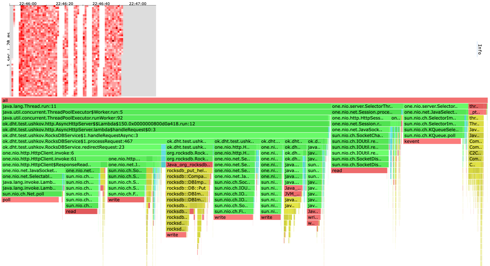
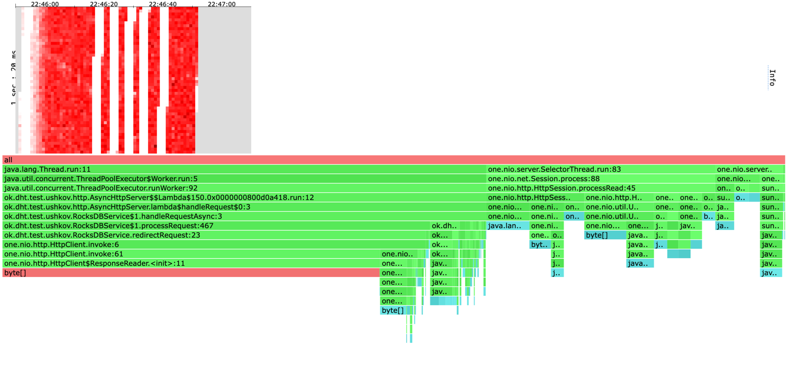
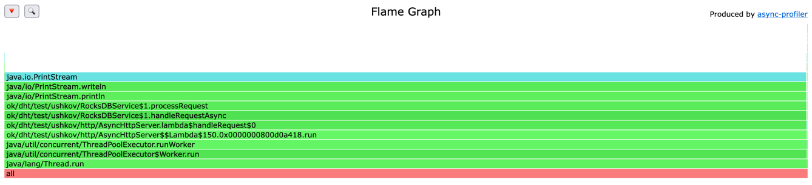
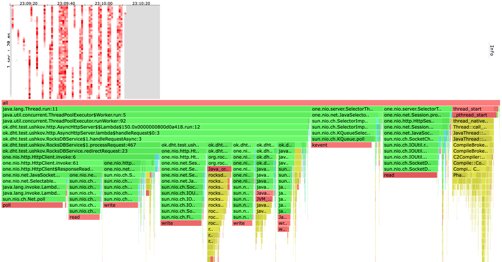
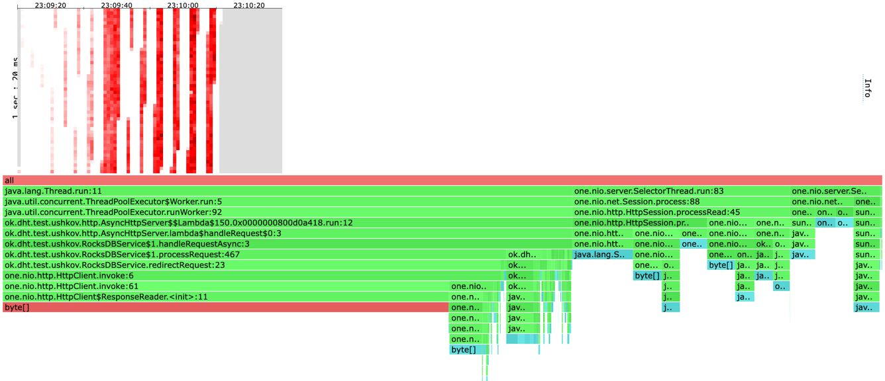
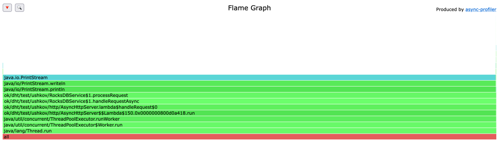

# Отчет

Обратите внимание:
* При профилировании метода GET бд наполнялась 2 млн пар ключ-значение и имела размер 1GB.
* При профилировании метода PUT бд изначально была пустой.
* Скрипты для wrk2: [get](scripts/get.lua) и [put](scripts/put.lua)
* В профилировании использовалось 5 нод, профилировалась та, на которую подается нагрузка.

# Профилирование
## PUT t=4 c=64 R=70000 d=1m
wrk2 output:
```
Running 1m test @ http://localhost:1337
  4 threads and 64 connections
  Thread calibration: mean lat.: 5981.030ms, rate sampling interval: 15015ms
  Thread calibration: mean lat.: 5981.015ms, rate sampling interval: 15015ms
  Thread calibration: mean lat.: 5981.618ms, rate sampling interval: 15015ms
  Thread calibration: mean lat.: 5980.108ms, rate sampling interval: 15015ms
  Thread Stats   Avg      Stdev     Max   +/- Stdev
    Latency    24.43s    12.00s   42.47s    48.97%
    Req/Sec     5.08k     1.70k    7.34k    33.33%
  Latency Distribution (HdrHistogram - Recorded Latency)
 50.000%   23.81s 
 75.000%   37.68s 
 90.000%   40.53s 
 99.000%   42.24s 
 99.900%   42.43s 
 99.990%   42.47s 
 99.999%   42.50s 
100.000%   42.50s 

  Detailed Percentile spectrum:
       Value   Percentile   TotalCount 1/(1-Percentile)

    7770.111     0.000000            4         1.00
    9838.591     0.100000       106539         1.11
   11968.511     0.200000       212905         1.25
   13910.015     0.300000       319156         1.43
   15867.903     0.400000       425419         1.67
   23805.951     0.500000       531967         2.00
   24788.991     0.550000       585292         2.22
   28819.455     0.600000       638335         2.50
   32767.999     0.650000       691438         2.86
   33718.271     0.700000       745097         3.33
   37683.199     0.750000       797477         4.00
   38174.719     0.775000       825027         4.44
   38633.471     0.800000       850613         5.00
   39092.223     0.825000       876749         5.71
   39583.743     0.850000       903943         6.67
   40042.495     0.875000       929994         8.00
   40271.871     0.887500       943240         8.89
   40534.015     0.900000       958273        10.00
   40763.391     0.912500       970724        11.43
   40992.767     0.925000       983640        13.33
   41222.143     0.937500       996429        16.00
   41353.215     0.943750      1004228        17.78
   41451.519     0.950000      1009792        20.00
   41582.591     0.956250      1016580        22.86
   41713.663     0.962500      1024125        26.67
   41844.735     0.968750      1030692        32.00
   41910.271     0.971875      1034382        35.56
   41943.039     0.975000      1036254        40.00
   42008.575     0.978125      1040166        45.71
   42074.111     0.981250      1044070        53.33
   42139.647     0.984375      1047887        64.00
   42139.647     0.985938      1047887        71.11
   42172.415     0.987500      1049802        80.00
   42205.183     0.989062      1051651        91.43
   42237.951     0.990625      1053545       106.67
   42270.719     0.992188      1055525       128.00
   42270.719     0.992969      1055525       142.22
   42303.487     0.993750      1057422       160.00
   42303.487     0.994531      1057422       182.86
   42336.255     0.995313      1059117       213.33
   42336.255     0.996094      1059117       256.00
   42336.255     0.996484      1059117       284.44
   42369.023     0.996875      1060551       320.00
   42369.023     0.997266      1060551       365.71
   42369.023     0.997656      1060551       426.67
   42401.791     0.998047      1061587       512.00
   42401.791     0.998242      1061587       568.89
   42401.791     0.998437      1061587       640.00
   42401.791     0.998633      1061587       731.43
   42401.791     0.998828      1061587       853.33
   42434.559     0.999023      1062261      1024.00
   42434.559     0.999121      1062261      1137.78
   42434.559     0.999219      1062261      1280.00
   42434.559     0.999316      1062261      1462.86
   42434.559     0.999414      1062261      1706.67
   42434.559     0.999512      1062261      2048.00
   42434.559     0.999561      1062261      2275.56
   42467.327     0.999609      1062597      2560.00
   42467.327     0.999658      1062597      2925.71
   42467.327     0.999707      1062597      3413.33
   42467.327     0.999756      1062597      4096.00
   42467.327     0.999780      1062597      4551.11
   42467.327     0.999805      1062597      5120.00
   42467.327     0.999829      1062597      5851.43
   42467.327     0.999854      1062597      6826.67
   42467.327     0.999878      1062597      8192.00
   42467.327     0.999890      1062597      9102.22
   42467.327     0.999902      1062597     10240.00
   42500.095     0.999915      1062692     11702.86
   42500.095     1.000000      1062692          inf
#[Mean    =    24426.847, StdDeviation   =    11997.690]
#[Max     =    42467.328, Total count    =      1062692]
#[Buckets =           27, SubBuckets     =         2048]
----------------------------------------------------------
  1219184 requests in 1.00m, 77.90MB read
  Socket errors: connect 0, read 0, write 0, timeout 64
  Non-2xx or 3xx responses: 160
Requests/sec:  20291.24
Transfer/sec:      1.30MB
```

[cpu heatmap & flame graph](profiles/2022-10-12-22-46-01_5nodes_put_t4_c64_R70000_d1m/cpu.html)


[alloc heatmap & flame graph](profiles/2022-10-12-22-46-01_5nodes_put_t4_c64_R70000_d1m/alloc.html)


[lock flame graph](profiles/2022-10-12-22-46-01_5nodes_put_t4_c64_R70000_d1m/lock.html)


## GET t=4 c=64 R=70000 d=1m
wrk2 output:
```
Running 1m test @ http://localhost:1337
  4 threads and 64 connections
  Thread calibration: mean lat.: 8232.611ms, rate sampling interval: 19709ms
  Thread calibration: mean lat.: 8228.876ms, rate sampling interval: 19709ms
  Thread calibration: mean lat.: 8246.610ms, rate sampling interval: 19709ms
  Thread calibration: mean lat.: 8226.287ms, rate sampling interval: 19709ms
  Thread Stats   Avg      Stdev     Max   +/- Stdev
    Latency    35.47s    10.68s    0.85m    60.79%
    Req/Sec     2.24k    39.51     2.28k    62.50%
  Latency Distribution (HdrHistogram - Recorded Latency)
 50.000%   37.55s 
 75.000%   45.94s 
 90.000%   50.33s 
 99.000%    0.85m 
 99.900%    0.85m 
 99.990%    0.85m 
 99.999%    0.85m 
100.000%    0.85m 

  Detailed Percentile spectrum:
       Value   Percentile   TotalCount 1/(1-Percentile)

    9863.167     0.000000            8         1.00
   21053.439     0.100000        49447         1.11
   25214.975     0.200000        99084         1.25
   26296.319     0.300000       148703         1.43
   33357.823     0.400000       197968         1.67
   37552.127     0.500000       246967         2.00
   38010.879     0.550000       273558         2.22
   38404.095     0.600000       297199         2.50
   41811.967     0.650000       321281         2.86
   42467.327     0.700000       346326         3.33
   45940.735     0.750000       371065         4.00
   46170.111     0.775000       384065         4.44
   46366.719     0.800000       397312         5.00
   46530.559     0.825000       407458         5.71
   46759.935     0.850000       421719         6.67
   50069.503     0.875000       432674         8.00
   50200.575     0.887500       438336         8.89
   50331.647     0.900000       444508        10.00
   50462.719     0.912500       452410        11.43
   50561.023     0.925000       458232        13.33
   50659.327     0.937500       463697        16.00
   50724.863     0.943750       466227        17.78
   50823.167     0.950000       471055        20.00
   50855.935     0.956250       473155        22.86
   50888.703     0.962500       475349        26.67
   50954.239     0.968750       479555        32.00
   50987.007     0.971875       481245        35.56
   51019.775     0.975000       482770        40.00
   51052.543     0.978125       484503        45.71
   51085.311     0.981250       486376        53.33
   51085.311     0.984375       486376        64.00
   51118.079     0.985938       488237        71.11
   51118.079     0.987500       488237        80.00
   51150.847     0.989062       490230        91.43
   51150.847     0.990625       490230       106.67
   51150.847     0.992188       490230       128.00
   51183.615     0.992969       492171       142.22
   51183.615     0.993750       492171       160.00
   51183.615     0.994531       492171       182.86
   51183.615     0.995313       492171       213.33
   51183.615     0.996094       492171       256.00
   51183.615     0.996484       492171       284.44
   51216.383     0.996875       493468       320.00
   51216.383     0.997266       493468       365.71
   51216.383     0.997656       493468       426.67
   51216.383     0.998047       493468       512.00
   51216.383     0.998242       493468       568.89
   51216.383     0.998437       493468       640.00
   51216.383     0.998633       493468       731.43
   51216.383     0.998828       493468       853.33
   51216.383     0.999023       493468      1024.00
   51216.383     0.999121       493468      1137.78
   51249.151     0.999219       493850      1280.00
   51249.151     0.999316       493850      1462.86
   51249.151     0.999414       493850      1706.67
   51249.151     0.999512       493850      2048.00
   51249.151     0.999561       493850      2275.56
   51249.151     0.999609       493850      2560.00
   51249.151     0.999658       493850      2925.71
   51249.151     0.999707       493850      3413.33
   51249.151     0.999756       493850      4096.00
   51249.151     0.999780       493850      4551.11
   51249.151     0.999805       493850      5120.00
   51249.151     0.999829       493850      5851.43
   51249.151     0.999854       493850      6826.67
   51249.151     0.999878       493850      8192.00
   51249.151     0.999890       493850      9102.22
   51249.151     0.999902       493850     10240.00
   51249.151     0.999915       493850     11702.86
   51249.151     0.999927       493850     13653.33
   51249.151     0.999939       493850     16384.00
   51249.151     0.999945       493850     18204.44
   51249.151     0.999951       493850     20480.00
   51249.151     0.999957       493850     23405.71
   51249.151     0.999963       493850     27306.67
   51249.151     0.999969       493850     32768.00
   51249.151     0.999973       493850     36408.89
   51249.151     0.999976       493850     40960.00
   51249.151     0.999979       493850     46811.43
   51249.151     0.999982       493850     54613.33
   51281.919     0.999985       493859     65536.00
   51281.919     1.000000       493859          inf
#[Mean    =    35472.631, StdDeviation   =    10679.058]
#[Max     =    51249.152, Total count    =       493859]
#[Buckets =           27, SubBuckets     =         2048]
----------------------------------------------------------
  504241 requests in 1.00m, 32.28MB read
  Socket errors: connect 0, read 0, write 0, timeout 576
  Non-2xx or 3xx responses: 121
Requests/sec:   8391.06
Transfer/sec:    550.01KB
```

[cpu heatmap & flame graph](profiles/2022-10-12-23-09-20_5nodes_get_t4_c64_R70000_d1m/cpu.html)


[alloc heatmap & flame graph](profiles/2022-10-12-23-09-20_5nodes_get_t4_c64_R70000_d1m/alloc.html)


[lock flame graph](profiles/2022-10-12-23-09-20_5nodes_get_t4_c64_R70000_d1m/lock.html)


## Выводы
* При PUT больше 50% аллокаций делается при проксировании запроса другой ноде. 
Сократить скорее всего не получится, все аллокации происходят непосредственно внутри метода one.nio.HttpClient.invoke.
* При PUT 30% времени тратится на проксирование. 
Возможно это можно делать асинхронно и не ждать ответа от другой ноды.
* С GET все аналогично. При GET 55% аллокаций приходятся на one.nio.HttpClient.invoke.
* При GET 31% времени тратится на проксирование.
