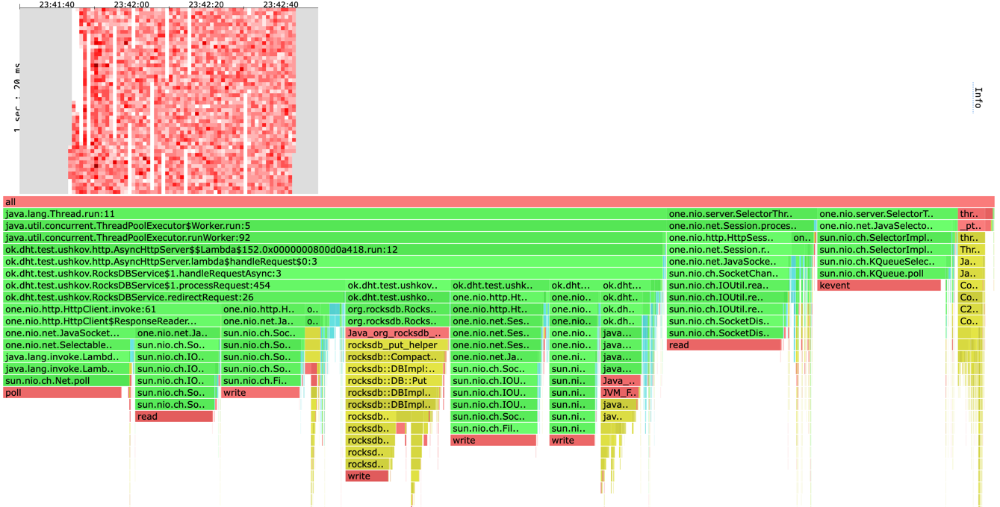
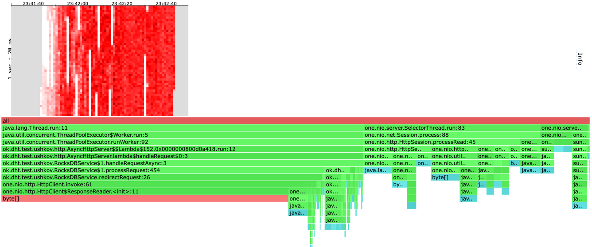
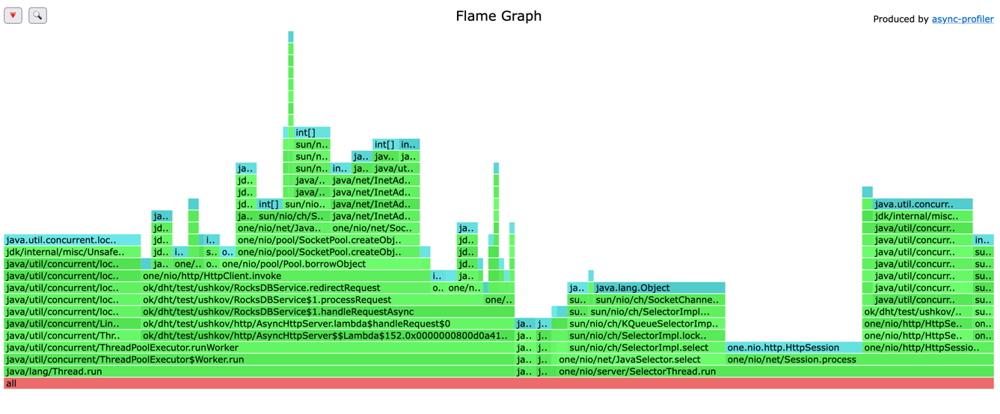
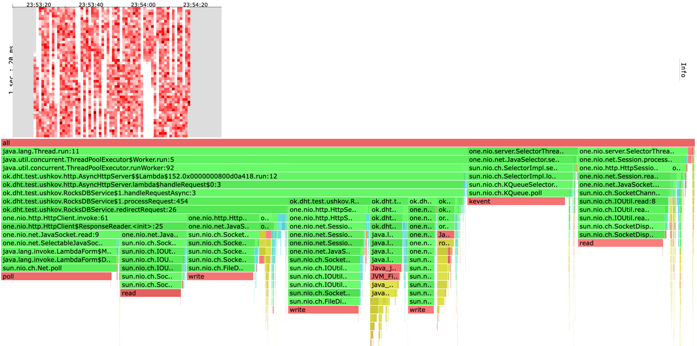
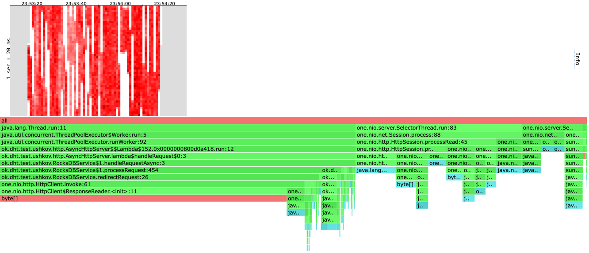
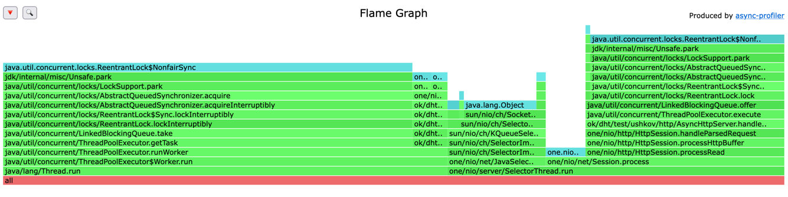

# Отчет

Обратите внимание:
* При профилировании метода GET бд наполнялась 2 млн пар ключ-значение и имела размер 1GB.
* При профилировании метода PUT бд изначально была пустой.
* Скрипты для wrk2: [get](scripts/get.lua) и [put](scripts/put.lua)
* В профилировании использовалось 5 нод, профилировалась та, на которую подается нагрузка.

# Профилирование
## PUT t=4 c=64 R=70000 d=1m
wrk2 output:
```
Running 1m test @ http://localhost:1337
  4 threads and 64 connections
  Thread calibration: mean lat.: 5981.030ms, rate sampling interval: 15015ms
  Thread calibration: mean lat.: 5981.015ms, rate sampling interval: 15015ms
  Thread calibration: mean lat.: 5981.618ms, rate sampling interval: 15015ms
  Thread calibration: mean lat.: 5980.108ms, rate sampling interval: 15015ms
  Thread Stats   Avg      Stdev     Max   +/- Stdev
    Latency    24.43s    12.00s   42.47s    48.97%
    Req/Sec     5.08k     1.70k    7.34k    33.33%
  Latency Distribution (HdrHistogram - Recorded Latency)
 50.000%   23.81s 
 75.000%   37.68s 
 90.000%   40.53s 
 99.000%   42.24s 
 99.900%   42.43s 
 99.990%   42.47s 
 99.999%   42.50s 
100.000%   42.50s 

  Detailed Percentile spectrum:
       Value   Percentile   TotalCount 1/(1-Percentile)

    7770.111     0.000000            4         1.00
    9838.591     0.100000       106539         1.11
   11968.511     0.200000       212905         1.25
   13910.015     0.300000       319156         1.43
   15867.903     0.400000       425419         1.67
   23805.951     0.500000       531967         2.00
   24788.991     0.550000       585292         2.22
   28819.455     0.600000       638335         2.50
   32767.999     0.650000       691438         2.86
   33718.271     0.700000       745097         3.33
   37683.199     0.750000       797477         4.00
   38174.719     0.775000       825027         4.44
   38633.471     0.800000       850613         5.00
   39092.223     0.825000       876749         5.71
   39583.743     0.850000       903943         6.67
   40042.495     0.875000       929994         8.00
   40271.871     0.887500       943240         8.89
   40534.015     0.900000       958273        10.00
   40763.391     0.912500       970724        11.43
   40992.767     0.925000       983640        13.33
   41222.143     0.937500       996429        16.00
   41353.215     0.943750      1004228        17.78
   41451.519     0.950000      1009792        20.00
   41582.591     0.956250      1016580        22.86
   41713.663     0.962500      1024125        26.67
   41844.735     0.968750      1030692        32.00
   41910.271     0.971875      1034382        35.56
   41943.039     0.975000      1036254        40.00
   42008.575     0.978125      1040166        45.71
   42074.111     0.981250      1044070        53.33
   42139.647     0.984375      1047887        64.00
   42139.647     0.985938      1047887        71.11
   42172.415     0.987500      1049802        80.00
   42205.183     0.989062      1051651        91.43
   42237.951     0.990625      1053545       106.67
   42270.719     0.992188      1055525       128.00
   42270.719     0.992969      1055525       142.22
   42303.487     0.993750      1057422       160.00
   42303.487     0.994531      1057422       182.86
   42336.255     0.995313      1059117       213.33
   42336.255     0.996094      1059117       256.00
   42336.255     0.996484      1059117       284.44
   42369.023     0.996875      1060551       320.00
   42369.023     0.997266      1060551       365.71
   42369.023     0.997656      1060551       426.67
   42401.791     0.998047      1061587       512.00
   42401.791     0.998242      1061587       568.89
   42401.791     0.998437      1061587       640.00
   42401.791     0.998633      1061587       731.43
   42401.791     0.998828      1061587       853.33
   42434.559     0.999023      1062261      1024.00
   42434.559     0.999121      1062261      1137.78
   42434.559     0.999219      1062261      1280.00
   42434.559     0.999316      1062261      1462.86
   42434.559     0.999414      1062261      1706.67
   42434.559     0.999512      1062261      2048.00
   42434.559     0.999561      1062261      2275.56
   42467.327     0.999609      1062597      2560.00
   42467.327     0.999658      1062597      2925.71
   42467.327     0.999707      1062597      3413.33
   42467.327     0.999756      1062597      4096.00
   42467.327     0.999780      1062597      4551.11
   42467.327     0.999805      1062597      5120.00
   42467.327     0.999829      1062597      5851.43
   42467.327     0.999854      1062597      6826.67
   42467.327     0.999878      1062597      8192.00
   42467.327     0.999890      1062597      9102.22
   42467.327     0.999902      1062597     10240.00
   42500.095     0.999915      1062692     11702.86
   42500.095     1.000000      1062692          inf
#[Mean    =    24426.847, StdDeviation   =    11997.690]
#[Max     =    42467.328, Total count    =      1062692]
#[Buckets =           27, SubBuckets     =         2048]
----------------------------------------------------------
  1219184 requests in 1.00m, 77.90MB read
  Socket errors: connect 0, read 0, write 0, timeout 64
  Non-2xx or 3xx responses: 160
Requests/sec:  20291.24
Transfer/sec:      1.30MB
```

[cpu heatmap & flame graph](profiles/2022-10-12-22-46-01_5nodes_put_t4_c64_R70000_d1m/cpu.html)


[alloc heatmap & flame graph](profiles/2022-10-12-22-46-01_5nodes_put_t4_c64_R70000_d1m/alloc.html)


[lock flame graph](profiles/2022-10-12-22-46-01_5nodes_put_t4_c64_R70000_d1m/lock.html)


## GET t=4 c=64 R=70000 d=1m
wrk2 output:
```
Running 1m test @ http://localhost:1337
  4 threads and 64 connections
  Thread calibration: mean lat.: 8232.611ms, rate sampling interval: 19709ms
  Thread calibration: mean lat.: 8228.876ms, rate sampling interval: 19709ms
  Thread calibration: mean lat.: 8246.610ms, rate sampling interval: 19709ms
  Thread calibration: mean lat.: 8226.287ms, rate sampling interval: 19709ms
  Thread Stats   Avg      Stdev     Max   +/- Stdev
    Latency    35.47s    10.68s    0.85m    60.79%
    Req/Sec     2.24k    39.51     2.28k    62.50%
  Latency Distribution (HdrHistogram - Recorded Latency)
 50.000%   37.55s 
 75.000%   45.94s 
 90.000%   50.33s 
 99.000%    0.85m 
 99.900%    0.85m 
 99.990%    0.85m 
 99.999%    0.85m 
100.000%    0.85m 

  Detailed Percentile spectrum:
       Value   Percentile   TotalCount 1/(1-Percentile)

    9863.167     0.000000            8         1.00
   21053.439     0.100000        49447         1.11
   25214.975     0.200000        99084         1.25
   26296.319     0.300000       148703         1.43
   33357.823     0.400000       197968         1.67
   37552.127     0.500000       246967         2.00
   38010.879     0.550000       273558         2.22
   38404.095     0.600000       297199         2.50
   41811.967     0.650000       321281         2.86
   42467.327     0.700000       346326         3.33
   45940.735     0.750000       371065         4.00
   46170.111     0.775000       384065         4.44
   46366.719     0.800000       397312         5.00
   46530.559     0.825000       407458         5.71
   46759.935     0.850000       421719         6.67
   50069.503     0.875000       432674         8.00
   50200.575     0.887500       438336         8.89
   50331.647     0.900000       444508        10.00
   50462.719     0.912500       452410        11.43
   50561.023     0.925000       458232        13.33
   50659.327     0.937500       463697        16.00
   50724.863     0.943750       466227        17.78
   50823.167     0.950000       471055        20.00
   50855.935     0.956250       473155        22.86
   50888.703     0.962500       475349        26.67
   50954.239     0.968750       479555        32.00
   50987.007     0.971875       481245        35.56
   51019.775     0.975000       482770        40.00
   51052.543     0.978125       484503        45.71
   51085.311     0.981250       486376        53.33
   51085.311     0.984375       486376        64.00
   51118.079     0.985938       488237        71.11
   51118.079     0.987500       488237        80.00
   51150.847     0.989062       490230        91.43
   51150.847     0.990625       490230       106.67
   51150.847     0.992188       490230       128.00
   51183.615     0.992969       492171       142.22
   51183.615     0.993750       492171       160.00
   51183.615     0.994531       492171       182.86
   51183.615     0.995313       492171       213.33
   51183.615     0.996094       492171       256.00
   51183.615     0.996484       492171       284.44
   51216.383     0.996875       493468       320.00
   51216.383     0.997266       493468       365.71
   51216.383     0.997656       493468       426.67
   51216.383     0.998047       493468       512.00
   51216.383     0.998242       493468       568.89
   51216.383     0.998437       493468       640.00
   51216.383     0.998633       493468       731.43
   51216.383     0.998828       493468       853.33
   51216.383     0.999023       493468      1024.00
   51216.383     0.999121       493468      1137.78
   51249.151     0.999219       493850      1280.00
   51249.151     0.999316       493850      1462.86
   51249.151     0.999414       493850      1706.67
   51249.151     0.999512       493850      2048.00
   51249.151     0.999561       493850      2275.56
   51249.151     0.999609       493850      2560.00
   51249.151     0.999658       493850      2925.71
   51249.151     0.999707       493850      3413.33
   51249.151     0.999756       493850      4096.00
   51249.151     0.999780       493850      4551.11
   51249.151     0.999805       493850      5120.00
   51249.151     0.999829       493850      5851.43
   51249.151     0.999854       493850      6826.67
   51249.151     0.999878       493850      8192.00
   51249.151     0.999890       493850      9102.22
   51249.151     0.999902       493850     10240.00
   51249.151     0.999915       493850     11702.86
   51249.151     0.999927       493850     13653.33
   51249.151     0.999939       493850     16384.00
   51249.151     0.999945       493850     18204.44
   51249.151     0.999951       493850     20480.00
   51249.151     0.999957       493850     23405.71
   51249.151     0.999963       493850     27306.67
   51249.151     0.999969       493850     32768.00
   51249.151     0.999973       493850     36408.89
   51249.151     0.999976       493850     40960.00
   51249.151     0.999979       493850     46811.43
   51249.151     0.999982       493850     54613.33
   51281.919     0.999985       493859     65536.00
   51281.919     1.000000       493859          inf
#[Mean    =    35472.631, StdDeviation   =    10679.058]
#[Max     =    51249.152, Total count    =       493859]
#[Buckets =           27, SubBuckets     =         2048]
----------------------------------------------------------
  504241 requests in 1.00m, 32.28MB read
  Socket errors: connect 0, read 0, write 0, timeout 576
  Non-2xx or 3xx responses: 121
Requests/sec:   8391.06
Transfer/sec:    550.01KB
```

[cpu heatmap & flame graph](profiles/2022-10-12-23-09-20_5nodes_get_t4_c64_R70000_d1m/cpu.html)


[alloc heatmap & flame graph](profiles/2022-10-12-23-09-20_5nodes_get_t4_c64_R70000_d1m/alloc.html)


[lock flame graph](profiles/2022-10-12-23-09-20_5nodes_get_t4_c64_R70000_d1m/lock.html)


## Выводы
* При PUT больше 50% аллокаций делается при проксировании запроса другой ноде. 
Сократить скорее всего не получится, все аллокации происходят непосредственно внутри метода one.nio.HttpClient.invoke.
Только если использовать другой клиент.
* При PUT 30% времени тратится на проксирование. 
Возможно это можно делать асинхронно и не ждать ответа от другой ноды.
* С GET все аналогично. При GET 55% аллокаций приходятся на one.nio.HttpClient.invoke.
* При GET 31% времени тратится на проксирование.
* Сильно упал RPS (примерно на 50-60%). Это неудивительно, ведь мы запускаем все на одном
железном хосте. Плюс, по сравнению с предыдущей версией мы получили оверхед из-за походов по сети
в другие ноды. Чтобы этого избежать, нужно запускать на разных железных хостах и использовать
другой протокол для общения нод.
* Для равномерного распределения ключей по нодам использовался ConsistentHashing.
Изначально внутри использовалась наивная хеш-функция, из-за чего ключа распределялись очень
неравномерно, в этом отчете описывается версия с использованием SHA-256 для хеширования ключей
(TODO: сделать исследование на тему того, почему исходная хеш-функция была плоха).

# Добавление таймаута на проксирование запроса

# Профилирование
## PUT t=4 c=64 R=70000 d=1m
wrk2 output:
```
Running 1m test @ http://localhost:1337
  4 threads and 64 connections
  Thread calibration: mean lat.: 5420.894ms, rate sampling interval: 14860ms
  Thread calibration: mean lat.: 5417.509ms, rate sampling interval: 14860ms
  Thread calibration: mean lat.: 5423.202ms, rate sampling interval: 14868ms
  Thread calibration: mean lat.: 5417.341ms, rate sampling interval: 14852ms
  Thread Stats   Avg      Stdev     Max   +/- Stdev
    Latency    23.84s     8.39s   37.88s    58.50%
    Req/Sec     6.91k   491.77     7.36k    66.67%
  Latency Distribution (HdrHistogram - Recorded Latency)
 50.000%   24.23s 
 75.000%   31.29s 
 90.000%   35.09s 
 99.000%   37.58s 
 99.900%   37.81s 
 99.990%   37.85s 
 99.999%   37.88s 
100.000%   37.91s 

  Detailed Percentile spectrum:
       Value   Percentile   TotalCount 1/(1-Percentile)

    7716.863     0.000000            3         1.00
   11509.759     0.100000       139096         1.11
   15130.623     0.200000       278136         1.25
   18743.295     0.300000       417471         1.43
   21790.719     0.400000       556400         1.67
   24231.935     0.500000       694950         2.00
   25526.271     0.550000       764524         2.22
   26820.607     0.600000       834133         2.50
   28114.943     0.650000       903583         2.86
   29392.895     0.700000       973131         3.33
   31293.439     0.750000      1043029         4.00
   31899.647     0.775000      1077656         4.44
   32489.471     0.800000      1112207         5.00
   33095.679     0.825000      1147129         5.71
   33718.271     0.850000      1181610         6.67
   34406.399     0.875000      1217158         8.00
   34766.847     0.887500      1234739         8.89
   35094.527     0.900000      1251126        10.00
   35454.975     0.912500      1268635        11.43
   35815.423     0.925000      1286202        13.33
   36143.103     0.937500      1302976        16.00
   36339.711     0.943750      1313024        17.78
   36503.551     0.950000      1321378        20.00
   36667.391     0.956250      1329938        22.86
   36831.231     0.962500      1338653        26.67
   36995.071     0.968750      1347332        32.00
   37060.607     0.971875      1350803        35.56
   37158.911     0.975000      1355943        40.00
   37224.447     0.978125      1359204        45.71
   37322.751     0.981250      1364124        53.33
   37421.055     0.984375      1369012        64.00
   37453.823     0.985938      1370580        71.11
   37486.591     0.987500      1372175        80.00
   37552.127     0.989062      1375281        91.43
   37584.895     0.990625      1376805       106.67
   37650.431     0.992188      1380164       128.00
   37650.431     0.992969      1380164       142.22
   37683.199     0.993750      1382019       160.00
   37683.199     0.994531      1382019       182.86
   37715.967     0.995313      1383863       213.33
   37748.735     0.996094      1385681       256.00
   37748.735     0.996484      1385681       284.44
   37748.735     0.996875      1385681       320.00
   37781.503     0.997266      1387368       365.71
   37781.503     0.997656      1387368       426.67
   37781.503     0.998047      1387368       512.00
   37781.503     0.998242      1387368       568.89
   37781.503     0.998437      1387368       640.00
   37814.271     0.998633      1388603       731.43
   37814.271     0.998828      1388603       853.33
   37814.271     0.999023      1388603      1024.00
   37814.271     0.999121      1388603      1137.78
   37814.271     0.999219      1388603      1280.00
   37814.271     0.999316      1388603      1462.86
   37847.039     0.999414      1389387      1706.67
   37847.039     0.999512      1389387      2048.00
   37847.039     0.999561      1389387      2275.56
   37847.039     0.999609      1389387      2560.00
   37847.039     0.999658      1389387      2925.71
   37847.039     0.999707      1389387      3413.33
   37847.039     0.999756      1389387      4096.00
   37847.039     0.999780      1389387      4551.11
   37847.039     0.999805      1389387      5120.00
   37847.039     0.999829      1389387      5851.43
   37847.039     0.999854      1389387      6826.67
   37847.039     0.999878      1389387      8192.00
   37847.039     0.999890      1389387      9102.22
   37847.039     0.999902      1389387     10240.00
   37879.807     0.999915      1389517     11702.86
   37879.807     0.999927      1389517     13653.33
   37879.807     0.999939      1389517     16384.00
   37879.807     0.999945      1389517     18204.44
   37879.807     0.999951      1389517     20480.00
   37879.807     0.999957      1389517     23405.71
   37879.807     0.999963      1389517     27306.67
   37879.807     0.999969      1389517     32768.00
   37879.807     0.999973      1389517     36408.89
   37879.807     0.999976      1389517     40960.00
   37879.807     0.999979      1389517     46811.43
   37879.807     0.999982      1389517     54613.33
   37879.807     0.999985      1389517     65536.00
   37879.807     0.999986      1389517     72817.78
   37879.807     0.999988      1389517     81920.00
   37879.807     0.999989      1389517     93622.86
   37879.807     0.999991      1389517    109226.67
   37879.807     0.999992      1389517    131072.00
   37879.807     0.999993      1389517    145635.56
   37879.807     0.999994      1389517    163840.00
   37879.807     0.999995      1389517    187245.71
   37879.807     0.999995      1389517    218453.33
   37879.807     0.999996      1389517    262144.00
   37879.807     0.999997      1389517    291271.11
   37879.807     0.999997      1389517    327680.00
   37879.807     0.999997      1389517    374491.43
   37879.807     0.999998      1389517    436906.67
   37879.807     0.999998      1389517    524288.00
   37879.807     0.999998      1389517    582542.22
   37879.807     0.999998      1389517    655360.00
   37879.807     0.999999      1389517    748982.86
   37879.807     0.999999      1389517    873813.33
   37879.807     0.999999      1389517   1048576.00
   37879.807     0.999999      1389517   1165084.44
   37879.807     0.999999      1389517   1310720.00
   37912.575     0.999999      1389518   1497965.71
   37912.575     1.000000      1389518          inf
#[Mean    =    23843.712, StdDeviation   =     8386.732]
#[Max     =    37879.808, Total count    =      1389518]
#[Buckets =           27, SubBuckets     =         2048]
----------------------------------------------------------
  1549693 requests in 1.00m, 99.02MB read
  Non-2xx or 3xx responses: 293
Requests/sec:  25828.54
Transfer/sec:      1.65MB
```

[cpu heatmap & flame graph](profiles/2022-10-18-23-41-53_add_timeout_put_t4_c64_R70000_d1m/cpu.html)


[alloc heatmap & flame graph](profiles/2022-10-18-23-41-53_add_timeout_put_t4_c64_R70000_d1m/alloc.html)


[lock flame graph](profiles/2022-10-18-23-41-53_add_timeout_put_t4_c64_R70000_d1m/lock.html)


## GET t=4 c=64 R=70000 d=1m
wrk2 output:
```
Running 1m test @ http://localhost:1337
  4 threads and 64 connections
  Thread calibration: mean lat.: 3372.595ms, rate sampling interval: 12124ms
  Thread calibration: mean lat.: 3371.272ms, rate sampling interval: 12115ms
  Thread calibration: mean lat.: 3371.872ms, rate sampling interval: 12115ms
  Thread calibration: mean lat.: 3371.042ms, rate sampling interval: 12115ms
  Thread Stats   Avg      Stdev     Max   +/- Stdev
    Latency    24.44s     9.56s   39.32s    61.38%
    Req/Sec     6.04k   710.61     7.02k    50.00%
  Latency Distribution (HdrHistogram - Recorded Latency)
 50.000%   25.03s 
 75.000%   33.10s 
 90.000%   36.86s 
 99.000%   39.12s 
 99.900%   39.29s 
 99.990%   39.32s 
 99.999%   39.32s 
100.000%   39.35s 

  Detailed Percentile spectrum:
       Value   Percentile   TotalCount 1/(1-Percentile)

    7090.175     0.000000            4         1.00
    8921.087     0.100000       120048         1.11
   14983.167     0.200000       239953         1.25
   19873.791     0.300000       360245         1.43
   22577.151     0.400000       479899         1.67
   25034.751     0.500000       599650         2.00
   25919.487     0.550000       659843         2.22
   26853.375     0.600000       719549         2.50
   29687.807     0.650000       780306         2.86
   31719.423     0.700000       840304         3.33
   33095.679     0.750000       899352         4.00
   33456.127     0.775000       929508         4.44
   33849.343     0.800000       959867         5.00
   34242.559     0.825000       991074         5.71
   35356.671     0.850000      1020181         6.67
   36438.015     0.875000      1049739         8.00
   36667.391     0.887500      1065338         8.89
   36863.999     0.900000      1079296        10.00
   37126.143     0.912500      1096204        11.43
   37322.751     0.925000      1109725        13.33
   37552.127     0.937500      1125714        16.00
   38273.023     0.943750      1133268        17.78
   38404.095     0.950000      1139912        20.00
   38535.167     0.956250      1148659        22.86
   38633.471     0.962500      1155326        26.67
   38731.775     0.968750      1162635        32.00
   38797.311     0.971875      1167183        35.56
   38830.079     0.975000      1169452        40.00
   38895.615     0.978125      1173509        45.71
   38961.151     0.981250      1177631        53.33
   39026.687     0.984375      1180735        64.00
   39059.455     0.985938      1182792        71.11
   39092.223     0.987500      1185116        80.00
   39124.991     0.989062      1187483        91.43
   39157.759     0.990625      1189660       106.67
   39190.527     0.992188      1191830       128.00
   39190.527     0.992969      1191830       142.22
   39190.527     0.993750      1191830       160.00
   39223.295     0.994531      1194155       182.86
   39223.295     0.995313      1194155       213.33
   39256.063     0.996094      1196314       256.00
   39256.063     0.996484      1196314       284.44
   39256.063     0.996875      1196314       320.00
   39256.063     0.997266      1196314       365.71
   39256.063     0.997656      1196314       426.67
   39288.831     0.998047      1198476       512.00
   39288.831     0.998242      1198476       568.89
   39288.831     0.998437      1198476       640.00
   39288.831     0.998633      1198476       731.43
   39288.831     0.998828      1198476       853.33
   39288.831     0.999023      1198476      1024.00
   39288.831     0.999121      1198476      1137.78
   39288.831     0.999219      1198476      1280.00
   39288.831     0.999316      1198476      1462.86
   39288.831     0.999414      1198476      1706.67
   39321.599     0.999512      1199100      2048.00
   39321.599     0.999561      1199100      2275.56
   39321.599     0.999609      1199100      2560.00
   39321.599     0.999658      1199100      2925.71
   39321.599     0.999707      1199100      3413.33
   39321.599     0.999756      1199100      4096.00
   39321.599     0.999780      1199100      4551.11
   39321.599     0.999805      1199100      5120.00
   39321.599     0.999829      1199100      5851.43
   39321.599     0.999854      1199100      6826.67
   39321.599     0.999878      1199100      8192.00
   39321.599     0.999890      1199100      9102.22
   39321.599     0.999902      1199100     10240.00
   39321.599     0.999915      1199100     11702.86
   39321.599     0.999927      1199100     13653.33
   39321.599     0.999939      1199100     16384.00
   39321.599     0.999945      1199100     18204.44
   39321.599     0.999951      1199100     20480.00
   39321.599     0.999957      1199100     23405.71
   39321.599     0.999963      1199100     27306.67
   39321.599     0.999969      1199100     32768.00
   39321.599     0.999973      1199100     36408.89
   39321.599     0.999976      1199100     40960.00
   39321.599     0.999979      1199100     46811.43
   39321.599     0.999982      1199100     54613.33
   39321.599     0.999985      1199100     65536.00
   39321.599     0.999986      1199100     72817.78
   39321.599     0.999988      1199100     81920.00
   39321.599     0.999989      1199100     93622.86
   39321.599     0.999991      1199100    109226.67
   39321.599     0.999992      1199100    131072.00
   39321.599     0.999993      1199100    145635.56
   39321.599     0.999994      1199100    163840.00
   39321.599     0.999995      1199100    187245.71
   39354.367     0.999995      1199106    218453.33
   39354.367     1.000000      1199106          inf
#[Mean    =    24435.925, StdDeviation   =     9558.233]
#[Max     =    39321.600, Total count    =      1199106]
#[Buckets =           27, SubBuckets     =         2048]
----------------------------------------------------------
  1405150 requests in 1.00m, 85.69MB read
  Non-2xx or 3xx responses: 11473
Requests/sec:  23417.43
Transfer/sec:      1.43MB
```

[cpu heatmap & flame graph](profiles/2022-10-18-23-53-28_add_timeout_get_t4_c64_R70000_d1m/cpu.html)


[alloc heatmap & flame graph](profiles/2022-10-18-23-53-28_add_timeout_get_t4_c64_R70000_d1m/alloc.html)


[lock flame graph](profiles/2022-10-18-23-53-28_add_timeout_get_t4_c64_R70000_d1m/lock.html)


## Выводы
* При добавление таймаута на проксирование запроса другой ноде
RPS вырос при PUT запросе на 30% (с 20000 до 26000), 
при GET в 1.8 раза (с 8000 до 23000).
* Процент времени внутри HttpClient упал до 8-10% (было 30%).
* Сильно вырос процент не 2xx запросов (при GET было 0.02%, стало 0.8%).
Однако это количество все еще остается незначительным. 
