# Отчет

В данном стейдже мной был взят алгоритм
с разбора дз про шардирования и дополнен таким образом, чтобы уметь
работать с несколькими репликами.

# Профилирование

Профилирование без использование репликаций показывает, что реализация сильно замедлилась.
Связано это с тем, что по сравнению с предыдущей реализацией появилась логика для:

* Поддержки репликаций
* Решения проблемы с болеющей нодой, которая тормозит всех остальных

Наблюдается также значительное количество не 2xx и 3xx запросов, что связано
с ограниченностью очередей.

## PUT t=4 c=64 R=10000 d=1m
Из-за
wrk2 output:
```
Running 1m test @ http://localhost:1337
  4 threads and 64 connections
  Thread calibration: mean lat.: 1330.255ms, rate sampling interval: 7970ms
  Thread calibration: mean lat.: 1342.641ms, rate sampling interval: 8019ms
  Thread calibration: mean lat.: 1343.574ms, rate sampling interval: 8011ms
  Thread calibration: mean lat.: 1360.425ms, rate sampling interval: 8105ms
  Thread Stats   Avg      Stdev     Max   +/- Stdev
    Latency    24.02s     9.88s   41.58s    58.03%
    Req/Sec   722.54    272.56     1.26k    66.67%
  Latency Distribution (HdrHistogram - Recorded Latency)
 50.000%   25.36s 
 75.000%   31.80s 
 90.000%   37.39s 
 99.000%   40.80s 
 99.900%   41.29s 
 99.990%   41.48s 
 99.999%   41.58s 
100.000%   41.62s 

  Detailed Percentile spectrum:
       Value   Percentile   TotalCount 1/(1-Percentile)

    5361.663     0.000000            1         1.00
    9666.559     0.100000        14415         1.11
   13238.271     0.200000        28792         1.25
   17186.815     0.300000        43228         1.43
   25018.367     0.400000        58042         1.67
   25362.431     0.500000        72415         2.00
   25526.271     0.550000        79388         2.22
   26279.935     0.600000        86371         2.50
   28114.943     0.650000        93597         2.86
   29982.719     0.700000       100779         3.33
   31801.343     0.750000       107976         4.00
   32718.847     0.775000       111562         4.44
   33685.503     0.800000       115164         5.00
   34635.775     0.825000       118793         5.71
   35586.047     0.850000       122350         6.67
   36503.551     0.875000       126071         8.00
   36896.767     0.887500       127739         8.89
   37388.287     0.900000       129645        10.00
   37847.039     0.912500       131420        11.43
   38305.791     0.925000       133228        13.33
   38764.543     0.937500       134974        16.00
   38993.919     0.943750       135838        17.78
   39256.063     0.950000       136811        20.00
   39485.439     0.956250       137665        22.86
   39747.583     0.962500       138655        26.67
   39976.959     0.968750       139557        32.00
   40075.263     0.971875       139938        35.56
   40206.335     0.975000       140431        40.00
   40304.639     0.978125       140797        45.71
   40435.711     0.981250       141292        53.33
   40566.783     0.984375       141767        64.00
   40632.319     0.985938       142007        71.11
   40697.855     0.987500       142235        80.00
   40763.391     0.989062       142472        91.43
   40796.159     0.990625       142586       106.67
   40861.695     0.992188       142807       128.00
   40927.231     0.992969       143015       142.22
   40959.999     0.993750       143112       160.00
   40992.767     0.994531       143203       182.86
   41025.535     0.995313       143297       213.33
   41058.303     0.996094       143392       256.00
   41091.071     0.996484       143464       284.44
   41123.839     0.996875       143533       320.00
   41156.607     0.997266       143599       365.71
   41156.607     0.997656       143599       426.67
   41189.375     0.998047       143654       512.00
   41222.143     0.998242       143709       568.89
   41222.143     0.998437       143709       640.00
   41254.911     0.998633       143760       731.43
   41287.679     0.998828       143805       853.33
   41287.679     0.999023       143805      1024.00
   41287.679     0.999121       143805      1137.78
   41320.447     0.999219       143836      1280.00
   41320.447     0.999316       143836      1462.86
   41353.215     0.999414       143866      1706.67
   41353.215     0.999512       143866      2048.00
   41385.983     0.999561       143887      2275.56
   41385.983     0.999609       143887      2560.00
   41385.983     0.999658       143887      2925.71
   41418.751     0.999707       143902      3413.33
   41418.751     0.999756       143902      4096.00
   41418.751     0.999780       143902      4551.11
   41451.519     0.999805       143909      5120.00
   41451.519     0.999829       143909      5851.43
   41484.287     0.999854       143917      6826.67
   41484.287     0.999878       143917      8192.00
   41484.287     0.999890       143917      9102.22
   41484.287     0.999902       143917     10240.00
   41517.055     0.999915       143924     11702.86
   41517.055     0.999927       143924     13653.33
   41517.055     0.999939       143924     16384.00
   41517.055     0.999945       143924     18204.44
   41517.055     0.999951       143924     20480.00
   41549.823     0.999957       143928     23405.71
   41549.823     0.999963       143928     27306.67
   41549.823     0.999969       143928     32768.00
   41549.823     0.999973       143928     36408.89
   41549.823     0.999976       143928     40960.00
   41549.823     0.999979       143928     46811.43
   41582.591     0.999982       143930     54613.33
   41582.591     0.999985       143930     65536.00
   41582.591     0.999986       143930     72817.78
   41582.591     0.999988       143930     81920.00
   41582.591     0.999989       143930     93622.86
   41582.591     0.999991       143930    109226.67
   41582.591     0.999992       143930    131072.00
   41615.359     0.999993       143931    145635.56
   41615.359     1.000000       143931          inf
#[Mean    =    24021.223, StdDeviation   =     9881.425]
#[Max     =    41582.592, Total count    =       143931]
#[Buckets =           27, SubBuckets     =         2048]
----------------------------------------------------------
  187689 requests in 1.00m, 16.47MB read
  Socket errors: connect 0, read 0, write 0, timeout 64
  Non-2xx or 3xx responses: 69046
Requests/sec:   3128.09
Transfer/sec:    281.14KB
```

[cpu heatmap & flame graph](profiles/2022-10-26-18-11-11_notag_put_t4_c64_R10000_d1m/cpu.html)
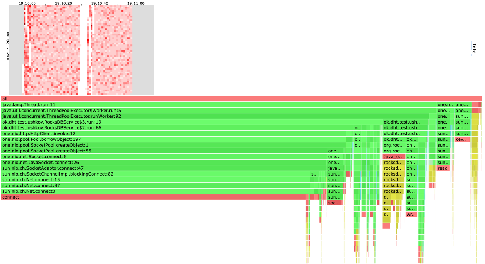

[alloc heatmap & flame graph](profiles/2022-10-26-18-11-11_notag_put_t4_c64_R10000_d1m/alloc.html)
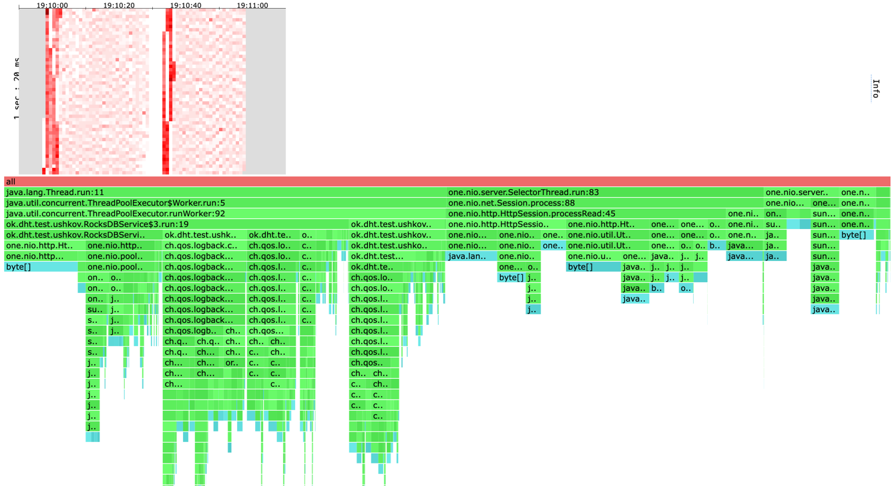

[lock flame graph](profiles/2022-10-26-18-11-11_notag_put_t4_c64_R10000_d1m/lock.html)
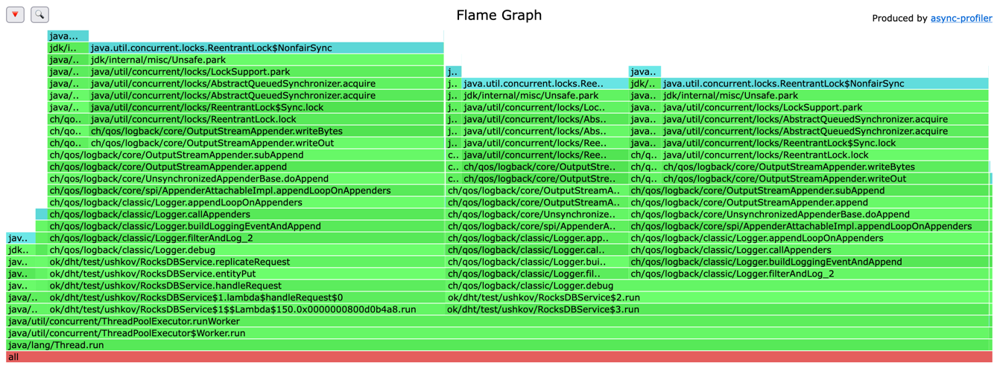


Теперь проведем тот же опыт, только для с параметрами , чтоьы
посмотреть, насколько быстро наша реализация справляется с записью сразу в несколько
реплик.

wrk2 output:
```
Running 1m test @ http://localhost:1337
  4 threads and 64 connections
  Thread calibration: mean lat.: 3519.284ms, rate sampling interval: 18038ms
  Thread calibration: mean lat.: 3524.400ms, rate sampling interval: 18055ms
  Thread calibration: mean lat.: 3333.856ms, rate sampling interval: 16408ms
  Thread calibration: mean lat.: 3548.453ms, rate sampling interval: 18071ms
  Thread Stats   Avg      Stdev     Max   +/- Stdev
    Latency    33.65s    13.41s    0.96m    58.84%
    Req/Sec   691.00     58.80   773.00     66.67%
  Latency Distribution (HdrHistogram - Recorded Latency)
 50.000%   35.06s 
 75.000%   44.30s 
 90.000%    0.88m 
 99.000%    0.95m 
 99.900%    0.96m 
 99.990%    0.96m 
 99.999%    0.96m 
100.000%    0.96m 

  Detailed Percentile spectrum:
       Value   Percentile   TotalCount 1/(1-Percentile)

    8667.135     0.000000            1         1.00
   14901.247     0.100000        13538         1.11
   19775.487     0.200000        27094         1.25
   24526.847     0.300000        40624         1.43
   29261.823     0.400000        54156         1.67
   35061.759     0.500000        68150         2.00
   35848.191     0.550000        74658         2.22
   36569.087     0.600000        81235         2.50
   39387.135     0.650000        88029         2.86
   41451.519     0.700000        94733         3.33
   44302.335     0.750000       101525         4.00
   45613.055     0.775000       104889         4.44
   47185.919     0.800000       108317         5.00
   48824.319     0.825000       111646         5.71
   50135.039     0.850000       115075         6.67
   51380.223     0.875000       118418         8.00
   52035.583     0.887500       120104         8.89
   52690.943     0.900000       121793        10.00
   53313.535     0.912500       123551        11.43
   53870.591     0.925000       125193        13.33
   54427.647     0.937500       126917        16.00
   54722.559     0.943750       127797        17.78
   54984.703     0.950000       128563        20.00
   55279.615     0.956250       129467        22.86
   55574.527     0.962500       130322        26.67
   55869.439     0.968750       131175        32.00
   56000.511     0.971875       131561        35.56
   56131.583     0.975000       131955        40.00
   56295.423     0.978125       132447        45.71
   56426.495     0.981250       132816        53.33
   56590.335     0.984375       133289        64.00
   56655.871     0.985938       133476        71.11
   56754.175     0.987500       133683        80.00
   56852.479     0.989062       133878        91.43
   56950.783     0.990625       134089       106.67
   57049.087     0.992188       134297       128.00
   57081.855     0.992969       134375       142.22
   57147.391     0.993750       134500       160.00
   57212.927     0.994531       134621       182.86
   57278.463     0.995313       134739       213.33
   57311.231     0.996094       134798       256.00
   57343.999     0.996484       134857       284.44
   57376.767     0.996875       134920       320.00
   57409.535     0.997266       134990       365.71
   57442.303     0.997656       135060       426.67
   57475.071     0.998047       135136       512.00
   57475.071     0.998242       135136       568.89
   57475.071     0.998437       135136       640.00
   57507.839     0.998633       135199       731.43
   57507.839     0.998828       135199       853.33
   57507.839     0.999023       135199      1024.00
   57540.607     0.999121       135265      1137.78
   57540.607     0.999219       135265      1280.00
   57540.607     0.999316       135265      1462.86
   57540.607     0.999414       135265      1706.67
   57540.607     0.999512       135265      2048.00
   57573.375     0.999561       135303      2275.56
   57573.375     0.999609       135303      2560.00
   57573.375     0.999658       135303      2925.71
   57573.375     0.999707       135303      3413.33
   57573.375     0.999756       135303      4096.00
   57573.375     0.999780       135303      4551.11
   57573.375     0.999805       135303      5120.00
   57573.375     0.999829       135303      5851.43
   57606.143     0.999854       135320      6826.67
   57606.143     0.999878       135320      8192.00
   57606.143     0.999890       135320      9102.22
   57606.143     0.999902       135320     10240.00
   57606.143     0.999915       135320     11702.86
   57606.143     0.999927       135320     13653.33
   57606.143     0.999939       135320     16384.00
   57606.143     0.999945       135320     18204.44
   57606.143     0.999951       135320     20480.00
   57606.143     0.999957       135320     23405.71
   57638.911     0.999963       135324     27306.67
   57638.911     0.999969       135324     32768.00
   57638.911     0.999973       135324     36408.89
   57638.911     0.999976       135324     40960.00
   57638.911     0.999979       135324     46811.43
   57638.911     0.999982       135324     54613.33
   57638.911     0.999985       135324     65536.00
   57638.911     0.999986       135324     72817.78
   57638.911     0.999988       135324     81920.00
   57638.911     0.999989       135324     93622.86
   57638.911     0.999991       135324    109226.67
   57638.911     0.999992       135324    131072.00
   57671.679     0.999993       135325    145635.56
   57671.679     1.000000       135325          inf
#[Mean    =    33654.148, StdDeviation   =    13410.831]
#[Max     =    57638.912, Total count    =       135325]
#[Buckets =           27, SubBuckets     =         2048]
----------------------------------------------------------
  166584 requests in 1.00m, 14.75MB read
  Socket errors: connect 0, read 0, write 0, timeout 192
  Non-2xx or 3xx responses: 57553
Requests/sec:   2776.38
Transfer/sec:    251.81KB
```

[cpu heatmap & flame graph](profiles/2022-10-26-19-10-07_ack2from3_put_t4_c64_R10000_d1m/cpu.html)
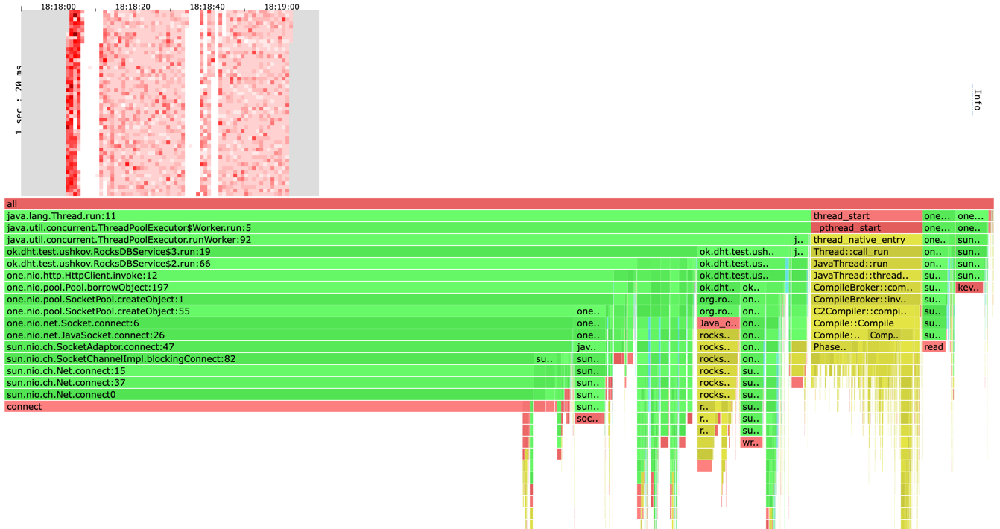

[alloc heatmap & flame graph](profiles/2022-10-26-19-10-07_ack2from3_put_t4_c64_R10000_d1m/alloc.html)
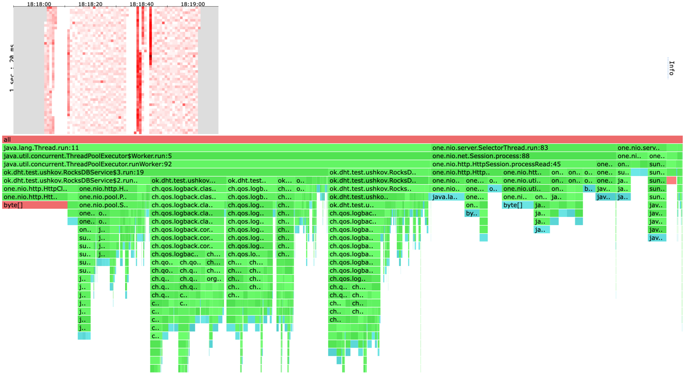

[lock flame graph](profiles/2022-10-26-19-10-07_ack2from3_put_t4_c64_R10000_d1m/lock.html)
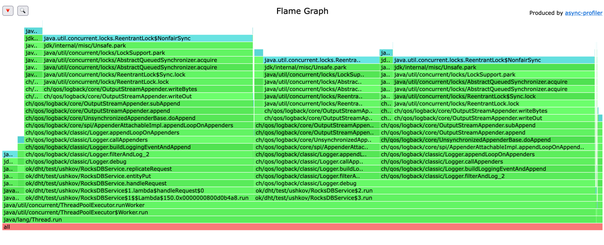

Как мы видим, благодаря тому, что все три ноды обрабатываются параллельно нет
резкого уменьшения RPS.

Аналогичную картину можно наблюдать на GET

Для обычного GET:
wrk2 output:
```
Running 1m test @ http://localhost:1337
  4 threads and 64 connections
  Thread calibration: mean lat.: 1017.383ms, rate sampling interval: 7393ms
  Thread calibration: mean lat.: 1017.134ms, rate sampling interval: 7397ms
  Thread calibration: mean lat.: 1017.044ms, rate sampling interval: 7389ms
  Thread calibration: mean lat.: 1017.561ms, rate sampling interval: 7397ms
  Thread Stats   Avg      Stdev     Max   +/- Stdev
    Latency    22.05s     9.24s   39.68s    59.91%
    Req/Sec   789.33    243.60     1.33k    83.33%
  Latency Distribution (HdrHistogram - Recorded Latency)
 50.000%   22.18s 
 75.000%   29.28s 
 90.000%   35.32s 
 99.000%   38.96s 
 99.900%   39.42s 
 99.990%   39.62s 
 99.999%   39.68s 
100.000%   39.71s 

  Detailed Percentile spectrum:
       Value   Percentile   TotalCount 1/(1-Percentile)

    4960.255     0.000000            2         1.00
    8937.471     0.100000        15599         1.11
   12656.639     0.200000        31160         1.25
   16449.535     0.300000        46757         1.43
   21839.871     0.400000        62554         1.67
   22183.935     0.500000        78626         2.00
   22315.007     0.550000        85755         2.22
   23412.735     0.600000        93500         2.50
   25296.895     0.650000       101285         2.86
   27279.359     0.700000       109073         3.33
   29278.207     0.750000       116842         4.00
   30195.711     0.775000       120737         4.44
   31195.135     0.800000       124658         5.00
   32243.711     0.825000       128548         5.71
   33259.519     0.850000       132409         6.67
   34308.095     0.875000       136334         8.00
   34799.615     0.887500       138284         8.89
   35323.903     0.900000       140279        10.00
   35815.423     0.912500       142215        11.43
   36339.711     0.925000       144186        13.33
   36831.231     0.937500       146050        16.00
   37093.375     0.943750       147103        17.78
   37322.751     0.950000       148028        20.00
   37584.895     0.956250       149050        22.86
   37814.271     0.962500       149926        26.67
   38076.415     0.968750       150924        32.00
   38207.487     0.971875       151424        35.56
   38338.559     0.975000       151929        40.00
   38469.631     0.978125       152417        45.71
   38600.703     0.981250       152900        53.33
   38731.775     0.984375       153385        64.00
   38797.311     0.985938       153625        71.11
   38862.847     0.987500       153871        80.00
   38928.383     0.989062       154119        91.43
   38993.919     0.990625       154375       106.67
   39059.455     0.992188       154623       128.00
   39092.223     0.992969       154739       142.22
   39124.991     0.993750       154845       160.00
   39157.759     0.994531       154961       182.86
   39190.527     0.995313       155069       213.33
   39223.295     0.996094       155168       256.00
   39256.063     0.996484       155255       284.44
   39288.831     0.996875       155345       320.00
   39288.831     0.997266       155345       365.71
   39321.599     0.997656       155428       426.67
   39354.367     0.998047       155497       512.00
   39354.367     0.998242       155497       568.89
   39387.135     0.998437       155548       640.00
   39387.135     0.998633       155548       731.43
   39419.903     0.998828       155595       853.33
   39452.671     0.999023       155632      1024.00
   39452.671     0.999121       155632      1137.78
   39452.671     0.999219       155632      1280.00
   39485.439     0.999316       155667      1462.86
   39485.439     0.999414       155667      1706.67
   39518.207     0.999512       155687      2048.00
   39518.207     0.999561       155687      2275.56
   39550.975     0.999609       155712      2560.00
   39550.975     0.999658       155712      2925.71
   39550.975     0.999707       155712      3413.33
   39550.975     0.999756       155712      4096.00
   39583.743     0.999780       155725      4551.11
   39583.743     0.999805       155725      5120.00
   39583.743     0.999829       155725      5851.43
   39616.511     0.999854       155737      6826.67
   39616.511     0.999878       155737      8192.00
   39616.511     0.999890       155737      9102.22
   39616.511     0.999902       155737     10240.00
   39616.511     0.999915       155737     11702.86
   39649.279     0.999927       155743     13653.33
   39649.279     0.999939       155743     16384.00
   39649.279     0.999945       155743     18204.44
   39649.279     0.999951       155743     20480.00
   39649.279     0.999957       155743     23405.71
   39682.047     0.999963       155747     27306.67
   39682.047     0.999969       155747     32768.00
   39682.047     0.999973       155747     36408.89
   39682.047     0.999976       155747     40960.00
   39682.047     0.999979       155747     46811.43
   39682.047     0.999982       155747     54613.33
   39682.047     0.999985       155747     65536.00
   39682.047     0.999986       155747     72817.78
   39714.815     0.999988       155749     81920.00
   39714.815     1.000000       155749          inf
#[Mean    =    22051.963, StdDeviation   =     9243.337]
#[Max     =    39682.048, Total count    =       155749]
#[Buckets =           27, SubBuckets     =         2048]
----------------------------------------------------------
  206503 requests in 1.00m, 29.77MB read
  Non-2xx or 3xx responses: 79284
Requests/sec:   3441.51
Transfer/sec:    508.11KB
```

[cpu heatmap & flame graph](profiles/2022-10-26-19-09-01_notag_get_t4_c64_R10000_d1m/cpu.html)
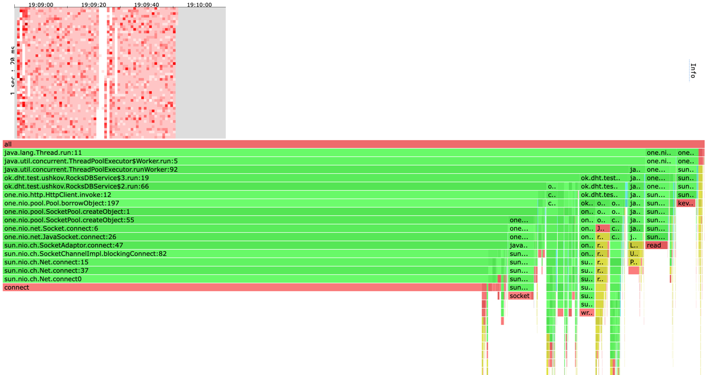

[alloc heatmap & flame graph](profiles/2022-10-26-19-09-01_notag_get_t4_c64_R10000_d1m/alloc.html)
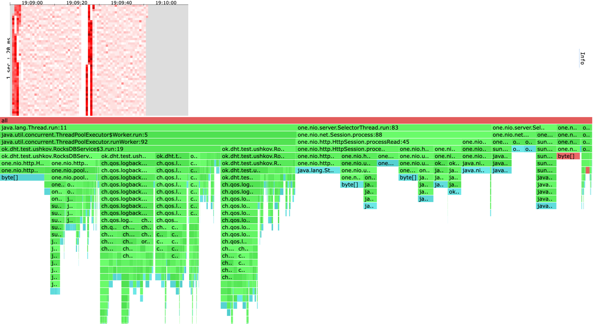

[lock flame graph](profiles/2022-10-26-19-09-01_notag_get_t4_c64_R10000_d1m/lock.html)
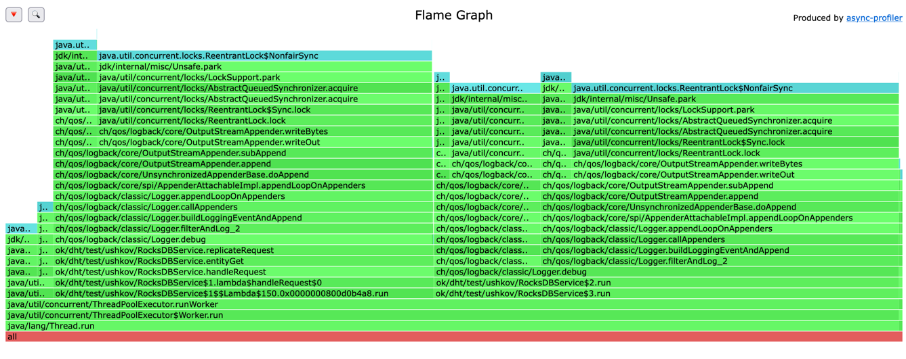

Для GET с репликами:
wrk2 output:
```
Running 1m test @ http://localhost:1337
  4 threads and 64 connections
  Thread calibration: mean lat.: 2666.357ms, rate sampling interval: 9945ms
  Thread calibration: mean lat.: 2664.073ms, rate sampling interval: 9945ms
  Thread calibration: mean lat.: 2666.135ms, rate sampling interval: 9945ms
  Thread calibration: mean lat.: 2503.887ms, rate sampling interval: 8945ms
  Thread Stats   Avg      Stdev     Max   +/- Stdev
    Latency    19.90s     9.49s   40.24s    46.77%
    Req/Sec   759.05    286.13     1.21k    65.00%
  Latency Distribution (HdrHistogram - Recorded Latency)
 50.000%   19.48s 
 75.000%   30.18s 
 90.000%   31.08s 
 99.000%   38.47s 
 99.900%   39.71s 
 99.990%   40.17s 
 99.999%   40.27s 
100.000%   40.27s 

  Detailed Percentile spectrum:
       Value   Percentile   TotalCount 1/(1-Percentile)

    6230.015     0.000000            1         1.00
    7602.175     0.100000        14811         1.11
    8278.015     0.200000        29600         1.25
   12369.919     0.300000        44316         1.43
   15941.631     0.400000        59071         1.67
   19480.575     0.500000        73866         2.00
   21299.199     0.550000        81229         2.22
   23117.823     0.600000        88630         2.50
   25100.287     0.650000        95995         2.86
   27262.975     0.700000       103376         3.33
   30179.327     0.750000       110955         4.00
   30375.935     0.775000       114681         4.44
   30507.007     0.800000       118499         5.00
   30621.695     0.825000       122266         5.71
   30736.383     0.850000       125981         6.67
   30867.455     0.875000       129231         8.00
   30965.759     0.887500       131171         8.89
   31080.447     0.900000       133079        10.00
   31260.671     0.912500       134744        11.43
   32391.167     0.925000       136605        13.33
   33456.127     0.937500       138446        16.00
   33783.807     0.943750       139357        17.78
   34111.487     0.950000       140285        20.00
   34471.935     0.956250       141201        22.86
   34865.151     0.962500       142164        26.67
   35422.207     0.968750       143056        32.00
   35848.191     0.971875       143526        35.56
   36372.479     0.975000       143988        40.00
   36962.303     0.978125       144449        45.71
   37552.127     0.981250       144916        53.33
   37847.039     0.984375       145354        64.00
   38043.647     0.985938       145614        71.11
   38174.719     0.987500       145826        80.00
   38371.327     0.989062       146064        91.43
   38535.167     0.990625       146308       106.67
   38731.775     0.992188       146535       128.00
   38797.311     0.992969       146634       142.22
   38895.615     0.993750       146748       160.00
   39026.687     0.994531       146897       182.86
   39092.223     0.995313       146993       213.33
   39190.527     0.996094       147096       256.00
   39256.063     0.996484       147142       284.44
   39321.599     0.996875       147207       320.00
   39387.135     0.997266       147264       365.71
   39452.671     0.997656       147337       426.67
   39485.439     0.998047       147377       512.00
   39518.207     0.998242       147402       568.89
   39550.975     0.998437       147429       640.00
   39616.511     0.998633       147468       731.43
   39682.047     0.998828       147499       853.33
   39714.815     0.999023       147518      1024.00
   39747.583     0.999121       147531      1137.78
   39780.351     0.999219       147546      1280.00
   39813.119     0.999316       147563      1462.86
   39845.887     0.999414       147578      1706.67
   39878.655     0.999512       147591      2048.00
   39911.423     0.999561       147601      2275.56
   39944.191     0.999609       147608      2560.00
   39976.959     0.999658       147617      2925.71
   39976.959     0.999707       147617      3413.33
   40009.727     0.999756       147623      4096.00
   40042.495     0.999780       147629      4551.11
   40075.263     0.999805       147634      5120.00
   40075.263     0.999829       147634      5851.43
   40108.031     0.999854       147638      6826.67
   40140.799     0.999878       147641      8192.00
   40173.567     0.999890       147646      9102.22
   40173.567     0.999902       147646     10240.00
   40206.335     0.999915       147650     11702.86
   40206.335     0.999927       147650     13653.33
   40206.335     0.999939       147650     16384.00
   40239.103     0.999945       147655     18204.44
   40239.103     0.999951       147655     20480.00
   40239.103     0.999957       147655     23405.71
   40239.103     0.999963       147655     27306.67
   40239.103     0.999969       147655     32768.00
   40239.103     0.999973       147655     36408.89
   40271.871     0.999976       147659     40960.00
   40271.871     1.000000       147659          inf
#[Mean    =    19898.495, StdDeviation   =     9490.616]
#[Max     =    40239.104, Total count    =       147659]
#[Buckets =           27, SubBuckets     =         2048]
----------------------------------------------------------
  170732 requests in 1.00m, 17.82MB read
  Socket errors: connect 0, read 0, write 0, timeout 128
  Non-2xx or 3xx responses: 59540
Requests/sec:   2841.18
Transfer/sec:    303.68KB
```

[cpu heatmap & flame graph](profiles/2022-10-26-19-14-12_ack2from3_get_t4_c64_R10000_d1m/cpu.html)
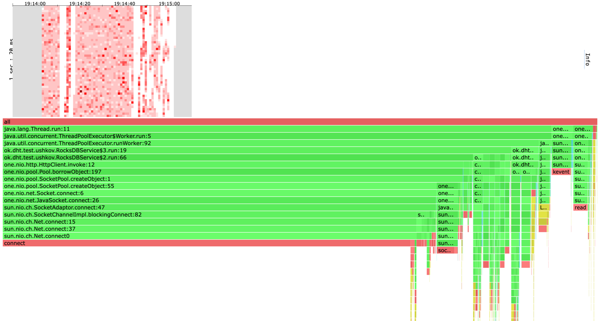

[alloc heatmap & flame graph](profiles/2022-10-26-19-14-12_ack2from3_get_t4_c64_R10000_d1m/alloc.html)
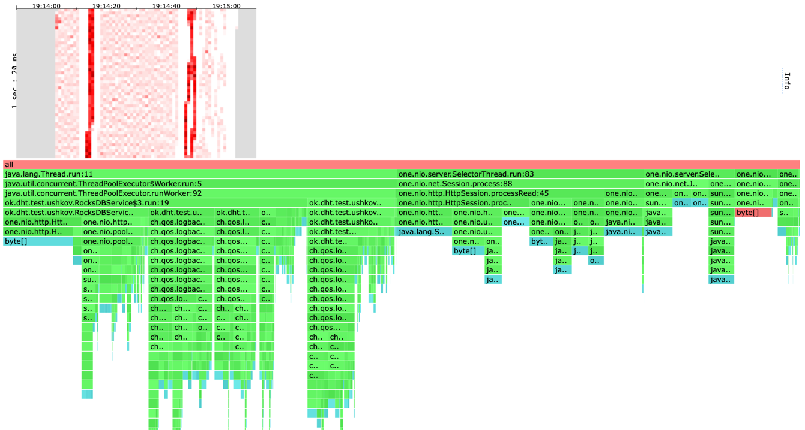

[lock flame graph](profiles/2022-10-26-19-14-12_ack2from3_get_t4_c64_R10000_d1m/lock.html)
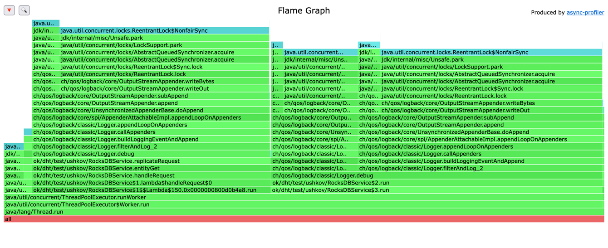

# Выводы
* Благодаря асинхронной обработке реплик, мы несильно теряем в производительности при работе с ними.
* Большая часть времени (70%) уходит на взаимодействие нод. Чтобы его уменьшить необходимо использовать другой
протокол для общения между нодами, HTTP слишком долго.
* Бонус неочевидный из профилирования -- повышение отказоустойчивости.
