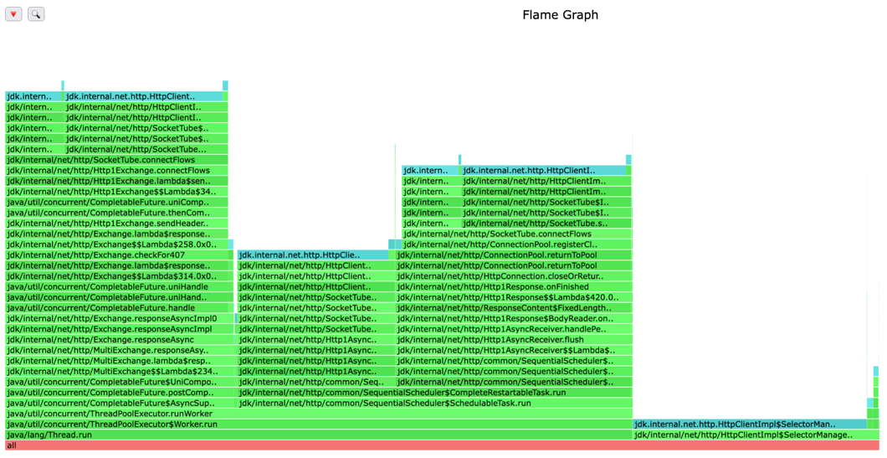
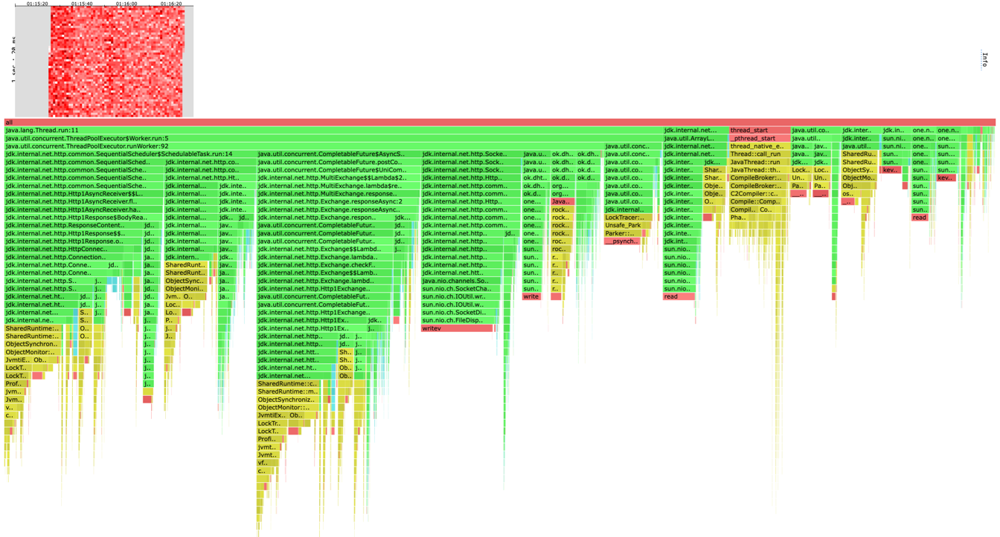

# Отчет

Профилирование проводилось на ноде, входящей в кластер из 4 четырех нод.
По ходу профилирование сделал модификацию, которая несколько улучшило RPS.

Изначальная реализация содержала один executor, на котором исполнялись
как сами запросы, так и код, ожидающий ответа от других нод кластера.

Профиль для запроса метода PUT ack=1 from=1:
```
Running 1m test @ http://localhost:1337
  4 threads and 64 connections
  Thread calibration: mean lat.: 2508.538ms, rate sampling interval: 9109ms
  Thread calibration: mean lat.: 2511.383ms, rate sampling interval: 9117ms
  Thread calibration: mean lat.: 2509.819ms, rate sampling interval: 9117ms
  Thread calibration: mean lat.: 2506.905ms, rate sampling interval: 9109ms
  Thread Stats   Avg      Stdev     Max   +/- Stdev
    Latency    21.96s     9.33s   39.09s    59.11%
    Req/Sec     4.14k   356.13     4.76k    60.00%
  Latency Distribution (HdrHistogram - Recorded Latency)
 50.000%   21.71s 
 75.000%   30.06s 
 90.000%   35.23s 
 99.000%   38.63s 
 99.900%   38.96s 
 99.990%   39.06s 
 99.999%   39.12s 
100.000%   39.12s 

  Detailed Percentile spectrum:
       Value   Percentile   TotalCount 1/(1-Percentile)

    5369.855     0.000000            1         1.00
    9658.367     0.100000        82272         1.11
   13041.663     0.200000       164597         1.25
   15228.927     0.300000       246652         1.43
   18055.167     0.400000       328693         1.67
   21708.799     0.500000       410939         2.00
   23068.671     0.550000       451840         2.22
   24395.775     0.600000       493128         2.50
   26247.167     0.650000       534267         2.86
   28131.327     0.700000       575183         3.33
   30064.639     0.750000       616246         4.00
   31064.063     0.775000       636823         4.44
   32014.335     0.800000       657542         5.00
   32817.151     0.825000       677779         5.71
   33619.967     0.850000       699054         6.67
   34275.327     0.875000       718968         8.00
   34635.775     0.887500       729655         8.89
   35225.599     0.900000       739361        10.00
   35717.119     0.912500       749882        11.43
   36175.871     0.925000       760483        13.33
   36569.087     0.937500       770337        16.00
   36765.695     0.943750       775720        17.78
   36962.303     0.950000       780558        20.00
   37224.447     0.956250       786360        22.86
   37453.823     0.962500       791169        26.67
   37781.503     0.968750       796261        32.00
   37912.575     0.971875       798731        35.56
   38043.647     0.975000       801350        40.00
   38174.719     0.978125       803660        45.71
   38338.559     0.981250       806097        53.33
   38469.631     0.984375       808933        64.00
   38535.167     0.985938       810866        71.11
   38567.935     0.987500       811856        80.00
   38600.703     0.989062       812824        91.43
   38666.239     0.990625       814565       106.67
   38699.007     0.992188       815385       128.00
   38731.775     0.992969       816200       142.22
   38764.543     0.993750       817019       160.00
   38764.543     0.994531       817019       182.86
   38797.311     0.995313       817828       213.33
   38830.079     0.996094       818643       256.00
   38830.079     0.996484       818643       284.44
   38862.847     0.996875       819416       320.00
   38862.847     0.997266       819416       365.71
   38895.615     0.997656       820100       426.67
   38895.615     0.998047       820100       512.00
   38895.615     0.998242       820100       568.89
   38928.383     0.998437       820625       640.00
   38928.383     0.998633       820625       731.43
   38928.383     0.998828       820625       853.33
   38961.151     0.999023       820999      1024.00
   38961.151     0.999121       820999      1137.78
   38961.151     0.999219       820999      1280.00
   38961.151     0.999316       820999      1462.86
   38993.919     0.999414       821230      1706.67
   38993.919     0.999512       821230      2048.00
   38993.919     0.999561       821230      2275.56
   38993.919     0.999609       821230      2560.00
   38993.919     0.999658       821230      2925.71
   39026.687     0.999707       821366      3413.33
   39026.687     0.999756       821366      4096.00
   39026.687     0.999780       821366      4551.11
   39026.687     0.999805       821366      5120.00
   39026.687     0.999829       821366      5851.43
   39026.687     0.999854       821366      6826.67
   39059.455     0.999878       821444      8192.00
   39059.455     0.999890       821444      9102.22
   39059.455     0.999902       821444     10240.00
   39059.455     0.999915       821444     11702.86
   39059.455     0.999927       821444     13653.33
   39059.455     0.999939       821444     16384.00
   39059.455     0.999945       821444     18204.44
   39059.455     0.999951       821444     20480.00
   39092.223     0.999957       821471     23405.71
   39092.223     0.999963       821471     27306.67
   39092.223     0.999969       821471     32768.00
   39092.223     0.999973       821471     36408.89
   39092.223     0.999976       821471     40960.00
   39092.223     0.999979       821471     46811.43
   39092.223     0.999982       821471     54613.33
   39092.223     0.999985       821471     65536.00
   39124.991     0.999986       821483     72817.78
   39124.991     1.000000       821483          inf
#[Mean    =    21956.474, StdDeviation   =     9333.232]
#[Max     =    39092.224, Total count    =       821483]
#[Buckets =           27, SubBuckets     =         2048]
----------------------------------------------------------
  1051203 requests in 1.00m, 67.17MB read
  Non-2xx or 3xx responses: 119
Requests/sec:  17520.26
Transfer/sec:      1.12MB
```

[cpu heatmap & flame graph](profiles/2022-11-01-23-24-14_ack1_from1_put_t4_c64_R50000_d1m/cpu.html)


[alloc heatmap & flame graph](profiles/2022-11-01-23-24-14_ack1_from1_put_t4_c64_R50000_d1m/alloc.html)


[lock flame graph](profiles/2022-11-01-23-24-14_ack1_from1_put_t4_c64_R50000_d1m/lock.html)


Далее разделил один executor на два, один для исполнения запросов, другой для ожидания.

Профиль для запроса метода PUT ack=1 from=1 в этом случае:
```
Running 1m test @ http://localhost:1337
  4 threads and 64 connections
  Thread calibration: mean lat.: 1229.371ms, rate sampling interval: 4993ms
  Thread calibration: mean lat.: 1560.326ms, rate sampling interval: 5656ms
  Thread calibration: mean lat.: 1562.673ms, rate sampling interval: 5681ms
  Thread calibration: mean lat.: 1559.912ms, rate sampling interval: 5689ms
  Thread Stats   Avg      Stdev     Max   +/- Stdev
    Latency     2.17s     1.72s    4.82s    44.96%
    Req/Sec     5.35k   673.30     6.28k    72.73%
  Latency Distribution (HdrHistogram - Recorded Latency)
 50.000%    2.32s 
 75.000%    3.88s 
 90.000%    4.29s 
 99.000%    4.65s 
 99.900%    4.75s 
 99.990%    4.81s 
 99.999%    4.82s 
100.000%    4.83s 

  Detailed Percentile spectrum:
       Value   Percentile   TotalCount 1/(1-Percentile)

       0.093     0.000000            1         1.00
       1.779     0.100000       106403         1.11
     108.799     0.200000       212716         1.25
     417.279     0.300000       319066         1.43
    1356.799     0.400000       425544         1.67
    2316.287     0.500000       531848         2.00
    2850.815     0.550000       585112         2.22
    3178.495     0.600000       638403         2.50
    3485.695     0.650000       691691         2.86
    3704.831     0.700000       744617         3.33
    3876.863     0.750000       797813         4.00
    3950.591     0.775000       824728         4.44
    4018.175     0.800000       851091         5.00
    4089.855     0.825000       877956         5.71
    4151.295     0.850000       904312         6.67
    4214.783     0.875000       930663         8.00
    4251.647     0.887500       944678         8.89
    4288.511     0.900000       957984        10.00
    4329.471     0.912500       971179        11.43
    4378.623     0.925000       984785        13.33
    4427.775     0.937500       997680        16.00
    4452.351     0.943750      1003732        17.78
    4481.023     0.950000      1010917        20.00
    4505.599     0.956250      1017397        22.86
    4530.175     0.962500      1023911        26.67
    4558.847     0.968750      1030983        32.00
    4571.135     0.971875      1033822        35.56
    4587.519     0.975000      1037395        40.00
    4599.807     0.978125      1040317        45.71
    4612.095     0.981250      1043865        53.33
    4628.479     0.984375      1047728        64.00
    4632.575     0.985938      1048829        71.11
    4640.767     0.987500      1050805        80.00
    4648.959     0.989062      1052328        91.43
    4657.151     0.990625      1053587       106.67
    4669.439     0.992188      1055558       128.00
    4673.535     0.992969      1056264       142.22
    4677.631     0.993750      1056968       160.00
    4685.823     0.994531      1058015       182.86
    4694.015     0.995313      1058873       213.33
    4702.207     0.996094      1059609       256.00
    4706.303     0.996484      1059936       284.44
    4710.399     0.996875      1060235       320.00
    4718.591     0.997266      1060904       365.71
    4722.687     0.997656      1061222       426.67
    4730.879     0.998047      1061670       512.00
    4734.975     0.998242      1061977       568.89
    4734.975     0.998437      1061977       640.00
    4739.071     0.998633      1062231       731.43
    4743.167     0.998828      1062418       853.33
    4747.263     0.999023      1062628      1024.00
    4747.263     0.999121      1062628      1137.78
    4751.359     0.999219      1062767      1280.00
    4755.455     0.999316      1062842      1462.86
    4763.647     0.999414      1062936      1706.67
    4771.839     0.999512      1063082      2048.00
    4775.935     0.999561      1063153      2275.56
    4775.935     0.999609      1063153      2560.00
    4780.031     0.999658      1063243      2925.71
    4780.031     0.999707      1063243      3413.33
    4784.127     0.999756      1063308      4096.00
    4788.223     0.999780      1063358      4551.11
    4788.223     0.999805      1063358      5120.00
    4792.319     0.999829      1063374      5851.43
    4796.415     0.999854      1063402      6826.67
    4804.607     0.999878      1063429      8192.00
    4808.703     0.999890      1063449      9102.22
    4808.703     0.999902      1063449     10240.00
    4812.799     0.999915      1063485     11702.86
    4812.799     0.999927      1063485     13653.33
    4816.895     0.999939      1063517     16384.00
    4816.895     0.999945      1063517     18204.44
    4816.895     0.999951      1063517     20480.00
    4816.895     0.999957      1063517     23405.71
    4816.895     0.999963      1063517     27306.67
    4820.991     0.999969      1063541     32768.00
    4820.991     0.999973      1063541     36408.89
    4820.991     0.999976      1063541     40960.00
    4820.991     0.999979      1063541     46811.43
    4820.991     0.999982      1063541     54613.33
    4820.991     0.999985      1063541     65536.00
    4820.991     0.999986      1063541     72817.78
    4820.991     0.999988      1063541     81920.00
    4820.991     0.999989      1063541     93622.86
    4820.991     0.999991      1063541    109226.67
    4825.087     0.999992      1063550    131072.00
    4825.087     1.000000      1063550          inf
#[Mean    =     2169.688, StdDeviation   =     1717.394]
#[Max     =     4820.992, Total count    =      1063550]
#[Buckets =           27, SubBuckets     =         2048]
----------------------------------------------------------
  1192855 requests in 1.00m, 76.23MB read
  Non-2xx or 3xx responses: 375
Requests/sec:  19881.11
Transfer/sec:      1.27MB
```

[cpu heatmap & flame graph](profiles/2022-11-02-01-09-20_ack1_from1_connectionTimeout500ms_anotherOneExecutor_put_t4_c64_R20000_d1m/cpu.html)


[alloc heatmap & flame graph](profiles/2022-11-02-01-09-20_ack1_from1_connectionTimeout500ms_anotherOneExecutor_put_t4_c64_R20000_d1m/alloc.html)


[lock flame graph](profiles/2022-11-02-01-09-20_ack1_from1_connectionTimeout500ms_anotherOneExecutor_put_t4_c64_R20000_d1m/lock.html)


Как мы видим RPS вырос с 17.5 тысяч до почти 20.

Далее следуют другие профили для этой же реализации.

Профиль для запроса метода PUT ack=2 from=3:
```
Running 1m test @ http://localhost:1337
  4 threads and 64 connections
  Thread calibration: mean lat.: 4400.750ms, rate sampling interval: 14098ms
  Thread calibration: mean lat.: 4346.192ms, rate sampling interval: 14065ms
  Thread calibration: mean lat.: 4376.419ms, rate sampling interval: 14090ms
  Thread calibration: mean lat.: 4342.130ms, rate sampling interval: 14057ms
  Thread Stats   Avg      Stdev     Max   +/- Stdev
    Latency    24.73s     9.97s   41.35s    55.59%
    Req/Sec     1.52k   117.96     1.68k    41.67%
  Latency Distribution (HdrHistogram - Recorded Latency)
 50.000%   25.77s 
 75.000%   33.31s 
 90.000%   38.04s 
 99.000%   41.03s 
 99.900%   41.32s 
 99.990%   41.39s 
 99.999%   41.39s 
100.000%   41.39s 

  Detailed Percentile spectrum:
       Value   Percentile   TotalCount 1/(1-Percentile)

    7573.503     0.000000            2         1.00
   10567.679     0.100000        30491         1.11
   13508.607     0.200000        60909         1.25
   17514.495     0.300000        91288         1.43
   22020.095     0.400000       121743         1.67
   25772.031     0.500000       152133         2.00
   27262.975     0.550000       167426         2.22
   28786.687     0.600000       182580         2.50
   30212.095     0.650000       197832         2.86
   31752.191     0.700000       213023         3.33
   33308.671     0.750000       228155         4.00
   34078.719     0.775000       236032         4.44
   34897.919     0.800000       243581         5.00
   35618.815     0.825000       251263         5.71
   36405.247     0.850000       258613         6.67
   37158.911     0.875000       266365         8.00
   37584.895     0.887500       270103         8.89
   38043.647     0.900000       274082        10.00
   38436.863     0.912500       277867        11.43
   38797.311     0.925000       281550        13.33
   39223.295     0.937500       285272        16.00
   39452.671     0.943750       287192        17.78
   39649.279     0.950000       289094        20.00
   39845.887     0.956250       291058        22.86
   40042.495     0.962500       292894        26.67
   40239.103     0.968750       294771        32.00
   40337.407     0.971875       295687        35.56
   40468.479     0.975000       296872        40.00
   40566.783     0.978125       297761        45.71
   40665.087     0.981250       298652        53.33
   40796.159     0.984375       299635        64.00
   40861.695     0.985938       300079        71.11
   40927.231     0.987500       300531        80.00
   40992.767     0.989062       301039        91.43
   41058.303     0.990625       301618       106.67
   41091.071     0.992188       301930       128.00
   41123.839     0.992969       302240       142.22
   41156.607     0.993750       302551       160.00
   41156.607     0.994531       302551       182.86
   41189.375     0.995313       302853       213.33
   41222.143     0.996094       303149       256.00
   41222.143     0.996484       303149       284.44
   41254.911     0.996875       303439       320.00
   41254.911     0.997266       303439       365.71
   41287.679     0.997656       303730       426.67
   41287.679     0.998047       303730       512.00
   41287.679     0.998242       303730       568.89
   41287.679     0.998437       303730       640.00
   41320.447     0.998633       303997       731.43
   41320.447     0.998828       303997       853.33
   41320.447     0.999023       303997      1024.00
   41320.447     0.999121       303997      1137.78
   41320.447     0.999219       303997      1280.00
   41320.447     0.999316       303997      1462.86
   41353.215     0.999414       304168      1706.67
   41353.215     0.999512       304168      2048.00
   41353.215     0.999561       304168      2275.56
   41353.215     0.999609       304168      2560.00
   41353.215     0.999658       304168      2925.71
   41353.215     0.999707       304168      3413.33
   41353.215     0.999756       304168      4096.00
   41353.215     0.999780       304168      4551.11
   41353.215     0.999805       304168      5120.00
   41353.215     0.999829       304168      5851.43
   41353.215     0.999854       304168      6826.67
   41353.215     0.999878       304168      8192.00
   41385.983     0.999890       304203      9102.22
   41385.983     1.000000       304203          inf
#[Mean    =    24729.444, StdDeviation   =     9974.672]
#[Max     =    41353.216, Total count    =       304203]
#[Buckets =           27, SubBuckets     =         2048]
----------------------------------------------------------
  351277 requests in 1.00m, 22.45MB read
  Socket errors: connect 0, read 0, write 0, timeout 97
  Non-2xx or 3xx responses: 98
Requests/sec:   5854.59
Transfer/sec:    383.10KB
```

[cpu heatmap & flame graph](profiles/2022-11-02-01-15-34_ack2_from3_connectionTimeout500ms_anotherOneExecutor_put_ack2_from3_t4_c64_R20000_d1m/cpu.html)


[alloc heatmap & flame graph](profiles/2022-11-02-01-15-34_ack2_from3_connectionTimeout500ms_anotherOneExecutor_put_ack2_from3_t4_c64_R20000_d1m/alloc.html)


[lock flame graph](profiles/2022-11-02-01-15-34_ack2_from3_connectionTimeout500ms_anotherOneExecutor_put_ack2_from3_t4_c64_R20000_d1m/lock.html)


Профиль для запроса метода GET ack=1 from=1:
```
Running 1m test @ http://localhost:1337
  4 threads and 64 connections
  Thread calibration: mean lat.: 1747.846ms, rate sampling interval: 4714ms
  Thread calibration: mean lat.: 1748.185ms, rate sampling interval: 4718ms
  Thread calibration: mean lat.: 1747.105ms, rate sampling interval: 4698ms
  Thread calibration: mean lat.: 1747.382ms, rate sampling interval: 4702ms
  Thread Stats   Avg      Stdev     Max   +/- Stdev
    Latency   396.60ms  715.42ms   2.77s    84.92%
    Req/Sec     5.28k   471.82     6.35k    80.00%
  Latency Distribution (HdrHistogram - Recorded Latency)
 50.000%   36.00ms
 75.000%  301.31ms
 90.000%    1.76s 
 99.000%    2.60s 
 99.900%    2.71s 
 99.990%    2.76s 
 99.999%    2.77s 
100.000%    2.77s 

  Detailed Percentile spectrum:
       Value   Percentile   TotalCount 1/(1-Percentile)

       0.088     0.000000            2         1.00
       1.065     0.100000       105181         1.11
       1.603     0.200000       210297         1.25
       2.307     0.300000       315389         1.43
       5.359     0.400000       420413         1.67
      35.999     0.500000       525524         2.00
      69.055     0.550000       578044         2.22
     115.967     0.600000       630634         2.50
     166.783     0.650000       683195         2.86
     217.471     0.700000       735757         3.33
     301.311     0.750000       788276         4.00
     394.495     0.775000       814547         4.44
     541.183     0.800000       840810         5.00
     806.911     0.825000       867073         5.71
    1121.279     0.850000       893372         6.67
    1419.263     0.875000       919647         8.00
    1595.391     0.887500       932790         8.89
    1761.279     0.900000       945905        10.00
    1890.303     0.912500       959103        11.43
    2012.159     0.925000       972207        13.33
    2156.543     0.937500       985414        16.00
    2232.319     0.943750       991998        17.78
    2293.759     0.950000       998450        20.00
    2351.103     0.956250      1005147        22.86
    2396.159     0.962500      1011565        26.67
    2437.119     0.968750      1018182        32.00
    2457.599     0.971875      1021525        35.56
    2480.127     0.975000      1024848        40.00
    2502.655     0.978125      1028194        45.71
    2525.183     0.981250      1031506        53.33
    2549.759     0.984375      1034616        64.00
    2564.095     0.985938      1036355        71.11
    2578.431     0.987500      1037861        80.00
    2592.767     0.989062      1039559        91.43
    2607.103     0.990625      1041285       106.67
    2621.439     0.992188      1042871       128.00
    2627.583     0.992969      1043671       142.22
    2633.727     0.993750      1044537       160.00
    2641.919     0.994531      1045369       182.86
    2648.063     0.995313      1046123       213.33
    2656.255     0.996094      1046919       256.00
    2662.399     0.996484      1047379       284.44
    2668.543     0.996875      1047801       320.00
    2674.687     0.997266      1048214       365.71
    2680.831     0.997656      1048596       426.67
    2686.975     0.998047      1048947       512.00
    2691.071     0.998242      1049162       568.89
    2695.167     0.998437      1049340       640.00
    2701.311     0.998633      1049629       731.43
    2705.407     0.998828      1049817       853.33
    2709.503     0.999023      1050004      1024.00
    2711.551     0.999121      1050101      1137.78
    2713.599     0.999219      1050173      1280.00
    2717.695     0.999316      1050296      1462.86
    2719.743     0.999414      1050365      1706.67
    2725.887     0.999512      1050508      2048.00
    2727.935     0.999561      1050554      2275.56
    2729.983     0.999609      1050586      2560.00
    2734.079     0.999658      1050618      2925.71
    2740.223     0.999707      1050676      3413.33
    2744.319     0.999756      1050723      4096.00
    2746.367     0.999780      1050749      4551.11
    2748.415     0.999805      1050770      5120.00
    2750.463     0.999829      1050791      5851.43
    2754.559     0.999854      1050841      6826.67
    2756.607     0.999878      1050876      8192.00
    2756.607     0.999890      1050876      9102.22
    2756.607     0.999902      1050876     10240.00
    2758.655     0.999915      1050908     11702.86
    2758.655     0.999927      1050908     13653.33
    2758.655     0.999939      1050908     16384.00
    2760.703     0.999945      1050928     18204.44
    2760.703     0.999951      1050928     20480.00
    2760.703     0.999957      1050928     23405.71
    2762.751     0.999963      1050939     27306.67
    2762.751     0.999969      1050939     32768.00
    2764.799     0.999973      1050957     36408.89
    2764.799     0.999976      1050957     40960.00
    2764.799     0.999979      1050957     46811.43
    2764.799     0.999982      1050957     54613.33
    2764.799     0.999985      1050957     65536.00
    2764.799     0.999986      1050957     72817.78
    2766.847     0.999988      1050966     81920.00
    2766.847     0.999989      1050966     93622.86
    2766.847     0.999991      1050966    109226.67
    2766.847     0.999992      1050966    131072.00
    2766.847     0.999993      1050966    145635.56
    2766.847     0.999994      1050966    163840.00
    2766.847     0.999995      1050966    187245.71
    2766.847     0.999995      1050966    218453.33
    2766.847     0.999996      1050966    262144.00
    2768.895     0.999997      1050970    291271.11
    2768.895     1.000000      1050970          inf
#[Mean    =      396.599, StdDeviation   =      715.417]
#[Max     =     2766.848, Total count    =      1050970]
#[Buckets =           27, SubBuckets     =         2048]
----------------------------------------------------------
  1199246 requests in 1.00m, 187.56MB read
  Non-2xx or 3xx responses: 128
Requests/sec:  19987.54
Transfer/sec:      3.13MB
```

[cpu heatmap & flame graph](profiles/2022-11-02-19-56-15_ack1_from1_connectionTimeout500ms_anotherOneExecutor_get_t4_c64_R20000_d1m/cpu.html)


[alloc heatmap & flame graph](profiles/2022-11-02-19-56-15_ack1_from1_connectionTimeout500ms_anotherOneExecutor_get_t4_c64_R20000_d1m/alloc.html)


[lock flame graph](profiles/2022-11-02-19-56-15_ack1_from1_connectionTimeout500ms_anotherOneExecutor_get_t4_c64_R20000_d1m/lock.html)


Профиль для запроса метода GET ack=2 from=3:
```
Running 1m test @ http://localhost:1337
  4 threads and 64 connections
  Thread calibration: mean lat.: 4449.356ms, rate sampling interval: 16359ms
  Thread calibration: mean lat.: 4449.267ms, rate sampling interval: 16359ms
  Thread calibration: mean lat.: 4448.174ms, rate sampling interval: 16359ms
  Thread calibration: mean lat.: 4449.022ms, rate sampling interval: 16359ms
  Thread Stats   Avg      Stdev     Max   +/- Stdev
    Latency    30.72s    12.51s    0.89m    58.79%
    Req/Sec     1.41k    99.57     1.53k    33.33%
  Latency Distribution (HdrHistogram - Recorded Latency)
 50.000%   30.29s 
 75.000%   41.29s 
 90.000%   48.59s 
 99.000%    0.88m 
 99.900%    0.89m 
 99.990%    0.89m 
 99.999%    0.89m 
100.000%    0.89m 

  Detailed Percentile spectrum:
       Value   Percentile   TotalCount 1/(1-Percentile)

    8929.279     0.000000            5         1.00
   13746.175     0.100000        28121         1.11
   18251.775     0.200000        56235         1.25
   22396.927     0.300000        84314         1.43
   26329.087     0.400000       112411         1.67
   30294.015     0.500000       140566         2.00
   32210.943     0.550000       154510         2.22
   34209.791     0.600000       168553         2.50
   36339.711     0.650000       182617         2.86
   38633.471     0.700000       196738         3.33
   41287.679     0.750000       210893         4.00
   42598.399     0.775000       217694         4.44
   44007.423     0.800000       224755         5.00
   45416.447     0.825000       231945         5.71
   46399.487     0.850000       238873         6.67
   47513.599     0.875000       245924         8.00
   48070.655     0.887500       249299         8.89
   48594.943     0.900000       252988        10.00
   49053.695     0.912500       256422        11.43
   49610.751     0.925000       259900        13.33
   50200.575     0.937500       263479        16.00
   50462.719     0.943750       265159        17.78
   50790.399     0.950000       266970        20.00
   51183.615     0.956250       268732        22.86
   51511.295     0.962500       270469        26.67
   51838.975     0.968750       272215        32.00
   52002.815     0.971875       273162        35.56
   52133.887     0.975000       274044        40.00
   52264.959     0.978125       274809        45.71
   52396.031     0.981250       275660        53.33
   52527.103     0.984375       276591        64.00
   52592.639     0.985938       277050        71.11
   52658.175     0.987500       277418        80.00
   52756.479     0.989062       277890        91.43
   52822.015     0.990625       278267       106.67
   52920.319     0.992188       278832       128.00
   52953.087     0.992969       279030       142.22
   52985.855     0.993750       279210       160.00
   53018.623     0.994531       279407       182.86
   53051.391     0.995313       279643       213.33
   53084.159     0.996094       279895       256.00
   53116.927     0.996484       280151       284.44
   53116.927     0.996875       280151       320.00
   53116.927     0.997266       280151       365.71
   53149.695     0.997656       280417       426.67
   53149.695     0.998047       280417       512.00
   53149.695     0.998242       280417       568.89
   53182.463     0.998437       280654       640.00
   53182.463     0.998633       280654       731.43
   53182.463     0.998828       280654       853.33
   53182.463     0.999023       280654      1024.00
   53182.463     0.999121       280654      1137.78
   53215.231     0.999219       280812      1280.00
   53215.231     0.999316       280812      1462.86
   53215.231     0.999414       280812      1706.67
   53215.231     0.999512       280812      2048.00
   53215.231     0.999561       280812      2275.56
   53215.231     0.999609       280812      2560.00
   53215.231     0.999658       280812      2925.71
   53215.231     0.999707       280812      3413.33
   53247.999     0.999756       280886      4096.00
   53247.999     0.999780       280886      4551.11
   53247.999     0.999805       280886      5120.00
   53247.999     0.999829       280886      5851.43
   53247.999     0.999854       280886      6826.67
   53247.999     0.999878       280886      8192.00
   53247.999     0.999890       280886      9102.22
   53247.999     0.999902       280886     10240.00
   53247.999     0.999915       280886     11702.86
   53247.999     0.999927       280886     13653.33
   53247.999     0.999939       280886     16384.00
   53247.999     0.999945       280886     18204.44
   53247.999     0.999951       280886     20480.00
   53247.999     0.999957       280886     23405.71
   53247.999     0.999963       280886     27306.67
   53247.999     0.999969       280886     32768.00
   53247.999     0.999973       280886     36408.89
   53280.767     0.999976       280893     40960.00
   53280.767     1.000000       280893          inf
#[Mean    =    30721.110, StdDeviation   =    12513.554]
#[Max     =    53248.000, Total count    =       280893]
#[Buckets =           27, SubBuckets     =         2048]
----------------------------------------------------------
  335391 requests in 1.00m, 52.45MB read
  Socket errors: connect 0, read 0, write 0, timeout 5
  Non-2xx or 3xx responses: 60
Requests/sec:   5589.85
Transfer/sec:      0.87MB
```

[cpu heatmap & flame graph](profiles/2022-11-02-20-12-00_ack2_from3_connectionTimeout500ms_anotherOneExecutor_get_ack2_from3_t4_c64_R50000_d1m/cpu.html)


[alloc heatmap & flame graph](profiles/2022-11-02-20-12-00_ack2_from3_connectionTimeout500ms_anotherOneExecutor_get_ack2_from3_t4_c64_R50000_d1m/alloc.html)


[lock flame graph](profiles/2022-11-02-20-12-00_ack2_from3_connectionTimeout500ms_anotherOneExecutor_get_ack2_from3_t4_c64_R50000_d1m/lock.html)


# Выводы
* Запросы, которые предполагают обращение к нескольким репликам 
исполняются сильно медленнее, что по-видимому связно с синхронизацией.
На профилях cpu видно, что количество sample-ов в executor-е увеличилось.
Возможно также executor, ожидающий ответов от других не успевает их разгребать.
Не будем также забывать, что 4 ноды запускаются на одном железном хосте.
* Заметим, что много времени также тратится на работу HttpClient (см картинку нижу). Возможно
другой, бинарный протокол будет работать быстрее.

