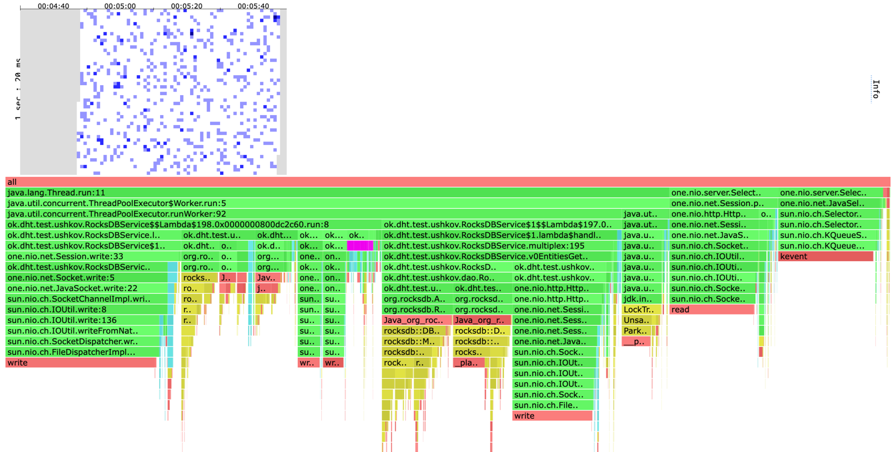
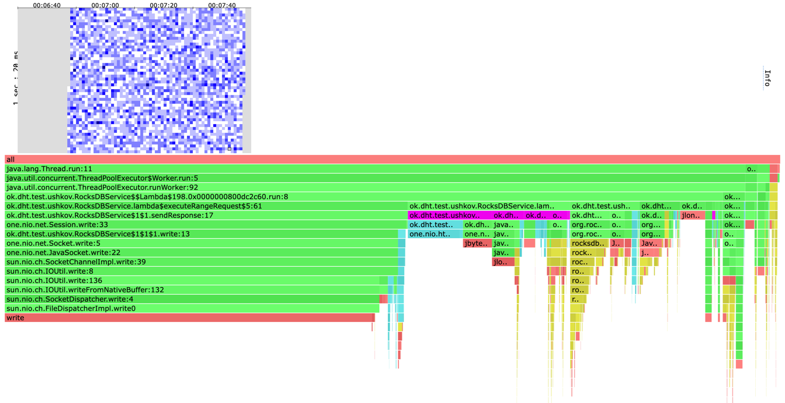
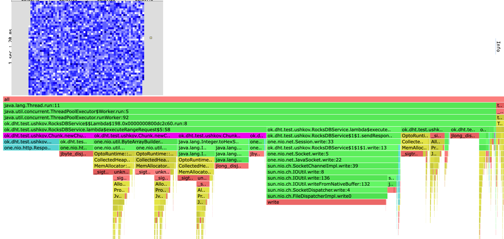

# Stage 6. Отчет

Поисследуем, как будет справляться с нагрузкой наш сервер при разных
размерах запрашиваемого промежутка в range-запросах. 
Будем использовать промежутки размеров 10, 100 и 1000.

Заранее наполним базу данных 10_000_000 ключей имеющими вид
0000001, 0000002, ..., 9999999. Ведущие нули нужны, чтобы
лексикографический порядок совпадал с порядком на числах.

В рамках эксперимента был подобран размер чанка 512 байт, при котором RPS был достаточно
высоким.

Пример скрипта для обстрела промежутков размера 1000.
```lua
request = function()
    from = math.random(0, 1000000) .. ""
    to = (from + 1000) .. ""
    while string.len(from) < 7 do
        from = "0" .. from
    end
    while string.len(to) < 7 do
        to = "0" .. to
    end
    path = "/v0/entities?start=" .. from .. "&end=" .. to
    return wrk.format("GET", path)
end
```
Везде нагрузка подавался с RPS=50000 в 4 потока и 64 соединения.

Обстрел для промежутка размера 10
```
Running 1m test @ http://localhost:1337
  4 threads and 64 connections
  Thread calibration: mean lat.: 1648.674ms, rate sampling interval: 6553ms
  Thread calibration: mean lat.: 1649.586ms, rate sampling interval: 6557ms
  Thread calibration: mean lat.: 1648.560ms, rate sampling interval: 6553ms
  Thread calibration: mean lat.: 1650.584ms, rate sampling interval: 6561ms
  Thread Stats   Avg      Stdev     Max   +/- Stdev
    Latency    10.58s     4.92s   19.76s    56.81%
    Req/Sec     8.47k   840.41    10.10k    71.43%
----------------------------------------------------------
  2015016 requests in 1.00m, 10.17GB read
Requests/sec:  33583.98
Transfer/sec:    173.50MB
```

Как мы видим результат здесь несильно ушел от случая когда мы делаем не range
запрос (там RPS выходил порядка 50000).


При 100
```
Running 1m test @ http://localhost:1337
  4 threads and 64 connections
  Thread calibration: mean lat.: 4035.424ms, rate sampling interval: 16072ms
  Thread calibration: mean lat.: 4009.220ms, rate sampling interval: 16048ms
  Thread calibration: mean lat.: 3859.050ms, rate sampling interval: 14835ms
  Thread calibration: mean lat.: 4013.655ms, rate sampling interval: 16039ms
  Thread Stats   Avg      Stdev     Max   +/- Stdev
    Latency    32.20s    12.76s    0.90m    59.06%
    Req/Sec   633.42    117.77   819.00     58.33%
----------------------------------------------------------
  149371 requests in 1.00m, 75.92GB read
  Socket errors: connect 0, read 33, write 0, timeout 884
Requests/sec:   2489.37
Transfer/sec:      1.27GB
```

Здесь уже все сильно хуже. Наш сервер захлебнулся.

На 1000
```
Running 1m test @ http://localhost:1337
  4 threads and 64 connections
  Thread calibration: mean lat.: 5225.056ms, rate sampling interval: 17825ms
  Thread calibration: mean lat.: 5145.883ms, rate sampling interval: 17989ms
  Thread calibration: mean lat.: 5530.069ms, rate sampling interval: 18055ms
  Thread calibration: mean lat.: 5311.847ms, rate sampling interval: 18530ms
  Thread Stats   Avg      Stdev     Max   +/- Stdev
    Latency    34.07s    13.92s    1.00m    58.99%
    Req/Sec     8.00      0.00     8.00    100.00%
----------------------------------------------------------
  1970 requests in 1.00m, 99.80GB read
  Socket errors: connect 0, read 57, write 0, timeout 46
Requests/sec:     32.79
Transfer/sec:      1.66GB
```

Тут можно считать, что сервер умер.

Далее flame graph-ы, где фиолетовое - создание chunk-а.
Для 10

Для 100

Для 1000


Выводы
* Range запрос на маленьком промежутке несильно проигрывает обычному GET /v0/entity.
* На range-ах порядка 100 сервер уже захлебывается. В продакшене, стоило бы ограничить
пользователям возможность делать такие запросы например rate limit-ом.
* Range-запрос размера 100 по времени примерно эквивалентен реплицированному запросу 
(у обоих RPS порядка 1000).
* Выбранный размер чанка это по большому счету компромисс
между скоростью получения данных клиентом и количеством сисколов.
Если сделать чанк очень маленьким, то мы упремся в сисколы (они долгие).
Если сделать чанк слишком большим, то зачем нам вообще Chunked trunsfer encoding,
давайте все вычитаем из базы, будем знать длину и отправим сообщение с заранее известной длиной.
