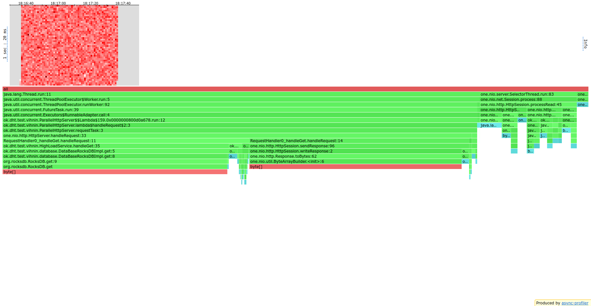

# ОТЧЕТ по 3-ему этапу.

В рамках этого этапа мы должно были реализовать шардирование и
поддержку внутренних запросов.

Я реализовал `Consistent Hash` в рамках `ShardHelper`, который по входящему
айдишнику запроса получал шард, на котором лежат соответствующие ему данные.
Каждому серверу я выдавал по `VNODE_NUMBER_PER_SERVER` (в момент написания это 
число равно 5) виртуальных данных, таким образом распределяя разные интервалы
значений ключей равномерно по всем серверам.

Также в рамках этапа надо было выстроить связь между нодами, чтобы те могли
общаться в случае запросов, которые не относятся к потревоженной ноде, нода
могла оперативно спросить у ответственных и ответить за запрос.

Для этого в `ParallelHttpServer` появился `shardHelper`, который отвечал за
определение номера необходимой ноды, `internalRequestService` для выполнения
задач связи с другими нодами без отвлечения основного executor-а и `сlients`,
чтобы иметь сразу зарезервированные клиенты под общения с "коллегами", чтобы
не создавать их на каждый чих, раз всё равно у нас зафиксирована топология сети.

Давайте задумаеся над тем, а зачем нам отдельный обработчик для запросов
по внутренней? На этот имеется несколько причин: 

- Bо-первых, логически так корректнее,
так как у нас разделены вычисления разного типа.
- Во-вторых, общение с внутренней системой сильно дешевле по времени, так что
не стоит ухудшать средний отклик на запросы, которые обрабатываются только одной
нодой, запросами, которые могут быть сильно дольше из-за специфики внешнего мира, 
таких как стабильность сети, работоспособность других нод и тд. Также вероятно, что запросы
"насквозь" в реальности будут более редкими, так как оптимизации определения того, к кому будут
обращаться клиенты, могут быть на стороне фронта, что за почти бесплатно упрощает жизнь.

Также давайте подумаем над тем, а чем же такой подход (с шардированием) лучше нашей
предыдущей версии решения.
- Во-первых, мы делаем работу с сервисом проще, нам как администраторам, так
как выведение из строя части влечет меньшее количество проблем, чем централизованный вариант.
- Во-вторых, мы повышаем скорость обработки запросов, так как географически может приблизить
к клиентам наш сервис.
- В-третьих, мы разгружаем каждый сервис по отдельности, не только тем, что каждая нода ответственна
за меньшее количество данных, но и заменяя часть операция на ожидание сети, которое в принципе можно
оптимизировать и еще больше разгружать сервис, продлевая его срок службы.

  
## Результаты профилирования

Опишу процесс тестирования: запускаются два процесса из `ServerStart` с аргументом порта (два ноды:
порт 19234 и 19235), дальше запускался `run3.sh` с аргументами `t` - число тредов, `c` - число
соединений, `R` - RTS, `m` - метод (`put` или `get`) с запуском профилирования на обоих процессах
и нагружая второй.

Далее зафиксированы `t=4` и `c=60`, а дальше подбираются `R' 

### PUT

Rate = 10k

[cpu(node1)](./profile_results_t4_c60_mput_R10000[16:57:03]/cpu_19234.html),
[alloc(node1)](./profile_results_t4_c60_mput_R10000[16:57:03]/alloc_19234.html),
[lock(node1)](./profile_results_t4_c60_mput_R10000[16:57:03]/lock_19234.html)


[cpu(node2)](./profile_results_t4_c60_mput_R10000[16:57:03]/cpu_19235.html),
[alloc(node2)](./profile_results_t4_c60_mput_R10000[16:57:03]/alloc_19235.html),
[lock(node2)](./profile_results_t4_c60_mput_R10000[16:57:03]/lock_19235.html)

wrk:

``` 
Running 1m test @ http://localhost:19235
  4 threads and 60 connections
  Thread calibration: mean lat.: 1.104ms, rate sampling interval: 10ms
  Thread calibration: mean lat.: 1.125ms, rate sampling interval: 10ms
  Thread calibration: mean lat.: 1.139ms, rate sampling interval: 10ms
  Thread calibration: mean lat.: 1.142ms, rate sampling interval: 10ms
  Thread Stats   Avg      Stdev     Max   +/- Stdev
    Latency     3.59ms   26.83ms 441.86ms   98.73%
    Req/Sec     2.64k   575.46    24.80k    98.44%
  Latency Distribution (HdrHistogram - Recorded Latency)
 50.000%    0.92ms
 75.000%    1.27ms
 90.000%    1.53ms
 99.000%   78.91ms
 99.900%  391.17ms
 99.990%  428.54ms
 99.999%  441.09ms
100.000%  442.11ms

  Detailed Percentile spectrum:
       Value   Percentile   TotalCount 1/(1-Percentile)

       0.062     0.000000            1         1.00
       0.355     0.100000        50044         1.11
       0.506     0.200000       100121         1.25
       0.648     0.300000       150052         1.43
       0.784     0.400000       199799         1.67
       0.917     0.500000       249781         2.00
       0.983     0.550000       274601         2.22
       1.052     0.600000       299622         2.50
       1.125     0.650000       324743         2.86
       1.198     0.700000       349538         3.33
       1.270     0.750000       374537         4.00
       1.306     0.775000       387006         4.44
       1.343     0.800000       399558         5.00
       1.382     0.825000       412131         5.71
       1.423     0.850000       424435         6.67
       1.471     0.875000       437031         8.00
       1.498     0.887500       443172         8.89
       1.529     0.900000       449416        10.00
       1.565     0.912500       455658        11.43
       1.607     0.925000       461899        13.33
       1.659     0.937500       468085        16.00
       1.691     0.943750       471229        17.78
       1.728     0.950000       474320        20.00
       1.773     0.956250       477429        22.86
       1.828     0.962500       480574        26.67
       1.903     0.968750       483654        32.00
       1.953     0.971875       485225        35.56
       2.017     0.975000       486772        40.00
       2.103     0.978125       488326        45.71
       2.291     0.981250       489891        53.33
       3.629     0.984375       491444        64.00
       8.031     0.985938       492223        71.11
      33.887     0.987500       493004        80.00
      63.391     0.989062       493785        91.43
      97.279     0.990625       494563       106.67
     154.111     0.992188       495343       128.00
     183.039     0.992969       495733       142.22
     207.103     0.993750       496125       160.00
     226.175     0.994531       496513       182.86
     254.719     0.995313       496903       213.33
     283.903     0.996094       497293       256.00
     298.751     0.996484       497488       284.44
     313.855     0.996875       497686       320.00
     326.655     0.997266       497878       365.71
     338.943     0.997656       498075       426.67
     353.023     0.998047       498271       512.00
     360.703     0.998242       498369       568.89
     367.871     0.998437       498464       640.00
     376.063     0.998633       498561       731.43
     383.743     0.998828       498659       853.33
     392.191     0.999023       498757      1024.00
     396.287     0.999121       498806      1137.78
     400.383     0.999219       498857      1280.00
     404.479     0.999316       498906      1462.86
     408.831     0.999414       498954      1706.67
     412.671     0.999512       499002      2048.00
     414.463     0.999561       499031      2275.56
     415.999     0.999609       499048      2560.00
     418.047     0.999658       499073      2925.71
     419.839     0.999707       499099      3413.33
     421.887     0.999756       499122      4096.00
     422.655     0.999780       499135      4551.11
     423.423     0.999805       499149      5120.00
     423.935     0.999829       499158      5851.43
     424.703     0.999854       499171      6826.67
     427.263     0.999878       499184      8192.00
     428.031     0.999890       499189      9102.22
     429.823     0.999902       499196     10240.00
     431.103     0.999915       499201     11702.86
     432.639     0.999927       499209     13653.33
     433.407     0.999939       499213     16384.00
     436.223     0.999945       499217     18204.44
     436.479     0.999951       499220     20480.00
     436.991     0.999957       499224     23405.71
     437.247     0.999963       499225     27306.67
     438.271     0.999969       499228     32768.00
     439.039     0.999973       499231     36408.89
     439.039     0.999976       499231     40960.00
     439.551     0.999979       499233     46811.43
     440.831     0.999982       499235     54613.33
     441.087     0.999985       499238     65536.00
     441.087     0.999986       499238     72817.78
     441.087     0.999988       499238     81920.00
     441.087     0.999989       499238     93622.86
     441.343     0.999991       499239    109226.67
     441.599     0.999992       499241    131072.00
     441.599     0.999993       499241    145635.56
     441.599     0.999994       499241    163840.00
     441.599     0.999995       499241    187245.71
     441.599     0.999995       499241    218453.33
     441.855     0.999996       499242    262144.00
     441.855     0.999997       499242    291271.11
     441.855     0.999997       499242    327680.00
     441.855     0.999997       499242    374491.43
     441.855     0.999998       499242    436906.67
     442.111     0.999998       499243    524288.00
     442.111     1.000000       499243          inf
#[Mean    =        3.587, StdDeviation   =       26.829]
#[Max     =      441.856, Total count    =       499243]
#[Buckets =           27, SubBuckets     =         2048]
----------------------------------------------------------
  599668 requests in 1.00m, 47.47MB read
Requests/sec:   9994.44
Transfer/sec:    810.18KB
```


Rate = 20k

[cpu(node1)](./profile_results_t4_c60_mput_R20000[17:36:57]/cpu_19234.html),
[alloc(node1)](./profile_results_t4_c60_mput_R20000[17:36:57]/alloc_19234.html),
[lock(node1)](./profile_results_t4_c60_mput_R20000[17:36:57]/lock_19234.html)


[cpu(node2)](./profile_results_t4_c60_mput_R20000[17:36:57]/cpu_19235.html),
[alloc(node2)](./profile_results_t4_c60_mput_R20000[17:36:57]/alloc_19235.html),
[lock(node2)](./profile_results_t4_c60_mput_R20000[17:36:57]/lock_19235.html)


``` 
Running 1m test @ http://localhost:19234
  4 threads and 60 connections
  Thread calibration: mean lat.: 329.794ms, rate sampling interval: 2633ms
  Thread calibration: mean lat.: 338.726ms, rate sampling interval: 2676ms
  Thread calibration: mean lat.: 330.950ms, rate sampling interval: 2633ms
  Thread calibration: mean lat.: 335.272ms, rate sampling interval: 2658ms
  Thread Stats   Avg      Stdev     Max   +/- Stdev
    Latency   384.85ms  676.05ms   2.53s    83.24%
    Req/Sec     4.92k     1.08k    6.09k    80.56%
  Latency Distribution (HdrHistogram - Recorded Latency)
 50.000%    1.88ms
 75.000%  551.93ms
 90.000%    1.60s 
 99.000%    2.39s 
 99.900%    2.49s 
 99.990%    2.51s 
 99.999%    2.52s 
100.000%    2.53s 

  Detailed Percentile spectrum:
       Value   Percentile   TotalCount 1/(1-Percentile)

       0.068     0.000000            2         1.00
       0.659     0.100000        98789         1.11
       0.912     0.200000       197579         1.25
       1.180     0.300000       296735         1.43
       1.473     0.400000       395216         1.67
       1.876     0.500000       494014         2.00
       2.313     0.550000       543339         2.22
       5.687     0.600000       592725         2.50
      46.591     0.650000       642115         2.86
     233.855     0.700000       691520         3.33
     551.935     0.750000       740923         4.00
     659.455     0.775000       765665         4.44
     758.271     0.800000       790296         5.00
     994.303     0.825000       815048         5.71
    1210.367     0.850000       839695         6.67
    1413.119     0.875000       864475         8.00
    1520.639     0.887500       876777         8.89
    1602.559     0.900000       889144        10.00
    1724.415     0.912500       901460        11.43
    1866.751     0.925000       913802        13.33
    1940.479     0.937500       926271        16.00
    1965.055     0.943750       932324        17.78
    2017.279     0.950000       938571        20.00
    2076.671     0.956250       944709        22.86
    2129.919     0.962500       950973        26.67
    2193.407     0.968750       957060        32.00
    2222.079     0.971875       960131        35.56
    2248.703     0.975000       963279        40.00
    2283.519     0.978125       966288        45.71
    2318.335     0.981250       969427        53.33
    2347.007     0.984375       972718        64.00
    2357.247     0.985938       974253        71.11
    2367.487     0.987500       975539        80.00
    2383.871     0.989062       977102        91.43
    2400.255     0.990625       978765       106.67
    2410.495     0.992188       980458       128.00
    2414.591     0.992969       981028       142.22
    2420.735     0.993750       981737       160.00
    2430.975     0.994531       982583       182.86
    2441.215     0.995313       983408       213.33
    2449.407     0.996094       984046       256.00
    2455.551     0.996484       984538       284.44
    2459.647     0.996875       984844       320.00
    2465.791     0.997266       985306       365.71
    2469.887     0.997656       985597       426.67
    2476.031     0.998047       985989       512.00
    2480.127     0.998242       986232       568.89
    2482.175     0.998437       986342       640.00
    2486.271     0.998633       986554       731.43
    2490.367     0.998828       986771       853.33
    2494.463     0.999023       986995      1024.00
    2496.511     0.999121       987101      1137.78
    2496.511     0.999219       987101      1280.00
    2498.559     0.999316       987205      1462.86
    2500.607     0.999414       987318      1706.67
    2502.655     0.999512       987428      2048.00
    2504.703     0.999561       987537      2275.56
    2504.703     0.999609       987537      2560.00
    2504.703     0.999658       987537      2925.71
    2506.751     0.999707       987634      3413.33
    2506.751     0.999756       987634      4096.00
    2508.799     0.999780       987708      4551.11
    2508.799     0.999805       987708      5120.00
    2508.799     0.999829       987708      5851.43
    2510.847     0.999854       987766      6826.67
    2510.847     0.999878       987766      8192.00
    2510.847     0.999890       987766      9102.22
    2512.895     0.999902       987794     10240.00
    2512.895     0.999915       987794     11702.86
    2514.943     0.999927       987813     13653.33
    2514.943     0.999939       987813     16384.00
    2516.991     0.999945       987833     18204.44
    2516.991     0.999951       987833     20480.00
    2516.991     0.999957       987833     23405.71
    2516.991     0.999963       987833     27306.67
    2519.039     0.999969       987846     32768.00
    2519.039     0.999973       987846     36408.89
    2519.039     0.999976       987846     40960.00
    2521.087     0.999979       987855     46811.43
    2521.087     0.999982       987855     54613.33
    2521.087     0.999985       987855     65536.00
    2523.135     0.999986       987862     72817.78
    2523.135     0.999988       987862     81920.00
    2523.135     0.999989       987862     93622.86
    2523.135     0.999991       987862    109226.67
    2523.135     0.999992       987862    131072.00
    2525.183     0.999993       987863    145635.56
    2525.183     0.999994       987863    163840.00
    2527.231     0.999995       987865    187245.71
    2527.231     0.999995       987865    218453.33
    2529.279     0.999996       987867    262144.00
    2529.279     0.999997       987867    291271.11
    2529.279     0.999997       987867    327680.00
    2529.279     0.999997       987867    374491.43
    2529.279     0.999998       987867    436906.67
    2531.327     0.999998       987869    524288.00
    2531.327     1.000000       987869          inf
#[Mean    =      384.849, StdDeviation   =      676.054]
#[Max     =     2529.280, Total count    =       987869]
#[Buckets =           27, SubBuckets     =         2048]
----------------------------------------------------------
  1188678 requests in 1.00m, 94.00MB read
Requests/sec:  19811.43
Transfer/sec:      1.57MB
```

Rate = 25k

[cpu(node1)](./profile_results_t4_c60_mput_R25000[17:08:35]/cpu_19234.html),
[alloc(node1)](./profile_results_t4_c60_mput_R25000[17:08:35]/alloc_19234.html),
[lock(node1)](./profile_results_t4_c60_mput_R25000[17:08:35]/lock_19234.html)


[cpu(node2)](./profile_results_t4_c60_mput_R25000[17:08:35]/cpu_19235.html),
[alloc(node2)](./profile_results_t4_c60_mput_R25000[17:08:35]/alloc_19235.html),
[lock(node2)](./profile_results_t4_c60_mput_R25000[17:08:35]/lock_19235.html)

wrk:
``` 
Running 1m test @ http://localhost:19235
  4 threads and 60 connections
  Thread calibration: mean lat.: 898.007ms, rate sampling interval: 2541ms
  Thread calibration: mean lat.: 878.919ms, rate sampling interval: 2506ms
  Thread calibration: mean lat.: 889.031ms, rate sampling interval: 2514ms
  Thread calibration: mean lat.: 884.893ms, rate sampling interval: 2504ms
  Thread Stats   Avg      Stdev     Max   +/- Stdev
    Latency   126.33ms  244.03ms 812.03ms   81.56%
    Req/Sec     6.34k   310.11     7.67k    94.74%
  Latency Distribution (HdrHistogram - Recorded Latency)
 50.000%    1.77ms
 75.000%   35.10ms
 90.000%  638.46ms
 99.000%  707.07ms
 99.900%  738.82ms
 99.990%  773.63ms
 99.999%  800.26ms
100.000%  812.54ms

  Detailed Percentile spectrum:
       Value   Percentile   TotalCount 1/(1-Percentile)

       0.078     0.000000            1         1.00
       0.702     0.100000       126734         1.11
       0.959     0.200000       253426         1.25
       1.202     0.300000       379842         1.43
       1.460     0.400000       506215         1.67
       1.773     0.500000       632691         2.00
       1.982     0.550000       696000         2.22
       2.253     0.600000       759244         2.50
       2.789     0.650000       822425         2.86
       6.807     0.700000       885647         3.33
      35.103     0.750000       948873         4.00
      62.431     0.775000       980507         4.44
     202.495     0.800000      1012140         5.00
     479.999     0.825000      1043788         5.71
     593.407     0.850000      1075539         6.67
     621.055     0.875000      1107014         8.00
     630.783     0.887500      1123164         8.89
     638.463     0.900000      1138686        10.00
     646.143     0.912500      1154669        11.43
     654.847     0.925000      1170933        13.33
     662.527     0.937500      1186513        16.00
     666.111     0.943750      1194042        17.78
     670.207     0.950000      1202345        20.00
     674.303     0.956250      1210538        22.86
     677.887     0.962500      1217867        26.67
     682.495     0.968750      1226021        32.00
     685.055     0.971875      1229910        35.56
     688.127     0.975000      1234054        40.00
     691.199     0.978125      1238011        45.71
     694.271     0.981250      1241473        53.33
     698.367     0.984375      1245742        64.00
     700.415     0.985938      1247735        71.11
     702.975     0.987500      1249603        80.00
     705.535     0.989062      1251590        91.43
     708.095     0.990625      1253519       106.67
     711.167     0.992188      1255336       128.00
     713.215     0.992969      1256409       142.22
     715.263     0.993750      1257485       160.00
     716.799     0.994531      1258346       182.86
     718.847     0.995313      1259408       213.33
     720.895     0.996094      1260404       256.00
     721.919     0.996484      1260792       284.44
     722.943     0.996875      1261203       320.00
     724.991     0.997266      1261806       365.71
     727.039     0.997656      1262279       426.67
     729.087     0.998047      1262719       512.00
     730.623     0.998242      1262975       568.89
     732.671     0.998437      1263263       640.00
     734.207     0.998633      1263429       731.43
     736.767     0.998828      1263678       853.33
     739.327     0.999023      1263942      1024.00
     740.863     0.999121      1264052      1137.78
     743.423     0.999219      1264173      1280.00
     745.983     0.999316      1264299      1462.86
     748.031     0.999414      1264423      1706.67
     751.103     0.999512      1264551      2048.00
     752.639     0.999561      1264602      2275.56
     755.199     0.999609      1264676      2560.00
     757.247     0.999658      1264727      2925.71
     759.807     0.999707      1264792      3413.33
     762.367     0.999756      1264848      4096.00
     763.903     0.999780      1264882      4551.11
     765.439     0.999805      1264912      5120.00
     766.975     0.999829      1264946      5851.43
     769.023     0.999854      1264979      6826.67
     771.071     0.999878      1265002      8192.00
     772.607     0.999890      1265021      9102.22
     774.143     0.999902      1265033     10240.00
     776.191     0.999915      1265050     11702.86
     778.239     0.999927      1265064     13653.33
     780.799     0.999939      1265079     16384.00
     783.359     0.999945      1265091     18204.44
     784.383     0.999951      1265095     20480.00
     785.919     0.999957      1265102     23405.71
     788.991     0.999963      1265110     27306.67
     791.551     0.999969      1265121     32768.00
     792.063     0.999973      1265122     36408.89
     793.599     0.999976      1265126     40960.00
     794.623     0.999979      1265129     46811.43
     796.159     0.999982      1265133     54613.33
     797.695     0.999985      1265137     65536.00
     798.207     0.999986      1265139     72817.78
     799.231     0.999988      1265142     81920.00
     800.255     0.999989      1265144     93622.86
     801.279     0.999991      1265145    109226.67
     802.303     0.999992      1265147    131072.00
     803.327     0.999993      1265148    145635.56
     804.863     0.999994      1265149    163840.00
     806.399     0.999995      1265150    187245.71
     807.423     0.999995      1265151    218453.33
     808.447     0.999996      1265152    262144.00
     808.447     0.999997      1265152    291271.11
     809.983     0.999997      1265153    327680.00
     809.983     0.999997      1265153    374491.43
     810.495     0.999998      1265154    436906.67
     810.495     0.999998      1265154    524288.00
     810.495     0.999998      1265154    582542.22
     811.519     0.999998      1265155    655360.00
     811.519     0.999999      1265155    748982.86
     811.519     0.999999      1265155    873813.33
     811.519     0.999999      1265155   1048576.00
     811.519     0.999999      1265155   1165084.44
     812.543     0.999999      1265156   1310720.00
     812.543     1.000000      1265156          inf
#[Mean    =      126.331, StdDeviation   =      244.026]
#[Max     =      812.032, Total count    =      1265156]
#[Buckets =           27, SubBuckets     =         2048]
----------------------------------------------------------
  1499108 requests in 1.00m, 104.94MB read
Requests/sec:  24985.28
Transfer/sec:      1.75MB
```

Дальше уже RTS не стабилен, иногда выдерживает, иногда нет (возможно это специфика моего компьютера),
так что остановимся на *20k*.

### GET

Сервис нагружался путами, чтобы суммарно на двух нодах было 800 mb, а далее также
`get.lua` нагружается вторая нода (здесь половина реквестов не 200/300 из-за рандома выходящего за пределы
изначальных интервалов, так что до 40k это ожидаемые провалы).


Rate = 10k

[cpu(node1)](./profile_results_t4_c60_mget_R10000[18:13:54]/cpu_19234.html),
[alloc(node1)](./profile_results_t4_c60_mget_R10000[18:13:54]/alloc_19234.html),
[lock(node1)](./profile_results_t4_c60_mget_R10000[18:13:54]/lock_19234.html)


[cpu(node2)](./profile_results_t4_c60_mget_R10000[18:13:54]/cpu_19235.html),
[alloc(node2)](./profile_results_t4_c60_mget_R10000[18:13:54]/alloc_19235.html),
[lock(node2)](./profile_results_t4_c60_mget_R10000[18:13:54]/lock_19235.html)

```
Running 1m test @ http://localhost:19234
  4 threads and 60 connections
  Thread calibration: mean lat.: 0.849ms, rate sampling interval: 10ms
  Thread calibration: mean lat.: 0.823ms, rate sampling interval: 10ms
  Thread calibration: mean lat.: 0.827ms, rate sampling interval: 10ms
  Thread calibration: mean lat.: 0.852ms, rate sampling interval: 10ms
  Thread Stats   Avg      Stdev     Max   +/- Stdev
    Latency     0.86ms  800.14us  35.84ms   97.21%
    Req/Sec     2.64k   241.45     9.10k    81.40%
  Latency Distribution (HdrHistogram - Recorded Latency)
 50.000%  810.00us
 75.000%    1.13ms
 90.000%    1.34ms
 99.000%    2.23ms
 99.900%   11.14ms
 99.990%   28.69ms
 99.999%   33.12ms
100.000%   35.87ms

  Detailed Percentile spectrum:
       Value   Percentile   TotalCount 1/(1-Percentile)

       0.044     0.000000            1         1.00
       0.286     0.100000        50229         1.11
       0.419     0.200000        99915         1.25
       0.554     0.300000       150091         1.43
       0.684     0.400000       200062         1.67
       0.810     0.500000       249741         2.00
       0.874     0.550000       274746         2.22
       0.937     0.600000       299611         2.50
       1.000     0.650000       324689         2.86
       1.063     0.700000       349649         3.33
       1.127     0.750000       374697         4.00
       1.159     0.775000       387106         4.44
       1.192     0.800000       399699         5.00
       1.225     0.825000       412103         5.71
       1.259     0.850000       424658         6.67
       1.295     0.875000       437095         8.00
       1.315     0.887500       443306         8.89
       1.337     0.900000       449589        10.00
       1.361     0.912500       455807        11.43
       1.389     0.925000       461835        13.33
       1.425     0.937500       468135        16.00
       1.447     0.943750       471171        17.78
       1.475     0.950000       474362        20.00
       1.508     0.956250       477410        22.86
       1.553     0.962500       480553        26.67
       1.614     0.968750       483648        32.00
       1.656     0.971875       485211        35.56
       1.706     0.975000       486768        40.00
       1.770     0.978125       488338        45.71
       1.853     0.981250       489897        53.33
       1.951     0.984375       491460        64.00
       2.012     0.985938       492240        71.11
       2.083     0.987500       493020        80.00
       2.171     0.989062       493807        91.43
       2.299     0.990625       494580       106.67
       2.541     0.992188       495350       128.00
       2.711     0.992969       495742       142.22
       2.929     0.993750       496130       160.00
       3.267     0.994531       496520       182.86
       3.705     0.995313       496909       213.33
       4.367     0.996094       497300       256.00
       4.755     0.996484       497494       284.44
       5.179     0.996875       497690       320.00
       5.871     0.997266       497884       365.71
       6.555     0.997656       498080       426.67
       7.363     0.998047       498275       512.00
       7.879     0.998242       498372       568.89
       8.511     0.998437       498469       640.00
       9.239     0.998633       498567       731.43
      10.247     0.998828       498665       853.33
      11.231     0.999023       498762      1024.00
      11.855     0.999121       498811      1137.78
      12.559     0.999219       498859      1280.00
      13.343     0.999316       498908      1462.86
      14.591     0.999414       498957      1706.67
      16.415     0.999512       499006      2048.00
      17.567     0.999561       499030      2275.56
      18.703     0.999609       499054      2560.00
      20.079     0.999658       499080      2925.71
      21.903     0.999707       499103      3413.33
      23.071     0.999756       499128      4096.00
      23.855     0.999780       499140      4551.11
      24.591     0.999805       499152      5120.00
      25.503     0.999829       499165      5851.43
      26.495     0.999854       499177      6826.67
      27.791     0.999878       499189      8192.00
      28.495     0.999890       499195      9102.22
      28.687     0.999902       499201     10240.00
      28.863     0.999915       499207     11702.86
      29.183     0.999927       499213     13653.33
      29.487     0.999939       499219     16384.00
      30.031     0.999945       499222     18204.44
      30.111     0.999951       499225     20480.00
      30.399     0.999957       499228     23405.71
      30.463     0.999963       499231     27306.67
      31.119     0.999969       499234     32768.00
      31.263     0.999973       499236     36408.89
      31.295     0.999976       499237     40960.00
      31.599     0.999979       499239     46811.43
      31.615     0.999982       499240     54613.33
      32.319     0.999985       499242     65536.00
      32.351     0.999986       499243     72817.78
      32.351     0.999988       499243     81920.00
      33.119     0.999989       499244     93622.86
      33.279     0.999991       499245    109226.67
      34.847     0.999992       499246    131072.00
      34.847     0.999993       499246    145635.56
      34.847     0.999994       499246    163840.00
      34.975     0.999995       499247    187245.71
      34.975     0.999995       499247    218453.33
      35.679     0.999996       499248    262144.00
      35.679     0.999997       499248    291271.11
      35.679     0.999997       499248    327680.00
      35.679     0.999997       499248    374491.43
      35.679     0.999998       499248    436906.67
      35.871     0.999998       499249    524288.00
      35.871     1.000000       499249          inf
#[Mean    =        0.860, StdDeviation   =        0.800]
#[Max     =       35.840, Total count    =       499249]
#[Buckets =           27, SubBuckets     =         2048]
----------------------------------------------------------
  599675 requests in 1.00m, 1.21GB read
  Non-2xx or 3xx responses: 349294
Requests/sec:   9994.48
Transfer/sec:     20.63MB
```

Rate = 20k

[cpu(node1)](./profile_results_t4_c60_mget_R20000/cpu_19234.html),
[alloc(node1)](./profile_results_t4_c60_mget_R20000/alloc_19234.html),
[lock(node1)](./profile_results_t4_c60_mget_R20000/lock_19234.html)


[cpu(node2)](./profile_results_t4_c60_mget_R20000/cpu_19235.html),
[alloc(node2)](./profile_results_t4_c60_mget_R20000/alloc_19235.html),
[lock(node2)](./profile_results_t4_c60_mget_R20000/lock_19235.html)

wrk:
``` 
Running 1m test @ http://localhost:19234
  4 threads and 60 connections
  Thread calibration: mean lat.: 1.227ms, rate sampling interval: 10ms
  Thread calibration: mean lat.: 1.179ms, rate sampling interval: 10ms
  Thread calibration: mean lat.: 1.209ms, rate sampling interval: 10ms
  Thread calibration: mean lat.: 1.139ms, rate sampling interval: 10ms
  Thread Stats   Avg      Stdev     Max   +/- Stdev
    Latency     0.98ms  679.06us  26.61ms   86.16%
    Req/Sec     5.26k   363.70    14.30k    81.28%
  Latency Distribution (HdrHistogram - Recorded Latency)
 50.000%    0.92ms
 75.000%    1.28ms
 90.000%    1.56ms
 99.000%    2.22ms
 99.900%    8.95ms
 99.990%   20.98ms
 99.999%   25.44ms
100.000%   26.62ms

  Detailed Percentile spectrum:
       Value   Percentile   TotalCount 1/(1-Percentile)

       0.046     0.000000            1         1.00
       0.359     0.100000       100004         1.11
       0.527     0.200000       199900         1.25
       0.659     0.300000       299790         1.43
       0.787     0.400000       399676         1.67
       0.918     0.500000       499605         2.00
       0.985     0.550000       549325         2.22
       1.056     0.600000       599445         2.50
       1.130     0.650000       649245         2.86
       1.207     0.700000       699422         3.33
       1.282     0.750000       749220         4.00
       1.320     0.775000       774214         4.44
       1.359     0.800000       799354         5.00
       1.401     0.825000       824120         5.71
       1.447     0.850000       848751         6.67
       1.501     0.875000       874078         8.00
       1.530     0.887500       886427         8.89
       1.562     0.900000       898854        10.00
       1.597     0.912500       911145        11.43
       1.637     0.925000       923737        13.33
       1.685     0.937500       936254        16.00
       1.712     0.943750       942391        17.78
       1.742     0.950000       948583        20.00
       1.776     0.956250       954831        22.86
       1.817     0.962500       961181        26.67
       1.864     0.968750       967396        32.00
       1.892     0.971875       970418        35.56
       1.924     0.975000       973566        40.00
       1.961     0.978125       976666        45.71
       2.003     0.981250       979816        53.33
       2.057     0.984375       982947        64.00
       2.091     0.985938       984530        71.11
       2.129     0.987500       986049        80.00
       2.181     0.989062       987620        91.43
       2.255     0.990625       989140       106.67
       2.387     0.992188       990701       128.00
       2.515     0.992969       991478       142.22
       2.689     0.993750       992255       160.00
       2.949     0.994531       993040       182.86
       3.263     0.995313       993816       213.33
       3.743     0.996094       994598       256.00
       4.043     0.996484       994986       284.44
       4.415     0.996875       995379       320.00
       4.855     0.997266       995765       365.71
       5.399     0.997656       996155       426.67
       6.115     0.998047       996545       512.00
       6.539     0.998242       996740       568.89
       6.983     0.998437       996937       640.00
       7.567     0.998633       997130       731.43
       8.343     0.998828       997326       853.33
       9.055     0.999023       997523      1024.00
       9.471     0.999121       997618      1137.78
      10.047     0.999219       997715      1280.00
      10.639     0.999316       997816      1462.86
      11.279     0.999414       997913      1706.67
      11.999     0.999512       998008      2048.00
      12.575     0.999561       998059      2275.56
      12.983     0.999609       998105      2560.00
      13.583     0.999658       998154      2925.71
      14.615     0.999707       998203      3413.33
      15.623     0.999756       998252      4096.00
      16.183     0.999780       998276      4551.11
      17.503     0.999805       998300      5120.00
      18.143     0.999829       998326      5851.43
      19.007     0.999854       998349      6826.67
      20.463     0.999878       998374      8192.00
      20.751     0.999890       998387      9102.22
      21.103     0.999902       998398     10240.00
      21.839     0.999915       998410     11702.86
      22.351     0.999927       998422     13653.33
      22.911     0.999939       998435     16384.00
      23.295     0.999945       998441     18204.44
      23.503     0.999951       998447     20480.00
      23.999     0.999957       998453     23405.71
      24.255     0.999963       998459     27306.67
      24.479     0.999969       998465     32768.00
      24.831     0.999973       998468     36408.89
      24.927     0.999976       998471     40960.00
      24.991     0.999979       998474     46811.43
      25.119     0.999982       998477     54613.33
      25.199     0.999985       998480     65536.00
      25.375     0.999986       998482     72817.78
      25.391     0.999988       998483     81920.00
      25.439     0.999989       998485     93622.86
      25.583     0.999991       998486    109226.67
      25.759     0.999992       998488    131072.00
      25.903     0.999993       998489    145635.56
      25.903     0.999994       998489    163840.00
      25.935     0.999995       998490    187245.71
      25.951     0.999995       998491    218453.33
      26.303     0.999996       998492    262144.00
      26.303     0.999997       998492    291271.11
      26.303     0.999997       998492    327680.00
      26.335     0.999997       998493    374491.43
      26.335     0.999998       998493    436906.67
      26.607     0.999998       998494    524288.00
      26.607     0.999998       998494    582542.22
      26.607     0.999998       998494    655360.00
      26.607     0.999999       998494    748982.86
      26.607     0.999999       998494    873813.33
      26.623     0.999999       998495   1048576.00
      26.623     1.000000       998495          inf
#[Mean    =        0.976, StdDeviation   =        0.679]
#[Max     =       26.608, Total count    =       998495]
#[Buckets =           27, SubBuckets     =         2048]
----------------------------------------------------------
  1199301 requests in 1.00m, 2.42GB read
  Non-2xx or 3xx responses: 698372
Requests/sec:  19988.33
Transfer/sec:     41.28MB
```


Rate = 40k

[cpu(node1)](./profile_results_t4_c60_mget_R40000/cpu_19234.html),
[alloc(node1)](./profile_results_t4_c60_mget_R40000/alloc_19234.html),
[lock(node1)](./profile_results_t4_c60_mget_R40000/lock_19234.html)


[cpu(node2)](./profile_results_t4_c60_mget_R40000/cpu_19235.html),
[alloc(node2)](./profile_results_t4_c60_mget_R40000/alloc_19235.html),
[lock(node2)](./profile_results_t4_c60_mget_R40000/lock_19235.html)

wrk:
``` 
Running 1m test @ http://localhost:19234
  4 threads and 60 connections
  Thread calibration: mean lat.: 1.152ms, rate sampling interval: 10ms
  Thread calibration: mean lat.: 1.199ms, rate sampling interval: 10ms
  Thread calibration: mean lat.: 1.171ms, rate sampling interval: 10ms
  Thread calibration: mean lat.: 1.189ms, rate sampling interval: 10ms
  Thread Stats   Avg      Stdev     Max   +/- Stdev
    Latency     1.34ms    1.32ms  36.00ms   97.72%
    Req/Sec    10.55k     1.00k   25.00k    79.45%
  Latency Distribution (HdrHistogram - Recorded Latency)
 50.000%    1.20ms
 75.000%    1.67ms
 90.000%    2.08ms
 99.000%    3.75ms
 99.900%   21.63ms
 99.990%   30.05ms
 99.999%   34.05ms
100.000%   36.03ms

  Detailed Percentile spectrum:
       Value   Percentile   TotalCount 1/(1-Percentile)

       0.049     0.000000            1         1.00
       0.518     0.100000       200312         1.11
       0.712     0.200000       400290         1.25
       0.875     0.300000       600258         1.43
       1.037     0.400000       799425         1.67
       1.200     0.500000       999352         2.00
       1.283     0.550000      1099108         2.22
       1.370     0.600000      1198892         2.50
       1.461     0.650000      1298136         2.86
       1.562     0.700000      1398804         3.33
       1.667     0.750000      1498277         4.00
       1.723     0.775000      1547696         4.44
       1.782     0.800000      1597757         5.00
       1.845     0.825000      1647672         5.71
       1.914     0.850000      1697957         6.67
       1.992     0.875000      1747915         8.00
       2.035     0.887500      1772628         8.89
       2.083     0.900000      1798038        10.00
       2.133     0.912500      1822492        11.43
       2.191     0.925000      1847400        13.33
       2.259     0.937500      1872424        16.00
       2.299     0.943750      1885094        17.78
       2.343     0.950000      1897585        20.00
       2.393     0.956250      1909967        22.86
       2.453     0.962500      1922375        26.67
       2.525     0.968750      1934765        32.00
       2.569     0.971875      1940954        35.56
       2.621     0.975000      1947177        40.00
       2.687     0.978125      1953459        45.71
       2.771     0.981250      1959656        53.33
       2.897     0.984375      1965819        64.00
       2.993     0.985938      1968961        71.11
       3.151     0.987500      1972088        80.00
       3.441     0.989062      1975170        91.43
       4.015     0.990625      1978294       106.67
       4.995     0.992188      1981420       128.00
       5.719     0.992969      1982972       142.22
       6.603     0.993750      1984533       160.00
       7.735     0.994531      1986098       182.86
       9.207     0.995313      1987653       213.33
      11.079     0.996094      1989213       256.00
      12.207     0.996484      1989994       284.44
      13.343     0.996875      1990775       320.00
      14.455     0.997266      1991552       365.71
      15.711     0.997656      1992332       426.67
      17.151     0.998047      1993114       512.00
      17.951     0.998242      1993507       568.89
      18.799     0.998437      1993893       640.00
      19.711     0.998633      1994287       731.43
      20.719     0.998828      1994676       853.33
      21.711     0.999023      1995063      1024.00
      22.239     0.999121      1995259      1137.78
      22.815     0.999219      1995454      1280.00
      23.455     0.999316      1995649      1462.86
      24.047     0.999414      1995842      1706.67
      24.687     0.999512      1996036      2048.00
      25.087     0.999561      1996134      2275.56
      25.567     0.999609      1996233      2560.00
      26.079     0.999658      1996329      2925.71
      26.623     0.999707      1996426      3413.33
      27.407     0.999756      1996528      4096.00
      27.695     0.999780      1996574      4551.11
      28.143     0.999805      1996622      5120.00
      28.591     0.999829      1996671      5851.43
      29.135     0.999854      1996719      6826.67
      29.663     0.999878      1996769      8192.00
      29.935     0.999890      1996792      9102.22
      30.127     0.999902      1996817     10240.00
      30.463     0.999915      1996841     11702.86
      30.895     0.999927      1996866     13653.33
      31.279     0.999939      1996890     16384.00
      31.375     0.999945      1996902     18204.44
      31.599     0.999951      1996915     20480.00
      31.791     0.999957      1996926     23405.71
      32.175     0.999963      1996938     27306.67
      32.607     0.999969      1996952     32768.00
      32.735     0.999973      1996957     36408.89
      32.863     0.999976      1996964     40960.00
      33.023     0.999979      1996969     46811.43
      33.183     0.999982      1996975     54613.33
      33.471     0.999985      1996981     65536.00
      33.567     0.999986      1996984     72817.78
      33.759     0.999988      1996987     81920.00
      33.887     0.999989      1996990     93622.86
      34.143     0.999991      1996993    109226.67
      34.207     0.999992      1996996    131072.00
      34.303     0.999993      1996998    145635.56
      34.335     0.999994      1996999    163840.00
      34.431     0.999995      1997001    187245.71
      34.527     0.999995      1997002    218453.33
      34.623     0.999996      1997004    262144.00
      34.719     0.999997      1997005    291271.11
      34.719     0.999997      1997005    327680.00
      34.815     0.999997      1997006    374491.43
      35.199     0.999998      1997008    436906.67
      35.199     0.999998      1997008    524288.00
      35.199     0.999998      1997008    582542.22
      35.199     0.999998      1997008    655360.00
      35.263     0.999999      1997009    748982.86
      35.263     0.999999      1997009    873813.33
      35.455     0.999999      1997010   1048576.00
      35.455     0.999999      1997010   1165084.44
      35.455     0.999999      1997010   1310720.00
      35.455     0.999999      1997010   1497965.71
      35.455     0.999999      1997010   1747626.67
      36.031     1.000000      1997011   2097152.00
      36.031     1.000000      1997011          inf
#[Mean    =        1.343, StdDeviation   =        1.320]
#[Max     =       36.000, Total count    =      1997011]
#[Buckets =           27, SubBuckets     =         2048]
----------------------------------------------------------
  2398605 requests in 1.00m, 4.84GB read
  Non-2xx or 3xx responses: 1396221
Requests/sec:  39976.25
Transfer/sec:     82.59MB
```

Rate = 80k

[cpu(node1)](./profile_results_t4_c60_mget_R80000/cpu_19234.html),
[alloc(node1)](./profile_results_t4_c60_mget_R80000/alloc_19234.html),
[lock(node1)](./profile_results_t4_c60_mget_R80000/lock_19234.html)


[cpu(node2)](./profile_results_t4_c60_mget_R80000/cpu_19235.html),
[alloc(node2)](./profile_results_t4_c60_mget_R80000/alloc_19235.html),
[lock(node2)](./profile_results_t4_c60_mget_R80000/lock_19235.html)

wrk:
``` Running 1m test @ http://localhost:19234
  4 threads and 60 connections
  Thread calibration: mean lat.: 785.225ms, rate sampling interval: 3338ms
  Thread calibration: mean lat.: 677.856ms, rate sampling interval: 3033ms
  Thread calibration: mean lat.: 738.007ms, rate sampling interval: 3381ms
  Thread calibration: mean lat.: 721.394ms, rate sampling interval: 3201ms
  Thread Stats   Avg      Stdev     Max   +/- Stdev
    Latency    19.04s     8.50s   32.80s    60.12%
    Req/Sec     7.87k     1.23k   10.53k    76.27%
  Latency Distribution (HdrHistogram - Recorded Latency)
 50.000%   19.86s 
 75.000%   26.28s 
 90.000%   30.18s 
 99.000%   31.97s 
 99.900%   32.52s 
 99.990%   32.72s 
 99.999%   32.78s 
100.000%   32.82s 

  Detailed Percentile spectrum:
       Value   Percentile   TotalCount 1/(1-Percentile)

    2031.615     0.000000            4         1.00
    6508.543     0.100000       157814         1.11
   10346.495     0.200000       315762         1.25
   13885.439     0.300000       473649         1.43
   17268.735     0.400000       631901         1.67
   19857.407     0.500000       789862         2.00
   21331.967     0.550000       868304         2.22
   23035.903     0.600000       947719         2.50
   24035.327     0.650000      1026874         2.86
   24936.447     0.700000      1105552         3.33
   26279.935     0.750000      1183842         4.00
   26755.071     0.775000      1223513         4.44
   27410.431     0.800000      1262672         5.00
   28114.943     0.825000      1302422         5.71
   28704.767     0.850000      1341682         6.67
   29523.967     0.875000      1381624         8.00
   29868.031     0.887500      1400870         8.89
   30179.327     0.900000      1420564        10.00
   30425.087     0.912500      1439849        11.43
   30654.463     0.925000      1460307        13.33
   30916.607     0.937500      1480439        16.00
   31014.911     0.943750      1489163        17.78
   31129.599     0.950000      1499746        20.00
   31227.903     0.956250      1509998        22.86
   31326.207     0.962500      1520263        26.67
   31424.511     0.968750      1529675        32.00
   31473.663     0.971875      1533819        35.56
   31539.199     0.975000      1539268        40.00
   31604.735     0.978125      1544299        45.71
   31670.271     0.981250      1548508        53.33
   31768.575     0.984375      1553691        64.00
   31817.727     0.985938      1556064        71.11
   31866.879     0.987500      1558322        80.00
   31932.415     0.989062      1561079        91.43
   31997.951     0.990625      1563513       106.67
   32063.487     0.992188      1565751       128.00
   32112.639     0.992969      1567312       142.22
   32145.407     0.993750      1568398       160.00
   32178.175     0.994531      1569427       182.86
   32227.327     0.995313      1570858       213.33
   32276.479     0.996094      1572052       256.00
   32292.863     0.996484      1572455       284.44
   32325.631     0.996875      1573371       320.00
   32342.015     0.997266      1573670       365.71
   32374.783     0.997656      1574254       426.67
   32423.935     0.998047      1575082       512.00
   32440.319     0.998242      1575302       568.89
   32456.703     0.998437      1575481       640.00
   32473.087     0.998633      1575760       731.43
   32505.855     0.998828      1576208       853.33
   32522.239     0.999023      1576380      1024.00
   32538.623     0.999121      1576570      1137.78
   32555.007     0.999219      1576751      1280.00
   32571.391     0.999316      1576924      1462.86
   32587.775     0.999414      1577041      1706.67
   32604.159     0.999512      1577154      2048.00
   32620.543     0.999561      1577294      2275.56
   32620.543     0.999609      1577294      2560.00
   32636.927     0.999658      1577401      2925.71
   32653.311     0.999707      1577517      3413.33
   32669.695     0.999756      1577607      4096.00
   32669.695     0.999780      1577607      4551.11
   32669.695     0.999805      1577607      5120.00
   32686.079     0.999829      1577655      5851.43
   32702.463     0.999854      1577728      6826.67
   32702.463     0.999878      1577728      8192.00
   32718.847     0.999890      1577808      9102.22
   32718.847     0.999902      1577808     10240.00
   32718.847     0.999915      1577808     11702.86
   32718.847     0.999927      1577808     13653.33
   32735.231     0.999939      1577847     16384.00
   32735.231     0.999945      1577847     18204.44
   32735.231     0.999951      1577847     20480.00
   32735.231     0.999957      1577847     23405.71
   32751.615     0.999963      1577877     27306.67
   32751.615     0.999969      1577877     32768.00
   32751.615     0.999973      1577877     36408.89
   32751.615     0.999976      1577877     40960.00
   32751.615     0.999979      1577877     46811.43
   32767.999     0.999982      1577884     54613.33
   32784.383     0.999985      1577895     65536.00
   32784.383     0.999986      1577895     72817.78
   32784.383     0.999988      1577895     81920.00
   32784.383     0.999989      1577895     93622.86
   32784.383     0.999991      1577895    109226.67
   32800.767     0.999992      1577899    131072.00
   32800.767     0.999993      1577899    145635.56
   32817.151     0.999994      1577909    163840.00
   32817.151     1.000000      1577909          inf
#[Mean    =    19043.046, StdDeviation   =     8502.078]
#[Max     =    32800.768, Total count    =      1577909]
#[Buckets =           27, SubBuckets     =         2048]
----------------------------------------------------------
  2204391 requests in 1.00m, 4.45GB read
  Non-2xx or 3xx responses: 1283614
Requests/sec:  36737.06
Transfer/sec:     75.87MB
```

Следует, что здесь нагрузка стабильная в районе 35-40k.


## Посмотрим на графики

### CPU

Это флейм граф с 

`GET`:


`PUT`:


### ALLOC

`GET`:



`PUT`:


### ПРО CPU

Обратим внимание, что процент что на гете, что на путе, на внешние нужды меньше чем на обработку
внутренней обработки (1 к 1 или 5 к 1), отсюда следует, что на внутренние запросы между меньше ресурсов.
В случае пута, когда мы прокидываем запрос насквозь то почти не загружаемся, кроме как на ожидании, которое у нас
очевидно пасивное, в отличие от выполнения пута у себя в базе. А в гете мы примерно одинаково что ждем у нас, что просим
у других. Так что можно разделить для гетов нагрузку поровну (как сейчас) на тредпул для внешних запросов и
внутренних, а для пута выделять в 4 раза больше ресурсов.

Что подтверждает, изречения выше корректны (в начале).


### ПРО ALLOC

Закономерно, что в гета мы больше тратимся на тредах, так как они сильно конкурируют за ресурс, а аллокации,
от селектор-треда меньшая часть. А у пута аналогично с селектор-тредом, что много аллокацией заниматься от
базы.