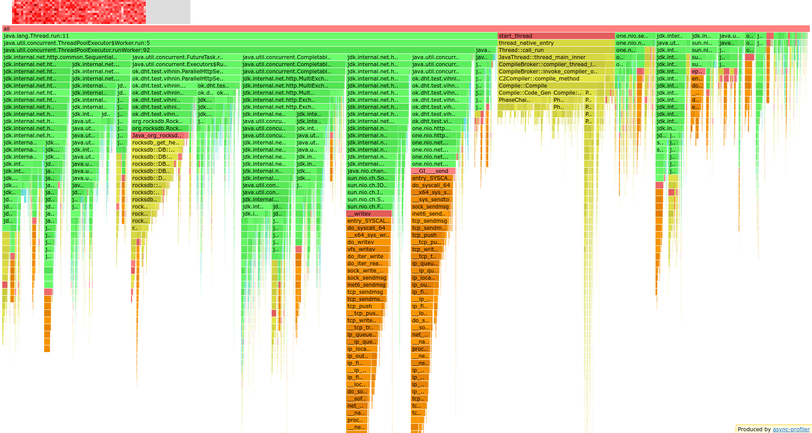
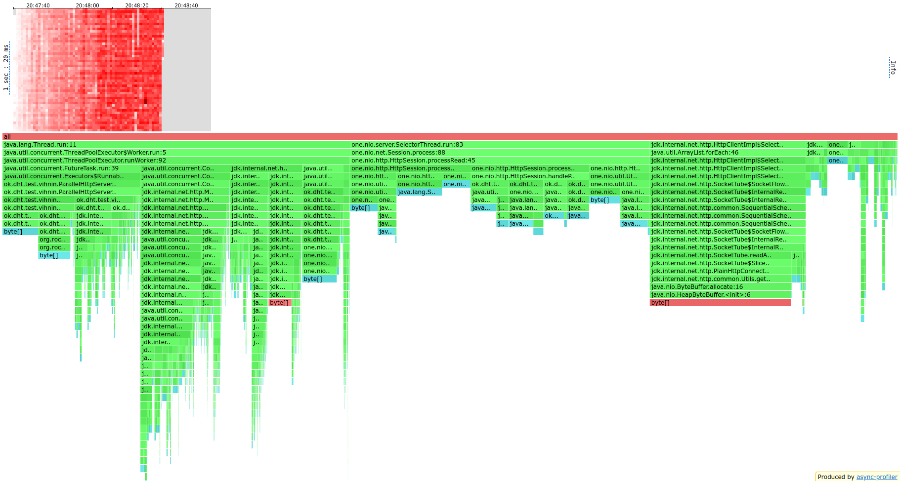
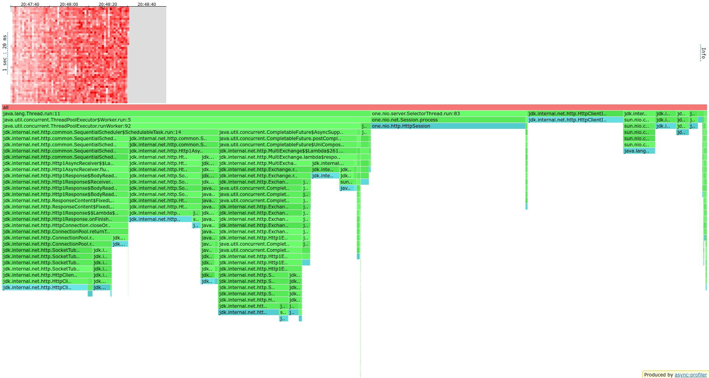
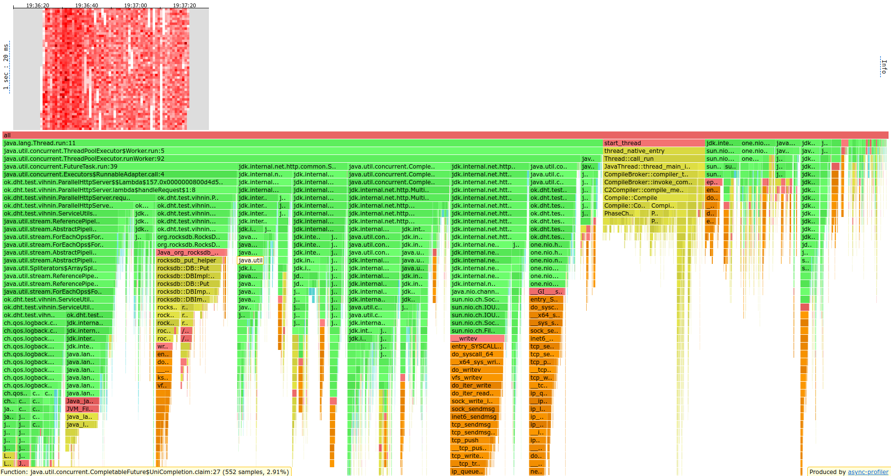
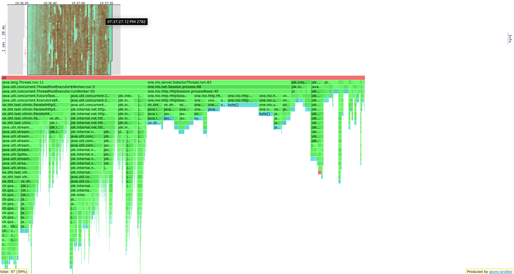
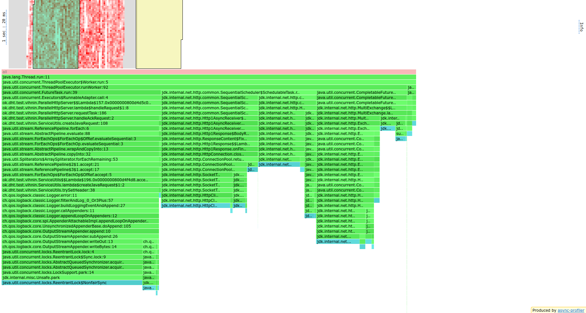

# ОТЧЕТ по 5-ему этапу.

В рамках данного этапа надо было перевести отправку запросов к соседним нодам
на подтверждение операции на асинхронный лад. Для этого была заменена обработка
в `handleRequest` на отправку запросов асинхронно к соседям, с передачей callback
который надо вызвать когда придет ответ или произойдет ошибка в ходе работы:

```java
private void handleAckRequest(Request request, String destinationUrl, ResponseAccumulator responseAccumulator) {
    try {
        HttpRequest javaRequest = ServiceUtils.createJavaRequest(request, destinationUrl);

        javaClients.get().get(destinationUrl)
                .sendAsync(javaRequest, HttpResponse.BodyHandlers.ofByteArray())
                .handleAsync((httpResponse, throwable) ->
                        handleSingleAcknowledgment(responseAccumulator, httpResponse, throwable),
                        internalRequestService
                );

    } catch (Exception e) {
        logger.error(e.getMessage());
        responseAccumulator.acknowledgeMissed();
    }
}
```

Для этого был разработан класс `ResponseAccumulator`, в котором собирается информация от поступающих
ответов. Очевидно, что мы не можем полагаться на какую-то последовательность вызовов,
так что надо как-то неблокирующим образом (иначе отличий от предыдущей версии не будет)
аккумулировать данные от запросов. Точнее нам надо так же как и раньше разграничивать
случай обработки гета, так как нам надо брать самый свежий ответ, и пут, где надо лишь
убедиться в количестве подтверждения. Потому я написал в этом аккумуляторе функцию, к которой у всех тредов есть доступ 
и которая локфри алгоритмом через `cas` обновляет данные о лучшем ответе, в случае гета, и в общем случае 
обновлять счётчик ответов и подтверждений.

```java
private void acknowledge(boolean success, Long time, Integer status, byte[] data) {
    if (success && method == Request.METHOD_GET) {
        Data newData = new Data(status, time, data);
        while (bestData.get().time < time) {
            Data curData = bestData.get();
            if (bestData.compareAndSet(curData, newData)) {
                break;
            }
        }
    }

    int curAck = acknowledged.incrementAndGet();

    answer(curAck);
}
```

Важно то, что нам принципиально лишь значение времени ответа, потому в вайл мы заходим только
если наше время лучше уже имеющегося, и пытаемся вписать свое значение. Заметим, что
мы всегда имеем прогресс, так как можно выстроить линейный порядок на времени ответов и если мы
выходим на "новый круг" цикла, то значит кто-то быстрее нас обновился, то есть максимум
количество нод раз мы зайдем в вайл. Да, алгоритм получается квадратичным в худшем случае, что
можно улучшить, например введя тред-сейф массив размера `from` и каждой ноде дать индекс.
Как наберется нужное количество, вызвать форсиком сбор и поиск лучшего ответа, в случае гета, или
просто закончить обработку иначе.

## Наблюдения при профилировании

### Настройка профилирования
Похожий скрипт `run5.sh` который по методу, числу тредов, числу конекшенов и значению RTS запускает
профилирование на двух нодах, запущенных перед этим, и нагружает в соответствие с параметрами
на протяжении минуту одну из нод.

Для гета отличие лишь в том, что сначала ноды набиваются данными последовательными путами
с большими кусками данных, как на диске окажется в районе 800Mb, начинаются запуски гетов.

### Наблюдения
В рамках профилирования обнаруживается что использование дефолтного экзекьютера для
для обработки асинхронных запросов не подходит, так как он банально не справляется с
высокой нагрузкой. Потому заменяется на один из уже имеющихся (internalExecutorService), с
увеличением очереди в 20 раз, так как теперь на него поступает сильно больше хоть и не больших
запросов.

Также при тестировании случайно обнаружилось, что я писал в лог все ошибки о запрете
замены хедоров Host и Content-Length, что сильно тормозило из-за большего числа локов,
потом было решено руками ограничить их присваивание при создании джавого реквеста, и переписать
стрим на фор для эвристического ускорения.

ТЕПЕРЬ САМО ТЕСТИРОВАНИЕ

Стабильной нагрузкой для `put` в моей реализации становится 15-16k RPS, что меньше ранних
20-20k. Для гета число еще сильнее ухудшилось: с 20k упало до 10k.

Посмотрим на результаты профилирования:

### GET

CPU

ALLOC

LOCK



### PUT

CPU

ALLOC

LOCK



Казалось бы, мы же должны были улучшить производительность, а по факту она стала
хуже? 

Давайте обратим внимания на измерения:
* В нулевых, видно что мы стали больше тратить ресурсов на сеть, чем на свои вычисления
* Во-первых, наш алгоритм хоть и локфри, но не оптимален, как было указано выше.
* Во-вторых, в цпу на обеих операциях возникли в районе 13% затрат завязанных на CompletableFuture,
15 % SequantialSheduler и ещё 13% FutureTask. Общение между тредами дело не самое дешевое,
особенно с учетом того, так что ту сильно зависит от реализации. И Джавовский клиент явно
не лучшим образом под это заточен. Плюс из-за шедулера у нас возникли локи, которые тормозят.
* Мы также тратим много силь на сборку запроса, парсинг строк и так далее, хотя общаемся по внутренней сети,
и меняем лишь параметры запроса. В общем есть куда развиваться.


### Вывод:

Мы улучшили наш алгоритм технически, но из-за несовершенства намим используемых примитив взаимоействия
между тредами и с сетью, мы нагрузили наше приложение больше, чем выиграли, потому надо вложиться
в написание своих реализаций, который может менее надежные, но из-за специфики наших задач не требуют
такой точности и безопасности, как это сделано вещами из коробки.