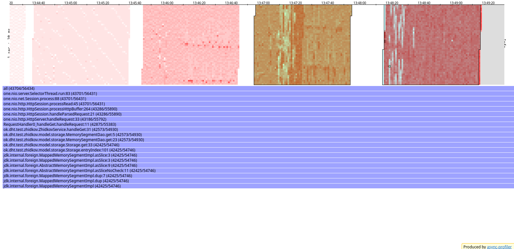

### **Отчёт Stage №1**

Я разделил выполненную мною работу в несколько частей: *dummy*, *hard* и *real-work-imitation*.
    
В части *dummy* я выполняю простенькие последовательные запросы на небольшой объём данных. Скрипты, описывающие их,
находятся в файлах *get_dummy.lua* и *put_dummy.lua*.

В части *hard* я выполняю запросы, которые могут содержать в себе значения сохраняемых записей вплоть
до нескольких килобайт. Скрипты, описывающие их,
находятся в файлах *get_hard.lua* и *put_hard.lua*.

В части *real-work-imitation* я имитировал (достаточно примитивно) реальную работу
сервера: запросы идут вперемешку и часто с немаленькими объёмами данных. Скрипты, описывающие их,
находятся в файлах *get_hard.lua* и *put_hard.lua*.

**N.B:** Для каждого варианта нагрузочного тестирования устанавливались следующие значения:

* Количество потоков - 1
* Количество соединений - 1
* Время тестирования - 1 минута

Для профайлера были следующие значения:
* Интервал профилирования - 500 мкс.

#### PUT-запросы (dummy)
##### **Нагрузочное тестирование**

Проведу нагрузочное тестирование для простых put-запросов (объём данных не больше нескольких байт, id последовательные
от 1 до N).

rate = 1000
``````
Running 1m test @ http://localhost:8080
  1 threads and 1 connections
  Thread calibration: mean lat.: 1.088ms, rate sampling interval: 10ms
  Thread Stats   Avg      Stdev     Max   +/- Stdev
    Latency     1.07ms  576.11us  24.70ms   79.77%
    Req/Sec     1.05k    91.54     3.30k    86.65%
  Latency Distribution (HdrHistogram - Recorded Latency)
 50.000%    1.05ms
 75.000%    1.35ms
 90.000%    1.64ms
 99.000%    1.99ms
 99.900%    6.63ms
 99.990%   20.46ms
 99.999%   24.72ms
100.000%   24.72ms

  Detailed Percentile spectrum:
       Value   Percentile   TotalCount 1/(1-Percentile)

       0.122     0.000000            1         1.00
       0.481     0.100000         5003         1.11
       0.681     0.200000        10016         1.25
       0.821     0.300000        15034         1.43
       0.939     0.400000        20005         1.67
       1.054     0.500000        25009         2.00
       1.111     0.550000        27515         2.22
       1.170     0.600000        30011         2.50
       1.225     0.650000        32498         2.86
       1.283     0.700000        35002         3.33
       1.345     0.750000        37522         4.00
       1.379     0.775000        38762         4.44
       1.417     0.800000        39997         5.00
       1.465     0.825000        41247         5.71
       1.525     0.850000        42496         6.67
       1.582     0.875000        43751         8.00
       1.611     0.887500        44371         8.89
       1.640     0.900000        45010        10.00
       1.673     0.912500        45624        11.43
       1.706     0.925000        46256        13.33
       1.743     0.937500        46883        16.00
       1.760     0.943750        47184        17.78
       1.780     0.950000        47511        20.00
       1.796     0.956250        47811        22.86
       1.816     0.962500        48128        26.67
       1.839     0.968750        48439        32.00
       1.852     0.971875        48591        35.56
       1.866     0.975000        48759        40.00
       1.880     0.978125        48904        45.71
       1.899     0.981250        49062        53.33
       1.923     0.984375        49218        64.00
       1.940     0.985938        49296        71.11
       1.959     0.987500        49374        80.00
       1.980     0.989062        49451        91.43
       2.005     0.990625        49527       106.67
       2.031     0.992188        49606       128.00
       2.049     0.992969        49648       142.22
       2.069     0.993750        49683       160.00
       2.129     0.994531        49724       182.86
       2.189     0.995313        49761       213.33
       2.361     0.996094        49800       256.00
       2.615     0.996484        49820       284.44
       2.853     0.996875        49840       320.00
       3.131     0.997266        49859       365.71
       3.581     0.997656        49878       426.67
       4.139     0.998047        49898       512.00
       4.459     0.998242        49908       568.89
       4.819     0.998437        49917       640.00
       5.315     0.998633        49927       731.43
       6.123     0.998828        49937       853.33
       6.655     0.999023        49947      1024.00
       7.143     0.999121        49952      1137.78
       7.395     0.999219        49956      1280.00
       7.739     0.999316        49961      1462.86
       8.447     0.999414        49966      1706.67
       9.031     0.999512        49971      2048.00
       9.791     0.999561        49974      2275.56
      10.255     0.999609        49976      2560.00
      11.143     0.999658        49978      2925.71
      12.551     0.999707        49981      3413.33
      14.271     0.999756        49983      4096.00
      16.039     0.999780        49985      4551.11
      16.927     0.999805        49986      5120.00
      17.807     0.999829        49987      5851.43
      18.687     0.999854        49988      6826.67
      19.567     0.999878        49989      8192.00
      20.463     0.999890        49990      9102.22
      21.327     0.999902        49991     10240.00
      21.327     0.999915        49991     11702.86
      22.207     0.999927        49992     13653.33
      22.207     0.999939        49992     16384.00
      23.071     0.999945        49993     18204.44
      23.071     0.999951        49993     20480.00
      23.071     0.999957        49993     23405.71
      23.935     0.999963        49994     27306.67
      23.935     0.999969        49994     32768.00
      23.935     0.999973        49994     36408.89
      23.935     0.999976        49994     40960.00
      23.935     0.999979        49994     46811.43
      24.719     0.999982        49995     54613.33
      24.719     1.000000        49995          inf
#[Mean    =        1.075, StdDeviation   =        0.576]
#[Max     =       24.704, Total count    =        49995]
#[Buckets =           27, SubBuckets     =         2048]
----------------------------------------------------------
  60001 requests in 1.00m, 3.83MB read
Requests/sec:   1000.00
Transfer/sec:     65.43KB
``````

rate = 2000
``````
Running 1m test @ http://localhost:8080
  1 threads and 1 connections
  Thread calibration: mean lat.: 1.215ms, rate sampling interval: 10ms
  Thread Stats   Avg      Stdev     Max   +/- Stdev
    Latency     1.06ms  514.50us  14.18ms   64.87%
    Req/Sec     2.11k   170.70     4.30k    67.58%
  Latency Distribution (HdrHistogram - Recorded Latency)
 50.000%    1.06ms
 75.000%    1.40ms
 90.000%    1.76ms
 99.000%    2.08ms
 99.900%    2.70ms
 99.990%   10.09ms
 99.999%   13.77ms
100.000%   14.18ms

  Detailed Percentile spectrum:
       Value   Percentile   TotalCount 1/(1-Percentile)

       0.033     0.000000            1         1.00
       0.383     0.100000        10001         1.11
       0.592     0.200000        20006         1.25
       0.782     0.300000        30061         1.43
       0.934     0.400000        40011         1.67
       1.056     0.500000        50054         2.00
       1.111     0.550000        55042         2.22
       1.170     0.600000        60060         2.50
       1.231     0.650000        65003         2.86
       1.307     0.700000        70031         3.33
       1.405     0.750000        75034         4.00
       1.460     0.775000        77515         4.44
       1.516     0.800000        80043         5.00
       1.572     0.825000        82515         5.71
       1.635     0.850000        85035         6.67
       1.698     0.875000        87518         8.00
       1.728     0.887500        88790         8.89
       1.758     0.900000        90013        10.00
       1.790     0.912500        91275        11.43
       1.823     0.925000        92527        13.33
       1.859     0.937500        93768        16.00
       1.878     0.943750        94386        17.78
       1.898     0.950000        95013        20.00
       1.919     0.956250        95649        22.86
       1.941     0.962500        96260        26.67
       1.964     0.968750        96883        32.00
       1.977     0.971875        97220        35.56
       1.988     0.975000        97496        40.00
       2.003     0.978125        97817        45.71
       2.019     0.981250        98139        53.33
       2.033     0.984375        98434        64.00
       2.042     0.985938        98591        71.11
       2.055     0.987500        98759        80.00
       2.067     0.989062        98910        91.43
       2.085     0.990625        99068       106.67
       2.103     0.992188        99215       128.00
       2.111     0.992969        99290       142.22
       2.125     0.993750        99374       160.00
       2.137     0.994531        99450       182.86
       2.155     0.995313        99531       213.33
       2.171     0.996094        99604       256.00
       2.187     0.996484        99644       284.44
       2.205     0.996875        99683       320.00
       2.223     0.997266        99723       365.71
       2.253     0.997656        99760       426.67
       2.305     0.998047        99799       512.00
       2.337     0.998242        99818       568.89
       2.375     0.998437        99837       640.00
       2.431     0.998633        99858       731.43
       2.561     0.998828        99876       853.33
       2.763     0.999023        99896      1024.00
       2.861     0.999121        99906      1137.78
       3.015     0.999219        99915      1280.00
       3.213     0.999316        99925      1462.86
       3.517     0.999414        99935      1706.67
       3.907     0.999512        99945      2048.00
       4.061     0.999561        99950      2275.56
       4.303     0.999609        99954      2560.00
       4.655     0.999658        99959      2925.71
       5.431     0.999707        99964      3413.33
       6.027     0.999756        99969      4096.00
       6.419     0.999780        99972      4551.11
       6.839     0.999805        99974      5120.00
       7.303     0.999829        99976      5851.43
       8.231     0.999854        99979      6826.67
       9.159     0.999878        99981      8192.00
      10.087     0.999890        99983      9102.22
      10.551     0.999902        99984     10240.00
      11.007     0.999915        99985     11702.86
      11.471     0.999927        99986     13653.33
      11.935     0.999939        99987     16384.00
      12.399     0.999945        99988     18204.44
      12.863     0.999951        99989     20480.00
      12.863     0.999957        99989     23405.71
      13.319     0.999963        99990     27306.67
      13.319     0.999969        99990     32768.00
      13.775     0.999973        99992     36408.89
      13.775     0.999976        99992     40960.00
      13.775     0.999979        99992     46811.43
      13.775     0.999982        99992     54613.33
      13.775     0.999985        99992     65536.00
      13.775     0.999986        99992     72817.78
      13.775     0.999988        99992     81920.00
      13.775     0.999989        99992     93622.86
      14.183     0.999991        99993    109226.67
      14.183     1.000000        99993          inf
#[Mean    =        1.063, StdDeviation   =        0.515]
#[Max     =       14.176, Total count    =        99993]
#[Buckets =           27, SubBuckets     =         2048]
----------------------------------------------------------
  119999 requests in 1.00m, 7.67MB read
Requests/sec:   1999.97
Transfer/sec:    130.86KB
``````

rate = 5000
``````
Running 1m test @ http://localhost:8080
  1 threads and 1 connections
  Thread calibration: mean lat.: 0.927ms, rate sampling interval: 10ms
  Thread Stats   Avg      Stdev     Max   +/- Stdev
    Latency     0.91ms    0.90ms  24.77ms   93.50%
    Req/Sec     5.28k   507.12    16.60k    79.16%
  Latency Distribution (HdrHistogram - Recorded Latency)
 50.000%  831.00us
 75.000%    1.14ms
 90.000%    1.65ms
 99.000%    2.22ms
 99.900%   16.37ms
 99.990%   23.77ms
 99.999%   24.56ms
100.000%   24.78ms

  Detailed Percentile spectrum:
       Value   Percentile   TotalCount 1/(1-Percentile)

       0.031     0.000000            4         1.00
       0.259     0.100000        25010         1.11
       0.405     0.200000        50110         1.25
       0.547     0.300000        75015         1.43
       0.690     0.400000       100135         1.67
       0.831     0.500000       125088         2.00
       0.900     0.550000       137519         2.22
       0.965     0.600000       150116         2.50
       1.024     0.650000       162600         2.86
       1.082     0.700000       175175         3.33
       1.142     0.750000       187520         4.00
       1.175     0.775000       193920         4.44
       1.214     0.800000       200012         5.00
       1.280     0.825000       206298         5.71
       1.389     0.850000       212512         6.67
       1.518     0.875000       218737         8.00
       1.586     0.887500       221881         8.89
       1.648     0.900000       224985        10.00
       1.711     0.912500       228155        11.43
       1.767     0.925000       231240        13.33
       1.823     0.937500       234409        16.00
       1.849     0.943750       235985        17.78
       1.873     0.950000       237494        20.00
       1.899     0.956250       239093        22.86
       1.923     0.962500       240651        26.67
       1.950     0.968750       242209        32.00
       1.966     0.971875       242962        35.56
       1.983     0.975000       243763        40.00
       2.000     0.978125       244551        45.71
       2.019     0.981250       245305        53.33
       2.053     0.984375       246111        64.00
       2.081     0.985938       246472        71.11
       2.123     0.987500       246865        80.00
       2.175     0.989062       247255        91.43
       2.255     0.990625       247639       106.67
       2.371     0.992188       248032       128.00
       2.451     0.992969       248223       142.22
       2.545     0.993750       248420       160.00
       2.665     0.994531       248613       182.86
       2.797     0.995313       248813       213.33
       3.035     0.996094       249004       256.00
       3.223     0.996484       249103       284.44
       3.509     0.996875       249199       320.00
       3.943     0.997266       249297       365.71
       5.383     0.997656       249395       426.67
       8.831     0.998047       249492       512.00
      10.391     0.998242       249541       568.89
      11.935     0.998437       249590       640.00
      13.359     0.998633       249639       731.43
      15.215     0.998828       249688       853.33
      16.655     0.999023       249736      1024.00
      17.663     0.999121       249761      1137.78
      18.559     0.999219       249785      1280.00
      19.503     0.999316       249810      1462.86
      20.495     0.999414       249834      1706.67
      21.407     0.999512       249858      2048.00
      21.871     0.999561       249871      2275.56
      22.175     0.999609       249884      2560.00
      22.271     0.999658       249897      2925.71
      22.447     0.999707       249907      3413.33
      22.831     0.999756       249919      4096.00
      22.991     0.999780       249926      4551.11
      23.151     0.999805       249932      5120.00
      23.343     0.999829       249938      5851.43
      23.551     0.999854       249944      6826.67
      23.679     0.999878       249950      8192.00
      23.743     0.999890       249954      9102.22
      23.791     0.999902       249956     10240.00
      23.903     0.999915       249960     11702.86
      23.999     0.999927       249962     13653.33
      24.079     0.999939       249965     16384.00
      24.143     0.999945       249967     18204.44
      24.159     0.999951       249968     20480.00
      24.239     0.999957       249972     23405.71
      24.239     0.999963       249972     27306.67
      24.271     0.999969       249973     32768.00
      24.287     0.999973       249974     36408.89
      24.287     0.999976       249974     40960.00
      24.319     0.999979       249975     46811.43
      24.335     0.999982       249976     54613.33
      24.399     0.999985       249977     65536.00
      24.399     0.999986       249977     72817.78
      24.399     0.999988       249977     81920.00
      24.559     0.999989       249978     93622.86
      24.559     0.999991       249978    109226.67
      24.687     0.999992       249979    131072.00
      24.687     0.999993       249979    145635.56
      24.687     0.999994       249979    163840.00
      24.687     0.999995       249979    187245.71
      24.687     0.999995       249979    218453.33
      24.783     0.999996       249980    262144.00
      24.783     1.000000       249980          inf
#[Mean    =        0.907, StdDeviation   =        0.903]
#[Max     =       24.768, Total count    =       249980]
#[Buckets =           27, SubBuckets     =         2048]
----------------------------------------------------------
  299998 requests in 1.00m, 19.17MB read
Requests/sec:   4999.97
Transfer/sec:    327.15KB
``````

rate = 10000
``````
Running 1m test @ http://localhost:8080
  1 threads and 1 connections
  Thread calibration: mean lat.: 9.094ms, rate sampling interval: 56ms
  Thread Stats   Avg      Stdev     Max   +/- Stdev
    Latency     7.52ms   11.96ms  92.22ms   86.94%
    Req/Sec    10.09k     1.72k   22.93k    81.17%
  Latency Distribution (HdrHistogram - Recorded Latency)
 50.000%    1.64ms
 75.000%    9.40ms
 90.000%   23.44ms
 99.000%   53.73ms
 99.900%   81.41ms
 99.990%   90.94ms
 99.999%   92.10ms
100.000%   92.29ms

  Detailed Percentile spectrum:
       Value   Percentile   TotalCount 1/(1-Percentile)

       0.031     0.000000            2         1.00
       0.339     0.100000        50111         1.11
       0.602     0.200000       100189         1.25
       0.850     0.300000       150152         1.43
       1.079     0.400000       200146         1.67
       1.637     0.500000       249995         2.00
       2.019     0.550000       275031         2.22
       2.961     0.600000       300006         2.50
       4.607     0.650000       325021         2.86
       6.855     0.700000       349997         3.33
       9.399     0.750000       374997         4.00
      10.935     0.775000       387505         4.44
      12.863     0.800000       400019         5.00
      14.887     0.825000       412505         5.71
      17.407     0.850000       425017         6.67
      20.111     0.875000       437506         8.00
      21.743     0.887500       443798         8.89
      23.439     0.900000       450021        10.00
      25.791     0.912500       456236        11.43
      28.607     0.925000       462507        13.33
      31.535     0.937500       468749        16.00
      32.831     0.943750       471916        17.78
      34.335     0.950000       475041        20.00
      35.807     0.956250       478157        22.86
      38.015     0.962500       481237        26.67
      41.215     0.968750       484359        32.00
      42.719     0.971875       485951        35.56
      44.159     0.975000       487514        40.00
      46.111     0.978125       489075        45.71
      47.615     0.981250       490622        53.33
      49.247     0.984375       492204        64.00
      49.983     0.985938       492954        71.11
      51.583     0.987500       493743        80.00
      52.863     0.989062       494523        91.43
      54.431     0.990625       495296       106.67
      55.775     0.992188       496086       128.00
      56.735     0.992969       496471       142.22
      57.599     0.993750       496894       160.00
      58.431     0.994531       497251       182.86
      59.871     0.995313       497644       213.33
      61.855     0.996094       498027       256.00
      63.295     0.996484       498224       284.44
      64.095     0.996875       498425       320.00
      64.607     0.997266       498619       365.71
      65.919     0.997656       498809       426.67
      69.119     0.998047       499006       512.00
      70.399     0.998242       499102       568.89
      72.639     0.998437       499199       640.00
      75.711     0.998633       499298       731.43
      78.591     0.998828       499397       853.33
      81.535     0.999023       499507      1024.00
      81.919     0.999121       499544      1137.78
      82.431     0.999219       499591      1280.00
      83.327     0.999316       499640      1462.86
      84.799     0.999414       499690      1706.67
      86.143     0.999512       499737      2048.00
      86.911     0.999561       499762      2275.56
      87.359     0.999609       499793      2560.00
      87.807     0.999658       499811      2925.71
      88.319     0.999707       499835      3413.33
      88.959     0.999756       499858      4096.00
      89.343     0.999780       499872      4551.11
      89.663     0.999805       499883      5120.00
      90.047     0.999829       499895      5851.43
      90.431     0.999854       499908      6826.67
      90.751     0.999878       499924      8192.00
      90.815     0.999890       499926      9102.22
      91.007     0.999902       499933     10240.00
      91.199     0.999915       499939     11702.86
      91.327     0.999927       499944     13653.33
      91.455     0.999939       499950     16384.00
      91.583     0.999945       499954     18204.44
      91.647     0.999951       499957     20480.00
      91.711     0.999957       499959     23405.71
      91.775     0.999963       499962     27306.67
      91.903     0.999969       499966     32768.00
      91.967     0.999973       499970     36408.89
      91.967     0.999976       499970     40960.00
      91.967     0.999979       499970     46811.43
      92.031     0.999982       499972     54613.33
      92.095     0.999985       499975     65536.00
      92.095     0.999986       499975     72817.78
      92.095     0.999988       499975     81920.00
      92.095     0.999989       499975     93622.86
      92.159     0.999991       499977    109226.67
      92.159     0.999992       499977    131072.00
      92.159     0.999993       499977    145635.56
      92.159     0.999994       499977    163840.00
      92.223     0.999995       499979    187245.71
      92.223     0.999995       499979    218453.33
      92.223     0.999996       499979    262144.00
      92.223     0.999997       499979    291271.11
      92.223     0.999997       499979    327680.00
      92.223     0.999997       499979    374491.43
      92.223     0.999998       499979    436906.67
      92.287     0.999998       499980    524288.00
      92.287     1.000000       499980          inf
#[Mean    =        7.520, StdDeviation   =       11.959]
#[Max     =       92.224, Total count    =       499980]
#[Buckets =           27, SubBuckets     =         2048]
----------------------------------------------------------
  599923 requests in 1.00m, 38.33MB read
Requests/sec:   9998.75
Transfer/sec:    654.22KB
``````

rate = 20000
``````
Running 1m test @ http://localhost:8080
  1 threads and 1 connections
  Thread calibration: mean lat.: 102.323ms, rate sampling interval: 423ms
  Thread Stats   Avg      Stdev     Max   +/- Stdev
    Latency    75.95ms   88.35ms 380.16ms   83.83%
    Req/Sec    20.03k     2.76k   27.13k    64.41%
  Latency Distribution (HdrHistogram - Recorded Latency)
 50.000%   42.37ms
 75.000%  118.72ms
 90.000%  221.31ms
 99.000%  348.42ms
 99.900%  375.81ms
 99.990%  379.39ms
 99.999%  380.42ms
100.000%  380.42ms

  Detailed Percentile spectrum:
       Value   Percentile   TotalCount 1/(1-Percentile)

       0.027     0.000000            4         1.00
       0.745     0.100000       100032         1.11
       2.855     0.200000       200022         1.25
      10.423     0.300000       299988         1.43
      23.855     0.400000       400086         1.67
      42.367     0.500000       499969         2.00
      52.735     0.550000       550067         2.22
      62.175     0.600000       600022         2.50
      75.647     0.650000       649990         2.86
      93.311     0.700000       699948         3.33
     118.719     0.750000       750066         4.00
     129.855     0.775000       775004         4.44
     142.463     0.800000       800113         5.00
     154.751     0.825000       824998         5.71
     172.159     0.850000       849936         6.67
     197.375     0.875000       874973         8.00
     211.455     0.887500       887489         8.89
     221.311     0.900000       900041        10.00
     230.527     0.912500       912485        11.43
     238.463     0.925000       925021        13.33
     250.111     0.937500       937503        16.00
     255.103     0.943750       943704        17.78
     261.247     0.950000       949946        20.00
     272.639     0.956250       956310        22.86
     290.815     0.962500       962456        26.67
     305.663     0.968750       968778        32.00
     312.575     0.971875       971899        35.56
     318.719     0.975000       974987        40.00
     323.839     0.978125       978061        45.71
     328.447     0.981250       981199        53.33
     334.079     0.984375       984399        64.00
     337.663     0.985938       985878        71.11
     342.015     0.987500       987439        80.00
     346.111     0.989062       989036        91.43
     349.951     0.990625       990592       106.67
     356.095     0.992188       992245       128.00
     357.375     0.992969       992936       142.22
     360.447     0.993750       993735       160.00
     363.263     0.994531       994476       182.86
     366.079     0.995313       995241       213.33
     368.895     0.996094       996035       256.00
     369.663     0.996484       996412       284.44
     370.943     0.996875       996821       320.00
     372.735     0.997266       997237       365.71
     373.759     0.997656       997632       426.67
     374.527     0.998047       998100       512.00
     374.783     0.998242       998398       568.89
     374.783     0.998437       998398       640.00
     375.039     0.998633       998588       731.43
     375.551     0.998828       998759       853.33
     375.807     0.999023       999021      1024.00
     376.063     0.999121       999096      1137.78
     376.831     0.999219       999157      1280.00
     378.111     0.999316       999243      1462.86
     378.623     0.999414       999367      1706.67
     378.879     0.999512       999534      2048.00
     378.879     0.999561       999534      2275.56
     378.879     0.999609       999534      2560.00
     379.135     0.999658       999721      2925.71
     379.135     0.999707       999721      3413.33
     379.135     0.999756       999721      4096.00
     379.135     0.999780       999721      4551.11
     379.391     0.999805       999832      5120.00
     379.391     0.999829       999832      5851.43
     379.391     0.999854       999832      6826.67
     379.391     0.999878       999832      8192.00
     379.391     0.999890       999832      9102.22
     379.391     0.999902       999832     10240.00
     379.647     0.999915       999859     11702.86
     379.647     0.999927       999859     13653.33
     379.903     0.999939       999880     16384.00
     379.903     0.999945       999880     18204.44
     379.903     0.999951       999880     20480.00
     380.159     0.999957       999900     23405.71
     380.159     0.999963       999900     27306.67
     380.159     0.999969       999900     32768.00
     380.159     0.999973       999900     36408.89
     380.159     0.999976       999900     40960.00
     380.415     0.999979       999924     46811.43
     380.415     1.000000       999924          inf
#[Mean    =       75.951, StdDeviation   =       88.349]
#[Max     =      380.160, Total count    =       999924]
#[Buckets =           27, SubBuckets     =         2048]
----------------------------------------------------------
  1199977 requests in 1.00m, 76.67MB read
Requests/sec:  19999.66
Transfer/sec:      1.28MB
``````

rate = 50000
``````
Running 1m test @ http://localhost:8080
  1 threads and 1 connections
  Thread calibration: mean lat.: 2692.251ms, rate sampling interval: 9740ms
  Thread Stats   Avg      Stdev     Max   +/- Stdev
    Latency    19.88s     8.30s   34.37s    58.03%
    Req/Sec    21.16k   411.10    21.89k    60.00%
  Latency Distribution (HdrHistogram - Recorded Latency)
 50.000%   20.17s 
 75.000%   26.84s 
 90.000%   31.36s 
 99.000%   34.11s 
 99.900%   34.37s 
 99.990%   34.37s 
 99.999%   34.41s 
100.000%   34.41s 

  Detailed Percentile spectrum:
       Value   Percentile   TotalCount 1/(1-Percentile)

    5525.503     0.000000           42         1.00
    8323.071     0.100000       105796         1.11
   11272.191     0.200000       211797         1.25
   14196.735     0.300000       317333         1.43
   16957.439     0.400000       422902         1.67
   20168.703     0.500000       528783         2.00
   21594.111     0.550000       581880         2.22
   22921.215     0.600000       634663         2.50
   24199.167     0.650000       687375         2.86
   25559.039     0.700000       741018         3.33
   26836.991     0.750000       793170         4.00
   27541.503     0.775000       819509         4.44
   28393.471     0.800000       845953         5.00
   29147.135     0.825000       872484         5.71
   29900.799     0.850000       898909         6.67
   30572.543     0.875000       925804         8.00
   30900.223     0.887500       938609         8.89
   31358.975     0.900000       951638        10.00
   31735.807     0.912500       964935        11.43
   32161.791     0.925000       978039        13.33
   32489.471     0.937500       991407        16.00
   32702.463     0.943750       997953        17.78
   32980.991     0.950000      1004894        20.00
   33161.215     0.956250      1011352        22.86
   33308.671     0.962500      1017764        26.67
   33472.511     0.968750      1024499        32.00
   33554.431     0.971875      1028128        35.56
   33619.967     0.975000      1031210        40.00
   33718.271     0.978125      1034278        45.71
   33849.343     0.981250      1039061        53.33
   33914.879     0.984375      1041042        64.00
   33980.415     0.985938      1043146        71.11
   34013.183     0.987500      1044371        80.00
   34078.719     0.989062      1046123        91.43
   34144.255     0.990625      1047746       106.67
   34209.791     0.992188      1050429       128.00
   34209.791     0.992969      1050429       142.22
   34242.559     0.993750      1051574       160.00
   34242.559     0.994531      1051574       182.86
   34275.327     0.995313      1052373       213.33
   34308.095     0.996094      1053762       256.00
   34308.095     0.996484      1053762       284.44
   34340.863     0.996875      1055238       320.00
   34340.863     0.997266      1055238       365.71
   34340.863     0.997656      1055238       426.67
   34340.863     0.998047      1055238       512.00
   34373.631     0.998242      1057115       568.89
   34373.631     0.998437      1057115       640.00
   34373.631     0.998633      1057115       731.43
   34373.631     0.998828      1057115       853.33
   34373.631     0.999023      1057115      1024.00
   34373.631     0.999121      1057115      1137.78
   34373.631     0.999219      1057115      1280.00
   34373.631     0.999316      1057115      1462.86
   34373.631     0.999414      1057115      1706.67
   34373.631     0.999512      1057115      2048.00
   34373.631     0.999561      1057115      2275.56
   34373.631     0.999609      1057115      2560.00
   34373.631     0.999658      1057115      2925.71
   34373.631     0.999707      1057115      3413.33
   34373.631     0.999756      1057115      4096.00
   34373.631     0.999780      1057115      4551.11
   34373.631     0.999805      1057115      5120.00
   34373.631     0.999829      1057115      5851.43
   34373.631     0.999854      1057115      6826.67
   34373.631     0.999878      1057115      8192.00
   34373.631     0.999890      1057115      9102.22
   34373.631     0.999902      1057115     10240.00
   34373.631     0.999915      1057115     11702.86
   34373.631     0.999927      1057115     13653.33
   34406.399     0.999939      1057189     16384.00
   34406.399     1.000000      1057189          inf
#[Mean    =    19876.392, StdDeviation   =     8297.586]
#[Max     =    34373.632, Total count    =      1057189]
#[Buckets =           27, SubBuckets     =         2048]
----------------------------------------------------------
  1281211 requests in 1.00m, 81.86MB read
Requests/sec:  21353.57
Transfer/sec:      1.36MB
``````

По нагрузочному тестированию видно, что для rate от 1000 до 10000 среднее latency не превышает ~1 ms, что является
допустимым результатом. 

Однако стоит заметить, что для 10000 запросов в секунду максимальная задержка составляла почти 100 миллисекунд. 
Это уже достаточно медленный ответ. 

Так же стоит обратить внимание на то, что время ответов начинает сильно варьироваться. Это означает, что сервис
начинает не справляться с нагрузкой и при дальнейшем увеличении rate результаты будут становиться только хуже.

В действительности при увеличении rate до 20000 мы наблюдаем увеличении среднего latency до почти 100 ms, а при 
rate = 50000 сервер уже не справляется с заданной нагрузкой: среднее время ответа ~20 секунд, обрабатывается запросов
в секунду примерно 20k.

На основе полученных результатов можем сказать, что сервер способен обработать около 20000 запросов в секунду, однако,
если нам требуется среднее время ответа < 100 ms, то лучше снизить данное значение до 10000 запросов.

##### **Профилирование**

Рассмотрим heatmap и flamegraph для последних трёх запросов, поскольку для них нагрузка более видима.

**CPU**


Некоторые выводы из полученных результатов:

- Большую часть процессорного времени занимает работа с сокетом и обработка запроса (в общей сумме примерно 80%-90%),
остальное время происходит работа с базой данных (метод put) - ~10%
- При увеличении количества запросов в секунду увеличивается количество обращений к put

**alloc**


Некоторые выводы из полученных результатов:

- Аллокации между сервером и БД соотносятся, как ~70% на 30%
- Большая часть аллокации в БД происходит при записи во flush на диск и выделении MemorySegment (15% из 30%)
- При увеличении количества запросов, количество flush увеличивается.

#### PUT-запросы (hard)
##### **Нагрузочное тестирование**

Проведу нагрузочное тестирование для сложных put-запросов (объём данных ~2 Кб каждый, id случайны от 1 до 40000).

rate = 1000
``````
Running 1m test @ http://localhost:8080
  1 threads and 1 connections
  Thread calibration: mean lat.: 1.044ms, rate sampling interval: 10ms
  Thread Stats   Avg      Stdev     Max   +/- Stdev
    Latency     0.98ms  447.92us  11.29ms   74.23%
    Req/Sec     1.05k    83.19     1.90k    89.27%
  Latency Distribution (HdrHistogram - Recorded Latency)
 50.000%    0.97ms
 75.000%    1.25ms
 90.000%    1.45ms
 99.000%    1.95ms
 99.900%    5.01ms
 99.990%    9.49ms
 99.999%   11.30ms
100.000%   11.30ms

  Detailed Percentile spectrum:
       Value   Percentile   TotalCount 1/(1-Percentile)

       0.088     0.000000            1         1.00
       0.471     0.100000         5029         1.11
       0.607     0.200000        10009         1.25
       0.736     0.300000        15008         1.43
       0.852     0.400000        20015         1.67
       0.970     0.500000        25007         2.00
       1.025     0.550000        27483         2.22
       1.080     0.600000        30012         2.50
       1.134     0.650000        32500         2.86
       1.190     0.700000        34981         3.33
       1.248     0.750000        37459         4.00
       1.277     0.775000        38727         4.44
       1.305     0.800000        39954         5.00
       1.337     0.825000        41218         5.71
       1.369     0.850000        42461         6.67
       1.408     0.875000        43713         8.00
       1.430     0.887500        44355         8.89
       1.451     0.900000        44958        10.00
       1.477     0.912500        45596        11.43
       1.507     0.925000        46206        13.33
       1.554     0.937500        46829        16.00
       1.582     0.943750        47135        17.78
       1.616     0.950000        47448        20.00
       1.652     0.956250        47761        22.86
       1.692     0.962500        48074        26.67
       1.740     0.968750        48386        32.00
       1.761     0.971875        48540        35.56
       1.790     0.975000        48699        40.00
       1.818     0.978125        48852        45.71
       1.846     0.981250        49006        53.33
       1.875     0.984375        49162        64.00
       1.892     0.985938        49241        71.11
       1.913     0.987500        49319        80.00
       1.933     0.989062        49398        91.43
       1.956     0.990625        49477       106.67
       1.992     0.992188        49554       128.00
       2.007     0.992969        49591       142.22
       2.039     0.993750        49631       160.00
       2.075     0.994531        49669       182.86
       2.131     0.995313        49708       213.33
       2.293     0.996094        49747       256.00
       2.475     0.996484        49767       284.44
       2.807     0.996875        49786       320.00
       3.059     0.997266        49806       365.71
       3.279     0.997656        49825       426.67
       3.741     0.998047        49845       512.00
       3.879     0.998242        49855       568.89
       3.993     0.998437        49864       640.00
       4.231     0.998633        49874       731.43
       4.707     0.998828        49884       853.33
       5.083     0.999023        49894      1024.00
       5.495     0.999121        49899      1137.78
       5.775     0.999219        49903      1280.00
       6.039     0.999316        49908      1462.86
       6.559     0.999414        49913      1706.67
       6.875     0.999512        49918      2048.00
       7.375     0.999561        49921      2275.56
       7.419     0.999609        49923      2560.00
       7.695     0.999658        49925      2925.71
       7.859     0.999707        49928      3413.33
       8.303     0.999756        49930      4096.00
       8.615     0.999780        49933      4551.11
       8.615     0.999805        49933      5120.00
       8.647     0.999829        49934      5851.43
       9.007     0.999854        49935      6826.67
       9.087     0.999878        49936      8192.00
       9.495     0.999890        49938      9102.22
       9.495     0.999902        49938     10240.00
       9.495     0.999915        49938     11702.86
       9.847     0.999927        49939     13653.33
       9.847     0.999939        49939     16384.00
      10.359     0.999945        49940     18204.44
      10.359     0.999951        49940     20480.00
      10.359     0.999957        49940     23405.71
      10.591     0.999963        49941     27306.67
      10.591     0.999969        49941     32768.00
      10.591     0.999973        49941     36408.89
      10.591     0.999976        49941     40960.00
      10.591     0.999979        49941     46811.43
      11.295     0.999982        49942     54613.33
      11.295     1.000000        49942          inf
#[Mean    =        0.983, StdDeviation   =        0.448]
#[Max     =       11.288, Total count    =        49942]
#[Buckets =           27, SubBuckets     =         2048]
----------------------------------------------------------
  59947 requests in 1.00m, 3.83MB read
Requests/sec:    999.99
Transfer/sec:     65.43KB
``````

rate = 2000
``````
Running 1m test @ http://localhost:8080
  1 threads and 1 connections
  Thread calibration: mean lat.: 1.046ms, rate sampling interval: 10ms
  Thread Stats   Avg      Stdev     Max   +/- Stdev
    Latency     -nanus    -nanus   0.00us    0.00%
    Req/Sec     0.00      0.00     0.00    100.00%
  Latency Distribution (HdrHistogram - Recorded Latency)
 50.000%    0.00us
 75.000%    0.00us
 90.000%    0.00us
 99.000%    0.00us
 99.900%    0.00us
 99.990%    0.00us
 99.999%    0.00us
100.000%    0.00us

  Detailed Percentile spectrum:
       Value   Percentile   TotalCount 1/(1-Percentile)

       0.000     1.000000            0          inf
#[Mean    =         -nan, StdDeviation   =         -nan]
#[Max     =        0.000, Total count    =            0]
#[Buckets =           27, SubBuckets     =         2048]
----------------------------------------------------------
  6694 requests in 1.00m, 437.99KB read
  Socket errors: connect 0, read 0, write 0, timeout 28
Requests/sec:    111.56
Transfer/sec:      7.30KB
``````

Здесь при rate = 2000 сервер абсолютно не выдержал нагрузки и упал. Чтобы понять, почему это произошло обратимся к
профилировщику.

##### **Профилирование**

**CPU**


Мы можем здесь увидеть, насколько выросла доля используемого CPU БД по сравнению с прошлыми запросами. Хоть
в сумме put-запросов было сделано меньше (т. к. rate в 10 раз меньше), однако теперь 60% cpu уходит на работу с БД.
Чтобы понять, почему так происходит, обратимся к профилированию аллокаций.

**alloc**


Опять же, мы видим, что памяти аллоцируется теперь намного больше, а количество flush'ей больше, чем для 
10000 rate для прошлых запросов. Для 2000 rate, flush происходят вообще в каждом взятом сэмпле профилировщика.
Такие частые flush признак слишком маленького flush-threshold (1 Мб). Очевидно его размер нам не подходит и его необходимо
увеличить, чтобы справиться с большей нагрузкой.

#### PUT-запросы (hard, flush-threshold = 20 Mb)
##### **Нагрузочное тестирование**

rate = 1000
``````
Running 1m test @ http://localhost:8080
  1 threads and 1 connections
  Thread calibration: mean lat.: 1.206ms, rate sampling interval: 10ms
  Thread Stats   Avg      Stdev     Max   +/- Stdev
    Latency     1.16ms  595.09us  11.06ms   78.91%
    Req/Sec     1.05k   107.92     2.00k    80.93%
  Latency Distribution (HdrHistogram - Recorded Latency)
 50.000%    1.13ms
 75.000%    1.42ms
 90.000%    1.75ms
 99.000%    2.84ms
 99.900%    7.28ms
 99.990%    9.88ms
 99.999%   11.07ms
100.000%   11.07ms

  Detailed Percentile spectrum:
       Value   Percentile   TotalCount 1/(1-Percentile)

       0.128     0.000000            1         1.00
       0.538     0.100000         5004         1.11
       0.732     0.200000        10005         1.25
       0.886     0.300000        15005         1.43
       1.008     0.400000        20024         1.67
       1.128     0.500000        25008         2.00
       1.185     0.550000        27499         2.22
       1.242     0.600000        29969         2.50
       1.298     0.650000        32465         2.86
       1.357     0.700000        35001         3.33
       1.422     0.750000        37498         4.00
       1.461     0.775000        38727         4.44
       1.502     0.800000        39972         5.00
       1.554     0.825000        41215         5.71
       1.614     0.850000        42459         6.67
       1.681     0.875000        43721         8.00
       1.714     0.887500        44328         8.89
       1.750     0.900000        44959        10.00
       1.789     0.912500        45573        11.43
       1.823     0.925000        46203        13.33
       1.861     0.937500        46824        16.00
       1.881     0.943750        47144        17.78
       1.904     0.950000        47456        20.00
       1.928     0.956250        47769        22.86
       1.957     0.962500        48078        26.67
       1.986     0.968750        48390        32.00
       2.004     0.971875        48550        35.56
       2.024     0.975000        48705        40.00
       2.047     0.978125        48853        45.71
       2.081     0.981250        49007        53.33
       2.137     0.984375        49163        64.00
       2.195     0.985938        49242        71.11
       2.301     0.987500        49321        80.00
       2.641     0.989062        49397        91.43
       3.047     0.990625        49475       106.67
       3.531     0.992188        49553       128.00
       3.817     0.992969        49593       142.22
       4.073     0.993750        49631       160.00
       4.347     0.994531        49670       182.86
       4.631     0.995313        49709       213.33
       4.963     0.996094        49748       256.00
       5.163     0.996484        49769       284.44
       5.363     0.996875        49787       320.00
       5.587     0.997266        49807       365.71
       5.863     0.997656        49826       426.67
       6.203     0.998047        49846       512.00
       6.399     0.998242        49856       568.89
       6.547     0.998437        49865       640.00
       6.771     0.998633        49875       731.43
       7.099     0.998828        49885       853.33
       7.347     0.999023        49895      1024.00
       7.523     0.999121        49900      1137.78
       7.835     0.999219        49904      1280.00
       7.955     0.999316        49909      1462.86
       8.047     0.999414        49914      1706.67
       8.367     0.999512        49919      2048.00
       8.559     0.999561        49922      2275.56
       8.679     0.999609        49924      2560.00
       8.735     0.999658        49926      2925.71
       8.999     0.999707        49929      3413.33
       9.207     0.999756        49931      4096.00
       9.367     0.999780        49933      4551.11
       9.415     0.999805        49934      5120.00
       9.431     0.999829        49935      5851.43
       9.455     0.999854        49936      6826.67
       9.703     0.999878        49937      8192.00
       9.879     0.999890        49938      9102.22
      10.183     0.999902        49939     10240.00
      10.183     0.999915        49939     11702.86
      10.223     0.999927        49940     13653.33
      10.223     0.999939        49940     16384.00
      10.383     0.999945        49941     18204.44
      10.383     0.999951        49941     20480.00
      10.383     0.999957        49941     23405.71
      10.895     0.999963        49942     27306.67
      10.895     0.999969        49942     32768.00
      10.895     0.999973        49942     36408.89
      10.895     0.999976        49942     40960.00
      10.895     0.999979        49942     46811.43
      11.071     0.999982        49943     54613.33
      11.071     1.000000        49943          inf
#[Mean    =        1.164, StdDeviation   =        0.595]
#[Max     =       11.064, Total count    =        49943]
#[Buckets =           27, SubBuckets     =         2048]
----------------------------------------------------------
  59947 requests in 1.00m, 3.83MB read
Requests/sec:   1000.00
Transfer/sec:     65.43KB
``````

rate = 2000
``````
Running 1m test @ http://localhost:8080
  1 threads and 1 connections
  Thread calibration: mean lat.: 1.229ms, rate sampling interval: 10ms
  Thread Stats   Avg      Stdev     Max   +/- Stdev
    Latency     1.16ms    1.03ms  25.50ms   94.30%
    Req/Sec     2.11k   291.75     6.80k    85.58%
  Latency Distribution (HdrHistogram - Recorded Latency)
 50.000%    1.02ms
 75.000%    1.37ms
 90.000%    1.79ms
 99.000%    5.55ms
 99.900%   12.18ms
 99.990%   21.79ms
 99.999%   25.25ms
100.000%   25.52ms

  Detailed Percentile spectrum:
       Value   Percentile   TotalCount 1/(1-Percentile)

       0.048     0.000000            1         1.00
       0.393     0.100000        10032         1.11
       0.583     0.200000        20027         1.25
       0.760     0.300000        30012         1.43
       0.900     0.400000        39968         1.67
       1.024     0.500000        49946         2.00
       1.086     0.550000        54993         2.22
       1.147     0.600000        59978         2.50
       1.212     0.650000        64967         2.86
       1.287     0.700000        69973         3.33
       1.372     0.750000        74936         4.00
       1.426     0.775000        77437         4.44
       1.486     0.800000        79916         5.00
       1.558     0.825000        82441         5.71
       1.631     0.850000        84920         6.67
       1.708     0.875000        87417         8.00
       1.750     0.887500        88666         8.89
       1.793     0.900000        89909        10.00
       1.841     0.912500        91153        11.43
       1.899     0.925000        92408        13.33
       1.973     0.937500        93660        16.00
       2.027     0.943750        94275        17.78
       2.113     0.950000        94901        20.00
       2.293     0.956250        95522        22.86
       2.603     0.962500        96151        26.67
       2.975     0.968750        96773        32.00
       3.205     0.971875        97083        35.56
       3.451     0.975000        97398        40.00
       3.729     0.978125        97708        45.71
       4.049     0.981250        98022        53.33
       4.431     0.984375        98332        64.00
       4.687     0.985938        98489        71.11
       4.995     0.987500        98646        80.00
       5.315     0.989062        98800        91.43
       5.731     0.990625        98956       106.67
       6.239     0.992188        99112       128.00
       6.543     0.992969        99191       142.22
       6.863     0.993750        99270       160.00
       7.231     0.994531        99346       182.86
       7.643     0.995313        99424       213.33
       8.063     0.996094        99502       256.00
       8.335     0.996484        99542       284.44
       8.583     0.996875        99580       320.00
       8.903     0.997266        99620       365.71
       9.239     0.997656        99659       426.67
       9.719     0.998047        99697       512.00
      10.167     0.998242        99717       568.89
      10.743     0.998437        99736       640.00
      11.311     0.998633        99756       731.43
      11.775     0.998828        99776       853.33
      12.215     0.999023        99795      1024.00
      12.607     0.999121        99805      1137.78
      13.007     0.999219        99814      1280.00
      13.407     0.999316        99824      1462.86
      13.887     0.999414        99834      1706.67
      14.367     0.999512        99844      2048.00
      14.711     0.999561        99849      2275.56
      15.007     0.999609        99853      2560.00
      16.039     0.999658        99858      2925.71
      17.135     0.999707        99863      3413.33
      17.999     0.999756        99868      4096.00
      18.703     0.999780        99871      4551.11
      19.135     0.999805        99873      5120.00
      19.535     0.999829        99875      5851.43
      20.111     0.999854        99878      6826.67
      20.959     0.999878        99880      8192.00
      21.791     0.999890        99882      9102.22
      22.223     0.999902        99883     10240.00
      22.655     0.999915        99884     11702.86
      23.055     0.999927        99885     13653.33
      23.311     0.999939        99886     16384.00
      23.695     0.999945        99887     18204.44
      24.111     0.999951        99888     20480.00
      24.111     0.999957        99888     23405.71
      24.511     0.999963        99889     27306.67
      24.511     0.999969        99889     32768.00
      24.879     0.999973        99890     36408.89
      24.879     0.999976        99890     40960.00
      24.879     0.999979        99890     46811.43
      25.247     0.999982        99891     54613.33
      25.247     0.999985        99891     65536.00
      25.247     0.999986        99891     72817.78
      25.247     0.999988        99891     81920.00
      25.247     0.999989        99891     93622.86
      25.519     0.999991        99892    109226.67
      25.519     1.000000        99892          inf
#[Mean    =        1.164, StdDeviation   =        1.029]
#[Max     =       25.504, Total count    =        99892]
#[Buckets =           27, SubBuckets     =         2048]
----------------------------------------------------------
  119901 requests in 1.00m, 7.66MB read
Requests/sec:   1999.96
Transfer/sec:    130.86KB
``````

rate = 5000
````````
Running 1m test @ http://localhost:8080
  1 threads and 1 connections
  Thread calibration: mean lat.: 2.182ms, rate sampling interval: 10ms
  Thread Stats   Avg      Stdev     Max   +/- Stdev
    Latency    26.56s    13.87s    0.86m    57.14%
    Req/Sec     0.62      4.35    66.00     97.44%
  Latency Distribution (HdrHistogram - Recorded Latency)
 50.000%   25.72s 
 75.000%   36.86s 
 90.000%   45.45s 
 99.000%    0.86m 
 99.900%    0.86m 
 99.990%    0.86m 
 99.999%    0.86m 
100.000%    0.86m 

  Detailed Percentile spectrum:
       Value   Percentile   TotalCount 1/(1-Percentile)

    4911.103     0.000000            1         1.00
    8495.103     0.100000            3         1.11
   12640.255     0.200000            5         1.25
   17596.415     0.300000            7         1.43
   21397.503     0.400000            9         1.67
   25722.879     0.500000           11         2.00
   28950.527     0.550000           12         2.22
   31571.967     0.600000           13         2.50
   33472.511     0.650000           14         2.86
   34996.223     0.700000           15         3.33
   36863.999     0.750000           16         4.00
   39190.527     0.775000           17         4.44
   39190.527     0.800000           17         5.00
   42336.255     0.825000           18         5.71
   42336.255     0.850000           18         6.67
   45449.215     0.875000           19         8.00
   45449.215     0.887500           19         8.89
   45449.215     0.900000           19        10.00
   47874.047     0.912500           20        11.43
   47874.047     0.925000           20        13.33
   47874.047     0.937500           20        16.00
   47874.047     0.943750           20        17.78
   47874.047     0.950000           20        20.00
   51445.759     0.956250           21        22.86
   51445.759     1.000000           21          inf
#[Mean    =    26560.805, StdDeviation   =    13870.384]
#[Max     =    51412.992, Total count    =           21]
#[Buckets =           27, SubBuckets     =         2048]
----------------------------------------------------------
  28189 requests in 1.00m, 1.80MB read
Requests/sec:    467.54
Transfer/sec:     30.59KB
````````

Увеличив flush-threshold до 20 Мб мне удалось перепрыгнуть rate = 2000, однако уже на 5000 мой сервер (и в том числе мой
ноутбук), надолго зависли. Взглянем снова на результаты профилирования.

##### **Профилирование**

**CPU**


- Количество сpu процентно уменьшилось для взаимодействия с БД (с 60% до 50%)
- При увеличении rate значительно увеличивается количество cpu для сервера и работы с БД

**alloc**


- Увеличение flush-threshold привело к уменьшению количества flush, а, следовательно, и аллокаций.
- При увеличении rate количество flush, как аллокаций для него, достаточно сильно растёт.
- При rate=5000 flush происходят снова слишком часто, из-за чего сервер снова падает. Дальнейшее увеличение
flush-threshold может решить данную проблему, либо можно выделить большее количество потоков для flush (на данный момент
этим занимается один фоновый поток).

#### GET-запросы на заполненной (~1 GB) БД (dummy)
##### **Нагрузочное тестирование**

Проведу нагрузочное тестирование для лёгких get-запросов (id последовательны от 1 до N, не гарантируется, что для каждого
id найдётся значение).

rate = 1000
``````
Running 1m test @ http://localhost:8080
  1 threads and 1 connections
  Thread calibration: mean lat.: 1.343ms, rate sampling interval: 10ms
  Thread Stats   Avg      Stdev     Max   +/- Stdev
    Latency     1.17ms  484.50us  13.34ms   69.03%
    Req/Sec     1.05k    79.24     2.20k    87.84%
  Latency Distribution (HdrHistogram - Recorded Latency)
 50.000%    1.16ms
 75.000%    1.46ms
 90.000%    1.78ms
 99.000%    2.12ms
 99.900%    3.31ms
 99.990%   11.60ms
 99.999%   13.35ms
100.000%   13.35ms

  Detailed Percentile spectrum:
       Value   Percentile   TotalCount 1/(1-Percentile)

       0.120     0.000000            1         1.00
       0.562     0.100000         5021         1.11
       0.766     0.200000        10030         1.25
       0.922     0.300000        15012         1.43
       1.049     0.400000        20031         1.67
       1.163     0.500000        25039         2.00
       1.224     0.550000        27513         2.22
       1.281     0.600000        29998         2.50
       1.339     0.650000        32536         2.86
       1.398     0.700000        35012         3.33
       1.459     0.750000        37521         4.00
       1.495     0.775000        38760         4.44
       1.540     0.800000        40005         5.00
       1.598     0.825000        41254         5.71
       1.660     0.850000        42517         6.67
       1.722     0.875000        43759         8.00
       1.753     0.887500        44382         8.89
       1.782     0.900000        44997        10.00
       1.815     0.912500        45632        11.43
       1.849     0.925000        46251        13.33
       1.888     0.937500        46871        16.00
       1.908     0.943750        47196        17.78
       1.929     0.950000        47504        20.00
       1.949     0.956250        47815        22.86
       1.973     0.962500        48132        26.67
       1.996     0.968750        48435        32.00
       2.008     0.971875        48596        35.56
       2.019     0.975000        48748        40.00
       2.031     0.978125        48906        45.71
       2.047     0.981250        49064        53.33
       2.065     0.984375        49215        64.00
       2.075     0.985938        49292        71.11
       2.089     0.987500        49380        80.00
       2.107     0.989062        49452        91.43
       2.133     0.990625        49526       106.67
       2.163     0.992188        49609       128.00
       2.183     0.992969        49646       142.22
       2.213     0.993750        49682       160.00
       2.241     0.994531        49724       182.86
       2.263     0.995313        49761       213.33
       2.307     0.996094        49802       256.00
       2.325     0.996484        49819       284.44
       2.345     0.996875        49840       320.00
       2.369     0.997266        49861       365.71
       2.399     0.997656        49877       426.67
       2.461     0.998047        49897       512.00
       2.595     0.998242        49907       568.89
       2.677     0.998437        49916       640.00
       2.907     0.998633        49926       731.43
       3.125     0.998828        49936       853.33
       3.395     0.999023        49946      1024.00
       3.593     0.999121        49951      1137.78
       3.685     0.999219        49955      1280.00
       3.795     0.999316        49960      1462.86
       4.495     0.999414        49965      1706.67
       6.103     0.999512        49970      2048.00
       7.127     0.999561        49973      2275.56
       7.703     0.999609        49975      2560.00
       8.295     0.999658        49977      2925.71
       9.191     0.999707        49980      3413.33
       9.799     0.999756        49982      4096.00
      10.399     0.999780        49984      4551.11
      10.503     0.999805        49985      5120.00
      10.935     0.999829        49986      5851.43
      11.071     0.999854        49987      6826.67
      11.567     0.999878        49988      8192.00
      11.599     0.999890        49989      9102.22
      12.119     0.999902        49990     10240.00
      12.119     0.999915        49990     11702.86
      12.191     0.999927        49991     13653.33
      12.191     0.999939        49991     16384.00
      12.711     0.999945        49992     18204.44
      12.711     0.999951        49992     20480.00
      12.711     0.999957        49992     23405.71
      12.807     0.999963        49993     27306.67
      12.807     0.999969        49993     32768.00
      12.807     0.999973        49993     36408.89
      12.807     0.999976        49993     40960.00
      12.807     0.999979        49993     46811.43
      13.351     0.999982        49994     54613.33
      13.351     1.000000        49994          inf
#[Mean    =        1.175, StdDeviation   =        0.484]
#[Max     =       13.344, Total count    =        49994]
#[Buckets =           27, SubBuckets     =         2048]
----------------------------------------------------------
  60000 requests in 1.00m, 3.60MB read
Requests/sec:   1000.00
Transfer/sec:     61.52KB
``````

rate = 2000
``````
Running 1m test @ http://localhost:8080
  1 threads and 1 connections
  Thread calibration: mean lat.: 1.091ms, rate sampling interval: 10ms
  Thread Stats   Avg      Stdev     Max   +/- Stdev
    Latency     0.98ms    0.87ms  32.29ms   97.73%
    Req/Sec     2.11k   205.72     7.33k    68.32%
  Latency Distribution (HdrHistogram - Recorded Latency)
 50.000%    0.94ms
 75.000%    1.22ms
 90.000%    1.42ms
 99.000%    2.06ms
 99.900%   13.13ms
 99.990%   29.10ms
 99.999%   32.14ms
100.000%   32.30ms

  Detailed Percentile spectrum:
       Value   Percentile   TotalCount 1/(1-Percentile)

       0.065     0.000000            2         1.00
       0.421     0.100000        10050         1.11
       0.559     0.200000        20000         1.25
       0.694     0.300000        30019         1.43
       0.820     0.400000        40000         1.67
       0.937     0.500000        49995         2.00
       0.993     0.550000        54998         2.22
       1.050     0.600000        60037         2.50
       1.107     0.650000        65066         2.86
       1.161     0.700000        70047         3.33
       1.216     0.750000        75025         4.00
       1.246     0.775000        77549         4.44
       1.276     0.800000        80074         5.00
       1.306     0.825000        82520         5.71
       1.337     0.850000        84999         6.67
       1.372     0.875000        87520         8.00
       1.393     0.887500        88758         8.89
       1.419     0.900000        90002        10.00
       1.451     0.912500        91260        11.43
       1.488     0.925000        92498        13.33
       1.545     0.937500        93746        16.00
       1.583     0.943750        94372        17.78
       1.623     0.950000        94992        20.00
       1.668     0.956250        95623        22.86
       1.716     0.962500        96251        26.67
       1.765     0.968750        96875        32.00
       1.791     0.971875        97185        35.56
       1.820     0.975000        97489        40.00
       1.850     0.978125        97806        45.71
       1.882     0.981250        98115        53.33
       1.925     0.984375        98428        64.00
       1.950     0.985938        98582        71.11
       1.979     0.987500        98742        80.00
       2.022     0.989062        98899        91.43
       2.085     0.990625        99051       106.67
       2.199     0.992188        99210       128.00
       2.319     0.992969        99285       142.22
       2.545     0.993750        99367       160.00
       2.859     0.994531        99444       182.86
       3.253     0.995313        99520       213.33
       4.073     0.996094        99598       256.00
       4.875     0.996484        99637       284.44
       5.927     0.996875        99676       320.00
       7.027     0.997266        99715       365.71
       7.671     0.997656        99755       426.67
       8.623     0.998047        99793       512.00
       9.399     0.998242        99813       568.89
      10.215     0.998437        99833       640.00
      10.991     0.998633        99852       731.43
      12.039     0.998828        99871       853.33
      13.455     0.999023        99891      1024.00
      14.551     0.999121        99901      1137.78
      15.623     0.999219        99910      1280.00
      17.167     0.999316        99920      1462.86
      19.007     0.999414        99930      1706.67
      20.927     0.999512        99940      2048.00
      21.887     0.999561        99945      2275.56
      22.655     0.999609        99949      2560.00
      23.807     0.999658        99954      2925.71
      25.743     0.999707        99959      3413.33
      27.167     0.999756        99964      4096.00
      27.615     0.999780        99967      4551.11
      27.919     0.999805        99969      5120.00
      28.143     0.999829        99971      5851.43
      28.447     0.999854        99974      6826.67
      28.719     0.999878        99976      8192.00
      29.103     0.999890        99978      9102.22
      29.167     0.999902        99979     10240.00
      29.487     0.999915        99980     11702.86
      29.871     0.999927        99981     13653.33
      30.255     0.999939        99982     16384.00
      30.639     0.999945        99983     18204.44
      31.023     0.999951        99984     20480.00
      31.023     0.999957        99984     23405.71
      31.407     0.999963        99985     27306.67
      31.407     0.999969        99985     32768.00
      31.775     0.999973        99986     36408.89
      31.775     0.999976        99986     40960.00
      31.775     0.999979        99986     46811.43
      32.143     0.999982        99987     54613.33
      32.143     0.999985        99987     65536.00
      32.143     0.999986        99987     72817.78
      32.143     0.999988        99987     81920.00
      32.143     0.999989        99987     93622.86
      32.303     0.999991        99988    109226.67
      32.303     1.000000        99988          inf
#[Mean    =        0.980, StdDeviation   =        0.873]
#[Max     =       32.288, Total count    =        99988]
#[Buckets =           27, SubBuckets     =         2048]
----------------------------------------------------------
  119998 requests in 1.00m, 7.21MB read
Requests/sec:   1999.95
Transfer/sec:    123.04KB
``````

rate = 5000
``````
Running 1m test @ http://localhost:8080
  1 threads and 1 connections
  Thread calibration: mean lat.: 7.272ms, rate sampling interval: 48ms
  Thread Stats   Avg      Stdev     Max   +/- Stdev
    Latency     9.26ms   14.66ms 113.09ms   87.54%
    Req/Sec     5.05k     1.02k   14.96k    85.11%
  Latency Distribution (HdrHistogram - Recorded Latency)
 50.000%    2.37ms
 75.000%   11.40ms
 90.000%   28.25ms
 99.000%   71.17ms
 99.900%  102.72ms
 99.990%  112.13ms
 99.999%  113.09ms
100.000%  113.15ms

  Detailed Percentile spectrum:
       Value   Percentile   TotalCount 1/(1-Percentile)

       0.051     0.000000            1         1.00
       0.531     0.100000        25013         1.11
       0.885     0.200000        49980         1.25
       1.164     0.300000        75034         1.43
       1.624     0.400000        99974         1.67
       2.365     0.500000       124928         2.00
       3.165     0.550000       137424         2.22
       4.315     0.600000       149920         2.50
       5.923     0.650000       162407         2.86
       8.247     0.700000       174916         3.33
      11.399     0.750000       187392         4.00
      13.263     0.775000       193633         4.44
      15.607     0.800000       199877         5.00
      18.127     0.825000       206140         5.71
      20.847     0.850000       212398         6.67
      23.871     0.875000       218635         8.00
      25.919     0.887500       221739         8.89
      28.255     0.900000       224888        10.00
      30.495     0.912500       227994        11.43
      33.023     0.925000       231127        13.33
      35.743     0.937500       234257        16.00
      37.375     0.943750       235793        17.78
      39.327     0.950000       237367        20.00
      41.471     0.956250       238926        22.86
      43.903     0.962500       240478        26.67
      46.879     0.968750       242040        32.00
      48.703     0.971875       242823        35.56
      50.719     0.975000       243601        40.00
      52.895     0.978125       244376        45.71
      55.679     0.981250       245159        53.33
      59.967     0.984375       245936        64.00
      62.239     0.985938       246332        71.11
      64.703     0.987500       246721        80.00
      68.863     0.989062       247107        91.43
      72.703     0.990625       247500       106.67
      78.335     0.992188       247890       128.00
      81.343     0.992969       248084       142.22
      84.031     0.993750       248279       160.00
      86.975     0.994531       248476       182.86
      89.343     0.995313       248674       213.33
      91.903     0.996094       248868       256.00
      93.119     0.996484       248962       284.44
      93.951     0.996875       249064       320.00
      94.847     0.997266       249159       365.71
      95.295     0.997656       249254       426.67
      95.935     0.998047       249357       512.00
      96.383     0.998242       249404       568.89
      96.959     0.998437       249450       640.00
      97.791     0.998633       249498       731.43
     100.415     0.998828       249548       853.33
     102.783     0.999023       249603      1024.00
     103.679     0.999121       249620      1137.78
     104.511     0.999219       249653      1280.00
     104.639     0.999316       249670      1462.86
     105.983     0.999414       249693      1706.67
     107.071     0.999512       249718      2048.00
     107.711     0.999561       249731      2275.56
     108.223     0.999609       249742      2560.00
     108.671     0.999658       249754      2925.71
     109.311     0.999707       249766      3413.33
     110.079     0.999756       249779      4096.00
     110.527     0.999780       249786      4551.11
     110.911     0.999805       249792      5120.00
     111.295     0.999829       249797      5851.43
     111.615     0.999854       249804      6826.67
     111.871     0.999878       249810      8192.00
     111.999     0.999890       249813      9102.22
     112.191     0.999902       249816     10240.00
     112.383     0.999915       249819     11702.86
     112.511     0.999927       249822     13653.33
     112.639     0.999939       249825     16384.00
     112.703     0.999945       249827     18204.44
     112.703     0.999951       249827     20480.00
     112.767     0.999957       249829     23405.71
     112.831     0.999963       249831     27306.67
     112.895     0.999969       249833     32768.00
     112.895     0.999973       249833     36408.89
     112.895     0.999976       249833     40960.00
     112.959     0.999979       249834     46811.43
     113.023     0.999982       249836     54613.33
     113.023     0.999985       249836     65536.00
     113.023     0.999986       249836     72817.78
     113.023     0.999988       249836     81920.00
     113.087     0.999989       249837     93622.86
     113.087     0.999991       249837    109226.67
     113.151     0.999992       249839    131072.00
     113.151     1.000000       249839          inf
#[Mean    =        9.258, StdDeviation   =       14.655]
#[Max     =      113.088, Total count    =       249839]
#[Buckets =           27, SubBuckets     =         2048]
----------------------------------------------------------
  299862 requests in 1.00m, 18.02MB read
Requests/sec:   4997.69
Transfer/sec:    307.48KB
``````

rate = 10000
``````
Running 1m test @ http://localhost:8080
  1 threads and 1 connections
  Thread calibration: mean lat.: 43.160ms, rate sampling interval: 280ms
  Thread Stats   Avg      Stdev     Max   +/- Stdev
    Latency    30.64ms   43.50ms 276.22ms   87.68%
    Req/Sec     9.98k     1.29k   14.81k    70.79%
  Latency Distribution (HdrHistogram - Recorded Latency)
 50.000%   12.22ms
 75.000%   46.14ms
 90.000%   83.46ms
 99.000%  215.29ms
 99.900%  269.82ms
 99.990%  275.71ms
 99.999%  276.48ms
100.000%  276.48ms

  Detailed Percentile spectrum:
       Value   Percentile   TotalCount 1/(1-Percentile)

       0.047     0.000000            2         1.00
       0.470     0.100000        49963         1.11
       0.842     0.200000        99915         1.25
       1.239     0.300000       149692         1.43
       5.123     0.400000       199581         1.67
      12.215     0.500000       249476         2.00
      17.311     0.550000       274453         2.22
      22.719     0.600000       299429         2.50
      29.103     0.650000       324351         2.86
      37.151     0.700000       349260         3.33
      46.143     0.750000       374278         4.00
      50.463     0.775000       386750         4.44
      54.943     0.800000       399166         5.00
      60.863     0.825000       411655         5.71
      66.751     0.850000       424237         6.67
      73.599     0.875000       436585         8.00
      78.015     0.887500       442809         8.89
      83.455     0.900000       449069        10.00
      88.447     0.912500       455354        11.43
      94.399     0.925000       461572        13.33
     103.039     0.937500       467774        16.00
     109.503     0.943750       470901        17.78
     115.199     0.950000       474005        20.00
     121.151     0.956250       477122        22.86
     128.063     0.962500       480230        26.67
     136.319     0.968750       483385        32.00
     142.975     0.971875       484919        35.56
     156.927     0.975000       486463        40.00
     169.599     0.978125       488023        45.71
     185.727     0.981250       489586        53.33
     195.711     0.984375       491143        64.00
     200.191     0.985938       491932        71.11
     207.231     0.987500       492707        80.00
     212.223     0.989062       493480        91.43
     218.751     0.990625       494260       106.67
     226.303     0.992188       495043       128.00
     230.271     0.992969       495429       142.22
     235.519     0.993750       495824       160.00
     240.639     0.994531       496211       182.86
     249.983     0.995313       496598       213.33
     255.103     0.996094       496993       256.00
     256.383     0.996484       497184       284.44
     259.199     0.996875       497380       320.00
     263.167     0.997266       497572       365.71
     265.471     0.997656       497822       426.67
     267.263     0.998047       498053       512.00
     267.519     0.998242       498079       568.89
     267.775     0.998437       498216       640.00
     268.287     0.998633       498307       731.43
     268.543     0.998828       498391       853.33
     270.079     0.999023       498451      1024.00
     270.847     0.999121       498507      1137.78
     271.615     0.999219       498564      1280.00
     272.127     0.999316       498615      1462.86
     272.639     0.999414       498658      1706.67
     273.151     0.999512       498694      2048.00
     273.663     0.999561       498725      2275.56
     273.919     0.999609       498750      2560.00
     274.175     0.999658       498774      2925.71
     274.431     0.999707       498793      3413.33
     274.943     0.999756       498830      4096.00
     274.943     0.999780       498830      4551.11
     275.199     0.999805       498851      5120.00
     275.199     0.999829       498851      5851.43
     275.455     0.999854       498871      6826.67
     275.711     0.999878       498891      8192.00
     275.711     0.999890       498891      9102.22
     275.711     0.999902       498891     10240.00
     275.967     0.999915       498904     11702.86
     275.967     0.999927       498904     13653.33
     275.967     0.999939       498904     16384.00
     276.223     0.999945       498920     18204.44
     276.223     0.999951       498920     20480.00
     276.223     0.999957       498920     23405.71
     276.223     0.999963       498920     27306.67
     276.223     0.999969       498920     32768.00
     276.479     0.999973       498934     36408.89
     276.479     1.000000       498934          inf
#[Mean    =       30.643, StdDeviation   =       43.500]
#[Max     =      276.224, Total count    =       498934]
#[Buckets =           27, SubBuckets     =         2048]
----------------------------------------------------------
  598537 requests in 1.00m, 35.96MB read
Requests/sec:   9975.64
Transfer/sec:    613.74KB
``````

rate = 20000
``````
Running 1m test @ http://localhost:8080
  1 threads and 1 connections
  Thread calibration: mean lat.: 1911.524ms, rate sampling interval: 8204ms
  Thread Stats   Avg      Stdev     Max   +/- Stdev
    Latency    12.99s     4.74s   21.23s    60.40%
    Req/Sec    13.26k   357.16    13.82k    66.67%
  Latency Distribution (HdrHistogram - Recorded Latency)
 50.000%   13.00s 
 75.000%   16.97s 
 90.000%   19.38s 
 99.000%   21.07s 
 99.900%   21.22s 
 99.990%   21.25s 
 99.999%   21.25s 
100.000%   21.25s 

  Detailed Percentile spectrum:
       Value   Percentile   TotalCount 1/(1-Percentile)

    4354.047     0.000000           73         1.00
    6324.223     0.100000        66409         1.11
    8249.343     0.200000       132581         1.25
    9715.711     0.300000       198783         1.43
   11657.215     0.400000       264975         1.67
   13000.703     0.500000       331094         2.00
   14139.391     0.550000       364477         2.22
   14925.823     0.600000       398116         2.50
   15548.415     0.650000       430508         2.86
   16351.231     0.700000       465088         3.33
   16973.823     0.750000       498508         4.00
   17285.119     0.775000       513189         4.44
   17661.951     0.800000       530285         5.00
   18137.087     0.825000       546480         5.71
   18513.919     0.850000       562868         6.67
   18890.751     0.875000       579748         8.00
   19152.895     0.887500       587972         8.89
   19382.271     0.900000       596007        10.00
   19578.879     0.912500       605612        11.43
   19922.943     0.925000       612608        13.33
   20201.471     0.937500       621057        16.00
   20381.695     0.943750       625020        17.78
   20479.999     0.950000       629601        20.00
   20578.303     0.956250       633409        22.86
   20643.839     0.962500       637915        26.67
   20725.759     0.968750       645810        32.00
   20725.759     0.971875       645810        35.56
   20725.759     0.975000       645810        40.00
   20774.911     0.978125       648095        45.71
   20824.063     0.981250       650019        53.33
   20905.983     0.984375       651969        64.00
   20987.903     0.985938       653019        71.11
   21053.439     0.987500       654829        80.00
   21069.823     0.989062       658050        91.43
   21069.823     0.990625       658050       106.67
   21069.823     0.992188       658050       128.00
   21069.823     0.992969       658050       142.22
   21069.823     0.993750       658050       160.00
   21086.207     0.994531       658910       182.86
   21102.591     0.995313       659395       213.33
   21118.975     0.996094       659769       256.00
   21135.359     0.996484       660165       284.44
   21135.359     0.996875       660165       320.00
   21151.743     0.997266       660531       365.71
   21168.127     0.997656       660820       426.67
   21184.511     0.998047       661183       512.00
   21184.511     0.998242       661183       568.89
   21184.511     0.998437       661183       640.00
   21200.895     0.998633       661480       731.43
   21200.895     0.998828       661480       853.33
   21217.279     0.999023       661746      1024.00
   21217.279     0.999121       661746      1137.78
   21217.279     0.999219       661746      1280.00
   21217.279     0.999316       661746      1462.86
   21233.663     0.999414       662099      1706.67
   21233.663     0.999512       662099      2048.00
   21233.663     0.999561       662099      2275.56
   21233.663     0.999609       662099      2560.00
   21233.663     0.999658       662099      2925.71
   21233.663     0.999707       662099      3413.33
   21233.663     0.999756       662099      4096.00
   21233.663     0.999780       662099      4551.11
   21233.663     0.999805       662099      5120.00
   21233.663     0.999829       662099      5851.43
   21233.663     0.999854       662099      6826.67
   21233.663     0.999878       662099      8192.00
   21250.047     0.999890       662178      9102.22
   21250.047     1.000000       662178          inf
#[Mean    =    12985.553, StdDeviation   =     4743.500]
#[Max     =    21233.664, Total count    =       662178]
#[Buckets =           27, SubBuckets     =         2048]
----------------------------------------------------------
  775247 requests in 1.00m, 46.58MB read
Requests/sec:  12920.81
Transfer/sec:    794.93KB
``````

Уже на rate = 5000 видим сильные колебания во времени ответа от сервера, что уже, как мы выяснили, означает о близкой к
предельной нагруженности сервера.

На rate = 10000 среднее время ответа составляет ~30 ms, что достаточно медленно, а с rate = 20000 сервер не справился.

Стабильная нагрузка для сервера 5000-10000 запросов в секунду.

##### **Профилирование**

**CPU**


- 60% cpu уходит на работу с БД, оставшиеся 40% на работу сервера
- При увеличении rate увеличивается количество запросов get и работа сервера
 
**alloc**


- Практически все аллокации уходят на работу внутри базы данных
- Увеличение rate увеличивает количество аллокаций

#### GET-запросы на заполненной (~1 GB) БД (hard)
##### **Нагрузочное тестирование**

Проведу нагрузочное тестирование для сложных get-запросов (id случайно от 1 до 40000, не гарантируется, что для каждого
id найдётся значение).

rate = 1000
``````
Running 1m test @ http://localhost:8080
  1 threads and 1 connections
  Thread calibration: mean lat.: 1.360ms, rate sampling interval: 10ms
  Thread Stats   Avg      Stdev     Max   +/- Stdev
    Latency     1.19ms  463.01us   8.27ms   66.81%
    Req/Sec     1.05k    88.97     2.00k    81.70%
  Latency Distribution (HdrHistogram - Recorded Latency)
 50.000%    1.19ms
 75.000%    1.48ms
 90.000%    1.81ms
 99.000%    2.14ms
 99.900%    3.75ms
 99.990%    7.20ms
 99.999%    8.28ms
100.000%    8.28ms

  Detailed Percentile spectrum:
       Value   Percentile   TotalCount 1/(1-Percentile)

       0.141     0.000000            1         1.00
       0.577     0.100000         5019         1.11
       0.782     0.200000        10002         1.25
       0.944     0.300000        15029         1.43
       1.064     0.400000        20012         1.67
       1.186     0.500000        25000         2.00
       1.246     0.550000        27512         2.22
       1.302     0.600000        30022         2.50
       1.356     0.650000        32519         2.86
       1.414     0.700000        35006         3.33
       1.481     0.750000        37524         4.00
       1.517     0.775000        38750         4.44
       1.563     0.800000        40014         5.00
       1.621     0.825000        41260         5.71
       1.683     0.850000        42500         6.67
       1.745     0.875000        43752         8.00
       1.773     0.887500        44375         8.89
       1.809     0.900000        45022        10.00
       1.838     0.912500        45645        11.43
       1.870     0.925000        46254        13.33
       1.907     0.937500        46879        16.00
       1.927     0.943750        47200        17.78
       1.945     0.950000        47504        20.00
       1.966     0.956250        47814        22.86
       1.986     0.962500        48132        26.67
       2.005     0.968750        48442        32.00
       2.017     0.971875        48588        35.56
       2.030     0.975000        48752        40.00
       2.045     0.978125        48904        45.71
       2.063     0.981250        49072        53.33
       2.083     0.984375        49222        64.00
       2.097     0.985938        49299        71.11
       2.109     0.987500        49372        80.00
       2.129     0.989062        49453        91.43
       2.155     0.990625        49526       106.67
       2.197     0.992188        49605       128.00
       2.217     0.992969        49645       142.22
       2.239     0.993750        49686       160.00
       2.267     0.994531        49721       182.86
       2.301     0.995313        49763       213.33
       2.329     0.996094        49801       256.00
       2.345     0.996484        49821       284.44
       2.357     0.996875        49838       320.00
       2.385     0.997266        49858       365.71
       2.441     0.997656        49878       426.67
       2.553     0.998047        49897       512.00
       2.767     0.998242        49907       568.89
       2.937     0.998437        49916       640.00
       3.189     0.998633        49926       731.43
       3.377     0.998828        49936       853.33
       3.885     0.999023        49946      1024.00
       3.993     0.999121        49951      1137.78
       4.035     0.999219        49955      1280.00
       4.467     0.999316        49960      1462.86
       4.731     0.999414        49965      1706.67
       5.223     0.999512        49970      2048.00
       5.735     0.999561        49973      2275.56
       5.871     0.999609        49975      2560.00
       6.055     0.999658        49977      2925.71
       6.379     0.999707        49980      3413.33
       6.543     0.999756        49982      4096.00
       6.815     0.999780        49984      4551.11
       6.859     0.999805        49985      5120.00
       6.891     0.999829        49986      5851.43
       6.919     0.999854        49987      6826.67
       7.171     0.999878        49988      8192.00
       7.195     0.999890        49989      9102.22
       7.327     0.999902        49990     10240.00
       7.327     0.999915        49990     11702.86
       7.423     0.999927        49991     13653.33
       7.423     0.999939        49991     16384.00
       7.811     0.999945        49992     18204.44
       7.811     0.999951        49992     20480.00
       7.811     0.999957        49992     23405.71
       7.859     0.999963        49993     27306.67
       7.859     0.999969        49993     32768.00
       7.859     0.999973        49993     36408.89
       7.859     0.999976        49993     40960.00
       7.859     0.999979        49993     46811.43
       8.279     0.999982        49994     54613.33
       8.279     1.000000        49994          inf
#[Mean    =        1.193, StdDeviation   =        0.463]
#[Max     =        8.272, Total count    =        49994]
#[Buckets =           27, SubBuckets     =         2048]
----------------------------------------------------------
  59999 requests in 1.00m, 3.60MB read
  Non-2xx or 3xx responses: 9
Requests/sec:    999.98
Transfer/sec:     61.52KB
``````

rate = 2000
``````
Running 1m test @ http://localhost:8080
  1 threads and 1 connections
  Thread calibration: mean lat.: 1.083ms, rate sampling interval: 10ms
  Thread Stats   Avg      Stdev     Max   +/- Stdev
    Latency     1.02ms    1.00ms  29.38ms   98.45%
    Req/Sec     2.11k   229.34     6.89k    90.48%
  Latency Distribution (HdrHistogram - Recorded Latency)
 50.000%    0.95ms
 75.000%    1.23ms
 90.000%    1.44ms
 99.000%    2.50ms
 99.900%   17.04ms
 99.990%   25.93ms
 99.999%   29.12ms
100.000%   29.39ms

  Detailed Percentile spectrum:
       Value   Percentile   TotalCount 1/(1-Percentile)

       0.075     0.000000            1         1.00
       0.432     0.100000        10020         1.11
       0.574     0.200000        20044         1.25
       0.708     0.300000        30019         1.43
       0.836     0.400000        40039         1.67
       0.953     0.500000        50032         2.00
       1.010     0.550000        55023         2.22
       1.065     0.600000        60063         2.50
       1.122     0.650000        65054         2.86
       1.176     0.700000        70001         3.33
       1.233     0.750000        75048         4.00
       1.263     0.775000        77531         4.44
       1.294     0.800000        80052         5.00
       1.324     0.825000        82570         5.71
       1.355     0.850000        85055         6.67
       1.391     0.875000        87545         8.00
       1.413     0.887500        88754         8.89
       1.439     0.900000        90017        10.00
       1.473     0.912500        91248        11.43
       1.516     0.925000        92495        13.33
       1.582     0.937500        93758        16.00
       1.621     0.943750        94371        17.78
       1.665     0.950000        94993        20.00
       1.708     0.956250        95617        22.86
       1.758     0.962500        96247        26.67
       1.814     0.968750        96868        32.00
       1.840     0.971875        97179        35.56
       1.869     0.975000        97494        40.00
       1.905     0.978125        97805        45.71
       1.953     0.981250        98116        53.33
       2.016     0.984375        98429        64.00
       2.061     0.985938        98591        71.11
       2.153     0.987500        98741        80.00
       2.327     0.989062        98897        91.43
       2.669     0.990625        99053       106.67
       3.387     0.992188        99209       128.00
       3.909     0.992969        99287       142.22
       4.455     0.993750        99366       160.00
       5.215     0.994531        99444       182.86
       6.127     0.995313        99522       213.33
       7.299     0.996094        99600       256.00
       8.359     0.996484        99639       284.44
       9.663     0.996875        99678       320.00
      11.007     0.997266        99717       365.71
      12.127     0.997656        99756       426.67
      13.415     0.998047        99795       512.00
      14.167     0.998242        99815       568.89
      14.855     0.998437        99834       640.00
      15.527     0.998633        99854       731.43
      16.263     0.998828        99873       853.33
      17.135     0.999023        99893      1024.00
      17.647     0.999121        99903      1137.78
      18.159     0.999219        99912      1280.00
      18.527     0.999316        99922      1462.86
      19.215     0.999414        99932      1706.67
      19.903     0.999512        99942      2048.00
      20.351     0.999561        99947      2275.56
      20.719     0.999609        99951      2560.00
      21.055     0.999658        99956      2925.71
      21.615     0.999707        99961      3413.33
      22.159     0.999756        99966      4096.00
      22.655     0.999780        99969      4551.11
      23.295     0.999805        99971      5120.00
      24.031     0.999829        99973      5851.43
      25.183     0.999854        99976      6826.67
      25.519     0.999878        99978      8192.00
      25.935     0.999890        99980      9102.22
      26.287     0.999902        99981     10240.00
      26.655     0.999915        99982     11702.86
      27.023     0.999927        99983     13653.33
      27.295     0.999939        99984     16384.00
      27.663     0.999945        99985     18204.44
      28.015     0.999951        99986     20480.00
      28.015     0.999957        99986     23405.71
      28.399     0.999963        99987     27306.67
      28.399     0.999969        99987     32768.00
      28.767     0.999973        99988     36408.89
      28.767     0.999976        99988     40960.00
      28.767     0.999979        99988     46811.43
      29.119     0.999982        99989     54613.33
      29.119     0.999985        99989     65536.00
      29.119     0.999986        99989     72817.78
      29.119     0.999988        99989     81920.00
      29.119     0.999989        99989     93622.86
      29.391     0.999991        99990    109226.67
      29.391     1.000000        99990          inf
#[Mean    =        1.019, StdDeviation   =        0.999]
#[Max     =       29.376, Total count    =        99990]
#[Buckets =           27, SubBuckets     =         2048]
----------------------------------------------------------
  119999 requests in 1.00m, 7.21MB read
  Non-2xx or 3xx responses: 14
Requests/sec:   1999.98
Transfer/sec:    123.05KB
``````

rate = 5000
``````
Running 1m test @ http://localhost:8080
  1 threads and 1 connections
  Thread calibration: mean lat.: 1.649ms, rate sampling interval: 10ms
  Thread Stats   Avg      Stdev     Max   +/- Stdev
    Latency     5.05ms    8.25ms  55.39ms   87.35%
    Req/Sec     5.27k     1.08k   15.89k    90.09%
  Latency Distribution (HdrHistogram - Recorded Latency)
 50.000%    1.39ms
 75.000%    4.72ms
 90.000%   16.40ms
 99.000%   38.17ms
 99.900%   47.36ms
 99.990%   54.05ms
 99.999%   55.39ms
100.000%   55.42ms

  Detailed Percentile spectrum:
       Value   Percentile   TotalCount 1/(1-Percentile)

       0.062     0.000000            1         1.00
       0.418     0.100000        25006         1.11
       0.680     0.200000        50046         1.25
       0.922     0.300000        75102         1.43
       1.121     0.400000       100134         1.67
       1.390     0.500000       125000         2.00
       1.612     0.550000       137523         2.22
       1.851     0.600000       150002         2.50
       2.119     0.650000       162527         2.86
       2.991     0.700000       174979         3.33
       4.715     0.750000       187483         4.00
       5.931     0.775000       193747         4.44
       7.423     0.800000       199979         5.00
       9.007     0.825000       206225         5.71
      10.951     0.850000       212483         6.67
      13.463     0.875000       218733         8.00
      14.855     0.887500       221864         8.89
      16.399     0.900000       224997        10.00
      18.383     0.912500       228112        11.43
      20.239     0.925000       231256        13.33
      22.271     0.937500       234364        16.00
      23.167     0.943750       235912        17.78
      24.655     0.950000       237476        20.00
      26.287     0.956250       239044        22.86
      27.919     0.962500       240598        26.67
      29.663     0.968750       242160        32.00
      30.735     0.971875       242943        35.56
      31.631     0.975000       243723        40.00
      32.895     0.978125       244509        45.71
      34.143     0.981250       245286        53.33
      35.327     0.984375       246069        64.00
      36.031     0.985938       246459        71.11
      36.703     0.987500       246857        80.00
      37.599     0.989062       247251        91.43
      38.527     0.990625       247640       106.67
      39.135     0.992188       248042       128.00
      39.327     0.992969       248212       142.22
      39.839     0.993750       248409       160.00
      40.383     0.994531       248609       182.86
      40.991     0.995313       248804       213.33
      41.599     0.996094       248993       256.00
      41.919     0.996484       249094       284.44
      42.239     0.996875       249188       320.00
      42.623     0.997266       249289       365.71
      43.455     0.997656       249384       426.67
      44.831     0.998047       249481       512.00
      45.567     0.998242       249532       568.89
      46.047     0.998437       249580       640.00
      46.847     0.998633       249629       731.43
      47.263     0.998828       249690       853.33
      47.391     0.999023       249736      1024.00
      47.615     0.999121       249754      1137.78
      47.775     0.999219       249775      1280.00
      48.543     0.999316       249799      1462.86
      48.959     0.999414       249827      1706.67
      49.375     0.999512       249847      2048.00
      49.951     0.999561       249860      2275.56
      50.495     0.999609       249872      2560.00
      51.103     0.999658       249884      2925.71
      51.679     0.999707       249896      3413.33
      52.255     0.999756       249908      4096.00
      52.639     0.999780       249915      4551.11
      52.927     0.999805       249921      5120.00
      53.247     0.999829       249927      5851.43
      53.503     0.999854       249933      6826.67
      53.759     0.999878       249939      8192.00
      53.919     0.999890       249942      9102.22
      54.079     0.999902       249945     10240.00
      54.303     0.999915       249948     11702.86
      54.495     0.999927       249951     13653.33
      54.655     0.999939       249954     16384.00
      54.783     0.999945       249956     18204.44
      54.879     0.999951       249957     20480.00
      55.039     0.999957       249959     23405.71
      55.071     0.999963       249960     27306.67
      55.199     0.999969       249962     32768.00
      55.231     0.999973       249963     36408.89
      55.231     0.999976       249963     40960.00
      55.295     0.999979       249964     46811.43
      55.327     0.999982       249965     54613.33
      55.359     0.999985       249966     65536.00
      55.359     0.999986       249966     72817.78
      55.359     0.999988       249966     81920.00
      55.391     0.999989       249967     93622.86
      55.391     0.999991       249967    109226.67
      55.423     0.999992       249969    131072.00
      55.423     1.000000       249969          inf
#[Mean    =        5.047, StdDeviation   =        8.246]
#[Max     =       55.392, Total count    =       249969]
#[Buckets =           27, SubBuckets     =         2048]
----------------------------------------------------------
  299988 requests in 1.00m, 18.02MB read
  Non-2xx or 3xx responses: 20
Requests/sec:   4999.81
Transfer/sec:    307.61KB
``````

rate = 10000
``````
Running 1m test @ http://localhost:8080
  1 threads and 1 connections
^[[D  Thread calibration: mean lat.: 2.259ms, rate sampling interval: 12ms
  Thread Stats   Avg      Stdev     Max   +/- Stdev
    Latency   286.58ms  499.86ms   1.71s    82.77%
    Req/Sec    10.46k     2.40k   16.91k    71.70%
  Latency Distribution (HdrHistogram - Recorded Latency)
 50.000%    7.40ms
 75.000%  422.91ms
 90.000%    1.34s 
 99.000%    1.67s 
 99.900%    1.71s 
 99.990%    1.72s 
 99.999%    1.72s 
100.000%    1.72s 

  Detailed Percentile spectrum:
       Value   Percentile   TotalCount 1/(1-Percentile)

       0.056     0.000000            1         1.00
       0.441     0.100000        50058         1.11
       0.767     0.200000        99946         1.25
       1.067     0.300000       150002         1.43
       2.539     0.400000       199877         1.67
       7.399     0.500000       249859         2.00
      11.959     0.550000       274874         2.22
      18.175     0.600000       299852         2.50
      32.831     0.650000       324800         2.86
      67.903     0.700000       349792         3.33
     422.911     0.750000       374771         4.00
     522.495     0.775000       387256         4.44
     598.015     0.800000       399790         5.00
     763.903     0.825000       412244         5.71
     959.999     0.850000       424743         6.67
    1137.663     0.875000       437239         8.00
    1251.327     0.887500       443474         8.89
    1335.295     0.900000       449798        10.00
    1353.727     0.912500       456201        11.43
    1369.087     0.925000       462277        13.33
    1392.639     0.937500       468518        16.00
    1409.023     0.943750       471678        17.78
    1428.479     0.950000       474844        20.00
    1448.959     0.956250       477981        22.86
    1477.631     0.962500       480987        26.67
    1513.471     0.968750       484090        32.00
    1541.119     0.971875       485657        35.56
    1570.815     0.975000       487218        40.00
    1599.487     0.978125       488852        45.71
    1619.967     0.981250       490386        53.33
    1639.423     0.984375       491905        64.00
    1653.759     0.985938       492691        71.11
    1666.047     0.987500       493627        80.00
    1669.119     0.989062       494303        91.43
    1675.263     0.990625       495119       106.67
    1685.503     0.992188       495818       128.00
    1688.575     0.992969       496215       142.22
    1692.671     0.993750       496580       160.00
    1697.791     0.994531       497154       182.86
    1698.815     0.995313       497366       213.33
    1705.983     0.996094       497805       256.00
    1708.031     0.996484       497953       284.44
    1710.079     0.996875       498272       320.00
    1711.103     0.997266       498470       365.71
    1712.127     0.997656       498732       426.67
    1712.127     0.998047       498732       512.00
    1713.151     0.998242       498988       568.89
    1713.151     0.998437       498988       640.00
    1714.175     0.998633       499472       731.43
    1714.175     0.998828       499472       853.33
    1714.175     0.999023       499472      1024.00
    1714.175     0.999121       499472      1137.78
    1714.175     0.999219       499472      1280.00
    1714.175     0.999316       499472      1462.86
    1714.175     0.999414       499472      1706.67
    1714.175     0.999512       499472      2048.00
    1714.175     0.999561       499472      2275.56
    1715.199     0.999609       499684      2560.00
    1715.199     1.000000       499684          inf
#[Mean    =      286.580, StdDeviation   =      499.860]
#[Max     =     1714.176, Total count    =       499684]
#[Buckets =           27, SubBuckets     =         2048]
----------------------------------------------------------
  599726 requests in 1.00m, 36.03MB read
  Non-2xx or 3xx responses: 32
Requests/sec:   9995.46
Transfer/sec:    614.96KB
``````

rate = 20000
``````
Running 1m test @ http://localhost:8080
  1 threads and 1 connections
  Thread calibration: mean lat.: 1874.621ms, rate sampling interval: 7421ms
  Thread Stats   Avg      Stdev     Max   +/- Stdev
    Latency    13.03s     4.55s   20.82s    58.26%
    Req/Sec    13.41k   463.21    13.79k    83.33%
  Latency Distribution (HdrHistogram - Recorded Latency)
 50.000%   13.07s 
 75.000%   17.01s 
 90.000%   19.28s 
 99.000%   20.68s 
 99.900%   20.82s 
 99.990%   20.82s 
 99.999%   20.84s 
100.000%   20.84s 

  Detailed Percentile spectrum:
       Value   Percentile   TotalCount 1/(1-Percentile)

    4419.583     0.000000           67         1.00
    6606.847     0.100000        67200         1.11
    8372.223     0.200000       134505         1.25
   10002.431     0.300000       201601         1.43
   11542.527     0.400000       268846         1.67
   13066.239     0.500000       336232         2.00
   13828.095     0.550000       369690         2.22
   14614.527     0.600000       403293         2.50
   15433.727     0.650000       436858         2.86
   16203.775     0.700000       470533         3.33
   17006.591     0.750000       504007         4.00
   17367.039     0.775000       520613         4.44
   17760.255     0.800000       538022         5.00
   18120.703     0.825000       554246         5.71
   18530.303     0.850000       571472         6.67
   18923.519     0.875000       588269         8.00
   19087.359     0.887500       596802         8.89
   19283.967     0.900000       605020        10.00
   19480.575     0.912500       613309        11.43
   19660.799     0.925000       621675        13.33
   19841.023     0.937500       629775        16.00
   19939.327     0.943750       634085        17.78
   20037.631     0.950000       638417        20.00
   20135.935     0.956250       642562        22.86
   20234.239     0.962500       646935        26.67
   20332.543     0.968750       651267        32.00
   20381.695     0.971875       653487        35.56
   20430.847     0.975000       655627        40.00
   20463.615     0.978125       657266        45.71
   20512.767     0.981250       659417        53.33
   20561.919     0.984375       661296        64.00
   20594.687     0.985938       662454        71.11
   20627.455     0.987500       663717        80.00
   20660.223     0.989062       664877        91.43
   20692.991     0.990625       666071       106.67
   20709.375     0.992188       666862       128.00
   20725.759     0.992969       667463       142.22
   20742.143     0.993750       668063       160.00
   20758.527     0.994531       668652       182.86
   20758.527     0.995313       668652       213.33
   20774.911     0.996094       669470       256.00
   20774.911     0.996484       669470       284.44
   20791.295     0.996875       670219       320.00
   20791.295     0.997266       670219       365.71
   20791.295     0.997656       670219       426.67
   20807.679     0.998047       671005       512.00
   20807.679     0.998242       671005       568.89
   20807.679     0.998437       671005       640.00
   20807.679     0.998633       671005       731.43
   20807.679     0.998828       671005       853.33
   20824.063     0.999023       671703      1024.00
   20824.063     0.999121       671703      1137.78
   20824.063     0.999219       671703      1280.00
   20824.063     0.999316       671703      1462.86
   20824.063     0.999414       671703      1706.67
   20824.063     0.999512       671703      2048.00
   20824.063     0.999561       671703      2275.56
   20824.063     0.999609       671703      2560.00
   20824.063     0.999658       671703      2925.71
   20824.063     0.999707       671703      3413.33
   20824.063     0.999756       671703      4096.00
   20824.063     0.999780       671703      4551.11
   20824.063     0.999805       671703      5120.00
   20824.063     0.999829       671703      5851.43
   20824.063     0.999854       671703      6826.67
   20824.063     0.999878       671703      8192.00
   20824.063     0.999890       671703      9102.22
   20824.063     0.999902       671703     10240.00
   20824.063     0.999915       671703     11702.86
   20824.063     0.999927       671703     13653.33
   20824.063     0.999939       671703     16384.00
   20840.447     0.999945       671743     18204.44
   20840.447     1.000000       671743          inf
#[Mean    =    13025.463, StdDeviation   =     4553.827]
#[Max     =    20824.064, Total count    =       671743]
#[Buckets =           27, SubBuckets     =         2048]
----------------------------------------------------------
  783496 requests in 1.00m, 47.07MB read
  Non-2xx or 3xx responses: 39
Requests/sec:  13058.31
Transfer/sec:    803.40KB
``````

По соотношениям между rate результаты не отличаются от прошлых get-запросов. Единственное значительное изменение -
увеличение среднего времени ответа почти для каждого rate (особенно для последних трёх). Связанно это предположительно
с продолжительным поиском случайного ключа (если в последовательном нам надо было найти ключ 10000 всего один раз, то 
здесь из-за случайности он может выпасть два или более раза подряд).

##### **Профилирование**

**CPU**


**alloc**




Результаты профилирования также схожими с предыдущими в плане соотношении, однако стоит отметить, что
процессорного времени для работы с БД стало выделяться больше.

#### Смесь PUT и GET-запросов (real_work_imitation)

Провести корректное тестирование для такой группы запросов у меня не вышло, поскольку иногда сервер падал
на rate = 1000, а иногда и на 5000 мог выдавать результаты. Моё предположение, что это связано с малым количеством 
выданных для обработки flush тредов либо недостаточным flush-threshold, из-за чего очередь flush забивается и не выходит 
обрабатывать запросы, поскольку БД блокируется.

### **Вывод**

**Put-запросы**

Оптимальной нагрузкой для put-запросов оказалась 10000-20000 запросов в секунду. При этом стоит учитывать, что для
успешной обработки такого количества запросов необходимо правильно откалибровать переменную flush_threshold, иначе 
flush на диск будет слишком частый, из-за чего сервер не справится с нагрузкой. Также стоит рассмотреть увеличение 
количества тредов для записи на диск, чтобы решить проблему с многочисленными flush.

Основные расходы cpu и alloc приходятся тоже на время flush, а также на аллокации MemorySegment.

**Get-запросы**

Оптимальной нагрузкой для get-запросов оказалось 5000-10000 запросов в секунду, что меньше, чем у put запросов.

Расходы на cpu у get-запросов выше, поскольку требуется бинарный поиск по файлам.
