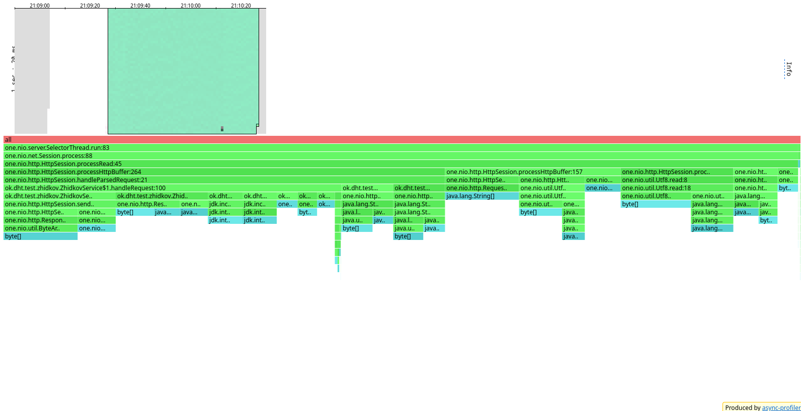
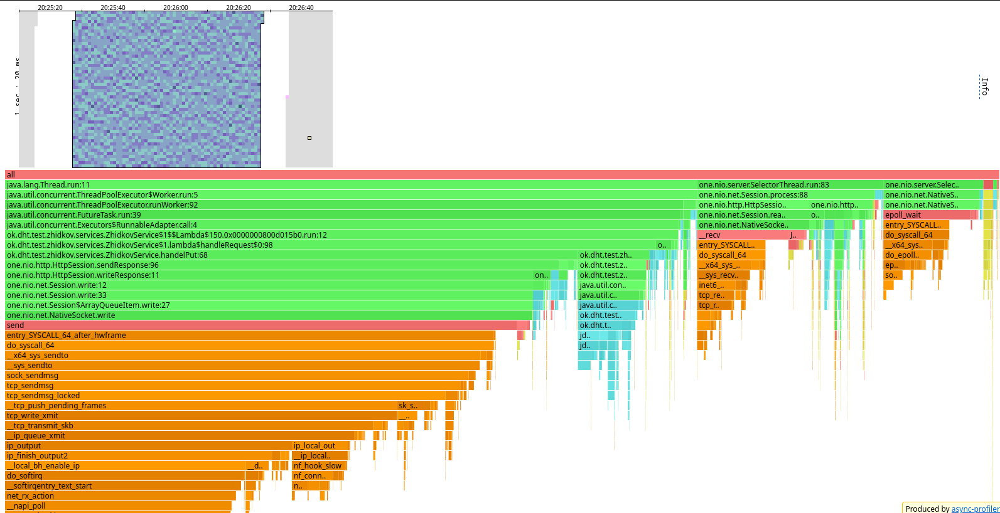
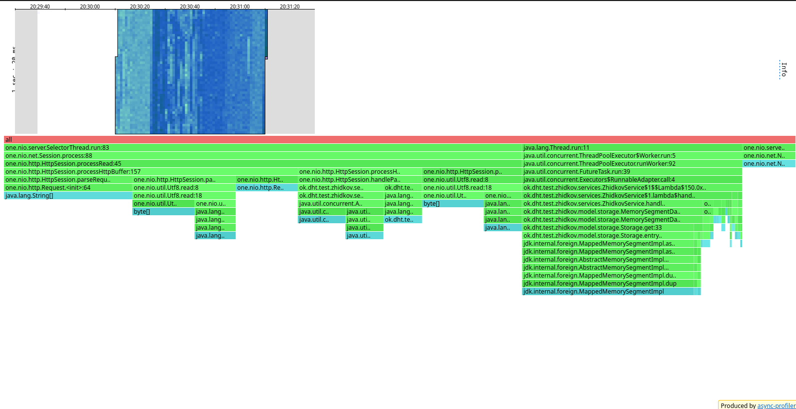
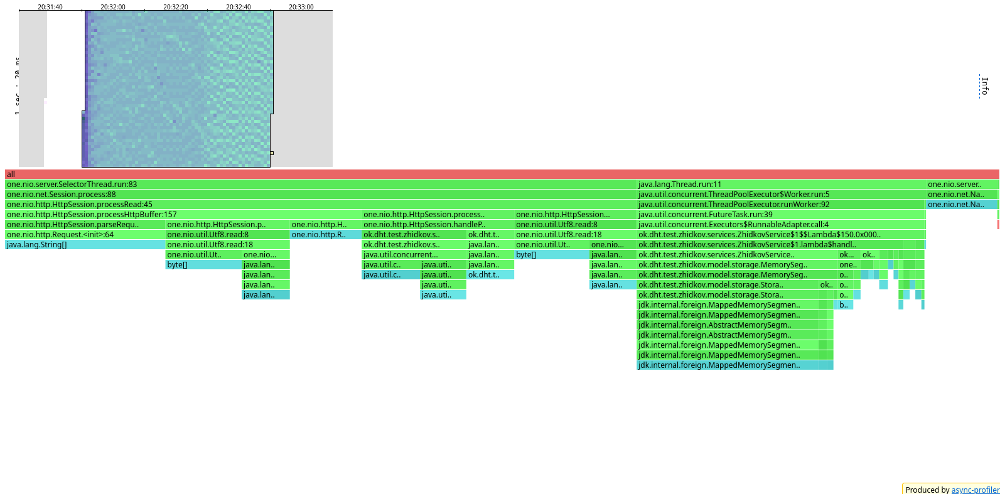

### **Отчёт Stage №2**

Для каждого варианта нагрузочного тестирования устанавливались следующие значения:

* Количество потоков - 1, 16, 64
* Количество соединений - 1, 16, 64
* Время тестирования - 1 минута

Для профайлера были следующие значения:
* chunktime - 1
* Только для lock - 1 ms

Тестирование буду проводить по следующему плану:
1. С помощью wrk2 обнаружу оптимальную нагрузку (за оптимальную нагрузку буду считать rate, при котором резко
увеличиваются 90% процентиль)
2. Проведу на оптимальной нагрузке профилирование

В качестве скриптов для тестирования буду использовать *put_dummy* и *get_dummy*.

#### Синхронный сервер

#### PUT-запросы
##### **Нагрузочное тестирование**

###### thread = 1, connection = 1

Данные взяты из первого stage.

rate = 1000
``````
Running 1m test @ http://localhost:8080
  1 threads and 1 connections
  Thread calibration: mean lat.: 1.088ms, rate sampling interval: 10ms
  Thread Stats   Avg      Stdev     Max   +/- Stdev
    Latency     1.07ms  576.11us  24.70ms   79.77%
    Req/Sec     1.05k    91.54     3.30k    86.65%
  Latency Distribution (HdrHistogram - Recorded Latency)
 50.000%    1.05ms
 75.000%    1.35ms
 90.000%    1.64ms
 99.000%    1.99ms
 99.900%    6.63ms
 99.990%   20.46ms
 99.999%   24.72ms
100.000%   24.72ms

  Detailed Percentile spectrum:
       Value   Percentile   TotalCount 1/(1-Percentile)

       0.122     0.000000            1         1.00
       0.481     0.100000         5003         1.11
       0.681     0.200000        10016         1.25
       0.821     0.300000        15034         1.43
       0.939     0.400000        20005         1.67
       1.054     0.500000        25009         2.00
       1.111     0.550000        27515         2.22
       1.170     0.600000        30011         2.50
       1.225     0.650000        32498         2.86
       1.283     0.700000        35002         3.33
       1.345     0.750000        37522         4.00
       1.379     0.775000        38762         4.44
       1.417     0.800000        39997         5.00
       1.465     0.825000        41247         5.71
       1.525     0.850000        42496         6.67
       1.582     0.875000        43751         8.00
       1.611     0.887500        44371         8.89
       1.640     0.900000        45010        10.00
       1.673     0.912500        45624        11.43
       1.706     0.925000        46256        13.33
       1.743     0.937500        46883        16.00
       1.760     0.943750        47184        17.78
       1.780     0.950000        47511        20.00
       1.796     0.956250        47811        22.86
       1.816     0.962500        48128        26.67
       1.839     0.968750        48439        32.00
       1.852     0.971875        48591        35.56
       1.866     0.975000        48759        40.00
       1.880     0.978125        48904        45.71
       1.899     0.981250        49062        53.33
       1.923     0.984375        49218        64.00
       1.940     0.985938        49296        71.11
       1.959     0.987500        49374        80.00
       1.980     0.989062        49451        91.43
       2.005     0.990625        49527       106.67
       2.031     0.992188        49606       128.00
       2.049     0.992969        49648       142.22
       2.069     0.993750        49683       160.00
       2.129     0.994531        49724       182.86
       2.189     0.995313        49761       213.33
       2.361     0.996094        49800       256.00
       2.615     0.996484        49820       284.44
       2.853     0.996875        49840       320.00
       3.131     0.997266        49859       365.71
       3.581     0.997656        49878       426.67
       4.139     0.998047        49898       512.00
       4.459     0.998242        49908       568.89
       4.819     0.998437        49917       640.00
       5.315     0.998633        49927       731.43
       6.123     0.998828        49937       853.33
       6.655     0.999023        49947      1024.00
       7.143     0.999121        49952      1137.78
       7.395     0.999219        49956      1280.00
       7.739     0.999316        49961      1462.86
       8.447     0.999414        49966      1706.67
       9.031     0.999512        49971      2048.00
       9.791     0.999561        49974      2275.56
      10.255     0.999609        49976      2560.00
      11.143     0.999658        49978      2925.71
      12.551     0.999707        49981      3413.33
      14.271     0.999756        49983      4096.00
      16.039     0.999780        49985      4551.11
      16.927     0.999805        49986      5120.00
      17.807     0.999829        49987      5851.43
      18.687     0.999854        49988      6826.67
      19.567     0.999878        49989      8192.00
      20.463     0.999890        49990      9102.22
      21.327     0.999902        49991     10240.00
      21.327     0.999915        49991     11702.86
      22.207     0.999927        49992     13653.33
      22.207     0.999939        49992     16384.00
      23.071     0.999945        49993     18204.44
      23.071     0.999951        49993     20480.00
      23.071     0.999957        49993     23405.71
      23.935     0.999963        49994     27306.67
      23.935     0.999969        49994     32768.00
      23.935     0.999973        49994     36408.89
      23.935     0.999976        49994     40960.00
      23.935     0.999979        49994     46811.43
      24.719     0.999982        49995     54613.33
      24.719     1.000000        49995          inf
#[Mean    =        1.075, StdDeviation   =        0.576]
#[Max     =       24.704, Total count    =        49995]
#[Buckets =           27, SubBuckets     =         2048]
----------------------------------------------------------
  60001 requests in 1.00m, 3.83MB read
Requests/sec:   1000.00
Transfer/sec:     65.43KB
``````

rate = 2000
``````
Running 1m test @ http://localhost:8080
  1 threads and 1 connections
  Thread calibration: mean lat.: 1.215ms, rate sampling interval: 10ms
  Thread Stats   Avg      Stdev     Max   +/- Stdev
    Latency     1.06ms  514.50us  14.18ms   64.87%
    Req/Sec     2.11k   170.70     4.30k    67.58%
  Latency Distribution (HdrHistogram - Recorded Latency)
 50.000%    1.06ms
 75.000%    1.40ms
 90.000%    1.76ms
 99.000%    2.08ms
 99.900%    2.70ms
 99.990%   10.09ms
 99.999%   13.77ms
100.000%   14.18ms

  Detailed Percentile spectrum:
       Value   Percentile   TotalCount 1/(1-Percentile)

       0.033     0.000000            1         1.00
       0.383     0.100000        10001         1.11
       0.592     0.200000        20006         1.25
       0.782     0.300000        30061         1.43
       0.934     0.400000        40011         1.67
       1.056     0.500000        50054         2.00
       1.111     0.550000        55042         2.22
       1.170     0.600000        60060         2.50
       1.231     0.650000        65003         2.86
       1.307     0.700000        70031         3.33
       1.405     0.750000        75034         4.00
       1.460     0.775000        77515         4.44
       1.516     0.800000        80043         5.00
       1.572     0.825000        82515         5.71
       1.635     0.850000        85035         6.67
       1.698     0.875000        87518         8.00
       1.728     0.887500        88790         8.89
       1.758     0.900000        90013        10.00
       1.790     0.912500        91275        11.43
       1.823     0.925000        92527        13.33
       1.859     0.937500        93768        16.00
       1.878     0.943750        94386        17.78
       1.898     0.950000        95013        20.00
       1.919     0.956250        95649        22.86
       1.941     0.962500        96260        26.67
       1.964     0.968750        96883        32.00
       1.977     0.971875        97220        35.56
       1.988     0.975000        97496        40.00
       2.003     0.978125        97817        45.71
       2.019     0.981250        98139        53.33
       2.033     0.984375        98434        64.00
       2.042     0.985938        98591        71.11
       2.055     0.987500        98759        80.00
       2.067     0.989062        98910        91.43
       2.085     0.990625        99068       106.67
       2.103     0.992188        99215       128.00
       2.111     0.992969        99290       142.22
       2.125     0.993750        99374       160.00
       2.137     0.994531        99450       182.86
       2.155     0.995313        99531       213.33
       2.171     0.996094        99604       256.00
       2.187     0.996484        99644       284.44
       2.205     0.996875        99683       320.00
       2.223     0.997266        99723       365.71
       2.253     0.997656        99760       426.67
       2.305     0.998047        99799       512.00
       2.337     0.998242        99818       568.89
       2.375     0.998437        99837       640.00
       2.431     0.998633        99858       731.43
       2.561     0.998828        99876       853.33
       2.763     0.999023        99896      1024.00
       2.861     0.999121        99906      1137.78
       3.015     0.999219        99915      1280.00
       3.213     0.999316        99925      1462.86
       3.517     0.999414        99935      1706.67
       3.907     0.999512        99945      2048.00
       4.061     0.999561        99950      2275.56
       4.303     0.999609        99954      2560.00
       4.655     0.999658        99959      2925.71
       5.431     0.999707        99964      3413.33
       6.027     0.999756        99969      4096.00
       6.419     0.999780        99972      4551.11
       6.839     0.999805        99974      5120.00
       7.303     0.999829        99976      5851.43
       8.231     0.999854        99979      6826.67
       9.159     0.999878        99981      8192.00
      10.087     0.999890        99983      9102.22
      10.551     0.999902        99984     10240.00
      11.007     0.999915        99985     11702.86
      11.471     0.999927        99986     13653.33
      11.935     0.999939        99987     16384.00
      12.399     0.999945        99988     18204.44
      12.863     0.999951        99989     20480.00
      12.863     0.999957        99989     23405.71
      13.319     0.999963        99990     27306.67
      13.319     0.999969        99990     32768.00
      13.775     0.999973        99992     36408.89
      13.775     0.999976        99992     40960.00
      13.775     0.999979        99992     46811.43
      13.775     0.999982        99992     54613.33
      13.775     0.999985        99992     65536.00
      13.775     0.999986        99992     72817.78
      13.775     0.999988        99992     81920.00
      13.775     0.999989        99992     93622.86
      14.183     0.999991        99993    109226.67
      14.183     1.000000        99993          inf
#[Mean    =        1.063, StdDeviation   =        0.515]
#[Max     =       14.176, Total count    =        99993]
#[Buckets =           27, SubBuckets     =         2048]
----------------------------------------------------------
  119999 requests in 1.00m, 7.67MB read
Requests/sec:   1999.97
Transfer/sec:    130.86KB
``````

rate = 5000
``````
Running 1m test @ http://localhost:8080
  1 threads and 1 connections
  Thread calibration: mean lat.: 0.927ms, rate sampling interval: 10ms
  Thread Stats   Avg      Stdev     Max   +/- Stdev
    Latency     0.91ms    0.90ms  24.77ms   93.50%
    Req/Sec     5.28k   507.12    16.60k    79.16%
  Latency Distribution (HdrHistogram - Recorded Latency)
 50.000%  831.00us
 75.000%    1.14ms
 90.000%    1.65ms
 99.000%    2.22ms
 99.900%   16.37ms
 99.990%   23.77ms
 99.999%   24.56ms
100.000%   24.78ms

  Detailed Percentile spectrum:
       Value   Percentile   TotalCount 1/(1-Percentile)

       0.031     0.000000            4         1.00
       0.259     0.100000        25010         1.11
       0.405     0.200000        50110         1.25
       0.547     0.300000        75015         1.43
       0.690     0.400000       100135         1.67
       0.831     0.500000       125088         2.00
       0.900     0.550000       137519         2.22
       0.965     0.600000       150116         2.50
       1.024     0.650000       162600         2.86
       1.082     0.700000       175175         3.33
       1.142     0.750000       187520         4.00
       1.175     0.775000       193920         4.44
       1.214     0.800000       200012         5.00
       1.280     0.825000       206298         5.71
       1.389     0.850000       212512         6.67
       1.518     0.875000       218737         8.00
       1.586     0.887500       221881         8.89
       1.648     0.900000       224985        10.00
       1.711     0.912500       228155        11.43
       1.767     0.925000       231240        13.33
       1.823     0.937500       234409        16.00
       1.849     0.943750       235985        17.78
       1.873     0.950000       237494        20.00
       1.899     0.956250       239093        22.86
       1.923     0.962500       240651        26.67
       1.950     0.968750       242209        32.00
       1.966     0.971875       242962        35.56
       1.983     0.975000       243763        40.00
       2.000     0.978125       244551        45.71
       2.019     0.981250       245305        53.33
       2.053     0.984375       246111        64.00
       2.081     0.985938       246472        71.11
       2.123     0.987500       246865        80.00
       2.175     0.989062       247255        91.43
       2.255     0.990625       247639       106.67
       2.371     0.992188       248032       128.00
       2.451     0.992969       248223       142.22
       2.545     0.993750       248420       160.00
       2.665     0.994531       248613       182.86
       2.797     0.995313       248813       213.33
       3.035     0.996094       249004       256.00
       3.223     0.996484       249103       284.44
       3.509     0.996875       249199       320.00
       3.943     0.997266       249297       365.71
       5.383     0.997656       249395       426.67
       8.831     0.998047       249492       512.00
      10.391     0.998242       249541       568.89
      11.935     0.998437       249590       640.00
      13.359     0.998633       249639       731.43
      15.215     0.998828       249688       853.33
      16.655     0.999023       249736      1024.00
      17.663     0.999121       249761      1137.78
      18.559     0.999219       249785      1280.00
      19.503     0.999316       249810      1462.86
      20.495     0.999414       249834      1706.67
      21.407     0.999512       249858      2048.00
      21.871     0.999561       249871      2275.56
      22.175     0.999609       249884      2560.00
      22.271     0.999658       249897      2925.71
      22.447     0.999707       249907      3413.33
      22.831     0.999756       249919      4096.00
      22.991     0.999780       249926      4551.11
      23.151     0.999805       249932      5120.00
      23.343     0.999829       249938      5851.43
      23.551     0.999854       249944      6826.67
      23.679     0.999878       249950      8192.00
      23.743     0.999890       249954      9102.22
      23.791     0.999902       249956     10240.00
      23.903     0.999915       249960     11702.86
      23.999     0.999927       249962     13653.33
      24.079     0.999939       249965     16384.00
      24.143     0.999945       249967     18204.44
      24.159     0.999951       249968     20480.00
      24.239     0.999957       249972     23405.71
      24.239     0.999963       249972     27306.67
      24.271     0.999969       249973     32768.00
      24.287     0.999973       249974     36408.89
      24.287     0.999976       249974     40960.00
      24.319     0.999979       249975     46811.43
      24.335     0.999982       249976     54613.33
      24.399     0.999985       249977     65536.00
      24.399     0.999986       249977     72817.78
      24.399     0.999988       249977     81920.00
      24.559     0.999989       249978     93622.86
      24.559     0.999991       249978    109226.67
      24.687     0.999992       249979    131072.00
      24.687     0.999993       249979    145635.56
      24.687     0.999994       249979    163840.00
      24.687     0.999995       249979    187245.71
      24.687     0.999995       249979    218453.33
      24.783     0.999996       249980    262144.00
      24.783     1.000000       249980          inf
#[Mean    =        0.907, StdDeviation   =        0.903]
#[Max     =       24.768, Total count    =       249980]
#[Buckets =           27, SubBuckets     =         2048]
----------------------------------------------------------
  299998 requests in 1.00m, 19.17MB read
Requests/sec:   4999.97
Transfer/sec:    327.15KB
``````

rate = 10000
``````
Running 1m test @ http://localhost:8080
  1 threads and 1 connections
  Thread calibration: mean lat.: 9.094ms, rate sampling interval: 56ms
  Thread Stats   Avg      Stdev     Max   +/- Stdev
    Latency     7.52ms   11.96ms  92.22ms   86.94%
    Req/Sec    10.09k     1.72k   22.93k    81.17%
  Latency Distribution (HdrHistogram - Recorded Latency)
 50.000%    1.64ms
 75.000%    9.40ms
 90.000%   23.44ms
 99.000%   53.73ms
 99.900%   81.41ms
 99.990%   90.94ms
 99.999%   92.10ms
100.000%   92.29ms

  Detailed Percentile spectrum:
       Value   Percentile   TotalCount 1/(1-Percentile)

       0.031     0.000000            2         1.00
       0.339     0.100000        50111         1.11
       0.602     0.200000       100189         1.25
       0.850     0.300000       150152         1.43
       1.079     0.400000       200146         1.67
       1.637     0.500000       249995         2.00
       2.019     0.550000       275031         2.22
       2.961     0.600000       300006         2.50
       4.607     0.650000       325021         2.86
       6.855     0.700000       349997         3.33
       9.399     0.750000       374997         4.00
      10.935     0.775000       387505         4.44
      12.863     0.800000       400019         5.00
      14.887     0.825000       412505         5.71
      17.407     0.850000       425017         6.67
      20.111     0.875000       437506         8.00
      21.743     0.887500       443798         8.89
      23.439     0.900000       450021        10.00
      25.791     0.912500       456236        11.43
      28.607     0.925000       462507        13.33
      31.535     0.937500       468749        16.00
      32.831     0.943750       471916        17.78
      34.335     0.950000       475041        20.00
      35.807     0.956250       478157        22.86
      38.015     0.962500       481237        26.67
      41.215     0.968750       484359        32.00
      42.719     0.971875       485951        35.56
      44.159     0.975000       487514        40.00
      46.111     0.978125       489075        45.71
      47.615     0.981250       490622        53.33
      49.247     0.984375       492204        64.00
      49.983     0.985938       492954        71.11
      51.583     0.987500       493743        80.00
      52.863     0.989062       494523        91.43
      54.431     0.990625       495296       106.67
      55.775     0.992188       496086       128.00
      56.735     0.992969       496471       142.22
      57.599     0.993750       496894       160.00
      58.431     0.994531       497251       182.86
      59.871     0.995313       497644       213.33
      61.855     0.996094       498027       256.00
      63.295     0.996484       498224       284.44
      64.095     0.996875       498425       320.00
      64.607     0.997266       498619       365.71
      65.919     0.997656       498809       426.67
      69.119     0.998047       499006       512.00
      70.399     0.998242       499102       568.89
      72.639     0.998437       499199       640.00
      75.711     0.998633       499298       731.43
      78.591     0.998828       499397       853.33
      81.535     0.999023       499507      1024.00
      81.919     0.999121       499544      1137.78
      82.431     0.999219       499591      1280.00
      83.327     0.999316       499640      1462.86
      84.799     0.999414       499690      1706.67
      86.143     0.999512       499737      2048.00
      86.911     0.999561       499762      2275.56
      87.359     0.999609       499793      2560.00
      87.807     0.999658       499811      2925.71
      88.319     0.999707       499835      3413.33
      88.959     0.999756       499858      4096.00
      89.343     0.999780       499872      4551.11
      89.663     0.999805       499883      5120.00
      90.047     0.999829       499895      5851.43
      90.431     0.999854       499908      6826.67
      90.751     0.999878       499924      8192.00
      90.815     0.999890       499926      9102.22
      91.007     0.999902       499933     10240.00
      91.199     0.999915       499939     11702.86
      91.327     0.999927       499944     13653.33
      91.455     0.999939       499950     16384.00
      91.583     0.999945       499954     18204.44
      91.647     0.999951       499957     20480.00
      91.711     0.999957       499959     23405.71
      91.775     0.999963       499962     27306.67
      91.903     0.999969       499966     32768.00
      91.967     0.999973       499970     36408.89
      91.967     0.999976       499970     40960.00
      91.967     0.999979       499970     46811.43
      92.031     0.999982       499972     54613.33
      92.095     0.999985       499975     65536.00
      92.095     0.999986       499975     72817.78
      92.095     0.999988       499975     81920.00
      92.095     0.999989       499975     93622.86
      92.159     0.999991       499977    109226.67
      92.159     0.999992       499977    131072.00
      92.159     0.999993       499977    145635.56
      92.159     0.999994       499977    163840.00
      92.223     0.999995       499979    187245.71
      92.223     0.999995       499979    218453.33
      92.223     0.999996       499979    262144.00
      92.223     0.999997       499979    291271.11
      92.223     0.999997       499979    327680.00
      92.223     0.999997       499979    374491.43
      92.223     0.999998       499979    436906.67
      92.287     0.999998       499980    524288.00
      92.287     1.000000       499980          inf
#[Mean    =        7.520, StdDeviation   =       11.959]
#[Max     =       92.224, Total count    =       499980]
#[Buckets =           27, SubBuckets     =         2048]
----------------------------------------------------------
  599923 requests in 1.00m, 38.33MB read
Requests/sec:   9998.75
Transfer/sec:    654.22KB
``````

На 1000 rate видим резкий скачок на 90% процентиле, следовательно, данная нагрузка скорее всего оптимальна.
Продолжу увеличивать rate, чтобы посмотреть, на каком rate сервер не справится с нагрузкой.

rate = 20000
``````
Running 1m test @ http://localhost:8080
  1 threads and 1 connections
  Thread calibration: mean lat.: 102.323ms, rate sampling interval: 423ms
  Thread Stats   Avg      Stdev     Max   +/- Stdev
    Latency    75.95ms   88.35ms 380.16ms   83.83%
    Req/Sec    20.03k     2.76k   27.13k    64.41%
  Latency Distribution (HdrHistogram - Recorded Latency)
 50.000%   42.37ms
 75.000%  118.72ms
 90.000%  221.31ms
 99.000%  348.42ms
 99.900%  375.81ms
 99.990%  379.39ms
 99.999%  380.42ms
100.000%  380.42ms

  Detailed Percentile spectrum:
       Value   Percentile   TotalCount 1/(1-Percentile)

       0.027     0.000000            4         1.00
       0.745     0.100000       100032         1.11
       2.855     0.200000       200022         1.25
      10.423     0.300000       299988         1.43
      23.855     0.400000       400086         1.67
      42.367     0.500000       499969         2.00
      52.735     0.550000       550067         2.22
      62.175     0.600000       600022         2.50
      75.647     0.650000       649990         2.86
      93.311     0.700000       699948         3.33
     118.719     0.750000       750066         4.00
     129.855     0.775000       775004         4.44
     142.463     0.800000       800113         5.00
     154.751     0.825000       824998         5.71
     172.159     0.850000       849936         6.67
     197.375     0.875000       874973         8.00
     211.455     0.887500       887489         8.89
     221.311     0.900000       900041        10.00
     230.527     0.912500       912485        11.43
     238.463     0.925000       925021        13.33
     250.111     0.937500       937503        16.00
     255.103     0.943750       943704        17.78
     261.247     0.950000       949946        20.00
     272.639     0.956250       956310        22.86
     290.815     0.962500       962456        26.67
     305.663     0.968750       968778        32.00
     312.575     0.971875       971899        35.56
     318.719     0.975000       974987        40.00
     323.839     0.978125       978061        45.71
     328.447     0.981250       981199        53.33
     334.079     0.984375       984399        64.00
     337.663     0.985938       985878        71.11
     342.015     0.987500       987439        80.00
     346.111     0.989062       989036        91.43
     349.951     0.990625       990592       106.67
     356.095     0.992188       992245       128.00
     357.375     0.992969       992936       142.22
     360.447     0.993750       993735       160.00
     363.263     0.994531       994476       182.86
     366.079     0.995313       995241       213.33
     368.895     0.996094       996035       256.00
     369.663     0.996484       996412       284.44
     370.943     0.996875       996821       320.00
     372.735     0.997266       997237       365.71
     373.759     0.997656       997632       426.67
     374.527     0.998047       998100       512.00
     374.783     0.998242       998398       568.89
     374.783     0.998437       998398       640.00
     375.039     0.998633       998588       731.43
     375.551     0.998828       998759       853.33
     375.807     0.999023       999021      1024.00
     376.063     0.999121       999096      1137.78
     376.831     0.999219       999157      1280.00
     378.111     0.999316       999243      1462.86
     378.623     0.999414       999367      1706.67
     378.879     0.999512       999534      2048.00
     378.879     0.999561       999534      2275.56
     378.879     0.999609       999534      2560.00
     379.135     0.999658       999721      2925.71
     379.135     0.999707       999721      3413.33
     379.135     0.999756       999721      4096.00
     379.135     0.999780       999721      4551.11
     379.391     0.999805       999832      5120.00
     379.391     0.999829       999832      5851.43
     379.391     0.999854       999832      6826.67
     379.391     0.999878       999832      8192.00
     379.391     0.999890       999832      9102.22
     379.391     0.999902       999832     10240.00
     379.647     0.999915       999859     11702.86
     379.647     0.999927       999859     13653.33
     379.903     0.999939       999880     16384.00
     379.903     0.999945       999880     18204.44
     379.903     0.999951       999880     20480.00
     380.159     0.999957       999900     23405.71
     380.159     0.999963       999900     27306.67
     380.159     0.999969       999900     32768.00
     380.159     0.999973       999900     36408.89
     380.159     0.999976       999900     40960.00
     380.415     0.999979       999924     46811.43
     380.415     1.000000       999924          inf
#[Mean    =       75.951, StdDeviation   =       88.349]
#[Max     =      380.160, Total count    =       999924]
#[Buckets =           27, SubBuckets     =         2048]
----------------------------------------------------------
  1199977 requests in 1.00m, 76.67MB read
Requests/sec:  19999.66
Transfer/sec:      1.28MB
``````

rate = 50000
``````
Running 1m test @ http://localhost:8080
  1 threads and 1 connections
  Thread calibration: mean lat.: 2692.251ms, rate sampling interval: 9740ms
  Thread Stats   Avg      Stdev     Max   +/- Stdev
    Latency    19.88s     8.30s   34.37s    58.03%
    Req/Sec    21.16k   411.10    21.89k    60.00%
  Latency Distribution (HdrHistogram - Recorded Latency)
 50.000%   20.17s 
 75.000%   26.84s 
 90.000%   31.36s 
 99.000%   34.11s 
 99.900%   34.37s 
 99.990%   34.37s 
 99.999%   34.41s 
100.000%   34.41s 

  Detailed Percentile spectrum:
       Value   Percentile   TotalCount 1/(1-Percentile)

    5525.503     0.000000           42         1.00
    8323.071     0.100000       105796         1.11
   11272.191     0.200000       211797         1.25
   14196.735     0.300000       317333         1.43
   16957.439     0.400000       422902         1.67
   20168.703     0.500000       528783         2.00
   21594.111     0.550000       581880         2.22
   22921.215     0.600000       634663         2.50
   24199.167     0.650000       687375         2.86
   25559.039     0.700000       741018         3.33
   26836.991     0.750000       793170         4.00
   27541.503     0.775000       819509         4.44
   28393.471     0.800000       845953         5.00
   29147.135     0.825000       872484         5.71
   29900.799     0.850000       898909         6.67
   30572.543     0.875000       925804         8.00
   30900.223     0.887500       938609         8.89
   31358.975     0.900000       951638        10.00
   31735.807     0.912500       964935        11.43
   32161.791     0.925000       978039        13.33
   32489.471     0.937500       991407        16.00
   32702.463     0.943750       997953        17.78
   32980.991     0.950000      1004894        20.00
   33161.215     0.956250      1011352        22.86
   33308.671     0.962500      1017764        26.67
   33472.511     0.968750      1024499        32.00
   33554.431     0.971875      1028128        35.56
   33619.967     0.975000      1031210        40.00
   33718.271     0.978125      1034278        45.71
   33849.343     0.981250      1039061        53.33
   33914.879     0.984375      1041042        64.00
   33980.415     0.985938      1043146        71.11
   34013.183     0.987500      1044371        80.00
   34078.719     0.989062      1046123        91.43
   34144.255     0.990625      1047746       106.67
   34209.791     0.992188      1050429       128.00
   34209.791     0.992969      1050429       142.22
   34242.559     0.993750      1051574       160.00
   34242.559     0.994531      1051574       182.86
   34275.327     0.995313      1052373       213.33
   34308.095     0.996094      1053762       256.00
   34308.095     0.996484      1053762       284.44
   34340.863     0.996875      1055238       320.00
   34340.863     0.997266      1055238       365.71
   34340.863     0.997656      1055238       426.67
   34340.863     0.998047      1055238       512.00
   34373.631     0.998242      1057115       568.89
   34373.631     0.998437      1057115       640.00
   34373.631     0.998633      1057115       731.43
   34373.631     0.998828      1057115       853.33
   34373.631     0.999023      1057115      1024.00
   34373.631     0.999121      1057115      1137.78
   34373.631     0.999219      1057115      1280.00
   34373.631     0.999316      1057115      1462.86
   34373.631     0.999414      1057115      1706.67
   34373.631     0.999512      1057115      2048.00
   34373.631     0.999561      1057115      2275.56
   34373.631     0.999609      1057115      2560.00
   34373.631     0.999658      1057115      2925.71
   34373.631     0.999707      1057115      3413.33
   34373.631     0.999756      1057115      4096.00
   34373.631     0.999780      1057115      4551.11
   34373.631     0.999805      1057115      5120.00
   34373.631     0.999829      1057115      5851.43
   34373.631     0.999854      1057115      6826.67
   34373.631     0.999878      1057115      8192.00
   34373.631     0.999890      1057115      9102.22
   34373.631     0.999902      1057115     10240.00
   34373.631     0.999915      1057115     11702.86
   34373.631     0.999927      1057115     13653.33
   34406.399     0.999939      1057189     16384.00
   34406.399     1.000000      1057189          inf
#[Mean    =    19876.392, StdDeviation   =     8297.586]
#[Max     =    34373.632, Total count    =      1057189]
#[Buckets =           27, SubBuckets     =         2048]
----------------------------------------------------------
  1281211 requests in 1.00m, 81.86MB read
Requests/sec:  21353.57
Transfer/sec:      1.36MB
``````

На rate = 50000 среднее время ответа составляет 20 секунд, а rps сильно ниже заданной. С данной нагрузкой сервер 
не справился.

###### thread = 16, connection = 16

Действую аналогично предыдущему пункту.

rate = 1000
`````````
Running 1m test @ http://localhost:8080
  16 threads and 16 connections
  Thread calibration: mean lat.: 0.875ms, rate sampling interval: 10ms
  Thread calibration: mean lat.: 0.812ms, rate sampling interval: 10ms
  Thread calibration: mean lat.: 0.824ms, rate sampling interval: 10ms
  Thread calibration: mean lat.: 0.856ms, rate sampling interval: 10ms
  Thread calibration: mean lat.: 0.829ms, rate sampling interval: 10ms
  Thread calibration: mean lat.: 0.814ms, rate sampling interval: 10ms
  Thread calibration: mean lat.: 0.805ms, rate sampling interval: 10ms
  Thread calibration: mean lat.: 0.822ms, rate sampling interval: 10ms
  Thread calibration: mean lat.: 0.783ms, rate sampling interval: 10ms
  Thread calibration: mean lat.: 0.804ms, rate sampling interval: 10ms
  Thread calibration: mean lat.: 0.796ms, rate sampling interval: 10ms
  Thread calibration: mean lat.: 0.926ms, rate sampling interval: 10ms
  Thread calibration: mean lat.: 0.809ms, rate sampling interval: 10ms
  Thread calibration: mean lat.: 0.808ms, rate sampling interval: 10ms
  Thread calibration: mean lat.: 0.818ms, rate sampling interval: 10ms
  Thread calibration: mean lat.: 0.791ms, rate sampling interval: 10ms
  Thread Stats   Avg      Stdev     Max   +/- Stdev
    Latency     0.87ms  350.31us  10.82ms   68.01%
    Req/Sec    64.73     49.67   222.00     63.08%
  Latency Distribution (HdrHistogram - Recorded Latency)
 50.000%    0.87ms
 75.000%    1.12ms
 90.000%    1.29ms
 99.000%    1.56ms
 99.900%    1.95ms
 99.990%    9.94ms
 99.999%   10.83ms
100.000%   10.83ms

  Detailed Percentile spectrum:
       Value   Percentile   TotalCount 1/(1-Percentile)

       0.068     0.000000            1         1.00
       0.428     0.100000         5010         1.11
       0.563     0.200000        10039         1.25
       0.670     0.300000        15024         1.43
       0.771     0.400000        20022         1.67
       0.872     0.500000        25034         2.00
       0.923     0.550000        27531         2.22
       0.973     0.600000        30044         2.50
       1.021     0.650000        32543         2.86
       1.072     0.700000        35020         3.33
       1.123     0.750000        37493         4.00
       1.149     0.775000        38752         4.44
       1.175     0.800000        40009         5.00
       1.202     0.825000        41281         5.71
       1.228     0.850000        42517         6.67
       1.258     0.875000        43761         8.00
       1.274     0.887500        44383         8.89
       1.293     0.900000        45002        10.00
       1.312     0.912500        45631        11.43
       1.335     0.925000        46257        13.33
       1.360     0.937500        46872        16.00
       1.374     0.943750        47188        17.78
       1.388     0.950000        47489        20.00
       1.405     0.956250        47803        22.86
       1.424     0.962500        48114        26.67
       1.443     0.968750        48423        32.00
       1.453     0.971875        48583        35.56
       1.465     0.975000        48742        40.00
       1.479     0.978125        48902        45.71
       1.492     0.981250        49049        53.33
       1.510     0.984375        49206        64.00
       1.521     0.985938        49284        71.11
       1.535     0.987500        49365        80.00
       1.549     0.989062        49439        91.43
       1.567     0.990625        49519       106.67
       1.590     0.992188        49596       128.00
       1.598     0.992969        49633       142.22
       1.611     0.993750        49674       160.00
       1.625     0.994531        49713       182.86
       1.643     0.995313        49750       213.33
       1.666     0.996094        49789       256.00
       1.678     0.996484        49809       284.44
       1.696     0.996875        49829       320.00
       1.712     0.997266        49848       365.71
       1.738     0.997656        49867       426.67
       1.762     0.998047        49887       512.00
       1.784     0.998242        49897       568.89
       1.810     0.998437        49906       640.00
       1.838     0.998633        49916       731.43
       1.917     0.998828        49926       853.33
       1.965     0.999023        49936      1024.00
       1.989     0.999121        49941      1137.78
       2.024     0.999219        49945      1280.00
       2.079     0.999316        49950      1462.86
       2.285     0.999414        49955      1706.67
       2.595     0.999512        49960      2048.00
       2.983     0.999561        49963      2275.56
       3.057     0.999609        49965      2560.00
       3.267     0.999658        49967      2925.71
       3.319     0.999707        49970      3413.33
       3.339     0.999756        49972      4096.00
       3.837     0.999780        49974      4551.11
       4.259     0.999805        49975      5120.00
       9.103     0.999829        49976      5851.43
       9.567     0.999854        49977      6826.67
       9.919     0.999878        49978      8192.00
       9.935     0.999890        49979      9102.22
      10.343     0.999902        49980     10240.00
      10.343     0.999915        49980     11702.86
      10.503     0.999927        49981     13653.33
      10.503     0.999939        49981     16384.00
      10.591     0.999945        49982     18204.44
      10.591     0.999951        49982     20480.00
      10.591     0.999957        49982     23405.71
      10.719     0.999963        49983     27306.67
      10.719     0.999969        49983     32768.00
      10.719     0.999973        49983     36408.89
      10.719     0.999976        49983     40960.00
      10.719     0.999979        49983     46811.43
      10.831     0.999982        49984     54613.33
      10.831     1.000000        49984          inf
#[Mean    =        0.873, StdDeviation   =        0.350]
#[Max     =       10.824, Total count    =        49984]
#[Buckets =           27, SubBuckets     =         2048]
----------------------------------------------------------
  60016 requests in 1.00m, 3.83MB read
Requests/sec:   1000.25
Transfer/sec:     65.45KB
`````````

rate = 2000
`````````
Running 1m test @ http://localhost:8080
  16 threads and 16 connections
  Thread calibration: mean lat.: 0.833ms, rate sampling interval: 10ms
  Thread calibration: mean lat.: 0.819ms, rate sampling interval: 10ms
  Thread calibration: mean lat.: 0.833ms, rate sampling interval: 10ms
  Thread calibration: mean lat.: 0.782ms, rate sampling interval: 10ms
  Thread calibration: mean lat.: 0.751ms, rate sampling interval: 10ms
  Thread calibration: mean lat.: 0.755ms, rate sampling interval: 10ms
  Thread calibration: mean lat.: 0.766ms, rate sampling interval: 10ms
  Thread calibration: mean lat.: 0.760ms, rate sampling interval: 10ms
  Thread calibration: mean lat.: 0.783ms, rate sampling interval: 10ms
  Thread calibration: mean lat.: 0.761ms, rate sampling interval: 10ms
  Thread calibration: mean lat.: 0.736ms, rate sampling interval: 10ms
  Thread calibration: mean lat.: 0.740ms, rate sampling interval: 10ms
  Thread calibration: mean lat.: 0.758ms, rate sampling interval: 10ms
  Thread calibration: mean lat.: 0.751ms, rate sampling interval: 10ms
  Thread calibration: mean lat.: 0.740ms, rate sampling interval: 10ms
  Thread calibration: mean lat.: 0.750ms, rate sampling interval: 10ms
  Thread Stats   Avg      Stdev     Max   +/- Stdev
    Latency   747.49us  332.73us  10.84ms   65.89%
    Req/Sec   129.36     45.53   222.00     74.03%
  Latency Distribution (HdrHistogram - Recorded Latency)
 50.000%  745.00us
 75.000%    1.00ms
 90.000%    1.15ms
 99.000%    1.41ms
 99.900%    2.58ms
 99.990%    6.09ms
 99.999%    8.51ms
100.000%   10.85ms

  Detailed Percentile spectrum:
       Value   Percentile   TotalCount 1/(1-Percentile)

       0.065     0.000000            1         1.00
       0.325     0.100000        10076         1.11
       0.438     0.200000        20078         1.25
       0.542     0.300000        30091         1.43
       0.644     0.400000        40008         1.67
       0.745     0.500000        50066         2.00
       0.797     0.550000        55086         2.22
       0.846     0.600000        60024         2.50
       0.894     0.650000        65079         2.86
       0.943     0.700000        70055         3.33
       0.995     0.750000        75069         4.00
       1.020     0.775000        77546         4.44
       1.044     0.800000        79993         5.00
       1.070     0.825000        82549         5.71
       1.095     0.850000        85045         6.67
       1.121     0.875000        87565         8.00
       1.134     0.887500        88812         8.89
       1.148     0.900000        90086        10.00
       1.162     0.912500        91246        11.43
       1.178     0.925000        92510        13.33
       1.196     0.937500        93783        16.00
       1.205     0.943750        94361        17.78
       1.217     0.950000        95025        20.00
       1.230     0.956250        95650        22.86
       1.245     0.962500        96257        26.67
       1.265     0.968750        96861        32.00
       1.277     0.971875        97183        35.56
       1.292     0.975000        97508        40.00
       1.308     0.978125        97798        45.71
       1.329     0.981250        98111        53.33
       1.354     0.984375        98423        64.00
       1.368     0.985938        98584        71.11
       1.385     0.987500        98743        80.00
       1.402     0.989062        98901        91.43
       1.425     0.990625        99047       106.67
       1.448     0.992188        99203       128.00
       1.463     0.992969        99284       142.22
       1.481     0.993750        99362       160.00
       1.501     0.994531        99439       182.86
       1.528     0.995313        99518       213.33
       1.570     0.996094        99595       256.00
       1.596     0.996484        99633       284.44
       1.626     0.996875        99672       320.00
       1.663     0.997266        99711       365.71
       1.698     0.997656        99750       426.67
       1.795     0.998047        99789       512.00
       1.893     0.998242        99809       568.89
       1.981     0.998437        99828       640.00
       2.111     0.998633        99848       731.43
       2.267     0.998828        99867       853.33
       2.603     0.999023        99887      1024.00
       2.711     0.999121        99898      1137.78
       2.807     0.999219        99906      1280.00
       3.087     0.999316        99916      1462.86
       3.335     0.999414        99926      1706.67
       3.807     0.999512        99936      2048.00
       4.069     0.999561        99941      2275.56
       4.303     0.999609        99945      2560.00
       4.579     0.999658        99950      2925.71
       4.751     0.999707        99955      3413.33
       5.167     0.999756        99961      4096.00
       5.203     0.999780        99963      4551.11
       5.295     0.999805        99965      5120.00
       5.355     0.999829        99967      5851.43
       5.655     0.999854        99970      6826.67
       5.723     0.999878        99972      8192.00
       6.095     0.999890        99974      9102.22
       6.255     0.999902        99975     10240.00
       6.467     0.999915        99976     11702.86
       6.471     0.999927        99977     13653.33
       6.919     0.999939        99978     16384.00
       7.459     0.999945        99979     18204.44
       7.531     0.999951        99980     20480.00
       7.531     0.999957        99980     23405.71
       7.571     0.999963        99981     27306.67
       7.571     0.999969        99981     32768.00
       7.955     0.999973        99982     36408.89
       7.955     0.999976        99982     40960.00
       7.955     0.999979        99982     46811.43
       8.511     0.999982        99983     54613.33
       8.511     0.999985        99983     65536.00
       8.511     0.999986        99983     72817.78
       8.511     0.999988        99983     81920.00
       8.511     0.999989        99983     93622.86
      10.847     0.999991        99984    109226.67
      10.847     1.000000        99984          inf
#[Mean    =        0.747, StdDeviation   =        0.333]
#[Max     =       10.840, Total count    =        99984]
#[Buckets =           27, SubBuckets     =         2048]
----------------------------------------------------------
  120016 requests in 1.00m, 7.67MB read
Requests/sec:   2000.23
Transfer/sec:    130.87KB
`````````

rate = 5000
`````````
Running 1m test @ http://localhost:8080
  16 threads and 16 connections
  Thread calibration: mean lat.: 0.676ms, rate sampling interval: 10ms
  Thread calibration: mean lat.: 0.651ms, rate sampling interval: 10ms
  Thread calibration: mean lat.: 0.665ms, rate sampling interval: 10ms
  Thread calibration: mean lat.: 0.659ms, rate sampling interval: 10ms
  Thread calibration: mean lat.: 0.630ms, rate sampling interval: 10ms
  Thread calibration: mean lat.: 0.647ms, rate sampling interval: 10ms
  Thread calibration: mean lat.: 0.651ms, rate sampling interval: 10ms
  Thread calibration: mean lat.: 0.685ms, rate sampling interval: 10ms
  Thread calibration: mean lat.: 0.671ms, rate sampling interval: 10ms
  Thread calibration: mean lat.: 0.687ms, rate sampling interval: 10ms
  Thread calibration: mean lat.: 0.698ms, rate sampling interval: 10ms
  Thread calibration: mean lat.: 0.670ms, rate sampling interval: 10ms
  Thread calibration: mean lat.: 0.676ms, rate sampling interval: 10ms
  Thread calibration: mean lat.: 0.680ms, rate sampling interval: 10ms
  Thread calibration: mean lat.: 0.695ms, rate sampling interval: 10ms
  Thread calibration: mean lat.: 0.689ms, rate sampling interval: 10ms
  Thread Stats   Avg      Stdev     Max   +/- Stdev
    Latency   664.99us  356.41us  12.82ms   70.36%
    Req/Sec   328.75     39.19   700.00     82.33%
  Latency Distribution (HdrHistogram - Recorded Latency)
 50.000%  654.00us
 75.000%    0.91ms
 90.000%    1.06ms
 99.000%    1.20ms
 99.900%    4.08ms
 99.990%    7.70ms
 99.999%   11.68ms
100.000%   12.83ms

  Detailed Percentile spectrum:
       Value   Percentile   TotalCount 1/(1-Percentile)

       0.054     0.000000            1         1.00
       0.251     0.100000        25133         1.11
       0.352     0.200000        50211         1.25
       0.452     0.300000        75091         1.43
       0.553     0.400000       100179         1.67
       0.654     0.500000       125126         2.00
       0.705     0.550000       137513         2.22
       0.757     0.600000       150192         2.50
       0.808     0.650000       162503         2.86
       0.859     0.700000       175160         3.33
       0.910     0.750000       187670         4.00
       0.936     0.775000       193965         4.44
       0.961     0.800000       200004         5.00
       0.987     0.825000       206379         5.71
       1.012     0.850000       212493         6.67
       1.038     0.875000       218890         8.00
       1.051     0.887500       222057         8.89
       1.063     0.900000       225000        10.00
       1.076     0.912500       228134        11.43
       1.089     0.925000       231402        13.33
       1.101     0.937500       234376        16.00
       1.108     0.943750       236067        17.78
       1.114     0.950000       237507        20.00
       1.121     0.956250       239042        22.86
       1.130     0.962500       240677        26.67
       1.140     0.968750       242229        32.00
       1.145     0.971875       242955        35.56
       1.152     0.975000       243807        40.00
       1.159     0.978125       244588        45.71
       1.166     0.981250       245289        53.33
       1.176     0.984375       246100        64.00
       1.181     0.985938       246456        71.11
       1.188     0.987500       246868        80.00
       1.196     0.989062       247276        91.43
       1.204     0.990625       247622       106.67
       1.217     0.992188       248023       128.00
       1.226     0.992969       248208       142.22
       1.239     0.993750       248409       160.00
       1.259     0.994531       248603       182.86
       1.299     0.995313       248791       213.33
       1.605     0.996094       248984       256.00
       1.823     0.996484       249082       284.44
       2.123     0.996875       249179       320.00
       2.415     0.997266       249277       365.71
       2.695     0.997656       249375       426.67
       3.011     0.998047       249472       512.00
       3.189     0.998242       249521       568.89
       3.377     0.998437       249570       640.00
       3.659     0.998633       249619       731.43
       3.849     0.998828       249668       853.33
       4.115     0.999023       249716      1024.00
       4.303     0.999121       249741      1137.78
       4.419     0.999219       249765      1280.00
       4.679     0.999316       249790      1462.86
       4.811     0.999414       249814      1706.67
       5.075     0.999512       249838      2048.00
       5.199     0.999561       249851      2275.56
       5.395     0.999609       249863      2560.00
       5.543     0.999658       249875      2925.71
       5.779     0.999707       249887      3413.33
       5.967     0.999756       249899      4096.00
       6.043     0.999780       249906      4551.11
       6.303     0.999805       249912      5120.00
       6.447     0.999829       249918      5851.43
       6.603     0.999854       249924      6826.67
       7.315     0.999878       249930      8192.00
       7.527     0.999890       249933      9102.22
       7.723     0.999902       249936     10240.00
       8.051     0.999915       249939     11702.86
       8.559     0.999927       249942     13653.33
       9.135     0.999939       249945     16384.00
       9.607     0.999945       249947     18204.44
       9.711     0.999951       249949     20480.00
       9.879     0.999957       249950     23405.71
      10.463     0.999963       249951     27306.67
      10.607     0.999969       249953     32768.00
      10.679     0.999973       249954     36408.89
      10.679     0.999976       249954     40960.00
      10.791     0.999979       249955     46811.43
      10.815     0.999982       249956     54613.33
      11.551     0.999985       249957     65536.00
      11.551     0.999986       249957     72817.78
      11.551     0.999988       249957     81920.00
      11.679     0.999989       249958     93622.86
      11.679     0.999991       249958    109226.67
      12.263     0.999992       249959    131072.00
      12.263     0.999993       249959    145635.56
      12.263     0.999994       249959    163840.00
      12.263     0.999995       249959    187245.71
      12.263     0.999995       249959    218453.33
      12.831     0.999996       249960    262144.00
      12.831     1.000000       249960          inf
#[Mean    =        0.665, StdDeviation   =        0.356]
#[Max     =       12.824, Total count    =       249960]
#[Buckets =           27, SubBuckets     =         2048]
----------------------------------------------------------
  300008 requests in 1.00m, 19.17MB read
Requests/sec:   5000.22
Transfer/sec:    327.16KB
`````````

rate = 10000
`````````
Running 1m test @ http://localhost:8080
  16 threads and 16 connections
  Thread calibration: mean lat.: 0.654ms, rate sampling interval: 10ms
  Thread calibration: mean lat.: 0.648ms, rate sampling interval: 10ms
  Thread calibration: mean lat.: 0.645ms, rate sampling interval: 10ms
  Thread calibration: mean lat.: 0.651ms, rate sampling interval: 10ms
  Thread calibration: mean lat.: 0.654ms, rate sampling interval: 10ms
  Thread calibration: mean lat.: 0.648ms, rate sampling interval: 10ms
  Thread calibration: mean lat.: 0.637ms, rate sampling interval: 10ms
  Thread calibration: mean lat.: 0.639ms, rate sampling interval: 10ms
  Thread calibration: mean lat.: 0.641ms, rate sampling interval: 10ms
  Thread calibration: mean lat.: 0.647ms, rate sampling interval: 10ms
  Thread calibration: mean lat.: 0.639ms, rate sampling interval: 10ms
  Thread calibration: mean lat.: 0.644ms, rate sampling interval: 10ms
  Thread calibration: mean lat.: 0.647ms, rate sampling interval: 10ms
  Thread calibration: mean lat.: 0.649ms, rate sampling interval: 10ms
  Thread calibration: mean lat.: 0.652ms, rate sampling interval: 10ms
  Thread calibration: mean lat.: 0.644ms, rate sampling interval: 10ms
  Thread Stats   Avg      Stdev     Max   +/- Stdev
    Latency   638.99us  368.01us  12.66ms   73.01%
    Req/Sec   676.39     42.70     1.30k    84.92%
  Latency Distribution (HdrHistogram - Recorded Latency)
 50.000%  629.00us
 75.000%    0.88ms
 90.000%    1.03ms
 99.000%    1.16ms
 99.900%    4.49ms
 99.990%    7.45ms
 99.999%   10.98ms
100.000%   12.67ms

  Detailed Percentile spectrum:
       Value   Percentile   TotalCount 1/(1-Percentile)

       0.032     0.000000            1         1.00
       0.222     0.100000        50017         1.11
       0.322     0.200000       100263         1.25
       0.423     0.300000       150371         1.43
       0.526     0.400000       200115         1.67
       0.629     0.500000       250009         2.00
       0.680     0.550000       275422         2.22
       0.729     0.600000       300206         2.50
       0.779     0.650000       325420         2.86
       0.827     0.700000       349967         3.33
       0.878     0.750000       375300         4.00
       0.903     0.775000       387618         4.44
       0.929     0.800000       400449         5.00
       0.954     0.825000       412587         5.71
       0.980     0.850000       425218         6.67
       1.006     0.875000       437678         8.00
       1.019     0.887500       443954         8.89
       1.032     0.900000       450188        10.00
       1.045     0.912500       456373        11.43
       1.058     0.925000       462852        13.33
       1.071     0.937500       469195        16.00
       1.077     0.943750       472013        17.78
       1.083     0.950000       474964        20.00
       1.090     0.956250       478166        22.86
       1.097     0.962500       481410        26.67
       1.104     0.968750       484577        32.00
       1.108     0.971875       486237        35.56
       1.112     0.975000       487791        40.00
       1.116     0.978125       489124        45.71
       1.122     0.981250       490696        53.33
       1.130     0.984375       492188        64.00
       1.136     0.985938       492973        71.11
       1.143     0.987500       493730        80.00
       1.152     0.989062       494480        91.43
       1.164     0.990625       495279       106.67
       1.183     0.992188       496049       128.00
       1.210     0.992969       496423       142.22
       1.328     0.993750       496815       160.00
       1.565     0.994531       497206       182.86
       1.862     0.995313       497597       213.33
       2.199     0.996094       497989       256.00
       2.409     0.996484       498181       284.44
       2.631     0.996875       498377       320.00
       2.871     0.997266       498571       365.71
       3.133     0.997656       498768       426.67
       3.431     0.998047       498962       512.00
       3.597     0.998242       499061       568.89
       3.805     0.998437       499158       640.00
       4.031     0.998633       499257       731.43
       4.291     0.998828       499353       853.33
       4.515     0.999023       499452      1024.00
       4.671     0.999121       499500      1137.78
       4.823     0.999219       499548      1280.00
       4.959     0.999316       499600      1462.86
       5.183     0.999414       499646      1706.67
       5.447     0.999512       499694      2048.00
       5.627     0.999561       499719      2275.56
       5.779     0.999609       499743      2560.00
       5.951     0.999658       499768      2925.71
       6.091     0.999707       499792      3413.33
       6.355     0.999756       499816      4096.00
       6.451     0.999780       499829      4551.11
       6.659     0.999805       499841      5120.00
       6.807     0.999829       499853      5851.43
       6.971     0.999854       499865      6826.67
       7.235     0.999878       499877      8192.00
       7.391     0.999890       499884      9102.22
       7.487     0.999902       499891     10240.00
       7.547     0.999915       499896     11702.86
       7.859     0.999927       499902     13653.33
       8.023     0.999939       499908     16384.00
       8.167     0.999945       499911     18204.44
       8.319     0.999951       499914     20480.00
       8.447     0.999957       499917     23405.71
       8.719     0.999963       499920     27306.67
       9.023     0.999969       499923     32768.00
       9.175     0.999973       499925     36408.89
       9.431     0.999976       499927     40960.00
       9.439     0.999979       499928     46811.43
       9.615     0.999982       499929     54613.33
      10.391     0.999985       499931     65536.00
      10.967     0.999986       499932     72817.78
      10.967     0.999988       499932     81920.00
      10.983     0.999989       499933     93622.86
      11.167     0.999991       499934    109226.67
      11.791     0.999992       499935    131072.00
      11.791     0.999993       499935    145635.56
      11.791     0.999994       499935    163840.00
      12.487     0.999995       499936    187245.71
      12.487     0.999995       499936    218453.33
      12.495     0.999996       499937    262144.00
      12.495     0.999997       499937    291271.11
      12.495     0.999997       499937    327680.00
      12.495     0.999997       499937    374491.43
      12.495     0.999998       499937    436906.67
      12.671     0.999998       499938    524288.00
      12.671     1.000000       499938          inf
#[Mean    =        0.639, StdDeviation   =        0.368]
#[Max     =       12.664, Total count    =       499938]
#[Buckets =           27, SubBuckets     =         2048]
----------------------------------------------------------
  600001 requests in 1.00m, 38.34MB read
Requests/sec:  10000.12
Transfer/sec:    654.30KB
`````````

rate = 20000
`````````
Running 1m test @ http://localhost:8080
  16 threads and 16 connections
  Thread calibration: mean lat.: 1.309ms, rate sampling interval: 10ms
  Thread calibration: mean lat.: 1.094ms, rate sampling interval: 10ms
  Thread calibration: mean lat.: 1.142ms, rate sampling interval: 10ms
  Thread calibration: mean lat.: 1.293ms, rate sampling interval: 10ms
  Thread calibration: mean lat.: 1.221ms, rate sampling interval: 10ms
  Thread calibration: mean lat.: 1.472ms, rate sampling interval: 10ms
  Thread calibration: mean lat.: 1.221ms, rate sampling interval: 10ms
  Thread calibration: mean lat.: 1.132ms, rate sampling interval: 10ms
  Thread calibration: mean lat.: 1.328ms, rate sampling interval: 10ms
  Thread calibration: mean lat.: 1.220ms, rate sampling interval: 10ms
  Thread calibration: mean lat.: 1.210ms, rate sampling interval: 10ms
  Thread calibration: mean lat.: 1.277ms, rate sampling interval: 10ms
  Thread calibration: mean lat.: 1.140ms, rate sampling interval: 10ms
  Thread calibration: mean lat.: 1.008ms, rate sampling interval: 10ms
  Thread calibration: mean lat.: 0.995ms, rate sampling interval: 10ms
  Thread calibration: mean lat.: 1.207ms, rate sampling interval: 10ms
  Thread Stats   Avg      Stdev     Max   +/- Stdev
    Latency     0.92ms  365.78us  12.81ms   68.49%
    Req/Sec     1.29k    70.86     2.80k    71.77%
  Latency Distribution (HdrHistogram - Recorded Latency)
 50.000%    0.92ms
 75.000%    1.18ms
 90.000%    1.35ms
 99.000%    1.47ms
 99.900%    4.55ms
 99.990%    7.61ms
 99.999%   10.21ms
100.000%   12.81ms

  Detailed Percentile spectrum:
       Value   Percentile   TotalCount 1/(1-Percentile)

       0.033     0.000000            3         1.00
       0.488     0.100000       100888         1.11
       0.596     0.200000       200712         1.25
       0.702     0.300000       300235         1.43
       0.808     0.400000       400026         1.67
       0.915     0.500000       500091         2.00
       0.969     0.550000       550531         2.22
       1.022     0.600000       599959         2.50
       1.075     0.650000       650154         2.86
       1.129     0.700000       700485         3.33
       1.184     0.750000       750677         4.00
       1.211     0.775000       775443         4.44
       1.238     0.800000       800365         5.00
       1.265     0.825000       825471         5.71
       1.292     0.850000       850461         6.67
       1.319     0.875000       875154         8.00
       1.333     0.887500       888276         8.89
       1.346     0.900000       900302        10.00
       1.359     0.912500       912477        11.43
       1.373     0.925000       925650        13.33
       1.386     0.937500       937998        16.00
       1.392     0.943750       943585        17.78
       1.399     0.950000       950098        20.00
       1.406     0.956250       956427        22.86
       1.413     0.962500       962581        26.67
       1.421     0.968750       969064        32.00
       1.425     0.971875       972028        35.56
       1.430     0.975000       975387        40.00
       1.435     0.978125       978158        45.71
       1.442     0.981250       981364        53.33
       1.450     0.984375       984300        64.00
       1.455     0.985938       985792        71.11
       1.461     0.987500       987343        80.00
       1.468     0.989062       988885        91.43
       1.477     0.990625       990586       106.67
       1.488     0.992188       992063       128.00
       1.495     0.992969       992841       142.22
       1.504     0.993750       993631       160.00
       1.515     0.994531       994387       182.86
       1.529     0.995313       995138       213.33
       1.553     0.996094       995926       256.00
       1.573     0.996484       996310       284.44
       1.610     0.996875       996697       320.00
       1.777     0.997266       997088       365.71
       2.251     0.997656       997476       426.67
       2.859     0.998047       997867       512.00
       3.165     0.998242       998063       568.89
       3.479     0.998437       998257       640.00
       3.779     0.998633       998453       731.43
       4.191     0.998828       998648       853.33
       4.615     0.999023       998843      1024.00
       4.863     0.999121       998941      1137.78
       5.063     0.999219       999038      1280.00
       5.303     0.999316       999136      1462.86
       5.567     0.999414       999234      1706.67
       5.783     0.999512       999331      2048.00
       5.927     0.999561       999381      2275.56
       6.107     0.999609       999430      2560.00
       6.263     0.999658       999479      2925.71
       6.403     0.999707       999528      3413.33
       6.579     0.999756       999575      4096.00
       6.715     0.999780       999600      4551.11
       6.823     0.999805       999624      5120.00
       6.979     0.999829       999652      5851.43
       7.107     0.999854       999674      6826.67
       7.359     0.999878       999697      8192.00
       7.491     0.999890       999711      9102.22
       7.627     0.999902       999722     10240.00
       7.751     0.999915       999734     11702.86
       7.935     0.999927       999746     13653.33
       8.151     0.999939       999758     16384.00
       8.279     0.999945       999765     18204.44
       8.407     0.999951       999771     20480.00
       8.551     0.999957       999777     23405.71
       8.631     0.999963       999783     27306.67
       8.935     0.999969       999790     32768.00
       9.063     0.999973       999792     36408.89
       9.119     0.999976       999795     40960.00
       9.295     0.999979       999798     46811.43
       9.663     0.999982       999801     54613.33
       9.863     0.999985       999804     65536.00
      10.015     0.999986       999806     72817.78
      10.087     0.999988       999807     81920.00
      10.207     0.999989       999809     93622.86
      10.247     0.999991       999810    109226.67
      10.415     0.999992       999812    131072.00
      10.511     0.999993       999813    145635.56
      10.511     0.999994       999813    163840.00
      10.735     0.999995       999814    187245.71
      10.943     0.999995       999815    218453.33
      11.479     0.999996       999816    262144.00
      11.479     0.999997       999816    291271.11
      11.479     0.999997       999816    327680.00
      11.519     0.999997       999817    374491.43
      11.519     0.999998       999817    436906.67
      12.119     0.999998       999818    524288.00
      12.119     0.999998       999818    582542.22
      12.119     0.999998       999818    655360.00
      12.119     0.999999       999818    748982.86
      12.119     0.999999       999818    873813.33
      12.815     0.999999       999819   1048576.00
      12.815     1.000000       999819          inf
#[Mean    =        0.923, StdDeviation   =        0.366]
#[Max     =       12.808, Total count    =       999819]
#[Buckets =           27, SubBuckets     =         2048]
----------------------------------------------------------
  1198666 requests in 1.00m, 76.59MB read
Requests/sec:  19979.30
Transfer/sec:      1.28MB
`````````

rate = 50000
`````````
Running 1m test @ http://localhost:8080
  16 threads and 16 connections
  Thread calibration: mean lat.: 1.357ms, rate sampling interval: 10ms
  Thread calibration: mean lat.: 1.143ms, rate sampling interval: 10ms
  Thread calibration: mean lat.: 1.261ms, rate sampling interval: 10ms
  Thread calibration: mean lat.: 1.104ms, rate sampling interval: 10ms
  Thread calibration: mean lat.: 1.116ms, rate sampling interval: 10ms
  Thread calibration: mean lat.: 1.261ms, rate sampling interval: 10ms
  Thread calibration: mean lat.: 1.215ms, rate sampling interval: 10ms
  Thread calibration: mean lat.: 1.133ms, rate sampling interval: 10ms
  Thread calibration: mean lat.: 1.114ms, rate sampling interval: 10ms
  Thread calibration: mean lat.: 1.128ms, rate sampling interval: 10ms
  Thread calibration: mean lat.: 1.139ms, rate sampling interval: 10ms
  Thread calibration: mean lat.: 1.272ms, rate sampling interval: 10ms
  Thread calibration: mean lat.: 1.155ms, rate sampling interval: 10ms
  Thread calibration: mean lat.: 1.168ms, rate sampling interval: 10ms
  Thread calibration: mean lat.: 1.135ms, rate sampling interval: 10ms
  Thread calibration: mean lat.: 1.382ms, rate sampling interval: 10ms
  Thread Stats   Avg      Stdev     Max   +/- Stdev
    Latency     1.09ms  726.14us  16.86ms   77.66%
    Req/Sec     3.30k   357.12     7.44k    71.37%
  Latency Distribution (HdrHistogram - Recorded Latency)
 50.000%    1.03ms
 75.000%    1.46ms
 90.000%    1.80ms
 99.000%    3.72ms
 99.900%    7.64ms
 99.990%   11.19ms
 99.999%   16.01ms
100.000%   16.88ms

  Detailed Percentile spectrum:
       Value   Percentile   TotalCount 1/(1-Percentile)

       0.026     0.000000            5         1.00
       0.299     0.100000       250335         1.11
       0.519     0.200000       501032         1.25
       0.733     0.300000       751022         1.43
       0.913     0.400000      1001709         1.67
       1.030     0.500000      1250141         2.00
       1.086     0.550000      1375713         2.22
       1.154     0.600000      1501130         2.50
       1.248     0.650000      1624762         2.86
       1.353     0.700000      1750356         3.33
       1.464     0.750000      1874871         4.00
       1.520     0.775000      1937293         4.44
       1.576     0.800000      2000520         5.00
       1.632     0.825000      2062891         5.71
       1.690     0.850000      2125472         6.67
       1.748     0.875000      2188075         8.00
       1.777     0.887500      2219368         8.89
       1.805     0.900000      2249991        10.00
       1.834     0.912500      2281750        11.43
       1.863     0.925000      2313144        13.33
       1.892     0.937500      2343769        16.00
       1.908     0.943750      2359750        17.78
       1.926     0.950000      2375399        20.00
       1.947     0.956250      2390489        22.86
       1.977     0.962500      2406235        26.67
       2.026     0.968750      2421570        32.00
       2.069     0.971875      2429516        35.56
       2.135     0.975000      2437264        40.00
       2.243     0.978125      2444996        45.71
       2.429     0.981250      2452770        53.33
       2.751     0.984375      2460573        64.00
       2.969     0.985938      2464450        71.11
       3.231     0.987500      2468363        80.00
       3.525     0.989062      2472268        91.43
       3.863     0.990625      2476175       106.67
       4.243     0.992188      2480101       128.00
       4.451     0.992969      2482049       142.22
       4.675     0.993750      2483998       160.00
       4.923     0.994531      2485943       182.86
       5.203     0.995313      2487887       213.33
       5.511     0.996094      2489843       256.00
       5.683     0.996484      2490814       284.44
       5.867     0.996875      2491795       320.00
       6.079     0.997266      2492763       365.71
       6.319     0.997656      2493742       426.67
       6.603     0.998047      2494716       512.00
       6.763     0.998242      2495211       568.89
       6.951     0.998437      2495695       640.00
       7.143     0.998633      2496187       731.43
       7.379     0.998828      2496672       853.33
       7.675     0.999023      2497163      1024.00
       7.851     0.999121      2497404      1137.78
       8.019     0.999219      2497646      1280.00
       8.207     0.999316      2497894      1462.86
       8.415     0.999414      2498133      1706.67
       8.679     0.999512      2498377      2048.00
       8.839     0.999561      2498503      2275.56
       8.991     0.999609      2498625      2560.00
       9.183     0.999658      2498744      2925.71
       9.431     0.999707      2498869      3413.33
       9.703     0.999756      2498992      4096.00
       9.863     0.999780      2499049      4551.11
      10.039     0.999805      2499109      5120.00
      10.287     0.999829      2499172      5851.43
      10.527     0.999854      2499231      6826.67
      10.871     0.999878      2499294      8192.00
      11.023     0.999890      2499323      9102.22
      11.239     0.999902      2499353     10240.00
      11.439     0.999915      2499384     11702.86
      11.711     0.999927      2499414     13653.33
      12.063     0.999939      2499445     16384.00
      12.247     0.999945      2499460     18204.44
      12.527     0.999951      2499476     20480.00
      12.815     0.999957      2499491     23405.71
      13.231     0.999963      2499506     27306.67
      13.991     0.999969      2499521     32768.00
      14.439     0.999973      2499529     36408.89
      14.647     0.999976      2499536     40960.00
      15.143     0.999979      2499544     46811.43
      15.431     0.999982      2499553     54613.33
      15.527     0.999985      2499559     65536.00
      15.623     0.999986      2499563     72817.78
      15.807     0.999988      2499567     81920.00
      15.951     0.999989      2499571     93622.86
      16.071     0.999991      2499575    109226.67
      16.111     0.999992      2499578    131072.00
      16.207     0.999993      2499581    145635.56
      16.223     0.999994      2499582    163840.00
      16.287     0.999995      2499584    187245.71
      16.319     0.999995      2499586    218453.33
      16.375     0.999996      2499588    262144.00
      16.511     0.999997      2499589    291271.11
      16.527     0.999997      2499590    327680.00
      16.543     0.999997      2499591    374491.43
      16.559     0.999998      2499592    436906.67
      16.671     0.999998      2499593    524288.00
      16.671     0.999998      2499593    582542.22
      16.703     0.999998      2499594    655360.00
      16.703     0.999999      2499594    748982.86
      16.719     0.999999      2499596    873813.33
      16.719     0.999999      2499596   1048576.00
      16.719     0.999999      2499596   1165084.44
      16.719     0.999999      2499596   1310720.00
      16.719     0.999999      2499596   1497965.71
      16.719     0.999999      2499596   1747626.67
      16.719     1.000000      2499596   2097152.00
      16.719     1.000000      2499596   2330168.89
      16.879     1.000000      2499597   2621440.00
      16.879     1.000000      2499597          inf
#[Mean    =        1.090, StdDeviation   =        0.726]
#[Max     =       16.864, Total count    =      2499597]
#[Buckets =           27, SubBuckets     =         2048]
----------------------------------------------------------
  2999727 requests in 1.00m, 191.67MB read
Requests/sec:  50002.57
Transfer/sec:      3.19MB
`````````

rate = 60000
`````````
Running 1m test @ http://localhost:8080
  16 threads and 16 connections
  Thread calibration: mean lat.: 2.248ms, rate sampling interval: 10ms
  Thread calibration: mean lat.: 1.947ms, rate sampling interval: 10ms
  Thread calibration: mean lat.: 1.530ms, rate sampling interval: 10ms
  Thread calibration: mean lat.: 2.122ms, rate sampling interval: 10ms
  Thread calibration: mean lat.: 1.988ms, rate sampling interval: 10ms
  Thread calibration: mean lat.: 1.662ms, rate sampling interval: 10ms
  Thread calibration: mean lat.: 1.445ms, rate sampling interval: 10ms
  Thread calibration: mean lat.: 1.466ms, rate sampling interval: 10ms
  Thread calibration: mean lat.: 1.932ms, rate sampling interval: 10ms
  Thread calibration: mean lat.: 2.280ms, rate sampling interval: 10ms
  Thread calibration: mean lat.: 1.720ms, rate sampling interval: 10ms
  Thread calibration: mean lat.: 1.770ms, rate sampling interval: 10ms
  Thread calibration: mean lat.: 2.915ms, rate sampling interval: 13ms
  Thread calibration: mean lat.: 2.602ms, rate sampling interval: 10ms
  Thread calibration: mean lat.: 2.073ms, rate sampling interval: 10ms
  Thread calibration: mean lat.: 2.562ms, rate sampling interval: 10ms
  Thread Stats   Avg      Stdev     Max   +/- Stdev
    Latency     2.87s     3.52s   14.85s    85.40%
    Req/Sec     3.57k     1.98k   17.56k    74.44%
  Latency Distribution (HdrHistogram - Recorded Latency)
 50.000%    1.47s 
 75.000%    4.06s 
 90.000%    8.63s 
 99.000%   14.46s 
 99.900%   14.79s 
 99.990%   14.85s 
 99.999%   14.86s 
100.000%   14.86s 

  Detailed Percentile spectrum:
       Value   Percentile   TotalCount 1/(1-Percentile)

       0.032     0.000000            1         1.00
      10.559     0.100000       269349         1.11
     174.207     0.200000       538641         1.25
     543.743     0.300000       808170         1.43
     999.935     0.400000      1077567         1.67
    1474.559     0.500000      1346697         2.00
    1677.311     0.550000      1481425         2.22
    1991.679     0.600000      1615942         2.50
    2744.319     0.650000      1750715         2.86
    3428.351     0.700000      1885641         3.33
    4061.183     0.750000      2020200         4.00
    4354.047     0.775000      2087228         4.44
    4681.727     0.800000      2154784         5.00
    5148.671     0.825000      2222040         5.71
    6189.055     0.850000      2289682         6.67
    7512.063     0.875000      2356550         8.00
    8134.655     0.887500      2390337         8.89
    8634.367     0.900000      2424104        10.00
    9265.151     0.912500      2458745        11.43
    9658.367     0.925000      2491911        13.33
   10280.959     0.937500      2525083        16.00
   10952.703     0.943750      2542042        17.78
   11460.607     0.950000      2559163        20.00
   11771.903     0.956250      2575378        22.86
   12017.663     0.962500      2592281        26.67
   12197.887     0.968750      2609667        32.00
   12476.415     0.971875      2617547        35.56
   12926.975     0.975000      2625913        40.00
   13418.495     0.978125      2634279        45.71
   13877.247     0.981250      2642838        53.33
   14155.775     0.984375      2651215        64.00
   14311.423     0.985938      2655375        71.11
   14376.959     0.987500      2659687        80.00
   14442.495     0.989062      2664480        91.43
   14467.071     0.990625      2668382       106.67
   14532.607     0.992188      2672611       128.00
   14548.991     0.992969      2674401       142.22
   14573.567     0.993750      2676905       160.00
   14589.951     0.994531      2678659       182.86
   14614.527     0.995313      2680797       213.33
   14639.103     0.996094      2682838       256.00
   14655.487     0.996484      2684338       284.44
   14671.871     0.996875      2684901       320.00
   14745.599     0.997266      2686064       365.71
   14753.791     0.997656      2687067       426.67
   14761.983     0.998047      2688030       512.00
   14770.175     0.998242      2688917       568.89
   14778.367     0.998437      2689382       640.00
   14786.559     0.998633      2690272       731.43
   14786.559     0.998828      2690272       853.33
   14794.751     0.999023      2690607      1024.00
   14811.135     0.999121      2690991      1137.78
   14819.327     0.999219      2691160      1280.00
   14835.711     0.999316      2691993      1462.86
   14835.711     0.999414      2691993      1706.67
   14835.711     0.999512      2691993      2048.00
   14843.903     0.999561      2692523      2275.56
   14843.903     0.999609      2692523      2560.00
   14843.903     0.999658      2692523      2925.71
   14843.903     0.999707      2692523      3413.33
   14852.095     0.999756      2693132      4096.00
   14852.095     0.999780      2693132      4551.11
   14852.095     0.999805      2693132      5120.00
   14852.095     0.999829      2693132      5851.43
   14852.095     0.999854      2693132      6826.67
   14852.095     0.999878      2693132      8192.00
   14852.095     0.999890      2693132      9102.22
   14852.095     0.999902      2693132     10240.00
   14852.095     0.999915      2693132     11702.86
   14852.095     0.999927      2693132     13653.33
   14852.095     0.999939      2693132     16384.00
   14852.095     0.999945      2693132     18204.44
   14852.095     0.999951      2693132     20480.00
   14852.095     0.999957      2693132     23405.71
   14852.095     0.999963      2693132     27306.67
   14852.095     0.999969      2693132     32768.00
   14852.095     0.999973      2693132     36408.89
   14852.095     0.999976      2693132     40960.00
   14852.095     0.999979      2693132     46811.43
   14860.287     0.999982      2693188     54613.33
   14860.287     1.000000      2693188          inf
#[Mean    =     2870.232, StdDeviation   =     3518.982]
#[Max     =    14852.096, Total count    =      2693188]
#[Buckets =           27, SubBuckets     =         2048]
----------------------------------------------------------
  3293352 requests in 1.00m, 210.43MB read
Requests/sec:  54891.37
Transfer/sec:      3.51MB
`````````

На rate = 60000 среднее время ответа составляет 2 секунды, что уже много. Сервер не справляется с таким rate, значит 
искомая точка оптимальной нагрузки находится ранее. Возьмём rate = 50000, как наиболее приблежённых из рассмотренных к 
оптимальному, но при этом не перегружающему сервер.

###### thread = 64, connection = 64

Аналогично предыдущему пункту:

rate = 1000
`````````
Running 1m test @ http://localhost:8080
  64 threads and 64 connections
  Thread calibration: mean lat.: 0.909ms, rate sampling interval: 10ms
  Thread calibration: mean lat.: 1.017ms, rate sampling interval: 10ms
  Thread calibration: mean lat.: 0.984ms, rate sampling interval: 10ms
  Thread calibration: mean lat.: 0.969ms, rate sampling interval: 10ms
  Thread calibration: mean lat.: 0.860ms, rate sampling interval: 10ms
  Thread calibration: mean lat.: 0.860ms, rate sampling interval: 10ms
  Thread calibration: mean lat.: 0.879ms, rate sampling interval: 10ms
  Thread calibration: mean lat.: 0.860ms, rate sampling interval: 10ms
  Thread calibration: mean lat.: 0.828ms, rate sampling interval: 10ms
  Thread calibration: mean lat.: 0.802ms, rate sampling interval: 10ms
  Thread calibration: mean lat.: 0.893ms, rate sampling interval: 10ms
  Thread calibration: mean lat.: 0.867ms, rate sampling interval: 10ms
  Thread calibration: mean lat.: 0.855ms, rate sampling interval: 10ms
  Thread calibration: mean lat.: 0.841ms, rate sampling interval: 10ms
  Thread calibration: mean lat.: 0.821ms, rate sampling interval: 10ms
  Thread calibration: mean lat.: 0.825ms, rate sampling interval: 10ms
  Thread calibration: mean lat.: 0.872ms, rate sampling interval: 10ms
  Thread calibration: mean lat.: 0.853ms, rate sampling interval: 10ms
  Thread calibration: mean lat.: 0.805ms, rate sampling interval: 10ms
  Thread calibration: mean lat.: 0.879ms, rate sampling interval: 10ms
  Thread calibration: mean lat.: 0.838ms, rate sampling interval: 10ms
  Thread calibration: mean lat.: 1.048ms, rate sampling interval: 10ms
  Thread calibration: mean lat.: 0.992ms, rate sampling interval: 10ms
  Thread calibration: mean lat.: 0.990ms, rate sampling interval: 10ms
  Thread calibration: mean lat.: 1.010ms, rate sampling interval: 10ms
  Thread calibration: mean lat.: 1.014ms, rate sampling interval: 10ms
  Thread calibration: mean lat.: 0.897ms, rate sampling interval: 10ms
  Thread calibration: mean lat.: 0.979ms, rate sampling interval: 10ms
  Thread calibration: mean lat.: 0.992ms, rate sampling interval: 10ms
  Thread calibration: mean lat.: 0.941ms, rate sampling interval: 10ms
  Thread calibration: mean lat.: 0.923ms, rate sampling interval: 10ms
  Thread calibration: mean lat.: 0.933ms, rate sampling interval: 10ms
  Thread calibration: mean lat.: 1.001ms, rate sampling interval: 10ms
  Thread calibration: mean lat.: 0.909ms, rate sampling interval: 10ms
  Thread calibration: mean lat.: 0.949ms, rate sampling interval: 10ms
  Thread calibration: mean lat.: 0.930ms, rate sampling interval: 10ms
  Thread calibration: mean lat.: 0.944ms, rate sampling interval: 10ms
  Thread calibration: mean lat.: 0.910ms, rate sampling interval: 10ms
  Thread calibration: mean lat.: 0.887ms, rate sampling interval: 10ms
  Thread calibration: mean lat.: 0.900ms, rate sampling interval: 10ms
  Thread calibration: mean lat.: 0.898ms, rate sampling interval: 10ms
  Thread calibration: mean lat.: 1.003ms, rate sampling interval: 10ms
  Thread calibration: mean lat.: 0.823ms, rate sampling interval: 10ms
  Thread calibration: mean lat.: 0.847ms, rate sampling interval: 10ms
  Thread calibration: mean lat.: 0.909ms, rate sampling interval: 10ms
  Thread calibration: mean lat.: 0.848ms, rate sampling interval: 10ms
  Thread calibration: mean lat.: 0.932ms, rate sampling interval: 10ms
  Thread calibration: mean lat.: 0.856ms, rate sampling interval: 10ms
  Thread calibration: mean lat.: 0.848ms, rate sampling interval: 10ms
  Thread calibration: mean lat.: 0.927ms, rate sampling interval: 10ms
  Thread calibration: mean lat.: 0.841ms, rate sampling interval: 10ms
  Thread calibration: mean lat.: 0.918ms, rate sampling interval: 10ms
  Thread calibration: mean lat.: 0.939ms, rate sampling interval: 10ms
  Thread calibration: mean lat.: 0.863ms, rate sampling interval: 10ms
  Thread calibration: mean lat.: 0.911ms, rate sampling interval: 10ms
  Thread calibration: mean lat.: 0.863ms, rate sampling interval: 10ms
  Thread calibration: mean lat.: 0.907ms, rate sampling interval: 10ms
  Thread calibration: mean lat.: 0.886ms, rate sampling interval: 10ms
  Thread calibration: mean lat.: 0.882ms, rate sampling interval: 10ms
  Thread calibration: mean lat.: 0.845ms, rate sampling interval: 10ms
  Thread calibration: mean lat.: 0.864ms, rate sampling interval: 10ms
  Thread calibration: mean lat.: 0.830ms, rate sampling interval: 10ms
  Thread calibration: mean lat.: 0.974ms, rate sampling interval: 10ms
  Thread calibration: mean lat.: 1.020ms, rate sampling interval: 10ms
  Thread Stats   Avg      Stdev     Max   +/- Stdev
    Latency     0.89ms  395.18us   4.94ms   64.48%
    Req/Sec    16.01     37.07   111.00     84.26%
  Latency Distribution (HdrHistogram - Recorded Latency)
 50.000%    0.90ms
 75.000%    1.15ms
 90.000%    1.43ms
 99.000%    1.67ms
 99.900%    1.92ms
 99.990%    3.84ms
 99.999%    4.95ms
100.000%    4.95ms

  Detailed Percentile spectrum:
       Value   Percentile   TotalCount 1/(1-Percentile)

       0.059     0.000000            1         1.00
       0.321     0.100000         5015         1.11
       0.535     0.200000         9995         1.25
       0.686     0.300000        15006         1.43
       0.798     0.400000        20011         1.67
       0.898     0.500000        25023         2.00
       0.947     0.550000        27485         2.22
       0.998     0.600000        30017         2.50
       1.048     0.650000        32501         2.86
       1.098     0.700000        35008         3.33
       1.153     0.750000        37469         4.00
       1.194     0.775000        38731         4.44
       1.240     0.800000        39965         5.00
       1.290     0.825000        41237         5.71
       1.338     0.850000        42475         6.67
       1.386     0.875000        43719         8.00
       1.408     0.887500        44338         8.89
       1.432     0.900000        44965        10.00
       1.453     0.912500        45591        11.43
       1.478     0.925000        46231        13.33
       1.503     0.937500        46847        16.00
       1.516     0.943750        47149        17.78
       1.531     0.950000        47464        20.00
       1.545     0.956250        47785        22.86
       1.560     0.962500        48092        26.67
       1.577     0.968750        48405        32.00
       1.584     0.971875        48549        35.56
       1.594     0.975000        48714        40.00
       1.606     0.978125        48866        45.71
       1.618     0.981250        49026        53.33
       1.631     0.984375        49174        64.00
       1.639     0.985938        49252        71.11
       1.649     0.987500        49330        80.00
       1.659     0.989062        49407        91.43
       1.672     0.990625        49486       106.67
       1.687     0.992188        49567       128.00
       1.695     0.992969        49606       142.22
       1.705     0.993750        49643       160.00
       1.714     0.994531        49682       182.86
       1.727     0.995313        49719       213.33
       1.740     0.996094        49758       256.00
       1.749     0.996484        49778       284.44
       1.757     0.996875        49798       320.00
       1.765     0.997266        49819       365.71
       1.777     0.997656        49837       426.67
       1.799     0.998047        49857       512.00
       1.808     0.998242        49867       568.89
       1.818     0.998437        49875       640.00
       1.845     0.998633        49885       731.43
       1.889     0.998828        49895       853.33
       1.926     0.999023        49906      1024.00
       1.950     0.999121        49910      1137.78
       1.962     0.999219        49914      1280.00
       2.099     0.999316        49919      1462.86
       2.195     0.999414        49924      1706.67
       2.337     0.999512        49929      2048.00
       2.373     0.999561        49932      2275.56
       2.439     0.999609        49934      2560.00
       2.557     0.999658        49936      2925.71
       2.751     0.999707        49939      3413.33
       3.009     0.999756        49941      4096.00
       3.315     0.999780        49943      4551.11
       3.553     0.999805        49944      5120.00
       3.581     0.999829        49945      5851.43
       3.647     0.999854        49946      6826.67
       3.737     0.999878        49947      8192.00
       3.839     0.999890        49948      9102.22
       4.065     0.999902        49949     10240.00
       4.065     0.999915        49949     11702.86
       4.523     0.999927        49950     13653.33
       4.523     0.999939        49950     16384.00
       4.675     0.999945        49951     18204.44
       4.675     0.999951        49951     20480.00
       4.675     0.999957        49951     23405.71
       4.775     0.999963        49952     27306.67
       4.775     0.999969        49952     32768.00
       4.775     0.999973        49952     36408.89
       4.775     0.999976        49952     40960.00
       4.775     0.999979        49952     46811.43
       4.947     0.999982        49953     54613.33
       4.947     1.000000        49953          inf
#[Mean    =        0.889, StdDeviation   =        0.395]
#[Max     =        4.944, Total count    =        49953]
#[Buckets =           27, SubBuckets     =         2048]
----------------------------------------------------------
  60032 requests in 1.00m, 3.84MB read
Requests/sec:   1000.73
Transfer/sec:     65.48KB
`````````

rate = 2000
`````````
Running 1m test @ http://localhost:8080
  64 threads and 64 connections
  Thread calibration: mean lat.: 0.945ms, rate sampling interval: 10ms
  Thread calibration: mean lat.: 0.837ms, rate sampling interval: 10ms
  Thread calibration: mean lat.: 0.861ms, rate sampling interval: 10ms
  Thread calibration: mean lat.: 0.846ms, rate sampling interval: 10ms
  Thread calibration: mean lat.: 0.834ms, rate sampling interval: 10ms
  Thread calibration: mean lat.: 0.835ms, rate sampling interval: 10ms
  Thread calibration: mean lat.: 0.914ms, rate sampling interval: 10ms
  Thread calibration: mean lat.: 0.925ms, rate sampling interval: 10ms
  Thread calibration: mean lat.: 0.838ms, rate sampling interval: 10ms
  Thread calibration: mean lat.: 0.872ms, rate sampling interval: 10ms
  Thread calibration: mean lat.: 0.831ms, rate sampling interval: 10ms
  Thread calibration: mean lat.: 0.889ms, rate sampling interval: 10ms
  Thread calibration: mean lat.: 0.847ms, rate sampling interval: 10ms
  Thread calibration: mean lat.: 0.932ms, rate sampling interval: 10ms
  Thread calibration: mean lat.: 0.864ms, rate sampling interval: 10ms
  Thread calibration: mean lat.: 0.890ms, rate sampling interval: 10ms
  Thread calibration: mean lat.: 0.994ms, rate sampling interval: 10ms
  Thread calibration: mean lat.: 0.935ms, rate sampling interval: 10ms
  Thread calibration: mean lat.: 1.001ms, rate sampling interval: 10ms
  Thread calibration: mean lat.: 0.883ms, rate sampling interval: 10ms
  Thread calibration: mean lat.: 0.983ms, rate sampling interval: 10ms
  Thread calibration: mean lat.: 0.965ms, rate sampling interval: 10ms
  Thread calibration: mean lat.: 0.924ms, rate sampling interval: 10ms
  Thread calibration: mean lat.: 0.986ms, rate sampling interval: 10ms
  Thread calibration: mean lat.: 0.914ms, rate sampling interval: 10ms
  Thread calibration: mean lat.: 0.988ms, rate sampling interval: 10ms
  Thread calibration: mean lat.: 0.934ms, rate sampling interval: 10ms
  Thread calibration: mean lat.: 1.025ms, rate sampling interval: 10ms
  Thread calibration: mean lat.: 0.917ms, rate sampling interval: 10ms
  Thread calibration: mean lat.: 0.958ms, rate sampling interval: 10ms
  Thread calibration: mean lat.: 0.863ms, rate sampling interval: 10ms
  Thread calibration: mean lat.: 0.904ms, rate sampling interval: 10ms
  Thread calibration: mean lat.: 0.858ms, rate sampling interval: 10ms
  Thread calibration: mean lat.: 0.910ms, rate sampling interval: 10ms
  Thread calibration: mean lat.: 0.893ms, rate sampling interval: 10ms
  Thread calibration: mean lat.: 0.898ms, rate sampling interval: 10ms
  Thread calibration: mean lat.: 0.891ms, rate sampling interval: 10ms
  Thread calibration: mean lat.: 0.911ms, rate sampling interval: 10ms
  Thread calibration: mean lat.: 0.912ms, rate sampling interval: 10ms
  Thread calibration: mean lat.: 0.910ms, rate sampling interval: 10ms
  Thread calibration: mean lat.: 0.946ms, rate sampling interval: 10ms
  Thread calibration: mean lat.: 0.931ms, rate sampling interval: 10ms
  Thread calibration: mean lat.: 0.931ms, rate sampling interval: 10ms
  Thread calibration: mean lat.: 0.946ms, rate sampling interval: 10ms
  Thread calibration: mean lat.: 0.885ms, rate sampling interval: 10ms
  Thread calibration: mean lat.: 0.920ms, rate sampling interval: 10ms
  Thread calibration: mean lat.: 0.923ms, rate sampling interval: 10ms
  Thread calibration: mean lat.: 0.998ms, rate sampling interval: 10ms
  Thread calibration: mean lat.: 0.957ms, rate sampling interval: 10ms
  Thread calibration: mean lat.: 0.973ms, rate sampling interval: 10ms
  Thread calibration: mean lat.: 0.963ms, rate sampling interval: 10ms
  Thread calibration: mean lat.: 0.975ms, rate sampling interval: 10ms
  Thread calibration: mean lat.: 1.001ms, rate sampling interval: 10ms
  Thread calibration: mean lat.: 0.941ms, rate sampling interval: 10ms
  Thread calibration: mean lat.: 0.919ms, rate sampling interval: 10ms
  Thread calibration: mean lat.: 0.914ms, rate sampling interval: 10ms
  Thread calibration: mean lat.: 0.922ms, rate sampling interval: 10ms
  Thread calibration: mean lat.: 0.884ms, rate sampling interval: 10ms
  Thread calibration: mean lat.: 0.992ms, rate sampling interval: 10ms
  Thread calibration: mean lat.: 0.979ms, rate sampling interval: 10ms
  Thread calibration: mean lat.: 0.855ms, rate sampling interval: 10ms
  Thread calibration: mean lat.: 0.871ms, rate sampling interval: 10ms
  Thread calibration: mean lat.: 0.913ms, rate sampling interval: 10ms
  Thread calibration: mean lat.: 0.849ms, rate sampling interval: 10ms
  Thread Stats   Avg      Stdev     Max   +/- Stdev
    Latency   824.37us  391.61us  13.74ms   75.62%
    Req/Sec    31.95     47.17   111.00     68.51%
  Latency Distribution (HdrHistogram - Recorded Latency)
 50.000%  817.00us
 75.000%    1.07ms
 90.000%    1.24ms
 99.000%    1.46ms
 99.900%    4.46ms
 99.990%    8.89ms
 99.999%   13.45ms
100.000%   13.74ms

  Detailed Percentile spectrum:
       Value   Percentile   TotalCount 1/(1-Percentile)

       0.049     0.000000            1         1.00
       0.401     0.100000        10044         1.11
       0.511     0.200000        20049         1.25
       0.610     0.300000        30032         1.43
       0.712     0.400000        40042         1.67
       0.817     0.500000        50049         2.00
       0.869     0.550000        55036         2.22
       0.920     0.600000        59999         2.50
       0.970     0.650000        64960         2.86
       1.019     0.700000        69988         3.33
       1.067     0.750000        74979         4.00
       1.093     0.775000        77508         4.44
       1.118     0.800000        79975         5.00
       1.146     0.825000        82526         5.71
       1.176     0.850000        85000         6.67
       1.207     0.875000        87484         8.00
       1.223     0.887500        88699         8.89
       1.240     0.900000        89996        10.00
       1.256     0.912500        91202        11.43
       1.274     0.925000        92485        13.33
       1.292     0.937500        93701        16.00
       1.302     0.943750        94350        17.78
       1.312     0.950000        94955        20.00
       1.324     0.956250        95598        22.86
       1.336     0.962500        96191        26.67
       1.351     0.968750        96836        32.00
       1.359     0.971875        97123        35.56
       1.368     0.975000        97438        40.00
       1.380     0.978125        97768        45.71
       1.394     0.981250        98061        53.33
       1.409     0.984375        98375        64.00
       1.420     0.985938        98540        71.11
       1.432     0.987500        98686        80.00
       1.450     0.989062        98845        91.43
       1.479     0.990625        99001       106.67
       1.518     0.992188        99154       128.00
       1.560     0.992969        99231       142.22
       1.628     0.993750        99309       160.00
       1.735     0.994531        99388       182.86
       1.890     0.995313        99465       213.33
       2.097     0.996094        99543       256.00
       2.241     0.996484        99583       284.44
       2.411     0.996875        99621       320.00
       2.567     0.997266        99660       365.71
       2.865     0.997656        99699       426.67
       3.183     0.998047        99738       512.00
       3.293     0.998242        99758       568.89
       3.545     0.998437        99777       640.00
       3.757     0.998633        99797       731.43
       4.111     0.998828        99817       853.33
       4.507     0.999023        99836      1024.00
       4.779     0.999121        99846      1137.78
       5.019     0.999219        99855      1280.00
       5.255     0.999316        99865      1462.86
       5.467     0.999414        99875      1706.67
       5.959     0.999512        99885      2048.00
       6.267     0.999561        99890      2275.56
       6.475     0.999609        99894      2560.00
       6.763     0.999658        99899      2925.71
       7.023     0.999707        99904      3413.33
       7.183     0.999756        99909      4096.00
       7.323     0.999780        99912      4551.11
       7.591     0.999805        99914      5120.00
       7.755     0.999829        99916      5851.43
       7.851     0.999854        99919      6826.67
       8.351     0.999878        99921      8192.00
       8.887     0.999890        99923      9102.22
       8.959     0.999902        99924     10240.00
      11.919     0.999915        99925     11702.86
      12.463     0.999927        99926     13653.33
      12.583     0.999939        99927     16384.00
      12.719     0.999945        99928     18204.44
      13.039     0.999951        99929     20480.00
      13.039     0.999957        99929     23405.71
      13.207     0.999963        99930     27306.67
      13.207     0.999969        99930     32768.00
      13.287     0.999973        99931     36408.89
      13.287     0.999976        99931     40960.00
      13.287     0.999979        99931     46811.43
      13.455     0.999982        99932     54613.33
      13.455     0.999985        99932     65536.00
      13.455     0.999986        99932     72817.78
      13.455     0.999988        99932     81920.00
      13.455     0.999989        99932     93622.86
      13.743     0.999991        99933    109226.67
      13.743     1.000000        99933          inf
#[Mean    =        0.824, StdDeviation   =        0.392]
#[Max     =       13.736, Total count    =        99933]
#[Buckets =           27, SubBuckets     =         2048]
----------------------------------------------------------
  120029 requests in 1.00m, 7.67MB read
Requests/sec:   2002.37
Transfer/sec:    131.01KB
`````````

rate = 5000
`````````
Running 1m test @ http://localhost:8080
  64 threads and 64 connections
  Thread calibration: mean lat.: 0.833ms, rate sampling interval: 10ms
  Thread calibration: mean lat.: 0.807ms, rate sampling interval: 10ms
  Thread calibration: mean lat.: 0.804ms, rate sampling interval: 10ms
  Thread calibration: mean lat.: 0.835ms, rate sampling interval: 10ms
  Thread calibration: mean lat.: 0.907ms, rate sampling interval: 10ms
  Thread calibration: mean lat.: 0.892ms, rate sampling interval: 10ms
  Thread calibration: mean lat.: 0.918ms, rate sampling interval: 10ms
  Thread calibration: mean lat.: 0.833ms, rate sampling interval: 10ms
  Thread calibration: mean lat.: 0.869ms, rate sampling interval: 10ms
  Thread calibration: mean lat.: 0.830ms, rate sampling interval: 10ms
  Thread calibration: mean lat.: 0.861ms, rate sampling interval: 10ms
  Thread calibration: mean lat.: 0.854ms, rate sampling interval: 10ms
  Thread calibration: mean lat.: 0.923ms, rate sampling interval: 10ms
  Thread calibration: mean lat.: 0.863ms, rate sampling interval: 10ms
  Thread calibration: mean lat.: 0.816ms, rate sampling interval: 10ms
  Thread calibration: mean lat.: 0.951ms, rate sampling interval: 10ms
  Thread calibration: mean lat.: 0.749ms, rate sampling interval: 10ms
  Thread calibration: mean lat.: 0.994ms, rate sampling interval: 10ms
  Thread calibration: mean lat.: 0.891ms, rate sampling interval: 10ms
  Thread calibration: mean lat.: 0.739ms, rate sampling interval: 10ms
  Thread calibration: mean lat.: 0.784ms, rate sampling interval: 10ms
  Thread calibration: mean lat.: 0.846ms, rate sampling interval: 10ms
  Thread calibration: mean lat.: 0.876ms, rate sampling interval: 10ms
  Thread calibration: mean lat.: 0.740ms, rate sampling interval: 10ms
  Thread calibration: mean lat.: 0.876ms, rate sampling interval: 10ms
  Thread calibration: mean lat.: 0.916ms, rate sampling interval: 10ms
  Thread calibration: mean lat.: 0.826ms, rate sampling interval: 10ms
  Thread calibration: mean lat.: 0.942ms, rate sampling interval: 10ms
  Thread calibration: mean lat.: 0.879ms, rate sampling interval: 10ms
  Thread calibration: mean lat.: 0.792ms, rate sampling interval: 10ms
  Thread calibration: mean lat.: 0.784ms, rate sampling interval: 10ms
  Thread calibration: mean lat.: 0.822ms, rate sampling interval: 10ms
  Thread calibration: mean lat.: 0.787ms, rate sampling interval: 10ms
  Thread calibration: mean lat.: 0.820ms, rate sampling interval: 10ms
  Thread calibration: mean lat.: 0.801ms, rate sampling interval: 10ms
  Thread calibration: mean lat.: 0.793ms, rate sampling interval: 10ms
  Thread calibration: mean lat.: 0.792ms, rate sampling interval: 10ms
  Thread calibration: mean lat.: 0.834ms, rate sampling interval: 10ms
  Thread calibration: mean lat.: 0.870ms, rate sampling interval: 10ms
  Thread calibration: mean lat.: 0.862ms, rate sampling interval: 10ms
  Thread calibration: mean lat.: 0.810ms, rate sampling interval: 10ms
  Thread calibration: mean lat.: 0.843ms, rate sampling interval: 10ms
  Thread calibration: mean lat.: 0.826ms, rate sampling interval: 10ms
  Thread calibration: mean lat.: 0.866ms, rate sampling interval: 10ms
  Thread calibration: mean lat.: 0.899ms, rate sampling interval: 10ms
  Thread calibration: mean lat.: 0.902ms, rate sampling interval: 10ms
  Thread calibration: mean lat.: 0.850ms, rate sampling interval: 10ms
  Thread calibration: mean lat.: 0.950ms, rate sampling interval: 10ms
  Thread calibration: mean lat.: 0.967ms, rate sampling interval: 10ms
  Thread calibration: mean lat.: 0.934ms, rate sampling interval: 10ms
  Thread calibration: mean lat.: 0.939ms, rate sampling interval: 10ms
  Thread calibration: mean lat.: 0.896ms, rate sampling interval: 10ms
  Thread calibration: mean lat.: 0.983ms, rate sampling interval: 10ms
  Thread calibration: mean lat.: 0.903ms, rate sampling interval: 10ms
  Thread calibration: mean lat.: 0.917ms, rate sampling interval: 10ms
  Thread calibration: mean lat.: 0.905ms, rate sampling interval: 10ms
  Thread calibration: mean lat.: 0.905ms, rate sampling interval: 10ms
  Thread calibration: mean lat.: 0.886ms, rate sampling interval: 10ms
  Thread calibration: mean lat.: 0.834ms, rate sampling interval: 10ms
  Thread calibration: mean lat.: 0.831ms, rate sampling interval: 10ms
  Thread calibration: mean lat.: 0.828ms, rate sampling interval: 10ms
  Thread calibration: mean lat.: 0.891ms, rate sampling interval: 10ms
  Thread calibration: mean lat.: 0.856ms, rate sampling interval: 10ms
  Thread calibration: mean lat.: 0.955ms, rate sampling interval: 10ms
  Thread Stats   Avg      Stdev     Max   +/- Stdev
    Latency   717.09us  359.08us  13.36ms   71.37%
    Req/Sec    79.78     41.74   222.00     78.62%
  Latency Distribution (HdrHistogram - Recorded Latency)
 50.000%  710.00us
 75.000%    0.96ms
 90.000%    1.11ms
 99.000%    1.25ms
 99.900%    4.11ms
 99.990%    8.57ms
 99.999%   12.10ms
100.000%   13.37ms

  Detailed Percentile spectrum:
       Value   Percentile   TotalCount 1/(1-Percentile)

       0.052     0.000000            1         1.00
       0.304     0.100000        25068         1.11
       0.405     0.200000        50094         1.25
       0.506     0.300000        75146         1.43
       0.606     0.400000       100083         1.67
       0.710     0.500000       124999         2.00
       0.761     0.550000       137643         2.22
       0.810     0.600000       149966         2.50
       0.861     0.650000       162668         2.86
       0.910     0.700000       174949         3.33
       0.959     0.750000       187503         4.00
       0.984     0.775000       193732         4.44
       1.010     0.800000       200140         5.00
       1.035     0.825000       206196         5.71
       1.062     0.850000       212658         6.67
       1.087     0.875000       218783         8.00
       1.100     0.887500       221840         8.89
       1.113     0.900000       224979        10.00
       1.126     0.912500       228060        11.43
       1.140     0.925000       231269        13.33
       1.154     0.937500       234479        16.00
       1.161     0.943750       236036        17.78
       1.168     0.950000       237574        20.00
       1.175     0.956250       239065        22.86
       1.183     0.962500       240659        26.67
       1.192     0.968750       242192        32.00
       1.197     0.971875       242985        35.56
       1.203     0.975000       243772        40.00
       1.209     0.978125       244458        45.71
       1.217     0.981250       245276        53.33
       1.226     0.984375       246015        64.00
       1.232     0.985938       246462        71.11
       1.239     0.987500       246837        80.00
       1.246     0.989062       247201        91.43
       1.257     0.990625       247601       106.67
       1.272     0.992188       247981       128.00
       1.282     0.992969       248170       142.22
       1.296     0.993750       248357       160.00
       1.325     0.994531       248555       182.86
       1.403     0.995313       248746       213.33
       1.654     0.996094       248941       256.00
       1.860     0.996484       249039       284.44
       2.085     0.996875       249137       320.00
       2.341     0.997266       249234       365.71
       2.637     0.997656       249332       426.67
       2.959     0.998047       249430       512.00
       3.119     0.998242       249479       568.89
       3.295     0.998437       249527       640.00
       3.575     0.998633       249576       731.43
       3.883     0.998828       249625       853.33
       4.187     0.999023       249673      1024.00
       4.415     0.999121       249698      1137.78
       4.523     0.999219       249722      1280.00
       4.687     0.999316       249747      1462.86
       4.927     0.999414       249771      1706.67
       5.255     0.999512       249795      2048.00
       5.395     0.999561       249808      2275.56
       5.495     0.999609       249820      2560.00
       5.715     0.999658       249832      2925.71
       5.971     0.999707       249844      3413.33
       6.195     0.999756       249856      4096.00
       6.507     0.999780       249863      4551.11
       7.039     0.999805       249869      5120.00
       7.207     0.999829       249875      5851.43
       7.527     0.999854       249881      6826.67
       8.159     0.999878       249887      8192.00
       8.439     0.999890       249891      9102.22
       8.735     0.999902       249893     10240.00
       8.839     0.999915       249896     11702.86
       9.319     0.999927       249899     13653.33
       9.887     0.999939       249902     16384.00
      10.135     0.999945       249904     18204.44
      10.343     0.999951       249905     20480.00
      10.671     0.999957       249907     23405.71
      10.687     0.999963       249908     27306.67
      11.327     0.999969       249910     32768.00
      11.375     0.999973       249911     36408.89
      11.375     0.999976       249911     40960.00
      11.423     0.999979       249912     46811.43
      11.815     0.999982       249913     54613.33
      11.847     0.999985       249914     65536.00
      11.847     0.999986       249914     72817.78
      11.847     0.999988       249914     81920.00
      12.103     0.999989       249915     93622.86
      12.103     0.999991       249915    109226.67
      12.767     0.999992       249916    131072.00
      12.767     0.999993       249916    145635.56
      12.767     0.999994       249916    163840.00
      12.767     0.999995       249916    187245.71
      12.767     0.999995       249916    218453.33
      13.367     0.999996       249917    262144.00
      13.367     1.000000       249917          inf
#[Mean    =        0.717, StdDeviation   =        0.359]
#[Max     =       13.360, Total count    =       249917]
#[Buckets =           27, SubBuckets     =         2048]
----------------------------------------------------------
  299946 requests in 1.00m, 19.17MB read
Requests/sec:   5001.38
Transfer/sec:    327.24KB
`````````

rate = 10000
`````````
Running 1m test @ http://localhost:8080
  64 threads and 64 connections
  Thread calibration: mean lat.: 0.644ms, rate sampling interval: 10ms
  Thread calibration: mean lat.: 0.645ms, rate sampling interval: 10ms
  Thread calibration: mean lat.: 0.649ms, rate sampling interval: 10ms
  Thread calibration: mean lat.: 0.651ms, rate sampling interval: 10ms
  Thread calibration: mean lat.: 0.659ms, rate sampling interval: 10ms
  Thread calibration: mean lat.: 0.648ms, rate sampling interval: 10ms
  Thread calibration: mean lat.: 0.648ms, rate sampling interval: 10ms
  Thread calibration: mean lat.: 0.653ms, rate sampling interval: 10ms
  Thread calibration: mean lat.: 0.637ms, rate sampling interval: 10ms
  Thread calibration: mean lat.: 0.648ms, rate sampling interval: 10ms
  Thread calibration: mean lat.: 0.651ms, rate sampling interval: 10ms
  Thread calibration: mean lat.: 0.646ms, rate sampling interval: 10ms
  Thread calibration: mean lat.: 0.652ms, rate sampling interval: 10ms
  Thread calibration: mean lat.: 0.639ms, rate sampling interval: 10ms
  Thread calibration: mean lat.: 0.647ms, rate sampling interval: 10ms
  Thread calibration: mean lat.: 0.640ms, rate sampling interval: 10ms
  Thread calibration: mean lat.: 0.637ms, rate sampling interval: 10ms
  Thread calibration: mean lat.: 0.655ms, rate sampling interval: 10ms
  Thread calibration: mean lat.: 0.655ms, rate sampling interval: 10ms
  Thread calibration: mean lat.: 0.660ms, rate sampling interval: 10ms
  Thread calibration: mean lat.: 0.657ms, rate sampling interval: 10ms
  Thread calibration: mean lat.: 0.640ms, rate sampling interval: 10ms
  Thread calibration: mean lat.: 0.648ms, rate sampling interval: 10ms
  Thread calibration: mean lat.: 0.639ms, rate sampling interval: 10ms
  Thread calibration: mean lat.: 0.640ms, rate sampling interval: 10ms
  Thread calibration: mean lat.: 0.648ms, rate sampling interval: 10ms
  Thread calibration: mean lat.: 0.645ms, rate sampling interval: 10ms
  Thread calibration: mean lat.: 0.651ms, rate sampling interval: 10ms
  Thread calibration: mean lat.: 0.648ms, rate sampling interval: 10ms
  Thread calibration: mean lat.: 0.645ms, rate sampling interval: 10ms
  Thread calibration: mean lat.: 0.648ms, rate sampling interval: 10ms
  Thread calibration: mean lat.: 0.646ms, rate sampling interval: 10ms
  Thread calibration: mean lat.: 0.640ms, rate sampling interval: 10ms
  Thread calibration: mean lat.: 0.641ms, rate sampling interval: 10ms
  Thread calibration: mean lat.: 0.657ms, rate sampling interval: 10ms
  Thread calibration: mean lat.: 0.643ms, rate sampling interval: 10ms
  Thread calibration: mean lat.: 0.650ms, rate sampling interval: 10ms
  Thread calibration: mean lat.: 0.662ms, rate sampling interval: 10ms
  Thread calibration: mean lat.: 0.649ms, rate sampling interval: 10ms
  Thread calibration: mean lat.: 0.643ms, rate sampling interval: 10ms
  Thread calibration: mean lat.: 0.647ms, rate sampling interval: 10ms
  Thread calibration: mean lat.: 0.637ms, rate sampling interval: 10ms
  Thread calibration: mean lat.: 0.646ms, rate sampling interval: 10ms
  Thread calibration: mean lat.: 0.637ms, rate sampling interval: 10ms
  Thread calibration: mean lat.: 0.655ms, rate sampling interval: 10ms
  Thread calibration: mean lat.: 0.642ms, rate sampling interval: 10ms
  Thread calibration: mean lat.: 0.647ms, rate sampling interval: 10ms
  Thread calibration: mean lat.: 0.646ms, rate sampling interval: 10ms
  Thread calibration: mean lat.: 0.643ms, rate sampling interval: 10ms
  Thread calibration: mean lat.: 0.646ms, rate sampling interval: 10ms
  Thread calibration: mean lat.: 0.648ms, rate sampling interval: 10ms
  Thread calibration: mean lat.: 0.647ms, rate sampling interval: 10ms
  Thread calibration: mean lat.: 0.649ms, rate sampling interval: 10ms
  Thread calibration: mean lat.: 0.649ms, rate sampling interval: 10ms
  Thread calibration: mean lat.: 0.650ms, rate sampling interval: 10ms
  Thread calibration: mean lat.: 0.655ms, rate sampling interval: 10ms
  Thread calibration: mean lat.: 0.639ms, rate sampling interval: 10ms
  Thread calibration: mean lat.: 0.652ms, rate sampling interval: 10ms
  Thread calibration: mean lat.: 0.644ms, rate sampling interval: 10ms
  Thread calibration: mean lat.: 0.651ms, rate sampling interval: 10ms
  Thread calibration: mean lat.: 0.669ms, rate sampling interval: 10ms
  Thread calibration: mean lat.: 0.643ms, rate sampling interval: 10ms
  Thread calibration: mean lat.: 0.665ms, rate sampling interval: 10ms
  Thread calibration: mean lat.: 0.640ms, rate sampling interval: 10ms
  Thread Stats   Avg      Stdev     Max   +/- Stdev
    Latency   668.49us  331.21us   7.17ms   65.76%
    Req/Sec   160.61     51.07   333.00     54.97%
  Latency Distribution (HdrHistogram - Recorded Latency)
 50.000%  662.00us
 75.000%    0.91ms
 90.000%    1.07ms
 99.000%    1.19ms
 99.900%    3.48ms
 99.990%    5.70ms
 99.999%    6.63ms
100.000%    7.17ms

  Detailed Percentile spectrum:
       Value   Percentile   TotalCount 1/(1-Percentile)

       0.045     0.000000            1         1.00
       0.257     0.100000        50019         1.11
       0.359     0.200000       100166         1.25
       0.460     0.300000       150182         1.43
       0.561     0.400000       200087         1.67
       0.662     0.500000       250284         2.00
       0.713     0.550000       275263         2.22
       0.764     0.600000       300387         2.50
       0.814     0.650000       325281         2.86
       0.864     0.700000       350324         3.33
       0.914     0.750000       375218         4.00
       0.939     0.775000       387679         4.44
       0.964     0.800000       399993         5.00
       0.990     0.825000       412481         5.71
       1.016     0.850000       425321         6.67
       1.041     0.875000       437720         8.00
       1.053     0.887500       443750         8.89
       1.066     0.900000       450195        10.00
       1.078     0.912500       456213        11.43
       1.091     0.925000       462515        13.33
       1.104     0.937500       468899        16.00
       1.110     0.943750       471751        17.78
       1.117     0.950000       475053        20.00
       1.124     0.956250       478066        22.86
       1.133     0.962500       481376        26.67
       1.142     0.968750       484333        32.00
       1.147     0.971875       485862        35.56
       1.153     0.975000       487597        40.00
       1.158     0.978125       488954        45.71
       1.164     0.981250       490484        53.33
       1.171     0.984375       492160        64.00
       1.175     0.985938       492938        71.11
       1.179     0.987500       493680        80.00
       1.184     0.989062       494415        91.43
       1.191     0.990625       495221       106.67
       1.200     0.992188       495924       128.00
       1.208     0.992969       496326       142.22
       1.219     0.993750       496701       160.00
       1.237     0.994531       497095       182.86
       1.282     0.995313       497481       213.33
       1.457     0.996094       497872       256.00
       1.612     0.996484       498064       284.44
       1.778     0.996875       498260       320.00
       1.981     0.997266       498455       365.71
       2.241     0.997656       498650       426.67
       2.531     0.998047       498845       512.00
       2.705     0.998242       498943       568.89
       2.893     0.998437       499041       640.00
       3.061     0.998633       499138       731.43
       3.259     0.998828       499236       853.33
       3.519     0.999023       499334      1024.00
       3.667     0.999121       499382      1137.78
       3.815     0.999219       499431      1280.00
       3.975     0.999316       499480      1462.86
       4.175     0.999414       499529      1706.67
       4.399     0.999512       499577      2048.00
       4.527     0.999561       499602      2275.56
       4.667     0.999609       499626      2560.00
       4.831     0.999658       499651      2925.71
       4.939     0.999707       499676      3413.33
       5.055     0.999756       499699      4096.00
       5.127     0.999780       499713      4551.11
       5.223     0.999805       499724      5120.00
       5.367     0.999829       499736      5851.43
       5.519     0.999854       499748      6826.67
       5.591     0.999878       499760      8192.00
       5.647     0.999890       499767      9102.22
       5.711     0.999902       499773     10240.00
       5.807     0.999915       499779     11702.86
       5.871     0.999927       499785     13653.33
       5.903     0.999939       499791     16384.00
       6.035     0.999945       499794     18204.44
       6.099     0.999951       499797     20480.00
       6.131     0.999957       499800     23405.71
       6.211     0.999963       499803     27306.67
       6.243     0.999969       499806     32768.00
       6.311     0.999973       499808     36408.89
       6.391     0.999976       499809     40960.00
       6.419     0.999979       499811     46811.43
       6.435     0.999982       499812     54613.33
       6.523     0.999985       499814     65536.00
       6.575     0.999986       499815     72817.78
       6.575     0.999988       499815     81920.00
       6.631     0.999989       499816     93622.86
       6.667     0.999991       499817    109226.67
       6.731     0.999992       499818    131072.00
       6.731     0.999993       499818    145635.56
       6.731     0.999994       499818    163840.00
       7.071     0.999995       499819    187245.71
       7.071     0.999995       499819    218453.33
       7.079     0.999996       499820    262144.00
       7.079     0.999997       499820    291271.11
       7.079     0.999997       499820    327680.00
       7.079     0.999997       499820    374491.43
       7.079     0.999998       499820    436906.67
       7.171     0.999998       499821    524288.00
       7.171     1.000000       499821          inf
#[Mean    =        0.668, StdDeviation   =        0.331]
#[Max     =        7.168, Total count    =       499821]
#[Buckets =           27, SubBuckets     =         2048]
----------------------------------------------------------
  599976 requests in 1.00m, 38.34MB read
Requests/sec:  10004.15
Transfer/sec:    654.57KB
`````````

rate = 20000
`````````
Running 1m test @ http://localhost:8080
  64 threads and 64 connections
  Thread calibration: mean lat.: 0.685ms, rate sampling interval: 10ms
  Thread calibration: mean lat.: 0.697ms, rate sampling interval: 10ms
  Thread calibration: mean lat.: 0.658ms, rate sampling interval: 10ms
  Thread calibration: mean lat.: 0.684ms, rate sampling interval: 10ms
  Thread calibration: mean lat.: 0.684ms, rate sampling interval: 10ms
  Thread calibration: mean lat.: 0.677ms, rate sampling interval: 10ms
  Thread calibration: mean lat.: 0.626ms, rate sampling interval: 10ms
  Thread calibration: mean lat.: 0.674ms, rate sampling interval: 10ms
  Thread calibration: mean lat.: 0.659ms, rate sampling interval: 10ms
  Thread calibration: mean lat.: 0.700ms, rate sampling interval: 10ms
  Thread calibration: mean lat.: 0.700ms, rate sampling interval: 10ms
  Thread calibration: mean lat.: 0.650ms, rate sampling interval: 10ms
  Thread calibration: mean lat.: 0.691ms, rate sampling interval: 10ms
  Thread calibration: mean lat.: 0.694ms, rate sampling interval: 10ms
  Thread calibration: mean lat.: 0.641ms, rate sampling interval: 10ms
  Thread calibration: mean lat.: 0.674ms, rate sampling interval: 10ms
  Thread calibration: mean lat.: 0.664ms, rate sampling interval: 10ms
  Thread calibration: mean lat.: 0.659ms, rate sampling interval: 10ms
  Thread calibration: mean lat.: 0.687ms, rate sampling interval: 10ms
  Thread calibration: mean lat.: 0.662ms, rate sampling interval: 10ms
  Thread calibration: mean lat.: 0.696ms, rate sampling interval: 10ms
  Thread calibration: mean lat.: 0.689ms, rate sampling interval: 10ms
  Thread calibration: mean lat.: 0.694ms, rate sampling interval: 10ms
  Thread calibration: mean lat.: 0.679ms, rate sampling interval: 10ms
  Thread calibration: mean lat.: 0.684ms, rate sampling interval: 10ms
  Thread calibration: mean lat.: 0.672ms, rate sampling interval: 10ms
  Thread calibration: mean lat.: 0.670ms, rate sampling interval: 10ms
  Thread calibration: mean lat.: 0.711ms, rate sampling interval: 10ms
  Thread calibration: mean lat.: 0.681ms, rate sampling interval: 10ms
  Thread calibration: mean lat.: 0.690ms, rate sampling interval: 10ms
  Thread calibration: mean lat.: 0.692ms, rate sampling interval: 10ms
  Thread calibration: mean lat.: 0.683ms, rate sampling interval: 10ms
  Thread calibration: mean lat.: 0.693ms, rate sampling interval: 10ms
  Thread calibration: mean lat.: 0.670ms, rate sampling interval: 10ms
  Thread calibration: mean lat.: 0.677ms, rate sampling interval: 10ms
  Thread calibration: mean lat.: 0.679ms, rate sampling interval: 10ms
  Thread calibration: mean lat.: 0.638ms, rate sampling interval: 10ms
  Thread calibration: mean lat.: 0.669ms, rate sampling interval: 10ms
  Thread calibration: mean lat.: 0.644ms, rate sampling interval: 10ms
  Thread calibration: mean lat.: 0.710ms, rate sampling interval: 10ms
  Thread calibration: mean lat.: 0.678ms, rate sampling interval: 10ms
  Thread calibration: mean lat.: 0.650ms, rate sampling interval: 10ms
  Thread calibration: mean lat.: 0.672ms, rate sampling interval: 10ms
  Thread calibration: mean lat.: 0.653ms, rate sampling interval: 10ms
  Thread calibration: mean lat.: 0.687ms, rate sampling interval: 10ms
  Thread calibration: mean lat.: 0.693ms, rate sampling interval: 10ms
  Thread calibration: mean lat.: 0.689ms, rate sampling interval: 10ms
  Thread calibration: mean lat.: 0.676ms, rate sampling interval: 10ms
  Thread calibration: mean lat.: 0.679ms, rate sampling interval: 10ms
  Thread calibration: mean lat.: 0.684ms, rate sampling interval: 10ms
  Thread calibration: mean lat.: 0.685ms, rate sampling interval: 10ms
  Thread calibration: mean lat.: 0.648ms, rate sampling interval: 10ms
  Thread calibration: mean lat.: 0.660ms, rate sampling interval: 10ms
  Thread calibration: mean lat.: 0.652ms, rate sampling interval: 10ms
  Thread calibration: mean lat.: 0.664ms, rate sampling interval: 10ms
  Thread calibration: mean lat.: 0.639ms, rate sampling interval: 10ms
  Thread calibration: mean lat.: 0.686ms, rate sampling interval: 10ms
  Thread calibration: mean lat.: 0.693ms, rate sampling interval: 10ms
  Thread calibration: mean lat.: 0.687ms, rate sampling interval: 10ms
  Thread calibration: mean lat.: 0.688ms, rate sampling interval: 10ms
  Thread calibration: mean lat.: 0.679ms, rate sampling interval: 10ms
  Thread calibration: mean lat.: 0.654ms, rate sampling interval: 10ms
  Thread calibration: mean lat.: 0.678ms, rate sampling interval: 10ms
  Thread calibration: mean lat.: 0.680ms, rate sampling interval: 10ms
  Thread Stats   Avg      Stdev     Max   +/- Stdev
    Latency   687.85us  442.63us  25.22ms   85.70%
    Req/Sec   329.25     39.87     1.22k    82.35%
  Latency Distribution (HdrHistogram - Recorded Latency)
 50.000%  664.00us
 75.000%    0.92ms
 90.000%    1.08ms
 99.000%    1.44ms
 99.900%    5.49ms
 99.990%   11.63ms
 99.999%   19.01ms
100.000%   25.23ms

  Detailed Percentile spectrum:
       Value   Percentile   TotalCount 1/(1-Percentile)

       0.051     0.000000            1         1.00
       0.255     0.100000       100655         1.11
       0.359     0.200000       200225         1.25
       0.461     0.300000       300160         1.43
       0.562     0.400000       399926         1.67
       0.664     0.500000       500320         2.00
       0.715     0.550000       549905         2.22
       0.767     0.600000       599894         2.50
       0.820     0.650000       650595         2.86
       0.872     0.700000       700314         3.33
       0.924     0.750000       749858         4.00
       0.951     0.775000       775701         4.44
       0.976     0.800000       800024         5.00
       1.002     0.825000       825464         5.71
       1.027     0.850000       849770         6.67
       1.053     0.875000       874905         8.00
       1.066     0.887500       887551         8.89
       1.079     0.900000       900117        10.00
       1.092     0.912500       912797        11.43
       1.105     0.925000       925367        13.33
       1.119     0.937500       937960        16.00
       1.126     0.943750       943717        17.78
       1.135     0.950000       950042        20.00
       1.145     0.956250       956146        22.86
       1.157     0.962500       962481        26.67
       1.171     0.968750       968722        32.00
       1.179     0.971875       971712        35.56
       1.189     0.975000       974742        40.00
       1.202     0.978125       977802        45.71
       1.220     0.981250       981001        53.33
       1.246     0.984375       984113        64.00
       1.266     0.985938       985654        71.11
       1.298     0.987500       987199        80.00
       1.359     0.989062       988757        91.43
       1.524     0.990625       990299       106.67
       1.843     0.992188       991862       128.00
       2.075     0.992969       992645       142.22
       2.295     0.993750       993426       160.00
       2.527     0.994531       994207       182.86
       2.803     0.995313       994984       213.33
       3.113     0.996094       995765       256.00
       3.285     0.996484       996156       284.44
       3.467     0.996875       996547       320.00
       3.689     0.997266       996936       365.71
       3.919     0.997656       997328       426.67
       4.239     0.998047       997717       512.00
       4.431     0.998242       997917       568.89
       4.651     0.998437       998109       640.00
       4.919     0.998633       998304       731.43
       5.191     0.998828       998500       853.33
       5.523     0.999023       998694      1024.00
       5.731     0.999121       998794      1137.78
       5.927     0.999219       998889      1280.00
       6.183     0.999316       998989      1462.86
       6.447     0.999414       999085      1706.67
       6.767     0.999512       999181      2048.00
       7.015     0.999561       999230      2275.56
       7.283     0.999609       999279      2560.00
       7.619     0.999658       999328      2925.71
       7.923     0.999707       999377      3413.33
       8.447     0.999756       999425      4096.00
       8.743     0.999780       999451      4551.11
       9.127     0.999805       999474      5120.00
       9.695     0.999829       999499      5851.43
      10.079     0.999854       999523      6826.67
      10.991     0.999878       999547      8192.00
      11.351     0.999890       999560      9102.22
      11.751     0.999902       999572     10240.00
      12.263     0.999915       999584     11702.86
      13.095     0.999927       999596     13653.33
      13.799     0.999939       999608     16384.00
      14.039     0.999945       999616     18204.44
      14.559     0.999951       999621     20480.00
      15.143     0.999957       999627     23405.71
      15.647     0.999963       999633     27306.67
      16.271     0.999969       999639     32768.00
      16.447     0.999973       999642     36408.89
      16.735     0.999976       999645     40960.00
      17.119     0.999979       999648     46811.43
      17.471     0.999982       999651     54613.33
      18.383     0.999985       999655     65536.00
      18.527     0.999986       999656     72817.78
      18.559     0.999988       999657     81920.00
      19.007     0.999989       999659     93622.86
      19.023     0.999991       999660    109226.67
      19.215     0.999992       999662    131072.00
      19.295     0.999993       999663    145635.56
      19.295     0.999994       999663    163840.00
      19.471     0.999995       999664    187245.71
      20.111     0.999995       999665    218453.33
      20.287     0.999996       999666    262144.00
      20.287     0.999997       999666    291271.11
      20.287     0.999997       999666    327680.00
      21.551     0.999997       999667    374491.43
      21.551     0.999998       999667    436906.67
      23.503     0.999998       999668    524288.00
      23.503     0.999998       999668    582542.22
      23.503     0.999998       999668    655360.00
      23.503     0.999999       999668    748982.86
      23.503     0.999999       999668    873813.33
      25.231     0.999999       999669   1048576.00
      25.231     1.000000       999669          inf
#[Mean    =        0.688, StdDeviation   =        0.443]
#[Max     =       25.216, Total count    =       999669]
#[Buckets =           27, SubBuckets     =         2048]
----------------------------------------------------------
  1199853 requests in 1.00m, 76.67MB read
Requests/sec:  20007.01
Transfer/sec:      1.28MB
`````````

rate = 50000
`````````
Running 1m test @ http://localhost:8080
  64 threads and 64 connections
  Thread calibration: mean lat.: 2.167ms, rate sampling interval: 10ms
  Thread calibration: mean lat.: 2.253ms, rate sampling interval: 10ms
  Thread calibration: mean lat.: 4.516ms, rate sampling interval: 12ms
  Thread calibration: mean lat.: 2.888ms, rate sampling interval: 11ms
  Thread calibration: mean lat.: 2.392ms, rate sampling interval: 10ms
  Thread calibration: mean lat.: 2.458ms, rate sampling interval: 10ms
  Thread calibration: mean lat.: 3.658ms, rate sampling interval: 10ms
  Thread calibration: mean lat.: 1.595ms, rate sampling interval: 10ms
  Thread calibration: mean lat.: 1.784ms, rate sampling interval: 10ms
  Thread calibration: mean lat.: 2.946ms, rate sampling interval: 10ms
  Thread calibration: mean lat.: 2.485ms, rate sampling interval: 10ms
  Thread calibration: mean lat.: 3.244ms, rate sampling interval: 12ms
  Thread calibration: mean lat.: 3.054ms, rate sampling interval: 12ms
  Thread calibration: mean lat.: 1.648ms, rate sampling interval: 10ms
  Thread calibration: mean lat.: 1.719ms, rate sampling interval: 10ms
  Thread calibration: mean lat.: 2.270ms, rate sampling interval: 10ms
  Thread calibration: mean lat.: 2.567ms, rate sampling interval: 11ms
  Thread calibration: mean lat.: 1.793ms, rate sampling interval: 10ms
  Thread calibration: mean lat.: 5.176ms, rate sampling interval: 17ms
  Thread calibration: mean lat.: 3.240ms, rate sampling interval: 12ms
  Thread calibration: mean lat.: 2.641ms, rate sampling interval: 10ms
  Thread calibration: mean lat.: 3.330ms, rate sampling interval: 14ms
  Thread calibration: mean lat.: 1.635ms, rate sampling interval: 10ms
  Thread calibration: mean lat.: 2.731ms, rate sampling interval: 10ms
  Thread calibration: mean lat.: 4.548ms, rate sampling interval: 10ms
  Thread calibration: mean lat.: 2.621ms, rate sampling interval: 12ms
  Thread calibration: mean lat.: 2.335ms, rate sampling interval: 10ms
  Thread calibration: mean lat.: 1.739ms, rate sampling interval: 10ms
  Thread calibration: mean lat.: 2.647ms, rate sampling interval: 10ms
  Thread calibration: mean lat.: 1.648ms, rate sampling interval: 10ms
  Thread calibration: mean lat.: 3.264ms, rate sampling interval: 11ms
  Thread calibration: mean lat.: 2.131ms, rate sampling interval: 10ms
  Thread calibration: mean lat.: 2.263ms, rate sampling interval: 10ms
  Thread calibration: mean lat.: 3.763ms, rate sampling interval: 16ms
  Thread calibration: mean lat.: 4.797ms, rate sampling interval: 13ms
  Thread calibration: mean lat.: 3.357ms, rate sampling interval: 10ms
  Thread calibration: mean lat.: 4.948ms, rate sampling interval: 10ms
  Thread calibration: mean lat.: 1.828ms, rate sampling interval: 10ms
  Thread calibration: mean lat.: 2.970ms, rate sampling interval: 13ms
  Thread calibration: mean lat.: 2.260ms, rate sampling interval: 10ms
  Thread calibration: mean lat.: 3.326ms, rate sampling interval: 16ms
  Thread calibration: mean lat.: 2.425ms, rate sampling interval: 10ms
  Thread calibration: mean lat.: 1.610ms, rate sampling interval: 10ms
  Thread calibration: mean lat.: 3.471ms, rate sampling interval: 14ms
  Thread calibration: mean lat.: 1.815ms, rate sampling interval: 10ms
  Thread calibration: mean lat.: 2.331ms, rate sampling interval: 10ms
  Thread calibration: mean lat.: 2.179ms, rate sampling interval: 10ms
  Thread calibration: mean lat.: 2.755ms, rate sampling interval: 14ms
  Thread calibration: mean lat.: 1.667ms, rate sampling interval: 10ms
  Thread calibration: mean lat.: 3.386ms, rate sampling interval: 17ms
  Thread calibration: mean lat.: 2.860ms, rate sampling interval: 12ms
  Thread calibration: mean lat.: 2.217ms, rate sampling interval: 10ms
  Thread calibration: mean lat.: 2.241ms, rate sampling interval: 10ms
  Thread calibration: mean lat.: 4.809ms, rate sampling interval: 15ms
  Thread calibration: mean lat.: 3.728ms, rate sampling interval: 11ms
  Thread calibration: mean lat.: 3.473ms, rate sampling interval: 14ms
  Thread calibration: mean lat.: 2.600ms, rate sampling interval: 10ms
  Thread calibration: mean lat.: 2.736ms, rate sampling interval: 10ms
  Thread calibration: mean lat.: 3.246ms, rate sampling interval: 13ms
  Thread calibration: mean lat.: 3.163ms, rate sampling interval: 10ms
  Thread calibration: mean lat.: 3.809ms, rate sampling interval: 17ms
  Thread calibration: mean lat.: 1.694ms, rate sampling interval: 10ms
  Thread calibration: mean lat.: 3.379ms, rate sampling interval: 10ms
  Thread calibration: mean lat.: 1.686ms, rate sampling interval: 10ms
  Thread Stats   Avg      Stdev     Max   +/- Stdev
    Latency     2.22ms    4.20ms  82.94ms   93.17%
    Req/Sec   820.36    156.90     5.40k    87.11%
  Latency Distribution (HdrHistogram - Recorded Latency)
 50.000%    1.13ms
 75.000%    1.63ms
 90.000%    4.06ms
 99.000%   22.29ms
 99.900%   43.74ms
 99.990%   68.67ms
 99.999%   78.91ms
100.000%   83.01ms

  Detailed Percentile spectrum:
       Value   Percentile   TotalCount 1/(1-Percentile)

       0.033     0.000000            1         1.00
       0.500     0.100000       250627         1.11
       0.692     0.200000       500502         1.25
       0.852     0.300000       750638         1.43
       0.996     0.400000      1000645         1.67
       1.131     0.500000      1250809         2.00
       1.201     0.550000      1374338         2.22
       1.281     0.600000      1500395         2.50
       1.372     0.650000      1624354         2.86
       1.483     0.700000      1749433         3.33
       1.631     0.750000      1874043         4.00
       1.731     0.775000      1936481         4.44
       1.863     0.800000      1998949         5.00
       2.063     0.825000      2061651         5.71
       2.411     0.850000      2123756         6.67
       3.035     0.875000      2186226         8.00
       3.491     0.887500      2217496         8.89
       4.057     0.900000      2248677        10.00
       4.787     0.912500      2279965        11.43
       5.751     0.925000      2311225        13.33
       7.083     0.937500      2342416        16.00
       7.883     0.943750      2357978        17.78
       8.863     0.950000      2373643        20.00
      10.007     0.956250      2389282        22.86
      11.287     0.962500      2404889        26.67
      12.759     0.968750      2420484        32.00
      13.615     0.971875      2428311        35.56
      14.551     0.975000      2436060        40.00
      15.615     0.978125      2443895        45.71
      16.831     0.981250      2451725        53.33
      18.303     0.984375      2459497        64.00
      19.215     0.985938      2463424        71.11
      20.271     0.987500      2467293        80.00
      21.519     0.989062      2471197        91.43
      22.863     0.990625      2475100       106.67
      24.495     0.992188      2479025       128.00
      25.503     0.992969      2480958       142.22
      26.671     0.993750      2482902       160.00
      27.983     0.994531      2484866       182.86
      29.407     0.995313      2486825       213.33
      31.151     0.996094      2488762       256.00
      32.159     0.996484      2489744       284.44
      33.439     0.996875      2490724       320.00
      34.975     0.997266      2491687       365.71
      36.575     0.997656      2492683       426.67
      38.047     0.998047      2493652       512.00
      38.943     0.998242      2494130       568.89
      39.903     0.998437      2494614       640.00
      40.959     0.998633      2495111       731.43
      42.303     0.998828      2495591       853.33
      43.967     0.999023      2496085      1024.00
      44.863     0.999121      2496322      1137.78
      45.727     0.999219      2496568      1280.00
      46.943     0.999316      2496813      1462.86
      48.255     0.999414      2497055      1706.67
      49.823     0.999512      2497302      2048.00
      50.815     0.999561      2497421      2275.56
      51.871     0.999609      2497542      2560.00
      53.471     0.999658      2497667      2925.71
      55.711     0.999707      2497786      3413.33
      57.631     0.999756      2497909      4096.00
      58.687     0.999780      2497970      4551.11
      59.903     0.999805      2498030      5120.00
      62.143     0.999829      2498092      5851.43
      64.607     0.999854      2498153      6826.67
      67.071     0.999878      2498213      8192.00
      67.967     0.999890      2498244      9102.22
      68.799     0.999902      2498274     10240.00
      69.695     0.999915      2498305     11702.86
      70.911     0.999927      2498335     13653.33
      72.319     0.999939      2498366     16384.00
      73.087     0.999945      2498381     18204.44
      73.791     0.999951      2498397     20480.00
      74.303     0.999957      2498411     23405.71
      75.071     0.999963      2498426     27306.67
      75.903     0.999969      2498442     32768.00
      76.415     0.999973      2498449     36408.89
      76.991     0.999976      2498459     40960.00
      77.183     0.999979      2498464     46811.43
      77.567     0.999982      2498474     54613.33
      77.951     0.999985      2498479     65536.00
      78.271     0.999986      2498483     72817.78
      78.527     0.999988      2498487     81920.00
      78.911     0.999989      2498492     93622.86
      79.231     0.999991      2498495    109226.67
      79.551     0.999992      2498498    131072.00
      79.743     0.999993      2498500    145635.56
      80.063     0.999994      2498502    163840.00
      80.575     0.999995      2498504    187245.71
      80.831     0.999995      2498507    218453.33
      80.895     0.999996      2498508    262144.00
      81.087     0.999997      2498509    291271.11
      81.215     0.999997      2498510    327680.00
      81.407     0.999997      2498511    374491.43
      81.727     0.999998      2498512    436906.67
      81.855     0.999998      2498513    524288.00
      81.855     0.999998      2498513    582542.22
      82.175     0.999998      2498514    655360.00
      82.175     0.999999      2498514    748982.86
      82.239     0.999999      2498515    873813.33
      82.239     0.999999      2498515   1048576.00
      82.239     0.999999      2498515   1165084.44
      82.623     0.999999      2498516   1310720.00
      82.623     0.999999      2498516   1497965.71
      82.623     0.999999      2498516   1747626.67
      82.623     1.000000      2498516   2097152.00
      82.623     1.000000      2498516   2330168.89
      83.007     1.000000      2498517   2621440.00
      83.007     1.000000      2498517          inf
#[Mean    =        2.221, StdDeviation   =        4.197]
#[Max     =       82.944, Total count    =      2498517]
#[Buckets =           27, SubBuckets     =         2048]
----------------------------------------------------------
  2998738 requests in 1.00m, 191.61MB read
Requests/sec:  50015.28
Transfer/sec:      3.20MB
`````````

rate = 60000
`````````
Running 1m test @ http://localhost:8080
  64 threads and 64 connections
  Thread calibration: mean lat.: 205.684ms, rate sampling interval: 1037ms
  Thread calibration: mean lat.: 206.441ms, rate sampling interval: 1044ms
  Thread calibration: mean lat.: 56.606ms, rate sampling interval: 318ms
  Thread calibration: mean lat.: 61.532ms, rate sampling interval: 438ms
  Thread calibration: mean lat.: 28.673ms, rate sampling interval: 178ms
  Thread calibration: mean lat.: 27.534ms, rate sampling interval: 168ms
  Thread calibration: mean lat.: 36.671ms, rate sampling interval: 236ms
  Thread calibration: mean lat.: 93.663ms, rate sampling interval: 523ms
  Thread calibration: mean lat.: 265.851ms, rate sampling interval: 1456ms
  Thread calibration: mean lat.: 78.830ms, rate sampling interval: 863ms
  Thread calibration: mean lat.: 37.687ms, rate sampling interval: 208ms
  Thread calibration: mean lat.: 280.603ms, rate sampling interval: 1223ms
  Thread calibration: mean lat.: 63.831ms, rate sampling interval: 460ms
  Thread calibration: mean lat.: 116.940ms, rate sampling interval: 577ms
  Thread calibration: mean lat.: 63.192ms, rate sampling interval: 463ms
  Thread calibration: mean lat.: 215.870ms, rate sampling interval: 1100ms
  Thread calibration: mean lat.: 38.250ms, rate sampling interval: 214ms
  Thread calibration: mean lat.: 48.835ms, rate sampling interval: 294ms
  Thread calibration: mean lat.: 81.227ms, rate sampling interval: 502ms
  Thread calibration: mean lat.: 112.624ms, rate sampling interval: 490ms
  Thread calibration: mean lat.: 474.380ms, rate sampling interval: 2336ms
  Thread calibration: mean lat.: 51.848ms, rate sampling interval: 274ms
  Thread calibration: mean lat.: 41.566ms, rate sampling interval: 225ms
  Thread calibration: mean lat.: 35.420ms, rate sampling interval: 186ms
  Thread calibration: mean lat.: 281.503ms, rate sampling interval: 1244ms
  Thread calibration: mean lat.: 62.077ms, rate sampling interval: 388ms
  Thread calibration: mean lat.: 55.157ms, rate sampling interval: 420ms
  Thread calibration: mean lat.: 54.808ms, rate sampling interval: 467ms
  Thread calibration: mean lat.: 68.690ms, rate sampling interval: 206ms
  Thread calibration: mean lat.: 74.552ms, rate sampling interval: 439ms
  Thread calibration: mean lat.: 73.715ms, rate sampling interval: 493ms
  Thread calibration: mean lat.: 66.711ms, rate sampling interval: 408ms
  Thread calibration: mean lat.: 26.360ms, rate sampling interval: 175ms
  Thread calibration: mean lat.: 141.370ms, rate sampling interval: 663ms
  Thread calibration: mean lat.: 280.010ms, rate sampling interval: 1627ms
  Thread calibration: mean lat.: 56.295ms, rate sampling interval: 471ms
  Thread calibration: mean lat.: 28.061ms, rate sampling interval: 158ms
  Thread calibration: mean lat.: 167.635ms, rate sampling interval: 713ms
  Thread calibration: mean lat.: 55.564ms, rate sampling interval: 458ms
  Thread calibration: mean lat.: 70.370ms, rate sampling interval: 454ms
  Thread calibration: mean lat.: 81.341ms, rate sampling interval: 248ms
  Thread calibration: mean lat.: 114.450ms, rate sampling interval: 641ms
  Thread calibration: mean lat.: 88.110ms, rate sampling interval: 889ms
  Thread calibration: mean lat.: 50.985ms, rate sampling interval: 453ms
  Thread calibration: mean lat.: 38.986ms, rate sampling interval: 222ms
  Thread calibration: mean lat.: 29.314ms, rate sampling interval: 166ms
  Thread calibration: mean lat.: 85.716ms, rate sampling interval: 970ms
  Thread calibration: mean lat.: 123.806ms, rate sampling interval: 651ms
  Thread calibration: mean lat.: 59.734ms, rate sampling interval: 407ms
  Thread calibration: mean lat.: 25.760ms, rate sampling interval: 157ms
  Thread calibration: mean lat.: 63.497ms, rate sampling interval: 410ms
  Thread calibration: mean lat.: 43.619ms, rate sampling interval: 252ms
  Thread calibration: mean lat.: 63.079ms, rate sampling interval: 391ms
  Thread calibration: mean lat.: 60.187ms, rate sampling interval: 539ms
  Thread calibration: mean lat.: 162.702ms, rate sampling interval: 780ms
  Thread calibration: mean lat.: 82.082ms, rate sampling interval: 422ms
  Thread calibration: mean lat.: 81.968ms, rate sampling interval: 780ms
  Thread calibration: mean lat.: 56.122ms, rate sampling interval: 422ms
  Thread calibration: mean lat.: 44.047ms, rate sampling interval: 264ms
  Thread calibration: mean lat.: 110.463ms, rate sampling interval: 556ms
  Thread calibration: mean lat.: 39.114ms, rate sampling interval: 187ms
  Thread calibration: mean lat.: 94.762ms, rate sampling interval: 851ms
  Thread calibration: mean lat.: 235.820ms, rate sampling interval: 1272ms
  Thread calibration: mean lat.: 33.676ms, rate sampling interval: 184ms
  Thread Stats   Avg      Stdev     Max   +/- Stdev
    Latency   820.35ms  870.39ms   4.23s    82.71%
    Req/Sec     0.94k   277.11     3.98k    75.47%
  Latency Distribution (HdrHistogram - Recorded Latency)
 50.000%  553.47ms
 75.000%    1.32s 
 90.000%    2.16s 
 99.000%    3.26s 
 99.900%    4.03s 
 99.990%    4.20s 
 99.999%    4.23s 
100.000%    4.24s 

  Detailed Percentile spectrum:
       Value   Percentile   TotalCount 1/(1-Percentile)

       0.050     0.000000            1         1.00
       1.631     0.100000       297943         1.11
      26.511     0.200000       595614         1.25
     117.183     0.300000       893288         1.43
     290.815     0.400000      1191204         1.67
     553.471     0.500000      1488880         2.00
     690.175     0.550000      1637683         2.22
     816.127     0.600000      1786824         2.50
     954.367     0.650000      1935737         2.86
    1114.111     0.700000      2084872         3.33
    1315.839     0.750000      2233442         4.00
    1427.455     0.775000      2307759         4.44
    1558.527     0.800000      2382277         5.00
    1682.431     0.825000      2456997         5.71
    1846.271     0.850000      2531066         6.67
    1996.799     0.875000      2605836         8.00
    2076.671     0.887500      2642849         8.89
    2160.639     0.900000      2679844        10.00
    2254.847     0.912500      2717078        11.43
    2371.583     0.925000      2754889        13.33
    2490.367     0.937500      2791876        16.00
    2553.855     0.943750      2810333        17.78
    2625.535     0.950000      2829052        20.00
    2701.311     0.956250      2847499        22.86
    2775.039     0.962500      2865969        26.67
    2844.671     0.968750      2885036        32.00
    2887.679     0.971875      2893838        35.56
    2934.783     0.975000      2903269        40.00
    2996.223     0.978125      2912657        45.71
    3045.375     0.981250      2921846        53.33
    3110.911     0.984375      2931282        64.00
    3143.679     0.985938      2935801        71.11
    3170.303     0.987500      2940446        80.00
    3223.551     0.989062      2945008        91.43
    3282.943     0.990625      2949775       106.67
    3350.527     0.992188      2954313       128.00
    3407.871     0.992969      2956669       142.22
    3450.879     0.993750      2959002       160.00
    3495.935     0.994531      2961302       182.86
    3569.663     0.995313      2963658       213.33
    3602.431     0.996094      2966098       256.00
    3631.103     0.996484      2967118       284.44
    3676.159     0.996875      2968278       320.00
    3731.455     0.997266      2969453       365.71
    3790.847     0.997656      2970625       426.67
    3878.911     0.998047      2971766       512.00
    3923.967     0.998242      2972345       568.89
    3962.879     0.998437      2972930       640.00
    3995.647     0.998633      2973508       731.43
    4009.983     0.998828      2974169       853.33
    4038.655     0.999023      2974675      1024.00
    4057.087     0.999121      2974961      1137.78
    4079.615     0.999219      2975247      1280.00
    4095.999     0.999316      2975569      1462.86
    4106.239     0.999414      2975881      1706.67
    4114.431     0.999512      2976142      2048.00
    4118.527     0.999561      2976277      2275.56
    4124.671     0.999609      2976420      2560.00
    4143.103     0.999658      2976564      2925.71
    4155.391     0.999707      2976706      3413.33
    4169.727     0.999756      2976868      4096.00
    4173.823     0.999780      2976918      4551.11
    4182.015     0.999805      2977006      5120.00
    4188.159     0.999829      2977081      5851.43
    4192.255     0.999854      2977164      6826.67
    4194.303     0.999878      2977215      8192.00
    4198.399     0.999890      2977259      9102.22
    4202.495     0.999902      2977306     10240.00
    4206.591     0.999915      2977350     11702.86
    4210.687     0.999927      2977388     13653.33
    4214.783     0.999939      2977429     16384.00
    4214.783     0.999945      2977429     18204.44
    4214.783     0.999951      2977429     20480.00
    4218.879     0.999957      2977472     23405.71
    4218.879     0.999963      2977472     27306.67
    4222.975     0.999969      2977528     32768.00
    4222.975     0.999973      2977528     36408.89
    4222.975     0.999976      2977528     40960.00
    4222.975     0.999979      2977528     46811.43
    4222.975     0.999982      2977528     54613.33
    4222.975     0.999985      2977528     65536.00
    4227.071     0.999986      2977553     72817.78
    4227.071     0.999988      2977553     81920.00
    4227.071     0.999989      2977553     93622.86
    4227.071     0.999991      2977553    109226.67
    4227.071     0.999992      2977553    131072.00
    4227.071     0.999993      2977553    145635.56
    4231.167     0.999994      2977563    163840.00
    4231.167     0.999995      2977563    187245.71
    4231.167     0.999995      2977563    218453.33
    4231.167     0.999996      2977563    262144.00
    4231.167     0.999997      2977563    291271.11
    4231.167     0.999997      2977563    327680.00
    4235.263     0.999997      2977572    374491.43
    4235.263     1.000000      2977572          inf
#[Mean    =      820.346, StdDeviation   =      870.390]
#[Max     =     4231.168, Total count    =      2977572]
#[Buckets =           27, SubBuckets     =         2048]
----------------------------------------------------------
  3568733 requests in 1.00m, 228.03MB read
Requests/sec:  59539.47
Transfer/sec:      3.80MB
`````````

Результаты схожи с предыдущим пунктом. Оптимальный rate = 50000.

#### Профилирование

Там, где не указано, heatmap и flamegraph для lock означает, что блокировок более, чем на 1ms не происходило.

###### thread = 1, connection = 1

**CPU**


**alloc**


###### thread = 16, connection = 16

**CPU**


**alloc**


**lock**


###### thread = 64, connection = 64

**CPU**


**alloc**


#### Выводы по профилированию
- Очень много процессорного времени (почти 70%) уходит на обработку запроса в SelectorThread. Всё остальное время:
работа с БД и чтение из сокетов.
- На операции в БД уходит примерно 25% всех аллокаций. Остальные отдаются HttpServer'у (аллокации массивов byte и String)
- Во время операций lock'ов дольше 1ms почти не наблюдалось.

#### GET-запросы (размер БД ~1 GB)
##### **Нагрузочное тестирование**

###### thread = 1, connection = 1

rate = 1000
``````
Running 1m test @ http://localhost:8080
  1 threads and 1 connections
  Thread calibration: mean lat.: 1.343ms, rate sampling interval: 10ms
  Thread Stats   Avg      Stdev     Max   +/- Stdev
    Latency     1.17ms  484.50us  13.34ms   69.03%
    Req/Sec     1.05k    79.24     2.20k    87.84%
  Latency Distribution (HdrHistogram - Recorded Latency)
 50.000%    1.16ms
 75.000%    1.46ms
 90.000%    1.78ms
 99.000%    2.12ms
 99.900%    3.31ms
 99.990%   11.60ms
 99.999%   13.35ms
100.000%   13.35ms

  Detailed Percentile spectrum:
       Value   Percentile   TotalCount 1/(1-Percentile)

       0.120     0.000000            1         1.00
       0.562     0.100000         5021         1.11
       0.766     0.200000        10030         1.25
       0.922     0.300000        15012         1.43
       1.049     0.400000        20031         1.67
       1.163     0.500000        25039         2.00
       1.224     0.550000        27513         2.22
       1.281     0.600000        29998         2.50
       1.339     0.650000        32536         2.86
       1.398     0.700000        35012         3.33
       1.459     0.750000        37521         4.00
       1.495     0.775000        38760         4.44
       1.540     0.800000        40005         5.00
       1.598     0.825000        41254         5.71
       1.660     0.850000        42517         6.67
       1.722     0.875000        43759         8.00
       1.753     0.887500        44382         8.89
       1.782     0.900000        44997        10.00
       1.815     0.912500        45632        11.43
       1.849     0.925000        46251        13.33
       1.888     0.937500        46871        16.00
       1.908     0.943750        47196        17.78
       1.929     0.950000        47504        20.00
       1.949     0.956250        47815        22.86
       1.973     0.962500        48132        26.67
       1.996     0.968750        48435        32.00
       2.008     0.971875        48596        35.56
       2.019     0.975000        48748        40.00
       2.031     0.978125        48906        45.71
       2.047     0.981250        49064        53.33
       2.065     0.984375        49215        64.00
       2.075     0.985938        49292        71.11
       2.089     0.987500        49380        80.00
       2.107     0.989062        49452        91.43
       2.133     0.990625        49526       106.67
       2.163     0.992188        49609       128.00
       2.183     0.992969        49646       142.22
       2.213     0.993750        49682       160.00
       2.241     0.994531        49724       182.86
       2.263     0.995313        49761       213.33
       2.307     0.996094        49802       256.00
       2.325     0.996484        49819       284.44
       2.345     0.996875        49840       320.00
       2.369     0.997266        49861       365.71
       2.399     0.997656        49877       426.67
       2.461     0.998047        49897       512.00
       2.595     0.998242        49907       568.89
       2.677     0.998437        49916       640.00
       2.907     0.998633        49926       731.43
       3.125     0.998828        49936       853.33
       3.395     0.999023        49946      1024.00
       3.593     0.999121        49951      1137.78
       3.685     0.999219        49955      1280.00
       3.795     0.999316        49960      1462.86
       4.495     0.999414        49965      1706.67
       6.103     0.999512        49970      2048.00
       7.127     0.999561        49973      2275.56
       7.703     0.999609        49975      2560.00
       8.295     0.999658        49977      2925.71
       9.191     0.999707        49980      3413.33
       9.799     0.999756        49982      4096.00
      10.399     0.999780        49984      4551.11
      10.503     0.999805        49985      5120.00
      10.935     0.999829        49986      5851.43
      11.071     0.999854        49987      6826.67
      11.567     0.999878        49988      8192.00
      11.599     0.999890        49989      9102.22
      12.119     0.999902        49990     10240.00
      12.119     0.999915        49990     11702.86
      12.191     0.999927        49991     13653.33
      12.191     0.999939        49991     16384.00
      12.711     0.999945        49992     18204.44
      12.711     0.999951        49992     20480.00
      12.711     0.999957        49992     23405.71
      12.807     0.999963        49993     27306.67
      12.807     0.999969        49993     32768.00
      12.807     0.999973        49993     36408.89
      12.807     0.999976        49993     40960.00
      12.807     0.999979        49993     46811.43
      13.351     0.999982        49994     54613.33
      13.351     1.000000        49994          inf
#[Mean    =        1.175, StdDeviation   =        0.484]
#[Max     =       13.344, Total count    =        49994]
#[Buckets =           27, SubBuckets     =         2048]
----------------------------------------------------------
  60000 requests in 1.00m, 3.60MB read
Requests/sec:   1000.00
Transfer/sec:     61.52KB
``````

rate = 2000
``````
Running 1m test @ http://localhost:8080
  1 threads and 1 connections
  Thread calibration: mean lat.: 1.091ms, rate sampling interval: 10ms
  Thread Stats   Avg      Stdev     Max   +/- Stdev
    Latency     0.98ms    0.87ms  32.29ms   97.73%
    Req/Sec     2.11k   205.72     7.33k    68.32%
  Latency Distribution (HdrHistogram - Recorded Latency)
 50.000%    0.94ms
 75.000%    1.22ms
 90.000%    1.42ms
 99.000%    2.06ms
 99.900%   13.13ms
 99.990%   29.10ms
 99.999%   32.14ms
100.000%   32.30ms

  Detailed Percentile spectrum:
       Value   Percentile   TotalCount 1/(1-Percentile)

       0.065     0.000000            2         1.00
       0.421     0.100000        10050         1.11
       0.559     0.200000        20000         1.25
       0.694     0.300000        30019         1.43
       0.820     0.400000        40000         1.67
       0.937     0.500000        49995         2.00
       0.993     0.550000        54998         2.22
       1.050     0.600000        60037         2.50
       1.107     0.650000        65066         2.86
       1.161     0.700000        70047         3.33
       1.216     0.750000        75025         4.00
       1.246     0.775000        77549         4.44
       1.276     0.800000        80074         5.00
       1.306     0.825000        82520         5.71
       1.337     0.850000        84999         6.67
       1.372     0.875000        87520         8.00
       1.393     0.887500        88758         8.89
       1.419     0.900000        90002        10.00
       1.451     0.912500        91260        11.43
       1.488     0.925000        92498        13.33
       1.545     0.937500        93746        16.00
       1.583     0.943750        94372        17.78
       1.623     0.950000        94992        20.00
       1.668     0.956250        95623        22.86
       1.716     0.962500        96251        26.67
       1.765     0.968750        96875        32.00
       1.791     0.971875        97185        35.56
       1.820     0.975000        97489        40.00
       1.850     0.978125        97806        45.71
       1.882     0.981250        98115        53.33
       1.925     0.984375        98428        64.00
       1.950     0.985938        98582        71.11
       1.979     0.987500        98742        80.00
       2.022     0.989062        98899        91.43
       2.085     0.990625        99051       106.67
       2.199     0.992188        99210       128.00
       2.319     0.992969        99285       142.22
       2.545     0.993750        99367       160.00
       2.859     0.994531        99444       182.86
       3.253     0.995313        99520       213.33
       4.073     0.996094        99598       256.00
       4.875     0.996484        99637       284.44
       5.927     0.996875        99676       320.00
       7.027     0.997266        99715       365.71
       7.671     0.997656        99755       426.67
       8.623     0.998047        99793       512.00
       9.399     0.998242        99813       568.89
      10.215     0.998437        99833       640.00
      10.991     0.998633        99852       731.43
      12.039     0.998828        99871       853.33
      13.455     0.999023        99891      1024.00
      14.551     0.999121        99901      1137.78
      15.623     0.999219        99910      1280.00
      17.167     0.999316        99920      1462.86
      19.007     0.999414        99930      1706.67
      20.927     0.999512        99940      2048.00
      21.887     0.999561        99945      2275.56
      22.655     0.999609        99949      2560.00
      23.807     0.999658        99954      2925.71
      25.743     0.999707        99959      3413.33
      27.167     0.999756        99964      4096.00
      27.615     0.999780        99967      4551.11
      27.919     0.999805        99969      5120.00
      28.143     0.999829        99971      5851.43
      28.447     0.999854        99974      6826.67
      28.719     0.999878        99976      8192.00
      29.103     0.999890        99978      9102.22
      29.167     0.999902        99979     10240.00
      29.487     0.999915        99980     11702.86
      29.871     0.999927        99981     13653.33
      30.255     0.999939        99982     16384.00
      30.639     0.999945        99983     18204.44
      31.023     0.999951        99984     20480.00
      31.023     0.999957        99984     23405.71
      31.407     0.999963        99985     27306.67
      31.407     0.999969        99985     32768.00
      31.775     0.999973        99986     36408.89
      31.775     0.999976        99986     40960.00
      31.775     0.999979        99986     46811.43
      32.143     0.999982        99987     54613.33
      32.143     0.999985        99987     65536.00
      32.143     0.999986        99987     72817.78
      32.143     0.999988        99987     81920.00
      32.143     0.999989        99987     93622.86
      32.303     0.999991        99988    109226.67
      32.303     1.000000        99988          inf
#[Mean    =        0.980, StdDeviation   =        0.873]
#[Max     =       32.288, Total count    =        99988]
#[Buckets =           27, SubBuckets     =         2048]
----------------------------------------------------------
  119998 requests in 1.00m, 7.21MB read
Requests/sec:   1999.95
Transfer/sec:    123.04KB
``````

rate = 5000
``````
Running 1m test @ http://localhost:8080
  1 threads and 1 connections
  Thread calibration: mean lat.: 7.272ms, rate sampling interval: 48ms
  Thread Stats   Avg      Stdev     Max   +/- Stdev
    Latency     9.26ms   14.66ms 113.09ms   87.54%
    Req/Sec     5.05k     1.02k   14.96k    85.11%
  Latency Distribution (HdrHistogram - Recorded Latency)
 50.000%    2.37ms
 75.000%   11.40ms
 90.000%   28.25ms
 99.000%   71.17ms
 99.900%  102.72ms
 99.990%  112.13ms
 99.999%  113.09ms
100.000%  113.15ms

  Detailed Percentile spectrum:
       Value   Percentile   TotalCount 1/(1-Percentile)

       0.051     0.000000            1         1.00
       0.531     0.100000        25013         1.11
       0.885     0.200000        49980         1.25
       1.164     0.300000        75034         1.43
       1.624     0.400000        99974         1.67
       2.365     0.500000       124928         2.00
       3.165     0.550000       137424         2.22
       4.315     0.600000       149920         2.50
       5.923     0.650000       162407         2.86
       8.247     0.700000       174916         3.33
      11.399     0.750000       187392         4.00
      13.263     0.775000       193633         4.44
      15.607     0.800000       199877         5.00
      18.127     0.825000       206140         5.71
      20.847     0.850000       212398         6.67
      23.871     0.875000       218635         8.00
      25.919     0.887500       221739         8.89
      28.255     0.900000       224888        10.00
      30.495     0.912500       227994        11.43
      33.023     0.925000       231127        13.33
      35.743     0.937500       234257        16.00
      37.375     0.943750       235793        17.78
      39.327     0.950000       237367        20.00
      41.471     0.956250       238926        22.86
      43.903     0.962500       240478        26.67
      46.879     0.968750       242040        32.00
      48.703     0.971875       242823        35.56
      50.719     0.975000       243601        40.00
      52.895     0.978125       244376        45.71
      55.679     0.981250       245159        53.33
      59.967     0.984375       245936        64.00
      62.239     0.985938       246332        71.11
      64.703     0.987500       246721        80.00
      68.863     0.989062       247107        91.43
      72.703     0.990625       247500       106.67
      78.335     0.992188       247890       128.00
      81.343     0.992969       248084       142.22
      84.031     0.993750       248279       160.00
      86.975     0.994531       248476       182.86
      89.343     0.995313       248674       213.33
      91.903     0.996094       248868       256.00
      93.119     0.996484       248962       284.44
      93.951     0.996875       249064       320.00
      94.847     0.997266       249159       365.71
      95.295     0.997656       249254       426.67
      95.935     0.998047       249357       512.00
      96.383     0.998242       249404       568.89
      96.959     0.998437       249450       640.00
      97.791     0.998633       249498       731.43
     100.415     0.998828       249548       853.33
     102.783     0.999023       249603      1024.00
     103.679     0.999121       249620      1137.78
     104.511     0.999219       249653      1280.00
     104.639     0.999316       249670      1462.86
     105.983     0.999414       249693      1706.67
     107.071     0.999512       249718      2048.00
     107.711     0.999561       249731      2275.56
     108.223     0.999609       249742      2560.00
     108.671     0.999658       249754      2925.71
     109.311     0.999707       249766      3413.33
     110.079     0.999756       249779      4096.00
     110.527     0.999780       249786      4551.11
     110.911     0.999805       249792      5120.00
     111.295     0.999829       249797      5851.43
     111.615     0.999854       249804      6826.67
     111.871     0.999878       249810      8192.00
     111.999     0.999890       249813      9102.22
     112.191     0.999902       249816     10240.00
     112.383     0.999915       249819     11702.86
     112.511     0.999927       249822     13653.33
     112.639     0.999939       249825     16384.00
     112.703     0.999945       249827     18204.44
     112.703     0.999951       249827     20480.00
     112.767     0.999957       249829     23405.71
     112.831     0.999963       249831     27306.67
     112.895     0.999969       249833     32768.00
     112.895     0.999973       249833     36408.89
     112.895     0.999976       249833     40960.00
     112.959     0.999979       249834     46811.43
     113.023     0.999982       249836     54613.33
     113.023     0.999985       249836     65536.00
     113.023     0.999986       249836     72817.78
     113.023     0.999988       249836     81920.00
     113.087     0.999989       249837     93622.86
     113.087     0.999991       249837    109226.67
     113.151     0.999992       249839    131072.00
     113.151     1.000000       249839          inf
#[Mean    =        9.258, StdDeviation   =       14.655]
#[Max     =      113.088, Total count    =       249839]
#[Buckets =           27, SubBuckets     =         2048]
----------------------------------------------------------
  299862 requests in 1.00m, 18.02MB read
Requests/sec:   4997.69
Transfer/sec:    307.48KB
``````

rate = 10000
``````
Running 1m test @ http://localhost:8080
  1 threads and 1 connections
  Thread calibration: mean lat.: 43.160ms, rate sampling interval: 280ms
  Thread Stats   Avg      Stdev     Max   +/- Stdev
    Latency    30.64ms   43.50ms 276.22ms   87.68%
    Req/Sec     9.98k     1.29k   14.81k    70.79%
  Latency Distribution (HdrHistogram - Recorded Latency)
 50.000%   12.22ms
 75.000%   46.14ms
 90.000%   83.46ms
 99.000%  215.29ms
 99.900%  269.82ms
 99.990%  275.71ms
 99.999%  276.48ms
100.000%  276.48ms

  Detailed Percentile spectrum:
       Value   Percentile   TotalCount 1/(1-Percentile)

       0.047     0.000000            2         1.00
       0.470     0.100000        49963         1.11
       0.842     0.200000        99915         1.25
       1.239     0.300000       149692         1.43
       5.123     0.400000       199581         1.67
      12.215     0.500000       249476         2.00
      17.311     0.550000       274453         2.22
      22.719     0.600000       299429         2.50
      29.103     0.650000       324351         2.86
      37.151     0.700000       349260         3.33
      46.143     0.750000       374278         4.00
      50.463     0.775000       386750         4.44
      54.943     0.800000       399166         5.00
      60.863     0.825000       411655         5.71
      66.751     0.850000       424237         6.67
      73.599     0.875000       436585         8.00
      78.015     0.887500       442809         8.89
      83.455     0.900000       449069        10.00
      88.447     0.912500       455354        11.43
      94.399     0.925000       461572        13.33
     103.039     0.937500       467774        16.00
     109.503     0.943750       470901        17.78
     115.199     0.950000       474005        20.00
     121.151     0.956250       477122        22.86
     128.063     0.962500       480230        26.67
     136.319     0.968750       483385        32.00
     142.975     0.971875       484919        35.56
     156.927     0.975000       486463        40.00
     169.599     0.978125       488023        45.71
     185.727     0.981250       489586        53.33
     195.711     0.984375       491143        64.00
     200.191     0.985938       491932        71.11
     207.231     0.987500       492707        80.00
     212.223     0.989062       493480        91.43
     218.751     0.990625       494260       106.67
     226.303     0.992188       495043       128.00
     230.271     0.992969       495429       142.22
     235.519     0.993750       495824       160.00
     240.639     0.994531       496211       182.86
     249.983     0.995313       496598       213.33
     255.103     0.996094       496993       256.00
     256.383     0.996484       497184       284.44
     259.199     0.996875       497380       320.00
     263.167     0.997266       497572       365.71
     265.471     0.997656       497822       426.67
     267.263     0.998047       498053       512.00
     267.519     0.998242       498079       568.89
     267.775     0.998437       498216       640.00
     268.287     0.998633       498307       731.43
     268.543     0.998828       498391       853.33
     270.079     0.999023       498451      1024.00
     270.847     0.999121       498507      1137.78
     271.615     0.999219       498564      1280.00
     272.127     0.999316       498615      1462.86
     272.639     0.999414       498658      1706.67
     273.151     0.999512       498694      2048.00
     273.663     0.999561       498725      2275.56
     273.919     0.999609       498750      2560.00
     274.175     0.999658       498774      2925.71
     274.431     0.999707       498793      3413.33
     274.943     0.999756       498830      4096.00
     274.943     0.999780       498830      4551.11
     275.199     0.999805       498851      5120.00
     275.199     0.999829       498851      5851.43
     275.455     0.999854       498871      6826.67
     275.711     0.999878       498891      8192.00
     275.711     0.999890       498891      9102.22
     275.711     0.999902       498891     10240.00
     275.967     0.999915       498904     11702.86
     275.967     0.999927       498904     13653.33
     275.967     0.999939       498904     16384.00
     276.223     0.999945       498920     18204.44
     276.223     0.999951       498920     20480.00
     276.223     0.999957       498920     23405.71
     276.223     0.999963       498920     27306.67
     276.223     0.999969       498920     32768.00
     276.479     0.999973       498934     36408.89
     276.479     1.000000       498934          inf
#[Mean    =       30.643, StdDeviation   =       43.500]
#[Max     =      276.224, Total count    =       498934]
#[Buckets =           27, SubBuckets     =         2048]
----------------------------------------------------------
  598537 requests in 1.00m, 35.96MB read
Requests/sec:   9975.64
Transfer/sec:    613.74KB
``````

rate = 20000
``````
Running 1m test @ http://localhost:8080
  1 threads and 1 connections
  Thread calibration: mean lat.: 1911.524ms, rate sampling interval: 8204ms
  Thread Stats   Avg      Stdev     Max   +/- Stdev
    Latency    12.99s     4.74s   21.23s    60.40%
    Req/Sec    13.26k   357.16    13.82k    66.67%
  Latency Distribution (HdrHistogram - Recorded Latency)
 50.000%   13.00s 
 75.000%   16.97s 
 90.000%   19.38s 
 99.000%   21.07s 
 99.900%   21.22s 
 99.990%   21.25s 
 99.999%   21.25s 
100.000%   21.25s 

  Detailed Percentile spectrum:
       Value   Percentile   TotalCount 1/(1-Percentile)

    4354.047     0.000000           73         1.00
    6324.223     0.100000        66409         1.11
    8249.343     0.200000       132581         1.25
    9715.711     0.300000       198783         1.43
   11657.215     0.400000       264975         1.67
   13000.703     0.500000       331094         2.00
   14139.391     0.550000       364477         2.22
   14925.823     0.600000       398116         2.50
   15548.415     0.650000       430508         2.86
   16351.231     0.700000       465088         3.33
   16973.823     0.750000       498508         4.00
   17285.119     0.775000       513189         4.44
   17661.951     0.800000       530285         5.00
   18137.087     0.825000       546480         5.71
   18513.919     0.850000       562868         6.67
   18890.751     0.875000       579748         8.00
   19152.895     0.887500       587972         8.89
   19382.271     0.900000       596007        10.00
   19578.879     0.912500       605612        11.43
   19922.943     0.925000       612608        13.33
   20201.471     0.937500       621057        16.00
   20381.695     0.943750       625020        17.78
   20479.999     0.950000       629601        20.00
   20578.303     0.956250       633409        22.86
   20643.839     0.962500       637915        26.67
   20725.759     0.968750       645810        32.00
   20725.759     0.971875       645810        35.56
   20725.759     0.975000       645810        40.00
   20774.911     0.978125       648095        45.71
   20824.063     0.981250       650019        53.33
   20905.983     0.984375       651969        64.00
   20987.903     0.985938       653019        71.11
   21053.439     0.987500       654829        80.00
   21069.823     0.989062       658050        91.43
   21069.823     0.990625       658050       106.67
   21069.823     0.992188       658050       128.00
   21069.823     0.992969       658050       142.22
   21069.823     0.993750       658050       160.00
   21086.207     0.994531       658910       182.86
   21102.591     0.995313       659395       213.33
   21118.975     0.996094       659769       256.00
   21135.359     0.996484       660165       284.44
   21135.359     0.996875       660165       320.00
   21151.743     0.997266       660531       365.71
   21168.127     0.997656       660820       426.67
   21184.511     0.998047       661183       512.00
   21184.511     0.998242       661183       568.89
   21184.511     0.998437       661183       640.00
   21200.895     0.998633       661480       731.43
   21200.895     0.998828       661480       853.33
   21217.279     0.999023       661746      1024.00
   21217.279     0.999121       661746      1137.78
   21217.279     0.999219       661746      1280.00
   21217.279     0.999316       661746      1462.86
   21233.663     0.999414       662099      1706.67
   21233.663     0.999512       662099      2048.00
   21233.663     0.999561       662099      2275.56
   21233.663     0.999609       662099      2560.00
   21233.663     0.999658       662099      2925.71
   21233.663     0.999707       662099      3413.33
   21233.663     0.999756       662099      4096.00
   21233.663     0.999780       662099      4551.11
   21233.663     0.999805       662099      5120.00
   21233.663     0.999829       662099      5851.43
   21233.663     0.999854       662099      6826.67
   21233.663     0.999878       662099      8192.00
   21250.047     0.999890       662178      9102.22
   21250.047     1.000000       662178          inf
#[Mean    =    12985.553, StdDeviation   =     4743.500]
#[Max     =    21233.664, Total count    =       662178]
#[Buckets =           27, SubBuckets     =         2048]
----------------------------------------------------------
  775247 requests in 1.00m, 46.58MB read
Requests/sec:  12920.81
Transfer/sec:    794.93KB
``````

Rate = 10000 оптимальный (90% - сильный скачок времени ответа)
Rate = 20000 - сервер не справляется.

###### thread = 16, connection = 16

rate = 1000
`````````
Running 1m test @ http://localhost:8080
  16 threads and 16 connections
  Thread calibration: mean lat.: 0.964ms, rate sampling interval: 10ms
  Thread calibration: mean lat.: 0.835ms, rate sampling interval: 10ms
  Thread calibration: mean lat.: 0.867ms, rate sampling interval: 10ms
  Thread calibration: mean lat.: 0.863ms, rate sampling interval: 10ms
  Thread calibration: mean lat.: 0.834ms, rate sampling interval: 10ms
  Thread calibration: mean lat.: 0.840ms, rate sampling interval: 10ms
  Thread calibration: mean lat.: 0.941ms, rate sampling interval: 10ms
  Thread calibration: mean lat.: 0.828ms, rate sampling interval: 10ms
  Thread calibration: mean lat.: 0.826ms, rate sampling interval: 10ms
  Thread calibration: mean lat.: 0.801ms, rate sampling interval: 10ms
  Thread calibration: mean lat.: 0.820ms, rate sampling interval: 10ms
  Thread calibration: mean lat.: 0.817ms, rate sampling interval: 10ms
  Thread calibration: mean lat.: 0.835ms, rate sampling interval: 10ms
  Thread calibration: mean lat.: 0.902ms, rate sampling interval: 10ms
  Thread calibration: mean lat.: 0.818ms, rate sampling interval: 10ms
  Thread calibration: mean lat.: 0.834ms, rate sampling interval: 10ms
  Thread Stats   Avg      Stdev     Max   +/- Stdev
    Latency     0.88ms  349.55us  11.59ms   67.53%
    Req/Sec    64.89     49.81   200.00     63.06%
  Latency Distribution (HdrHistogram - Recorded Latency)
 50.000%    0.88ms
 75.000%    1.13ms
 90.000%    1.31ms
 99.000%    1.58ms
 99.900%    1.88ms
 99.990%   11.08ms
 99.999%   11.60ms
100.000%   11.60ms

  Detailed Percentile spectrum:
       Value   Percentile   TotalCount 1/(1-Percentile)

       0.062     0.000000            1         1.00
       0.439     0.100000         5013         1.11
       0.572     0.200000        10030         1.25
       0.682     0.300000        15017         1.43
       0.782     0.400000        20041         1.67
       0.884     0.500000        25039         2.00
       0.935     0.550000        27526         2.22
       0.983     0.600000        30041         2.50
       1.033     0.650000        32499         2.86
       1.083     0.700000        35025         3.33
       1.133     0.750000        37515         4.00
       1.158     0.775000        38781         4.44
       1.185     0.800000        39992         5.00
       1.213     0.825000        41238         5.71
       1.243     0.850000        42491         6.67
       1.274     0.875000        43742         8.00
       1.293     0.887500        44392         8.89
       1.312     0.900000        45005        10.00
       1.333     0.912500        45625        11.43
       1.356     0.925000        46255        13.33
       1.381     0.937500        46871        16.00
       1.395     0.943750        47184        17.78
       1.411     0.950000        47500        20.00
       1.428     0.956250        47817        22.86
       1.446     0.962500        48120        26.67
       1.466     0.968750        48430        32.00
       1.479     0.971875        48590        35.56
       1.490     0.975000        48737        40.00
       1.505     0.978125        48901        45.71
       1.519     0.981250        49047        53.33
       1.537     0.984375        49205        64.00
       1.547     0.985938        49284        71.11
       1.555     0.987500        49364        80.00
       1.570     0.989062        49449        91.43
       1.583     0.990625        49516       106.67
       1.605     0.992188        49594       128.00
       1.616     0.992969        49636       142.22
       1.629     0.993750        49673       160.00
       1.642     0.994531        49711       182.86
       1.663     0.995313        49752       213.33
       1.679     0.996094        49791       256.00
       1.689     0.996484        49810       284.44
       1.699     0.996875        49829       320.00
       1.719     0.997266        49850       365.71
       1.731     0.997656        49867       426.67
       1.765     0.998047        49887       512.00
       1.788     0.998242        49897       568.89
       1.803     0.998437        49906       640.00
       1.823     0.998633        49917       731.43
       1.850     0.998828        49927       853.33
       1.885     0.999023        49936      1024.00
       1.915     0.999121        49941      1137.78
       1.963     0.999219        49945      1280.00
       2.021     0.999316        49950      1462.86
       2.159     0.999414        49955      1706.67
       2.191     0.999512        49960      2048.00
       2.293     0.999561        49963      2275.56
       2.347     0.999609        49965      2560.00
       2.463     0.999658        49967      2925.71
       2.789     0.999707        49970      3413.33
       2.893     0.999756        49972      4096.00
       2.933     0.999780        49974      4551.11
       2.999     0.999805        49975      5120.00
       3.279     0.999829        49976      5851.43
       3.913     0.999854        49977      6826.67
       4.075     0.999878        49978      8192.00
      11.079     0.999890        49979      9102.22
      11.111     0.999902        49980     10240.00
      11.111     0.999915        49980     11702.86
      11.207     0.999927        49981     13653.33
      11.207     0.999939        49981     16384.00
      11.231     0.999945        49982     18204.44
      11.231     0.999951        49982     20480.00
      11.231     0.999957        49982     23405.71
      11.471     0.999963        49983     27306.67
      11.471     0.999969        49983     32768.00
      11.471     0.999973        49983     36408.89
      11.471     0.999976        49983     40960.00
      11.471     0.999979        49983     46811.43
      11.599     0.999982        49984     54613.33
      11.599     1.000000        49984          inf
#[Mean    =        0.884, StdDeviation   =        0.350]
#[Max     =       11.592, Total count    =        49984]
#[Buckets =           27, SubBuckets     =         2048]
----------------------------------------------------------
  60016 requests in 1.00m, 3.95MB read
  Non-2xx or 3xx responses: 60016
Requests/sec:   1000.25
Transfer/sec:     67.40KB
`````````

rate = 2000
`````````
Running 1m test @ http://localhost:8080
  16 threads and 16 connections
  Thread calibration: mean lat.: 0.777ms, rate sampling interval: 10ms
  Thread calibration: mean lat.: 0.773ms, rate sampling interval: 10ms
  Thread calibration: mean lat.: 0.808ms, rate sampling interval: 10ms
  Thread calibration: mean lat.: 0.828ms, rate sampling interval: 10ms
  Thread calibration: mean lat.: 0.817ms, rate sampling interval: 10ms
  Thread calibration: mean lat.: 0.746ms, rate sampling interval: 10ms
  Thread calibration: mean lat.: 0.757ms, rate sampling interval: 10ms
  Thread calibration: mean lat.: 0.744ms, rate sampling interval: 10ms
  Thread calibration: mean lat.: 0.754ms, rate sampling interval: 10ms
  Thread calibration: mean lat.: 0.739ms, rate sampling interval: 10ms
  Thread calibration: mean lat.: 0.732ms, rate sampling interval: 10ms
  Thread calibration: mean lat.: 0.729ms, rate sampling interval: 10ms
  Thread calibration: mean lat.: 0.738ms, rate sampling interval: 10ms
  Thread calibration: mean lat.: 0.742ms, rate sampling interval: 10ms
  Thread calibration: mean lat.: 0.734ms, rate sampling interval: 10ms
  Thread calibration: mean lat.: 0.743ms, rate sampling interval: 10ms
  Thread Stats   Avg      Stdev     Max   +/- Stdev
    Latency   728.67us  343.75us   9.51ms   68.13%
    Req/Sec   128.92     45.28   333.00     74.03%
  Latency Distribution (HdrHistogram - Recorded Latency)
 50.000%  723.00us
 75.000%    0.97ms
 90.000%    1.12ms
 99.000%    1.35ms
 99.900%    3.30ms
 99.990%    6.95ms
 99.999%    8.89ms
100.000%    9.52ms

  Detailed Percentile spectrum:
       Value   Percentile   TotalCount 1/(1-Percentile)

       0.059     0.000000            1         1.00
       0.312     0.100000        10031         1.11
       0.416     0.200000        20060         1.25
       0.519     0.300000        30044         1.43
       0.623     0.400000        40083         1.67
       0.723     0.500000        50073         2.00
       0.774     0.550000        55087         2.22
       0.826     0.600000        60053         2.50
       0.876     0.650000        65094         2.86
       0.924     0.700000        70019         3.33
       0.974     0.750000        75067         4.00
       1.000     0.775000        77499         4.44
       1.025     0.800000        80012         5.00
       1.050     0.825000        82523         5.71
       1.074     0.850000        85034         6.67
       1.098     0.875000        87488         8.00
       1.111     0.887500        88818         8.89
       1.124     0.900000        90030        10.00
       1.137     0.912500        91267        11.43
       1.151     0.925000        92505        13.33
       1.167     0.937500        93771        16.00
       1.175     0.943750        94371        17.78
       1.185     0.950000        95035        20.00
       1.195     0.956250        95664        22.86
       1.205     0.962500        96265        26.67
       1.218     0.968750        96892        32.00
       1.226     0.971875        97200        35.56
       1.235     0.975000        97512        40.00
       1.246     0.978125        97824        45.71
       1.261     0.981250        98113        53.33
       1.282     0.984375        98431        64.00
       1.296     0.985938        98579        71.11
       1.315     0.987500        98743        80.00
       1.338     0.989062        98895        91.43
       1.361     0.990625        99053       106.67
       1.394     0.992188        99204       128.00
       1.417     0.992969        99283       142.22
       1.441     0.993750        99360       160.00
       1.478     0.994531        99444       182.86
       1.526     0.995313        99517       213.33
       1.608     0.996094        99594       256.00
       1.652     0.996484        99633       284.44
       1.730     0.996875        99672       320.00
       1.831     0.997266        99711       365.71
       2.001     0.997656        99750       426.67
       2.209     0.998047        99789       512.00
       2.335     0.998242        99809       568.89
       2.525     0.998437        99828       640.00
       2.715     0.998633        99848       731.43
       3.001     0.998828        99867       853.33
       3.429     0.999023        99887      1024.00
       3.645     0.999121        99897      1137.78
       3.857     0.999219        99906      1280.00
       4.199     0.999316        99916      1462.86
       4.475     0.999414        99926      1706.67
       4.947     0.999512        99936      2048.00
       5.307     0.999561        99941      2275.56
       5.471     0.999609        99945      2560.00
       5.663     0.999658        99950      2925.71
       5.967     0.999707        99955      3413.33
       6.359     0.999756        99960      4096.00
       6.427     0.999780        99963      4551.11
       6.443     0.999805        99965      5120.00
       6.491     0.999829        99967      5851.43
       6.835     0.999854        99970      6826.67
       6.875     0.999878        99972      8192.00
       6.955     0.999890        99974      9102.22
       6.963     0.999902        99975     10240.00
       7.095     0.999915        99976     11702.86
       7.239     0.999927        99977     13653.33
       7.267     0.999939        99978     16384.00
       7.307     0.999945        99979     18204.44
       8.567     0.999951        99980     20480.00
       8.567     0.999957        99980     23405.71
       8.807     0.999963        99981     27306.67
       8.807     0.999969        99981     32768.00
       8.855     0.999973        99982     36408.89
       8.855     0.999976        99982     40960.00
       8.855     0.999979        99982     46811.43
       8.887     0.999982        99983     54613.33
       8.887     0.999985        99983     65536.00
       8.887     0.999986        99983     72817.78
       8.887     0.999988        99983     81920.00
       8.887     0.999989        99983     93622.86
       9.519     0.999991        99984    109226.67
       9.519     1.000000        99984          inf
#[Mean    =        0.729, StdDeviation   =        0.344]
#[Max     =        9.512, Total count    =        99984]
#[Buckets =           27, SubBuckets     =         2048]
----------------------------------------------------------
  120016 requests in 1.00m, 7.90MB read
  Non-2xx or 3xx responses: 120016
Requests/sec:   2000.23
Transfer/sec:    134.78KB
`````````

rate = 5000
`````````
Running 1m test @ http://localhost:8080
  16 threads and 16 connections
  Thread calibration: mean lat.: 0.635ms, rate sampling interval: 10ms
  Thread calibration: mean lat.: 0.643ms, rate sampling interval: 10ms
  Thread calibration: mean lat.: 0.675ms, rate sampling interval: 10ms
  Thread calibration: mean lat.: 0.655ms, rate sampling interval: 10ms
  Thread calibration: mean lat.: 0.685ms, rate sampling interval: 10ms
  Thread calibration: mean lat.: 0.651ms, rate sampling interval: 10ms
  Thread calibration: mean lat.: 0.657ms, rate sampling interval: 10ms
  Thread calibration: mean lat.: 0.650ms, rate sampling interval: 10ms
  Thread calibration: mean lat.: 0.656ms, rate sampling interval: 10ms
  Thread calibration: mean lat.: 0.657ms, rate sampling interval: 10ms
  Thread calibration: mean lat.: 0.665ms, rate sampling interval: 10ms
  Thread calibration: mean lat.: 0.651ms, rate sampling interval: 10ms
  Thread calibration: mean lat.: 0.656ms, rate sampling interval: 10ms
  Thread calibration: mean lat.: 0.642ms, rate sampling interval: 10ms
  Thread calibration: mean lat.: 0.660ms, rate sampling interval: 10ms
  Thread calibration: mean lat.: 0.682ms, rate sampling interval: 10ms
  Thread Stats   Avg      Stdev     Max   +/- Stdev
    Latency   658.96us  299.63us   5.13ms   59.78%
    Req/Sec   328.35     38.11   555.00     82.57%
  Latency Distribution (HdrHistogram - Recorded Latency)
 50.000%  658.00us
 75.000%    0.91ms
 90.000%    1.06ms
 99.000%    1.19ms
 99.900%    1.50ms
 99.990%    3.12ms
 99.999%    4.65ms
100.000%    5.13ms

  Detailed Percentile spectrum:
       Value   Percentile   TotalCount 1/(1-Percentile)

       0.043     0.000000            1         1.00
       0.251     0.100000        25026         1.11
       0.357     0.200000        50130         1.25
       0.458     0.300000        75008         1.43
       0.558     0.400000       100249         1.67
       0.658     0.500000       125220         2.00
       0.707     0.550000       137534         2.22
       0.758     0.600000       150173         2.50
       0.808     0.650000       162680         2.86
       0.858     0.700000       175096         3.33
       0.909     0.750000       187541         4.00
       0.935     0.775000       193927         4.44
       0.960     0.800000       200013         5.00
       0.986     0.825000       206346         5.71
       1.011     0.850000       212629         6.67
       1.037     0.875000       218964         8.00
       1.049     0.887500       221947         8.89
       1.062     0.900000       225196        10.00
       1.074     0.912500       228247        11.43
       1.086     0.925000       231417        13.33
       1.098     0.937500       234360        16.00
       1.105     0.943750       236063        17.78
       1.111     0.950000       237472        20.00
       1.119     0.956250       239173        22.86
       1.127     0.962500       240650        26.67
       1.137     0.968750       242264        32.00
       1.142     0.971875       242939        35.56
       1.149     0.975000       243785        40.00
       1.156     0.978125       244611        45.71
       1.163     0.981250       245321        53.33
       1.172     0.984375       246097        64.00
       1.177     0.985938       246459        71.11
       1.183     0.987500       246880        80.00
       1.189     0.989062       247243        91.43
       1.197     0.990625       247642       106.67
       1.207     0.992188       248032       128.00
       1.212     0.992969       248211       142.22
       1.219     0.993750       248414       160.00
       1.227     0.994531       248608       182.86
       1.237     0.995313       248792       213.33
       1.252     0.996094       248998       256.00
       1.260     0.996484       249094       284.44
       1.269     0.996875       249186       320.00
       1.283     0.997266       249279       365.71
       1.298     0.997656       249378       426.67
       1.321     0.998047       249478       512.00
       1.338     0.998242       249523       568.89
       1.358     0.998437       249572       640.00
       1.384     0.998633       249623       731.43
       1.418     0.998828       249671       853.33
       1.501     0.999023       249718      1024.00
       1.564     0.999121       249743      1137.78
       1.649     0.999219       249767      1280.00
       1.799     0.999316       249792      1462.86
       1.923     0.999414       249816      1706.67
       2.073     0.999512       249840      2048.00
       2.153     0.999561       249853      2275.56
       2.223     0.999609       249865      2560.00
       2.355     0.999658       249877      2925.71
       2.491     0.999707       249889      3413.33
       2.681     0.999756       249901      4096.00
       2.735     0.999780       249908      4551.11
       2.785     0.999805       249914      5120.00
       2.895     0.999829       249920      5851.43
       2.971     0.999854       249927      6826.67
       3.077     0.999878       249932      8192.00
       3.097     0.999890       249935      9102.22
       3.165     0.999902       249938     10240.00
       3.207     0.999915       249941     11702.86
       3.257     0.999927       249944     13653.33
       3.285     0.999939       249947     16384.00
       3.377     0.999945       249949     18204.44
       3.515     0.999951       249950     20480.00
       3.663     0.999957       249952     23405.71
       3.697     0.999963       249953     27306.67
       3.781     0.999969       249955     32768.00
       3.829     0.999973       249956     36408.89
       3.829     0.999976       249956     40960.00
       3.837     0.999979       249957     46811.43
       3.919     0.999982       249958     54613.33
       4.167     0.999985       249959     65536.00
       4.167     0.999986       249959     72817.78
       4.167     0.999988       249959     81920.00
       4.651     0.999989       249960     93622.86
       4.651     0.999991       249960    109226.67
       4.811     0.999992       249961    131072.00
       4.811     0.999993       249961    145635.56
       4.811     0.999994       249961    163840.00
       4.811     0.999995       249961    187245.71
       4.811     0.999995       249961    218453.33
       5.131     0.999996       249962    262144.00
       5.131     1.000000       249962          inf
#[Mean    =        0.659, StdDeviation   =        0.300]
#[Max     =        5.128, Total count    =       249962]
#[Buckets =           27, SubBuckets     =         2048]
----------------------------------------------------------
  300009 requests in 1.00m, 19.74MB read
  Non-2xx or 3xx responses: 300009
Requests/sec:   5000.11
Transfer/sec:    336.92KB
`````````

rate = 10000
`````````
Running 1m test @ http://localhost:8080
  16 threads and 16 connections
  Thread calibration: mean lat.: 0.709ms, rate sampling interval: 10ms
  Thread calibration: mean lat.: 0.704ms, rate sampling interval: 10ms
  Thread calibration: mean lat.: 0.704ms, rate sampling interval: 10ms
  Thread calibration: mean lat.: 0.693ms, rate sampling interval: 10ms
  Thread calibration: mean lat.: 0.703ms, rate sampling interval: 10ms
  Thread calibration: mean lat.: 0.694ms, rate sampling interval: 10ms
  Thread calibration: mean lat.: 0.703ms, rate sampling interval: 10ms
  Thread calibration: mean lat.: 0.686ms, rate sampling interval: 10ms
  Thread calibration: mean lat.: 0.705ms, rate sampling interval: 10ms
  Thread calibration: mean lat.: 0.694ms, rate sampling interval: 10ms
  Thread calibration: mean lat.: 0.674ms, rate sampling interval: 10ms
  Thread calibration: mean lat.: 0.705ms, rate sampling interval: 10ms
  Thread calibration: mean lat.: 0.700ms, rate sampling interval: 10ms
  Thread calibration: mean lat.: 0.710ms, rate sampling interval: 10ms
  Thread calibration: mean lat.: 0.692ms, rate sampling interval: 10ms
  Thread calibration: mean lat.: 0.685ms, rate sampling interval: 10ms
  Thread Stats   Avg      Stdev     Max   +/- Stdev
    Latency   622.31us  302.57us  16.69ms   60.29%
    Req/Sec   675.40     36.34     1.22k    86.03%
  Latency Distribution (HdrHistogram - Recorded Latency)
 50.000%  626.00us
 75.000%    0.87ms
 90.000%    1.02ms
 99.000%    1.14ms
 99.900%    1.29ms
 99.990%    4.00ms
 99.999%    9.57ms
100.000%   16.70ms

  Detailed Percentile spectrum:
       Value   Percentile   TotalCount 1/(1-Percentile)

       0.041     0.000000            1         1.00
       0.219     0.100000        50404         1.11
       0.316     0.200000       100440         1.25
       0.416     0.300000       150137         1.43
       0.520     0.400000       200164         1.67
       0.626     0.500000       250214         2.00
       0.675     0.550000       275201         2.22
       0.723     0.600000       300435         2.50
       0.770     0.650000       325434         2.86
       0.819     0.700000       350236         3.33
       0.869     0.750000       375151         4.00
       0.894     0.775000       387644         4.44
       0.920     0.800000       400369         5.00
       0.946     0.825000       412873         5.71
       0.972     0.850000       425239         6.67
       0.998     0.875000       437674         8.00
       1.011     0.887500       443938         8.89
       1.024     0.900000       450217        10.00
       1.037     0.912500       456306        11.43
       1.050     0.925000       462467        13.33
       1.064     0.937500       468913        16.00
       1.071     0.943750       472172        17.78
       1.078     0.950000       475396        20.00
       1.085     0.956250       478488        22.86
       1.091     0.962500       481232        26.67
       1.098     0.968750       484417        32.00
       1.102     0.971875       486103        35.56
       1.106     0.975000       487755        40.00
       1.110     0.978125       489294        45.71
       1.114     0.981250       490634        53.33
       1.120     0.984375       492153        64.00
       1.124     0.985938       492963        71.11
       1.129     0.987500       493863        80.00
       1.134     0.989062       494596        91.43
       1.140     0.990625       495340       106.67
       1.147     0.992188       496105       128.00
       1.151     0.992969       496518       142.22
       1.155     0.993750       496911       160.00
       1.160     0.994531       497292       182.86
       1.165     0.995313       497639       213.33
       1.171     0.996094       497994       256.00
       1.176     0.996484       498215       284.44
       1.181     0.996875       498389       320.00
       1.187     0.997266       498587       365.71
       1.197     0.997656       498790       426.67
       1.209     0.998047       498967       512.00
       1.218     0.998242       499067       568.89
       1.229     0.998437       499169       640.00
       1.244     0.998633       499266       731.43
       1.263     0.998828       499356       853.33
       1.291     0.999023       499454      1024.00
       1.321     0.999121       499503      1137.78
       1.371     0.999219       499552      1280.00
       1.438     0.999316       499600      1462.86
       1.643     0.999414       499649      1706.67
       1.870     0.999512       499697      2048.00
       2.022     0.999561       499722      2275.56
       2.131     0.999609       499746      2560.00
       2.329     0.999658       499771      2925.71
       2.483     0.999707       499795      3413.33
       2.745     0.999756       499819      4096.00
       2.889     0.999780       499832      4551.11
       3.019     0.999805       499844      5120.00
       3.183     0.999829       499856      5851.43
       3.353     0.999854       499868      6826.67
       3.587     0.999878       499880      8192.00
       3.841     0.999890       499887      9102.22
       4.085     0.999902       499893     10240.00
       4.379     0.999915       499899     11702.86
       4.735     0.999927       499905     13653.33
       5.087     0.999939       499911     16384.00
       5.571     0.999945       499914     18204.44
       5.939     0.999951       499917     20480.00
       6.103     0.999957       499920     23405.71
       6.451     0.999963       499923     27306.67
       6.891     0.999969       499926     32768.00
       7.023     0.999973       499928     36408.89
       7.155     0.999976       499929     40960.00
       7.971     0.999979       499931     46811.43
       8.695     0.999982       499932     54613.33
       9.159     0.999985       499934     65536.00
       9.503     0.999986       499935     72817.78
       9.503     0.999988       499935     81920.00
       9.567     0.999989       499936     93622.86
      10.543     0.999991       499937    109226.67
      12.111     0.999992       499938    131072.00
      12.111     0.999993       499938    145635.56
      12.111     0.999994       499938    163840.00
      13.679     0.999995       499939    187245.71
      13.679     0.999995       499939    218453.33
      15.191     0.999996       499940    262144.00
      15.191     0.999997       499940    291271.11
      15.191     0.999997       499940    327680.00
      15.191     0.999997       499940    374491.43
      15.191     0.999998       499940    436906.67
      16.703     0.999998       499941    524288.00
      16.703     1.000000       499941          inf
#[Mean    =        0.622, StdDeviation   =        0.303]
#[Max     =       16.688, Total count    =       499941]
#[Buckets =           27, SubBuckets     =         2048]
----------------------------------------------------------
  600005 requests in 1.00m, 39.48MB read
  Non-2xx or 3xx responses: 600005
Requests/sec:  10000.13
Transfer/sec:    673.84KB
`````````

rate = 20000
`````````
Running 1m test @ http://localhost:8080
  16 threads and 16 connections
  Thread calibration: mean lat.: 0.921ms, rate sampling interval: 10ms
  Thread calibration: mean lat.: 0.903ms, rate sampling interval: 10ms
  Thread calibration: mean lat.: 0.922ms, rate sampling interval: 10ms
  Thread calibration: mean lat.: 0.909ms, rate sampling interval: 10ms
  Thread calibration: mean lat.: 0.918ms, rate sampling interval: 10ms
  Thread calibration: mean lat.: 0.904ms, rate sampling interval: 10ms
  Thread calibration: mean lat.: 0.910ms, rate sampling interval: 10ms
  Thread calibration: mean lat.: 0.915ms, rate sampling interval: 10ms
  Thread calibration: mean lat.: 0.906ms, rate sampling interval: 10ms
  Thread calibration: mean lat.: 0.907ms, rate sampling interval: 10ms
  Thread calibration: mean lat.: 0.916ms, rate sampling interval: 10ms
  Thread calibration: mean lat.: 0.905ms, rate sampling interval: 10ms
  Thread calibration: mean lat.: 0.912ms, rate sampling interval: 10ms
  Thread calibration: mean lat.: 0.919ms, rate sampling interval: 10ms
  Thread calibration: mean lat.: 0.909ms, rate sampling interval: 10ms
  Thread calibration: mean lat.: 0.915ms, rate sampling interval: 10ms
  Thread Stats   Avg      Stdev     Max   +/- Stdev
    Latency     0.91ms  333.79us  12.10ms   62.62%
    Req/Sec     1.29k    63.34     2.56k    70.89%
  Latency Distribution (HdrHistogram - Recorded Latency)
 50.000%    0.91ms
 75.000%    1.18ms
 90.000%    1.34ms
 99.000%    1.46ms
 99.900%    2.12ms
 99.990%    6.95ms
 99.999%   10.34ms
100.000%   12.11ms

  Detailed Percentile spectrum:
       Value   Percentile   TotalCount 1/(1-Percentile)

       0.032     0.000000            3         1.00
       0.480     0.100000       100511         1.11
       0.588     0.200000       200724         1.25
       0.695     0.300000       300870         1.43
       0.801     0.400000       400306         1.67
       0.908     0.500000       500244         2.00
       0.962     0.550000       550839         2.22
       1.015     0.600000       600526         2.50
       1.068     0.650000       650293         2.86
       1.121     0.700000       700041         3.33
       1.176     0.750000       750719         4.00
       1.203     0.775000       775591         4.44
       1.230     0.800000       800609         5.00
       1.256     0.825000       825053         5.71
       1.283     0.850000       850127         6.67
       1.310     0.875000       875148         8.00
       1.324     0.887500       888233         8.89
       1.337     0.900000       900155        10.00
       1.351     0.912500       913307        11.43
       1.364     0.925000       925685        13.33
       1.377     0.937500       938080        16.00
       1.383     0.943750       943758        17.78
       1.390     0.950000       950325        20.00
       1.397     0.956250       956670        22.86
       1.404     0.962500       962851        26.67
       1.411     0.968750       968852        32.00
       1.415     0.971875       972037        35.56
       1.419     0.975000       974924        40.00
       1.424     0.978125       978104        45.71
       1.430     0.981250       981401        53.33
       1.437     0.984375       984385        64.00
       1.442     0.985938       986131        71.11
       1.447     0.987500       987606        80.00
       1.453     0.989062       989110        91.43
       1.460     0.990625       990534       106.67
       1.470     0.992188       992166       128.00
       1.476     0.992969       992985       142.22
       1.482     0.993750       993694       160.00
       1.490     0.994531       994465       182.86
       1.500     0.995313       995218       213.33
       1.514     0.996094       996009       256.00
       1.523     0.996484       996399       284.44
       1.535     0.996875       996790       320.00
       1.550     0.997266       997167       365.71
       1.575     0.997656       997549       426.67
       1.625     0.998047       997944       512.00
       1.664     0.998242       998132       568.89
       1.731     0.998437       998325       640.00
       1.836     0.998633       998521       731.43
       1.979     0.998828       998716       853.33
       2.143     0.999023       998912      1024.00
       2.257     0.999121       999009      1137.78
       2.441     0.999219       999106      1280.00
       2.645     0.999316       999204      1462.86
       2.967     0.999414       999302      1706.67
       3.347     0.999512       999399      2048.00
       3.539     0.999561       999448      2275.56
       3.803     0.999609       999497      2560.00
       4.111     0.999658       999546      2925.71
       4.599     0.999707       999595      3413.33
       5.139     0.999756       999644      4096.00
       5.403     0.999780       999668      4551.11
       5.651     0.999805       999692      5120.00
       5.987     0.999829       999717      5851.43
       6.259     0.999854       999741      6826.67
       6.583     0.999878       999765      8192.00
       6.791     0.999890       999778      9102.22
       6.975     0.999902       999790     10240.00
       7.259     0.999915       999802     11702.86
       7.559     0.999927       999814     13653.33
       7.875     0.999939       999826     16384.00
       8.063     0.999945       999833     18204.44
       8.223     0.999951       999839     20480.00
       8.583     0.999957       999845     23405.71
       8.863     0.999963       999851     27306.67
       9.159     0.999969       999857     32768.00
       9.303     0.999973       999860     36408.89
       9.383     0.999976       999863     40960.00
       9.559     0.999979       999866     46811.43
       9.719     0.999982       999869     54613.33
       9.895     0.999985       999872     65536.00
      10.055     0.999986       999874     72817.78
      10.071     0.999988       999875     81920.00
      10.343     0.999989       999878     93622.86
      10.343     0.999991       999878    109226.67
      10.783     0.999992       999880    131072.00
      11.039     0.999993       999882    145635.56
      11.039     0.999994       999882    163840.00
      11.039     0.999995       999882    187245.71
      11.135     0.999995       999883    218453.33
      11.463     0.999996       999884    262144.00
      11.463     0.999997       999884    291271.11
      11.463     0.999997       999884    327680.00
      11.679     0.999997       999885    374491.43
      11.679     0.999998       999885    436906.67
      11.759     0.999998       999886    524288.00
      11.759     0.999998       999886    582542.22
      11.759     0.999998       999886    655360.00
      11.759     0.999999       999886    748982.86
      11.759     0.999999       999886    873813.33
      12.111     0.999999       999887   1048576.00
      12.111     1.000000       999887          inf
#[Mean    =        0.911, StdDeviation   =        0.334]
#[Max     =       12.104, Total count    =       999887]
#[Buckets =           27, SubBuckets     =         2048]
----------------------------------------------------------
  1199979 requests in 1.00m, 78.96MB read
  Non-2xx or 3xx responses: 1199979
Requests/sec:  20000.15
Transfer/sec:      1.32MB
`````````

rate = 50000
`````````
Running 1m test @ http://localhost:8080
  16 threads and 16 connections
  Thread calibration: mean lat.: 1.728ms, rate sampling interval: 10ms
  Thread calibration: mean lat.: 2.336ms, rate sampling interval: 10ms
  Thread calibration: mean lat.: 1.159ms, rate sampling interval: 10ms
  Thread calibration: mean lat.: 1.048ms, rate sampling interval: 10ms
  Thread calibration: mean lat.: 1.138ms, rate sampling interval: 10ms
  Thread calibration: mean lat.: 1.701ms, rate sampling interval: 10ms
  Thread calibration: mean lat.: 1.604ms, rate sampling interval: 10ms
  Thread calibration: mean lat.: 3.140ms, rate sampling interval: 10ms
  Thread calibration: mean lat.: 1.660ms, rate sampling interval: 10ms
  Thread calibration: mean lat.: 3.658ms, rate sampling interval: 17ms
  Thread calibration: mean lat.: 1.271ms, rate sampling interval: 10ms
  Thread calibration: mean lat.: 3.135ms, rate sampling interval: 10ms
  Thread calibration: mean lat.: 1.810ms, rate sampling interval: 10ms
  Thread calibration: mean lat.: 3.111ms, rate sampling interval: 22ms
  Thread calibration: mean lat.: 1.036ms, rate sampling interval: 10ms
  Thread calibration: mean lat.: 8.283ms, rate sampling interval: 30ms
  Thread Stats   Avg      Stdev     Max   +/- Stdev
    Latency     1.08ms    1.20ms  81.60ms   98.80%
    Req/Sec     3.27k   289.70    11.44k    79.12%
  Latency Distribution (HdrHistogram - Recorded Latency)
 50.000%    1.01ms
 75.000%    1.44ms
 90.000%    1.77ms
 99.000%    2.50ms
 99.900%   14.18ms
 99.990%   48.22ms
 99.999%   78.21ms
100.000%   81.66ms

  Detailed Percentile spectrum:
       Value   Percentile   TotalCount 1/(1-Percentile)

       0.023     0.000000            1         1.00
       0.287     0.100000       250810         1.11
       0.504     0.200000       500159         1.25
       0.718     0.300000       750099         1.43
       0.899     0.400000      1001103         1.67
       1.014     0.500000      1251216         2.00
       1.070     0.550000      1376907         2.22
       1.132     0.600000      1500839         2.50
       1.224     0.650000      1625626         2.86
       1.327     0.700000      1750180         3.33
       1.437     0.750000      1875310         4.00
       1.491     0.775000      1937646         4.44
       1.546     0.800000      2000827         5.00
       1.600     0.825000      2062462         5.71
       1.657     0.850000      2125624         6.67
       1.713     0.875000      2188227         8.00
       1.740     0.887500      2218832         8.89
       1.768     0.900000      2250300        10.00
       1.796     0.912500      2281653        11.43
       1.824     0.925000      2312851        13.33
       1.852     0.937500      2344033        16.00
       1.866     0.943750      2359229        17.78
       1.881     0.950000      2375349        20.00
       1.896     0.956250      2390814        22.86
       1.914     0.962500      2406531        26.67
       1.937     0.968750      2422005        32.00
       1.952     0.971875      2429737        35.56
       1.971     0.975000      2437385        40.00
       1.997     0.978125      2445122        45.71
       2.037     0.981250      2452918        53.33
       2.107     0.984375      2460675        64.00
       2.165     0.985938      2464612        71.11
       2.249     0.987500      2468481        80.00
       2.381     0.989062      2472349        91.43
       2.597     0.990625      2476251       106.67
       2.941     0.992188      2480160       128.00
       3.179     0.992969      2482106       142.22
       3.463     0.993750      2484059       160.00
       3.803     0.994531      2486021       182.86
       4.247     0.995313      2487970       213.33
       4.863     0.996094      2489924       256.00
       5.299     0.996484      2490896       284.44
       5.875     0.996875      2491875       320.00
       6.643     0.997266      2492848       365.71
       7.527     0.997656      2493827       426.67
       8.615     0.998047      2494804       512.00
       9.295     0.998242      2495288       568.89
      10.119     0.998437      2495781       640.00
      11.247     0.998633      2496264       731.43
      12.695     0.998828      2496753       853.33
      14.391     0.999023      2497242      1024.00
      15.503     0.999121      2497485      1137.78
      16.959     0.999219      2497730      1280.00
      19.503     0.999316      2497974      1462.86
      22.335     0.999414      2498219      1706.67
      26.111     0.999512      2498462      2048.00
      28.191     0.999561      2498583      2275.56
      29.871     0.999609      2498705      2560.00
      30.751     0.999658      2498830      2925.71
      31.855     0.999707      2498949      3413.33
      33.183     0.999756      2499076      4096.00
      33.759     0.999780      2499132      4551.11
      34.463     0.999805      2499194      5120.00
      35.231     0.999829      2499255      5851.43
      36.223     0.999854      2499316      6826.67
      39.487     0.999878      2499376      8192.00
      42.527     0.999890      2499407      9102.22
      48.991     0.999902      2499437     10240.00
      54.623     0.999915      2499468     11702.86
      59.935     0.999927      2499498     13653.33
      64.287     0.999939      2499529     16384.00
      66.815     0.999945      2499544     18204.44
      68.799     0.999951      2499561     20480.00
      70.463     0.999957      2499576     23405.71
      71.679     0.999963      2499590     27306.67
      72.767     0.999969      2499605     32768.00
      73.535     0.999973      2499613     36408.89
      74.943     0.999976      2499620     40960.00
      75.519     0.999979      2499629     46811.43
      76.543     0.999982      2499636     54613.33
      77.055     0.999985      2499643     65536.00
      77.375     0.999986      2499647     72817.78
      77.695     0.999988      2499652     81920.00
      77.951     0.999989      2499655     93622.86
      78.783     0.999991      2499659    109226.67
      79.615     0.999992      2499663    131072.00
      79.871     0.999993      2499664    145635.56
      80.255     0.999994      2499666    163840.00
      80.383     0.999995      2499668    187245.71
      80.639     0.999995      2499670    218453.33
      80.831     0.999996      2499672    262144.00
      81.023     0.999997      2499673    291271.11
      81.215     0.999997      2499675    327680.00
      81.215     0.999997      2499675    374491.43
      81.279     0.999998      2499676    436906.67
      81.343     0.999998      2499678    524288.00
      81.343     0.999998      2499678    582542.22
      81.343     0.999998      2499678    655360.00
      81.343     0.999999      2499678    748982.86
      81.407     0.999999      2499679    873813.33
      81.407     0.999999      2499679   1048576.00
      81.407     0.999999      2499679   1165084.44
      81.471     0.999999      2499680   1310720.00
      81.471     0.999999      2499680   1497965.71
      81.471     0.999999      2499680   1747626.67
      81.471     1.000000      2499680   2097152.00
      81.471     1.000000      2499680   2330168.89
      81.663     1.000000      2499681   2621440.00
      81.663     1.000000      2499681          inf
#[Mean    =        1.077, StdDeviation   =        1.202]
#[Max     =       81.600, Total count    =      2499681]
#[Buckets =           27, SubBuckets     =         2048]
----------------------------------------------------------
  2999873 requests in 1.00m, 197.40MB read
  Non-2xx or 3xx responses: 2999873
Requests/sec:  49999.53
Transfer/sec:      3.29MB
`````````

rate = 60000
`````````
Running 1m test @ http://localhost:8080
  16 threads and 16 connections
  Thread calibration: mean lat.: 1.418ms, rate sampling interval: 10ms
  Thread calibration: mean lat.: 1.408ms, rate sampling interval: 10ms
  Thread calibration: mean lat.: 1.201ms, rate sampling interval: 10ms
  Thread calibration: mean lat.: 1.210ms, rate sampling interval: 10ms
  Thread calibration: mean lat.: 1.216ms, rate sampling interval: 10ms
  Thread calibration: mean lat.: 1.268ms, rate sampling interval: 10ms
  Thread calibration: mean lat.: 1.349ms, rate sampling interval: 10ms
  Thread calibration: mean lat.: 1.191ms, rate sampling interval: 10ms
  Thread calibration: mean lat.: 1.233ms, rate sampling interval: 10ms
  Thread calibration: mean lat.: 1.179ms, rate sampling interval: 10ms
  Thread calibration: mean lat.: 1.277ms, rate sampling interval: 10ms
  Thread calibration: mean lat.: 1.102ms, rate sampling interval: 10ms
  Thread calibration: mean lat.: 1.212ms, rate sampling interval: 10ms
  Thread calibration: mean lat.: 1.259ms, rate sampling interval: 10ms
  Thread calibration: mean lat.: 1.476ms, rate sampling interval: 10ms
  Thread calibration: mean lat.: 1.196ms, rate sampling interval: 10ms
  Thread Stats   Avg      Stdev     Max   +/- Stdev
    Latency     1.17ms    0.89ms  22.06ms   85.85%
    Req/Sec     3.96k   445.22    10.00k    75.69%
  Latency Distribution (HdrHistogram - Recorded Latency)
 50.000%    1.07ms
 75.000%    1.54ms
 90.000%    1.91ms
 99.000%    4.64ms
 99.900%   10.20ms
 99.990%   14.91ms
 99.999%   20.32ms
100.000%   22.08ms

  Detailed Percentile spectrum:
       Value   Percentile   TotalCount 1/(1-Percentile)

       0.023     0.000000            2         1.00
       0.314     0.100000       300908         1.11
       0.538     0.200000       600322         1.25
       0.751     0.300000       900545         1.43
       0.940     0.400000      1201245         1.67
       1.069     0.500000      1501731         2.00
       1.132     0.550000      1649889         2.22
       1.219     0.600000      1800706         2.50
       1.319     0.650000      1950576         2.86
       1.429     0.700000      2100814         3.33
       1.543     0.750000      2250054         4.00
       1.603     0.775000      2324794         4.44
       1.664     0.800000      2400793         5.00
       1.725     0.825000      2475813         5.71
       1.787     0.850000      2549875         6.67
       1.851     0.875000      2625110         8.00
       1.883     0.887500      2662770         8.89
       1.915     0.900000      2699986        10.00
       1.948     0.912500      2737633        11.43
       1.985     0.925000      2774652        13.33
       2.038     0.937500      2812212        16.00
       2.077     0.943750      2831421        17.78
       2.129     0.950000      2850145        20.00
       2.199     0.956250      2868733        22.86
       2.297     0.962500      2887220        26.67
       2.447     0.968750      2906049        32.00
       2.553     0.971875      2915349        35.56
       2.695     0.975000      2924646        40.00
       2.891     0.978125      2934032        45.71
       3.163     0.981250      2943360        53.33
       3.535     0.984375      2952751        64.00
       3.779     0.985938      2957429        71.11
       4.069     0.987500      2962119        80.00
       4.411     0.989062      2966824        91.43
       4.811     0.990625      2971481       106.67
       5.295     0.992188      2976158       128.00
       5.579     0.992969      2978541       142.22
       5.887     0.993750      2980863       160.00
       6.231     0.994531      2983199       182.86
       6.591     0.995313      2985533       213.33
       7.003     0.996094      2987889       256.00
       7.247     0.996484      2989049       284.44
       7.515     0.996875      2990228       320.00
       7.835     0.997266      2991393       365.71
       8.199     0.997656      2992564       426.67
       8.663     0.998047      2993749       512.00
       8.903     0.998242      2994328       568.89
       9.183     0.998437      2994922       640.00
       9.503     0.998633      2995511       731.43
       9.871     0.998828      2996091       853.33
      10.255     0.999023      2996671      1024.00
      10.471     0.999121      2996959      1137.78
      10.695     0.999219      2997255      1280.00
      10.967     0.999316      2997548      1462.86
      11.271     0.999414      2997845      1706.67
      11.583     0.999512      2998127      2048.00
      11.815     0.999561      2998279      2275.56
      12.071     0.999609      2998424      2560.00
      12.335     0.999658      2998569      2925.71
      12.639     0.999707      2998719      3413.33
      12.999     0.999756      2998859      4096.00
      13.247     0.999780      2998932      4551.11
      13.511     0.999805      2999006      5120.00
      13.815     0.999829      2999080      5851.43
      14.111     0.999854      2999152      6826.67
      14.463     0.999878      2999225      8192.00
      14.735     0.999890      2999263      9102.22
      14.975     0.999902      2999301     10240.00
      15.223     0.999915      2999336     11702.86
      15.687     0.999927      2999373     13653.33
      15.927     0.999939      2999408     16384.00
      16.167     0.999945      2999427     18204.44
      16.527     0.999951      2999445     20480.00
      16.863     0.999957      2999463     23405.71
      17.215     0.999963      2999482     27306.67
      17.471     0.999969      2999501     32768.00
      17.663     0.999973      2999509     36408.89
      17.871     0.999976      2999518     40960.00
      18.223     0.999979      2999527     46811.43
      18.639     0.999982      2999537     54613.33
      19.279     0.999985      2999546     65536.00
      19.631     0.999986      2999550     72817.78
      19.999     0.999988      2999555     81920.00
      20.239     0.999989      2999559     93622.86
      20.687     0.999991      2999564    109226.67
      21.119     0.999992      2999569    131072.00
      21.199     0.999993      2999571    145635.56
      21.407     0.999994      2999573    163840.00
      21.551     0.999995      2999575    187245.71
      21.679     0.999995      2999578    218453.33
      21.775     0.999996      2999580    262144.00
      21.791     0.999997      2999581    291271.11
      21.839     0.999997      2999583    327680.00
      21.839     0.999997      2999583    374491.43
      21.871     0.999998      2999587    436906.67
      21.871     0.999998      2999587    524288.00
      21.871     0.999998      2999587    582542.22
      21.871     0.999998      2999587    655360.00
      21.871     0.999999      2999587    748982.86
      21.903     0.999999      2999588    873813.33
      21.919     0.999999      2999589   1048576.00
      21.919     0.999999      2999589   1165084.44
      21.919     0.999999      2999589   1310720.00
      21.919     0.999999      2999589   1497965.71
      22.015     0.999999      2999590   1747626.67
      22.015     1.000000      2999590   2097152.00
      22.015     1.000000      2999590   2330168.89
      22.015     1.000000      2999590   2621440.00
      22.015     1.000000      2999590   2995931.43
      22.079     1.000000      2999591   3495253.33
      22.079     1.000000      2999591          inf
#[Mean    =        1.171, StdDeviation   =        0.894]
#[Max     =       22.064, Total count    =      2999591]
#[Buckets =           27, SubBuckets     =         2048]
----------------------------------------------------------
  3599812 requests in 1.00m, 236.88MB read
  Non-2xx or 3xx responses: 3599812
Requests/sec:  59998.44
Transfer/sec:      3.95MB
`````````

rate = 70000
`````````
Running 1m test @ http://localhost:8080
  16 threads and 16 connections
  Thread calibration: mean lat.: 335.369ms, rate sampling interval: 1257ms
  Thread calibration: mean lat.: 679.369ms, rate sampling interval: 2179ms
  Thread calibration: mean lat.: 1165.400ms, rate sampling interval: 3352ms
  Thread calibration: mean lat.: 2.684ms, rate sampling interval: 10ms
  Thread calibration: mean lat.: 936.023ms, rate sampling interval: 2721ms
  Thread calibration: mean lat.: 932.200ms, rate sampling interval: 3469ms
  Thread calibration: mean lat.: 722.901ms, rate sampling interval: 2420ms
  Thread calibration: mean lat.: 566.809ms, rate sampling interval: 2146ms
  Thread calibration: mean lat.: 193.112ms, rate sampling interval: 1015ms
  Thread calibration: mean lat.: 343.557ms, rate sampling interval: 2058ms
  Thread calibration: mean lat.: 1330.000ms, rate sampling interval: 4182ms
  Thread calibration: mean lat.: 978.434ms, rate sampling interval: 2854ms
  Thread calibration: mean lat.: 1.802ms, rate sampling interval: 10ms
  Thread calibration: mean lat.: 1612.704ms, rate sampling interval: 4837ms
  Thread calibration: mean lat.: 310.126ms, rate sampling interval: 1377ms
  Thread calibration: mean lat.: 183.570ms, rate sampling interval: 950ms
  Thread Stats   Avg      Stdev     Max   +/- Stdev
    Latency   170.58ms  425.69ms   2.55s    88.93%
    Req/Sec     4.61k   466.52     9.22k    70.51%
  Latency Distribution (HdrHistogram - Recorded Latency)
 50.000%    2.63ms
 75.000%   43.42ms
 90.000%  723.46ms
 99.000%    2.13s 
 99.900%    2.47s 
 99.990%    2.55s 
 99.999%    2.55s 
100.000%    2.55s 

  Detailed Percentile spectrum:
       Value   Percentile   TotalCount 1/(1-Percentile)

       0.025     0.000000            1         1.00
       0.567     0.100000       355798         1.11
       0.965     0.200000       711474         1.25
       1.267     0.300000      1065919         1.43
       1.718     0.400000      1421227         1.67
       2.631     0.500000      1776547         2.00
       4.847     0.550000      1954049         2.22
       9.015     0.600000      2131824         2.50
      15.471     0.650000      2309332         2.86
      25.711     0.700000      2487026         3.33
      43.423     0.750000      2664459         4.00
      59.263     0.775000      2753337         4.44
      81.279     0.800000      2842138         5.00
     117.759     0.825000      2931002         5.71
     231.935     0.850000      3019770         6.67
     478.207     0.875000      3108595         8.00
     579.583     0.887500      3152976         8.89
     723.455     0.900000      3197500        10.00
     919.039     0.912500      3241878        11.43
    1036.287     0.925000      3286463        13.33
    1117.183     0.937500      3330863        16.00
    1176.575     0.943750      3352937        17.78
    1235.967     0.950000      3375048        20.00
    1285.119     0.956250      3397480        22.86
    1319.935     0.962500      3419664        26.67
    1380.351     0.968750      3442136        32.00
    1407.999     0.971875      3452863        35.56
    1438.719     0.975000      3463819        40.00
    1499.135     0.978125      3474974        45.71
    1596.415     0.981250      3486042        53.33
    1979.391     0.984375      3497150        64.00
    2024.447     0.985938      3502662        71.11
    2061.311     0.987500      3508251        80.00
    2107.391     0.989062      3513978        91.43
    2168.831     0.990625      3519328       106.67
    2242.559     0.992188      3524930       128.00
    2254.847     0.992969      3527731       142.22
    2267.135     0.993750      3530683       160.00
    2281.471     0.994531      3533524       182.86
    2297.855     0.995313      3536278       213.33
    2308.095     0.996094      3538801       256.00
    2318.335     0.996484      3540239       284.44
    2332.671     0.996875      3541606       320.00
    2353.151     0.997266      3542898       365.71
    2381.823     0.997656      3544367       426.67
    2404.351     0.998047      3545819       512.00
    2412.543     0.998242      3546399       568.89
    2447.359     0.998437      3547074       640.00
    2459.647     0.998633      3547836       731.43
    2467.839     0.998828      3548460       853.33
    2476.031     0.999023      3549284      1024.00
    2480.127     0.999121      3549505      1137.78
    2488.319     0.999219      3549852      1280.00
    2496.511     0.999316      3550361      1462.86
    2500.607     0.999414      3550593      1706.67
    2508.799     0.999512      3550928      2048.00
    2512.895     0.999561      3551115      2275.56
    2516.991     0.999609      3551245      2560.00
    2525.183     0.999658      3551441      2925.71
    2529.279     0.999707      3551587      3413.33
    2537.471     0.999756      3551785      4096.00
    2539.519     0.999780      3551893      4551.11
    2541.567     0.999805      3552003      5120.00
    2543.615     0.999829      3552164      5851.43
    2543.615     0.999854      3552164      6826.67
    2545.663     0.999878      3552337      8192.00
    2545.663     0.999890      3552337      9102.22
    2545.663     0.999902      3552337     10240.00
    2545.663     0.999915      3552337     11702.86
    2547.711     0.999927      3552482     13653.33
    2547.711     0.999939      3552482     16384.00
    2547.711     0.999945      3552482     18204.44
    2547.711     0.999951      3552482     20480.00
    2547.711     0.999957      3552482     23405.71
    2547.711     0.999963      3552482     27306.67
    2549.759     0.999969      3552611     32768.00
    2549.759     1.000000      3552611          inf
#[Mean    =      170.578, StdDeviation   =      425.690]
#[Max     =     2547.712, Total count    =      3552611]
#[Buckets =           27, SubBuckets     =         2048]
----------------------------------------------------------
  4198828 requests in 1.00m, 276.30MB read
  Non-2xx or 3xx responses: 4198828
Requests/sec:  69982.61
Transfer/sec:      4.61MB
`````````

Rate = 70000 оптимальный (90% - сильный скачок времени ответа)

###### thread = 64, connection = 64

rate = 1000
`````````
Running 1m test @ http://localhost:8080
  64 threads and 64 connections
  Thread calibration: mean lat.: 0.934ms, rate sampling interval: 10ms
  Thread calibration: mean lat.: 0.917ms, rate sampling interval: 10ms
  Thread calibration: mean lat.: 0.860ms, rate sampling interval: 10ms
  Thread calibration: mean lat.: 0.847ms, rate sampling interval: 10ms
  Thread calibration: mean lat.: 0.924ms, rate sampling interval: 10ms
  Thread calibration: mean lat.: 0.823ms, rate sampling interval: 10ms
  Thread calibration: mean lat.: 0.813ms, rate sampling interval: 10ms
  Thread calibration: mean lat.: 0.802ms, rate sampling interval: 10ms
  Thread calibration: mean lat.: 0.816ms, rate sampling interval: 10ms
  Thread calibration: mean lat.: 0.789ms, rate sampling interval: 10ms
  Thread calibration: mean lat.: 0.803ms, rate sampling interval: 10ms
  Thread calibration: mean lat.: 0.805ms, rate sampling interval: 10ms
  Thread calibration: mean lat.: 0.836ms, rate sampling interval: 10ms
  Thread calibration: mean lat.: 0.782ms, rate sampling interval: 10ms
  Thread calibration: mean lat.: 0.816ms, rate sampling interval: 10ms
  Thread calibration: mean lat.: 0.790ms, rate sampling interval: 10ms
  Thread calibration: mean lat.: 0.768ms, rate sampling interval: 10ms
  Thread calibration: mean lat.: 0.801ms, rate sampling interval: 10ms
  Thread calibration: mean lat.: 0.809ms, rate sampling interval: 10ms
  Thread calibration: mean lat.: 0.792ms, rate sampling interval: 10ms
  Thread calibration: mean lat.: 0.774ms, rate sampling interval: 10ms
  Thread calibration: mean lat.: 0.805ms, rate sampling interval: 10ms
  Thread calibration: mean lat.: 0.780ms, rate sampling interval: 10ms
  Thread calibration: mean lat.: 0.785ms, rate sampling interval: 10ms
  Thread calibration: mean lat.: 0.767ms, rate sampling interval: 10ms
  Thread calibration: mean lat.: 0.783ms, rate sampling interval: 10ms
  Thread calibration: mean lat.: 0.864ms, rate sampling interval: 10ms
  Thread calibration: mean lat.: 0.771ms, rate sampling interval: 10ms
  Thread calibration: mean lat.: 0.786ms, rate sampling interval: 10ms
  Thread calibration: mean lat.: 0.800ms, rate sampling interval: 10ms
  Thread calibration: mean lat.: 0.958ms, rate sampling interval: 10ms
  Thread calibration: mean lat.: 0.938ms, rate sampling interval: 10ms
  Thread calibration: mean lat.: 0.971ms, rate sampling interval: 10ms
  Thread calibration: mean lat.: 1.043ms, rate sampling interval: 10ms
  Thread calibration: mean lat.: 0.893ms, rate sampling interval: 10ms
  Thread calibration: mean lat.: 0.888ms, rate sampling interval: 10ms
  Thread calibration: mean lat.: 0.858ms, rate sampling interval: 10ms
  Thread calibration: mean lat.: 0.922ms, rate sampling interval: 10ms
  Thread calibration: mean lat.: 0.871ms, rate sampling interval: 10ms
  Thread calibration: mean lat.: 0.939ms, rate sampling interval: 10ms
  Thread calibration: mean lat.: 0.877ms, rate sampling interval: 10ms
  Thread calibration: mean lat.: 0.893ms, rate sampling interval: 10ms
  Thread calibration: mean lat.: 0.894ms, rate sampling interval: 10ms
  Thread calibration: mean lat.: 0.916ms, rate sampling interval: 10ms
  Thread calibration: mean lat.: 0.874ms, rate sampling interval: 10ms
  Thread calibration: mean lat.: 0.869ms, rate sampling interval: 10ms
  Thread calibration: mean lat.: 0.866ms, rate sampling interval: 10ms
  Thread calibration: mean lat.: 0.868ms, rate sampling interval: 10ms
  Thread calibration: mean lat.: 0.847ms, rate sampling interval: 10ms
  Thread calibration: mean lat.: 0.828ms, rate sampling interval: 10ms
  Thread calibration: mean lat.: 0.889ms, rate sampling interval: 10ms
  Thread calibration: mean lat.: 0.877ms, rate sampling interval: 10ms
  Thread calibration: mean lat.: 0.873ms, rate sampling interval: 10ms
  Thread calibration: mean lat.: 0.924ms, rate sampling interval: 10ms
  Thread calibration: mean lat.: 0.870ms, rate sampling interval: 10ms
  Thread calibration: mean lat.: 0.884ms, rate sampling interval: 10ms
  Thread calibration: mean lat.: 0.862ms, rate sampling interval: 10ms
  Thread calibration: mean lat.: 0.828ms, rate sampling interval: 10ms
  Thread calibration: mean lat.: 0.849ms, rate sampling interval: 10ms
  Thread calibration: mean lat.: 0.879ms, rate sampling interval: 10ms
  Thread calibration: mean lat.: 0.826ms, rate sampling interval: 10ms
  Thread calibration: mean lat.: 0.802ms, rate sampling interval: 10ms
  Thread calibration: mean lat.: 0.978ms, rate sampling interval: 10ms
  Thread calibration: mean lat.: 0.974ms, rate sampling interval: 10ms
  Thread Stats   Avg      Stdev     Max   +/- Stdev
    Latency     0.88ms  420.25us  10.24ms   65.69%
    Req/Sec    16.00     37.04   111.00     84.25%
  Latency Distribution (HdrHistogram - Recorded Latency)
 50.000%    0.88ms
 75.000%    1.14ms
 90.000%    1.43ms
 99.000%    1.68ms
 99.900%    2.04ms
 99.990%    8.39ms
 99.999%   10.25ms
100.000%   10.25ms

  Detailed Percentile spectrum:
       Value   Percentile   TotalCount 1/(1-Percentile)

       0.055     0.000000            1         1.00
       0.300     0.100000         5018         1.11
       0.500     0.200000        10012         1.25
       0.662     0.300000        15005         1.43
       0.782     0.400000        20046         1.67
       0.885     0.500000        25041         2.00
       0.934     0.550000        27503         2.22
       0.984     0.600000        30010         2.50
       1.032     0.650000        32493         2.86
       1.083     0.700000        34995         3.33
       1.138     0.750000        37508         4.00
       1.178     0.775000        38746         4.44
       1.225     0.800000        39990         5.00
       1.279     0.825000        41242         5.71
       1.330     0.850000        42487         6.67
       1.382     0.875000        43762         8.00
       1.406     0.887500        44374         8.89
       1.433     0.900000        45000        10.00
       1.457     0.912500        45611        11.43
       1.484     0.925000        46250        13.33
       1.511     0.937500        46884        16.00
       1.524     0.943750        47176        17.78
       1.538     0.950000        47492        20.00
       1.553     0.956250        47800        22.86
       1.569     0.962500        48128        26.67
       1.589     0.968750        48438        32.00
       1.600     0.971875        48587        35.56
       1.610     0.975000        48733        40.00
       1.622     0.978125        48894        45.71
       1.635     0.981250        49055        53.33
       1.650     0.984375        49210        64.00
       1.658     0.985938        49290        71.11
       1.666     0.987500        49362        80.00
       1.679     0.989062        49448        91.43
       1.688     0.990625        49515       106.67
       1.704     0.992188        49595       128.00
       1.712     0.992969        49638       142.22
       1.718     0.993750        49673       160.00
       1.728     0.994531        49710       182.86
       1.743     0.995313        49748       213.33
       1.762     0.996094        49789       256.00
       1.768     0.996484        49807       284.44
       1.777     0.996875        49826       320.00
       1.790     0.997266        49849       365.71
       1.806     0.997656        49866       426.67
       1.836     0.998047        49885       512.00
       1.847     0.998242        49896       568.89
       1.872     0.998437        49904       640.00
       1.888     0.998633        49915       731.43
       1.925     0.998828        49924       853.33
       2.089     0.999023        49934      1024.00
       2.323     0.999121        49939      1137.78
       2.403     0.999219        49943      1280.00
       2.499     0.999316        49948      1462.86
       2.843     0.999414        49953      1706.67
       3.125     0.999512        49958      2048.00
       3.677     0.999561        49961      2275.56
       3.891     0.999609        49963      2560.00
       4.299     0.999658        49965      2925.71
       4.547     0.999707        49968      3413.33
       6.487     0.999756        49970      4096.00
       7.139     0.999780        49972      4551.11
       7.519     0.999805        49973      5120.00
       7.635     0.999829        49974      5851.43
       8.043     0.999854        49976      6826.67
       8.043     0.999878        49976      8192.00
       8.391     0.999890        49977      9102.22
       8.479     0.999902        49978     10240.00
       8.479     0.999915        49978     11702.86
       8.999     0.999927        49979     13653.33
       8.999     0.999939        49979     16384.00
       9.119     0.999945        49980     18204.44
       9.119     0.999951        49980     20480.00
       9.119     0.999957        49980     23405.71
      10.031     0.999963        49981     27306.67
      10.031     0.999969        49981     32768.00
      10.031     0.999973        49981     36408.89
      10.031     0.999976        49981     40960.00
      10.031     0.999979        49981     46811.43
      10.247     0.999982        49982     54613.33
      10.247     1.000000        49982          inf
#[Mean    =        0.877, StdDeviation   =        0.420]
#[Max     =       10.240, Total count    =        49982]
#[Buckets =           27, SubBuckets     =         2048]
----------------------------------------------------------
  60032 requests in 1.00m, 3.95MB read
  Non-2xx or 3xx responses: 60032
Requests/sec:   1000.60
Transfer/sec:     67.42KB
`````````

rate = 2000
`````````
Running 1m test @ http://localhost:8080
  64 threads and 64 connections
  Thread calibration: mean lat.: 0.894ms, rate sampling interval: 10ms
  Thread calibration: mean lat.: 0.828ms, rate sampling interval: 10ms
  Thread calibration: mean lat.: 0.840ms, rate sampling interval: 10ms
  Thread calibration: mean lat.: 0.845ms, rate sampling interval: 10ms
  Thread calibration: mean lat.: 0.784ms, rate sampling interval: 10ms
  Thread calibration: mean lat.: 0.802ms, rate sampling interval: 10ms
  Thread calibration: mean lat.: 0.799ms, rate sampling interval: 10ms
  Thread calibration: mean lat.: 0.791ms, rate sampling interval: 10ms
  Thread calibration: mean lat.: 0.813ms, rate sampling interval: 10ms
  Thread calibration: mean lat.: 0.802ms, rate sampling interval: 10ms
  Thread calibration: mean lat.: 0.846ms, rate sampling interval: 10ms
  Thread calibration: mean lat.: 0.789ms, rate sampling interval: 10ms
  Thread calibration: mean lat.: 0.781ms, rate sampling interval: 10ms
  Thread calibration: mean lat.: 0.838ms, rate sampling interval: 10ms
  Thread calibration: mean lat.: 0.790ms, rate sampling interval: 10ms
  Thread calibration: mean lat.: 0.781ms, rate sampling interval: 10ms
  Thread calibration: mean lat.: 0.797ms, rate sampling interval: 10ms
  Thread calibration: mean lat.: 0.816ms, rate sampling interval: 10ms
  Thread calibration: mean lat.: 0.758ms, rate sampling interval: 10ms
  Thread calibration: mean lat.: 0.819ms, rate sampling interval: 10ms
  Thread calibration: mean lat.: 0.776ms, rate sampling interval: 10ms
  Thread calibration: mean lat.: 0.797ms, rate sampling interval: 10ms
  Thread calibration: mean lat.: 0.804ms, rate sampling interval: 10ms
  Thread calibration: mean lat.: 0.809ms, rate sampling interval: 10ms
  Thread calibration: mean lat.: 0.778ms, rate sampling interval: 10ms
  Thread calibration: mean lat.: 0.798ms, rate sampling interval: 10ms
  Thread calibration: mean lat.: 0.796ms, rate sampling interval: 10ms
  Thread calibration: mean lat.: 0.770ms, rate sampling interval: 10ms
  Thread calibration: mean lat.: 0.800ms, rate sampling interval: 10ms
  Thread calibration: mean lat.: 0.774ms, rate sampling interval: 10ms
  Thread calibration: mean lat.: 0.908ms, rate sampling interval: 10ms
  Thread calibration: mean lat.: 0.840ms, rate sampling interval: 10ms
  Thread calibration: mean lat.: 0.806ms, rate sampling interval: 10ms
  Thread calibration: mean lat.: 0.884ms, rate sampling interval: 10ms
  Thread calibration: mean lat.: 0.923ms, rate sampling interval: 10ms
  Thread calibration: mean lat.: 0.849ms, rate sampling interval: 10ms
  Thread calibration: mean lat.: 0.818ms, rate sampling interval: 10ms
  Thread calibration: mean lat.: 0.866ms, rate sampling interval: 10ms
  Thread calibration: mean lat.: 0.814ms, rate sampling interval: 10ms
  Thread calibration: mean lat.: 0.816ms, rate sampling interval: 10ms
  Thread calibration: mean lat.: 0.811ms, rate sampling interval: 10ms
  Thread calibration: mean lat.: 0.779ms, rate sampling interval: 10ms
  Thread calibration: mean lat.: 0.775ms, rate sampling interval: 10ms
  Thread calibration: mean lat.: 0.810ms, rate sampling interval: 10ms
  Thread calibration: mean lat.: 0.793ms, rate sampling interval: 10ms
  Thread calibration: mean lat.: 0.813ms, rate sampling interval: 10ms
  Thread calibration: mean lat.: 0.780ms, rate sampling interval: 10ms
  Thread calibration: mean lat.: 0.795ms, rate sampling interval: 10ms
  Thread calibration: mean lat.: 0.783ms, rate sampling interval: 10ms
  Thread calibration: mean lat.: 0.798ms, rate sampling interval: 10ms
  Thread calibration: mean lat.: 0.804ms, rate sampling interval: 10ms
  Thread calibration: mean lat.: 0.795ms, rate sampling interval: 10ms
  Thread calibration: mean lat.: 0.782ms, rate sampling interval: 10ms
  Thread calibration: mean lat.: 0.809ms, rate sampling interval: 10ms
  Thread calibration: mean lat.: 0.780ms, rate sampling interval: 10ms
  Thread calibration: mean lat.: 0.808ms, rate sampling interval: 10ms
  Thread calibration: mean lat.: 0.791ms, rate sampling interval: 10ms
  Thread calibration: mean lat.: 0.788ms, rate sampling interval: 10ms
  Thread calibration: mean lat.: 0.785ms, rate sampling interval: 10ms
  Thread calibration: mean lat.: 0.753ms, rate sampling interval: 10ms
  Thread calibration: mean lat.: 0.770ms, rate sampling interval: 10ms
  Thread calibration: mean lat.: 0.783ms, rate sampling interval: 10ms
  Thread calibration: mean lat.: 0.890ms, rate sampling interval: 10ms
  Thread calibration: mean lat.: 0.882ms, rate sampling interval: 10ms
  Thread Stats   Avg      Stdev     Max   +/- Stdev
    Latency   802.04us  335.55us   7.95ms   66.33%
    Req/Sec    31.94     47.17   111.00     68.53%
  Latency Distribution (HdrHistogram - Recorded Latency)
 50.000%  802.00us
 75.000%    1.05ms
 90.000%    1.23ms
 99.000%    1.38ms
 99.900%    2.80ms
 99.990%    6.05ms
 99.999%    7.79ms
100.000%    7.95ms

  Detailed Percentile spectrum:
       Value   Percentile   TotalCount 1/(1-Percentile)

       0.058     0.000000            1         1.00
       0.389     0.100000        10056         1.11
       0.496     0.200000        20002         1.25
       0.596     0.300000        30025         1.43
       0.699     0.400000        40037         1.67
       0.802     0.500000        50010         2.00
       0.853     0.550000        55026         2.22
       0.903     0.600000        60066         2.50
       0.954     0.650000        65071         2.86
       1.003     0.700000        70051         3.33
       1.052     0.750000        75028         4.00
       1.077     0.775000        77533         4.44
       1.104     0.800000        80053         5.00
       1.130     0.825000        82490         5.71
       1.160     0.850000        85023         6.67
       1.191     0.875000        87503         8.00
       1.207     0.887500        88720         8.89
       1.225     0.900000        90031        10.00
       1.242     0.912500        91282        11.43
       1.258     0.925000        92475        13.33
       1.275     0.937500        93733        16.00
       1.284     0.943750        94387        17.78
       1.294     0.950000        95021        20.00
       1.303     0.956250        95611        22.86
       1.313     0.962500        96245        26.67
       1.324     0.968750        96866        32.00
       1.331     0.971875        97210        35.56
       1.337     0.975000        97489        40.00
       1.344     0.978125        97783        45.71
       1.352     0.981250        98093        53.33
       1.362     0.984375        98413        64.00
       1.369     0.985938        98594        71.11
       1.374     0.987500        98733        80.00
       1.380     0.989062        98889        91.43
       1.388     0.990625        99032       106.67
       1.398     0.992188        99189       128.00
       1.404     0.992969        99268       142.22
       1.411     0.993750        99353       160.00
       1.417     0.994531        99429       182.86
       1.426     0.995313        99500       213.33
       1.440     0.996094        99576       256.00
       1.447     0.996484        99615       284.44
       1.462     0.996875        99654       320.00
       1.480     0.997266        99693       365.71
       1.525     0.997656        99732       426.67
       1.736     0.998047        99771       512.00
       1.854     0.998242        99791       568.89
       1.998     0.998437        99810       640.00
       2.231     0.998633        99831       731.43
       2.463     0.998828        99849       853.33
       2.807     0.999023        99869      1024.00
       2.971     0.999121        99879      1137.78
       3.141     0.999219        99889      1280.00
       3.333     0.999316        99898      1462.86
       3.597     0.999414        99908      1706.67
       3.893     0.999512        99918      2048.00
       3.989     0.999561        99923      2275.56
       4.071     0.999609        99927      2560.00
       4.235     0.999658        99932      2925.71
       4.551     0.999707        99937      3413.33
       4.771     0.999756        99942      4096.00
       4.875     0.999780        99945      4551.11
       4.983     0.999805        99947      5120.00
       5.079     0.999829        99949      5851.43
       5.703     0.999854        99952      6826.67
       5.739     0.999878        99954      8192.00
       6.047     0.999890        99956      9102.22
       6.171     0.999902        99957     10240.00
       6.211     0.999915        99958     11702.86
       6.363     0.999927        99959     13653.33
       6.423     0.999939        99960     16384.00
       6.751     0.999945        99961     18204.44
       7.319     0.999951        99962     20480.00
       7.319     0.999957        99962     23405.71
       7.691     0.999963        99963     27306.67
       7.691     0.999969        99963     32768.00
       7.739     0.999973        99964     36408.89
       7.739     0.999976        99964     40960.00
       7.739     0.999979        99964     46811.43
       7.787     0.999982        99965     54613.33
       7.787     0.999985        99965     65536.00
       7.787     0.999986        99965     72817.78
       7.787     0.999988        99965     81920.00
       7.787     0.999989        99965     93622.86
       7.951     0.999991        99966    109226.67
       7.951     1.000000        99966          inf
#[Mean    =        0.802, StdDeviation   =        0.336]
#[Max     =        7.948, Total count    =        99966]
#[Buckets =           27, SubBuckets     =         2048]
----------------------------------------------------------
  120062 requests in 1.00m, 7.90MB read
  Non-2xx or 3xx responses: 120062
Requests/sec:   2001.51
Transfer/sec:    134.87KB
`````````

rate = 5000
`````````
Running 1m test @ http://localhost:8080
  64 threads and 64 connections
  Thread calibration: mean lat.: 0.671ms, rate sampling interval: 10ms
  Thread calibration: mean lat.: 0.685ms, rate sampling interval: 10ms
  Thread calibration: mean lat.: 0.665ms, rate sampling interval: 10ms
  Thread calibration: mean lat.: 0.660ms, rate sampling interval: 10ms
  Thread calibration: mean lat.: 0.678ms, rate sampling interval: 10ms
  Thread calibration: mean lat.: 0.659ms, rate sampling interval: 10ms
  Thread calibration: mean lat.: 0.683ms, rate sampling interval: 10ms
  Thread calibration: mean lat.: 0.684ms, rate sampling interval: 10ms
  Thread calibration: mean lat.: 0.669ms, rate sampling interval: 10ms
  Thread calibration: mean lat.: 0.653ms, rate sampling interval: 10ms
  Thread calibration: mean lat.: 0.657ms, rate sampling interval: 10ms
  Thread calibration: mean lat.: 0.648ms, rate sampling interval: 10ms
  Thread calibration: mean lat.: 0.665ms, rate sampling interval: 10ms
  Thread calibration: mean lat.: 0.658ms, rate sampling interval: 10ms
  Thread calibration: mean lat.: 0.649ms, rate sampling interval: 10ms
  Thread calibration: mean lat.: 0.650ms, rate sampling interval: 10ms
  Thread calibration: mean lat.: 0.665ms, rate sampling interval: 10ms
  Thread calibration: mean lat.: 0.655ms, rate sampling interval: 10ms
  Thread calibration: mean lat.: 0.648ms, rate sampling interval: 10ms
  Thread calibration: mean lat.: 0.632ms, rate sampling interval: 10ms
  Thread calibration: mean lat.: 0.656ms, rate sampling interval: 10ms
  Thread calibration: mean lat.: 0.638ms, rate sampling interval: 10ms
  Thread calibration: mean lat.: 0.660ms, rate sampling interval: 10ms
  Thread calibration: mean lat.: 0.652ms, rate sampling interval: 10ms
  Thread calibration: mean lat.: 0.650ms, rate sampling interval: 10ms
  Thread calibration: mean lat.: 0.641ms, rate sampling interval: 10ms
  Thread calibration: mean lat.: 0.647ms, rate sampling interval: 10ms
  Thread calibration: mean lat.: 0.650ms, rate sampling interval: 10ms
  Thread calibration: mean lat.: 0.645ms, rate sampling interval: 10ms
  Thread calibration: mean lat.: 0.660ms, rate sampling interval: 10ms
  Thread calibration: mean lat.: 0.668ms, rate sampling interval: 10ms
  Thread calibration: mean lat.: 0.664ms, rate sampling interval: 10ms
  Thread calibration: mean lat.: 0.665ms, rate sampling interval: 10ms
  Thread calibration: mean lat.: 0.669ms, rate sampling interval: 10ms
  Thread calibration: mean lat.: 0.676ms, rate sampling interval: 10ms
  Thread calibration: mean lat.: 0.652ms, rate sampling interval: 10ms
  Thread calibration: mean lat.: 0.673ms, rate sampling interval: 10ms
  Thread calibration: mean lat.: 0.667ms, rate sampling interval: 10ms
  Thread calibration: mean lat.: 0.671ms, rate sampling interval: 10ms
  Thread calibration: mean lat.: 0.664ms, rate sampling interval: 10ms
  Thread calibration: mean lat.: 0.668ms, rate sampling interval: 10ms
  Thread calibration: mean lat.: 0.658ms, rate sampling interval: 10ms
  Thread calibration: mean lat.: 0.675ms, rate sampling interval: 10ms
  Thread calibration: mean lat.: 0.653ms, rate sampling interval: 10ms
  Thread calibration: mean lat.: 0.641ms, rate sampling interval: 10ms
  Thread calibration: mean lat.: 0.641ms, rate sampling interval: 10ms
  Thread calibration: mean lat.: 0.659ms, rate sampling interval: 10ms
  Thread calibration: mean lat.: 0.656ms, rate sampling interval: 10ms
  Thread calibration: mean lat.: 0.644ms, rate sampling interval: 10ms
  Thread calibration: mean lat.: 0.651ms, rate sampling interval: 10ms
  Thread calibration: mean lat.: 0.642ms, rate sampling interval: 10ms
  Thread calibration: mean lat.: 0.644ms, rate sampling interval: 10ms
  Thread calibration: mean lat.: 0.640ms, rate sampling interval: 10ms
  Thread calibration: mean lat.: 0.662ms, rate sampling interval: 10ms
  Thread calibration: mean lat.: 0.671ms, rate sampling interval: 10ms
  Thread calibration: mean lat.: 0.648ms, rate sampling interval: 10ms
  Thread calibration: mean lat.: 0.643ms, rate sampling interval: 10ms
  Thread calibration: mean lat.: 0.642ms, rate sampling interval: 10ms
  Thread calibration: mean lat.: 0.659ms, rate sampling interval: 10ms
  Thread calibration: mean lat.: 0.645ms, rate sampling interval: 10ms
  Thread calibration: mean lat.: 0.639ms, rate sampling interval: 10ms
  Thread calibration: mean lat.: 0.651ms, rate sampling interval: 10ms
  Thread calibration: mean lat.: 0.683ms, rate sampling interval: 10ms
  Thread calibration: mean lat.: 0.669ms, rate sampling interval: 10ms
  Thread Stats   Avg      Stdev     Max   +/- Stdev
    Latency   707.77us  337.93us  12.02ms   67.09%
    Req/Sec    79.72     41.78   222.00     78.56%
  Latency Distribution (HdrHistogram - Recorded Latency)
 50.000%  703.00us
 75.000%    0.95ms
 90.000%    1.11ms
 99.000%    1.24ms
 99.900%    3.40ms
 99.990%    7.20ms
 99.999%   10.74ms
100.000%   12.02ms

  Detailed Percentile spectrum:
       Value   Percentile   TotalCount 1/(1-Percentile)

       0.050     0.000000            1         1.00
       0.297     0.100000        25179         1.11
       0.398     0.200000        50138         1.25
       0.498     0.300000        74983         1.43
       0.600     0.400000       100184         1.67
       0.703     0.500000       125168         2.00
       0.753     0.550000       137634         2.22
       0.804     0.600000       150124         2.50
       0.854     0.650000       162495         2.86
       0.903     0.700000       174998         3.33
       0.953     0.750000       187523         4.00
       0.978     0.775000       193900         4.44
       1.003     0.800000       199984         5.00
       1.029     0.825000       206312         5.71
       1.055     0.850000       212511         6.67
       1.081     0.875000       218871         8.00
       1.093     0.887500       221929         8.89
       1.106     0.900000       225143        10.00
       1.118     0.912500       228063        11.43
       1.132     0.925000       231403        13.33
       1.145     0.937500       234395        16.00
       1.152     0.943750       235953        17.78
       1.159     0.950000       237541        20.00
       1.167     0.956250       239194        22.86
       1.174     0.962500       240594        26.67
       1.183     0.968750       242193        32.00
       1.188     0.971875       243027        35.56
       1.193     0.975000       243717        40.00
       1.200     0.978125       244563        45.71
       1.207     0.981250       245271        53.33
       1.216     0.984375       246024        64.00
       1.222     0.985938       246453        71.11
       1.227     0.987500       246804        80.00
       1.235     0.989062       247230        91.43
       1.243     0.990625       247582       106.67
       1.255     0.992188       247981       128.00
       1.262     0.992969       248167       142.22
       1.272     0.993750       248361       160.00
       1.283     0.994531       248548       182.86
       1.306     0.995313       248744       213.33
       1.374     0.996094       248938       256.00
       1.473     0.996484       249036       284.44
       1.665     0.996875       249134       320.00
       1.905     0.997266       249231       365.71
       2.159     0.997656       249329       426.67
       2.471     0.998047       249426       512.00
       2.629     0.998242       249475       568.89
       2.807     0.998437       249524       640.00
       3.013     0.998633       249573       731.43
       3.219     0.998828       249622       853.33
       3.443     0.999023       249671      1024.00
       3.607     0.999121       249696      1137.78
       3.737     0.999219       249719      1280.00
       3.877     0.999316       249745      1462.86
       4.099     0.999414       249769      1706.67
       4.335     0.999512       249792      2048.00
       4.499     0.999561       249805      2275.56
       4.647     0.999609       249817      2560.00
       4.819     0.999658       249829      2925.71
       4.983     0.999707       249841      3413.33
       5.219     0.999756       249853      4096.00
       5.423     0.999780       249860      4551.11
       5.635     0.999805       249866      5120.00
       5.967     0.999829       249872      5851.43
       6.107     0.999854       249878      6826.67
       6.787     0.999878       249884      8192.00
       7.043     0.999890       249887      9102.22
       7.243     0.999902       249890     10240.00
       7.703     0.999915       249893     11702.86
       8.335     0.999927       249897     13653.33
       8.687     0.999939       249899     16384.00
       9.039     0.999945       249901     18204.44
       9.423     0.999951       249902     20480.00
       9.631     0.999957       249904     23405.71
       9.647     0.999963       249905     27306.67
      10.119     0.999969       249907     32768.00
      10.319     0.999973       249908     36408.89
      10.319     0.999976       249908     40960.00
      10.351     0.999979       249909     46811.43
      10.399     0.999982       249910     54613.33
      10.407     0.999985       249911     65536.00
      10.407     0.999986       249911     72817.78
      10.407     0.999988       249911     81920.00
      10.743     0.999989       249912     93622.86
      10.743     0.999991       249912    109226.67
      11.391     0.999992       249913    131072.00
      11.391     0.999993       249913    145635.56
      11.391     0.999994       249913    163840.00
      11.391     0.999995       249913    187245.71
      11.391     0.999995       249913    218453.33
      12.023     0.999996       249914    262144.00
      12.023     1.000000       249914          inf
#[Mean    =        0.708, StdDeviation   =        0.338]
#[Max     =       12.016, Total count    =       249914]
#[Buckets =           27, SubBuckets     =         2048]
----------------------------------------------------------
  300007 requests in 1.00m, 19.74MB read
  Non-2xx or 3xx responses: 300007
Requests/sec:   5002.40
Transfer/sec:    337.08KB
`````````

rate = 10000
`````````
Running 1m test @ http://localhost:8080
  64 threads and 64 connections
  Thread calibration: mean lat.: 0.653ms, rate sampling interval: 10ms
  Thread calibration: mean lat.: 0.646ms, rate sampling interval: 10ms
  Thread calibration: mean lat.: 0.643ms, rate sampling interval: 10ms
  Thread calibration: mean lat.: 0.638ms, rate sampling interval: 10ms
  Thread calibration: mean lat.: 0.645ms, rate sampling interval: 10ms
  Thread calibration: mean lat.: 0.641ms, rate sampling interval: 10ms
  Thread calibration: mean lat.: 0.629ms, rate sampling interval: 10ms
  Thread calibration: mean lat.: 0.640ms, rate sampling interval: 10ms
  Thread calibration: mean lat.: 0.634ms, rate sampling interval: 10ms
  Thread calibration: mean lat.: 0.632ms, rate sampling interval: 10ms
  Thread calibration: mean lat.: 0.639ms, rate sampling interval: 10ms
  Thread calibration: mean lat.: 0.635ms, rate sampling interval: 10ms
  Thread calibration: mean lat.: 0.634ms, rate sampling interval: 10ms
  Thread calibration: mean lat.: 0.639ms, rate sampling interval: 10ms
  Thread calibration: mean lat.: 0.643ms, rate sampling interval: 10ms
  Thread calibration: mean lat.: 0.639ms, rate sampling interval: 10ms
  Thread calibration: mean lat.: 0.646ms, rate sampling interval: 10ms
  Thread calibration: mean lat.: 0.648ms, rate sampling interval: 10ms
  Thread calibration: mean lat.: 0.636ms, rate sampling interval: 10ms
  Thread calibration: mean lat.: 0.646ms, rate sampling interval: 10ms
  Thread calibration: mean lat.: 0.651ms, rate sampling interval: 10ms
  Thread calibration: mean lat.: 0.663ms, rate sampling interval: 10ms
  Thread calibration: mean lat.: 0.632ms, rate sampling interval: 10ms
  Thread calibration: mean lat.: 0.644ms, rate sampling interval: 10ms
  Thread calibration: mean lat.: 0.645ms, rate sampling interval: 10ms
  Thread calibration: mean lat.: 0.646ms, rate sampling interval: 10ms
  Thread calibration: mean lat.: 0.647ms, rate sampling interval: 10ms
  Thread calibration: mean lat.: 0.638ms, rate sampling interval: 10ms
  Thread calibration: mean lat.: 0.635ms, rate sampling interval: 10ms
  Thread calibration: mean lat.: 0.639ms, rate sampling interval: 10ms
  Thread calibration: mean lat.: 0.635ms, rate sampling interval: 10ms
  Thread calibration: mean lat.: 0.640ms, rate sampling interval: 10ms
  Thread calibration: mean lat.: 0.653ms, rate sampling interval: 10ms
  Thread calibration: mean lat.: 0.636ms, rate sampling interval: 10ms
  Thread calibration: mean lat.: 0.647ms, rate sampling interval: 10ms
  Thread calibration: mean lat.: 0.651ms, rate sampling interval: 10ms
  Thread calibration: mean lat.: 0.639ms, rate sampling interval: 10ms
  Thread calibration: mean lat.: 0.645ms, rate sampling interval: 10ms
  Thread calibration: mean lat.: 0.638ms, rate sampling interval: 10ms
  Thread calibration: mean lat.: 0.637ms, rate sampling interval: 10ms
  Thread calibration: mean lat.: 0.637ms, rate sampling interval: 10ms
  Thread calibration: mean lat.: 0.636ms, rate sampling interval: 10ms
  Thread calibration: mean lat.: 0.634ms, rate sampling interval: 10ms
  Thread calibration: mean lat.: 0.639ms, rate sampling interval: 10ms
  Thread calibration: mean lat.: 0.632ms, rate sampling interval: 10ms
  Thread calibration: mean lat.: 0.640ms, rate sampling interval: 10ms
  Thread calibration: mean lat.: 0.635ms, rate sampling interval: 10ms
  Thread calibration: mean lat.: 0.642ms, rate sampling interval: 10ms
  Thread calibration: mean lat.: 0.631ms, rate sampling interval: 10ms
  Thread calibration: mean lat.: 0.642ms, rate sampling interval: 10ms
  Thread calibration: mean lat.: 0.635ms, rate sampling interval: 10ms
  Thread calibration: mean lat.: 0.637ms, rate sampling interval: 10ms
  Thread calibration: mean lat.: 0.634ms, rate sampling interval: 10ms
  Thread calibration: mean lat.: 0.631ms, rate sampling interval: 10ms
  Thread calibration: mean lat.: 0.643ms, rate sampling interval: 10ms
  Thread calibration: mean lat.: 0.645ms, rate sampling interval: 10ms
  Thread calibration: mean lat.: 0.633ms, rate sampling interval: 10ms
  Thread calibration: mean lat.: 0.667ms, rate sampling interval: 10ms
  Thread calibration: mean lat.: 0.644ms, rate sampling interval: 10ms
  Thread calibration: mean lat.: 0.643ms, rate sampling interval: 10ms
  Thread calibration: mean lat.: 0.664ms, rate sampling interval: 10ms
  Thread calibration: mean lat.: 0.644ms, rate sampling interval: 10ms
  Thread calibration: mean lat.: 0.630ms, rate sampling interval: 10ms
  Thread calibration: mean lat.: 0.633ms, rate sampling interval: 10ms
  Thread Stats   Avg      Stdev     Max   +/- Stdev
    Latency   672.80us  374.48us  17.68ms   74.23%
    Req/Sec   160.58     51.12   500.00     55.07%
  Latency Distribution (HdrHistogram - Recorded Latency)
 50.000%  662.00us
 75.000%    0.91ms
 90.000%    1.07ms
 99.000%    1.20ms
 99.900%    4.22ms
 99.990%    9.77ms
 99.999%   16.53ms
100.000%   17.69ms

  Detailed Percentile spectrum:
       Value   Percentile   TotalCount 1/(1-Percentile)

       0.045     0.000000            1         1.00
       0.258     0.100000        50388         1.11
       0.359     0.200000       100247         1.25
       0.461     0.300000       150319         1.43
       0.562     0.400000       200184         1.67
       0.662     0.500000       250106         2.00
       0.714     0.550000       275368         2.22
       0.765     0.600000       300262         2.50
       0.814     0.650000       325034         2.86
       0.864     0.700000       350279         3.33
       0.914     0.750000       375197         4.00
       0.940     0.775000       387736         4.44
       0.966     0.800000       400276         5.00
       0.991     0.825000       412424         5.71
       1.016     0.850000       424932         6.67
       1.042     0.875000       437604         8.00
       1.055     0.887500       444049         8.89
       1.067     0.900000       450031        10.00
       1.080     0.912500       456557        11.43
       1.092     0.925000       462601        13.33
       1.105     0.937500       469013        16.00
       1.111     0.943750       471985        17.78
       1.118     0.950000       475172        20.00
       1.125     0.956250       478068        22.86
       1.134     0.962500       481249        26.67
       1.144     0.968750       484409        32.00
       1.149     0.971875       485861        35.56
       1.155     0.975000       487582        40.00
       1.160     0.978125       488891        45.71
       1.167     0.981250       490594        53.33
       1.174     0.984375       492136        64.00
       1.178     0.985938       492882        71.11
       1.183     0.987500       493627        80.00
       1.190     0.989062       494364        91.43
       1.201     0.990625       495141       106.67
       1.220     0.992188       495930       128.00
       1.238     0.992969       496322       142.22
       1.271     0.993750       496702       160.00
       1.349     0.994531       497090       182.86
       1.520     0.995313       497479       213.33
       1.822     0.996094       497868       256.00
       2.024     0.996484       498063       284.44
       2.233     0.996875       498261       320.00
       2.479     0.997266       498455       365.71
       2.767     0.997656       498650       426.67
       3.093     0.998047       498844       512.00
       3.287     0.998242       498944       568.89
       3.483     0.998437       499040       640.00
       3.695     0.998633       499137       731.43
       3.953     0.998828       499235       853.33
       4.239     0.999023       499333      1024.00
       4.407     0.999121       499381      1137.78
       4.619     0.999219       499430      1280.00
       4.867     0.999316       499479      1462.86
       5.175     0.999414       499528      1706.67
       5.475     0.999512       499576      2048.00
       5.675     0.999561       499601      2275.56
       6.043     0.999609       499625      2560.00
       6.619     0.999658       499651      2925.71
       6.939     0.999707       499674      3413.33
       7.471     0.999756       499698      4096.00
       7.719     0.999780       499712      4551.11
       7.927     0.999805       499723      5120.00
       8.287     0.999829       499736      5851.43
       8.543     0.999854       499747      6826.67
       8.831     0.999878       499759      8192.00
       9.359     0.999890       499766      9102.22
       9.991     0.999902       499772     10240.00
      10.199     0.999915       499778     11702.86
      10.647     0.999927       499784     13653.33
      11.023     0.999939       499790     16384.00
      11.119     0.999945       499793     18204.44
      11.399     0.999951       499796     20480.00
      11.887     0.999957       499799     23405.71
      12.263     0.999963       499802     27306.67
      12.871     0.999969       499805     32768.00
      13.407     0.999973       499807     36408.89
      13.543     0.999976       499808     40960.00
      13.927     0.999979       499810     46811.43
      14.231     0.999982       499811     54613.33
      14.847     0.999985       499813     65536.00
      15.215     0.999986       499814     72817.78
      15.215     0.999988       499814     81920.00
      16.527     0.999989       499815     93622.86
      16.575     0.999991       499816    109226.67
      17.295     0.999992       499817    131072.00
      17.295     0.999993       499817    145635.56
      17.295     0.999994       499817    163840.00
      17.327     0.999995       499818    187245.71
      17.327     0.999995       499818    218453.33
      17.391     0.999996       499819    262144.00
      17.391     0.999997       499819    291271.11
      17.391     0.999997       499819    327680.00
      17.391     0.999997       499819    374491.43
      17.391     0.999998       499819    436906.67
      17.695     0.999998       499820    524288.00
      17.695     1.000000       499820          inf
#[Mean    =        0.673, StdDeviation   =        0.374]
#[Max     =       17.680, Total count    =       499820]
#[Buckets =           27, SubBuckets     =         2048]
----------------------------------------------------------
  599974 requests in 1.00m, 39.48MB read
  Non-2xx or 3xx responses: 599974
Requests/sec:  10004.64
Transfer/sec:    674.14KB
`````````

rate = 20000
`````````
Running 1m test @ http://localhost:8080
  64 threads and 64 connections
  Thread calibration: mean lat.: 0.826ms, rate sampling interval: 10ms
  Thread calibration: mean lat.: 0.844ms, rate sampling interval: 10ms
  Thread calibration: mean lat.: 0.822ms, rate sampling interval: 10ms
  Thread calibration: mean lat.: 0.852ms, rate sampling interval: 10ms
  Thread calibration: mean lat.: 0.866ms, rate sampling interval: 10ms
  Thread calibration: mean lat.: 0.860ms, rate sampling interval: 10ms
  Thread calibration: mean lat.: 0.800ms, rate sampling interval: 10ms
  Thread calibration: mean lat.: 0.797ms, rate sampling interval: 10ms
  Thread calibration: mean lat.: 0.854ms, rate sampling interval: 10ms
  Thread calibration: mean lat.: 0.776ms, rate sampling interval: 10ms
  Thread calibration: mean lat.: 0.764ms, rate sampling interval: 10ms
  Thread calibration: mean lat.: 0.776ms, rate sampling interval: 10ms
  Thread calibration: mean lat.: 0.802ms, rate sampling interval: 10ms
  Thread calibration: mean lat.: 0.802ms, rate sampling interval: 10ms
  Thread calibration: mean lat.: 0.807ms, rate sampling interval: 10ms
  Thread calibration: mean lat.: 0.792ms, rate sampling interval: 10ms
  Thread calibration: mean lat.: 0.811ms, rate sampling interval: 10ms
  Thread calibration: mean lat.: 0.789ms, rate sampling interval: 10ms
  Thread calibration: mean lat.: 0.775ms, rate sampling interval: 10ms
  Thread calibration: mean lat.: 0.841ms, rate sampling interval: 10ms
  Thread calibration: mean lat.: 0.848ms, rate sampling interval: 10ms
  Thread calibration: mean lat.: 0.824ms, rate sampling interval: 10ms
  Thread calibration: mean lat.: 0.847ms, rate sampling interval: 10ms
  Thread calibration: mean lat.: 0.846ms, rate sampling interval: 10ms
  Thread calibration: mean lat.: 0.837ms, rate sampling interval: 10ms
  Thread calibration: mean lat.: 0.844ms, rate sampling interval: 10ms
  Thread calibration: mean lat.: 0.814ms, rate sampling interval: 10ms
  Thread calibration: mean lat.: 0.877ms, rate sampling interval: 10ms
  Thread calibration: mean lat.: 0.822ms, rate sampling interval: 10ms
  Thread calibration: mean lat.: 0.844ms, rate sampling interval: 10ms
  Thread calibration: mean lat.: 0.845ms, rate sampling interval: 10ms
  Thread calibration: mean lat.: 0.785ms, rate sampling interval: 10ms
  Thread calibration: mean lat.: 0.813ms, rate sampling interval: 10ms
  Thread calibration: mean lat.: 0.807ms, rate sampling interval: 10ms
  Thread calibration: mean lat.: 0.856ms, rate sampling interval: 10ms
  Thread calibration: mean lat.: 0.873ms, rate sampling interval: 10ms
  Thread calibration: mean lat.: 0.826ms, rate sampling interval: 10ms
  Thread calibration: mean lat.: 0.842ms, rate sampling interval: 10ms
  Thread calibration: mean lat.: 0.824ms, rate sampling interval: 10ms
  Thread calibration: mean lat.: 0.848ms, rate sampling interval: 10ms
  Thread calibration: mean lat.: 0.800ms, rate sampling interval: 10ms
  Thread calibration: mean lat.: 0.785ms, rate sampling interval: 10ms
  Thread calibration: mean lat.: 0.750ms, rate sampling interval: 10ms
  Thread calibration: mean lat.: 0.784ms, rate sampling interval: 10ms
  Thread calibration: mean lat.: 0.849ms, rate sampling interval: 10ms
  Thread calibration: mean lat.: 0.787ms, rate sampling interval: 10ms
  Thread calibration: mean lat.: 0.783ms, rate sampling interval: 10ms
  Thread calibration: mean lat.: 0.812ms, rate sampling interval: 10ms
  Thread calibration: mean lat.: 0.851ms, rate sampling interval: 10ms
  Thread calibration: mean lat.: 0.795ms, rate sampling interval: 10ms
  Thread calibration: mean lat.: 0.874ms, rate sampling interval: 10ms
  Thread calibration: mean lat.: 0.829ms, rate sampling interval: 10ms
  Thread calibration: mean lat.: 0.857ms, rate sampling interval: 10ms
  Thread calibration: mean lat.: 0.850ms, rate sampling interval: 10ms
  Thread calibration: mean lat.: 0.828ms, rate sampling interval: 10ms
  Thread calibration: mean lat.: 0.822ms, rate sampling interval: 10ms
  Thread calibration: mean lat.: 0.828ms, rate sampling interval: 10ms
  Thread calibration: mean lat.: 0.838ms, rate sampling interval: 10ms
  Thread calibration: mean lat.: 0.855ms, rate sampling interval: 10ms
  Thread calibration: mean lat.: 0.846ms, rate sampling interval: 10ms
  Thread calibration: mean lat.: 0.802ms, rate sampling interval: 10ms
  Thread calibration: mean lat.: 0.872ms, rate sampling interval: 10ms
  Thread calibration: mean lat.: 0.793ms, rate sampling interval: 10ms
  Thread calibration: mean lat.: 0.865ms, rate sampling interval: 10ms
  Thread Stats   Avg      Stdev     Max   +/- Stdev
    Latency   673.74us  315.78us   8.27ms   62.09%
    Req/Sec   329.55     37.86   666.00     83.05%
  Latency Distribution (HdrHistogram - Recorded Latency)
 50.000%  672.00us
 75.000%    0.93ms
 90.000%    1.08ms
 99.000%    1.24ms
 99.900%    2.60ms
 99.990%    3.98ms
 99.999%    5.25ms
100.000%    8.28ms

  Detailed Percentile spectrum:
       Value   Percentile   TotalCount 1/(1-Percentile)

       0.047     0.000000            1         1.00
       0.256     0.100000       100556         1.11
       0.363     0.200000       200264         1.25
       0.467     0.300000       300103         1.43
       0.570     0.400000       400133         1.67
       0.672     0.500000       500248         2.00
       0.723     0.550000       550374         2.22
       0.774     0.600000       600622         2.50
       0.825     0.650000       650638         2.86
       0.875     0.700000       700077         3.33
       0.926     0.750000       750435         4.00
       0.951     0.775000       775439         4.44
       0.976     0.800000       800227         5.00
       1.001     0.825000       825286         5.71
       1.025     0.850000       849731         6.67
       1.050     0.875000       874758         8.00
       1.063     0.887500       887681         8.89
       1.075     0.900000       899700        10.00
       1.088     0.912500       912971        11.43
       1.100     0.925000       924867        13.33
       1.113     0.937500       937366        16.00
       1.120     0.943750       943608        17.78
       1.128     0.950000       949939        20.00
       1.137     0.956250       956150        22.86
       1.147     0.962500       962143        26.67
       1.159     0.968750       968460        32.00
       1.166     0.971875       971775        35.56
       1.173     0.975000       974848        40.00
       1.181     0.978125       977824        45.71
       1.191     0.981250       980930        53.33
       1.204     0.984375       984138        64.00
       1.211     0.985938       985588        71.11
       1.220     0.987500       987153        80.00
       1.230     0.989062       988698        91.43
       1.243     0.990625       990265       106.67
       1.259     0.992188       991803       128.00
       1.270     0.992969       992631       142.22
       1.282     0.993750       993393       160.00
       1.298     0.994531       994150       182.86
       1.320     0.995313       994939       213.33
       1.355     0.996094       995702       256.00
       1.380     0.996484       996095       284.44
       1.420     0.996875       996486       320.00
       1.493     0.997266       996876       365.71
       1.637     0.997656       997264       426.67
       1.853     0.998047       997652       512.00
       1.985     0.998242       997848       568.89
       2.145     0.998437       998044       640.00
       2.281     0.998633       998238       731.43
       2.433     0.998828       998433       853.33
       2.619     0.999023       998629      1024.00
       2.729     0.999121       998726      1137.78
       2.855     0.999219       998824      1280.00
       2.977     0.999316       998921      1462.86
       3.085     0.999414       999020      1706.67
       3.197     0.999512       999117      2048.00
       3.271     0.999561       999168      2275.56
       3.343     0.999609       999214      2560.00
       3.417     0.999658       999264      2925.71
       3.491     0.999707       999313      3413.33
       3.593     0.999756       999360      4096.00
       3.649     0.999780       999386      4551.11
       3.687     0.999805       999410      5120.00
       3.755     0.999829       999435      5851.43
       3.815     0.999854       999458      6826.67
       3.913     0.999878       999482      8192.00
       3.953     0.999890       999495      9102.22
       3.997     0.999902       999508     10240.00
       4.069     0.999915       999519     11702.86
       4.163     0.999927       999531     13653.33
       4.227     0.999939       999545     16384.00
       4.251     0.999945       999550     18204.44
       4.287     0.999951       999556     20480.00
       4.355     0.999957       999562     23405.71
       4.411     0.999963       999568     27306.67
       4.455     0.999969       999574     32768.00
       4.483     0.999973       999577     36408.89
       4.571     0.999976       999580     40960.00
       4.679     0.999979       999583     46811.43
       4.847     0.999982       999586     54613.33
       4.971     0.999985       999589     65536.00
       5.083     0.999986       999591     72817.78
       5.147     0.999988       999592     81920.00
       5.247     0.999989       999594     93622.86
       5.263     0.999991       999595    109226.67
       5.447     0.999992       999597    131072.00
       6.027     0.999993       999598    145635.56
       6.027     0.999994       999598    163840.00
       6.395     0.999995       999599    187245.71
       6.931     0.999995       999600    218453.33
       7.095     0.999996       999601    262144.00
       7.095     0.999997       999601    291271.11
       7.095     0.999997       999601    327680.00
       7.195     0.999997       999602    374491.43
       7.195     0.999998       999602    436906.67
       7.939     0.999998       999603    524288.00
       7.939     0.999998       999603    582542.22
       7.939     0.999998       999603    655360.00
       7.939     0.999999       999603    748982.86
       7.939     0.999999       999603    873813.33
       8.279     0.999999       999604   1048576.00
       8.279     1.000000       999604          inf
#[Mean    =        0.674, StdDeviation   =        0.316]
#[Max     =        8.272, Total count    =       999604]
#[Buckets =           27, SubBuckets     =         2048]
----------------------------------------------------------
  1199788 requests in 1.00m, 78.95MB read
  Non-2xx or 3xx responses: 1199788
Requests/sec:  20011.21
Transfer/sec:      1.32MB
`````````

rate = 50000
`````````
Running 1m test @ http://localhost:8080
  64 threads and 64 connections
  Thread calibration: mean lat.: 1.211ms, rate sampling interval: 10ms
  Thread calibration: mean lat.: 1.377ms, rate sampling interval: 10ms
  Thread calibration: mean lat.: 1.336ms, rate sampling interval: 10ms
  Thread calibration: mean lat.: 1.241ms, rate sampling interval: 10ms
  Thread calibration: mean lat.: 1.284ms, rate sampling interval: 10ms
  Thread calibration: mean lat.: 1.361ms, rate sampling interval: 10ms
  Thread calibration: mean lat.: 1.275ms, rate sampling interval: 10ms
  Thread calibration: mean lat.: 1.267ms, rate sampling interval: 10ms
  Thread calibration: mean lat.: 1.203ms, rate sampling interval: 10ms
  Thread calibration: mean lat.: 1.236ms, rate sampling interval: 10ms
  Thread calibration: mean lat.: 1.254ms, rate sampling interval: 10ms
  Thread calibration: mean lat.: 1.263ms, rate sampling interval: 10ms
  Thread calibration: mean lat.: 1.423ms, rate sampling interval: 10ms
  Thread calibration: mean lat.: 1.770ms, rate sampling interval: 10ms
  Thread calibration: mean lat.: 1.234ms, rate sampling interval: 10ms
  Thread calibration: mean lat.: 1.216ms, rate sampling interval: 10ms
  Thread calibration: mean lat.: 1.190ms, rate sampling interval: 10ms
  Thread calibration: mean lat.: 1.390ms, rate sampling interval: 10ms
  Thread calibration: mean lat.: 1.266ms, rate sampling interval: 10ms
  Thread calibration: mean lat.: 1.238ms, rate sampling interval: 10ms
  Thread calibration: mean lat.: 1.189ms, rate sampling interval: 10ms
  Thread calibration: mean lat.: 1.247ms, rate sampling interval: 10ms
  Thread calibration: mean lat.: 1.200ms, rate sampling interval: 10ms
  Thread calibration: mean lat.: 1.287ms, rate sampling interval: 10ms
  Thread calibration: mean lat.: 1.643ms, rate sampling interval: 10ms
  Thread calibration: mean lat.: 1.144ms, rate sampling interval: 10ms
  Thread calibration: mean lat.: 1.505ms, rate sampling interval: 10ms
  Thread calibration: mean lat.: 1.272ms, rate sampling interval: 10ms
  Thread calibration: mean lat.: 1.214ms, rate sampling interval: 10ms
  Thread calibration: mean lat.: 1.245ms, rate sampling interval: 10ms
  Thread calibration: mean lat.: 1.425ms, rate sampling interval: 10ms
  Thread calibration: mean lat.: 1.233ms, rate sampling interval: 10ms
  Thread calibration: mean lat.: 1.215ms, rate sampling interval: 10ms
  Thread calibration: mean lat.: 1.386ms, rate sampling interval: 10ms
  Thread calibration: mean lat.: 1.198ms, rate sampling interval: 10ms
  Thread calibration: mean lat.: 1.237ms, rate sampling interval: 10ms
  Thread calibration: mean lat.: 1.191ms, rate sampling interval: 10ms
  Thread calibration: mean lat.: 1.192ms, rate sampling interval: 10ms
  Thread calibration: mean lat.: 1.237ms, rate sampling interval: 10ms
  Thread calibration: mean lat.: 1.277ms, rate sampling interval: 10ms
  Thread calibration: mean lat.: 1.585ms, rate sampling interval: 10ms
  Thread calibration: mean lat.: 1.176ms, rate sampling interval: 10ms
  Thread calibration: mean lat.: 1.545ms, rate sampling interval: 10ms
  Thread calibration: mean lat.: 1.362ms, rate sampling interval: 10ms
  Thread calibration: mean lat.: 1.259ms, rate sampling interval: 10ms
  Thread calibration: mean lat.: 1.209ms, rate sampling interval: 10ms
  Thread calibration: mean lat.: 1.292ms, rate sampling interval: 10ms
  Thread calibration: mean lat.: 1.162ms, rate sampling interval: 10ms
  Thread calibration: mean lat.: 1.785ms, rate sampling interval: 10ms
  Thread calibration: mean lat.: 1.353ms, rate sampling interval: 10ms
  Thread calibration: mean lat.: 1.218ms, rate sampling interval: 10ms
  Thread calibration: mean lat.: 1.375ms, rate sampling interval: 10ms
  Thread calibration: mean lat.: 1.550ms, rate sampling interval: 10ms
  Thread calibration: mean lat.: 1.239ms, rate sampling interval: 10ms
  Thread calibration: mean lat.: 1.207ms, rate sampling interval: 10ms
  Thread calibration: mean lat.: 1.158ms, rate sampling interval: 10ms
  Thread calibration: mean lat.: 1.319ms, rate sampling interval: 10ms
  Thread calibration: mean lat.: 1.272ms, rate sampling interval: 10ms
  Thread calibration: mean lat.: 1.401ms, rate sampling interval: 10ms
  Thread calibration: mean lat.: 1.435ms, rate sampling interval: 10ms
  Thread calibration: mean lat.: 1.210ms, rate sampling interval: 10ms
  Thread calibration: mean lat.: 1.282ms, rate sampling interval: 10ms
  Thread calibration: mean lat.: 1.529ms, rate sampling interval: 10ms
  Thread calibration: mean lat.: 1.254ms, rate sampling interval: 10ms
  Thread Stats   Avg      Stdev     Max   +/- Stdev
    Latency     1.76ms    3.80ms 126.85ms   95.84%
    Req/Sec   823.30    133.96     4.55k    88.51%
  Latency Distribution (HdrHistogram - Recorded Latency)
 50.000%    1.10ms
 75.000%    1.51ms
 90.000%    2.46ms
 99.000%   16.46ms
 99.900%   49.28ms
 99.990%  105.02ms
 99.999%  120.06ms
100.000%  126.91ms

  Detailed Percentile spectrum:
       Value   Percentile   TotalCount 1/(1-Percentile)

       0.029     0.000000            1         1.00
       0.488     0.100000       249936         1.11
       0.673     0.200000       500085         1.25
       0.827     0.300000       751403         1.43
       0.965     0.400000       999811         1.67
       1.095     0.500000      1250471         2.00
       1.160     0.550000      1375470         2.22
       1.231     0.600000      1499882         2.50
       1.311     0.650000      1625430         2.86
       1.403     0.700000      1750215         3.33
       1.515     0.750000      1874677         4.00
       1.583     0.775000      1937184         4.44
       1.664     0.800000      1999279         5.00
       1.764     0.825000      2061865         5.71
       1.897     0.850000      2124283         6.67
       2.097     0.875000      2186828         8.00
       2.247     0.887500      2217994         8.89
       2.459     0.900000      2249110        10.00
       2.763     0.912500      2280437        11.43
       3.199     0.925000      2311597        13.33
       3.827     0.937500      2342783        16.00
       4.227     0.943750      2358461        17.78
       4.719     0.950000      2374060        20.00
       5.323     0.956250      2389660        22.86
       6.079     0.962500      2405267        26.67
       7.067     0.968750      2420853        32.00
       7.695     0.971875      2428641        35.56
       8.463     0.975000      2436493        40.00
       9.399     0.978125      2444292        45.71
      10.599     0.981250      2452096        53.33
      12.175     0.984375      2459912        64.00
      13.127     0.985938      2463780        71.11
      14.207     0.987500      2467692        80.00
      15.527     0.989062      2471609        91.43
      17.215     0.990625      2475507       106.67
      19.343     0.992188      2479413       128.00
      20.623     0.992969      2481361       142.22
      21.967     0.993750      2483306       160.00
      23.631     0.994531      2485266       182.86
      25.631     0.995313      2487216       213.33
      28.095     0.996094      2489162       256.00
      29.615     0.996484      2490140       284.44
      31.151     0.996875      2491119       320.00
      33.023     0.997266      2492105       365.71
      35.039     0.997656      2493067       426.67
      37.919     0.998047      2494047       512.00
      39.455     0.998242      2494535       568.89
      41.279     0.998437      2495017       640.00
      43.295     0.998633      2495508       731.43
      45.983     0.998828      2495995       853.33
      49.983     0.999023      2496483      1024.00
      53.151     0.999121      2496726      1137.78
      56.159     0.999219      2496969      1280.00
      59.487     0.999316      2497214      1462.86
      63.935     0.999414      2497458      1706.67
      70.719     0.999512      2497703      2048.00
      76.095     0.999561      2497824      2275.56
      80.255     0.999609      2497945      2560.00
      84.031     0.999658      2498067      2925.71
      89.727     0.999707      2498189      3413.33
      93.631     0.999756      2498314      4096.00
      94.911     0.999780      2498375      4551.11
      96.447     0.999805      2498433      5120.00
      98.879     0.999829      2498496      5851.43
     100.863     0.999854      2498555      6826.67
     103.359     0.999878      2498616      8192.00
     104.383     0.999890      2498647      9102.22
     105.087     0.999902      2498677     10240.00
     106.047     0.999915      2498711     11702.86
     106.943     0.999927      2498739     13653.33
     108.415     0.999939      2498771     16384.00
     108.927     0.999945      2498784     18204.44
     109.759     0.999951      2498799     20480.00
     110.655     0.999957      2498815     23405.71
     111.551     0.999963      2498830     27306.67
     113.215     0.999969      2498845     32768.00
     114.175     0.999973      2498854     36408.89
     115.007     0.999976      2498860     40960.00
     115.647     0.999979      2498868     46811.43
     116.735     0.999982      2498876     54613.33
     117.375     0.999985      2498883     65536.00
     118.271     0.999986      2498887     72817.78
     119.231     0.999988      2498891     81920.00
     120.063     0.999989      2498897     93622.86
     120.959     0.999991      2498899    109226.67
     121.343     0.999992      2498902    131072.00
     121.599     0.999993      2498904    145635.56
     122.047     0.999994      2498906    163840.00
     122.431     0.999995      2498908    187245.71
     123.391     0.999995      2498910    218453.33
     124.671     0.999996      2498912    262144.00
     124.927     0.999997      2498913    291271.11
     125.119     0.999997      2498914    327680.00
     125.247     0.999997      2498915    374491.43
     125.951     0.999998      2498916    436906.67
     126.015     0.999998      2498917    524288.00
     126.015     0.999998      2498917    582542.22
     126.207     0.999998      2498918    655360.00
     126.207     0.999999      2498918    748982.86
     126.655     0.999999      2498919    873813.33
     126.655     0.999999      2498919   1048576.00
     126.655     0.999999      2498919   1165084.44
     126.719     0.999999      2498920   1310720.00
     126.719     0.999999      2498920   1497965.71
     126.719     0.999999      2498920   1747626.67
     126.719     1.000000      2498920   2097152.00
     126.719     1.000000      2498920   2330168.89
     126.911     1.000000      2498921   2621440.00
     126.911     1.000000      2498921          inf
#[Mean    =        1.759, StdDeviation   =        3.801]
#[Max     =      126.848, Total count    =      2498921]
#[Buckets =           27, SubBuckets     =         2048]
----------------------------------------------------------
  2999132 requests in 1.00m, 197.35MB read
  Non-2xx or 3xx responses: 2999132
Requests/sec:  50014.19
Transfer/sec:      3.29MB
`````````

rate = 60000
`````````
Running 1m test @ http://localhost:8080
  64 threads and 64 connections
  Thread calibration: mean lat.: 9.999ms, rate sampling interval: 60ms
  Thread calibration: mean lat.: 16.636ms, rate sampling interval: 91ms
  Thread calibration: mean lat.: 15.620ms, rate sampling interval: 89ms
  Thread calibration: mean lat.: 14.177ms, rate sampling interval: 82ms
  Thread calibration: mean lat.: 7.299ms, rate sampling interval: 44ms
  Thread calibration: mean lat.: 29.476ms, rate sampling interval: 184ms
  Thread calibration: mean lat.: 13.345ms, rate sampling interval: 81ms
  Thread calibration: mean lat.: 18.049ms, rate sampling interval: 118ms
  Thread calibration: mean lat.: 28.469ms, rate sampling interval: 130ms
  Thread calibration: mean lat.: 26.265ms, rate sampling interval: 155ms
  Thread calibration: mean lat.: 16.993ms, rate sampling interval: 95ms
  Thread calibration: mean lat.: 13.790ms, rate sampling interval: 87ms
  Thread calibration: mean lat.: 8.598ms, rate sampling interval: 56ms
  Thread calibration: mean lat.: 10.065ms, rate sampling interval: 58ms
  Thread calibration: mean lat.: 24.947ms, rate sampling interval: 150ms
  Thread calibration: mean lat.: 20.106ms, rate sampling interval: 128ms
  Thread calibration: mean lat.: 17.464ms, rate sampling interval: 111ms
  Thread calibration: mean lat.: 7.281ms, rate sampling interval: 42ms
  Thread calibration: mean lat.: 26.364ms, rate sampling interval: 221ms
  Thread calibration: mean lat.: 11.863ms, rate sampling interval: 82ms
  Thread calibration: mean lat.: 36.928ms, rate sampling interval: 220ms
  Thread calibration: mean lat.: 7.480ms, rate sampling interval: 46ms
  Thread calibration: mean lat.: 16.044ms, rate sampling interval: 99ms
  Thread calibration: mean lat.: 22.581ms, rate sampling interval: 164ms
  Thread calibration: mean lat.: 18.139ms, rate sampling interval: 174ms
  Thread calibration: mean lat.: 24.284ms, rate sampling interval: 180ms
  Thread calibration: mean lat.: 24.182ms, rate sampling interval: 184ms
  Thread calibration: mean lat.: 27.135ms, rate sampling interval: 139ms
  Thread calibration: mean lat.: 19.882ms, rate sampling interval: 154ms
  Thread calibration: mean lat.: 13.032ms, rate sampling interval: 70ms
  Thread calibration: mean lat.: 28.116ms, rate sampling interval: 176ms
  Thread calibration: mean lat.: 13.707ms, rate sampling interval: 78ms
  Thread calibration: mean lat.: 20.836ms, rate sampling interval: 144ms
  Thread calibration: mean lat.: 11.851ms, rate sampling interval: 73ms
  Thread calibration: mean lat.: 31.389ms, rate sampling interval: 179ms
  Thread calibration: mean lat.: 10.386ms, rate sampling interval: 60ms
  Thread calibration: mean lat.: 16.643ms, rate sampling interval: 103ms
  Thread calibration: mean lat.: 28.582ms, rate sampling interval: 165ms
  Thread calibration: mean lat.: 8.011ms, rate sampling interval: 52ms
  Thread calibration: mean lat.: 17.647ms, rate sampling interval: 114ms
  Thread calibration: mean lat.: 34.493ms, rate sampling interval: 261ms
  Thread calibration: mean lat.: 18.516ms, rate sampling interval: 137ms
  Thread calibration: mean lat.: 9.747ms, rate sampling interval: 59ms
  Thread calibration: mean lat.: 9.794ms, rate sampling interval: 59ms
  Thread calibration: mean lat.: 22.243ms, rate sampling interval: 92ms
  Thread calibration: mean lat.: 17.188ms, rate sampling interval: 114ms
  Thread calibration: mean lat.: 12.760ms, rate sampling interval: 76ms
  Thread calibration: mean lat.: 13.965ms, rate sampling interval: 89ms
  Thread calibration: mean lat.: 8.284ms, rate sampling interval: 50ms
  Thread calibration: mean lat.: 8.450ms, rate sampling interval: 55ms
  Thread calibration: mean lat.: 24.919ms, rate sampling interval: 147ms
  Thread calibration: mean lat.: 29.760ms, rate sampling interval: 151ms
  Thread calibration: mean lat.: 13.912ms, rate sampling interval: 86ms
  Thread calibration: mean lat.: 21.331ms, rate sampling interval: 102ms
  Thread calibration: mean lat.: 11.823ms, rate sampling interval: 71ms
  Thread calibration: mean lat.: 12.785ms, rate sampling interval: 81ms
  Thread calibration: mean lat.: 9.132ms, rate sampling interval: 62ms
  Thread calibration: mean lat.: 24.609ms, rate sampling interval: 124ms
  Thread calibration: mean lat.: 8.280ms, rate sampling interval: 54ms
  Thread calibration: mean lat.: 20.797ms, rate sampling interval: 127ms
  Thread calibration: mean lat.: 23.022ms, rate sampling interval: 159ms
  Thread calibration: mean lat.: 22.332ms, rate sampling interval: 164ms
  Thread calibration: mean lat.: 12.781ms, rate sampling interval: 90ms
  Thread calibration: mean lat.: 20.477ms, rate sampling interval: 183ms
  Thread Stats   Avg      Stdev     Max   +/- Stdev
    Latency    23.66ms   49.80ms 585.22ms   91.57%
    Req/Sec     0.94k   238.39     5.53k    81.96%
  Latency Distribution (HdrHistogram - Recorded Latency)
 50.000%    3.81ms
 75.000%   24.32ms
 90.000%   64.25ms
 99.000%  264.96ms
 99.900%  466.43ms
 99.990%  535.55ms
 99.999%  579.07ms
100.000%  585.73ms

  Detailed Percentile spectrum:
       Value   Percentile   TotalCount 1/(1-Percentile)

       0.038     0.000000            1         1.00
       0.782     0.100000       300769         1.11
       1.102     0.200000       600386         1.25
       1.408     0.300000       900437         1.43
       1.904     0.400000      1200215         1.67
       3.813     0.500000      1500134         2.00
       5.843     0.550000      1650101         2.22
       8.655     0.600000      1800198         2.50
      12.535     0.650000      1950177         2.86
      17.583     0.700000      2100067         3.33
      24.319     0.750000      2250208         4.00
      28.511     0.775000      2325312         4.44
      33.343     0.800000      2400405         5.00
      38.911     0.825000      2475299         5.71
      45.375     0.850000      2550223         6.67
      53.247     0.875000      2625161         8.00
      58.175     0.887500      2662779         8.89
      64.255     0.900000      2700120        10.00
      71.359     0.912500      2737583        11.43
      80.767     0.925000      2775253        13.33
      92.863     0.937500      2812595        16.00
     100.159     0.943750      2831381        17.78
     108.671     0.950000      2850180        20.00
     118.655     0.956250      2868886        22.86
     129.407     0.962500      2887599        26.67
     141.439     0.968750      2906474        32.00
     149.119     0.971875      2915696        35.56
     159.743     0.975000      2925078        40.00
     171.903     0.978125      2934519        45.71
     186.495     0.981250      2943863        53.33
     207.359     0.984375      2953229        64.00
     220.799     0.985938      2957904        71.11
     235.903     0.987500      2962595        80.00
     254.207     0.989062      2967276        91.43
     271.615     0.990625      2971984       106.67
     295.935     0.992188      2976651       128.00
     308.991     0.992969      2979005       142.22
     321.535     0.993750      2981341       160.00
     336.639     0.994531      2983694       182.86
     348.159     0.995313      2986037       213.33
     366.079     0.996094      2988397       256.00
     373.503     0.996484      2989524       284.44
     383.999     0.996875      2990713       320.00
     395.775     0.997266      2991875       365.71
     412.415     0.997656      2993041       426.67
     425.727     0.998047      2994212       512.00
     431.871     0.998242      2994806       568.89
     438.015     0.998437      2995395       640.00
     444.671     0.998633      2995983       731.43
     454.143     0.998828      2996560       853.33
     468.991     0.999023      2997146      1024.00
     477.951     0.999121      2997435      1137.78
     486.399     0.999219      2997728      1280.00
     489.471     0.999316      2998046      1462.86
     493.311     0.999414      2998317      1706.67
     498.943     0.999512      2998609      2048.00
     502.527     0.999561      2998772      2275.56
     507.391     0.999609      2998900      2560.00
     513.279     0.999658      2999050      2925.71
     520.447     0.999707      2999204      3413.33
     523.007     0.999756      2999341      4096.00
     523.519     0.999780      2999415      4551.11
     524.799     0.999805      2999486      5120.00
     526.847     0.999829      2999558      5851.43
     529.919     0.999854      2999641      6826.67
     532.991     0.999878      2999708      8192.00
     534.527     0.999890      2999755      9102.22
     535.551     0.999902      2999781     10240.00
     537.599     0.999915      2999816     11702.86
     541.183     0.999927      2999855     13653.33
     543.743     0.999939      2999895     16384.00
     545.279     0.999945      2999906     18204.44
     547.839     0.999951      2999927     20480.00
     549.887     0.999957      2999944     23405.71
     553.471     0.999963      2999961     27306.67
     558.591     0.999969      2999980     32768.00
     560.639     0.999973      2999988     36408.89
     563.711     0.999976      2999998     40960.00
     566.783     0.999979      3000006     46811.43
     570.879     0.999982      3000017     54613.33
     573.951     0.999985      3000025     65536.00
     575.487     0.999986      3000029     72817.78
     577.535     0.999988      3000036     81920.00
     578.559     0.999989      3000039     93622.86
     580.095     0.999991      3000044    109226.67
     581.119     0.999992      3000048    131072.00
     581.631     0.999993      3000050    145635.56
     582.143     0.999994      3000053    163840.00
     582.655     0.999995      3000056    187245.71
     583.167     0.999995      3000057    218453.33
     583.679     0.999996      3000060    262144.00
     583.679     0.999997      3000060    291271.11
     584.191     0.999997      3000062    327680.00
     584.191     0.999997      3000062    374491.43
     584.703     0.999998      3000065    436906.67
     584.703     0.999998      3000065    524288.00
     584.703     0.999998      3000065    582542.22
     585.215     0.999998      3000067    655360.00
     585.215     0.999999      3000067    748982.86
     585.215     0.999999      3000067    873813.33
     585.727     0.999999      3000070   1048576.00
     585.727     1.000000      3000070          inf
#[Mean    =       23.663, StdDeviation   =       49.798]
#[Max     =      585.216, Total count    =      3000070]
#[Buckets =           27, SubBuckets     =         2048]
----------------------------------------------------------
  3598867 requests in 1.00m, 236.82MB read
  Non-2xx or 3xx responses: 3598867
Requests/sec:  60011.21
Transfer/sec:      3.95MB
`````````

Rate = 60000 оптимальный (99% - сильный скачок времени ответа, достаточно большое время ответа относительно
предыдущего rate)

#### Профилирование

###### thread = 1, connection = 1

**CPU**


**alloc**


###### thread = 16, connection = 16

**CPU**


**alloc**


###### thread = 64, connection = 64

**CPU**


**alloc**


#### Выводы по профилированию
- Аналогично много процессорного времени (почти 50%) уходит на обработку запроса и запись в сокет. Всё остальное время:
  работа с БД.
- Почти все аллокации относятся к операциям внутри БД.
- Во время операций lock'ов дольше 1ms не наблюдалось.

#### Асинхронный сервер

#### PUT-запросы 
##### **Нагрузочное тестирование**

###### thread = 1, connection = 1

rate = 1000
`````````
Running 1m test @ http://localhost:8080
  1 threads and 1 connections
  Thread calibration: mean lat.: 1.155ms, rate sampling interval: 10ms
  Thread Stats   Avg      Stdev     Max   +/- Stdev
    Latency     1.13ms  592.61us  20.67ms   77.97%
    Req/Sec     1.05k    90.26     2.56k    87.10%
  Latency Distribution (HdrHistogram - Recorded Latency)
 50.000%    1.12ms
 75.000%    1.40ms
 90.000%    1.74ms
 99.000%    1.98ms
 99.900%    8.49ms
 99.990%   17.04ms
 99.999%   20.69ms
100.000%   20.69ms

  Detailed Percentile spectrum:
       Value   Percentile   TotalCount 1/(1-Percentile)

       0.172     0.000000            1         1.00
       0.512     0.100000         5012         1.11
       0.727     0.200000        10014         1.25
       0.883     0.300000        15041         1.43
       0.998     0.400000        20040         1.67
       1.115     0.500000        25015         2.00
       1.172     0.550000        27533         2.22
       1.227     0.600000        30031         2.50
       1.280     0.650000        32534         2.86
       1.337     0.700000        35014         3.33
       1.398     0.750000        37542         4.00
       1.433     0.775000        38773         4.44
       1.473     0.800000        40011         5.00
       1.526     0.825000        41247         5.71
       1.600     0.850000        42498         6.67
       1.676     0.875000        43762         8.00
       1.707     0.887500        44376         8.89
       1.742     0.900000        45012        10.00
       1.772     0.912500        45643        11.43
       1.798     0.925000        46253        13.33
       1.822     0.937500        46893        16.00
       1.834     0.943750        47189        17.78
       1.848     0.950000        47519        20.00
       1.862     0.956250        47831        22.86
       1.877     0.962500        48145        26.67
       1.891     0.968750        48433        32.00
       1.899     0.971875        48590        35.56
       1.908     0.975000        48749        40.00
       1.917     0.978125        48907        45.71
       1.930     0.981250        49069        53.33
       1.942     0.984375        49220        64.00
       1.949     0.985938        49294        71.11
       1.958     0.987500        49373        80.00
       1.970     0.989062        49456        91.43
       1.983     0.990625        49528       106.67
       1.998     0.992188        49607       128.00
       2.009     0.992969        49645       142.22
       2.026     0.993750        49684       160.00
       2.049     0.994531        49722       182.86
       2.079     0.995313        49761       213.33
       2.113     0.996094        49800       256.00
       2.139     0.996484        49820       284.44
       2.181     0.996875        49839       320.00
       2.297     0.997266        49859       365.71
       2.687     0.997656        49878       426.67
       3.445     0.998047        49898       512.00
       4.075     0.998242        49908       568.89
       4.711     0.998437        49917       640.00
       5.947     0.998633        49927       731.43
       7.467     0.998828        49937       853.33
       8.927     0.999023        49947      1024.00
       9.671     0.999121        49952      1137.78
      10.335     0.999219        49956      1280.00
      10.863     0.999316        49961      1462.86
      11.871     0.999414        49966      1706.67
      12.607     0.999512        49971      2048.00
      13.191     0.999561        49974      2275.56
      13.351     0.999609        49976      2560.00
      14.079     0.999658        49978      2925.71
      14.263     0.999707        49981      3413.33
      14.823     0.999756        49983      4096.00
      15.103     0.999780        49985      4551.11
      15.567     0.999805        49986      5120.00
      16.039     0.999829        49987      5851.43
      16.303     0.999854        49988      6826.67
      16.991     0.999878        49989      8192.00
      17.039     0.999890        49990      9102.22
      17.727     0.999902        49991     10240.00
      17.727     0.999915        49991     11702.86
      17.951     0.999927        49992     13653.33
      17.951     0.999939        49992     16384.00
      18.895     0.999945        49993     18204.44
      18.895     0.999951        49993     20480.00
      18.895     0.999957        49993     23405.71
      19.791     0.999963        49994     27306.67
      19.791     0.999969        49994     32768.00
      19.791     0.999973        49994     36408.89
      19.791     0.999976        49994     40960.00
      19.791     0.999979        49994     46811.43
      20.687     0.999982        49995     54613.33
      20.687     1.000000        49995          inf
#[Mean    =        1.130, StdDeviation   =        0.593]
#[Max     =       20.672, Total count    =        49995]
#[Buckets =           27, SubBuckets     =         2048]
----------------------------------------------------------
  60000 requests in 1.00m, 3.83MB read
Requests/sec:   1000.00
Transfer/sec:     65.43KB
`````````

rate = 2000
`````````
Running 1m test @ http://localhost:8080
  1 threads and 1 connections
  Thread calibration: mean lat.: 0.995ms, rate sampling interval: 10ms
  Thread Stats   Avg      Stdev     Max   +/- Stdev
    Latency     1.00ms  467.48us   8.42ms   65.67%
    Req/Sec     2.11k   165.26     3.33k    67.68%
  Latency Distribution (HdrHistogram - Recorded Latency)
 50.000%    1.00ms
 75.000%    1.29ms
 90.000%    1.65ms
 99.000%    2.07ms
 99.900%    2.61ms
 99.990%    5.31ms
 99.999%    8.02ms
100.000%    8.43ms

  Detailed Percentile spectrum:
       Value   Percentile   TotalCount 1/(1-Percentile)

       0.045     0.000000            2         1.00
       0.388     0.100000        10043         1.11
       0.562     0.200000        20043         1.25
       0.728     0.300000        30031         1.43
       0.867     0.400000        40058         1.67
       0.995     0.500000        50073         2.00
       1.053     0.550000        55053         2.22
       1.110     0.600000        60070         2.50
       1.166     0.650000        65042         2.86
       1.225     0.700000        70062         3.33
       1.291     0.750000        75027         4.00
       1.329     0.775000        77533         4.44
       1.373     0.800000        80039         5.00
       1.427     0.825000        82501         5.71
       1.498     0.850000        85028         6.67
       1.572     0.875000        87496         8.00
       1.611     0.887500        88754         8.89
       1.652     0.900000        89995        10.00
       1.693     0.912500        91266        11.43
       1.737     0.925000        92510        13.33
       1.784     0.937500        93763        16.00
       1.807     0.943750        94389        17.78
       1.831     0.950000        95010        20.00
       1.856     0.956250        95635        22.86
       1.883     0.962500        96265        26.67
       1.912     0.968750        96868        32.00
       1.928     0.971875        97192        35.56
       1.947     0.975000        97496        40.00
       1.966     0.978125        97807        45.71
       1.987     0.981250        98130        53.33
       2.011     0.984375        98428        64.00
       2.026     0.985938        98595        71.11
       2.042     0.987500        98749        80.00
       2.057     0.989062        98898        91.43
       2.077     0.990625        99064       106.67
       2.095     0.992188        99209       128.00
       2.107     0.992969        99298       142.22
       2.117     0.993750        99370       160.00
       2.129     0.994531        99450       182.86
       2.143     0.995313        99530       213.33
       2.157     0.996094        99607       256.00
       2.167     0.996484        99641       284.44
       2.177     0.996875        99679       320.00
       2.193     0.997266        99720       365.71
       2.211     0.997656        99761       426.67
       2.233     0.998047        99797       512.00
       2.255     0.998242        99815       568.89
       2.279     0.998437        99834       640.00
       2.377     0.998633        99854       731.43
       2.481     0.998828        99873       853.33
       2.619     0.999023        99893      1024.00
       2.727     0.999121        99903      1137.78
       2.841     0.999219        99912      1280.00
       3.015     0.999316        99922      1462.86
       3.111     0.999414        99932      1706.67
       3.327     0.999512        99942      2048.00
       3.393     0.999561        99948      2275.56
       3.481     0.999609        99951      2560.00
       3.509     0.999658        99956      2925.71
       3.683     0.999707        99961      3413.33
       3.953     0.999756        99966      4096.00
       4.015     0.999780        99969      4551.11
       4.271     0.999805        99971      5120.00
       4.375     0.999829        99973      5851.43
       4.499     0.999854        99976      6826.67
       4.859     0.999878        99978      8192.00
       5.311     0.999890        99980      9102.22
       5.335     0.999902        99981     10240.00
       5.767     0.999915        99982     11702.86
       5.771     0.999927        99983     13653.33
       6.167     0.999939        99984     16384.00
       6.219     0.999945        99985     18204.44
       6.671     0.999951        99986     20480.00
       6.671     0.999957        99986     23405.71
       7.127     0.999963        99987     27306.67
       7.127     0.999969        99987     32768.00
       7.575     0.999973        99988     36408.89
       7.575     0.999976        99988     40960.00
       7.575     0.999979        99988     46811.43
       8.023     0.999982        99989     54613.33
       8.023     0.999985        99989     65536.00
       8.023     0.999986        99989     72817.78
       8.023     0.999988        99989     81920.00
       8.023     0.999989        99989     93622.86
       8.431     0.999991        99990    109226.67
       8.431     1.000000        99990          inf
#[Mean    =        1.002, StdDeviation   =        0.467]
#[Max     =        8.424, Total count    =        99990]
#[Buckets =           27, SubBuckets     =         2048]
----------------------------------------------------------
  119999 requests in 1.00m, 7.67MB read
Requests/sec:   1999.97
Transfer/sec:    130.86KB
`````````

rate = 5000
`````````
Running 1m test @ http://localhost:8080
  1 threads and 1 connections
  Thread calibration: mean lat.: 1.064ms, rate sampling interval: 10ms
  Thread Stats   Avg      Stdev     Max   +/- Stdev
    Latency     1.03ms  763.34us  18.72ms   80.07%
    Req/Sec     5.29k   480.29    13.80k    73.43%
  Latency Distribution (HdrHistogram - Recorded Latency)
 50.000%    0.93ms
 75.000%    1.29ms
 90.000%    1.84ms
 99.000%    3.76ms
 99.900%    7.17ms
 99.990%   16.38ms
 99.999%   18.67ms
100.000%   18.74ms

  Detailed Percentile spectrum:
       Value   Percentile   TotalCount 1/(1-Percentile)

       0.040     0.000000            1         1.00
       0.287     0.100000        25089         1.11
       0.456     0.200000        50004         1.25
       0.619     0.300000        75120         1.43
       0.778     0.400000       100096         1.67
       0.933     0.500000       125041         2.00
       1.001     0.550000       137531         2.22
       1.061     0.600000       150014         2.50
       1.122     0.650000       162550         2.86
       1.191     0.700000       175144         3.33
       1.288     0.750000       187561         4.00
       1.368     0.775000       193760         4.44
       1.459     0.800000       200005         5.00
       1.556     0.825000       206295         5.71
       1.656     0.850000       212533         6.67
       1.752     0.875000       218781         8.00
       1.797     0.887500       221917         8.89
       1.842     0.900000       225013        10.00
       1.885     0.912500       228163        11.43
       1.924     0.925000       231272        13.33
       1.963     0.937500       234375        16.00
       1.987     0.943750       235961        17.78
       2.013     0.950000       237521        20.00
       2.046     0.956250       239070        22.86
       2.131     0.962500       240619        26.67
       2.333     0.968750       242178        32.00
       2.455     0.971875       242960        35.56
       2.607     0.975000       243734        40.00
       2.785     0.978125       244527        45.71
       2.973     0.981250       245297        53.33
       3.181     0.984375       246078        64.00
       3.303     0.985938       246473        71.11
       3.457     0.987500       246858        80.00
       3.655     0.989062       247247        91.43
       3.857     0.990625       247641       106.67
       4.089     0.992188       248029       128.00
       4.227     0.992969       248224       142.22
       4.339     0.993750       248422       160.00
       4.443     0.994531       248616       182.86
       4.695     0.995313       248811       213.33
       5.087     0.996094       249005       256.00
       5.311     0.996484       249104       284.44
       5.555     0.996875       249200       320.00
       5.803     0.997266       249301       365.71
       5.987     0.997656       249397       426.67
       6.231     0.998047       249493       512.00
       6.351     0.998242       249542       568.89
       6.459     0.998437       249592       640.00
       6.711     0.998633       249640       731.43
       6.871     0.998828       249690       853.33
       7.199     0.999023       249738      1024.00
       7.615     0.999121       249762      1137.78
       8.115     0.999219       249787      1280.00
       8.655     0.999316       249811      1462.86
       9.263     0.999414       249835      1706.67
       9.983     0.999512       249859      2048.00
      10.359     0.999561       249872      2275.56
      10.487     0.999609       249884      2560.00
      10.743     0.999658       249896      2925.71
      11.447     0.999707       249908      3413.33
      12.071     0.999756       249920      4096.00
      12.415     0.999780       249927      4551.11
      12.839     0.999805       249933      5120.00
      13.751     0.999829       249939      5851.43
      14.671     0.999854       249945      6826.67
      15.599     0.999878       249951      8192.00
      16.063     0.999890       249954      9102.22
      16.527     0.999902       249957     10240.00
      16.991     0.999915       249960     11702.86
      17.455     0.999927       249963     13653.33
      17.871     0.999939       249966     16384.00
      18.143     0.999945       249968     18204.44
      18.287     0.999951       249969     20480.00
      18.463     0.999957       249971     23405.71
      18.479     0.999963       249972     27306.67
      18.527     0.999969       249975     32768.00
      18.527     0.999973       249975     36408.89
      18.527     0.999976       249975     40960.00
      18.575     0.999979       249976     46811.43
      18.623     0.999982       249977     54613.33
      18.655     0.999985       249978     65536.00
      18.655     0.999986       249978     72817.78
      18.655     0.999988       249978     81920.00
      18.671     0.999989       249979     93622.86
      18.671     0.999991       249979    109226.67
      18.703     0.999992       249980    131072.00
      18.703     0.999993       249980    145635.56
      18.703     0.999994       249980    163840.00
      18.703     0.999995       249980    187245.71
      18.703     0.999995       249980    218453.33
      18.735     0.999996       249981    262144.00
      18.735     1.000000       249981          inf
#[Mean    =        1.025, StdDeviation   =        0.763]
#[Max     =       18.720, Total count    =       249981]
#[Buckets =           27, SubBuckets     =         2048]
----------------------------------------------------------
  299996 requests in 1.00m, 19.17MB read
Requests/sec:   4999.93
Transfer/sec:    327.14KB
`````````

rate = 10000
`````````
Running 1m test @ http://localhost:8080
  1 threads and 1 connections
  Thread calibration: mean lat.: 0.873ms, rate sampling interval: 10ms
  Thread Stats   Avg      Stdev     Max   +/- Stdev
    Latency     0.88ms    1.14ms  36.22ms   96.30%
    Req/Sec    10.57k     1.09k   23.11k    76.24%
  Latency Distribution (HdrHistogram - Recorded Latency)
 50.000%  748.00us
 75.000%    1.05ms
 90.000%    1.57ms
 99.000%    4.35ms
 99.900%   15.19ms
 99.990%   34.78ms
 99.999%   36.13ms
100.000%   36.26ms

  Detailed Percentile spectrum:
       Value   Percentile   TotalCount 1/(1-Percentile)

       0.036     0.000000            1         1.00
       0.204     0.100000        50048         1.11
       0.344     0.200000       100080         1.25
       0.481     0.300000       150091         1.43
       0.615     0.400000       199998         1.67
       0.748     0.500000       250301         2.00
       0.813     0.550000       275148         2.22
       0.877     0.600000       300305         2.50
       0.938     0.650000       324975         2.86
       0.998     0.700000       350101         3.33
       1.055     0.750000       375342         4.00
       1.082     0.775000       387869         4.44
       1.110     0.800000       400287         5.00
       1.158     0.825000       412545         5.71
       1.276     0.850000       425016         6.67
       1.420     0.875000       437475         8.00
       1.495     0.887500       443742         8.89
       1.573     0.900000       449982        10.00
       1.655     0.912500       456237        11.43
       1.740     0.925000       462481        13.33
       1.828     0.937500       468730        16.00
       1.874     0.943750       471845        17.78
       1.921     0.950000       475014        20.00
       1.968     0.956250       478149        22.86
       2.015     0.962500       481211        26.67
       2.071     0.968750       484414        32.00
       2.107     0.971875       485933        35.56
       2.171     0.975000       487464        40.00
       2.297     0.978125       489029        45.71
       2.515     0.981250       490580        53.33
       2.953     0.984375       492146        64.00
       3.237     0.985938       492924        71.11
       3.563     0.987500       493704        80.00
       4.059     0.989062       494485        91.43
       4.515     0.990625       495273       106.67
       4.935     0.992188       496050       128.00
       5.303     0.992969       496436       142.22
       5.663     0.993750       496833       160.00
       6.055     0.994531       497218       182.86
       6.415     0.995313       497609       213.33
       6.819     0.996094       498001       256.00
       7.011     0.996484       498199       284.44
       7.279     0.996875       498393       320.00
       7.595     0.997266       498584       365.71
       9.039     0.997656       498780       426.67
      10.319     0.998047       498975       512.00
      11.023     0.998242       499073       568.89
      11.535     0.998437       499170       640.00
      12.239     0.998633       499268       731.43
      12.871     0.998828       499366       853.33
      15.911     0.999023       499463      1024.00
      18.847     0.999121       499512      1137.78
      20.591     0.999219       499561      1280.00
      21.551     0.999316       499618      1462.86
      22.703     0.999414       499659      1706.67
      25.215     0.999512       499707      2048.00
      26.319     0.999561       499732      2275.56
      27.599     0.999609       499756      2560.00
      29.039     0.999658       499781      2925.71
      30.495     0.999707       499805      3413.33
      31.823     0.999756       499829      4096.00
      32.527     0.999780       499842      4551.11
      33.087     0.999805       499854      5120.00
      33.631     0.999829       499866      5851.43
      34.303     0.999854       499878      6826.67
      34.655     0.999878       499890      8192.00
      34.751     0.999890       499898      9102.22
      34.815     0.999902       499903     10240.00
      34.943     0.999915       499909     11702.86
      35.007     0.999927       499915     13653.33
      35.071     0.999939       499921     16384.00
      35.167     0.999945       499924     18204.44
      35.295     0.999951       499927     20480.00
      35.423     0.999957       499930     23405.71
      35.551     0.999963       499933     27306.67
      35.711     0.999969       499936     32768.00
      35.775     0.999973       499938     36408.89
      35.839     0.999976       499939     40960.00
      35.903     0.999979       499941     46811.43
      35.967     0.999982       499942     54613.33
      36.031     0.999985       499944     65536.00
      36.095     0.999986       499945     72817.78
      36.095     0.999988       499945     81920.00
      36.127     0.999989       499946     93622.86
      36.159     0.999991       499947    109226.67
      36.191     0.999992       499948    131072.00
      36.191     0.999993       499948    145635.56
      36.191     0.999994       499948    163840.00
      36.223     0.999995       499950    187245.71
      36.223     0.999995       499950    218453.33
      36.223     0.999996       499950    262144.00
      36.223     0.999997       499950    291271.11
      36.223     0.999997       499950    327680.00
      36.223     0.999997       499950    374491.43
      36.223     0.999998       499950    436906.67
      36.255     0.999998       499951    524288.00
      36.255     1.000000       499951          inf
#[Mean    =        0.881, StdDeviation   =        1.138]
#[Max     =       36.224, Total count    =       499951]
#[Buckets =           27, SubBuckets     =         2048]
----------------------------------------------------------
  599986 requests in 1.00m, 38.34MB read
Requests/sec:   9999.79
Transfer/sec:    654.28KB
`````````

rate = 20000
`````````
Running 1m test @ http://localhost:8080
  1 threads and 1 connections
  Thread calibration: mean lat.: 0.924ms, rate sampling interval: 10ms
  Thread Stats   Avg      Stdev     Max   +/- Stdev
    Latency     0.88ms    0.86ms  10.30ms   92.91%
    Req/Sec    21.11k     1.84k   27.56k    73.66%
  Latency Distribution (HdrHistogram - Recorded Latency)
 50.000%  759.00us
 75.000%    1.05ms
 90.000%    1.28ms
 99.000%    4.75ms
 99.900%    8.41ms
 99.990%   10.23ms
 99.999%   10.30ms
100.000%   10.30ms

  Detailed Percentile spectrum:
       Value   Percentile   TotalCount 1/(1-Percentile)

       0.034     0.000000           11         1.00
       0.203     0.100000       100610         1.11
       0.348     0.200000       200228         1.25
       0.491     0.300000       300215         1.43
       0.628     0.400000       399981         1.67
       0.759     0.500000       500529         2.00
       0.821     0.550000       550359         2.22
       0.882     0.600000       600092         2.50
       0.941     0.650000       650262         2.86
       0.996     0.700000       700065         3.33
       1.046     0.750000       751052         4.00
       1.067     0.775000       775113         4.44
       1.088     0.800000       801294         5.00
       1.106     0.825000       825771         5.71
       1.140     0.850000       850401         6.67
       1.191     0.875000       875261         8.00
       1.225     0.887500       887681         8.89
       1.283     0.900000       899969        10.00
       1.430     0.912500       912492        11.43
       1.660     0.925000       924964        13.33
       1.956     0.937500       937417        16.00
       2.131     0.943750       943744        17.78
       2.329     0.950000       949957        20.00
       2.543     0.956250       956194        22.86
       2.815     0.962500       962427        26.67
       3.093     0.968750       968682        32.00
       3.229     0.971875       971810        35.56
       3.399     0.975000       974927        40.00
       3.595     0.978125       978044        45.71
       3.805     0.981250       981194        53.33
       4.067     0.984375       984300        64.00
       4.235     0.985938       985866        71.11
       4.383     0.987500       987421        80.00
       4.575     0.989062       988996        91.43
       4.899     0.990625       990543       106.67
       5.243     0.992188       992104       128.00
       5.451     0.992969       992890       142.22
       5.659     0.993750       993675       160.00
       5.899     0.994531       994446       182.86
       6.187     0.995313       995229       213.33
       6.599     0.996094       996007       256.00
       6.787     0.996484       996400       284.44
       6.911     0.996875       996787       320.00
       7.039     0.997266       997178       365.71
       7.231     0.997656       997573       426.67
       7.551     0.998047       997964       512.00
       7.659     0.998242       998156       568.89
       7.839     0.998437       998350       640.00
       8.003     0.998633       998549       731.43
       8.271     0.998828       998747       853.33
       8.431     0.999023       998941      1024.00
       8.567     0.999121       999037      1137.78
       8.695     0.999219       999137      1280.00
       8.799     0.999316       999228      1462.86
       8.911     0.999414       999337      1706.67
       9.071     0.999512       999423      2048.00
       9.175     0.999561       999476      2275.56
       9.495     0.999609       999521      2560.00
       9.927     0.999658       999570      2925.71
      10.135     0.999707       999620      3413.33
      10.183     0.999756       999673      4096.00
      10.191     0.999780       999717      4551.11
      10.191     0.999805       999717      5120.00
      10.199     0.999829       999756      5851.43
      10.207     0.999854       999769      6826.67
      10.223     0.999878       999796      8192.00
      10.231     0.999890       999811      9102.22
      10.239     0.999902       999824     10240.00
      10.247     0.999915       999839     11702.86
      10.247     0.999927       999839     13653.33
      10.255     0.999939       999855     16384.00
      10.263     0.999945       999875     18204.44
      10.263     0.999951       999875     20480.00
      10.263     0.999957       999875     23405.71
      10.263     0.999963       999875     27306.67
      10.271     0.999969       999885     32768.00
      10.271     0.999973       999885     36408.89
      10.279     0.999976       999891     40960.00
      10.279     0.999979       999891     46811.43
      10.287     0.999982       999896     54613.33
      10.287     0.999985       999896     65536.00
      10.295     0.999986       999907     72817.78
      10.295     0.999988       999907     81920.00
      10.295     0.999989       999907     93622.86
      10.295     0.999991       999907    109226.67
      10.295     0.999992       999907    131072.00
      10.295     0.999993       999907    145635.56
      10.295     0.999994       999907    163840.00
      10.295     0.999995       999907    187245.71
      10.295     0.999995       999907    218453.33
      10.303     0.999996       999911    262144.00
      10.303     1.000000       999911          inf
#[Mean    =        0.883, StdDeviation   =        0.864]
#[Max     =       10.296, Total count    =       999911]
#[Buckets =           27, SubBuckets     =         2048]
----------------------------------------------------------
  1199982 requests in 1.00m, 76.67MB read
Requests/sec:  19999.77
Transfer/sec:      1.28MB
`````````

rate = 50000
`````````
Running 1m test @ http://localhost:8080
  1 threads and 1 connections
  Thread calibration: mean lat.: 3276.205ms, rate sampling interval: 11190ms
  Thread Stats   Avg      Stdev     Max   +/- Stdev
    Latency    20.03s     8.04s   33.95s    57.72%
    Req/Sec    22.14k    41.57    22.18k    75.00%
  Latency Distribution (HdrHistogram - Recorded Latency)
 50.000%   20.05s 
 75.000%   27.00s 
 90.000%   31.20s 
 99.000%   33.72s 
 99.900%   33.95s 
 99.990%   33.98s 
 99.999%   33.98s 
100.000%   33.98s 

  Detailed Percentile spectrum:
       Value   Percentile   TotalCount 1/(1-Percentile)

    6115.327     0.000000           27         1.00
    8912.895     0.100000       110857         1.11
   11665.407     0.200000       221549         1.25
   14434.303     0.300000       332290         1.43
   17219.583     0.400000       442985         1.67
   20054.015     0.500000       553681         2.00
   21446.655     0.550000       609511         2.22
   22806.527     0.600000       664206         2.50
   24215.551     0.650000       719621         2.86
   25608.191     0.700000       775064         3.33
   27000.831     0.750000       830505         4.00
   27705.343     0.775000       858525         4.44
   28393.471     0.800000       886121         5.00
   29081.599     0.825000       913383         5.71
   29802.495     0.850000       941026         6.67
   30490.623     0.875000       968671         8.00
   30851.071     0.887500       983126         8.89
   31195.135     0.900000       996673        10.00
   31539.199     0.912500      1010496        11.43
   31883.263     0.925000      1024189        13.33
   32243.711     0.937500      1038396        16.00
   32407.551     0.943750      1044826        17.78
   32604.159     0.950000      1052225        20.00
   32767.999     0.956250      1058831        22.86
   32948.223     0.962500      1065979        26.67
   33112.063     0.968750      1072602        32.00
   33210.367     0.971875      1076404        35.56
   33292.287     0.975000      1079784        40.00
   33374.207     0.978125      1083017        45.71
   33456.127     0.981250      1086329        53.33
   33554.431     0.984375      1090404        64.00
   33587.199     0.985938      1091612        71.11
   33652.735     0.987500      1094350        80.00
   33685.503     0.989062      1095599        91.43
   33718.271     0.990625      1096788       106.67
   33783.807     0.992188      1099577       128.00
   33783.807     0.992969      1099577       142.22
   33816.575     0.993750      1100921       160.00
   33849.343     0.994531      1102230       182.86
   33849.343     0.995313      1102230       213.33
   33882.111     0.996094      1103433       256.00
   33882.111     0.996484      1103433       284.44
   33914.879     0.996875      1104813       320.00
   33914.879     0.997266      1104813       365.71
   33914.879     0.997656      1104813       426.67
   33947.647     0.998047      1106261       512.00
   33947.647     0.998242      1106261       568.89
   33947.647     0.998437      1106261       640.00
   33947.647     0.998633      1106261       731.43
   33947.647     0.998828      1106261       853.33
   33947.647     0.999023      1106261      1024.00
   33947.647     0.999121      1106261      1137.78
   33947.647     0.999219      1106261      1280.00
   33947.647     0.999316      1106261      1462.86
   33980.415     0.999414      1107010      1706.67
   33980.415     1.000000      1107010          inf
#[Mean    =    20029.395, StdDeviation   =     8043.068]
#[Max     =    33947.648, Total count    =      1107010]
#[Buckets =           27, SubBuckets     =         2048]
----------------------------------------------------------
  1301513 requests in 1.00m, 83.16MB read
Requests/sec:  21691.94
Transfer/sec:      1.39MB
`````````

Добавив асинхронность в сервер, мы смогли увеличить его пропускную способность (по крайней мере для одного thread и
одного connection). Теперь он выдерживает нагрузку в 2000 rate, а также среднее время ответа уменьшилось. Засчёт чего это 
произошло - увидим на flamegraph.

###### thread = 16, connection = 16

rate = 1000
`````````
Running 1m test @ http://localhost:8080
  16 threads and 16 connections
  Thread calibration: mean lat.: 0.909ms, rate sampling interval: 10ms
  Thread calibration: mean lat.: 1.021ms, rate sampling interval: 10ms
  Thread calibration: mean lat.: 1.002ms, rate sampling interval: 10ms
  Thread calibration: mean lat.: 0.862ms, rate sampling interval: 10ms
  Thread calibration: mean lat.: 0.890ms, rate sampling interval: 10ms
  Thread calibration: mean lat.: 0.924ms, rate sampling interval: 10ms
  Thread calibration: mean lat.: 0.884ms, rate sampling interval: 10ms
  Thread calibration: mean lat.: 0.913ms, rate sampling interval: 10ms
  Thread calibration: mean lat.: 0.703ms, rate sampling interval: 10ms
  Thread calibration: mean lat.: 0.904ms, rate sampling interval: 10ms
  Thread calibration: mean lat.: 0.800ms, rate sampling interval: 10ms
  Thread calibration: mean lat.: 0.834ms, rate sampling interval: 10ms
  Thread calibration: mean lat.: 0.829ms, rate sampling interval: 10ms
  Thread calibration: mean lat.: 0.887ms, rate sampling interval: 10ms
  Thread calibration: mean lat.: 0.887ms, rate sampling interval: 10ms
  Thread calibration: mean lat.: 0.841ms, rate sampling interval: 10ms
  Thread Stats   Avg      Stdev     Max   +/- Stdev
    Latency     0.98ms  345.70us   4.75ms   65.87%
    Req/Sec    32.73     48.31   111.00     68.45%
  Latency Distribution (HdrHistogram - Recorded Latency)
 50.000%    0.98ms
 75.000%    1.23ms
 90.000%    1.42ms
 99.000%    1.71ms
 99.900%    2.15ms
 99.990%    4.40ms
 99.999%    4.76ms
100.000%    4.76ms

  Detailed Percentile spectrum:
       Value   Percentile   TotalCount 1/(1-Percentile)

       0.101     0.000000            1         1.00
       0.528     0.100000         2504         1.11
       0.662     0.200000         5005         1.25
       0.774     0.300000         7517         1.43
       0.878     0.400000        10017         1.67
       0.975     0.500000        12500         2.00
       1.027     0.550000        13759         2.22
       1.081     0.600000        15001         2.50
       1.132     0.650000        16249         2.86
       1.181     0.700000        17499         3.33
       1.234     0.750000        18762         4.00
       1.260     0.775000        19397         4.44
       1.289     0.800000        20004         5.00
       1.316     0.825000        20633         5.71
       1.347     0.850000        21245         6.67
       1.382     0.875000        21870         8.00
       1.402     0.887500        22185         8.89
       1.422     0.900000        22504        10.00
       1.447     0.912500        22810        11.43
       1.472     0.925000        23126        13.33
       1.498     0.937500        23444        16.00
       1.512     0.943750        23593        17.78
       1.526     0.950000        23750        20.00
       1.543     0.956250        23904        22.86
       1.563     0.962500        24061        26.67
       1.583     0.968750        24218        32.00
       1.594     0.971875        24297        35.56
       1.605     0.975000        24368        40.00
       1.620     0.978125        24448        45.71
       1.641     0.981250        24529        53.33
       1.663     0.984375        24606        64.00
       1.676     0.985938        24641        71.11
       1.687     0.987500        24680        80.00
       1.701     0.989062        24719        91.43
       1.723     0.990625        24758       106.67
       1.739     0.992188        24799       128.00
       1.755     0.992969        24819       142.22
       1.770     0.993750        24836       160.00
       1.784     0.994531        24856       182.86
       1.809     0.995313        24875       213.33
       1.848     0.996094        24895       256.00
       1.867     0.996484        24905       284.44
       1.889     0.996875        24914       320.00
       1.914     0.997266        24924       365.71
       1.939     0.997656        24934       426.67
       1.965     0.998047        24944       512.00
       1.980     0.998242        24949       568.89
       2.007     0.998437        24953       640.00
       2.037     0.998633        24958       731.43
       2.113     0.998828        24963       853.33
       2.201     0.999023        24970      1024.00
       2.291     0.999121        24971      1137.78
       2.355     0.999219        24973      1280.00
       2.421     0.999316        24975      1462.86
       2.537     0.999414        24978      1706.67
       2.739     0.999512        24980      2048.00
       3.201     0.999561        24982      2275.56
       3.271     0.999609        24983      2560.00
       3.387     0.999658        24984      2925.71
       3.393     0.999707        24986      3413.33
       3.393     0.999756        24986      4096.00
       3.863     0.999780        24987      4551.11
       4.155     0.999805        24988      5120.00
       4.155     0.999829        24988      5851.43
       4.307     0.999854        24989      6826.67
       4.307     0.999878        24989      8192.00
       4.399     0.999890        24990      9102.22
       4.399     0.999902        24990     10240.00
       4.399     0.999915        24990     11702.86
       4.519     0.999927        24991     13653.33
       4.519     0.999939        24991     16384.00
       4.519     0.999945        24991     18204.44
       4.519     0.999951        24991     20480.00
       4.519     0.999957        24991     23405.71
       4.755     0.999963        24992     27306.67
       4.755     1.000000        24992          inf
#[Mean    =        0.979, StdDeviation   =        0.346]
#[Max     =        4.752, Total count    =        24992]
#[Buckets =           27, SubBuckets     =         2048]
----------------------------------------------------------
  31019 requests in 1.00m, 1.98MB read
  Socket errors: connect 0, read 0, write 0, timeout 228
Requests/sec:    516.87
Transfer/sec:     33.82KB
`````````

Сервер не справился с нагрузкой в 1000 rate для 16 потоков и 16 подключений (появились ошибки по timeout). 
Такое поведение недопустимо для сервера (слишком маленький rps, меньше чем для синхронного сервера). 
Сменим политику поведения при переполнении очереди задач на DiscardOldestPolicy.

rate = 1000
`````````
Running 1m test @ http://localhost:8080
  16 threads and 16 connections
  Thread calibration: mean lat.: 1.081ms, rate sampling interval: 10ms
  Thread calibration: mean lat.: 1.156ms, rate sampling interval: 10ms
  Thread calibration: mean lat.: 9223372036854776.000ms, rate sampling interval: 10ms
  Thread calibration: mean lat.: 9223372036854776.000ms, rate sampling interval: 10ms
  Thread calibration: mean lat.: 9223372036854776.000ms, rate sampling interval: 10ms
  Thread calibration: mean lat.: 9223372036854776.000ms, rate sampling interval: 10ms
  Thread calibration: mean lat.: 9223372036854776.000ms, rate sampling interval: 10ms
  Thread calibration: mean lat.: 9223372036854776.000ms, rate sampling interval: 10ms
  Thread calibration: mean lat.: 9223372036854776.000ms, rate sampling interval: 10ms
  Thread calibration: mean lat.: 9223372036854776.000ms, rate sampling interval: 10ms
  Thread calibration: mean lat.: 9223372036854776.000ms, rate sampling interval: 10ms
  Thread calibration: mean lat.: 1.092ms, rate sampling interval: 10ms
  Thread calibration: mean lat.: 1.086ms, rate sampling interval: 10ms
  Thread calibration: mean lat.: 9223372036854776.000ms, rate sampling interval: 10ms
  Thread calibration: mean lat.: 1.141ms, rate sampling interval: 10ms
  Thread calibration: mean lat.: 1.149ms, rate sampling interval: 10ms
  Thread Stats   Avg      Stdev     Max   +/- Stdev
    Latency     1.05ms  365.17us  15.12ms   68.48%
    Req/Sec    24.62     44.28   200.00     76.32%
  Latency Distribution (HdrHistogram - Recorded Latency)
 50.000%    1.05ms
 75.000%    1.30ms
 90.000%    1.49ms
 99.000%    1.79ms
 99.900%    2.31ms
 99.990%    7.75ms
 99.999%   15.13ms
100.000%   15.13ms

  Detailed Percentile spectrum:
       Value   Percentile   TotalCount 1/(1-Percentile)

       0.239     0.000000            1         1.00
       0.583     0.100000         1878         1.11
       0.735     0.200000         3752         1.25
       0.862     0.300000         5626         1.43
       0.961     0.400000         7517         1.67
       1.055     0.500000         9395         2.00
       1.105     0.550000        10327         2.22
       1.150     0.600000        11248         2.50
       1.202     0.650000        12193         2.86
       1.252     0.700000        13128         3.33
       1.301     0.750000        14063         4.00
       1.326     0.775000        14529         4.44
       1.354     0.800000        15002         5.00
       1.382     0.825000        15469         5.71
       1.416     0.850000        15943         6.67
       1.449     0.875000        16410         8.00
       1.468     0.887500        16639         8.89
       1.489     0.900000        16876        10.00
       1.512     0.912500        17106        11.43
       1.536     0.925000        17341        13.33
       1.561     0.937500        17574        16.00
       1.576     0.943750        17690        17.78
       1.593     0.950000        17808        20.00
       1.608     0.956250        17927        22.86
       1.627     0.962500        18042        26.67
       1.650     0.968750        18161        32.00
       1.666     0.971875        18220        35.56
       1.683     0.975000        18277        40.00
       1.700     0.978125        18334        45.71
       1.721     0.981250        18396        53.33
       1.743     0.984375        18453        64.00
       1.755     0.985938        18481        71.11
       1.768     0.987500        18514        80.00
       1.779     0.989062        18539        91.43
       1.800     0.990625        18569       106.67
       1.819     0.992188        18599       128.00
       1.833     0.992969        18613       142.22
       1.848     0.993750        18627       160.00
       1.875     0.994531        18643       182.86
       1.891     0.995313        18657       213.33
       1.916     0.996094        18671       256.00
       1.931     0.996484        18680       284.44
       1.941     0.996875        18687       320.00
       1.968     0.997266        18693       365.71
       2.004     0.997656        18701       426.67
       2.047     0.998047        18708       512.00
       2.121     0.998242        18712       568.89
       2.139     0.998437        18715       640.00
       2.177     0.998633        18719       731.43
       2.287     0.998828        18723       853.33
       2.363     0.999023        18726      1024.00
       2.461     0.999121        18728      1137.78
       2.529     0.999219        18730      1280.00
       2.683     0.999316        18732      1462.86
       2.941     0.999414        18734      1706.67
       2.993     0.999512        18735      2048.00
       3.013     0.999561        18736      2275.56
       3.125     0.999609        18737      2560.00
       3.243     0.999658        18738      2925.71
       3.415     0.999707        18739      3413.33
       3.779     0.999756        18740      4096.00
       3.779     0.999780        18740      4551.11
       6.031     0.999805        18741      5120.00
       6.031     0.999829        18741      5851.43
       7.751     0.999854        18742      6826.67
       7.751     0.999878        18742      8192.00
       7.751     0.999890        18742      9102.22
       7.979     0.999902        18743     10240.00
       7.979     0.999915        18743     11702.86
       7.979     0.999927        18743     13653.33
       7.979     0.999939        18743     16384.00
       7.979     0.999945        18743     18204.44
      15.127     0.999951        18744     20480.00
      15.127     1.000000        18744          inf
#[Mean    =        1.053, StdDeviation   =        0.365]
#[Max     =       15.120, Total count    =        18744]
#[Buckets =           27, SubBuckets     =         2048]
----------------------------------------------------------
  22506 requests in 1.00m, 1.44MB read
  Socket errors: connect 0, read 0, write 0, timeout 300
Requests/sec:    374.99
Transfer/sec:     24.54KB
`````````

Видим, что изменение политики дало отрицательный результат (количество таймаутов увеличилось). Предположу, что связано
это с тем, что ExecutorService теперь требуется ещё какое-то время, чтобы найти самую старую задачу. Очевидно, что
необходимо повышение размера пула задач. Увеличу его с 5 до 20 при это верну DiscardPolicy.

rate = 1000
`````````
Running 1m test @ http://localhost:8080
  16 threads and 16 connections
  Thread calibration: mean lat.: 1.041ms, rate sampling interval: 10ms
  Thread calibration: mean lat.: 0.920ms, rate sampling interval: 10ms
  Thread calibration: mean lat.: 0.962ms, rate sampling interval: 10ms
  Thread calibration: mean lat.: 0.962ms, rate sampling interval: 10ms
  Thread calibration: mean lat.: 0.931ms, rate sampling interval: 10ms
  Thread calibration: mean lat.: 0.912ms, rate sampling interval: 10ms
  Thread calibration: mean lat.: 0.920ms, rate sampling interval: 10ms
  Thread calibration: mean lat.: 0.889ms, rate sampling interval: 10ms
  Thread calibration: mean lat.: 1.005ms, rate sampling interval: 10ms
  Thread calibration: mean lat.: 0.892ms, rate sampling interval: 10ms
  Thread calibration: mean lat.: 0.899ms, rate sampling interval: 10ms
  Thread calibration: mean lat.: 0.910ms, rate sampling interval: 10ms
  Thread calibration: mean lat.: 0.914ms, rate sampling interval: 10ms
  Thread calibration: mean lat.: 0.907ms, rate sampling interval: 10ms
  Thread calibration: mean lat.: 0.923ms, rate sampling interval: 10ms
  Thread calibration: mean lat.: 1.050ms, rate sampling interval: 10ms
  Thread Stats   Avg      Stdev     Max   +/- Stdev
    Latency     0.91ms  383.25us  13.73ms   72.26%
    Req/Sec    64.97     49.89   222.00     63.05%
  Latency Distribution (HdrHistogram - Recorded Latency)
 50.000%    0.90ms
 75.000%    1.15ms
 90.000%    1.33ms
 99.000%    1.66ms
 99.900%    3.77ms
 99.990%    8.80ms
 99.999%   13.73ms
100.000%   13.73ms

  Detailed Percentile spectrum:
       Value   Percentile   TotalCount 1/(1-Percentile)

       0.074     0.000000            1         1.00
       0.450     0.100000         5028         1.11
       0.580     0.200000        10029         1.25
       0.695     0.300000        15009         1.43
       0.800     0.400000        19994         1.67
       0.896     0.500000        25022         2.00
       0.944     0.550000        27515         2.22
       0.994     0.600000        29992         2.50
       1.049     0.650000        32515         2.86
       1.099     0.700000        35007         3.33
       1.149     0.750000        37493         4.00
       1.174     0.775000        38771         4.44
       1.199     0.800000        39997         5.00
       1.226     0.825000        41253         5.71
       1.255     0.850000        42522         6.67
       1.289     0.875000        43741         8.00
       1.309     0.887500        44389         8.89
       1.330     0.900000        44995        10.00
       1.355     0.912500        45617        11.43
       1.383     0.925000        46257        13.33
       1.411     0.937500        46875        16.00
       1.428     0.943750        47189        17.78
       1.446     0.950000        47490        20.00
       1.467     0.956250        47803        22.86
       1.488     0.962500        48113        26.67
       1.511     0.968750        48422        32.00
       1.525     0.971875        48587        35.56
       1.540     0.975000        48739        40.00
       1.556     0.978125        48899        45.71
       1.576     0.981250        49048        53.33
       1.599     0.984375        49204        64.00
       1.614     0.985938        49284        71.11
       1.631     0.987500        49362        80.00
       1.653     0.989062        49440        91.43
       1.674     0.990625        49519       106.67
       1.703     0.992188        49597       128.00
       1.724     0.992969        49633       142.22
       1.746     0.993750        49672       160.00
       1.778     0.994531        49711       182.86
       1.836     0.995313        49750       213.33
       1.944     0.996094        49789       256.00
       2.024     0.996484        49809       284.44
       2.111     0.996875        49828       320.00
       2.303     0.997266        49848       365.71
       2.555     0.997656        49867       426.67
       2.929     0.998047        49887       512.00
       3.103     0.998242        49897       568.89
       3.255     0.998437        49906       640.00
       3.389     0.998633        49916       731.43
       3.629     0.998828        49926       853.33
       3.843     0.999023        49936      1024.00
       3.949     0.999121        49941      1137.78
       4.039     0.999219        49945      1280.00
       4.135     0.999316        49950      1462.86
       4.315     0.999414        49955      1706.67
       4.535     0.999512        49960      2048.00
       4.727     0.999561        49963      2275.56
       4.867     0.999609        49965      2560.00
       5.111     0.999658        49967      2925.71
       5.175     0.999707        49970      3413.33
       5.439     0.999756        49972      4096.00
       5.539     0.999780        49974      4551.11
       5.563     0.999805        49975      5120.00
       5.643     0.999829        49976      5851.43
       5.875     0.999854        49977      6826.67
       6.219     0.999878        49978      8192.00
       8.799     0.999890        49979      9102.22
      12.935     0.999902        49980     10240.00
      12.935     0.999915        49980     11702.86
      12.959     0.999927        49981     13653.33
      12.959     0.999939        49981     16384.00
      13.295     0.999945        49982     18204.44
      13.295     0.999951        49982     20480.00
      13.295     0.999957        49982     23405.71
      13.311     0.999963        49983     27306.67
      13.311     0.999969        49983     32768.00
      13.311     0.999973        49983     36408.89
      13.311     0.999976        49983     40960.00
      13.311     0.999979        49983     46811.43
      13.735     0.999982        49984     54613.33
      13.735     1.000000        49984          inf
#[Mean    =        0.905, StdDeviation   =        0.383]
#[Max     =       13.728, Total count    =        49984]
#[Buckets =           27, SubBuckets     =         2048]
----------------------------------------------------------
  60016 requests in 1.00m, 3.83MB read
Requests/sec:   1000.25
Transfer/sec:     65.45KB
`````````

Получили положительный результат. Продолжим поиск оптимальной нагрузки.

rate = 2000
`````````
Running 1m test @ http://localhost:8080
  16 threads and 16 connections
  Thread calibration: mean lat.: 0.786ms, rate sampling interval: 10ms
  Thread calibration: mean lat.: 0.760ms, rate sampling interval: 10ms
  Thread calibration: mean lat.: 0.763ms, rate sampling interval: 10ms
  Thread calibration: mean lat.: 0.738ms, rate sampling interval: 10ms
  Thread calibration: mean lat.: 0.746ms, rate sampling interval: 10ms
  Thread calibration: mean lat.: 0.763ms, rate sampling interval: 10ms
  Thread calibration: mean lat.: 0.760ms, rate sampling interval: 10ms
  Thread calibration: mean lat.: 0.774ms, rate sampling interval: 10ms
  Thread calibration: mean lat.: 0.761ms, rate sampling interval: 10ms
  Thread calibration: mean lat.: 0.764ms, rate sampling interval: 10ms
  Thread calibration: mean lat.: 0.758ms, rate sampling interval: 10ms
  Thread calibration: mean lat.: 0.765ms, rate sampling interval: 10ms
  Thread calibration: mean lat.: 0.767ms, rate sampling interval: 10ms
  Thread calibration: mean lat.: 0.748ms, rate sampling interval: 10ms
  Thread calibration: mean lat.: 0.750ms, rate sampling interval: 10ms
  Thread calibration: mean lat.: 0.760ms, rate sampling interval: 10ms
  Thread Stats   Avg      Stdev     Max   +/- Stdev
    Latency   755.80us  345.96us   8.01ms   68.01%
    Req/Sec   129.47     45.80   222.00     74.04%
  Latency Distribution (HdrHistogram - Recorded Latency)
 50.000%  750.00us
 75.000%    1.00ms
 90.000%    1.15ms
 99.000%    1.42ms
 99.900%    3.73ms
 99.990%    6.18ms
 99.999%    7.62ms
100.000%    8.02ms

  Detailed Percentile spectrum:
       Value   Percentile   TotalCount 1/(1-Percentile)

       0.076     0.000000            4         1.00
       0.332     0.100000        10007         1.11
       0.444     0.200000        20089         1.25
       0.546     0.300000        30023         1.43
       0.650     0.400000        40026         1.67
       0.750     0.500000        50098         2.00
       0.801     0.550000        55053         2.22
       0.851     0.600000        60105         2.50
       0.900     0.650000        65060         2.86
       0.950     0.700000        70006         3.33
       0.999     0.750000        75067         4.00
       1.024     0.775000        77509         4.44
       1.050     0.800000        80000         5.00
       1.077     0.825000        82531         5.71
       1.104     0.850000        85071         6.67
       1.128     0.875000        87493         8.00
       1.141     0.887500        88747         8.89
       1.155     0.900000        90030        10.00
       1.169     0.912500        91297        11.43
       1.183     0.925000        92539        13.33
       1.199     0.937500        93803        16.00
       1.207     0.943750        94401        17.78
       1.218     0.950000        95012        20.00
       1.229     0.956250        95612        22.86
       1.243     0.962500        96259        26.67
       1.260     0.968750        96886        32.00
       1.271     0.971875        97197        35.56
       1.284     0.975000        97502        40.00
       1.301     0.978125        97807        45.71
       1.320     0.981250        98114        53.33
       1.348     0.984375        98429        64.00
       1.365     0.985938        98583        71.11
       1.383     0.987500        98738        80.00
       1.403     0.989062        98893        91.43
       1.426     0.990625        99054       106.67
       1.454     0.992188        99203       128.00
       1.474     0.992969        99285       142.22
       1.497     0.993750        99362       160.00
       1.523     0.994531        99438       182.86
       1.563     0.995313        99516       213.33
       1.656     0.996094        99594       256.00
       1.747     0.996484        99633       284.44
       1.879     0.996875        99672       320.00
       2.085     0.997266        99711       365.71
       2.365     0.997656        99750       426.67
       2.709     0.998047        99789       512.00
       2.931     0.998242        99809       568.89
       3.171     0.998437        99828       640.00
       3.369     0.998633        99848       731.43
       3.523     0.998828        99867       853.33
       3.745     0.999023        99887      1024.00
       3.865     0.999121        99897      1137.78
       4.005     0.999219        99906      1280.00
       4.135     0.999316        99916      1462.86
       4.463     0.999414        99926      1706.67
       4.663     0.999512        99936      2048.00
       4.711     0.999561        99941      2275.56
       4.891     0.999609        99945      2560.00
       5.003     0.999658        99950      2925.71
       5.191     0.999707        99955      3413.33
       5.367     0.999756        99961      4096.00
       5.459     0.999780        99963      4551.11
       5.651     0.999805        99965      5120.00
       5.683     0.999829        99967      5851.43
       5.815     0.999854        99970      6826.67
       6.055     0.999878        99972      8192.00
       6.183     0.999890        99974      9102.22
       6.255     0.999902        99975     10240.00
       6.399     0.999915        99976     11702.86
       6.555     0.999927        99977     13653.33
       6.591     0.999939        99978     16384.00
       6.731     0.999945        99979     18204.44
       7.247     0.999951        99980     20480.00
       7.247     0.999957        99980     23405.71
       7.255     0.999963        99981     27306.67
       7.255     0.999969        99981     32768.00
       7.543     0.999973        99982     36408.89
       7.543     0.999976        99982     40960.00
       7.543     0.999979        99982     46811.43
       7.623     0.999982        99983     54613.33
       7.623     0.999985        99983     65536.00
       7.623     0.999986        99983     72817.78
       7.623     0.999988        99983     81920.00
       7.623     0.999989        99983     93622.86
       8.015     0.999991        99984    109226.67
       8.015     1.000000        99984          inf
#[Mean    =        0.756, StdDeviation   =        0.346]
#[Max     =        8.012, Total count    =        99984]
#[Buckets =           27, SubBuckets     =         2048]
----------------------------------------------------------
  120016 requests in 1.00m, 7.67MB read
Requests/sec:   2000.16
Transfer/sec:    130.87KB
`````````

rate = 5000
`````````
Running 1m test @ http://localhost:8080
  16 threads and 16 connections
  Thread calibration: mean lat.: 0.739ms, rate sampling interval: 10ms
  Thread calibration: mean lat.: 0.704ms, rate sampling interval: 10ms
  Thread calibration: mean lat.: 0.700ms, rate sampling interval: 10ms
  Thread calibration: mean lat.: 0.709ms, rate sampling interval: 10ms
  Thread calibration: mean lat.: 0.712ms, rate sampling interval: 10ms
  Thread calibration: mean lat.: 0.745ms, rate sampling interval: 10ms
  Thread calibration: mean lat.: 0.736ms, rate sampling interval: 10ms
  Thread calibration: mean lat.: 0.707ms, rate sampling interval: 10ms
  Thread calibration: mean lat.: 0.734ms, rate sampling interval: 10ms
  Thread calibration: mean lat.: 0.708ms, rate sampling interval: 10ms
  Thread calibration: mean lat.: 0.728ms, rate sampling interval: 10ms
  Thread calibration: mean lat.: 0.693ms, rate sampling interval: 10ms
  Thread calibration: mean lat.: 0.702ms, rate sampling interval: 10ms
  Thread calibration: mean lat.: 0.694ms, rate sampling interval: 10ms
  Thread calibration: mean lat.: 0.720ms, rate sampling interval: 10ms
  Thread calibration: mean lat.: 0.693ms, rate sampling interval: 10ms
  Thread Stats   Avg      Stdev     Max   +/- Stdev
    Latency   699.16us  409.86us  13.22ms   80.41%
    Req/Sec   329.76     39.16   700.00     82.92%
  Latency Distribution (HdrHistogram - Recorded Latency)
 50.000%  682.00us
 75.000%    0.94ms
 90.000%    1.09ms
 99.000%    1.33ms
 99.900%    5.28ms
 99.990%    9.45ms
 99.999%   12.53ms
100.000%   13.22ms

  Detailed Percentile spectrum:
       Value   Percentile   TotalCount 1/(1-Percentile)

       0.063     0.000000            1         1.00
       0.271     0.100000        25156         1.11
       0.378     0.200000        50168         1.25
       0.480     0.300000        75063         1.43
       0.580     0.400000       100032         1.67
       0.682     0.500000       125125         2.00
       0.732     0.550000       137618         2.22
       0.783     0.600000       150165         2.50
       0.834     0.650000       162669         2.86
       0.885     0.700000       174996         3.33
       0.937     0.750000       187681         4.00
       0.962     0.775000       193912         4.44
       0.987     0.800000       199987         5.00
       1.013     0.825000       206254         5.71
       1.039     0.850000       212549         6.67
       1.065     0.875000       218829         8.00
       1.078     0.887500       221970         8.89
       1.091     0.900000       225241        10.00
       1.103     0.912500       228272        11.43
       1.115     0.925000       231265        13.33
       1.129     0.937500       234469        16.00
       1.137     0.943750       235968        17.78
       1.146     0.950000       237530        20.00
       1.157     0.956250       239192        22.86
       1.167     0.962500       240614        26.67
       1.181     0.968750       242209        32.00
       1.189     0.971875       242974        35.56
       1.199     0.975000       243751        40.00
       1.211     0.978125       244519        45.71
       1.227     0.981250       245304        53.33
       1.250     0.984375       246078        64.00
       1.265     0.985938       246463        71.11
       1.284     0.987500       246845        80.00
       1.312     0.989062       247244        91.43
       1.357     0.990625       247623       106.67
       1.446     0.992188       248016       128.00
       1.547     0.992969       248211       142.22
       1.740     0.993750       248404       160.00
       2.065     0.994531       248600       182.86
       2.435     0.995313       248797       213.33
       2.841     0.996094       248990       256.00
       3.085     0.996484       249088       284.44
       3.315     0.996875       249185       320.00
       3.583     0.997266       249284       365.71
       3.857     0.997656       249382       426.67
       4.195     0.998047       249478       512.00
       4.371     0.998242       249527       568.89
       4.551     0.998437       249577       640.00
       4.807     0.998633       249625       731.43
       5.063     0.998828       249674       853.33
       5.327     0.999023       249723      1024.00
       5.455     0.999121       249747      1137.78
       5.607     0.999219       249771      1280.00
       5.827     0.999316       249797      1462.86
       6.175     0.999414       249820      1706.67
       6.531     0.999512       249844      2048.00
       6.675     0.999561       249858      2275.56
       6.811     0.999609       249869      2560.00
       7.051     0.999658       249881      2925.71
       7.255     0.999707       249893      3413.33
       7.559     0.999756       249905      4096.00
       7.899     0.999780       249912      4551.11
       8.139     0.999805       249918      5120.00
       8.319     0.999829       249924      5851.43
       8.591     0.999854       249930      6826.67
       9.095     0.999878       249936      8192.00
       9.183     0.999890       249939      9102.22
       9.519     0.999902       249942     10240.00
       9.671     0.999915       249945     11702.86
       9.911     0.999927       249948     13653.33
      10.015     0.999939       249951     16384.00
      10.167     0.999945       249953     18204.44
      10.503     0.999951       249954     20480.00
      11.047     0.999957       249956     23405.71
      11.527     0.999963       249957     27306.67
      11.623     0.999969       249959     32768.00
      11.703     0.999973       249960     36408.89
      11.703     0.999976       249960     40960.00
      12.031     0.999979       249961     46811.43
      12.111     0.999982       249962     54613.33
      12.119     0.999985       249963     65536.00
      12.119     0.999986       249963     72817.78
      12.119     0.999988       249963     81920.00
      12.535     0.999989       249964     93622.86
      12.535     0.999991       249964    109226.67
      12.935     0.999992       249965    131072.00
      12.935     0.999993       249965    145635.56
      12.935     0.999994       249965    163840.00
      12.935     0.999995       249965    187245.71
      12.935     0.999995       249965    218453.33
      13.223     0.999996       249966    262144.00
      13.223     1.000000       249966          inf
#[Mean    =        0.699, StdDeviation   =        0.410]
#[Max     =       13.216, Total count    =       249966]
#[Buckets =           27, SubBuckets     =         2048]
----------------------------------------------------------
  300014 requests in 1.00m, 19.17MB read
Requests/sec:   5000.20
Transfer/sec:    327.16KB
`````````

rate = 10000
`````````
Running 1m test @ http://localhost:8080
  16 threads and 16 connections
  Thread calibration: mean lat.: 0.655ms, rate sampling interval: 10ms
  Thread calibration: mean lat.: 0.653ms, rate sampling interval: 10ms
  Thread calibration: mean lat.: 0.656ms, rate sampling interval: 10ms
  Thread calibration: mean lat.: 0.663ms, rate sampling interval: 10ms
  Thread calibration: mean lat.: 0.652ms, rate sampling interval: 10ms
  Thread calibration: mean lat.: 0.657ms, rate sampling interval: 10ms
  Thread calibration: mean lat.: 0.658ms, rate sampling interval: 10ms
  Thread calibration: mean lat.: 0.648ms, rate sampling interval: 10ms
  Thread calibration: mean lat.: 0.656ms, rate sampling interval: 10ms
  Thread calibration: mean lat.: 0.653ms, rate sampling interval: 10ms
  Thread calibration: mean lat.: 0.650ms, rate sampling interval: 10ms
  Thread calibration: mean lat.: 0.659ms, rate sampling interval: 10ms
  Thread calibration: mean lat.: 0.660ms, rate sampling interval: 10ms
  Thread calibration: mean lat.: 0.663ms, rate sampling interval: 10ms
  Thread calibration: mean lat.: 0.663ms, rate sampling interval: 10ms
  Thread calibration: mean lat.: 0.664ms, rate sampling interval: 10ms
  Thread Stats   Avg      Stdev     Max   +/- Stdev
    Latency   697.07us  727.22us  32.40ms   98.45%
    Req/Sec   674.75     57.59     2.00k    77.58%
  Latency Distribution (HdrHistogram - Recorded Latency)
 50.000%  649.00us
 75.000%    0.90ms
 90.000%    1.06ms
 99.000%    2.38ms
 99.900%   10.16ms
 99.990%   26.05ms
 99.999%   31.42ms
100.000%   32.42ms

  Detailed Percentile spectrum:
       Value   Percentile   TotalCount 1/(1-Percentile)

       0.055     0.000000            1         1.00
       0.237     0.100000        50398         1.11
       0.341     0.200000       100464         1.25
       0.444     0.300000       150329         1.43
       0.547     0.400000       200353         1.67
       0.649     0.500000       250263         2.00
       0.700     0.550000       275300         2.22
       0.751     0.600000       300121         2.50
       0.802     0.650000       325150         2.86
       0.853     0.700000       350310         3.33
       0.904     0.750000       375264         4.00
       0.929     0.775000       387519         4.44
       0.955     0.800000       400309         5.00
       0.980     0.825000       412618         5.71
       1.006     0.850000       425147         6.67
       1.032     0.875000       437770         8.00
       1.045     0.887500       444075         8.89
       1.057     0.900000       450039        10.00
       1.070     0.912500       456474        11.43
       1.083     0.925000       462879        13.33
       1.095     0.937500       468721        16.00
       1.102     0.943750       472101        17.78
       1.108     0.950000       474981        20.00
       1.115     0.956250       478141        22.86
       1.123     0.962500       481212        26.67
       1.135     0.968750       484364        32.00
       1.144     0.971875       485928        35.56
       1.157     0.975000       487533        40.00
       1.175     0.978125       489049        45.71
       1.218     0.981250       490569        53.33
       1.412     0.984375       492131        64.00
       1.590     0.985938       492909        71.11
       1.839     0.987500       493689        80.00
       2.173     0.989062       494473        91.43
       2.543     0.990625       495254       106.67
       3.009     0.992188       496033       128.00
       3.309     0.992969       496424       142.22
       3.601     0.993750       496816       160.00
       3.955     0.994531       497205       182.86
       4.363     0.995313       497597       213.33
       4.847     0.996094       497988       256.00
       5.131     0.996484       498181       284.44
       5.463     0.996875       498377       320.00
       5.819     0.997266       498572       365.71
       6.283     0.997656       498768       426.67
       6.935     0.998047       498962       512.00
       7.255     0.998242       499060       568.89
       7.747     0.998437       499157       640.00
       8.351     0.998633       499255       731.43
       9.231     0.998828       499353       853.33
      10.279     0.999023       499450      1024.00
      10.927     0.999121       499499      1137.78
      11.679     0.999219       499548      1280.00
      12.647     0.999316       499597      1462.86
      13.719     0.999414       499646      1706.67
      14.983     0.999512       499694      2048.00
      15.863     0.999561       499719      2275.56
      16.623     0.999609       499743      2560.00
      17.359     0.999658       499768      2925.71
      17.999     0.999707       499792      3413.33
      18.799     0.999756       499816      4096.00
      19.263     0.999780       499829      4551.11
      20.799     0.999805       499841      5120.00
      22.303     0.999829       499853      5851.43
      23.695     0.999854       499865      6826.67
      24.991     0.999878       499877      8192.00
      25.679     0.999890       499884      9102.22
      26.351     0.999902       499890     10240.00
      27.087     0.999915       499896     11702.86
      27.743     0.999927       499902     13653.33
      28.447     0.999939       499909     16384.00
      28.719     0.999945       499911     18204.44
      29.231     0.999951       499915     20480.00
      29.503     0.999957       499917     23405.71
      29.967     0.999963       499920     27306.67
      30.255     0.999969       499923     32768.00
      30.575     0.999973       499925     36408.89
      30.639     0.999976       499926     40960.00
      30.879     0.999979       499928     46811.43
      31.055     0.999982       499929     54613.33
      31.359     0.999985       499931     65536.00
      31.423     0.999986       499933     72817.78
      31.423     0.999988       499933     81920.00
      31.423     0.999989       499933     93622.86
      31.583     0.999991       499934    109226.67
      31.855     0.999992       499935    131072.00
      31.855     0.999993       499935    145635.56
      31.855     0.999994       499935    163840.00
      31.935     0.999995       499936    187245.71
      31.935     0.999995       499936    218453.33
      32.031     0.999996       499937    262144.00
      32.031     0.999997       499937    291271.11
      32.031     0.999997       499937    327680.00
      32.031     0.999997       499937    374491.43
      32.031     0.999998       499937    436906.67
      32.415     0.999998       499938    524288.00
      32.415     1.000000       499938          inf
#[Mean    =        0.697, StdDeviation   =        0.727]
#[Max     =       32.400, Total count    =       499938]
#[Buckets =           27, SubBuckets     =         2048]
----------------------------------------------------------
  600002 requests in 1.00m, 38.34MB read
Requests/sec:  10000.13
Transfer/sec:    654.31KB
`````````

rate = 20000
`````````
Running 1m test @ http://localhost:8080
  16 threads and 16 connections
  Thread calibration: mean lat.: 1.077ms, rate sampling interval: 10ms
  Thread calibration: mean lat.: 1.143ms, rate sampling interval: 10ms
  Thread calibration: mean lat.: 1.072ms, rate sampling interval: 10ms
  Thread calibration: mean lat.: 1.069ms, rate sampling interval: 10ms
  Thread calibration: mean lat.: 1.176ms, rate sampling interval: 10ms
  Thread calibration: mean lat.: 1.092ms, rate sampling interval: 10ms
  Thread calibration: mean lat.: 1.080ms, rate sampling interval: 10ms
  Thread calibration: mean lat.: 1.064ms, rate sampling interval: 10ms
  Thread calibration: mean lat.: 1.067ms, rate sampling interval: 10ms
  Thread calibration: mean lat.: 1.088ms, rate sampling interval: 10ms
  Thread calibration: mean lat.: 1.081ms, rate sampling interval: 10ms
  Thread calibration: mean lat.: 1.142ms, rate sampling interval: 10ms
  Thread calibration: mean lat.: 1.140ms, rate sampling interval: 10ms
  Thread calibration: mean lat.: 1.069ms, rate sampling interval: 10ms
  Thread calibration: mean lat.: 1.219ms, rate sampling interval: 10ms
  Thread calibration: mean lat.: 1.075ms, rate sampling interval: 10ms
  Thread Stats   Avg      Stdev     Max   +/- Stdev
    Latency     0.98ms  511.03us  16.83ms   90.11%
    Req/Sec     1.32k   101.52     3.33k    78.96%
  Latency Distribution (HdrHistogram - Recorded Latency)
 50.000%    0.94ms
 75.000%    1.23ms
 90.000%    1.40ms
 99.000%    2.27ms
 99.900%    6.82ms
 99.990%    9.89ms
 99.999%   13.56ms
100.000%   16.85ms

  Detailed Percentile spectrum:
       Value   Percentile   TotalCount 1/(1-Percentile)

       0.039     0.000000            1         1.00
       0.507     0.100000       100477         1.11
       0.620     0.200000       200627         1.25
       0.730     0.300000       300000         1.43
       0.836     0.400000       400192         1.67
       0.945     0.500000       500524         2.00
       1.000     0.550000       550654         2.22
       1.055     0.600000       600291         2.50
       1.110     0.650000       650546         2.86
       1.165     0.700000       700469         3.33
       1.225     0.750000       750357         4.00
       1.255     0.775000       775574         4.44
       1.284     0.800000       800416         5.00
       1.312     0.825000       825430         5.71
       1.340     0.850000       850136         6.67
       1.369     0.875000       875409         8.00
       1.383     0.887500       887786         8.89
       1.397     0.900000       900178        10.00
       1.411     0.912500       912706        11.43
       1.425     0.925000       925129        13.33
       1.440     0.937500       938009        16.00
       1.448     0.943750       944159        17.78
       1.457     0.950000       950277        20.00
       1.468     0.956250       956570        22.86
       1.481     0.962500       962639        26.67
       1.498     0.968750       968860        32.00
       1.508     0.971875       971784        35.56
       1.521     0.975000       975010        40.00
       1.537     0.978125       978073        45.71
       1.560     0.981250       981146        53.33
       1.600     0.984375       984297        64.00
       1.641     0.985938       985829        71.11
       1.755     0.987500       987377        80.00
       2.034     0.989062       988939        91.43
       2.443     0.990625       990503       106.67
       2.935     0.992188       992069       128.00
       3.197     0.992969       992844       142.22
       3.487     0.993750       993628       160.00
       3.787     0.994531       994407       182.86
       4.143     0.995313       995191       213.33
       4.519     0.996094       995977       256.00
       4.735     0.996484       996363       284.44
       4.967     0.996875       996752       320.00
       5.207     0.997266       997140       365.71
       5.523     0.997656       997531       426.67
       5.831     0.998047       997924       512.00
       6.011     0.998242       998122       568.89
       6.191     0.998437       998315       640.00
       6.399     0.998633       998510       731.43
       6.611     0.998828       998706       853.33
       6.843     0.999023       998898      1024.00
       6.979     0.999121       998996      1137.78
       7.135     0.999219       999094      1280.00
       7.315     0.999316       999192      1462.86
       7.503     0.999414       999289      1706.67
       7.755     0.999512       999386      2048.00
       7.891     0.999561       999436      2275.56
       8.043     0.999609       999484      2560.00
       8.271     0.999658       999534      2925.71
       8.495     0.999707       999583      3413.33
       8.735     0.999756       999630      4096.00
       8.887     0.999780       999655      4551.11
       9.071     0.999805       999679      5120.00
       9.255     0.999829       999704      5851.43
       9.415     0.999854       999728      6826.67
       9.679     0.999878       999753      8192.00
       9.775     0.999890       999765      9102.22
       9.935     0.999902       999779     10240.00
      10.103     0.999915       999789     11702.86
      10.271     0.999927       999801     13653.33
      10.519     0.999939       999813     16384.00
      10.663     0.999945       999821     18204.44
      10.775     0.999951       999826     20480.00
      11.023     0.999957       999832     23405.71
      11.183     0.999963       999838     27306.67
      11.359     0.999969       999844     32768.00
      11.567     0.999973       999847     36408.89
      11.687     0.999976       999850     40960.00
      12.071     0.999979       999853     46811.43
      12.487     0.999982       999856     54613.33
      12.887     0.999985       999859     65536.00
      13.191     0.999986       999861     72817.78
      13.319     0.999988       999862     81920.00
      13.559     0.999989       999864     93622.86
      13.935     0.999991       999865    109226.67
      14.639     0.999992       999867    131072.00
      14.903     0.999993       999868    145635.56
      14.903     0.999994       999868    163840.00
      15.255     0.999995       999869    187245.71
      15.439     0.999995       999870    218453.33
      15.799     0.999996       999871    262144.00
      15.799     0.999997       999871    291271.11
      15.799     0.999997       999871    327680.00
      15.911     0.999997       999872    374491.43
      15.911     0.999998       999872    436906.67
      16.343     0.999998       999873    524288.00
      16.343     0.999998       999873    582542.22
      16.343     0.999998       999873    655360.00
      16.343     0.999999       999873    748982.86
      16.343     0.999999       999873    873813.33
      16.847     0.999999       999874   1048576.00
      16.847     1.000000       999874          inf
#[Mean    =        0.975, StdDeviation   =        0.511]
#[Max     =       16.832, Total count    =       999874]
#[Buckets =           27, SubBuckets     =         2048]
----------------------------------------------------------
  1199973 requests in 1.00m, 76.67MB read
Requests/sec:  20000.17
Transfer/sec:      1.28MB
`````````

rate = 50000
`````````
Running 1m test @ http://localhost:8080
  16 threads and 16 connections
  Thread calibration: mean lat.: 2.035ms, rate sampling interval: 10ms
  Thread calibration: mean lat.: 1.575ms, rate sampling interval: 10ms
  Thread calibration: mean lat.: 1.482ms, rate sampling interval: 10ms
  Thread calibration: mean lat.: 1.460ms, rate sampling interval: 10ms
  Thread calibration: mean lat.: 1.941ms, rate sampling interval: 10ms
  Thread calibration: mean lat.: 1.508ms, rate sampling interval: 10ms
  Thread calibration: mean lat.: 1.557ms, rate sampling interval: 10ms
  Thread calibration: mean lat.: 1.508ms, rate sampling interval: 10ms
  Thread calibration: mean lat.: 1.616ms, rate sampling interval: 10ms
  Thread calibration: mean lat.: 1.675ms, rate sampling interval: 10ms
  Thread calibration: mean lat.: 2.224ms, rate sampling interval: 10ms
  Thread calibration: mean lat.: 1.533ms, rate sampling interval: 10ms
  Thread calibration: mean lat.: 1.578ms, rate sampling interval: 10ms
  Thread calibration: mean lat.: 2.280ms, rate sampling interval: 10ms
  Thread calibration: mean lat.: 1.783ms, rate sampling interval: 10ms
  Thread calibration: mean lat.: 1.623ms, rate sampling interval: 10ms
  Thread Stats   Avg      Stdev     Max   +/- Stdev
    Latency     1.53ms    2.28ms  60.19ms   95.12%
    Req/Sec     3.30k   504.57    11.56k    88.37%
  Latency Distribution (HdrHistogram - Recorded Latency)
 50.000%    1.12ms
 75.000%    1.64ms
 90.000%    2.02ms
 99.000%   11.98ms
 99.900%   28.69ms
 99.990%   41.12ms
 99.999%   55.49ms
100.000%   60.22ms

  Detailed Percentile spectrum:
       Value   Percentile   TotalCount 1/(1-Percentile)

       0.035     0.000000            1         1.00
       0.375     0.100000       250439         1.11
       0.605     0.200000       500271         1.25
       0.820     0.300000       750646         1.43
       0.989     0.400000      1001137         1.67
       1.116     0.500000      1250839         2.00
       1.194     0.550000      1375708         2.22
       1.294     0.600000      1500217         2.50
       1.405     0.650000      1625180         2.86
       1.523     0.700000      1749941         3.33
       1.641     0.750000      1875839         4.00
       1.698     0.775000      1937507         4.44
       1.759     0.800000      1999770         5.00
       1.820     0.825000      2062557         5.71
       1.879     0.850000      2125665         6.67
       1.938     0.875000      2187864         8.00
       1.973     0.887500      2219167         8.89
       2.017     0.900000      2250099        10.00
       2.085     0.912500      2281559        11.43
       2.223     0.925000      2312296        13.33
       2.669     0.937500      2343516        16.00
       3.117     0.943750      2359101        17.78
       3.687     0.950000      2374759        20.00
       4.343     0.956250      2390427        22.86
       5.051     0.962500      2406020        26.67
       5.863     0.968750      2421610        32.00
       6.347     0.971875      2429428        35.56
       6.915     0.975000      2437220        40.00
       7.595     0.978125      2445030        45.71
       8.415     0.981250      2452863        53.33
       9.359     0.984375      2460702        64.00
       9.935     0.985938      2464589        71.11
      10.607     0.987500      2468453        80.00
      11.439     0.989062      2472377        91.43
      12.399     0.990625      2476291       106.67
      13.599     0.992188      2480188       128.00
      14.231     0.992969      2482133       142.22
      14.911     0.993750      2484079       160.00
      15.671     0.994531      2486031       182.86
      16.735     0.995313      2487984       213.33
      17.967     0.996094      2489945       256.00
      18.703     0.996484      2490923       284.44
      19.471     0.996875      2491887       320.00
      20.447     0.997266      2492865       365.71
      21.887     0.997656      2493843       426.67
      23.807     0.998047      2494819       512.00
      24.815     0.998242      2495311       568.89
      25.871     0.998437      2495794       640.00
      26.751     0.998633      2496283       731.43
      27.807     0.998828      2496773       853.33
      28.911     0.999023      2497258      1024.00
      29.855     0.999121      2497501      1137.78
      31.071     0.999219      2497750      1280.00
      32.991     0.999316      2497992      1462.86
      34.335     0.999414      2498243      1706.67
      35.103     0.999512      2498482      2048.00
      35.743     0.999561      2498603      2275.56
      36.319     0.999609      2498742      2560.00
      36.511     0.999658      2498844      2925.71
      36.767     0.999707      2498969      3413.33
      37.983     0.999756      2499090      4096.00
      38.495     0.999780      2499150      4551.11
      38.911     0.999805      2499210      5120.00
      39.327     0.999829      2499278      5851.43
      39.839     0.999854      2499335      6826.67
      40.543     0.999878      2499394      8192.00
      40.831     0.999890      2499425      9102.22
      41.247     0.999902      2499455     10240.00
      41.791     0.999915      2499487     11702.86
      42.975     0.999927      2499515     13653.33
      44.447     0.999939      2499546     16384.00
      44.959     0.999945      2499562     18204.44
      45.823     0.999951      2499576     20480.00
      47.327     0.999957      2499592     23405.71
      48.831     0.999963      2499607     27306.67
      49.919     0.999969      2499622     32768.00
      51.071     0.999973      2499630     36408.89
      52.031     0.999976      2499637     40960.00
      52.511     0.999979      2499645     46811.43
      53.695     0.999982      2499653     54613.33
      54.111     0.999985      2499660     65536.00
      54.495     0.999986      2499664     72817.78
      54.815     0.999988      2499668     81920.00
      55.295     0.999989      2499672     93622.86
      55.903     0.999991      2499676    109226.67
      56.447     0.999992      2499679    131072.00
      56.863     0.999993      2499681    145635.56
      57.119     0.999994      2499683    163840.00
      57.279     0.999995      2499685    187245.71
      57.695     0.999995      2499687    218453.33
      58.207     0.999996      2499689    262144.00
      58.431     0.999997      2499690    291271.11
      58.687     0.999997      2499691    327680.00
      58.911     0.999997      2499692    374491.43
      59.167     0.999998      2499693    436906.67
      59.455     0.999998      2499694    524288.00
      59.455     0.999998      2499694    582542.22
      59.647     0.999998      2499695    655360.00
      59.647     0.999999      2499695    748982.86
      59.711     0.999999      2499696    873813.33
      59.711     0.999999      2499696   1048576.00
      59.711     0.999999      2499696   1165084.44
      59.967     0.999999      2499697   1310720.00
      59.967     0.999999      2499697   1497965.71
      59.967     0.999999      2499697   1747626.67
      59.967     1.000000      2499697   2097152.00
      59.967     1.000000      2499697   2330168.89
      60.223     1.000000      2499698   2621440.00
      60.223     1.000000      2499698          inf
#[Mean    =        1.527, StdDeviation   =        2.278]
#[Max     =       60.192, Total count    =      2499698]
#[Buckets =           27, SubBuckets     =         2048]
----------------------------------------------------------
  2999895 requests in 1.00m, 191.68MB read
Requests/sec:  49999.78
Transfer/sec:      3.19MB
`````````

rate = 60000
`````````
Running 1m test @ http://localhost:8080
  16 threads and 16 connections
  Thread calibration: mean lat.: 36.781ms, rate sampling interval: 250ms
  Thread calibration: mean lat.: 25.265ms, rate sampling interval: 156ms
  Thread calibration: mean lat.: 9.764ms, rate sampling interval: 57ms
  Thread calibration: mean lat.: 3.783ms, rate sampling interval: 25ms
  Thread calibration: mean lat.: 9.534ms, rate sampling interval: 61ms
  Thread calibration: mean lat.: 15.508ms, rate sampling interval: 89ms
  Thread calibration: mean lat.: 50.796ms, rate sampling interval: 242ms
  Thread calibration: mean lat.: 9.736ms, rate sampling interval: 53ms
  Thread calibration: mean lat.: 11.721ms, rate sampling interval: 76ms
  Thread calibration: mean lat.: 10.906ms, rate sampling interval: 74ms
  Thread calibration: mean lat.: 19.068ms, rate sampling interval: 148ms
  Thread calibration: mean lat.: 8.700ms, rate sampling interval: 45ms
  Thread calibration: mean lat.: 17.601ms, rate sampling interval: 114ms
  Thread calibration: mean lat.: 15.161ms, rate sampling interval: 99ms
  Thread calibration: mean lat.: 26.787ms, rate sampling interval: 118ms
  Thread calibration: mean lat.: 7.012ms, rate sampling interval: 42ms
  Thread Stats   Avg      Stdev     Max   +/- Stdev
    Latency    13.93ms   21.97ms 175.62ms   87.94%
    Req/Sec     3.79k   445.07     7.67k    81.00%
  Latency Distribution (HdrHistogram - Recorded Latency)
 50.000%    3.86ms
 75.000%   16.88ms
 90.000%   41.41ms
 99.000%  103.87ms
 99.900%  141.95ms
 99.990%  167.55ms
 99.999%  175.10ms
100.000%  175.74ms

  Detailed Percentile spectrum:
       Value   Percentile   TotalCount 1/(1-Percentile)

       0.039     0.000000            1         1.00
       0.679     0.100000       300140         1.11
       1.052     0.200000       600709         1.25
       1.425     0.300000       899655         1.43
       2.046     0.400000      1199640         1.67
       3.861     0.500000      1499484         2.00
       5.371     0.550000      1649301         2.22
       7.355     0.600000      1799450         2.50
       9.863     0.650000      1949492         2.86
      12.903     0.700000      2099405         3.33
      16.879     0.750000      2249438         4.00
      19.455     0.775000      2324045         4.44
      22.431     0.800000      2399286         5.00
      25.791     0.825000      2474029         5.71
      29.839     0.850000      2549073         6.67
      34.975     0.875000      2624189         8.00
      37.919     0.887500      2661585         8.89
      41.407     0.900000      2698991        10.00
      45.535     0.912500      2736366        11.43
      51.071     0.925000      2773944        13.33
      56.063     0.937500      2811310        16.00
      58.975     0.943750      2830052        17.78
      62.303     0.950000      2848881        20.00
      65.663     0.956250      2867579        22.86
      69.695     0.962500      2886401        26.67
      74.431     0.968750      2905095        32.00
      77.951     0.971875      2914421        35.56
      81.151     0.975000      2923830        40.00
      85.055     0.978125      2933232        45.71
      89.023     0.981250      2942517        53.33
      93.503     0.984375      2951902        64.00
      95.999     0.985938      2956613        71.11
      99.199     0.987500      2961299        80.00
     102.015     0.989062      2965976        91.43
     105.535     0.990625      2970639       106.67
     109.759     0.992188      2975407       128.00
     111.743     0.992969      2977679       142.22
     113.983     0.993750      2979982       160.00
     117.247     0.994531      2982383       182.86
     122.687     0.995313      2984689       213.33
     127.295     0.996094      2987034       256.00
     129.279     0.996484      2988186       284.44
     130.943     0.996875      2989362       320.00
     132.607     0.997266      2990532       365.71
     134.015     0.997656      2991796       426.67
     135.423     0.998047      2992907       512.00
     136.191     0.998242      2993454       568.89
     137.343     0.998437      2994090       640.00
     138.623     0.998633      2994629       731.43
     140.671     0.998828      2995212       853.33
     142.207     0.999023      2995818      1024.00
     142.847     0.999121      2996092      1137.78
     143.999     0.999219      2996408      1280.00
     145.407     0.999316      2996676      1462.86
     147.711     0.999414      2996976      1706.67
     149.887     0.999512      2997260      2048.00
     151.039     0.999561      2997417      2275.56
     152.319     0.999609      2997557      2560.00
     153.343     0.999658      2997710      2925.71
     154.495     0.999707      2997853      3413.33
     155.391     0.999756      2998008      4096.00
     155.647     0.999780      2998082      4551.11
     156.159     0.999805      2998162      5120.00
     157.439     0.999829      2998213      5851.43
     159.999     0.999854      2998284      6826.67
     164.223     0.999878      2998357      8192.00
     166.271     0.999890      2998395      9102.22
     167.551     0.999902      2998439     10240.00
     167.807     0.999915      2998469     11702.86
     169.087     0.999927      2998507     13653.33
     170.879     0.999939      2998540     16384.00
     171.519     0.999945      2998563     18204.44
     172.031     0.999951      2998579     20480.00
     172.287     0.999957      2998602     23405.71
     172.799     0.999963      2998624     27306.67
     172.927     0.999969      2998635     32768.00
     173.055     0.999973      2998642     36408.89
     173.183     0.999976      2998653     40960.00
     173.311     0.999979      2998662     46811.43
     173.823     0.999982      2998671     54613.33
     174.335     0.999985      2998680     65536.00
     174.591     0.999986      2998685     72817.78
     174.719     0.999988      2998687     81920.00
     174.975     0.999989      2998692     93622.86
     175.103     0.999991      2998698    109226.67
     175.231     0.999992      2998703    131072.00
     175.231     0.999993      2998703    145635.56
     175.359     0.999994      2998707    163840.00
     175.359     0.999995      2998707    187245.71
     175.487     0.999995      2998713    218453.33
     175.487     0.999996      2998713    262144.00
     175.487     0.999997      2998713    291271.11
     175.615     0.999997      2998717    327680.00
     175.615     0.999997      2998717    374491.43
     175.615     0.999998      2998717    436906.67
     175.743     0.999998      2998723    524288.00
     175.743     1.000000      2998723          inf
#[Mean    =       13.929, StdDeviation   =       21.970]
#[Max     =      175.616, Total count    =      2998723]
#[Buckets =           27, SubBuckets     =         2048]
----------------------------------------------------------
  3598244 requests in 1.00m, 229.91MB read
Requests/sec:  59973.27
Transfer/sec:      3.83MB
`````````

Остановимся на оптимальном rate = 50000. Наблюдаем, что скорость ответов также увеличилась.

###### thread = 64, connection = 64

rate = 1000
`````````
Running 1m test @ http://localhost:8080
  64 threads and 64 connections
  Thread calibration: mean lat.: 1.063ms, rate sampling interval: 10ms
  Thread calibration: mean lat.: 1.115ms, rate sampling interval: 10ms
  Thread calibration: mean lat.: 1.039ms, rate sampling interval: 10ms
  Thread calibration: mean lat.: 0.957ms, rate sampling interval: 10ms
  Thread calibration: mean lat.: 0.991ms, rate sampling interval: 10ms
  Thread calibration: mean lat.: 0.934ms, rate sampling interval: 10ms
  Thread calibration: mean lat.: 0.941ms, rate sampling interval: 10ms
  Thread calibration: mean lat.: 0.903ms, rate sampling interval: 10ms
  Thread calibration: mean lat.: 0.940ms, rate sampling interval: 10ms
  Thread calibration: mean lat.: 0.898ms, rate sampling interval: 10ms
  Thread calibration: mean lat.: 0.893ms, rate sampling interval: 10ms
  Thread calibration: mean lat.: 0.904ms, rate sampling interval: 10ms
  Thread calibration: mean lat.: 0.891ms, rate sampling interval: 10ms
  Thread calibration: mean lat.: 0.856ms, rate sampling interval: 10ms
  Thread calibration: mean lat.: 0.864ms, rate sampling interval: 10ms
  Thread calibration: mean lat.: 0.894ms, rate sampling interval: 10ms
  Thread calibration: mean lat.: 0.845ms, rate sampling interval: 10ms
  Thread calibration: mean lat.: 0.871ms, rate sampling interval: 10ms
  Thread calibration: mean lat.: 0.899ms, rate sampling interval: 10ms
  Thread calibration: mean lat.: 0.867ms, rate sampling interval: 10ms
  Thread calibration: mean lat.: 0.898ms, rate sampling interval: 10ms
  Thread calibration: mean lat.: 0.849ms, rate sampling interval: 10ms
  Thread calibration: mean lat.: 0.900ms, rate sampling interval: 10ms
  Thread calibration: mean lat.: 0.878ms, rate sampling interval: 10ms
  Thread calibration: mean lat.: 0.852ms, rate sampling interval: 10ms
  Thread calibration: mean lat.: 0.866ms, rate sampling interval: 10ms
  Thread calibration: mean lat.: 0.868ms, rate sampling interval: 10ms
  Thread calibration: mean lat.: 0.863ms, rate sampling interval: 10ms
  Thread calibration: mean lat.: 0.859ms, rate sampling interval: 10ms
  Thread calibration: mean lat.: 0.862ms, rate sampling interval: 10ms
  Thread calibration: mean lat.: 1.118ms, rate sampling interval: 10ms
  Thread calibration: mean lat.: 1.193ms, rate sampling interval: 10ms
  Thread calibration: mean lat.: 0.963ms, rate sampling interval: 10ms
  Thread calibration: mean lat.: 1.069ms, rate sampling interval: 10ms
  Thread calibration: mean lat.: 0.969ms, rate sampling interval: 10ms
  Thread calibration: mean lat.: 0.998ms, rate sampling interval: 10ms
  Thread calibration: mean lat.: 0.987ms, rate sampling interval: 10ms
  Thread calibration: mean lat.: 1.041ms, rate sampling interval: 10ms
  Thread calibration: mean lat.: 1.021ms, rate sampling interval: 10ms
  Thread calibration: mean lat.: 0.969ms, rate sampling interval: 10ms
  Thread calibration: mean lat.: 0.963ms, rate sampling interval: 10ms
  Thread calibration: mean lat.: 0.979ms, rate sampling interval: 10ms
  Thread calibration: mean lat.: 1.003ms, rate sampling interval: 10ms
  Thread calibration: mean lat.: 1.025ms, rate sampling interval: 10ms
  Thread calibration: mean lat.: 0.978ms, rate sampling interval: 10ms
  Thread calibration: mean lat.: 0.967ms, rate sampling interval: 10ms
  Thread calibration: mean lat.: 0.966ms, rate sampling interval: 10ms
  Thread calibration: mean lat.: 0.966ms, rate sampling interval: 10ms
  Thread calibration: mean lat.: 0.939ms, rate sampling interval: 10ms
  Thread calibration: mean lat.: 0.965ms, rate sampling interval: 10ms
  Thread calibration: mean lat.: 0.995ms, rate sampling interval: 10ms
  Thread calibration: mean lat.: 0.946ms, rate sampling interval: 10ms
  Thread calibration: mean lat.: 0.975ms, rate sampling interval: 10ms
  Thread calibration: mean lat.: 0.916ms, rate sampling interval: 10ms
  Thread calibration: mean lat.: 0.939ms, rate sampling interval: 10ms
  Thread calibration: mean lat.: 0.937ms, rate sampling interval: 10ms
  Thread calibration: mean lat.: 0.915ms, rate sampling interval: 10ms
  Thread calibration: mean lat.: 0.956ms, rate sampling interval: 10ms
  Thread calibration: mean lat.: 0.892ms, rate sampling interval: 10ms
  Thread calibration: mean lat.: 0.916ms, rate sampling interval: 10ms
  Thread calibration: mean lat.: 0.876ms, rate sampling interval: 10ms
  Thread calibration: mean lat.: 0.933ms, rate sampling interval: 10ms
  Thread calibration: mean lat.: 1.047ms, rate sampling interval: 10ms
  Thread calibration: mean lat.: 1.004ms, rate sampling interval: 10ms
  Thread Stats   Avg      Stdev     Max   +/- Stdev
    Latency     0.89ms  427.10us  11.68ms   67.58%
    Req/Sec    16.03     37.14   111.00     84.26%
  Latency Distribution (HdrHistogram - Recorded Latency)
 50.000%    0.90ms
 75.000%    1.15ms
 90.000%    1.43ms
 99.000%    1.70ms
 99.900%    3.41ms
 99.990%    8.02ms
 99.999%   11.69ms
100.000%   11.69ms

  Detailed Percentile spectrum:
       Value   Percentile   TotalCount 1/(1-Percentile)

       0.066     0.000000            1         1.00
       0.328     0.100000         5012         1.11
       0.527     0.200000        10025         1.25
       0.680     0.300000        15004         1.43
       0.792     0.400000        20016         1.67
       0.897     0.500000        25044         2.00
       0.946     0.550000        27532         2.22
       0.994     0.600000        29991         2.50
       1.044     0.650000        32515         2.86
       1.095     0.700000        34992         3.33
       1.150     0.750000        37515         4.00
       1.187     0.775000        38778         4.44
       1.233     0.800000        39989         5.00
       1.282     0.825000        41240         5.71
       1.334     0.850000        42492         6.67
       1.383     0.875000        43736         8.00
       1.408     0.887500        44369         8.89
       1.434     0.900000        44988        10.00
       1.460     0.912500        45623        11.43
       1.486     0.925000        46250        13.33
       1.512     0.937500        46865        16.00
       1.526     0.943750        47178        17.78
       1.541     0.950000        47484        20.00
       1.557     0.956250        47795        22.86
       1.574     0.962500        48116        26.67
       1.594     0.968750        48425        32.00
       1.604     0.971875        48587        35.56
       1.615     0.975000        48737        40.00
       1.628     0.978125        48895        45.71
       1.642     0.981250        49052        53.33
       1.659     0.984375        49207        64.00
       1.669     0.985938        49282        71.11
       1.679     0.987500        49357        80.00
       1.691     0.989062        49441        91.43
       1.709     0.990625        49513       106.67
       1.729     0.992188        49594       128.00
       1.741     0.992969        49630       142.22
       1.754     0.993750        49670       160.00
       1.772     0.994531        49708       182.86
       1.797     0.995313        49747       213.33
       1.830     0.996094        49787       256.00
       1.848     0.996484        49806       284.44
       1.870     0.996875        49825       320.00
       1.961     0.997266        49845       365.71
       2.059     0.997656        49864       426.67
       2.247     0.998047        49884       512.00
       2.409     0.998242        49894       568.89
       2.587     0.998437        49903       640.00
       2.775     0.998633        49913       731.43
       3.155     0.998828        49923       853.33
       3.531     0.999023        49933      1024.00
       3.859     0.999121        49938      1137.78
       3.957     0.999219        49942      1280.00
       4.547     0.999316        49947      1462.86
       5.031     0.999414        49952      1706.67
       5.499     0.999512        49957      2048.00
       5.767     0.999561        49960      2275.56
       6.119     0.999609        49962      2560.00
       6.495     0.999658        49964      2925.71
       6.795     0.999707        49967      3413.33
       6.871     0.999756        49969      4096.00
       7.139     0.999780        49971      4551.11
       7.179     0.999805        49972      5120.00
       7.355     0.999829        49973      5851.43
       7.535     0.999854        49974      6826.67
       7.751     0.999878        49975      8192.00
       8.023     0.999890        49976      9102.22
       8.319     0.999902        49977     10240.00
       8.319     0.999915        49977     11702.86
       8.415     0.999927        49978     13653.33
       8.415     0.999939        49978     16384.00
       8.511     0.999945        49979     18204.44
       8.511     0.999951        49979     20480.00
       8.511     0.999957        49979     23405.71
       8.647     0.999963        49980     27306.67
       8.647     0.999969        49980     32768.00
       8.647     0.999973        49980     36408.89
       8.647     0.999976        49980     40960.00
       8.647     0.999979        49980     46811.43
      11.687     0.999982        49981     54613.33
      11.687     1.000000        49981          inf
#[Mean    =        0.893, StdDeviation   =        0.427]
#[Max     =       11.680, Total count    =        49981]
#[Buckets =           27, SubBuckets     =         2048]
----------------------------------------------------------
  60032 requests in 1.00m, 3.84MB read
Requests/sec:   1000.68
Transfer/sec:     65.47KB
`````````

rate = 2000
`````````
Running 1m test @ http://localhost:8080
  64 threads and 64 connections
  Thread calibration: mean lat.: 1.019ms, rate sampling interval: 10ms
  Thread calibration: mean lat.: 0.914ms, rate sampling interval: 10ms
  Thread calibration: mean lat.: 0.961ms, rate sampling interval: 10ms
  Thread calibration: mean lat.: 0.898ms, rate sampling interval: 10ms
  Thread calibration: mean lat.: 0.926ms, rate sampling interval: 10ms
  Thread calibration: mean lat.: 0.979ms, rate sampling interval: 10ms
  Thread calibration: mean lat.: 1.019ms, rate sampling interval: 10ms
  Thread calibration: mean lat.: 0.873ms, rate sampling interval: 10ms
  Thread calibration: mean lat.: 0.876ms, rate sampling interval: 10ms
  Thread calibration: mean lat.: 0.895ms, rate sampling interval: 10ms
  Thread calibration: mean lat.: 0.888ms, rate sampling interval: 10ms
  Thread calibration: mean lat.: 0.919ms, rate sampling interval: 10ms
  Thread calibration: mean lat.: 0.895ms, rate sampling interval: 10ms
  Thread calibration: mean lat.: 0.934ms, rate sampling interval: 10ms
  Thread calibration: mean lat.: 0.952ms, rate sampling interval: 10ms
  Thread calibration: mean lat.: 0.910ms, rate sampling interval: 10ms
  Thread calibration: mean lat.: 0.833ms, rate sampling interval: 10ms
  Thread calibration: mean lat.: 0.956ms, rate sampling interval: 10ms
  Thread calibration: mean lat.: 0.897ms, rate sampling interval: 10ms
  Thread calibration: mean lat.: 0.852ms, rate sampling interval: 10ms
  Thread calibration: mean lat.: 0.845ms, rate sampling interval: 10ms
  Thread calibration: mean lat.: 0.846ms, rate sampling interval: 10ms
  Thread calibration: mean lat.: 0.854ms, rate sampling interval: 10ms
  Thread calibration: mean lat.: 0.869ms, rate sampling interval: 10ms
  Thread calibration: mean lat.: 0.950ms, rate sampling interval: 10ms
  Thread calibration: mean lat.: 0.849ms, rate sampling interval: 10ms
  Thread calibration: mean lat.: 0.823ms, rate sampling interval: 10ms
  Thread calibration: mean lat.: 0.974ms, rate sampling interval: 10ms
  Thread calibration: mean lat.: 0.932ms, rate sampling interval: 10ms
  Thread calibration: mean lat.: 0.931ms, rate sampling interval: 10ms
  Thread calibration: mean lat.: 1.000ms, rate sampling interval: 10ms
  Thread calibration: mean lat.: 0.896ms, rate sampling interval: 10ms
  Thread calibration: mean lat.: 0.928ms, rate sampling interval: 10ms
  Thread calibration: mean lat.: 0.879ms, rate sampling interval: 10ms
  Thread calibration: mean lat.: 0.981ms, rate sampling interval: 10ms
  Thread calibration: mean lat.: 0.894ms, rate sampling interval: 10ms
  Thread calibration: mean lat.: 0.994ms, rate sampling interval: 10ms
  Thread calibration: mean lat.: 0.965ms, rate sampling interval: 10ms
  Thread calibration: mean lat.: 0.859ms, rate sampling interval: 10ms
  Thread calibration: mean lat.: 0.906ms, rate sampling interval: 10ms
  Thread calibration: mean lat.: 0.927ms, rate sampling interval: 10ms
  Thread calibration: mean lat.: 0.907ms, rate sampling interval: 10ms
  Thread calibration: mean lat.: 0.860ms, rate sampling interval: 10ms
  Thread calibration: mean lat.: 0.933ms, rate sampling interval: 10ms
  Thread calibration: mean lat.: 0.868ms, rate sampling interval: 10ms
  Thread calibration: mean lat.: 0.911ms, rate sampling interval: 10ms
  Thread calibration: mean lat.: 0.865ms, rate sampling interval: 10ms
  Thread calibration: mean lat.: 0.890ms, rate sampling interval: 10ms
  Thread calibration: mean lat.: 0.878ms, rate sampling interval: 10ms
  Thread calibration: mean lat.: 0.895ms, rate sampling interval: 10ms
  Thread calibration: mean lat.: 0.974ms, rate sampling interval: 10ms
  Thread calibration: mean lat.: 0.871ms, rate sampling interval: 10ms
  Thread calibration: mean lat.: 0.855ms, rate sampling interval: 10ms
  Thread calibration: mean lat.: 0.847ms, rate sampling interval: 10ms
  Thread calibration: mean lat.: 0.872ms, rate sampling interval: 10ms
  Thread calibration: mean lat.: 0.837ms, rate sampling interval: 10ms
  Thread calibration: mean lat.: 0.885ms, rate sampling interval: 10ms
  Thread calibration: mean lat.: 0.888ms, rate sampling interval: 10ms
  Thread calibration: mean lat.: 0.832ms, rate sampling interval: 10ms
  Thread calibration: mean lat.: 0.871ms, rate sampling interval: 10ms
  Thread calibration: mean lat.: 0.894ms, rate sampling interval: 10ms
  Thread calibration: mean lat.: 0.836ms, rate sampling interval: 10ms
  Thread calibration: mean lat.: 0.892ms, rate sampling interval: 10ms
  Thread calibration: mean lat.: 1.033ms, rate sampling interval: 10ms
  Thread Stats   Avg      Stdev     Max   +/- Stdev
    Latency   815.09us  350.53us   6.97ms   69.09%
    Req/Sec    23.44     42.87   111.00     76.95%
  Latency Distribution (HdrHistogram - Recorded Latency)
 50.000%  809.00us
 75.000%    1.06ms
 90.000%    1.24ms
 99.000%    1.42ms
 99.900%    3.82ms
 99.990%    5.18ms
 99.999%    6.74ms
100.000%    6.97ms

  Detailed Percentile spectrum:
       Value   Percentile   TotalCount 1/(1-Percentile)

       0.072     0.000000            1         1.00
       0.393     0.100000         7350         1.11
       0.509     0.200000        14709         1.25
       0.610     0.300000        21981         1.43
       0.710     0.400000        29307         1.67
       0.809     0.500000        36617         2.00
       0.860     0.550000        40265         2.22
       0.912     0.600000        43957         2.50
       0.963     0.650000        47611         2.86
       1.014     0.700000        51254         3.33
       1.064     0.750000        54911         4.00
       1.089     0.775000        56770         4.44
       1.113     0.800000        58571         5.00
       1.138     0.825000        60380         5.71
       1.169     0.850000        62242         6.67
       1.203     0.875000        64084         8.00
       1.220     0.887500        64972         8.89
       1.238     0.900000        65868        10.00
       1.256     0.912500        66831        11.43
       1.273     0.925000        67730        13.33
       1.292     0.937500        68624        16.00
       1.302     0.943750        69102        17.78
       1.312     0.950000        69556        20.00
       1.323     0.956250        70024        22.86
       1.334     0.962500        70467        26.67
       1.346     0.968750        70906        32.00
       1.353     0.971875        71145        35.56
       1.360     0.975000        71386        40.00
       1.368     0.978125        71610        45.71
       1.378     0.981250        71825        53.33
       1.391     0.984375        72044        64.00
       1.398     0.985938        72160        71.11
       1.406     0.987500        72280        80.00
       1.413     0.989062        72387        91.43
       1.423     0.990625        72505       106.67
       1.437     0.992188        72617       128.00
       1.448     0.992969        72675       142.22
       1.459     0.993750        72732       160.00
       1.474     0.994531        72785       182.86
       1.510     0.995313        72843       213.33
       1.586     0.996094        72900       256.00
       1.679     0.996484        72928       284.44
       1.889     0.996875        72957       320.00
       2.137     0.997266        72985       365.71
       2.503     0.997656        73014       426.67
       2.861     0.998047        73043       512.00
       3.033     0.998242        73057       568.89
       3.227     0.998437        73071       640.00
       3.403     0.998633        73085       731.43
       3.637     0.998828        73100       853.33
       3.835     0.999023        73114      1024.00
       3.973     0.999121        73121      1137.78
       4.083     0.999219        73128      1280.00
       4.219     0.999316        73135      1462.86
       4.367     0.999414        73143      1706.67
       4.435     0.999512        73150      2048.00
       4.519     0.999561        73153      2275.56
       4.599     0.999609        73157      2560.00
       4.627     0.999658        73160      2925.71
       4.731     0.999707        73164      3413.33
       4.827     0.999756        73168      4096.00
       4.947     0.999780        73169      4551.11
       4.983     0.999805        73171      5120.00
       4.999     0.999829        73173      5851.43
       5.107     0.999854        73175      6826.67
       5.155     0.999878        73177      8192.00
       5.155     0.999890        73177      9102.22
       5.175     0.999902        73178     10240.00
       5.399     0.999915        73179     11702.86
       5.491     0.999927        73180     13653.33
       5.691     0.999939        73181     16384.00
       5.691     0.999945        73181     18204.44
       5.863     0.999951        73182     20480.00
       5.863     0.999957        73182     23405.71
       6.035     0.999963        73183     27306.67
       6.035     0.999969        73183     32768.00
       6.035     0.999973        73183     36408.89
       6.739     0.999976        73184     40960.00
       6.739     0.999979        73184     46811.43
       6.739     0.999982        73184     54613.33
       6.739     0.999985        73184     65536.00
       6.739     0.999986        73184     72817.78
       6.971     0.999988        73185     81920.00
       6.971     1.000000        73185          inf
#[Mean    =        0.815, StdDeviation   =        0.351]
#[Max     =        6.968, Total count    =        73185]
#[Buckets =           27, SubBuckets     =         2048]
----------------------------------------------------------
  91073 requests in 1.00m, 5.82MB read
  Socket errors: connect 0, read 0, write 0, timeout 448
Requests/sec:   1517.72
Transfer/sec:     99.30KB
`````````

Похоже опять упёрлись в пул задач. Увеличим его до 100.

rate = 2000
`````````
Running 1m test @ http://localhost:8080
  64 threads and 64 connections
  Thread calibration: mean lat.: 1.014ms, rate sampling interval: 10ms
  Thread calibration: mean lat.: 0.888ms, rate sampling interval: 10ms
  Thread calibration: mean lat.: 0.950ms, rate sampling interval: 10ms
  Thread calibration: mean lat.: 1.079ms, rate sampling interval: 10ms
  Thread calibration: mean lat.: 1.067ms, rate sampling interval: 10ms
  Thread calibration: mean lat.: 1.029ms, rate sampling interval: 10ms
  Thread calibration: mean lat.: 1.089ms, rate sampling interval: 10ms
  Thread calibration: mean lat.: 1.056ms, rate sampling interval: 10ms
  Thread calibration: mean lat.: 0.909ms, rate sampling interval: 10ms
  Thread calibration: mean lat.: 0.881ms, rate sampling interval: 10ms
  Thread calibration: mean lat.: 0.913ms, rate sampling interval: 10ms
  Thread calibration: mean lat.: 0.885ms, rate sampling interval: 10ms
  Thread calibration: mean lat.: 0.877ms, rate sampling interval: 10ms
  Thread calibration: mean lat.: 0.887ms, rate sampling interval: 10ms
  Thread calibration: mean lat.: 0.877ms, rate sampling interval: 10ms
  Thread calibration: mean lat.: 0.879ms, rate sampling interval: 10ms
  Thread calibration: mean lat.: 0.984ms, rate sampling interval: 10ms
  Thread calibration: mean lat.: 1.026ms, rate sampling interval: 10ms
  Thread calibration: mean lat.: 0.964ms, rate sampling interval: 10ms
  Thread calibration: mean lat.: 1.001ms, rate sampling interval: 10ms
  Thread calibration: mean lat.: 0.933ms, rate sampling interval: 10ms
  Thread calibration: mean lat.: 1.029ms, rate sampling interval: 10ms
  Thread calibration: mean lat.: 0.917ms, rate sampling interval: 10ms
  Thread calibration: mean lat.: 0.974ms, rate sampling interval: 10ms
  Thread calibration: mean lat.: 0.986ms, rate sampling interval: 10ms
  Thread calibration: mean lat.: 1.029ms, rate sampling interval: 10ms
  Thread calibration: mean lat.: 1.018ms, rate sampling interval: 10ms
  Thread calibration: mean lat.: 1.003ms, rate sampling interval: 10ms
  Thread calibration: mean lat.: 1.036ms, rate sampling interval: 10ms
  Thread calibration: mean lat.: 0.949ms, rate sampling interval: 10ms
  Thread calibration: mean lat.: 0.907ms, rate sampling interval: 10ms
  Thread calibration: mean lat.: 0.882ms, rate sampling interval: 10ms
  Thread calibration: mean lat.: 1.024ms, rate sampling interval: 10ms
  Thread calibration: mean lat.: 1.091ms, rate sampling interval: 10ms
  Thread calibration: mean lat.: 0.970ms, rate sampling interval: 10ms
  Thread calibration: mean lat.: 0.989ms, rate sampling interval: 10ms
  Thread calibration: mean lat.: 0.957ms, rate sampling interval: 10ms
  Thread calibration: mean lat.: 0.889ms, rate sampling interval: 10ms
  Thread calibration: mean lat.: 0.879ms, rate sampling interval: 10ms
  Thread calibration: mean lat.: 0.870ms, rate sampling interval: 10ms
  Thread calibration: mean lat.: 0.855ms, rate sampling interval: 10ms
  Thread calibration: mean lat.: 0.882ms, rate sampling interval: 10ms
  Thread calibration: mean lat.: 0.855ms, rate sampling interval: 10ms
  Thread calibration: mean lat.: 0.844ms, rate sampling interval: 10ms
  Thread calibration: mean lat.: 0.852ms, rate sampling interval: 10ms
  Thread calibration: mean lat.: 0.887ms, rate sampling interval: 10ms
  Thread calibration: mean lat.: 0.848ms, rate sampling interval: 10ms
  Thread calibration: mean lat.: 0.844ms, rate sampling interval: 10ms
  Thread calibration: mean lat.: 0.874ms, rate sampling interval: 10ms
  Thread calibration: mean lat.: 0.873ms, rate sampling interval: 10ms
  Thread calibration: mean lat.: 0.825ms, rate sampling interval: 10ms
  Thread calibration: mean lat.: 1.011ms, rate sampling interval: 10ms
  Thread calibration: mean lat.: 0.874ms, rate sampling interval: 10ms
  Thread calibration: mean lat.: 0.945ms, rate sampling interval: 10ms
  Thread calibration: mean lat.: 0.976ms, rate sampling interval: 10ms
  Thread calibration: mean lat.: 0.850ms, rate sampling interval: 10ms
  Thread calibration: mean lat.: 1.000ms, rate sampling interval: 10ms
  Thread calibration: mean lat.: 0.873ms, rate sampling interval: 10ms
  Thread calibration: mean lat.: 0.971ms, rate sampling interval: 10ms
  Thread calibration: mean lat.: 1.040ms, rate sampling interval: 10ms
  Thread calibration: mean lat.: 0.956ms, rate sampling interval: 10ms
  Thread calibration: mean lat.: 0.977ms, rate sampling interval: 10ms
  Thread calibration: mean lat.: 0.957ms, rate sampling interval: 10ms
  Thread calibration: mean lat.: 0.960ms, rate sampling interval: 10ms
  Thread Stats   Avg      Stdev     Max   +/- Stdev
    Latency   815.94us  375.69us  10.40ms   73.25%
    Req/Sec    32.00     47.27   111.00     68.54%
  Latency Distribution (HdrHistogram - Recorded Latency)
 50.000%  810.00us
 75.000%    1.06ms
 90.000%    1.23ms
 99.000%    1.41ms
 99.900%    4.47ms
 99.990%    7.64ms
 99.999%    9.88ms
100.000%   10.41ms

  Detailed Percentile spectrum:
       Value   Percentile   TotalCount 1/(1-Percentile)

       0.067     0.000000            1         1.00
       0.396     0.100000        10074         1.11
       0.503     0.200000        20078         1.25
       0.603     0.300000        30006         1.43
       0.708     0.400000        39981         1.67
       0.810     0.500000        49993         2.00
       0.860     0.550000        55047         2.22
       0.910     0.600000        60066         2.50
       0.958     0.650000        64964         2.86
       1.010     0.700000        70051         3.33
       1.061     0.750000        74961         4.00
       1.087     0.775000        77460         4.44
       1.114     0.800000        80034         5.00
       1.139     0.825000        82460         5.71
       1.169     0.850000        84979         6.67
       1.200     0.875000        87528         8.00
       1.216     0.887500        88764         8.89
       1.232     0.900000        90002        10.00
       1.249     0.912500        91214        11.43
       1.268     0.925000        92493        13.33
       1.287     0.937500        93752        16.00
       1.296     0.943750        94335        17.78
       1.306     0.950000        94980        20.00
       1.316     0.956250        95571        22.86
       1.327     0.962500        96203        26.67
       1.341     0.968750        96862        32.00
       1.347     0.971875        97149        35.56
       1.354     0.975000        97452        40.00
       1.362     0.978125        97779        45.71
       1.372     0.981250        98091        53.33
       1.381     0.984375        98382        64.00
       1.389     0.985938        98538        71.11
       1.398     0.987500        98702        80.00
       1.407     0.989062        98846        91.43
       1.419     0.990625        99008       106.67
       1.439     0.992188        99167       128.00
       1.452     0.992969        99239       142.22
       1.470     0.993750        99315       160.00
       1.498     0.994531        99394       182.86
       1.623     0.995313        99471       213.33
       1.988     0.996094        99549       256.00
       2.241     0.996484        99588       284.44
       2.503     0.996875        99627       320.00
       2.765     0.997266        99667       365.71
       3.209     0.997656        99705       426.67
       3.453     0.998047        99744       512.00
       3.649     0.998242        99764       568.89
       3.827     0.998437        99783       640.00
       4.033     0.998633        99803       731.43
       4.227     0.998828        99822       853.33
       4.491     0.999023        99842      1024.00
       4.707     0.999121        99852      1137.78
       4.819     0.999219        99861      1280.00
       5.067     0.999316        99871      1462.86
       5.175     0.999414        99881      1706.67
       5.367     0.999512        99891      2048.00
       5.447     0.999561        99896      2275.56
       5.491     0.999609        99900      2560.00
       5.599     0.999658        99905      2925.71
       5.743     0.999707        99910      3413.33
       5.967     0.999756        99915      4096.00
       6.111     0.999780        99918      4551.11
       6.339     0.999805        99920      5120.00
       6.723     0.999829        99922      5851.43
       6.991     0.999854        99926      6826.67
       7.259     0.999878        99927      8192.00
       7.639     0.999890        99929      9102.22
       7.655     0.999902        99930     10240.00
       7.919     0.999915        99931     11702.86
       7.947     0.999927        99932     13653.33
       8.067     0.999939        99933     16384.00
       9.063     0.999945        99934     18204.44
       9.167     0.999951        99935     20480.00
       9.167     0.999957        99935     23405.71
       9.431     0.999963        99937     27306.67
       9.431     0.999969        99937     32768.00
       9.431     0.999973        99937     36408.89
       9.431     0.999976        99937     40960.00
       9.431     0.999979        99937     46811.43
       9.879     0.999982        99938     54613.33
       9.879     0.999985        99938     65536.00
       9.879     0.999986        99938     72817.78
       9.879     0.999988        99938     81920.00
       9.879     0.999989        99938     93622.86
      10.407     0.999991        99939    109226.67
      10.407     1.000000        99939          inf
#[Mean    =        0.816, StdDeviation   =        0.376]
#[Max     =       10.400, Total count    =        99939]
#[Buckets =           27, SubBuckets     =         2048]
----------------------------------------------------------
  120035 requests in 1.00m, 7.67MB read
Requests/sec:   2001.36
Transfer/sec:    130.95KB
`````````

rate = 5000
`````````
Running 1m test @ http://localhost:8080
  64 threads and 64 connections
  Thread calibration: mean lat.: 0.713ms, rate sampling interval: 10ms
  Thread calibration: mean lat.: 0.730ms, rate sampling interval: 10ms
  Thread calibration: mean lat.: 0.699ms, rate sampling interval: 10ms
  Thread calibration: mean lat.: 0.704ms, rate sampling interval: 10ms
  Thread calibration: mean lat.: 0.710ms, rate sampling interval: 10ms
  Thread calibration: mean lat.: 0.704ms, rate sampling interval: 10ms
  Thread calibration: mean lat.: 0.685ms, rate sampling interval: 10ms
  Thread calibration: mean lat.: 0.682ms, rate sampling interval: 10ms
  Thread calibration: mean lat.: 0.672ms, rate sampling interval: 10ms
  Thread calibration: mean lat.: 0.687ms, rate sampling interval: 10ms
  Thread calibration: mean lat.: 0.692ms, rate sampling interval: 10ms
  Thread calibration: mean lat.: 0.653ms, rate sampling interval: 10ms
  Thread calibration: mean lat.: 0.685ms, rate sampling interval: 10ms
  Thread calibration: mean lat.: 0.672ms, rate sampling interval: 10ms
  Thread calibration: mean lat.: 0.689ms, rate sampling interval: 10ms
  Thread calibration: mean lat.: 0.676ms, rate sampling interval: 10ms
  Thread calibration: mean lat.: 0.674ms, rate sampling interval: 10ms
  Thread calibration: mean lat.: 0.661ms, rate sampling interval: 10ms
  Thread calibration: mean lat.: 0.648ms, rate sampling interval: 10ms
  Thread calibration: mean lat.: 0.665ms, rate sampling interval: 10ms
  Thread calibration: mean lat.: 0.674ms, rate sampling interval: 10ms
  Thread calibration: mean lat.: 0.677ms, rate sampling interval: 10ms
  Thread calibration: mean lat.: 0.676ms, rate sampling interval: 10ms
  Thread calibration: mean lat.: 0.668ms, rate sampling interval: 10ms
  Thread calibration: mean lat.: 0.673ms, rate sampling interval: 10ms
  Thread calibration: mean lat.: 0.675ms, rate sampling interval: 10ms
  Thread calibration: mean lat.: 0.742ms, rate sampling interval: 10ms
  Thread calibration: mean lat.: 0.729ms, rate sampling interval: 10ms
  Thread calibration: mean lat.: 0.679ms, rate sampling interval: 10ms
  Thread calibration: mean lat.: 0.732ms, rate sampling interval: 10ms
  Thread calibration: mean lat.: 0.671ms, rate sampling interval: 10ms
  Thread calibration: mean lat.: 0.715ms, rate sampling interval: 10ms
  Thread calibration: mean lat.: 0.700ms, rate sampling interval: 10ms
  Thread calibration: mean lat.: 0.686ms, rate sampling interval: 10ms
  Thread calibration: mean lat.: 0.679ms, rate sampling interval: 10ms
  Thread calibration: mean lat.: 0.692ms, rate sampling interval: 10ms
  Thread calibration: mean lat.: 0.670ms, rate sampling interval: 10ms
  Thread calibration: mean lat.: 0.685ms, rate sampling interval: 10ms
  Thread calibration: mean lat.: 0.663ms, rate sampling interval: 10ms
  Thread calibration: mean lat.: 0.655ms, rate sampling interval: 10ms
  Thread calibration: mean lat.: 0.688ms, rate sampling interval: 10ms
  Thread calibration: mean lat.: 0.680ms, rate sampling interval: 10ms
  Thread calibration: mean lat.: 0.682ms, rate sampling interval: 10ms
  Thread calibration: mean lat.: 0.680ms, rate sampling interval: 10ms
  Thread calibration: mean lat.: 0.656ms, rate sampling interval: 10ms
  Thread calibration: mean lat.: 0.667ms, rate sampling interval: 10ms
  Thread calibration: mean lat.: 0.658ms, rate sampling interval: 10ms
  Thread calibration: mean lat.: 0.669ms, rate sampling interval: 10ms
  Thread calibration: mean lat.: 0.654ms, rate sampling interval: 10ms
  Thread calibration: mean lat.: 0.657ms, rate sampling interval: 10ms
  Thread calibration: mean lat.: 0.658ms, rate sampling interval: 10ms
  Thread calibration: mean lat.: 0.650ms, rate sampling interval: 10ms
  Thread calibration: mean lat.: 0.644ms, rate sampling interval: 10ms
  Thread calibration: mean lat.: 0.675ms, rate sampling interval: 10ms
  Thread calibration: mean lat.: 0.658ms, rate sampling interval: 10ms
  Thread calibration: mean lat.: 0.668ms, rate sampling interval: 10ms
  Thread calibration: mean lat.: 0.661ms, rate sampling interval: 10ms
  Thread calibration: mean lat.: 0.653ms, rate sampling interval: 10ms
  Thread calibration: mean lat.: 0.666ms, rate sampling interval: 10ms
  Thread calibration: mean lat.: 0.665ms, rate sampling interval: 10ms
  Thread calibration: mean lat.: 0.652ms, rate sampling interval: 10ms
  Thread calibration: mean lat.: 0.651ms, rate sampling interval: 10ms
  Thread calibration: mean lat.: 0.685ms, rate sampling interval: 10ms
  Thread calibration: mean lat.: 0.668ms, rate sampling interval: 10ms
  Thread Stats   Avg      Stdev     Max   +/- Stdev
    Latency   732.97us  430.69us  14.56ms   84.68%
    Req/Sec    79.85     41.90   222.00     78.53%
  Latency Distribution (HdrHistogram - Recorded Latency)
 50.000%  717.00us
 75.000%    0.97ms
 90.000%    1.12ms
 99.000%    1.30ms
 99.900%    5.45ms
 99.990%   12.97ms
 99.999%   14.35ms
100.000%   14.57ms

  Detailed Percentile spectrum:
       Value   Percentile   TotalCount 1/(1-Percentile)

       0.058     0.000000            1         1.00
       0.309     0.100000        25123         1.11
       0.412     0.200000        50211         1.25
       0.511     0.300000        75008         1.43
       0.614     0.400000       100205         1.67
       0.717     0.500000       124989         2.00
       0.768     0.550000       137560         2.22
       0.819     0.600000       149962         2.50
       0.869     0.650000       162517         2.86
       0.918     0.700000       175010         3.33
       0.969     0.750000       187649         4.00
       0.994     0.775000       193834         4.44
       1.019     0.800000       199989         5.00
       1.044     0.825000       206177         5.71
       1.070     0.850000       212498         6.67
       1.096     0.875000       218866         8.00
       1.109     0.887500       221967         8.89
       1.122     0.900000       225130        10.00
       1.135     0.912500       228206        11.43
       1.148     0.925000       231226        13.33
       1.162     0.937500       234360        16.00
       1.169     0.943750       235867        17.78
       1.177     0.950000       237600        20.00
       1.184     0.956250       238989        22.86
       1.193     0.962500       240571        26.67
       1.204     0.968750       242161        32.00
       1.210     0.971875       242982        35.56
       1.217     0.975000       243749        40.00
       1.225     0.978125       244498        45.71
       1.235     0.981250       245272        53.33
       1.247     0.984375       245998        64.00
       1.256     0.985938       246410        71.11
       1.267     0.987500       246791        80.00
       1.283     0.989062       247185        91.43
       1.311     0.990625       247566       106.67
       1.403     0.992188       247951       128.00
       1.547     0.992969       248143       142.22
       1.741     0.993750       248340       160.00
       2.019     0.994531       248535       182.86
       2.333     0.995313       248729       213.33
       2.729     0.996094       248925       256.00
       2.951     0.996484       249023       284.44
       3.207     0.996875       249120       320.00
       3.491     0.997266       249217       365.71
       3.837     0.997656       249316       426.67
       4.239     0.998047       249416       512.00
       4.427     0.998242       249461       568.89
       4.639     0.998437       249510       640.00
       4.843     0.998633       249559       731.43
       5.123     0.998828       249608       853.33
       5.483     0.999023       249656      1024.00
       5.667     0.999121       249681      1137.78
       5.951     0.999219       249705      1280.00
       6.231     0.999316       249730      1462.86
       6.687     0.999414       249754      1706.67
       7.199     0.999512       249778      2048.00
       7.559     0.999561       249791      2275.56
       7.939     0.999609       249803      2560.00
       8.495     0.999658       249815      2925.71
       9.263     0.999707       249827      3413.33
      10.047     0.999756       249839      4096.00
      10.439     0.999780       249846      4551.11
      10.663     0.999805       249852      5120.00
      10.967     0.999829       249858      5851.43
      11.775     0.999854       249864      6826.67
      12.559     0.999878       249870      8192.00
      12.935     0.999890       249874      9102.22
      12.991     0.999902       249876     10240.00
      13.335     0.999915       249879     11702.86
      13.487     0.999927       249883     13653.33
      13.567     0.999939       249885     16384.00
      13.679     0.999945       249887     18204.44
      13.703     0.999951       249888     20480.00
      13.783     0.999957       249890     23405.71
      13.815     0.999963       249891     27306.67
      13.847     0.999969       249893     32768.00
      13.871     0.999973       249894     36408.89
      13.871     0.999976       249894     40960.00
      13.879     0.999979       249895     46811.43
      14.087     0.999982       249897     54613.33
      14.087     0.999985       249897     65536.00
      14.087     0.999986       249897     72817.78
      14.087     0.999988       249897     81920.00
      14.351     0.999989       249898     93622.86
      14.351     0.999991       249898    109226.67
      14.495     0.999992       249899    131072.00
      14.495     0.999993       249899    145635.56
      14.495     0.999994       249899    163840.00
      14.495     0.999995       249899    187245.71
      14.495     0.999995       249899    218453.33
      14.567     0.999996       249900    262144.00
      14.567     1.000000       249900          inf
#[Mean    =        0.733, StdDeviation   =        0.431]
#[Max     =       14.560, Total count    =       249900]
#[Buckets =           27, SubBuckets     =         2048]
----------------------------------------------------------
  299998 requests in 1.00m, 19.17MB read
Requests/sec:   5002.26
Transfer/sec:    327.30KB
`````````

rate = 10000
`````````
Running 1m test @ http://localhost:8080
  64 threads and 64 connections
  Thread calibration: mean lat.: 0.694ms, rate sampling interval: 10ms
  Thread calibration: mean lat.: 0.702ms, rate sampling interval: 10ms
  Thread calibration: mean lat.: 0.671ms, rate sampling interval: 10ms
  Thread calibration: mean lat.: 0.677ms, rate sampling interval: 10ms
  Thread calibration: mean lat.: 0.678ms, rate sampling interval: 10ms
  Thread calibration: mean lat.: 0.683ms, rate sampling interval: 10ms
  Thread calibration: mean lat.: 0.717ms, rate sampling interval: 10ms
  Thread calibration: mean lat.: 0.677ms, rate sampling interval: 10ms
  Thread calibration: mean lat.: 0.677ms, rate sampling interval: 10ms
  Thread calibration: mean lat.: 0.671ms, rate sampling interval: 10ms
  Thread calibration: mean lat.: 0.671ms, rate sampling interval: 10ms
  Thread calibration: mean lat.: 0.666ms, rate sampling interval: 10ms
  Thread calibration: mean lat.: 0.675ms, rate sampling interval: 10ms
  Thread calibration: mean lat.: 0.685ms, rate sampling interval: 10ms
  Thread calibration: mean lat.: 0.678ms, rate sampling interval: 10ms
  Thread calibration: mean lat.: 0.694ms, rate sampling interval: 10ms
  Thread calibration: mean lat.: 0.694ms, rate sampling interval: 10ms
  Thread calibration: mean lat.: 0.691ms, rate sampling interval: 10ms
  Thread calibration: mean lat.: 0.659ms, rate sampling interval: 10ms
  Thread calibration: mean lat.: 0.652ms, rate sampling interval: 10ms
  Thread calibration: mean lat.: 0.663ms, rate sampling interval: 10ms
  Thread calibration: mean lat.: 0.686ms, rate sampling interval: 10ms
  Thread calibration: mean lat.: 0.672ms, rate sampling interval: 10ms
  Thread calibration: mean lat.: 0.694ms, rate sampling interval: 10ms
  Thread calibration: mean lat.: 0.689ms, rate sampling interval: 10ms
  Thread calibration: mean lat.: 0.684ms, rate sampling interval: 10ms
  Thread calibration: mean lat.: 0.677ms, rate sampling interval: 10ms
  Thread calibration: mean lat.: 0.737ms, rate sampling interval: 10ms
  Thread calibration: mean lat.: 0.671ms, rate sampling interval: 10ms
  Thread calibration: mean lat.: 0.730ms, rate sampling interval: 10ms
  Thread calibration: mean lat.: 0.731ms, rate sampling interval: 10ms
  Thread calibration: mean lat.: 0.730ms, rate sampling interval: 10ms
  Thread calibration: mean lat.: 0.673ms, rate sampling interval: 10ms
  Thread calibration: mean lat.: 0.676ms, rate sampling interval: 10ms
  Thread calibration: mean lat.: 0.683ms, rate sampling interval: 10ms
  Thread calibration: mean lat.: 0.674ms, rate sampling interval: 10ms
  Thread calibration: mean lat.: 0.696ms, rate sampling interval: 10ms
  Thread calibration: mean lat.: 0.685ms, rate sampling interval: 10ms
  Thread calibration: mean lat.: 0.676ms, rate sampling interval: 10ms
  Thread calibration: mean lat.: 0.694ms, rate sampling interval: 10ms
  Thread calibration: mean lat.: 0.685ms, rate sampling interval: 10ms
  Thread calibration: mean lat.: 0.695ms, rate sampling interval: 10ms
  Thread calibration: mean lat.: 0.692ms, rate sampling interval: 10ms
  Thread calibration: mean lat.: 0.693ms, rate sampling interval: 10ms
  Thread calibration: mean lat.: 0.669ms, rate sampling interval: 10ms
  Thread calibration: mean lat.: 0.683ms, rate sampling interval: 10ms
  Thread calibration: mean lat.: 0.708ms, rate sampling interval: 10ms
  Thread calibration: mean lat.: 0.697ms, rate sampling interval: 10ms
  Thread calibration: mean lat.: 0.690ms, rate sampling interval: 10ms
  Thread calibration: mean lat.: 0.665ms, rate sampling interval: 10ms
  Thread calibration: mean lat.: 0.704ms, rate sampling interval: 10ms
  Thread calibration: mean lat.: 0.675ms, rate sampling interval: 10ms
  Thread calibration: mean lat.: 0.683ms, rate sampling interval: 10ms
  Thread calibration: mean lat.: 0.667ms, rate sampling interval: 10ms
  Thread calibration: mean lat.: 0.678ms, rate sampling interval: 10ms
  Thread calibration: mean lat.: 0.686ms, rate sampling interval: 10ms
  Thread calibration: mean lat.: 0.681ms, rate sampling interval: 10ms
  Thread calibration: mean lat.: 0.693ms, rate sampling interval: 10ms
  Thread calibration: mean lat.: 0.693ms, rate sampling interval: 10ms
  Thread calibration: mean lat.: 0.676ms, rate sampling interval: 10ms
  Thread calibration: mean lat.: 0.659ms, rate sampling interval: 10ms
  Thread calibration: mean lat.: 0.689ms, rate sampling interval: 10ms
  Thread calibration: mean lat.: 0.687ms, rate sampling interval: 10ms
  Thread calibration: mean lat.: 0.701ms, rate sampling interval: 10ms
  Thread Stats   Avg      Stdev     Max   +/- Stdev
    Latency   712.67us  529.21us  21.02ms   96.18%
    Req/Sec   161.29     51.74   444.00     53.10%
  Latency Distribution (HdrHistogram - Recorded Latency)
 50.000%  686.00us
 75.000%    0.94ms
 90.000%    1.09ms
 99.000%    1.44ms
 99.900%    7.12ms
 99.990%   17.42ms
 99.999%   20.45ms
100.000%   21.04ms

  Detailed Percentile spectrum:
       Value   Percentile   TotalCount 1/(1-Percentile)

       0.064     0.000000            2         1.00
       0.277     0.100000        50118         1.11
       0.382     0.200000       100203         1.25
       0.484     0.300000       150158         1.43
       0.586     0.400000       200217         1.67
       0.686     0.500000       250117         2.00
       0.737     0.550000       275002         2.22
       0.789     0.600000       300208         2.50
       0.839     0.650000       325304         2.86
       0.888     0.700000       349989         3.33
       0.938     0.750000       374881         4.00
       0.964     0.775000       387498         4.44
       0.990     0.800000       399945         5.00
       1.016     0.825000       412645         5.71
       1.041     0.850000       424944         6.67
       1.066     0.875000       437332         8.00
       1.079     0.887500       443626         8.89
       1.092     0.900000       450127        10.00
       1.104     0.912500       456187        11.43
       1.117     0.925000       462677        13.33
       1.130     0.937500       468656        16.00
       1.138     0.943750       472001        17.78
       1.146     0.950000       475022        20.00
       1.155     0.956250       478101        22.86
       1.165     0.962500       481133        26.67
       1.176     0.968750       484242        32.00
       1.182     0.971875       485820        35.56
       1.189     0.975000       487305        40.00
       1.199     0.978125       488847        45.71
       1.213     0.981250       490398        53.33
       1.236     0.984375       491946        64.00
       1.255     0.985938       492730        71.11
       1.284     0.987500       493490        80.00
       1.349     0.989062       494276        91.43
       1.520     0.990625       495051       106.67
       1.853     0.992188       495829       128.00
       2.077     0.992969       496221       142.22
       2.365     0.993750       496612       160.00
       2.683     0.994531       497002       182.86
       3.059     0.995313       497392       213.33
       3.479     0.996094       497782       256.00
       3.709     0.996484       497978       284.44
       3.967     0.996875       498172       320.00
       4.271     0.997266       498370       365.71
       4.575     0.997656       498565       426.67
       5.011     0.998047       498758       512.00
       5.271     0.998242       498857       568.89
       5.531     0.998437       498955       640.00
       5.923     0.998633       499050       731.43
       6.547     0.998828       499148       853.33
       7.223     0.999023       499246      1024.00
       7.583     0.999121       499294      1137.78
       8.079     0.999219       499343      1280.00
       8.719     0.999316       499393      1462.86
       9.455     0.999414       499441      1706.67
      10.463     0.999512       499489      2048.00
      10.863     0.999561       499516      2275.56
      11.407     0.999609       499538      2560.00
      12.103     0.999658       499564      2925.71
      13.103     0.999707       499587      3413.33
      14.127     0.999756       499611      4096.00
      14.751     0.999780       499624      4551.11
      15.327     0.999805       499636      5120.00
      15.823     0.999829       499648      5851.43
      16.279     0.999854       499660      6826.67
      16.879     0.999878       499672      8192.00
      17.199     0.999890       499679      9102.22
      17.519     0.999902       499685     10240.00
      17.663     0.999915       499691     11702.86
      18.063     0.999927       499697     13653.33
      18.335     0.999939       499703     16384.00
      18.463     0.999945       499706     18204.44
      18.623     0.999951       499710     20480.00
      18.751     0.999957       499712     23405.71
      19.183     0.999963       499715     27306.67
      19.535     0.999969       499719     32768.00
      19.615     0.999973       499720     36408.89
      19.775     0.999976       499721     40960.00
      19.823     0.999979       499723     46811.43
      19.919     0.999982       499724     54613.33
      20.159     0.999985       499726     65536.00
      20.255     0.999986       499727     72817.78
      20.255     0.999988       499727     81920.00
      20.447     0.999989       499728     93622.86
      20.479     0.999991       499729    109226.67
      20.831     0.999992       499730    131072.00
      20.831     0.999993       499730    145635.56
      20.831     0.999994       499730    163840.00
      20.879     0.999995       499731    187245.71
      20.879     0.999995       499731    218453.33
      20.991     0.999996       499732    262144.00
      20.991     0.999997       499732    291271.11
      20.991     0.999997       499732    327680.00
      20.991     0.999997       499732    374491.43
      20.991     0.999998       499732    436906.67
      21.039     0.999998       499733    524288.00
      21.039     1.000000       499733          inf
#[Mean    =        0.713, StdDeviation   =        0.529]
#[Max     =       21.024, Total count    =       499733]
#[Buckets =           27, SubBuckets     =         2048]
----------------------------------------------------------
  599890 requests in 1.00m, 38.33MB read
Requests/sec:  10006.02
Transfer/sec:    654.69KB
`````````

rate = 20000
`````````
Running 1m test @ http://localhost:8080
  64 threads and 64 connections
  Thread calibration: mean lat.: 0.798ms, rate sampling interval: 10ms
  Thread calibration: mean lat.: 0.748ms, rate sampling interval: 10ms
  Thread calibration: mean lat.: 0.786ms, rate sampling interval: 10ms
  Thread calibration: mean lat.: 0.791ms, rate sampling interval: 10ms
  Thread calibration: mean lat.: 0.814ms, rate sampling interval: 10ms
  Thread calibration: mean lat.: 0.801ms, rate sampling interval: 10ms
  Thread calibration: mean lat.: 0.730ms, rate sampling interval: 10ms
  Thread calibration: mean lat.: 0.834ms, rate sampling interval: 10ms
  Thread calibration: mean lat.: 0.778ms, rate sampling interval: 10ms
  Thread calibration: mean lat.: 0.848ms, rate sampling interval: 10ms
  Thread calibration: mean lat.: 0.807ms, rate sampling interval: 10ms
  Thread calibration: mean lat.: 0.804ms, rate sampling interval: 10ms
  Thread calibration: mean lat.: 0.733ms, rate sampling interval: 10ms
  Thread calibration: mean lat.: 0.669ms, rate sampling interval: 10ms
  Thread calibration: mean lat.: 0.742ms, rate sampling interval: 10ms
  Thread calibration: mean lat.: 0.691ms, rate sampling interval: 10ms
  Thread calibration: mean lat.: 0.720ms, rate sampling interval: 10ms
  Thread calibration: mean lat.: 0.805ms, rate sampling interval: 10ms
  Thread calibration: mean lat.: 0.779ms, rate sampling interval: 10ms
  Thread calibration: mean lat.: 0.754ms, rate sampling interval: 10ms
  Thread calibration: mean lat.: 0.790ms, rate sampling interval: 10ms
  Thread calibration: mean lat.: 0.629ms, rate sampling interval: 10ms
  Thread calibration: mean lat.: 0.830ms, rate sampling interval: 10ms
  Thread calibration: mean lat.: 0.666ms, rate sampling interval: 10ms
  Thread calibration: mean lat.: 0.740ms, rate sampling interval: 10ms
  Thread calibration: mean lat.: 0.843ms, rate sampling interval: 10ms
  Thread calibration: mean lat.: 0.833ms, rate sampling interval: 10ms
  Thread calibration: mean lat.: 0.889ms, rate sampling interval: 10ms
  Thread calibration: mean lat.: 0.831ms, rate sampling interval: 10ms
  Thread calibration: mean lat.: 0.905ms, rate sampling interval: 10ms
  Thread calibration: mean lat.: 0.934ms, rate sampling interval: 10ms
  Thread calibration: mean lat.: 0.817ms, rate sampling interval: 10ms
  Thread calibration: mean lat.: 0.856ms, rate sampling interval: 10ms
  Thread calibration: mean lat.: 0.896ms, rate sampling interval: 10ms
  Thread calibration: mean lat.: 0.857ms, rate sampling interval: 10ms
  Thread calibration: mean lat.: 0.873ms, rate sampling interval: 10ms
  Thread calibration: mean lat.: 0.840ms, rate sampling interval: 10ms
  Thread calibration: mean lat.: 0.802ms, rate sampling interval: 10ms
  Thread calibration: mean lat.: 0.789ms, rate sampling interval: 10ms
  Thread calibration: mean lat.: 0.766ms, rate sampling interval: 10ms
  Thread calibration: mean lat.: 0.781ms, rate sampling interval: 10ms
  Thread calibration: mean lat.: 0.873ms, rate sampling interval: 10ms
  Thread calibration: mean lat.: 0.833ms, rate sampling interval: 10ms
  Thread calibration: mean lat.: 0.683ms, rate sampling interval: 10ms
  Thread calibration: mean lat.: 0.828ms, rate sampling interval: 10ms
  Thread calibration: mean lat.: 0.663ms, rate sampling interval: 10ms
  Thread calibration: mean lat.: 0.713ms, rate sampling interval: 10ms
  Thread calibration: mean lat.: 0.729ms, rate sampling interval: 10ms
  Thread calibration: mean lat.: 0.853ms, rate sampling interval: 10ms
  Thread calibration: mean lat.: 0.792ms, rate sampling interval: 10ms
  Thread calibration: mean lat.: 0.787ms, rate sampling interval: 10ms
  Thread calibration: mean lat.: 0.780ms, rate sampling interval: 10ms
  Thread calibration: mean lat.: 0.794ms, rate sampling interval: 10ms
  Thread calibration: mean lat.: 0.810ms, rate sampling interval: 10ms
  Thread calibration: mean lat.: 0.807ms, rate sampling interval: 10ms
  Thread calibration: mean lat.: 0.755ms, rate sampling interval: 10ms
  Thread calibration: mean lat.: 0.656ms, rate sampling interval: 10ms
  Thread calibration: mean lat.: 0.701ms, rate sampling interval: 10ms
  Thread calibration: mean lat.: 0.676ms, rate sampling interval: 10ms
  Thread calibration: mean lat.: 0.734ms, rate sampling interval: 10ms
  Thread calibration: mean lat.: 0.730ms, rate sampling interval: 10ms
  Thread calibration: mean lat.: 0.758ms, rate sampling interval: 10ms
  Thread calibration: mean lat.: 0.862ms, rate sampling interval: 10ms
  Thread calibration: mean lat.: 0.783ms, rate sampling interval: 10ms
  Thread Stats   Avg      Stdev     Max   +/- Stdev
    Latency   771.55us  615.00us  24.93ms   96.79%
    Req/Sec   332.20     42.76     1.11k    82.47%
  Latency Distribution (HdrHistogram - Recorded Latency)
 50.000%  740.00us
 75.000%    0.99ms
 90.000%    1.13ms
 99.000%    2.77ms
 99.900%    8.46ms
 99.990%   15.26ms
 99.999%   19.98ms
100.000%   24.94ms

  Detailed Percentile spectrum:
       Value   Percentile   TotalCount 1/(1-Percentile)

       0.052     0.000000            1         1.00
       0.283     0.100000       100535         1.11
       0.405     0.200000       200156         1.25
       0.521     0.300000       300126         1.43
       0.633     0.400000       400453         1.67
       0.740     0.500000       500500         2.00
       0.792     0.550000       550683         2.22
       0.842     0.600000       600106         2.50
       0.892     0.650000       650309         2.86
       0.941     0.700000       700054         3.33
       0.990     0.750000       750342         4.00
       1.014     0.775000       775470         4.44
       1.037     0.800000       799904         5.00
       1.061     0.825000       825468         5.71
       1.084     0.850000       850117         6.67
       1.107     0.875000       874667         8.00
       1.119     0.887500       887418         8.89
       1.132     0.900000       900583        10.00
       1.145     0.912500       912100        11.43
       1.162     0.925000       925070        13.33
       1.181     0.937500       937443        16.00
       1.192     0.943750       943531        17.78
       1.205     0.950000       949832        20.00
       1.220     0.956250       955919        22.86
       1.239     0.962500       962162        26.67
       1.265     0.968750       968340        32.00
       1.283     0.971875       971491        35.56
       1.307     0.975000       974632        40.00
       1.341     0.978125       977687        45.71
       1.408     0.981250       980812        53.33
       1.622     0.984375       983930        64.00
       1.837     0.985938       985488        71.11
       2.115     0.987500       987055        80.00
       2.489     0.989062       988617        91.43
       2.953     0.990625       990175       106.67
       3.471     0.992188       991739       128.00
       3.765     0.992969       992519       142.22
       4.065     0.993750       993298       160.00
       4.379     0.994531       994083       182.86
       4.739     0.995313       994859       213.33
       5.143     0.996094       995648       256.00
       5.391     0.996484       996030       284.44
       5.679     0.996875       996421       320.00
       5.983     0.997266       996810       365.71
       6.299     0.997656       997202       426.67
       6.727     0.998047       997594       512.00
       6.963     0.998242       997788       568.89
       7.275     0.998437       997982       640.00
       7.615     0.998633       998178       731.43
       8.027     0.998828       998377       853.33
       8.543     0.999023       998568      1024.00
       8.847     0.999121       998666      1137.78
       9.135     0.999219       998763      1280.00
       9.503     0.999316       998860      1462.86
       9.975     0.999414       998958      1706.67
      10.463     0.999512       999056      2048.00
      10.743     0.999561       999105      2275.56
      10.975     0.999609       999153      2560.00
      11.343     0.999658       999203      2925.71
      11.815     0.999707       999251      3413.33
      12.319     0.999756       999299      4096.00
      12.527     0.999780       999324      4551.11
      12.847     0.999805       999349      5120.00
      13.511     0.999829       999373      5851.43
      14.031     0.999854       999397      6826.67
      14.543     0.999878       999422      8192.00
      14.951     0.999890       999434      9102.22
      15.311     0.999902       999446     10240.00
      15.663     0.999915       999458     11702.86
      16.111     0.999927       999470     13653.33
      16.479     0.999939       999482     16384.00
      16.735     0.999945       999489     18204.44
      16.831     0.999951       999495     20480.00
      17.071     0.999957       999501     23405.71
      17.279     0.999963       999507     27306.67
      17.711     0.999969       999513     32768.00
      17.951     0.999973       999516     36408.89
      18.511     0.999976       999519     40960.00
      18.687     0.999979       999522     46811.43
      19.327     0.999982       999525     54613.33
      19.567     0.999985       999528     65536.00
      19.791     0.999986       999530     72817.78
      19.807     0.999988       999531     81920.00
      19.983     0.999989       999534     93622.86
      19.983     0.999991       999534    109226.67
      20.607     0.999992       999536    131072.00
      21.039     0.999993       999537    145635.56
      21.039     0.999994       999537    163840.00
      21.087     0.999995       999538    187245.71
      22.063     0.999995       999539    218453.33
      22.159     0.999996       999540    262144.00
      22.159     0.999997       999540    291271.11
      22.159     0.999997       999540    327680.00
      22.671     0.999997       999541    374491.43
      22.671     0.999998       999541    436906.67
      22.703     0.999998       999542    524288.00
      22.703     0.999998       999542    582542.22
      22.703     0.999998       999542    655360.00
      22.703     0.999999       999542    748982.86
      22.703     0.999999       999542    873813.33
      24.943     0.999999       999543   1048576.00
      24.943     1.000000       999543          inf
#[Mean    =        0.772, StdDeviation   =        0.615]
#[Max     =       24.928, Total count    =       999543]
#[Buckets =           27, SubBuckets     =         2048]
----------------------------------------------------------
  1199728 requests in 1.00m, 76.66MB read
Requests/sec:  20010.95
Transfer/sec:      1.28MB
`````````

rate = 50000
`````````
Running 1m test @ http://localhost:8080
  64 threads and 64 connections
  Thread calibration: mean lat.: 2.921ms, rate sampling interval: 12ms
  Thread calibration: mean lat.: 3.935ms, rate sampling interval: 21ms
  Thread calibration: mean lat.: 3.343ms, rate sampling interval: 17ms
  Thread calibration: mean lat.: 3.149ms, rate sampling interval: 13ms
  Thread calibration: mean lat.: 2.840ms, rate sampling interval: 12ms
  Thread calibration: mean lat.: 4.088ms, rate sampling interval: 21ms
  Thread calibration: mean lat.: 3.974ms, rate sampling interval: 21ms
  Thread calibration: mean lat.: 3.683ms, rate sampling interval: 19ms
  Thread calibration: mean lat.: 3.104ms, rate sampling interval: 15ms
  Thread calibration: mean lat.: 3.091ms, rate sampling interval: 13ms
  Thread calibration: mean lat.: 4.011ms, rate sampling interval: 21ms
  Thread calibration: mean lat.: 4.080ms, rate sampling interval: 21ms
  Thread calibration: mean lat.: 3.233ms, rate sampling interval: 14ms
  Thread calibration: mean lat.: 3.035ms, rate sampling interval: 14ms
  Thread calibration: mean lat.: 3.702ms, rate sampling interval: 21ms
  Thread calibration: mean lat.: 3.752ms, rate sampling interval: 17ms
  Thread calibration: mean lat.: 3.580ms, rate sampling interval: 17ms
  Thread calibration: mean lat.: 3.290ms, rate sampling interval: 15ms
  Thread calibration: mean lat.: 3.900ms, rate sampling interval: 18ms
  Thread calibration: mean lat.: 3.890ms, rate sampling interval: 19ms
  Thread calibration: mean lat.: 3.198ms, rate sampling interval: 14ms
  Thread calibration: mean lat.: 3.907ms, rate sampling interval: 18ms
  Thread calibration: mean lat.: 4.595ms, rate sampling interval: 26ms
  Thread calibration: mean lat.: 3.002ms, rate sampling interval: 13ms
  Thread calibration: mean lat.: 3.050ms, rate sampling interval: 13ms
  Thread calibration: mean lat.: 3.535ms, rate sampling interval: 17ms
  Thread calibration: mean lat.: 3.208ms, rate sampling interval: 14ms
  Thread calibration: mean lat.: 3.298ms, rate sampling interval: 14ms
  Thread calibration: mean lat.: 3.117ms, rate sampling interval: 13ms
  Thread calibration: mean lat.: 3.081ms, rate sampling interval: 14ms
  Thread calibration: mean lat.: 3.304ms, rate sampling interval: 16ms
  Thread calibration: mean lat.: 3.280ms, rate sampling interval: 14ms
  Thread calibration: mean lat.: 3.655ms, rate sampling interval: 19ms
  Thread calibration: mean lat.: 4.294ms, rate sampling interval: 24ms
  Thread calibration: mean lat.: 3.470ms, rate sampling interval: 17ms
  Thread calibration: mean lat.: 3.982ms, rate sampling interval: 20ms
  Thread calibration: mean lat.: 3.448ms, rate sampling interval: 17ms
  Thread calibration: mean lat.: 3.020ms, rate sampling interval: 14ms
  Thread calibration: mean lat.: 3.586ms, rate sampling interval: 16ms
  Thread calibration: mean lat.: 3.004ms, rate sampling interval: 13ms
  Thread calibration: mean lat.: 3.831ms, rate sampling interval: 17ms
  Thread calibration: mean lat.: 3.002ms, rate sampling interval: 13ms
  Thread calibration: mean lat.: 2.994ms, rate sampling interval: 13ms
  Thread calibration: mean lat.: 2.854ms, rate sampling interval: 12ms
  Thread calibration: mean lat.: 3.118ms, rate sampling interval: 14ms
  Thread calibration: mean lat.: 3.540ms, rate sampling interval: 19ms
  Thread calibration: mean lat.: 3.149ms, rate sampling interval: 15ms
  Thread calibration: mean lat.: 3.646ms, rate sampling interval: 17ms
  Thread calibration: mean lat.: 3.219ms, rate sampling interval: 16ms
  Thread calibration: mean lat.: 3.291ms, rate sampling interval: 15ms
  Thread calibration: mean lat.: 3.329ms, rate sampling interval: 15ms
  Thread calibration: mean lat.: 4.186ms, rate sampling interval: 20ms
  Thread calibration: mean lat.: 4.096ms, rate sampling interval: 21ms
  Thread calibration: mean lat.: 2.919ms, rate sampling interval: 13ms
  Thread calibration: mean lat.: 2.920ms, rate sampling interval: 12ms
  Thread calibration: mean lat.: 4.151ms, rate sampling interval: 22ms
  Thread calibration: mean lat.: 3.926ms, rate sampling interval: 20ms
  Thread calibration: mean lat.: 3.905ms, rate sampling interval: 20ms
  Thread calibration: mean lat.: 3.676ms, rate sampling interval: 18ms
  Thread calibration: mean lat.: 3.916ms, rate sampling interval: 20ms
  Thread calibration: mean lat.: 3.256ms, rate sampling interval: 13ms
  Thread calibration: mean lat.: 4.073ms, rate sampling interval: 19ms
  Thread calibration: mean lat.: 3.647ms, rate sampling interval: 19ms
  Thread calibration: mean lat.: 3.101ms, rate sampling interval: 15ms
  Thread Stats   Avg      Stdev     Max   +/- Stdev
    Latency     8.31ms   26.17ms 235.52ms   96.37%
    Req/Sec   807.93    131.34     3.86k    83.62%
  Latency Distribution (HdrHistogram - Recorded Latency)
 50.000%    1.82ms
 75.000%    4.40ms
 90.000%   12.69ms
 99.000%  172.29ms
 99.900%  218.75ms
 99.990%  231.81ms
 99.999%  234.88ms
100.000%  235.65ms

  Detailed Percentile spectrum:
       Value   Percentile   TotalCount 1/(1-Percentile)

       0.044     0.000000            1         1.00
       0.889     0.100000       250157         1.11
       1.144     0.200000       500906         1.25
       1.352     0.300000       749835         1.43
       1.567     0.400000      1000341         1.67
       1.824     0.500000      1249706         2.00
       1.990     0.550000      1374495         2.22
       2.219     0.600000      1499835         2.50
       2.605     0.650000      1624733         2.86
       3.287     0.700000      1749261         3.33
       4.399     0.750000      1874278         4.00
       5.123     0.775000      1936898         4.44
       5.955     0.800000      1999283         5.00
       7.063     0.825000      2061743         5.71
       8.487     0.850000      2124266         6.67
      10.255     0.875000      2186566         8.00
      11.383     0.887500      2217767         8.89
      12.695     0.900000      2249038        10.00
      14.367     0.912500      2280332        11.43
      16.375     0.925000      2311522        13.33
      18.991     0.937500      2342732        16.00
      20.511     0.943750      2358452        17.78
      22.367     0.950000      2373938        20.00
      25.935     0.956250      2389568        22.86
      32.239     0.962500      2405187        26.67
      59.967     0.968750      2420793        32.00
      77.439     0.971875      2428628        35.56
      95.487     0.975000      2436427        40.00
     114.367     0.978125      2444223        45.71
     132.351     0.981250      2452033        53.33
     146.175     0.984375      2459850        64.00
     153.599     0.985938      2463777        71.11
     161.791     0.987500      2467668        80.00
     168.703     0.989062      2471632        91.43
     174.975     0.990625      2475503       106.67
     180.479     0.992188      2479399       128.00
     183.039     0.992969      2481327       142.22
     185.983     0.993750      2483320       160.00
     189.567     0.994531      2485264       182.86
     193.663     0.995313      2487180       213.33
     198.143     0.996094      2489121       256.00
     200.319     0.996484      2490117       284.44
     202.239     0.996875      2491084       320.00
     204.543     0.997266      2492073       365.71
     207.103     0.997656      2493036       426.67
     209.919     0.998047      2494030       512.00
     211.455     0.998242      2494530       568.89
     212.991     0.998437      2494980       640.00
     215.167     0.998633      2495481       731.43
     217.215     0.998828      2495966       853.33
     219.007     0.999023      2496469      1024.00
     220.031     0.999121      2496700      1137.78
     220.927     0.999219      2496945      1280.00
     221.951     0.999316      2497182      1462.86
     223.103     0.999414      2497420      1706.67
     224.255     0.999512      2497683      2048.00
     224.895     0.999561      2497804      2275.56
     225.535     0.999609      2497907      2560.00
     226.431     0.999658      2498030      2925.71
     227.583     0.999707      2498161      3413.33
     228.479     0.999756      2498287      4096.00
     228.735     0.999780      2498335      4551.11
     229.247     0.999805      2498395      5120.00
     229.887     0.999829      2498458      5851.43
     230.527     0.999854      2498525      6826.67
     231.167     0.999878      2498584      8192.00
     231.423     0.999890      2498610      9102.22
     231.807     0.999902      2498639     10240.00
     232.319     0.999915      2498675     11702.86
     232.575     0.999927      2498702     13653.33
     232.959     0.999939      2498732     16384.00
     233.087     0.999945      2498745     18204.44
     233.343     0.999951      2498765     20480.00
     233.471     0.999957      2498778     23405.71
     233.599     0.999963      2498793     27306.67
     233.855     0.999969      2498809     32768.00
     233.983     0.999973      2498817     36408.89
     234.111     0.999976      2498823     40960.00
     234.239     0.999979      2498828     46811.43
     234.495     0.999982      2498837     54613.33
     234.623     0.999985      2498846     65536.00
     234.751     0.999986      2498854     72817.78
     234.751     0.999988      2498854     81920.00
     234.879     0.999989      2498857     93622.86
     235.007     0.999991      2498862    109226.67
     235.007     0.999992      2498862    131072.00
     235.135     0.999993      2498868    145635.56
     235.135     0.999994      2498868    163840.00
     235.135     0.999995      2498868    187245.71
     235.263     0.999995      2498873    218453.33
     235.263     0.999996      2498873    262144.00
     235.263     0.999997      2498873    291271.11
     235.391     0.999997      2498877    327680.00
     235.391     0.999997      2498877    374491.43
     235.391     0.999998      2498877    436906.67
     235.391     0.999998      2498877    524288.00
     235.391     0.999998      2498877    582542.22
     235.519     0.999998      2498879    655360.00
     235.519     0.999999      2498879    748982.86
     235.519     0.999999      2498879    873813.33
     235.519     0.999999      2498879   1048576.00
     235.519     0.999999      2498879   1165084.44
     235.647     0.999999      2498881   1310720.00
     235.647     1.000000      2498881          inf
#[Mean    =        8.306, StdDeviation   =       26.171]
#[Max     =      235.520, Total count    =      2498881]
#[Buckets =           27, SubBuckets     =         2048]
----------------------------------------------------------
  2999039 requests in 1.00m, 191.63MB read
Requests/sec:  50011.10
Transfer/sec:      3.20MB
`````````

rate = 60000
`````````
Running 1m test @ http://localhost:8080
  64 threads and 64 connections
  Thread calibration: mean lat.: 371.705ms, rate sampling interval: 1186ms
  Thread calibration: mean lat.: 262.159ms, rate sampling interval: 869ms
  Thread calibration: mean lat.: 305.765ms, rate sampling interval: 1172ms
  Thread calibration: mean lat.: 361.501ms, rate sampling interval: 1062ms
  Thread calibration: mean lat.: 328.076ms, rate sampling interval: 1226ms
  Thread calibration: mean lat.: 415.057ms, rate sampling interval: 1445ms
  Thread calibration: mean lat.: 278.152ms, rate sampling interval: 1025ms
  Thread calibration: mean lat.: 396.856ms, rate sampling interval: 1130ms
  Thread calibration: mean lat.: 346.220ms, rate sampling interval: 994ms
  Thread calibration: mean lat.: 243.802ms, rate sampling interval: 816ms
  Thread calibration: mean lat.: 268.840ms, rate sampling interval: 1061ms
  Thread calibration: mean lat.: 287.244ms, rate sampling interval: 1044ms
  Thread calibration: mean lat.: 412.801ms, rate sampling interval: 1588ms
  Thread calibration: mean lat.: 326.903ms, rate sampling interval: 1299ms
  Thread calibration: mean lat.: 308.142ms, rate sampling interval: 1160ms
  Thread calibration: mean lat.: 332.630ms, rate sampling interval: 1192ms
  Thread calibration: mean lat.: 302.936ms, rate sampling interval: 1104ms
  Thread calibration: mean lat.: 374.307ms, rate sampling interval: 1162ms
  Thread calibration: mean lat.: 301.867ms, rate sampling interval: 1078ms
  Thread calibration: mean lat.: 333.287ms, rate sampling interval: 1234ms
  Thread calibration: mean lat.: 242.373ms, rate sampling interval: 766ms
  Thread calibration: mean lat.: 364.706ms, rate sampling interval: 1108ms
  Thread calibration: mean lat.: 409.945ms, rate sampling interval: 1192ms
  Thread calibration: mean lat.: 397.301ms, rate sampling interval: 1379ms
  Thread calibration: mean lat.: 473.871ms, rate sampling interval: 1509ms
  Thread calibration: mean lat.: 389.228ms, rate sampling interval: 1255ms
  Thread calibration: mean lat.: 401.261ms, rate sampling interval: 1200ms
  Thread calibration: mean lat.: 250.668ms, rate sampling interval: 842ms
  Thread calibration: mean lat.: 406.551ms, rate sampling interval: 1515ms
  Thread calibration: mean lat.: 297.434ms, rate sampling interval: 1021ms
  Thread calibration: mean lat.: 334.557ms, rate sampling interval: 1260ms
  Thread calibration: mean lat.: 435.839ms, rate sampling interval: 1253ms
  Thread calibration: mean lat.: 384.654ms, rate sampling interval: 1118ms
  Thread calibration: mean lat.: 406.066ms, rate sampling interval: 1149ms
  Thread calibration: mean lat.: 287.148ms, rate sampling interval: 981ms
  Thread calibration: mean lat.: 285.236ms, rate sampling interval: 1058ms
  Thread calibration: mean lat.: 467.869ms, rate sampling interval: 1391ms
  Thread calibration: mean lat.: 281.481ms, rate sampling interval: 1017ms
  Thread calibration: mean lat.: 384.695ms, rate sampling interval: 1251ms
  Thread calibration: mean lat.: 264.130ms, rate sampling interval: 1079ms
  Thread calibration: mean lat.: 344.938ms, rate sampling interval: 1003ms
  Thread calibration: mean lat.: 300.530ms, rate sampling interval: 1091ms
  Thread calibration: mean lat.: 341.510ms, rate sampling interval: 1037ms
  Thread calibration: mean lat.: 304.220ms, rate sampling interval: 1081ms
  Thread calibration: mean lat.: 345.983ms, rate sampling interval: 1264ms
  Thread calibration: mean lat.: 396.925ms, rate sampling interval: 1214ms
  Thread calibration: mean lat.: 393.185ms, rate sampling interval: 1162ms
  Thread calibration: mean lat.: 279.279ms, rate sampling interval: 1090ms
  Thread calibration: mean lat.: 378.529ms, rate sampling interval: 1360ms
  Thread calibration: mean lat.: 474.092ms, rate sampling interval: 1509ms
  Thread calibration: mean lat.: 411.947ms, rate sampling interval: 1075ms
  Thread calibration: mean lat.: 343.315ms, rate sampling interval: 1477ms
  Thread calibration: mean lat.: 406.924ms, rate sampling interval: 1265ms
  Thread calibration: mean lat.: 302.593ms, rate sampling interval: 1096ms
  Thread calibration: mean lat.: 340.441ms, rate sampling interval: 931ms
  Thread calibration: mean lat.: 387.850ms, rate sampling interval: 1211ms
  Thread calibration: mean lat.: 302.836ms, rate sampling interval: 1093ms
  Thread calibration: mean lat.: 389.298ms, rate sampling interval: 1038ms
  Thread calibration: mean lat.: 364.404ms, rate sampling interval: 1424ms
  Thread calibration: mean lat.: 380.552ms, rate sampling interval: 1172ms
  Thread calibration: mean lat.: 277.812ms, rate sampling interval: 940ms
  Thread calibration: mean lat.: 405.521ms, rate sampling interval: 1498ms
  Thread calibration: mean lat.: 391.068ms, rate sampling interval: 1054ms
  Thread calibration: mean lat.: 417.354ms, rate sampling interval: 1165ms
  Thread Stats   Avg      Stdev     Max   +/- Stdev
    Latency     2.30s     1.10s    4.75s    59.42%
    Req/Sec     0.88k    50.20     1.21k    74.55%
  Latency Distribution (HdrHistogram - Recorded Latency)
 50.000%    2.23s 
 75.000%    3.24s 
 90.000%    3.83s 
 99.000%    4.48s 
 99.900%    4.69s 
 99.990%    4.74s 
 99.999%    4.76s 
100.000%    4.76s 

  Detailed Percentile spectrum:
       Value   Percentile   TotalCount 1/(1-Percentile)

      75.007     0.000000            2         1.00
     787.455     0.100000       280330         1.11
    1208.319     0.200000       560212         1.25
    1604.607     0.300000       840412         1.43
    1915.903     0.400000      1120978         1.67
    2226.175     0.500000      1400912         2.00
    2400.255     0.550000      1541009         2.22
    2578.431     0.600000      1680679         2.50
    2760.703     0.650000      1820983         2.86
    2988.031     0.700000      1961537         3.33
    3235.839     0.750000      2102173         4.00
    3332.095     0.775000      2171534         4.44
    3430.399     0.800000      2242374         5.00
    3526.655     0.825000      2311492         5.71
    3624.959     0.850000      2382029         6.67
    3710.975     0.875000      2452143         8.00
    3762.175     0.887500      2486405         8.89
    3827.711     0.900000      2520993        10.00
    3887.103     0.912500      2556427        11.43
    3960.831     0.925000      2591879        13.33
    4022.271     0.937500      2626203        16.00
    4061.183     0.943750      2643834        17.78
    4102.143     0.950000      2661018        20.00
    4143.103     0.956250      2679010        22.86
    4198.399     0.962500      2697479        26.67
    4235.263     0.968750      2714873        32.00
    4255.743     0.971875      2723403        35.56
    4284.415     0.975000      2731263        40.00
    4325.375     0.978125      2740498        45.71
    4362.239     0.981250      2749155        53.33
    4411.391     0.984375      2757768        64.00
    4431.871     0.985938      2761861        71.11
    4452.351     0.987500      2766397        80.00
    4472.831     0.989062      2771242        91.43
    4493.311     0.990625      2775490       106.67
    4521.983     0.992188      2779330       128.00
    4538.367     0.992969      2781357       142.22
    4567.039     0.993750      2783740       160.00
    4583.423     0.994531      2785744       182.86
    4603.903     0.995313      2787923       213.33
    4624.383     0.996094      2790133       256.00
    4636.671     0.996484      2791571       284.44
    4640.767     0.996875      2792368       320.00
    4648.959     0.997266      2794094       365.71
    4653.055     0.997656      2794684       426.67
    4665.343     0.998047      2796072       512.00
    4669.439     0.998242      2796294       568.89
    4677.631     0.998437      2797234       640.00
    4677.631     0.998633      2797234       731.43
    4681.727     0.998828      2797780       853.33
    4689.919     0.999023      2798489      1024.00
    4694.015     0.999121      2798590      1137.78
    4706.303     0.999219      2799410      1280.00
    4706.303     0.999316      2799410      1462.86
    4706.303     0.999414      2799410      1706.67
    4710.399     0.999512      2799774      2048.00
    4714.495     0.999561      2800197      2275.56
    4714.495     0.999609      2800197      2560.00
    4714.495     0.999658      2800197      2925.71
    4718.591     0.999707      2800369      3413.33
    4718.591     0.999756      2800369      4096.00
    4722.687     0.999780      2800422      4551.11
    4730.879     0.999805      2800524      5120.00
    4734.975     0.999829      2800586      5851.43
    4739.071     0.999854      2800675      6826.67
    4743.167     0.999878      2800797      8192.00
    4743.167     0.999890      2800797      9102.22
    4743.167     0.999902      2800797     10240.00
    4743.167     0.999915      2800797     11702.86
    4747.263     0.999927      2800973     13653.33
    4747.263     0.999939      2800973     16384.00
    4747.263     0.999945      2800973     18204.44
    4747.263     0.999951      2800973     20480.00
    4747.263     0.999957      2800973     23405.71
    4747.263     0.999963      2800973     27306.67
    4747.263     0.999969      2800973     32768.00
    4747.263     0.999973      2800973     36408.89
    4747.263     0.999976      2800973     40960.00
    4751.359     0.999979      2801003     46811.43
    4751.359     0.999982      2801003     54613.33
    4751.359     0.999985      2801003     65536.00
    4751.359     0.999986      2801003     72817.78
    4751.359     0.999988      2801003     81920.00
    4755.455     0.999989      2801036     93622.86
    4755.455     1.000000      2801036          inf
#[Mean    =     2300.060, StdDeviation   =     1099.941]
#[Max     =     4751.360, Total count    =      2801036]
#[Buckets =           27, SubBuckets     =         2048]
----------------------------------------------------------
  3365786 requests in 1.00m, 215.06MB read
Requests/sec:  56178.25
Transfer/sec:      3.59MB
`````````

Остановимся на оптимальном rate = 50000. Попробуем ещё увеличить пул задач (до 200) и посмотрим, увеличит ли это оптимальный
rate.

rate = 60000
`````````
Running 1m test @ http://localhost:8080
  64 threads and 64 connections
  Thread calibration: mean lat.: 1013.832ms, rate sampling interval: 2586ms
  Thread calibration: mean lat.: 1101.264ms, rate sampling interval: 2942ms
  Thread calibration: mean lat.: 951.506ms, rate sampling interval: 2381ms
  Thread calibration: mean lat.: 999.006ms, rate sampling interval: 2709ms
  Thread calibration: mean lat.: 923.545ms, rate sampling interval: 2344ms
  Thread calibration: mean lat.: 986.869ms, rate sampling interval: 2639ms
  Thread calibration: mean lat.: 906.735ms, rate sampling interval: 2248ms
  Thread calibration: mean lat.: 854.058ms, rate sampling interval: 2232ms
  Thread calibration: mean lat.: 983.885ms, rate sampling interval: 2504ms
  Thread calibration: mean lat.: 935.217ms, rate sampling interval: 2353ms
  Thread calibration: mean lat.: 986.681ms, rate sampling interval: 2502ms
  Thread calibration: mean lat.: 965.863ms, rate sampling interval: 2422ms
  Thread calibration: mean lat.: 870.579ms, rate sampling interval: 2299ms
  Thread calibration: mean lat.: 853.184ms, rate sampling interval: 2195ms
  Thread calibration: mean lat.: 922.358ms, rate sampling interval: 2355ms
  Thread calibration: mean lat.: 989.142ms, rate sampling interval: 2623ms
  Thread calibration: mean lat.: 846.846ms, rate sampling interval: 2160ms
  Thread calibration: mean lat.: 844.271ms, rate sampling interval: 2152ms
  Thread calibration: mean lat.: 951.115ms, rate sampling interval: 2400ms
  Thread calibration: mean lat.: 949.861ms, rate sampling interval: 2334ms
  Thread calibration: mean lat.: 954.977ms, rate sampling interval: 2611ms
  Thread calibration: mean lat.: 941.896ms, rate sampling interval: 2420ms
  Thread calibration: mean lat.: 974.532ms, rate sampling interval: 2635ms
  Thread calibration: mean lat.: 893.914ms, rate sampling interval: 2199ms
  Thread calibration: mean lat.: 905.696ms, rate sampling interval: 2263ms
  Thread calibration: mean lat.: 934.944ms, rate sampling interval: 2297ms
  Thread calibration: mean lat.: 973.927ms, rate sampling interval: 2611ms
  Thread calibration: mean lat.: 831.515ms, rate sampling interval: 2138ms
  Thread calibration: mean lat.: 864.625ms, rate sampling interval: 2144ms
  Thread calibration: mean lat.: 980.604ms, rate sampling interval: 2629ms
  Thread calibration: mean lat.: 959.410ms, rate sampling interval: 2385ms
  Thread calibration: mean lat.: 862.737ms, rate sampling interval: 2295ms
  Thread calibration: mean lat.: 834.050ms, rate sampling interval: 2077ms
  Thread calibration: mean lat.: 929.469ms, rate sampling interval: 2322ms
  Thread calibration: mean lat.: 896.660ms, rate sampling interval: 2242ms
  Thread calibration: mean lat.: 1046.010ms, rate sampling interval: 2770ms
  Thread calibration: mean lat.: 803.912ms, rate sampling interval: 2056ms
  Thread calibration: mean lat.: 867.778ms, rate sampling interval: 2158ms
  Thread calibration: mean lat.: 928.712ms, rate sampling interval: 2541ms
  Thread calibration: mean lat.: 896.299ms, rate sampling interval: 2189ms
  Thread calibration: mean lat.: 904.206ms, rate sampling interval: 2316ms
  Thread calibration: mean lat.: 821.435ms, rate sampling interval: 2148ms
  Thread calibration: mean lat.: 894.693ms, rate sampling interval: 2260ms
  Thread calibration: mean lat.: 816.006ms, rate sampling interval: 2004ms
  Thread calibration: mean lat.: 871.516ms, rate sampling interval: 2267ms
  Thread calibration: mean lat.: 955.465ms, rate sampling interval: 2619ms
  Thread calibration: mean lat.: 883.971ms, rate sampling interval: 2252ms
  Thread calibration: mean lat.: 811.423ms, rate sampling interval: 2057ms
  Thread calibration: mean lat.: 928.670ms, rate sampling interval: 2480ms
  Thread calibration: mean lat.: 884.294ms, rate sampling interval: 2291ms
  Thread calibration: mean lat.: 827.036ms, rate sampling interval: 2023ms
  Thread calibration: mean lat.: 923.483ms, rate sampling interval: 2324ms
  Thread calibration: mean lat.: 836.336ms, rate sampling interval: 2035ms
  Thread calibration: mean lat.: 900.864ms, rate sampling interval: 2365ms
  Thread calibration: mean lat.: 794.246ms, rate sampling interval: 2036ms
  Thread calibration: mean lat.: 914.115ms, rate sampling interval: 2469ms
  Thread calibration: mean lat.: 954.443ms, rate sampling interval: 2445ms
  Thread calibration: mean lat.: 958.852ms, rate sampling interval: 2543ms
  Thread calibration: mean lat.: 956.978ms, rate sampling interval: 2607ms
  Thread calibration: mean lat.: 879.507ms, rate sampling interval: 2326ms
  Thread calibration: mean lat.: 926.299ms, rate sampling interval: 2320ms
  Thread calibration: mean lat.: 854.866ms, rate sampling interval: 2152ms
  Thread calibration: mean lat.: 928.500ms, rate sampling interval: 2559ms
  Thread calibration: mean lat.: 944.783ms, rate sampling interval: 2555ms
  Thread Stats   Avg      Stdev     Max   +/- Stdev
    Latency     5.73s     1.99s    8.80s    72.64%
    Req/Sec   806.39     96.78     1.00k    68.54%
  Latency Distribution (HdrHistogram - Recorded Latency)
 50.000%    6.28s 
 75.000%    7.33s 
 90.000%    7.68s 
 99.000%    8.36s 
 99.900%    8.68s 
 99.990%    8.78s 
 99.999%    8.81s 
100.000%    8.81s 

  Detailed Percentile spectrum:
       Value   Percentile   TotalCount 1/(1-Percentile)

    1093.631     0.000000            1         1.00
    2148.351     0.100000       258229         1.11
    3985.407     0.200000       516411         1.25
    5357.567     0.300000       775332         1.43
    5799.935     0.400000      1032858         1.67
    6279.167     0.500000      1291323         2.00
    6488.063     0.550000      1421897         2.22
    6709.247     0.600000      1549888         2.50
    6971.391     0.650000      1680292         2.86
    7163.903     0.700000      1807260         3.33
    7327.743     0.750000      1940535         4.00
    7380.991     0.775000      2002100         4.44
    7438.335     0.800000      2068618         5.00
    7487.487     0.825000      2133308         5.71
    7536.639     0.850000      2195301         6.67
    7598.079     0.875000      2259229         8.00
    7630.847     0.887500      2291325         8.89
    7675.903     0.900000      2323904        10.00
    7725.055     0.912500      2357220        11.43
    7778.303     0.925000      2389212        13.33
    7839.743     0.937500      2420269        16.00
    7872.511     0.943750      2436394        17.78
    7909.375     0.950000      2453487        20.00
    7946.239     0.956250      2469405        22.86
    7991.295     0.962500      2485150        26.67
    8052.735     0.968750      2501844        32.00
    8081.407     0.971875      2509186        35.56
    8118.271     0.975000      2517536        40.00
    8155.135     0.978125      2525243        45.71
    8200.191     0.981250      2533574        53.33
    8257.535     0.984375      2541449        64.00
    8282.111     0.985938      2545253        71.11
    8314.879     0.987500      2549575        80.00
    8335.359     0.989062      2553226        91.43
    8364.031     0.990625      2557165       106.67
    8421.375     0.992188      2561536       128.00
    8445.951     0.992969      2563674       142.22
    8462.335     0.993750      2565307       160.00
    8486.911     0.994531      2567720       182.86
    8511.487     0.995313      2569665       213.33
    8544.255     0.996094      2571602       256.00
    8560.639     0.996484      2572861       284.44
    8568.831     0.996875      2573419       320.00
    8585.215     0.997266      2574559       365.71
    8601.599     0.997656      2575939       426.67
    8609.791     0.998047      2576430       512.00
    8617.983     0.998242      2576843       568.89
    8626.175     0.998437      2577482       640.00
    8634.367     0.998633      2577864       731.43
    8658.943     0.998828      2578458       853.33
    8683.519     0.999023      2579017      1024.00
    8691.711     0.999121      2579249      1137.78
    8699.903     0.999219      2579448      1280.00
    8708.095     0.999316      2579692      1462.86
    8716.287     0.999414      2579970      1706.67
    8724.479     0.999512      2580123      2048.00
    8732.671     0.999561      2580387      2275.56
    8732.671     0.999609      2580387      2560.00
    8740.863     0.999658      2580597      2925.71
    8749.055     0.999707      2580757      3413.33
    8749.055     0.999756      2580757      4096.00
    8757.247     0.999780      2580803      4551.11
    8765.439     0.999805      2580943      5120.00
    8765.439     0.999829      2580943      5851.43
    8773.631     0.999854      2581064      6826.67
    8773.631     0.999878      2581064      8192.00
    8781.823     0.999890      2581138      9102.22
    8781.823     0.999902      2581138     10240.00
    8790.015     0.999915      2581193     11702.86
    8790.015     0.999927      2581193     13653.33
    8798.207     0.999939      2581245     16384.00
    8798.207     0.999945      2581245     18204.44
    8798.207     0.999951      2581245     20480.00
    8806.399     0.999957      2581359     23405.71
    8806.399     1.000000      2581359          inf
#[Mean    =     5726.485, StdDeviation   =     1989.991]
#[Max     =     8798.208, Total count    =      2581359]
#[Buckets =           27, SubBuckets     =         2048]
----------------------------------------------------------
  3104723 requests in 1.00m, 198.38MB read
Requests/sec:  51787.14
Transfer/sec:      3.31MB
`````````

Улучшения не произошло. Похоже дальнейшие улучшения возможны, используя другие подходы.

#### Профилирование

###### thread = 1, connection = 1

**CPU**


**alloc**


**lock**

###### thread = 16, connection = 16

**CPU**


**alloc**


**lock**


###### thread = 64, connection = 64

**CPU**


**alloc**


**lock**


#### Выводы по профилированию
- Удалось уменьшить нагрузку на SelectorThread, поскольку информация помещается теперь в очередь.
- Задачи из очереди теперь обрабатываются несколькими потоками, из-за чего увеличивается производительность сервиса
- Из-за предыдущих пунктов увеличилось количество аллокаций.
- Стали появляться lock'и на больше, чем 1ms. Связано это с ожиданием тредов выполняющих работу в очереди и тредов, 
добавляющих таски в очередь. Возможно, чтобы уменьшить число последних целесообразно рассмотреть и другие очереди.

#### GET-запросы (размер БД ~1 GB)
##### **Нагрузочное тестирование**

###### thread = 1, connection = 1

rate = 1000
`````````
Running 1m test @ http://localhost:8080
  1 threads and 1 connections
  Thread calibration: mean lat.: 1.358ms, rate sampling interval: 10ms
  Thread Stats   Avg      Stdev     Max   +/- Stdev
    Latency     1.09ms  457.40us  14.07ms   67.21%
    Req/Sec     1.05k    79.96     2.00k    87.37%
  Latency Distribution (HdrHistogram - Recorded Latency)
 50.000%    1.08ms
 75.000%    1.37ms
 90.000%    1.71ms
 99.000%    1.96ms
 99.900%    3.34ms
 99.990%   10.18ms
 99.999%   14.08ms
100.000%   14.08ms

  Detailed Percentile spectrum:
       Value   Percentile   TotalCount 1/(1-Percentile)

       0.127     0.000000            1         1.00
       0.485     0.100000         5002         1.11
       0.698     0.200000        10011         1.25
       0.855     0.300000        15015         1.43
       0.968     0.400000        20002         1.67
       1.083     0.500000        25015         2.00
       1.142     0.550000        27520         2.22
       1.197     0.600000        30002         2.50
       1.252     0.650000        32497         2.86
       1.310     0.700000        35028         3.33
       1.368     0.750000        37527         4.00
       1.399     0.775000        38766         4.44
       1.438     0.800000        39998         5.00
       1.490     0.825000        41249         5.71
       1.568     0.850000        42501         6.67
       1.646     0.875000        43747         8.00
       1.682     0.887500        44375         8.89
       1.711     0.900000        45000        10.00
       1.738     0.912500        45630        11.43
       1.765     0.925000        46262        13.33
       1.791     0.937500        46880        16.00
       1.805     0.943750        47199        17.78
       1.818     0.950000        47507        20.00
       1.832     0.956250        47827        22.86
       1.846     0.962500        48140        26.67
       1.860     0.968750        48443        32.00
       1.868     0.971875        48591        35.56
       1.881     0.975000        48761        40.00
       1.892     0.978125        48922        45.71
       1.904     0.981250        49066        53.33
       1.919     0.984375        49223        64.00
       1.929     0.985938        49297        71.11
       1.940     0.987500        49379        80.00
       1.952     0.989062        49453        91.43
       1.965     0.990625        49529       106.67
       1.991     0.992188        49606       128.00
       2.005     0.992969        49645       142.22
       2.019     0.993750        49684       160.00
       2.033     0.994531        49723       182.86
       2.053     0.995313        49766       213.33
       2.081     0.996094        49800       256.00
       2.103     0.996484        49820       284.44
       2.119     0.996875        49840       320.00
       2.159     0.997266        49859       365.71
       2.205     0.997656        49878       426.67
       2.369     0.998047        49898       512.00
       2.497     0.998242        49908       568.89
       2.637     0.998437        49917       640.00
       2.873     0.998633        49927       731.43
       3.225     0.998828        49937       853.33
       3.485     0.999023        49947      1024.00
       3.605     0.999121        49952      1137.78
       3.855     0.999219        49956      1280.00
       3.985     0.999316        49961      1462.86
       4.255     0.999414        49966      1706.67
       4.543     0.999512        49971      2048.00
       4.679     0.999561        49974      2275.56
       4.771     0.999609        49976      2560.00
       5.223     0.999658        49978      2925.71
       5.479     0.999707        49981      3413.33
       5.851     0.999756        49983      4096.00
       6.423     0.999780        49985      4551.11
       6.719     0.999805        49986      5120.00
       7.367     0.999829        49987      5851.43
       8.303     0.999854        49988      6826.67
       9.239     0.999878        49989      8192.00
      10.183     0.999890        49990      9102.22
      11.015     0.999902        49991     10240.00
      11.015     0.999915        49991     11702.86
      11.839     0.999927        49992     13653.33
      11.839     0.999939        49992     16384.00
      12.631     0.999945        49993     18204.44
      12.631     0.999951        49993     20480.00
      12.631     0.999957        49993     23405.71
      13.415     0.999963        49994     27306.67
      13.415     0.999969        49994     32768.00
      13.415     0.999973        49994     36408.89
      13.415     0.999976        49994     40960.00
      13.415     0.999979        49994     46811.43
      14.079     0.999982        49995     54613.33
      14.079     1.000000        49995          inf
#[Mean    =        1.091, StdDeviation   =        0.457]
#[Max     =       14.072, Total count    =        49995]
#[Buckets =           27, SubBuckets     =         2048]
----------------------------------------------------------
  60000 requests in 1.00m, 3.95MB read
  Non-2xx or 3xx responses: 60000
Requests/sec:    999.99
Transfer/sec:     67.38KB
`````````

rate = 2000
`````````
Running 1m test @ http://localhost:8080
  1 threads and 1 connections
  Thread calibration: mean lat.: 1.036ms, rate sampling interval: 10ms
  Thread Stats   Avg      Stdev     Max   +/- Stdev
    Latency     1.05ms  637.76us  19.68ms   78.21%
    Req/Sec     2.11k   192.66     5.11k    68.77%
  Latency Distribution (HdrHistogram - Recorded Latency)
 50.000%    1.01ms
 75.000%    1.33ms
 90.000%    1.71ms
 99.000%    2.21ms
 99.900%    6.68ms
 99.990%   17.77ms
 99.999%   19.49ms
100.000%   19.69ms

  Detailed Percentile spectrum:
       Value   Percentile   TotalCount 1/(1-Percentile)

       0.042     0.000000            1         1.00
       0.387     0.100000        10037         1.11
       0.571     0.200000        20033         1.25
       0.744     0.300000        30019         1.43
       0.887     0.400000        40049         1.67
       1.015     0.500000        50034         2.00
       1.073     0.550000        55073         2.22
       1.129     0.600000        60002         2.50
       1.189     0.650000        65050         2.86
       1.254     0.700000        70028         3.33
       1.327     0.750000        75007         4.00
       1.372     0.775000        77513         4.44
       1.427     0.800000        80010         5.00
       1.491     0.825000        82505         5.71
       1.561     0.850000        85016         6.67
       1.631     0.875000        87502         8.00
       1.670     0.887500        88761         8.89
       1.706     0.900000        90003        10.00
       1.749     0.912500        91270        11.43
       1.790     0.925000        92517        13.33
       1.834     0.937500        93760        16.00
       1.857     0.943750        94377        17.78
       1.881     0.950000        95006        20.00
       1.907     0.956250        95624        22.86
       1.937     0.962500        96244        26.67
       1.972     0.968750        96869        32.00
       1.993     0.971875        97184        35.56
       2.016     0.975000        97497        40.00
       2.043     0.978125        97808        45.71
       2.071     0.981250        98126        53.33
       2.105     0.984375        98441        64.00
       2.125     0.985938        98595        71.11
       2.151     0.987500        98744        80.00
       2.185     0.989062        98900        91.43
       2.251     0.990625        99055       106.67
       2.499     0.992188        99210       128.00
       2.715     0.992969        99288       142.22
       2.961     0.993750        99367       160.00
       3.225     0.994531        99445       182.86
       3.545     0.995313        99524       213.33
       3.935     0.996094        99601       256.00
       4.167     0.996484        99640       284.44
       4.431     0.996875        99680       320.00
       4.675     0.997266        99720       365.71
       5.015     0.997656        99758       426.67
       5.415     0.998047        99799       512.00
       5.627     0.998242        99816       568.89
       5.827     0.998437        99835       640.00
       6.107     0.998633        99855       731.43
       6.375     0.998828        99874       853.33
       6.731     0.999023        99894      1024.00
       6.923     0.999121        99904      1137.78
       7.179     0.999219        99913      1280.00
       7.847     0.999316        99923      1462.86
       8.871     0.999414        99933      1706.67
       9.823     0.999512        99943      2048.00
      10.455     0.999561        99948      2275.56
      11.063     0.999609        99952      2560.00
      12.351     0.999658        99957      2925.71
      13.599     0.999707        99962      3413.33
      15.103     0.999756        99967      4096.00
      16.023     0.999780        99970      4551.11
      16.511     0.999805        99972      5120.00
      16.927     0.999829        99974      5851.43
      17.375     0.999854        99977      6826.67
      17.599     0.999878        99979      8192.00
      17.775     0.999890        99981      9102.22
      17.967     0.999902        99982     10240.00
      18.015     0.999915        99983     11702.86
      18.095     0.999927        99984     13653.33
      18.303     0.999939        99985     16384.00
      18.527     0.999945        99986     18204.44
      18.735     0.999951        99987     20480.00
      18.735     0.999957        99987     23405.71
      19.023     0.999963        99988     27306.67
      19.023     0.999969        99988     32768.00
      19.247     0.999973        99989     36408.89
      19.247     0.999976        99989     40960.00
      19.247     0.999979        99989     46811.43
      19.487     0.999982        99990     54613.33
      19.487     0.999985        99990     65536.00
      19.487     0.999986        99990     72817.78
      19.487     0.999988        99990     81920.00
      19.487     0.999989        99990     93622.86
      19.695     0.999991        99991    109226.67
      19.695     1.000000        99991          inf
#[Mean    =        1.046, StdDeviation   =        0.638]
#[Max     =       19.680, Total count    =        99991]
#[Buckets =           27, SubBuckets     =         2048]
----------------------------------------------------------
  119998 requests in 1.00m, 7.90MB read
  Non-2xx or 3xx responses: 119998
Requests/sec:   1999.95
Transfer/sec:    134.76KB
`````````

rate = 5000
`````````
Running 1m test @ http://localhost:8080
  1 threads and 1 connections
  Thread calibration: mean lat.: 1.524ms, rate sampling interval: 10ms
  Thread Stats   Avg      Stdev     Max   +/- Stdev
    Latency     1.47ms    2.38ms  47.97ms   95.92%
    Req/Sec     5.30k     0.96k   18.11k    90.13%
  Latency Distribution (HdrHistogram - Recorded Latency)
 50.000%    1.09ms
 75.000%    1.63ms
 90.000%    2.00ms
 99.000%   11.95ms
 99.900%   30.94ms
 99.990%   44.67ms
 99.999%   47.81ms
100.000%   48.00ms

  Detailed Percentile spectrum:
       Value   Percentile   TotalCount 1/(1-Percentile)

       0.036     0.000000            2         1.00
       0.306     0.100000        25079         1.11
       0.545     0.200000        50044         1.25
       0.769     0.300000        75004         1.43
       0.961     0.400000       100134         1.67
       1.092     0.500000       125142         2.00
       1.165     0.550000       137581         2.22
       1.269     0.600000       150074         2.50
       1.389     0.650000       162541         2.86
       1.511     0.700000       175075         3.33
       1.633     0.750000       187546         4.00
       1.692     0.775000       193728         4.44
       1.753     0.800000       200068         5.00
       1.812     0.825000       206284         5.71
       1.873     0.850000       212571         6.67
       1.932     0.875000       218747         8.00
       1.963     0.887500       221849         8.89
       1.997     0.900000       224996        10.00
       2.038     0.912500       228119        11.43
       2.111     0.925000       231261        13.33
       2.437     0.937500       234368        16.00
       2.713     0.943750       235912        17.78
       3.085     0.950000       237475        20.00
       3.583     0.956250       239040        22.86
       4.199     0.962500       240604        26.67
       4.939     0.968750       242159        32.00
       5.403     0.971875       242939        35.56
       5.987     0.975000       243721        40.00
       6.755     0.978125       244502        45.71
       7.607     0.981250       245283        53.33
       8.735     0.984375       246066        64.00
       9.415     0.985938       246460        71.11
      10.223     0.987500       246847        80.00
      11.239     0.989062       247238        91.43
      12.471     0.990625       247628       106.67
      13.895     0.992188       248018       128.00
      14.831     0.992969       248213       142.22
      15.855     0.993750       248407       160.00
      17.231     0.994531       248602       182.86
      18.703     0.995313       248799       213.33
      20.719     0.996094       248993       256.00
      22.575     0.996484       249092       284.44
      23.807     0.996875       249190       320.00
      24.863     0.997266       249286       365.71
      25.935     0.997656       249385       426.67
      26.943     0.998047       249481       512.00
      27.503     0.998242       249531       568.89
      28.175     0.998437       249579       640.00
      28.927     0.998633       249630       731.43
      29.695     0.998828       249678       853.33
      31.247     0.999023       249725      1024.00
      32.255     0.999121       249751      1137.78
      33.119     0.999219       249774      1280.00
      34.047     0.999316       249801      1462.86
      35.071     0.999414       249823      1706.67
      36.159     0.999512       249847      2048.00
      37.087     0.999561       249860      2275.56
      37.887     0.999609       249872      2560.00
      38.719     0.999658       249884      2925.71
      39.679     0.999707       249896      3413.33
      41.311     0.999756       249908      4096.00
      42.175     0.999780       249915      4551.11
      42.943     0.999805       249921      5120.00
      43.647     0.999829       249927      5851.43
      44.031     0.999854       249933      6826.67
      44.383     0.999878       249940      8192.00
      44.543     0.999890       249942      9102.22
      44.799     0.999902       249945     10240.00
      45.215     0.999915       249948     11702.86
      45.599     0.999927       249951     13653.33
      45.983     0.999939       249954     16384.00
      46.239     0.999945       249956     18204.44
      46.367     0.999951       249957     20480.00
      46.655     0.999957       249959     23405.71
      46.815     0.999963       249960     27306.67
      47.135     0.999969       249962     32768.00
      47.263     0.999973       249963     36408.89
      47.263     0.999976       249963     40960.00
      47.423     0.999979       249964     46811.43
      47.551     0.999982       249965     54613.33
      47.711     0.999985       249966     65536.00
      47.711     0.999986       249966     72817.78
      47.711     0.999988       249966     81920.00
      47.807     0.999989       249967     93622.86
      47.807     0.999991       249967    109226.67
      47.935     0.999992       249968    131072.00
      47.935     0.999993       249968    145635.56
      47.935     0.999994       249968    163840.00
      47.935     0.999995       249968    187245.71
      47.935     0.999995       249968    218453.33
      47.999     0.999996       249969    262144.00
      47.999     1.000000       249969          inf
#[Mean    =        1.474, StdDeviation   =        2.381]
#[Max     =       47.968, Total count    =       249969]
#[Buckets =           27, SubBuckets     =         2048]
----------------------------------------------------------
  299989 requests in 1.00m, 19.74MB read
  Non-2xx or 3xx responses: 299989
Requests/sec:   4999.83
Transfer/sec:    336.90KB
`````````

rate = 10000
`````````
Running 1m test @ http://localhost:8080
  1 threads and 1 connections
  Thread calibration: mean lat.: 1.521ms, rate sampling interval: 10ms
  Thread Stats   Avg      Stdev     Max   +/- Stdev
    Latency   770.14us  524.95us   7.40ms   75.78%
    Req/Sec    10.55k     0.87k   17.56k    68.51%
  Latency Distribution (HdrHistogram - Recorded Latency)
 50.000%  712.00us
 75.000%    1.02ms
 90.000%    1.36ms
 99.000%    2.19ms
 99.900%    5.10ms
 99.990%    6.53ms
 99.999%    7.26ms
100.000%    7.40ms

  Detailed Percentile spectrum:
       Value   Percentile   TotalCount 1/(1-Percentile)

       0.035     0.000000            1         1.00
       0.201     0.100000        50039         1.11
       0.329     0.200000       100100         1.25
       0.458     0.300000       150125         1.43
       0.586     0.400000       200319         1.67
       0.712     0.500000       250326         2.00
       0.774     0.550000       275019         2.22
       0.837     0.600000       300261         2.50
       0.899     0.650000       325071         2.86
       0.960     0.700000       350174         3.33
       1.018     0.750000       375281         4.00
       1.046     0.775000       387511         4.44
       1.073     0.800000       400061         5.00
       1.100     0.825000       412458         5.71
       1.132     0.850000       425066         6.67
       1.199     0.875000       437494         8.00
       1.271     0.887500       443716         8.89
       1.359     0.900000       450014        10.00
       1.455     0.912500       456257        11.43
       1.555     0.925000       462492        13.33
       1.663     0.937500       468711        16.00
       1.719     0.943750       471836        17.78
       1.775     0.950000       474945        20.00
       1.832     0.956250       478078        22.86
       1.889     0.962500       481245        26.67
       1.945     0.968750       484355        32.00
       1.972     0.971875       485909        35.56
       2.000     0.975000       487496        40.00
       2.025     0.978125       489041        45.71
       2.053     0.981250       490627        53.33
       2.083     0.984375       492165        64.00
       2.101     0.985938       492973        71.11
       2.123     0.987500       493716        80.00
       2.157     0.989062       494490        91.43
       2.215     0.990625       495278       106.67
       2.339     0.992188       496044       128.00
       2.435     0.992969       496422       142.22
       2.515     0.993750       496818       160.00
       2.673     0.994531       497204       182.86
       2.975     0.995313       497595       213.33
       3.241     0.996094       497986       256.00
       3.427     0.996484       498180       284.44
       3.565     0.996875       498377       320.00
       3.637     0.997266       498572       365.71
       3.791     0.997656       498767       426.67
       4.087     0.998047       498961       512.00
       4.319     0.998242       499060       568.89
       4.515     0.998437       499158       640.00
       4.695     0.998633       499257       731.43
       4.911     0.998828       499353       853.33
       5.131     0.999023       499451      1024.00
       5.251     0.999121       499499      1137.78
       5.359     0.999219       499547      1280.00
       5.471     0.999316       499596      1462.86
       5.607     0.999414       499645      1706.67
       5.703     0.999512       499693      2048.00
       5.791     0.999561       499720      2275.56
       5.851     0.999609       499742      2560.00
       5.947     0.999658       499768      2925.71
       6.031     0.999707       499791      3413.33
       6.159     0.999756       499815      4096.00
       6.223     0.999780       499830      4551.11
       6.271     0.999805       499840      5120.00
       6.295     0.999829       499852      5851.43
       6.347     0.999854       499866      6826.67
       6.395     0.999878       499876      8192.00
       6.483     0.999890       499883      9102.22
       6.543     0.999902       499889     10240.00
       6.607     0.999915       499895     11702.86
       6.663     0.999927       499901     13653.33
       6.743     0.999939       499907     16384.00
       6.755     0.999945       499910     18204.44
       6.823     0.999951       499913     20480.00
       6.879     0.999957       499916     23405.71
       6.915     0.999963       499919     27306.67
       6.983     0.999969       499922     32768.00
       7.039     0.999973       499924     36408.89
       7.087     0.999976       499925     40960.00
       7.179     0.999979       499927     46811.43
       7.215     0.999982       499928     54613.33
       7.219     0.999985       499930     65536.00
       7.251     0.999986       499931     72817.78
       7.251     0.999988       499931     81920.00
       7.259     0.999989       499932     93622.86
       7.299     0.999991       499934    109226.67
       7.299     0.999992       499934    131072.00
       7.299     0.999993       499934    145635.56
       7.299     0.999994       499934    163840.00
       7.343     0.999995       499935    187245.71
       7.343     0.999995       499935    218453.33
       7.375     0.999996       499936    262144.00
       7.375     0.999997       499936    291271.11
       7.375     0.999997       499936    327680.00
       7.375     0.999997       499936    374491.43
       7.375     0.999998       499936    436906.67
       7.403     0.999998       499937    524288.00
       7.403     1.000000       499937          inf
#[Mean    =        0.770, StdDeviation   =        0.525]
#[Max     =        7.400, Total count    =       499937]
#[Buckets =           27, SubBuckets     =         2048]
----------------------------------------------------------
  599979 requests in 1.00m, 39.48MB read
  Non-2xx or 3xx responses: 599979
Requests/sec:   9999.67
Transfer/sec:    673.81KB
`````````

rate = 20000
`````````
Running 1m test @ http://localhost:8080
  1 threads and 1 connections
  Thread calibration: mean lat.: 0.889ms, rate sampling interval: 10ms
  Thread Stats   Avg      Stdev     Max   +/- Stdev
    Latency     0.86ms    0.92ms   8.50ms   93.52%
    Req/Sec    21.11k     2.01k   29.11k    74.16%
  Latency Distribution (HdrHistogram - Recorded Latency)
 50.000%  711.00us
 75.000%    1.00ms
 90.000%    1.14ms
 99.000%    5.39ms
 99.900%    7.03ms
 99.990%    8.08ms
 99.999%    8.45ms
100.000%    8.51ms

  Detailed Percentile spectrum:
       Value   Percentile   TotalCount 1/(1-Percentile)

       0.031     0.000000            3         1.00
       0.180     0.100000       100177         1.11
       0.316     0.200000       200560         1.25
       0.451     0.300000       300626         1.43
       0.582     0.400000       400394         1.67
       0.711     0.500000       500522         2.00
       0.773     0.550000       549968         2.22
       0.834     0.600000       600321         2.50
       0.893     0.650000       650289         2.86
       0.948     0.700000       699939         3.33
       1.000     0.750000       750615         4.00
       1.024     0.775000       775258         4.44
       1.048     0.800000       800279         5.00
       1.072     0.825000       825902         5.71
       1.093     0.850000       850144         6.67
       1.115     0.875000       875403         8.00
       1.128     0.887500       887977         8.89
       1.145     0.900000       899985        10.00
       1.176     0.912500       912574        11.43
       1.335     0.925000       924903        13.33
       1.906     0.937500       937405        16.00
       2.263     0.943750       943678        17.78
       2.651     0.950000       949910        20.00
       3.041     0.956250       956184        22.86
       3.375     0.962500       962433        26.67
       3.737     0.968750       968661        32.00
       3.925     0.971875       971807        35.56
       4.127     0.975000       974914        40.00
       4.363     0.978125       978043        45.71
       4.591     0.981250       981156        53.33
       4.843     0.984375       984273        64.00
       4.975     0.985938       985867        71.11
       5.131     0.987500       987408        80.00
       5.291     0.989062       988963        91.43
       5.459     0.990625       990552       106.67
       5.631     0.992188       992096       128.00
       5.719     0.992969       992867       142.22
       5.823     0.993750       993671       160.00
       5.927     0.994531       994441       182.86
       6.047     0.995313       995224       213.33
       6.195     0.996094       995999       256.00
       6.279     0.996484       996382       284.44
       6.371     0.996875       996772       320.00
       6.491     0.997266       997173       365.71
       6.591     0.997656       997554       426.67
       6.691     0.998047       997947       512.00
       6.743     0.998242       998157       568.89
       6.811     0.998437       998335       640.00
       6.891     0.998633       998537       731.43
       6.971     0.998828       998726       853.33
       7.039     0.999023       998925      1024.00
       7.079     0.999121       999020      1137.78
       7.135     0.999219       999114      1280.00
       7.215     0.999316       999216      1462.86
       7.275     0.999414       999313      1706.67
       7.355     0.999512       999409      2048.00
       7.415     0.999561       999456      2275.56
       7.487     0.999609       999505      2560.00
       7.555     0.999658       999555      2925.71
       7.651     0.999707       999604      3413.33
       7.783     0.999756       999651      4096.00
       7.887     0.999780       999676      4551.11
       7.927     0.999805       999724      5120.00
       7.931     0.999829       999731      5851.43
       7.967     0.999854       999749      6826.67
       8.051     0.999878       999774      8192.00
       8.075     0.999890       999788      9102.22
       8.083     0.999902       999801     10240.00
       8.091     0.999915       999811     11702.86
       8.103     0.999927       999824     13653.33
       8.115     0.999939       999835     16384.00
       8.151     0.999945       999841     18204.44
       8.191     0.999951       999847     20480.00
       8.247     0.999957       999853     23405.71
       8.287     0.999963       999859     27306.67
       8.335     0.999969       999865     32768.00
       8.359     0.999973       999869     36408.89
       8.367     0.999976       999871     40960.00
       8.391     0.999979       999876     46811.43
       8.399     0.999982       999877     54613.33
       8.415     0.999985       999880     65536.00
       8.431     0.999986       999882     72817.78
       8.439     0.999988       999884     81920.00
       8.447     0.999989       999885     93622.86
       8.455     0.999991       999887    109226.67
       8.463     0.999992       999888    131072.00
       8.471     0.999993       999889    145635.56
       8.471     0.999994       999889    163840.00
       8.479     0.999995       999891    187245.71
       8.479     0.999995       999891    218453.33
       8.487     0.999996       999892    262144.00
       8.487     0.999997       999892    291271.11
       8.487     0.999997       999892    327680.00
       8.503     0.999997       999893    374491.43
       8.503     0.999998       999893    436906.67
       8.511     0.999998       999895    524288.00
       8.511     1.000000       999895          inf
#[Mean    =        0.861, StdDeviation   =        0.922]
#[Max     =        8.504, Total count    =       999895]
#[Buckets =           27, SubBuckets     =         2048]
----------------------------------------------------------
  1199972 requests in 1.00m, 78.96MB read
  Non-2xx or 3xx responses: 1199972
Requests/sec:  19999.60
Transfer/sec:      1.32MB
`````````

rate = 50000
`````````
Running 1m test @ http://localhost:8080
  1 threads and 1 connections
  Thread calibration: mean lat.: 2798.252ms, rate sampling interval: 9789ms
  Thread Stats   Avg      Stdev     Max   +/- Stdev
    Latency    18.68s     7.67s   32.01s    57.82%
    Req/Sec    23.42k    53.55    23.48k    60.00%
  Latency Distribution (HdrHistogram - Recorded Latency)
 50.000%   18.68s 
 75.000%   25.33s 
 90.000%   29.33s 
 99.000%   31.75s 
 99.900%   32.00s 
 99.990%   32.01s 
 99.999%   32.03s 
100.000%   32.03s 

  Detailed Percentile spectrum:
       Value   Percentile   TotalCount 1/(1-Percentile)

    5423.103     0.000000           49         1.00
    8073.215     0.100000       117079         1.11
   10731.519     0.200000       234037         1.25
   13352.959     0.300000       351262         1.43
   16031.743     0.400000       468210         1.67
   18677.759     0.500000       585348         2.00
   20021.247     0.550000       643973         2.22
   21331.967     0.600000       702186         2.50
   22659.071     0.650000       760866         2.86
   24002.559     0.700000       819694         3.33
   25329.663     0.750000       877834         4.00
   26001.407     0.775000       907221         4.44
   26640.383     0.800000       936406         5.00
   27312.127     0.825000       965530         5.71
   27983.871     0.850000       995088         6.67
   28655.615     0.875000      1024131         8.00
   28999.679     0.887500      1039010         8.89
   29327.359     0.900000      1053378        10.00
   29671.423     0.912500      1068035        11.43
   29999.103     0.925000      1082295        13.33
   30343.167     0.937500      1097576        16.00
   30490.623     0.943750      1104208        17.78
   30670.847     0.950000      1112079        20.00
   30834.687     0.956250      1119130        22.86
   30998.527     0.962500      1126608        26.67
   31162.367     0.968750      1133630        32.00
   31244.287     0.971875      1137350        35.56
   31326.207     0.975000      1140940        40.00
   31424.511     0.978125      1145034        45.71
   31506.431     0.981250      1148532        53.33
   31588.351     0.984375      1152152        64.00
   31637.503     0.985938      1153835        71.11
   31686.655     0.987500      1155912        80.00
   31719.423     0.989062      1157376        91.43
   31768.575     0.990625      1159468       106.67
   31801.343     0.992188      1160966       128.00
   31834.111     0.992969      1162407       142.22
   31850.495     0.993750      1163120       160.00
   31866.879     0.994531      1163773       182.86
   31899.647     0.995313      1164844       213.33
   31916.031     0.996094      1165555       256.00
   31932.415     0.996484      1166265       284.44
   31948.799     0.996875      1166979       320.00
   31948.799     0.997266      1166979       365.71
   31965.183     0.997656      1167690       426.67
   31981.567     0.998047      1168422       512.00
   31981.567     0.998242      1168422       568.89
   31981.567     0.998437      1168422       640.00
   31981.567     0.998633      1168422       731.43
   31997.951     0.998828      1169192       853.33
   31997.951     0.999023      1169192      1024.00
   31997.951     0.999121      1169192      1137.78
   31997.951     0.999219      1169192      1280.00
   32014.335     0.999316      1169926      1462.86
   32014.335     0.999414      1169926      1706.67
   32014.335     0.999512      1169926      2048.00
   32014.335     0.999561      1169926      2275.56
   32014.335     0.999609      1169926      2560.00
   32014.335     0.999658      1169926      2925.71
   32014.335     0.999707      1169926      3413.33
   32014.335     0.999756      1169926      4096.00
   32014.335     0.999780      1169926      4551.11
   32014.335     0.999805      1169926      5120.00
   32014.335     0.999829      1169926      5851.43
   32014.335     0.999854      1169926      6826.67
   32014.335     0.999878      1169926      8192.00
   32014.335     0.999890      1169926      9102.22
   32014.335     0.999902      1169926     10240.00
   32014.335     0.999915      1169926     11702.86
   32030.719     0.999927      1170016     13653.33
   32030.719     1.000000      1170016          inf
#[Mean    =    18684.873, StdDeviation   =     7665.465]
#[Max     =    32014.336, Total count    =      1170016]
#[Buckets =           27, SubBuckets     =         2048]
----------------------------------------------------------
  1399174 requests in 1.00m, 92.07MB read
  Non-2xx or 3xx responses: 1399174
Requests/sec:  23319.61
Transfer/sec:      1.53MB
`````````

###### thread = 16, connection = 16

rate = 1000
`````````
Running 1m test @ http://localhost:8080
  16 threads and 16 connections
  Thread calibration: mean lat.: 0.920ms, rate sampling interval: 10ms
  Thread calibration: mean lat.: 0.888ms, rate sampling interval: 10ms
  Thread calibration: mean lat.: 0.852ms, rate sampling interval: 10ms
  Thread calibration: mean lat.: 0.854ms, rate sampling interval: 10ms
  Thread calibration: mean lat.: 0.838ms, rate sampling interval: 10ms
  Thread calibration: mean lat.: 0.827ms, rate sampling interval: 10ms
  Thread calibration: mean lat.: 0.814ms, rate sampling interval: 10ms
  Thread calibration: mean lat.: 0.834ms, rate sampling interval: 10ms
  Thread calibration: mean lat.: 0.844ms, rate sampling interval: 10ms
  Thread calibration: mean lat.: 0.828ms, rate sampling interval: 10ms
  Thread calibration: mean lat.: 0.845ms, rate sampling interval: 10ms
  Thread calibration: mean lat.: 0.828ms, rate sampling interval: 10ms
  Thread calibration: mean lat.: 0.832ms, rate sampling interval: 10ms
  Thread calibration: mean lat.: 0.830ms, rate sampling interval: 10ms
  Thread calibration: mean lat.: 0.823ms, rate sampling interval: 10ms
  Thread calibration: mean lat.: 0.877ms, rate sampling interval: 10ms
  Thread Stats   Avg      Stdev     Max   +/- Stdev
    Latency     0.90ms  343.80us   8.45ms   66.26%
    Req/Sec    64.89     49.84   111.00     63.04%
  Latency Distribution (HdrHistogram - Recorded Latency)
 50.000%    0.90ms
 75.000%    1.15ms
 90.000%    1.33ms
 99.000%    1.61ms
 99.900%    2.67ms
 99.990%    5.02ms
 99.999%    8.45ms
100.000%    8.45ms

  Detailed Percentile spectrum:
       Value   Percentile   TotalCount 1/(1-Percentile)

       0.080     0.000000            1         1.00
       0.456     0.100000         5030         1.11
       0.585     0.200000        10028         1.25
       0.698     0.300000        15006         1.43
       0.799     0.400000        19994         1.67
       0.899     0.500000        25033         2.00
       0.953     0.550000        27509         2.22
       1.003     0.600000        30011         2.50
       1.051     0.650000        32523         2.86
       1.098     0.700000        34997         3.33
       1.150     0.750000        37527         4.00
       1.176     0.775000        38744         4.44
       1.203     0.800000        39988         5.00
       1.230     0.825000        41238         5.71
       1.259     0.850000        42532         6.67
       1.289     0.875000        43739         8.00
       1.307     0.887500        44391         8.89
       1.326     0.900000        45018        10.00
       1.347     0.912500        45632        11.43
       1.371     0.925000        46253        13.33
       1.399     0.937500        46876        16.00
       1.413     0.943750        47184        17.78
       1.428     0.950000        47488        20.00
       1.446     0.956250        47799        22.86
       1.465     0.962500        48116        26.67
       1.486     0.968750        48427        32.00
       1.497     0.971875        48583        35.56
       1.510     0.975000        48741        40.00
       1.524     0.978125        48900        45.71
       1.539     0.981250        49048        53.33
       1.558     0.984375        49206        64.00
       1.569     0.985938        49289        71.11
       1.582     0.987500        49364        80.00
       1.598     0.989062        49442        91.43
       1.618     0.990625        49518       106.67
       1.639     0.992188        49598       128.00
       1.650     0.992969        49633       142.22
       1.666     0.993750        49673       160.00
       1.684     0.994531        49711       182.86
       1.703     0.995313        49750       213.33
       1.732     0.996094        49789       256.00
       1.760     0.996484        49810       284.44
       1.793     0.996875        49828       320.00
       1.821     0.997266        49848       365.71
       1.857     0.997656        49867       426.67
       1.962     0.998047        49887       512.00
       2.053     0.998242        49897       568.89
       2.179     0.998437        49906       640.00
       2.343     0.998633        49916       731.43
       2.599     0.998828        49926       853.33
       2.729     0.999023        49936      1024.00
       2.815     0.999121        49941      1137.78
       2.951     0.999219        49945      1280.00
       3.225     0.999316        49950      1462.86
       3.425     0.999414        49955      1706.67
       3.593     0.999512        49960      2048.00
       3.645     0.999561        49963      2275.56
       3.727     0.999609        49965      2560.00
       3.757     0.999658        49967      2925.71
       3.941     0.999707        49970      3413.33
       4.009     0.999756        49972      4096.00
       4.495     0.999780        49974      4551.11
       4.595     0.999805        49975      5120.00
       4.643     0.999829        49976      5851.43
       4.787     0.999854        49977      6826.67
       4.795     0.999878        49978      8192.00
       5.019     0.999890        49979      9102.22
       5.099     0.999902        49980     10240.00
       5.099     0.999915        49980     11702.86
       5.151     0.999927        49981     13653.33
       5.151     0.999939        49981     16384.00
       5.455     0.999945        49982     18204.44
       5.455     0.999951        49982     20480.00
       5.455     0.999957        49982     23405.71
       8.099     0.999963        49983     27306.67
       8.099     0.999969        49983     32768.00
       8.099     0.999973        49983     36408.89
       8.099     0.999976        49983     40960.00
       8.099     0.999979        49983     46811.43
       8.455     0.999982        49984     54613.33
       8.455     1.000000        49984          inf
#[Mean    =        0.902, StdDeviation   =        0.344]
#[Max     =        8.448, Total count    =        49984]
#[Buckets =           27, SubBuckets     =         2048]
----------------------------------------------------------
  60016 requests in 1.00m, 3.95MB read
  Non-2xx or 3xx responses: 60016
Requests/sec:   1000.21
Transfer/sec:     67.40KB
`````````

rate = 2000
`````````
Running 1m test @ http://localhost:8080
  16 threads and 16 connections
  Thread calibration: mean lat.: 0.736ms, rate sampling interval: 10ms
  Thread calibration: mean lat.: 0.726ms, rate sampling interval: 10ms
  Thread calibration: mean lat.: 0.712ms, rate sampling interval: 10ms
  Thread calibration: mean lat.: 0.708ms, rate sampling interval: 10ms
  Thread calibration: mean lat.: 0.721ms, rate sampling interval: 10ms
  Thread calibration: mean lat.: 0.704ms, rate sampling interval: 10ms
  Thread calibration: mean lat.: 0.704ms, rate sampling interval: 10ms
  Thread calibration: mean lat.: 0.720ms, rate sampling interval: 10ms
  Thread calibration: mean lat.: 0.729ms, rate sampling interval: 10ms
  Thread calibration: mean lat.: 0.716ms, rate sampling interval: 10ms
  Thread calibration: mean lat.: 0.739ms, rate sampling interval: 10ms
  Thread calibration: mean lat.: 0.728ms, rate sampling interval: 10ms
  Thread calibration: mean lat.: 0.726ms, rate sampling interval: 10ms
  Thread calibration: mean lat.: 0.720ms, rate sampling interval: 10ms
  Thread calibration: mean lat.: 0.717ms, rate sampling interval: 10ms
  Thread calibration: mean lat.: 0.734ms, rate sampling interval: 10ms
  Thread Stats   Avg      Stdev     Max   +/- Stdev
    Latency   750.80us  370.95us   9.62ms   73.04%
    Req/Sec   129.27     45.55   333.00     74.02%
  Latency Distribution (HdrHistogram - Recorded Latency)
 50.000%  738.00us
 75.000%    1.00ms
 90.000%    1.15ms
 99.000%    1.36ms
 99.900%    4.47ms
 99.990%    8.25ms
 99.999%    9.53ms
100.000%    9.62ms

  Detailed Percentile spectrum:
       Value   Percentile   TotalCount 1/(1-Percentile)

       0.074     0.000000            1         1.00
       0.331     0.100000        10093         1.11
       0.435     0.200000        20042         1.25
       0.537     0.300000        30080         1.43
       0.636     0.400000        40100         1.67
       0.738     0.500000        50059         2.00
       0.787     0.550000        55065         2.22
       0.838     0.600000        60063         2.50
       0.890     0.650000        65001         2.86
       0.944     0.700000        70000         3.33
       0.997     0.750000        75060         4.00
       1.022     0.775000        77547         4.44
       1.047     0.800000        80021         5.00
       1.072     0.825000        82506         5.71
       1.097     0.850000        85042         6.67
       1.122     0.875000        87487         8.00
       1.136     0.887500        88811         8.89
       1.149     0.900000        90012        10.00
       1.163     0.912500        91295        11.43
       1.177     0.925000        92522        13.33
       1.193     0.937500        93740        16.00
       1.202     0.943750        94412        17.78
       1.211     0.950000        95011        20.00
       1.222     0.956250        95635        22.86
       1.235     0.962500        96268        26.67
       1.249     0.968750        96893        32.00
       1.257     0.971875        97199        35.56
       1.266     0.975000        97503        40.00
       1.278     0.978125        97823        45.71
       1.292     0.981250        98121        53.33
       1.310     0.984375        98436        64.00
       1.321     0.985938        98586        71.11
       1.334     0.987500        98735        80.00
       1.350     0.989062        98893        91.43
       1.367     0.990625        99048       106.67
       1.392     0.992188        99208       128.00
       1.411     0.992969        99283       142.22
       1.438     0.993750        99360       160.00
       1.470     0.994531        99438       182.86
       1.575     0.995313        99516       213.33
       1.894     0.996094        99594       256.00
       2.161     0.996484        99633       284.44
       2.453     0.996875        99672       320.00
       2.777     0.997266        99711       365.71
       3.011     0.997656        99750       426.67
       3.449     0.998047        99789       512.00
       3.685     0.998242        99809       568.89
       3.873     0.998437        99828       640.00
       4.103     0.998633        99848       731.43
       4.255     0.998828        99868       853.33
       4.507     0.999023        99887      1024.00
       4.639     0.999121        99897      1137.78
       4.775     0.999219        99906      1280.00
       4.951     0.999316        99916      1462.86
       5.307     0.999414        99926      1706.67
       5.495     0.999512        99936      2048.00
       5.631     0.999561        99941      2275.56
       5.831     0.999609        99945      2560.00
       6.311     0.999658        99950      2925.71
       6.475     0.999707        99955      3413.33
       6.755     0.999756        99960      4096.00
       7.039     0.999780        99963      4551.11
       7.219     0.999805        99965      5120.00
       7.423     0.999829        99967      5851.43
       8.055     0.999854        99970      6826.67
       8.067     0.999878        99972      8192.00
       8.247     0.999890        99974      9102.22
       8.319     0.999902        99975     10240.00
       8.375     0.999915        99976     11702.86
       8.415     0.999927        99977     13653.33
       8.695     0.999939        99978     16384.00
       8.887     0.999945        99979     18204.44
       8.983     0.999951        99980     20480.00
       8.983     0.999957        99980     23405.71
       9.335     0.999963        99981     27306.67
       9.335     0.999969        99981     32768.00
       9.495     0.999973        99982     36408.89
       9.495     0.999976        99982     40960.00
       9.495     0.999979        99982     46811.43
       9.527     0.999982        99983     54613.33
       9.527     0.999985        99983     65536.00
       9.527     0.999986        99983     72817.78
       9.527     0.999988        99983     81920.00
       9.527     0.999989        99983     93622.86
       9.623     0.999991        99984    109226.67
       9.623     1.000000        99984          inf
#[Mean    =        0.751, StdDeviation   =        0.371]
#[Max     =        9.616, Total count    =        99984]
#[Buckets =           27, SubBuckets     =         2048]
----------------------------------------------------------
  120016 requests in 1.00m, 7.90MB read
  Non-2xx or 3xx responses: 120016
Requests/sec:   2000.16
Transfer/sec:    134.78KB
`````````

rate = 5000
`````````
Running 1m test @ http://localhost:8080
  16 threads and 16 connections
  Thread calibration: mean lat.: 0.691ms, rate sampling interval: 10ms
  Thread calibration: mean lat.: 0.694ms, rate sampling interval: 10ms
  Thread calibration: mean lat.: 0.691ms, rate sampling interval: 10ms
  Thread calibration: mean lat.: 0.673ms, rate sampling interval: 10ms
  Thread calibration: mean lat.: 0.693ms, rate sampling interval: 10ms
  Thread calibration: mean lat.: 0.682ms, rate sampling interval: 10ms
  Thread calibration: mean lat.: 0.680ms, rate sampling interval: 10ms
  Thread calibration: mean lat.: 0.676ms, rate sampling interval: 10ms
  Thread calibration: mean lat.: 0.672ms, rate sampling interval: 10ms
  Thread calibration: mean lat.: 0.683ms, rate sampling interval: 10ms
  Thread calibration: mean lat.: 0.690ms, rate sampling interval: 10ms
  Thread calibration: mean lat.: 0.690ms, rate sampling interval: 10ms
  Thread calibration: mean lat.: 0.671ms, rate sampling interval: 10ms
  Thread calibration: mean lat.: 0.682ms, rate sampling interval: 10ms
  Thread calibration: mean lat.: 0.679ms, rate sampling interval: 10ms
  Thread calibration: mean lat.: 0.696ms, rate sampling interval: 10ms
  Thread Stats   Avg      Stdev     Max   +/- Stdev
    Latency   733.77us  647.06us  24.91ms   98.30%
    Req/Sec   329.21     43.44     1.00k    81.77%
  Latency Distribution (HdrHistogram - Recorded Latency)
 50.000%  689.00us
 75.000%    0.95ms
 90.000%    1.10ms
 99.000%    2.51ms
 99.900%    8.91ms
 99.990%   19.09ms
 99.999%   22.91ms
100.000%   24.93ms

  Detailed Percentile spectrum:
       Value   Percentile   TotalCount 1/(1-Percentile)

       0.060     0.000000            3         1.00
       0.266     0.100000        25054         1.11
       0.377     0.200000        50067         1.25
       0.483     0.300000        75255         1.43
       0.586     0.400000       100125         1.67
       0.689     0.500000       125150         2.00
       0.740     0.550000       137526         2.22
       0.792     0.600000       150172         2.50
       0.844     0.650000       162701         2.86
       0.895     0.700000       175064         3.33
       0.947     0.750000       187707         4.00
       0.972     0.775000       193795         4.44
       0.998     0.800000       200085         5.00
       1.024     0.825000       206452         5.71
       1.049     0.850000       212685         6.67
       1.074     0.875000       218865         8.00
       1.087     0.887500       222079         8.89
       1.099     0.900000       225062        10.00
       1.112     0.912500       228211        11.43
       1.125     0.925000       231288        13.33
       1.142     0.937500       234493        16.00
       1.152     0.943750       236001        17.78
       1.163     0.950000       237576        20.00
       1.176     0.956250       239131        22.86
       1.192     0.962500       240604        26.67
       1.216     0.968750       242174        32.00
       1.233     0.971875       242949        35.56
       1.256     0.975000       243747        40.00
       1.288     0.978125       244516        45.71
       1.334     0.981250       245297        53.33
       1.425     0.984375       246068        64.00
       1.557     0.985938       246459        71.11
       1.819     0.987500       246849        80.00
       2.215     0.989062       247241        91.43
       2.683     0.990625       247631       106.67
       3.281     0.992188       248021       128.00
       3.599     0.992969       248216       142.22
       3.903     0.993750       248411       160.00
       4.247     0.994531       248606       182.86
       4.639     0.995313       248802       213.33
       5.091     0.996094       248999       256.00
       5.347     0.996484       249096       284.44
       5.587     0.996875       249192       320.00
       5.911     0.997266       249290       365.71
       6.319     0.997656       249389       426.67
       6.859     0.998047       249485       512.00
       7.139     0.998242       249534       568.89
       7.527     0.998437       249583       640.00
       7.943     0.998633       249632       731.43
       8.375     0.998828       249682       853.33
       9.071     0.999023       249729      1024.00
       9.399     0.999121       249755      1137.78
       9.983     0.999219       249778      1280.00
      10.575     0.999316       249803      1462.86
      11.231     0.999414       249829      1706.67
      12.031     0.999512       249851      2048.00
      12.367     0.999561       249864      2275.56
      13.207     0.999609       249876      2560.00
      13.575     0.999658       249888      2925.71
      14.175     0.999707       249900      3413.33
      14.775     0.999756       249912      4096.00
      15.287     0.999780       249919      4551.11
      15.983     0.999805       249925      5120.00
      16.431     0.999829       249931      5851.43
      17.119     0.999854       249937      6826.67
      18.159     0.999878       249943      8192.00
      18.783     0.999890       249946      9102.22
      19.263     0.999902       249949     10240.00
      19.759     0.999915       249952     11702.86
      20.111     0.999927       249955     13653.33
      20.991     0.999939       249959     16384.00
      21.135     0.999945       249960     18204.44
      21.199     0.999951       249961     20480.00
      21.727     0.999957       249963     23405.71
      21.983     0.999963       249964     27306.67
      22.127     0.999969       249966     32768.00
      22.479     0.999973       249967     36408.89
      22.479     0.999976       249967     40960.00
      22.671     0.999979       249968     46811.43
      22.767     0.999982       249969     54613.33
      22.831     0.999985       249970     65536.00
      22.831     0.999986       249970     72817.78
      22.831     0.999988       249970     81920.00
      22.911     0.999989       249971     93622.86
      22.911     0.999991       249971    109226.67
      24.495     0.999992       249972    131072.00
      24.495     0.999993       249972    145635.56
      24.495     0.999994       249972    163840.00
      24.495     0.999995       249972    187245.71
      24.495     0.999995       249972    218453.33
      24.927     0.999996       249973    262144.00
      24.927     1.000000       249973          inf
#[Mean    =        0.734, StdDeviation   =        0.647]
#[Max     =       24.912, Total count    =       249973]
#[Buckets =           27, SubBuckets     =         2048]
----------------------------------------------------------
  300015 requests in 1.00m, 19.74MB read
  Non-2xx or 3xx responses: 300015
Requests/sec:   5000.23
Transfer/sec:    336.93KB
`````````

rate = 10000
`````````
Running 1m test @ http://localhost:8080
  16 threads and 16 connections
  Thread calibration: mean lat.: 0.681ms, rate sampling interval: 10ms
  Thread calibration: mean lat.: 0.680ms, rate sampling interval: 10ms
  Thread calibration: mean lat.: 0.689ms, rate sampling interval: 10ms
  Thread calibration: mean lat.: 0.677ms, rate sampling interval: 10ms
  Thread calibration: mean lat.: 0.681ms, rate sampling interval: 10ms
  Thread calibration: mean lat.: 0.657ms, rate sampling interval: 10ms
  Thread calibration: mean lat.: 0.673ms, rate sampling interval: 10ms
  Thread calibration: mean lat.: 0.675ms, rate sampling interval: 10ms
  Thread calibration: mean lat.: 0.693ms, rate sampling interval: 10ms
  Thread calibration: mean lat.: 0.683ms, rate sampling interval: 10ms
  Thread calibration: mean lat.: 0.676ms, rate sampling interval: 10ms
  Thread calibration: mean lat.: 0.695ms, rate sampling interval: 10ms
  Thread calibration: mean lat.: 0.676ms, rate sampling interval: 10ms
  Thread calibration: mean lat.: 0.691ms, rate sampling interval: 10ms
  Thread calibration: mean lat.: 0.681ms, rate sampling interval: 10ms
  Thread calibration: mean lat.: 0.684ms, rate sampling interval: 10ms
  Thread Stats   Avg      Stdev     Max   +/- Stdev
    Latency   662.07us  417.03us  16.02ms   82.36%
    Req/Sec   673.58     50.14     1.44k    77.88%
  Latency Distribution (HdrHistogram - Recorded Latency)
 50.000%  644.00us
 75.000%    0.90ms
 90.000%    1.05ms
 99.000%    1.23ms
 99.900%    5.45ms
 99.990%    8.85ms
 99.999%   14.71ms
100.000%   16.03ms

  Detailed Percentile spectrum:
       Value   Percentile   TotalCount 1/(1-Percentile)

       0.061     0.000000            2         1.00
       0.236     0.100000        50242         1.11
       0.339     0.200000       100278         1.25
       0.441     0.300000       150397         1.43
       0.542     0.400000       200128         1.67
       0.644     0.500000       250168         2.00
       0.695     0.550000       275197         2.22
       0.746     0.600000       300434         2.50
       0.796     0.650000       325305         2.86
       0.847     0.700000       350333         3.33
       0.897     0.750000       375411         4.00
       0.922     0.775000       387639         4.44
       0.947     0.800000       399986         5.00
       0.973     0.825000       412792         5.71
       0.998     0.850000       425070         6.67
       1.023     0.875000       437712         8.00
       1.036     0.887500       444104         8.89
       1.048     0.900000       449962        10.00
       1.061     0.912500       456441        11.43
       1.073     0.925000       462470        13.33
       1.086     0.937500       468792        16.00
       1.092     0.943750       471822        17.78
       1.099     0.950000       475260        20.00
       1.105     0.956250       478125        22.86
       1.112     0.962500       481384        26.67
       1.119     0.968750       484323        32.00
       1.124     0.971875       486056        35.56
       1.129     0.975000       487446        40.00
       1.136     0.978125       489012        45.71
       1.146     0.981250       490658        53.33
       1.159     0.984375       492129        64.00
       1.168     0.985938       492935        71.11
       1.180     0.987500       493671        80.00
       1.203     0.989062       494459        91.43
       1.266     0.990625       495230       106.67
       1.489     0.992188       496010       128.00
       1.711     0.992969       496399       142.22
       1.985     0.993750       496790       160.00
       2.351     0.994531       497181       182.86
       2.727     0.995313       497571       213.33
       3.075     0.996094       497963       256.00
       3.291     0.996484       498159       284.44
       3.497     0.996875       498352       320.00
       3.771     0.997266       498548       365.71
       4.065     0.997656       498743       426.67
       4.403     0.998047       498941       512.00
       4.571     0.998242       499037       568.89
       4.803     0.998437       499135       640.00
       4.999     0.998633       499233       731.43
       5.267     0.998828       499332       853.33
       5.483     0.999023       499426      1024.00
       5.627     0.999121       499477      1137.78
       5.771     0.999219       499525      1280.00
       5.927     0.999316       499575      1462.86
       6.163     0.999414       499622      1706.67
       6.463     0.999512       499670      2048.00
       6.599     0.999561       499695      2275.56
       6.743     0.999609       499719      2560.00
       6.951     0.999658       499745      2925.71
       7.155     0.999707       499768      3413.33
       7.423     0.999756       499793      4096.00
       7.627     0.999780       499805      4551.11
       7.719     0.999805       499817      5120.00
       7.883     0.999829       499829      5851.43
       8.139     0.999854       499841      6826.67
       8.431     0.999878       499854      8192.00
       8.631     0.999890       499860      9102.22
       8.975     0.999902       499866     10240.00
       9.071     0.999915       499872     11702.86
       9.615     0.999927       499878     13653.33
       9.839     0.999939       499884     16384.00
      10.207     0.999945       499887     18204.44
      11.007     0.999951       499890     20480.00
      11.319     0.999957       499893     23405.71
      11.999     0.999963       499896     27306.67
      12.415     0.999969       499899     32768.00
      12.671     0.999973       499901     36408.89
      12.711     0.999976       499902     40960.00
      13.319     0.999979       499904     46811.43
      13.823     0.999982       499905     54613.33
      14.135     0.999985       499907     65536.00
      14.159     0.999986       499908     72817.78
      14.159     0.999988       499908     81920.00
      14.711     0.999989       499909     93622.86
      15.223     0.999991       499910    109226.67
      15.487     0.999992       499911    131072.00
      15.487     0.999993       499911    145635.56
      15.487     0.999994       499911    163840.00
      15.511     0.999995       499912    187245.71
      15.511     0.999995       499912    218453.33
      15.559     0.999996       499913    262144.00
      15.559     0.999997       499913    291271.11
      15.559     0.999997       499913    327680.00
      15.559     0.999997       499913    374491.43
      15.559     0.999998       499913    436906.67
      16.031     0.999998       499914    524288.00
      16.031     1.000000       499914          inf
#[Mean    =        0.662, StdDeviation   =        0.417]
#[Max     =       16.024, Total count    =       499914]
#[Buckets =           27, SubBuckets     =         2048]
----------------------------------------------------------
  599977 requests in 1.00m, 39.48MB read
  Non-2xx or 3xx responses: 599977
Requests/sec:  10000.30
Transfer/sec:    673.85KB
`````````

rate = 20000
`````````
Running 1m test @ http://localhost:8080
  16 threads and 16 connections
  Thread calibration: mean lat.: 1.069ms, rate sampling interval: 10ms
  Thread calibration: mean lat.: 1.030ms, rate sampling interval: 10ms
  Thread calibration: mean lat.: 1.033ms, rate sampling interval: 10ms
  Thread calibration: mean lat.: 1.005ms, rate sampling interval: 10ms
  Thread calibration: mean lat.: 0.975ms, rate sampling interval: 10ms
  Thread calibration: mean lat.: 1.010ms, rate sampling interval: 10ms
  Thread calibration: mean lat.: 1.012ms, rate sampling interval: 10ms
  Thread calibration: mean lat.: 1.039ms, rate sampling interval: 10ms
  Thread calibration: mean lat.: 1.065ms, rate sampling interval: 10ms
  Thread calibration: mean lat.: 1.010ms, rate sampling interval: 10ms
  Thread calibration: mean lat.: 0.973ms, rate sampling interval: 10ms
  Thread calibration: mean lat.: 1.028ms, rate sampling interval: 10ms
  Thread calibration: mean lat.: 1.008ms, rate sampling interval: 10ms
  Thread calibration: mean lat.: 1.012ms, rate sampling interval: 10ms
  Thread calibration: mean lat.: 1.019ms, rate sampling interval: 10ms
  Thread calibration: mean lat.: 1.109ms, rate sampling interval: 10ms
  Thread Stats   Avg      Stdev     Max   +/- Stdev
    Latency     1.10ms    1.58ms  41.25ms   98.03%
    Req/Sec     1.32k   107.83     4.90k    80.98%
  Latency Distribution (HdrHistogram - Recorded Latency)
 50.000%    0.95ms
 75.000%    1.23ms
 90.000%    1.40ms
 99.000%    6.26ms
 99.900%   23.04ms
 99.990%   37.92ms
 99.999%   40.38ms
100.000%   41.28ms

  Detailed Percentile spectrum:
       Value   Percentile   TotalCount 1/(1-Percentile)

       0.043     0.000000            2         1.00
       0.506     0.100000       100329         1.11
       0.620     0.200000       200386         1.25
       0.732     0.300000       300370         1.43
       0.840     0.400000       400135         1.67
       0.950     0.500000       500170         2.00
       1.006     0.550000       550649         2.22
       1.061     0.600000       600052         2.50
       1.116     0.650000       650246         2.86
       1.172     0.700000       700016         3.33
       1.231     0.750000       749973         4.00
       1.260     0.775000       774926         4.44
       1.289     0.800000       800319         5.00
       1.317     0.825000       824994         5.71
       1.346     0.850000       850590         6.67
       1.374     0.875000       875059         8.00
       1.388     0.887500       887603         8.89
       1.402     0.900000       900275        10.00
       1.416     0.912500       912882        11.43
       1.431     0.925000       925674        13.33
       1.448     0.937500       937985        16.00
       1.458     0.943750       943736        17.78
       1.472     0.950000       950158        20.00
       1.490     0.956250       956438        22.86
       1.514     0.962500       962512        26.67
       1.559     0.968750       968714        32.00
       1.605     0.971875       971768        35.56
       1.751     0.975000       974883        40.00
       2.183     0.978125       978012        45.71
       2.971     0.981250       981130        53.33
       3.951     0.984375       984254        64.00
       4.467     0.985938       985828        71.11
       5.119     0.987500       987383        80.00
       5.819     0.989062       988948        91.43
       6.555     0.990625       990509       106.67
       7.359     0.992188       992066       128.00
       7.919     0.992969       992847       142.22
       8.679     0.993750       993628       160.00
       9.975     0.994531       994410       182.86
      12.103     0.995313       995193       213.33
      14.127     0.996094       995972       256.00
      15.263     0.996484       996363       284.44
      16.527     0.996875       996757       320.00
      17.695     0.997266       997146       365.71
      18.783     0.997656       997539       426.67
      19.631     0.998047       997928       512.00
      20.159     0.998242       998125       568.89
      20.655     0.998437       998316       640.00
      21.343     0.998633       998513       731.43
      22.127     0.998828       998709       853.33
      23.311     0.999023       998902      1024.00
      24.543     0.999121       999000      1137.78
      26.847     0.999219       999096      1280.00
      29.471     0.999316       999194      1462.86
      31.391     0.999414       999292      1706.67
      33.215     0.999512       999391      2048.00
      33.887     0.999561       999438      2275.56
      34.495     0.999609       999487      2560.00
      35.039     0.999658       999537      2925.71
      35.551     0.999707       999586      3413.33
      36.127     0.999756       999633      4096.00
      36.479     0.999780       999661      4551.11
      36.767     0.999805       999682      5120.00
      37.055     0.999829       999708      5851.43
      37.343     0.999854       999733      6826.67
      37.695     0.999878       999755      8192.00
      37.855     0.999890       999770      9102.22
      37.951     0.999902       999780     10240.00
      38.079     0.999915       999792     11702.86
      38.335     0.999927       999806     13653.33
      38.591     0.999939       999816     16384.00
      38.783     0.999945       999823     18204.44
      38.943     0.999951       999830     20480.00
      39.135     0.999957       999835     23405.71
      39.327     0.999963       999841     27306.67
      39.551     0.999969       999847     32768.00
      39.647     0.999973       999850     36408.89
      39.807     0.999976       999853     40960.00
      39.935     0.999979       999858     46811.43
      39.999     0.999982       999859     54613.33
      40.127     0.999985       999862     65536.00
      40.255     0.999986       999865     72817.78
      40.255     0.999988       999865     81920.00
      40.383     0.999989       999867     93622.86
      40.543     0.999991       999868    109226.67
      40.735     0.999992       999870    131072.00
      40.767     0.999993       999871    145635.56
      40.767     0.999994       999871    163840.00
      40.863     0.999995       999872    187245.71
      41.023     0.999995       999874    218453.33
      41.023     0.999996       999874    262144.00
      41.023     0.999997       999874    291271.11
      41.023     0.999997       999874    327680.00
      41.119     0.999997       999875    374491.43
      41.119     0.999998       999875    436906.67
      41.247     0.999998       999876    524288.00
      41.247     0.999998       999876    582542.22
      41.247     0.999998       999876    655360.00
      41.247     0.999999       999876    748982.86
      41.247     0.999999       999876    873813.33
      41.279     0.999999       999877   1048576.00
      41.279     1.000000       999877          inf
#[Mean    =        1.104, StdDeviation   =        1.578]
#[Max     =       41.248, Total count    =       999877]
#[Buckets =           27, SubBuckets     =         2048]
----------------------------------------------------------
  1199974 requests in 1.00m, 78.96MB read
  Non-2xx or 3xx responses: 1199974
Requests/sec:  20000.11
Transfer/sec:      1.32MB
`````````

rate = 50000
`````````
Running 1m test @ http://localhost:8080
  16 threads and 16 connections
  Thread calibration: mean lat.: 1.359ms, rate sampling interval: 10ms
  Thread calibration: mean lat.: 1.299ms, rate sampling interval: 10ms
  Thread calibration: mean lat.: 1.280ms, rate sampling interval: 10ms
  Thread calibration: mean lat.: 1.322ms, rate sampling interval: 10ms
  Thread calibration: mean lat.: 1.355ms, rate sampling interval: 10ms
  Thread calibration: mean lat.: 1.251ms, rate sampling interval: 10ms
  Thread calibration: mean lat.: 1.261ms, rate sampling interval: 10ms
  Thread calibration: mean lat.: 1.217ms, rate sampling interval: 10ms
  Thread calibration: mean lat.: 1.443ms, rate sampling interval: 10ms
  Thread calibration: mean lat.: 1.341ms, rate sampling interval: 10ms
  Thread calibration: mean lat.: 1.200ms, rate sampling interval: 10ms
  Thread calibration: mean lat.: 1.449ms, rate sampling interval: 10ms
  Thread calibration: mean lat.: 1.333ms, rate sampling interval: 10ms
  Thread calibration: mean lat.: 1.281ms, rate sampling interval: 10ms
  Thread calibration: mean lat.: 1.304ms, rate sampling interval: 10ms
  Thread calibration: mean lat.: 1.336ms, rate sampling interval: 10ms
  Thread Stats   Avg      Stdev     Max   +/- Stdev
    Latency     1.29ms    1.37ms  27.90ms   96.31%
    Req/Sec     3.30k   459.45    11.22k    85.59%
  Latency Distribution (HdrHistogram - Recorded Latency)
 50.000%    1.08ms
 75.000%    1.56ms
 90.000%    1.90ms
 99.000%    8.46ms
 99.900%   14.92ms
 99.990%   20.54ms
 99.999%   25.30ms
100.000%   27.92ms

  Detailed Percentile spectrum:
       Value   Percentile   TotalCount 1/(1-Percentile)

       0.032     0.000000            1         1.00
       0.347     0.100000       250077         1.11
       0.572     0.200000       500015         1.25
       0.787     0.300000       750909         1.43
       0.959     0.400000      1001171         1.67
       1.080     0.500000      1250010         2.00
       1.144     0.550000      1375578         2.22
       1.234     0.600000      1500834         2.50
       1.339     0.650000      1625729         2.86
       1.448     0.700000      1749949         3.33
       1.563     0.750000      1875257         4.00
       1.617     0.775000      1937504         4.44
       1.672     0.800000      2000631         5.00
       1.730     0.825000      2062639         5.71
       1.788     0.850000      2124789         6.67
       1.844     0.875000      2187968         8.00
       1.871     0.887500      2218801         8.89
       1.899     0.900000      2250385        10.00
       1.928     0.912500      2281103        11.43
       1.963     0.925000      2312418        13.33
       2.012     0.937500      2343792        16.00
       2.049     0.943750      2359300        17.78
       2.107     0.950000      2374768        20.00
       2.223     0.956250      2390262        22.86
       2.597     0.962500      2405796        26.67
       3.451     0.968750      2421413        32.00
       3.995     0.971875      2429240        35.56
       4.595     0.975000      2437082        40.00
       5.227     0.978125      2444868        45.71
       5.899     0.981250      2452659        53.33
       6.639     0.984375      2460468        64.00
       7.067     0.985938      2464397        71.11
       7.563     0.987500      2468293        80.00
       8.111     0.989062      2472199        91.43
       8.703     0.990625      2476100       106.67
       9.367     0.992188      2480003       128.00
       9.711     0.992969      2481964       142.22
      10.063     0.993750      2483918       160.00
      10.455     0.994531      2485871       182.86
      10.863     0.995313      2487831       213.33
      11.367     0.996094      2489775       256.00
      11.663     0.996484      2490743       284.44
      11.999     0.996875      2491713       320.00
      12.367     0.997266      2492698       365.71
      12.751     0.997656      2493666       426.67
      13.207     0.998047      2494642       512.00
      13.463     0.998242      2495144       568.89
      13.751     0.998437      2495626       640.00
      14.087     0.998633      2496112       731.43
      14.479     0.998828      2496600       853.33
      14.983     0.999023      2497084      1024.00
      15.247     0.999121      2497332      1137.78
      15.543     0.999219      2497572      1280.00
      15.823     0.999316      2497814      1462.86
      16.151     0.999414      2498061      1706.67
      16.575     0.999512      2498303      2048.00
      16.831     0.999561      2498428      2275.56
      17.103     0.999609      2498553      2560.00
      17.423     0.999658      2498667      2925.71
      17.887     0.999707      2498790      3413.33
      18.431     0.999756      2498913      4096.00
      18.703     0.999780      2498975      4551.11
      18.991     0.999805      2499033      5120.00
      19.343     0.999829      2499095      5851.43
      19.727     0.999854      2499156      6826.67
      20.095     0.999878      2499218      8192.00
      20.367     0.999890      2499248      9102.22
      20.591     0.999902      2499278     10240.00
      20.943     0.999915      2499308     11702.86
      21.519     0.999927      2499338     13653.33
      22.031     0.999939      2499369     16384.00
      22.351     0.999945      2499385     18204.44
      22.655     0.999951      2499400     20480.00
      22.959     0.999957      2499417     23405.71
      23.311     0.999963      2499432     27306.67
      23.567     0.999969      2499445     32768.00
      23.695     0.999973      2499453     36408.89
      23.855     0.999976      2499462     40960.00
      23.935     0.999979      2499468     46811.43
      24.271     0.999982      2499476     54613.33
      24.527     0.999985      2499483     65536.00
      24.703     0.999986      2499487     72817.78
      24.927     0.999988      2499491     81920.00
      25.247     0.999989      2499495     93622.86
      25.343     0.999991      2499499    109226.67
      25.535     0.999992      2499502    131072.00
      25.631     0.999993      2499504    145635.56
      25.791     0.999994      2499506    163840.00
      26.047     0.999995      2499508    187245.71
      26.287     0.999995      2499510    218453.33
      26.463     0.999996      2499512    262144.00
      26.511     0.999997      2499513    291271.11
      26.767     0.999997      2499515    327680.00
      26.767     0.999997      2499515    374491.43
      27.023     0.999998      2499516    436906.67
      27.103     0.999998      2499517    524288.00
      27.103     0.999998      2499517    582542.22
      27.247     0.999998      2499518    655360.00
      27.247     0.999999      2499518    748982.86
      27.471     0.999999      2499519    873813.33
      27.471     0.999999      2499519   1048576.00
      27.471     0.999999      2499519   1165084.44
      27.711     0.999999      2499520   1310720.00
      27.711     0.999999      2499520   1497965.71
      27.711     0.999999      2499520   1747626.67
      27.711     1.000000      2499520   2097152.00
      27.711     1.000000      2499520   2330168.89
      27.919     1.000000      2499521   2621440.00
      27.919     1.000000      2499521          inf
#[Mean    =        1.289, StdDeviation   =        1.367]
#[Max     =       27.904, Total count    =      2499521]
#[Buckets =           27, SubBuckets     =         2048]
----------------------------------------------------------
  2999715 requests in 1.00m, 197.39MB read
  Non-2xx or 3xx responses: 2999715
Requests/sec:  50001.15
Transfer/sec:      3.29MB
`````````

rate = 60000
```````
Running 1m test @ http://localhost:8080
  16 threads and 16 connections
  Thread calibration: mean lat.: 4.171ms, rate sampling interval: 25ms
  Thread calibration: mean lat.: 3.139ms, rate sampling interval: 19ms
  Thread calibration: mean lat.: 3.290ms, rate sampling interval: 19ms
  Thread calibration: mean lat.: 2.801ms, rate sampling interval: 12ms
  Thread calibration: mean lat.: 2.823ms, rate sampling interval: 12ms
  Thread calibration: mean lat.: 3.417ms, rate sampling interval: 21ms
  Thread calibration: mean lat.: 3.109ms, rate sampling interval: 17ms
  Thread calibration: mean lat.: 2.732ms, rate sampling interval: 11ms
  Thread calibration: mean lat.: 2.355ms, rate sampling interval: 11ms
  Thread calibration: mean lat.: 2.456ms, rate sampling interval: 11ms
  Thread calibration: mean lat.: 3.323ms, rate sampling interval: 24ms
  Thread calibration: mean lat.: 3.888ms, rate sampling interval: 19ms
  Thread calibration: mean lat.: 4.204ms, rate sampling interval: 30ms
  Thread calibration: mean lat.: 2.542ms, rate sampling interval: 13ms
  Thread calibration: mean lat.: 3.594ms, rate sampling interval: 24ms
  Thread calibration: mean lat.: 2.614ms, rate sampling interval: 14ms
  Thread Stats   Avg      Stdev     Max   +/- Stdev
    Latency     5.69ms   21.03ms 265.22ms   96.54%
    Req/Sec     3.89k   565.17    11.30k    86.16%
  Latency Distribution (HdrHistogram - Recorded Latency)
 50.000%    1.25ms
 75.000%    1.95ms
 90.000%    7.24ms
 99.000%  135.04ms
 99.900%  223.10ms
 99.990%  260.35ms
 99.999%  264.19ms
100.000%  265.47ms

  Detailed Percentile spectrum:
       Value   Percentile   TotalCount 1/(1-Percentile)

       0.031     0.000000            2         1.00
       0.431     0.100000       300033         1.11
       0.682     0.200000       601000         1.25
       0.905     0.300000       900732         1.43
       1.079     0.400000      1201434         1.67
       1.255     0.500000      1500691         2.00
       1.376     0.550000      1650461         2.22
       1.513     0.600000      1799608         2.50
       1.656     0.650000      1949755         2.86
       1.800     0.700000      2099925         3.33
       1.948     0.750000      2249718         4.00
       2.026     0.775000      2325158         4.44
       2.139     0.800000      2400173         5.00
       2.375     0.825000      2474387         5.71
       3.069     0.850000      2549428         6.67
       4.751     0.875000      2624421         8.00
       5.915     0.887500      2661922         8.89
       7.235     0.900000      2699367        10.00
       8.767     0.912500      2736921        11.43
      10.535     0.925000      2774417        13.33
      12.695     0.937500      2811796        16.00
      13.967     0.943750      2830531        17.78
      15.671     0.950000      2849310        20.00
      18.143     0.956250      2868105        22.86
      22.639     0.962500      2886773        26.67
      35.679     0.968750      2905514        32.00
      51.551     0.971875      2914900        35.56
      72.383     0.975000      2924271        40.00
      84.351     0.978125      2933628        45.71
      95.615     0.981250      2943000        53.33
     109.183     0.984375      2952379        64.00
     116.479     0.985938      2957074        71.11
     124.351     0.987500      2961770        80.00
     131.455     0.989062      2966472        91.43
     137.471     0.990625      2971136       106.67
     142.079     0.992188      2975817       128.00
     144.767     0.992969      2978165       142.22
     147.583     0.993750      2980495       160.00
     151.551     0.994531      2982844       182.86
     155.775     0.995313      2985194       213.33
     159.103     0.996094      2987535       256.00
     161.535     0.996484      2988729       284.44
     164.351     0.996875      2989884       320.00
     167.423     0.997266      2991035       365.71
     172.543     0.997656      2992209       426.67
     176.639     0.998047      2993384       512.00
     179.327     0.998242      2993990       568.89
     184.319     0.998437      2994551       640.00
     194.687     0.998633      2995129       731.43
     217.215     0.998828      2995713       853.33
     223.615     0.999023      2996299      1024.00
     226.559     0.999121      2996598      1137.78
     227.455     0.999219      2996897      1280.00
     228.479     0.999316      2997200      1462.86
     230.015     0.999414      2997474      1706.67
     231.935     0.999512      2997772      2048.00
     233.855     0.999561      2997912      2275.56
     237.055     0.999609      2998057      2560.00
     241.023     0.999658      2998204      2925.71
     243.839     0.999707      2998349      3413.33
     247.935     0.999756      2998495      4096.00
     251.135     0.999780      2998570      4551.11
     253.439     0.999805      2998644      5120.00
     254.975     0.999829      2998720      5851.43
     256.895     0.999854      2998790      6826.67
     258.687     0.999878      2998862      8192.00
     259.583     0.999890      2998901      9102.22
     260.479     0.999902      2998945     10240.00
     260.991     0.999915      2998979     11702.86
     261.375     0.999927      2999009     13653.33
     262.015     0.999939      2999047     16384.00
     262.399     0.999945      2999088     18204.44
     262.399     0.999951      2999088     20480.00
     262.655     0.999957      2999102     23405.71
     263.167     0.999963      2999118     27306.67
     263.679     0.999969      2999167     32768.00
     263.679     0.999973      2999167     36408.89
     263.679     0.999976      2999167     40960.00
     263.679     0.999979      2999167     46811.43
     263.935     0.999982      2999184     54613.33
     263.935     0.999985      2999184     65536.00
     264.191     0.999986      2999206     72817.78
     264.191     0.999988      2999206     81920.00
     264.191     0.999989      2999206     93622.86
     264.191     0.999991      2999206    109226.67
     264.191     0.999992      2999206    131072.00
     264.447     0.999993      2999210    145635.56
     264.447     0.999994      2999210    163840.00
     264.703     0.999995      2999213    187245.71
     264.959     0.999995      2999218    218453.33
     264.959     0.999996      2999218    262144.00
     264.959     0.999997      2999218    291271.11
     264.959     0.999997      2999218    327680.00
     265.215     0.999997      2999224    374491.43
     265.215     0.999998      2999224    436906.67
     265.215     0.999998      2999224    524288.00
     265.215     0.999998      2999224    582542.22
     265.215     0.999998      2999224    655360.00
     265.215     0.999999      2999224    748982.86
     265.215     0.999999      2999224    873813.33
     265.471     0.999999      2999227   1048576.00
     265.471     1.000000      2999227          inf
#[Mean    =        5.687, StdDeviation   =       21.034]
#[Max     =      265.216, Total count    =      2999227]
#[Buckets =           27, SubBuckets     =         2048]
----------------------------------------------------------
  3599408 requests in 1.00m, 236.85MB read
  Non-2xx or 3xx responses: 3599408
Requests/sec:  60016.71
Transfer/sec:      3.95MB
```````

rate = 70000
`````````
Running 1m test @ http://localhost:8080
  16 threads and 16 connections
  Thread calibration: mean lat.: 346.050ms, rate sampling interval: 1402ms
  Thread calibration: mean lat.: 347.004ms, rate sampling interval: 1320ms
  Thread calibration: mean lat.: 372.539ms, rate sampling interval: 1326ms
  Thread calibration: mean lat.: 563.004ms, rate sampling interval: 1969ms
  Thread calibration: mean lat.: 372.190ms, rate sampling interval: 1449ms
  Thread calibration: mean lat.: 469.884ms, rate sampling interval: 1646ms
  Thread calibration: mean lat.: 231.382ms, rate sampling interval: 961ms
  Thread calibration: mean lat.: 309.238ms, rate sampling interval: 1182ms
  Thread calibration: mean lat.: 585.969ms, rate sampling interval: 2065ms
  Thread calibration: mean lat.: 320.583ms, rate sampling interval: 1190ms
  Thread calibration: mean lat.: 356.059ms, rate sampling interval: 1285ms
  Thread calibration: mean lat.: 560.085ms, rate sampling interval: 1756ms
  Thread calibration: mean lat.: 155.210ms, rate sampling interval: 722ms
  Thread calibration: mean lat.: 210.747ms, rate sampling interval: 759ms
  Thread calibration: mean lat.: 444.866ms, rate sampling interval: 1272ms
  Thread calibration: mean lat.: 408.089ms, rate sampling interval: 1381ms
  Thread Stats   Avg      Stdev     Max   +/- Stdev
    Latency     2.56s     1.07s    5.51s    62.94%
    Req/Sec     4.07k   227.53     4.88k    69.83%
  Latency Distribution (HdrHistogram - Recorded Latency)
 50.000%    2.58s 
 75.000%    3.34s 
 90.000%    4.02s 
 99.000%    4.97s 
 99.900%    5.39s 
 99.990%    5.51s 
 99.999%    5.51s 
100.000%    5.51s 

  Detailed Percentile spectrum:
       Value   Percentile   TotalCount 1/(1-Percentile)

     422.143     0.000000            2         1.00
    1123.327     0.100000       324859         1.11
    1541.119     0.200000       649463         1.25
    1865.727     0.300000       975051         1.43
    2179.071     0.400000      1298881         1.67
    2576.383     0.500000      1624211         2.00
    2693.119     0.550000      1785575         2.22
    2854.911     0.600000      1948188         2.50
    3014.655     0.650000      2110116         2.86
    3153.919     0.700000      2274508         3.33
    3336.191     0.750000      2435923         4.00
    3444.735     0.775000      2516565         4.44
    3565.567     0.800000      2597109         5.00
    3674.111     0.825000      2679243         5.71
    3788.799     0.850000      2760360         6.67
    3903.487     0.875000      2840685         8.00
    3962.879     0.887500      2882360         8.89
    4022.271     0.900000      2921943        10.00
    4081.663     0.912500      2962278        11.43
    4157.439     0.925000      3003259        13.33
    4222.975     0.937500      3044705        16.00
    4251.647     0.943750      3064218        17.78
    4313.087     0.950000      3084109        20.00
    4382.719     0.956250      3105049        22.86
    4485.119     0.962500      3126057        26.67
    4542.463     0.968750      3145091        32.00
    4591.615     0.971875      3155025        35.56
    4661.247     0.975000      3165597        40.00
    4722.687     0.978125      3175938        45.71
    4755.455     0.981250      3185493        53.33
    4833.279     0.984375      3196572        64.00
    4857.855     0.985938      3201320        71.11
    4882.431     0.987500      3206088        80.00
    4931.583     0.989062      3211083        91.43
    4993.023     0.990625      3215904       106.67
    5046.271     0.992188      3221030       128.00
    5066.751     0.992969      3223846       142.22
    5074.943     0.993750      3226412       160.00
    5099.519     0.994531      3228742       182.86
    5124.095     0.995313      3231287       213.33
    5222.399     0.996094      3233693       256.00
    5267.455     0.996484      3234899       284.44
    5337.087     0.996875      3236312       320.00
    5345.279     0.997266      3237785       365.71
    5353.471     0.997656      3239179       426.67
    5357.567     0.998047      3240146       512.00
    5365.759     0.998242      3241080       568.89
    5369.855     0.998437      3241907       640.00
    5369.855     0.998633      3241907       731.43
    5378.047     0.998828      3242686       853.33
    5390.335     0.999023      3243122      1024.00
    5406.719     0.999121      3243484      1137.78
    5423.103     0.999219      3243819      1280.00
    5451.775     0.999316      3244406      1462.86
    5451.775     0.999414      3244406      1706.67
    5455.871     0.999512      3244786      2048.00
    5459.967     0.999561      3245043      2275.56
    5459.967     0.999609      3245043      2560.00
    5464.063     0.999658      3245233      2925.71
    5468.159     0.999707      3245355      3413.33
    5472.255     0.999756      3245576      4096.00
    5476.351     0.999780      3245781      4551.11
    5476.351     0.999805      3245781      5120.00
    5476.351     0.999829      3245781      5851.43
    5500.927     0.999854      3245872      6826.67
    5505.023     0.999878      3246045      8192.00
    5505.023     0.999890      3246045      9102.22
    5505.023     0.999902      3246045     10240.00
    5505.023     0.999915      3246045     11702.86
    5509.119     0.999927      3246292     13653.33
    5509.119     1.000000      3246292          inf
#[Mean    =     2559.572, StdDeviation   =     1074.315]
#[Max     =     5505.024, Total count    =      3246292]
#[Buckets =           27, SubBuckets     =         2048]
----------------------------------------------------------
  3894527 requests in 1.00m, 256.27MB read
  Non-2xx or 3xx responses: 3894527
Requests/sec:  64911.30
Transfer/sec:      4.27MB
`````````

###### thread = 64, connection = 64

rate = 1000
```````
Running 1m test @ http://localhost:8080
  64 threads and 64 connections
  Thread calibration: mean lat.: 0.955ms, rate sampling interval: 10ms
  Thread calibration: mean lat.: 0.884ms, rate sampling interval: 10ms
  Thread calibration: mean lat.: 0.891ms, rate sampling interval: 10ms
  Thread calibration: mean lat.: 0.900ms, rate sampling interval: 10ms
  Thread calibration: mean lat.: 0.864ms, rate sampling interval: 10ms
  Thread calibration: mean lat.: 0.978ms, rate sampling interval: 10ms
  Thread calibration: mean lat.: 0.872ms, rate sampling interval: 10ms
  Thread calibration: mean lat.: 0.849ms, rate sampling interval: 10ms
  Thread calibration: mean lat.: 0.862ms, rate sampling interval: 10ms
  Thread calibration: mean lat.: 0.884ms, rate sampling interval: 10ms
  Thread calibration: mean lat.: 0.889ms, rate sampling interval: 10ms
  Thread calibration: mean lat.: 0.884ms, rate sampling interval: 10ms
  Thread calibration: mean lat.: 0.833ms, rate sampling interval: 10ms
  Thread calibration: mean lat.: 0.879ms, rate sampling interval: 10ms
  Thread calibration: mean lat.: 0.851ms, rate sampling interval: 10ms
  Thread calibration: mean lat.: 0.854ms, rate sampling interval: 10ms
  Thread calibration: mean lat.: 0.862ms, rate sampling interval: 10ms
  Thread calibration: mean lat.: 0.876ms, rate sampling interval: 10ms
  Thread calibration: mean lat.: 0.861ms, rate sampling interval: 10ms
  Thread calibration: mean lat.: 0.844ms, rate sampling interval: 10ms
  Thread calibration: mean lat.: 0.819ms, rate sampling interval: 10ms
  Thread calibration: mean lat.: 0.812ms, rate sampling interval: 10ms
  Thread calibration: mean lat.: 0.869ms, rate sampling interval: 10ms
  Thread calibration: mean lat.: 0.847ms, rate sampling interval: 10ms
  Thread calibration: mean lat.: 0.899ms, rate sampling interval: 10ms
  Thread calibration: mean lat.: 0.879ms, rate sampling interval: 10ms
  Thread calibration: mean lat.: 0.829ms, rate sampling interval: 10ms
  Thread calibration: mean lat.: 0.852ms, rate sampling interval: 10ms
  Thread calibration: mean lat.: 0.827ms, rate sampling interval: 10ms
  Thread calibration: mean lat.: 0.839ms, rate sampling interval: 10ms
  Thread calibration: mean lat.: 1.004ms, rate sampling interval: 10ms
  Thread calibration: mean lat.: 0.894ms, rate sampling interval: 10ms
  Thread calibration: mean lat.: 0.912ms, rate sampling interval: 10ms
  Thread calibration: mean lat.: 0.924ms, rate sampling interval: 10ms
  Thread calibration: mean lat.: 0.932ms, rate sampling interval: 10ms
  Thread calibration: mean lat.: 0.972ms, rate sampling interval: 10ms
  Thread calibration: mean lat.: 0.887ms, rate sampling interval: 10ms
  Thread calibration: mean lat.: 0.827ms, rate sampling interval: 10ms
  Thread calibration: mean lat.: 0.820ms, rate sampling interval: 10ms
  Thread calibration: mean lat.: 0.856ms, rate sampling interval: 10ms
  Thread calibration: mean lat.: 0.875ms, rate sampling interval: 10ms
  Thread calibration: mean lat.: 0.864ms, rate sampling interval: 10ms
  Thread calibration: mean lat.: 0.839ms, rate sampling interval: 10ms
  Thread calibration: mean lat.: 0.867ms, rate sampling interval: 10ms
  Thread calibration: mean lat.: 0.839ms, rate sampling interval: 10ms
  Thread calibration: mean lat.: 0.840ms, rate sampling interval: 10ms
  Thread calibration: mean lat.: 0.845ms, rate sampling interval: 10ms
  Thread calibration: mean lat.: 0.883ms, rate sampling interval: 10ms
  Thread calibration: mean lat.: 0.832ms, rate sampling interval: 10ms
  Thread calibration: mean lat.: 0.877ms, rate sampling interval: 10ms
  Thread calibration: mean lat.: 0.879ms, rate sampling interval: 10ms
  Thread calibration: mean lat.: 0.886ms, rate sampling interval: 10ms
  Thread calibration: mean lat.: 0.862ms, rate sampling interval: 10ms
  Thread calibration: mean lat.: 0.831ms, rate sampling interval: 10ms
  Thread calibration: mean lat.: 0.856ms, rate sampling interval: 10ms
  Thread calibration: mean lat.: 0.895ms, rate sampling interval: 10ms
  Thread calibration: mean lat.: 0.842ms, rate sampling interval: 10ms
  Thread calibration: mean lat.: 0.841ms, rate sampling interval: 10ms
  Thread calibration: mean lat.: 0.839ms, rate sampling interval: 10ms
  Thread calibration: mean lat.: 0.855ms, rate sampling interval: 10ms
  Thread calibration: mean lat.: 0.840ms, rate sampling interval: 10ms
  Thread calibration: mean lat.: 0.832ms, rate sampling interval: 10ms
  Thread calibration: mean lat.: 1.007ms, rate sampling interval: 10ms
  Thread calibration: mean lat.: 1.014ms, rate sampling interval: 10ms
  Thread Stats   Avg      Stdev     Max   +/- Stdev
    Latency     0.93ms  614.93us  12.58ms   85.59%
    Req/Sec    16.04     37.12   111.00     84.24%
  Latency Distribution (HdrHistogram - Recorded Latency)
 50.000%    0.89ms
 75.000%    1.15ms
 90.000%    1.44ms
 99.000%    3.23ms
 99.900%    7.08ms
 99.990%   11.56ms
 99.999%   12.59ms
100.000%   12.59ms

  Detailed Percentile spectrum:
       Value   Percentile   TotalCount 1/(1-Percentile)

       0.064     0.000000            1         1.00
       0.340     0.100000         5012         1.11
       0.531     0.200000         9990         1.25
       0.675     0.300000        15006         1.43
       0.785     0.400000        19983         1.67
       0.888     0.500000        25010         2.00
       0.939     0.550000        27476         2.22
       0.992     0.600000        30015         2.50
       1.044     0.650000        32488         2.86
       1.097     0.700000        34998         3.33
       1.155     0.750000        37470         4.00
       1.192     0.775000        38713         4.44
       1.237     0.800000        39970         5.00
       1.286     0.825000        41229         5.71
       1.333     0.850000        42465         6.67
       1.380     0.875000        43708         8.00
       1.408     0.887500        44335         8.89
       1.437     0.900000        44958        10.00
       1.465     0.912500        45582        11.43
       1.494     0.925000        46210        13.33
       1.526     0.937500        46851        16.00
       1.543     0.943750        47151        17.78
       1.564     0.950000        47453        20.00
       1.590     0.956250        47768        22.86
       1.623     0.962500        48084        26.67
       1.665     0.968750        48396        32.00
       1.699     0.971875        48547        35.56
       1.744     0.975000        48704        40.00
       1.827     0.978125        48858        45.71
       1.972     0.981250        49014        53.33
       2.311     0.984375        49171        64.00
       2.483     0.985938        49248        71.11
       2.751     0.987500        49326        80.00
       3.003     0.989062        49404        91.43
       3.381     0.990625        49482       106.67
       3.755     0.992188        49561       128.00
       3.949     0.992969        49599       142.22
       4.191     0.993750        49638       160.00
       4.495     0.994531        49677       182.86
       4.787     0.995313        49717       213.33
       5.175     0.996094        49755       256.00
       5.347     0.996484        49775       284.44
       5.551     0.996875        49795       320.00
       5.683     0.997266        49814       365.71
       5.887     0.997656        49834       426.67
       6.079     0.998047        49853       512.00
       6.259     0.998242        49863       568.89
       6.415     0.998437        49872       640.00
       6.587     0.998633        49882       731.43
       6.907     0.998828        49892       853.33
       7.167     0.999023        49902      1024.00
       7.643     0.999121        49907      1137.78
       7.859     0.999219        49911      1280.00
       8.071     0.999316        49916      1462.86
       8.727     0.999414        49921      1706.67
       9.215     0.999512        49926      2048.00
       9.663     0.999561        49929      2275.56
       9.847     0.999609        49931      2560.00
       9.991     0.999658        49933      2925.71
      10.447     0.999707        49936      3413.33
      10.887     0.999756        49938      4096.00
      11.039     0.999780        49940      4551.11
      11.063     0.999805        49941      5120.00
      11.215     0.999829        49942      5851.43
      11.311     0.999854        49943      6826.67
      11.455     0.999878        49944      8192.00
      11.559     0.999890        49945      9102.22
      11.663     0.999902        49946     10240.00
      11.663     0.999915        49946     11702.86
      11.903     0.999927        49947     13653.33
      11.903     0.999939        49947     16384.00
      12.087     0.999945        49948     18204.44
      12.087     0.999951        49948     20480.00
      12.087     0.999957        49948     23405.71
      12.239     0.999963        49949     27306.67
      12.239     0.999969        49949     32768.00
      12.239     0.999973        49949     36408.89
      12.239     0.999976        49949     40960.00
      12.239     0.999979        49949     46811.43
      12.591     0.999982        49950     54613.33
      12.591     1.000000        49950          inf
#[Mean    =        0.932, StdDeviation   =        0.615]
#[Max     =       12.584, Total count    =        49950]
#[Buckets =           27, SubBuckets     =         2048]
----------------------------------------------------------
  60032 requests in 1.00m, 3.95MB read
  Non-2xx or 3xx responses: 60032
Requests/sec:   1001.04
Transfer/sec:     67.45KB
```````

rate = 2000
```````
Running 1m test @ http://localhost:8080
  64 threads and 64 connections
  Thread calibration: mean lat.: 0.797ms, rate sampling interval: 10ms
  Thread calibration: mean lat.: 0.802ms, rate sampling interval: 10ms
  Thread calibration: mean lat.: 0.822ms, rate sampling interval: 10ms
  Thread calibration: mean lat.: 0.797ms, rate sampling interval: 10ms
  Thread calibration: mean lat.: 0.771ms, rate sampling interval: 10ms
  Thread calibration: mean lat.: 0.778ms, rate sampling interval: 10ms
  Thread calibration: mean lat.: 0.778ms, rate sampling interval: 10ms
  Thread calibration: mean lat.: 0.778ms, rate sampling interval: 10ms
  Thread calibration: mean lat.: 0.779ms, rate sampling interval: 10ms
  Thread calibration: mean lat.: 0.785ms, rate sampling interval: 10ms
  Thread calibration: mean lat.: 0.792ms, rate sampling interval: 10ms
  Thread calibration: mean lat.: 0.779ms, rate sampling interval: 10ms
  Thread calibration: mean lat.: 0.769ms, rate sampling interval: 10ms
  Thread calibration: mean lat.: 0.811ms, rate sampling interval: 10ms
  Thread calibration: mean lat.: 0.780ms, rate sampling interval: 10ms
  Thread calibration: mean lat.: 0.777ms, rate sampling interval: 10ms
  Thread calibration: mean lat.: 0.760ms, rate sampling interval: 10ms
  Thread calibration: mean lat.: 0.776ms, rate sampling interval: 10ms
  Thread calibration: mean lat.: 0.789ms, rate sampling interval: 10ms
  Thread calibration: mean lat.: 0.886ms, rate sampling interval: 10ms
  Thread calibration: mean lat.: 0.820ms, rate sampling interval: 10ms
  Thread calibration: mean lat.: 0.788ms, rate sampling interval: 10ms
  Thread calibration: mean lat.: 0.777ms, rate sampling interval: 10ms
  Thread calibration: mean lat.: 0.829ms, rate sampling interval: 10ms
  Thread calibration: mean lat.: 0.780ms, rate sampling interval: 10ms
  Thread calibration: mean lat.: 0.770ms, rate sampling interval: 10ms
  Thread calibration: mean lat.: 0.766ms, rate sampling interval: 10ms
  Thread calibration: mean lat.: 0.777ms, rate sampling interval: 10ms
  Thread calibration: mean lat.: 0.829ms, rate sampling interval: 10ms
  Thread calibration: mean lat.: 0.778ms, rate sampling interval: 10ms
  Thread calibration: mean lat.: 0.893ms, rate sampling interval: 10ms
  Thread calibration: mean lat.: 0.956ms, rate sampling interval: 10ms
  Thread calibration: mean lat.: 0.875ms, rate sampling interval: 10ms
  Thread calibration: mean lat.: 0.892ms, rate sampling interval: 10ms
  Thread calibration: mean lat.: 0.903ms, rate sampling interval: 10ms
  Thread calibration: mean lat.: 0.839ms, rate sampling interval: 10ms
  Thread calibration: mean lat.: 0.832ms, rate sampling interval: 10ms
  Thread calibration: mean lat.: 0.819ms, rate sampling interval: 10ms
  Thread calibration: mean lat.: 0.849ms, rate sampling interval: 10ms
  Thread calibration: mean lat.: 0.780ms, rate sampling interval: 10ms
  Thread calibration: mean lat.: 0.797ms, rate sampling interval: 10ms
  Thread calibration: mean lat.: 0.813ms, rate sampling interval: 10ms
  Thread calibration: mean lat.: 0.806ms, rate sampling interval: 10ms
  Thread calibration: mean lat.: 0.832ms, rate sampling interval: 10ms
  Thread calibration: mean lat.: 0.862ms, rate sampling interval: 10ms
  Thread calibration: mean lat.: 0.843ms, rate sampling interval: 10ms
  Thread calibration: mean lat.: 0.801ms, rate sampling interval: 10ms
  Thread calibration: mean lat.: 0.834ms, rate sampling interval: 10ms
  Thread calibration: mean lat.: 0.821ms, rate sampling interval: 10ms
  Thread calibration: mean lat.: 0.831ms, rate sampling interval: 10ms
  Thread calibration: mean lat.: 0.825ms, rate sampling interval: 10ms
  Thread calibration: mean lat.: 0.834ms, rate sampling interval: 10ms
  Thread calibration: mean lat.: 0.812ms, rate sampling interval: 10ms
  Thread calibration: mean lat.: 0.828ms, rate sampling interval: 10ms
  Thread calibration: mean lat.: 0.805ms, rate sampling interval: 10ms
  Thread calibration: mean lat.: 0.806ms, rate sampling interval: 10ms
  Thread calibration: mean lat.: 0.813ms, rate sampling interval: 10ms
  Thread calibration: mean lat.: 0.823ms, rate sampling interval: 10ms
  Thread calibration: mean lat.: 0.823ms, rate sampling interval: 10ms
  Thread calibration: mean lat.: 0.803ms, rate sampling interval: 10ms
  Thread calibration: mean lat.: 0.837ms, rate sampling interval: 10ms
  Thread calibration: mean lat.: 0.807ms, rate sampling interval: 10ms
  Thread calibration: mean lat.: 0.928ms, rate sampling interval: 10ms
  Thread calibration: mean lat.: 0.897ms, rate sampling interval: 10ms
  Thread Stats   Avg      Stdev     Max   +/- Stdev
    Latency   819.97us  378.47us  16.69ms   73.73%
    Req/Sec    31.96     47.21   111.00     68.53%
  Latency Distribution (HdrHistogram - Recorded Latency)
 50.000%  819.00us
 75.000%    1.07ms
 90.000%    1.24ms
 99.000%    1.40ms
 99.900%    1.93ms
 99.990%   12.10ms
 99.999%   15.58ms
100.000%   16.70ms

  Detailed Percentile spectrum:
       Value   Percentile   TotalCount 1/(1-Percentile)

       0.058     0.000000            1         1.00
       0.405     0.100000        10065         1.11
       0.514     0.200000        20005         1.25
       0.614     0.300000        30036         1.43
       0.715     0.400000        40042         1.67
       0.819     0.500000        50011         2.00
       0.870     0.550000        55053         2.22
       0.920     0.600000        60003         2.50
       0.970     0.650000        65005         2.86
       1.020     0.700000        69998         3.33
       1.071     0.750000        75012         4.00
       1.096     0.775000        77559         4.44
       1.121     0.800000        80030         5.00
       1.148     0.825000        82510         5.71
       1.178     0.850000        84978         6.67
       1.210     0.875000        87508         8.00
       1.227     0.887500        88779         8.89
       1.242     0.900000        89986        10.00
       1.259     0.912500        91281        11.43
       1.275     0.925000        92463        13.33
       1.292     0.937500        93744        16.00
       1.301     0.943750        94378        17.78
       1.310     0.950000        94975        20.00
       1.321     0.956250        95642        22.86
       1.332     0.962500        96227        26.67
       1.344     0.968750        96839        32.00
       1.351     0.971875        97171        35.56
       1.358     0.975000        97496        40.00
       1.365     0.978125        97799        45.71
       1.373     0.981250        98098        53.33
       1.381     0.984375        98397        64.00
       1.387     0.985938        98566        71.11
       1.393     0.987500        98730        80.00
       1.400     0.989062        98884        91.43
       1.407     0.990625        99035       106.67
       1.415     0.992188        99180       128.00
       1.420     0.992969        99256       142.22
       1.426     0.993750        99336       160.00
       1.433     0.994531        99416       182.86
       1.441     0.995313        99490       213.33
       1.451     0.996094        99568       256.00
       1.458     0.996484        99608       284.44
       1.465     0.996875        99646       320.00
       1.478     0.997266        99688       365.71
       1.490     0.997656        99726       426.67
       1.509     0.998047        99764       512.00
       1.527     0.998242        99784       568.89
       1.545     0.998437        99802       640.00
       1.623     0.998633        99823       731.43
       1.750     0.998828        99841       853.33
       1.987     0.999023        99861      1024.00
       2.259     0.999121        99871      1137.78
       2.509     0.999219        99880      1280.00
       2.909     0.999316        99890      1462.86
       3.301     0.999414        99900      1706.67
       3.655     0.999512        99910      2048.00
       5.467     0.999561        99915      2275.56
       6.295     0.999609        99919      2560.00
       7.323     0.999658        99924      2925.71
       8.575     0.999707        99929      3413.33
       9.719     0.999756        99934      4096.00
       9.943     0.999780        99937      4551.11
      10.815     0.999805        99939      5120.00
      11.031     0.999829        99941      5851.43
      11.383     0.999854        99944      6826.67
      11.935     0.999878        99946      8192.00
      12.103     0.999890        99948      9102.22
      12.159     0.999902        99949     10240.00
      12.431     0.999915        99950     11702.86
      12.559     0.999927        99951     13653.33
      13.215     0.999939        99952     16384.00
      13.527     0.999945        99953     18204.44
      13.919     0.999951        99954     20480.00
      13.919     0.999957        99954     23405.71
      14.215     0.999963        99955     27306.67
      14.215     0.999969        99955     32768.00
      14.951     0.999973        99956     36408.89
      14.951     0.999976        99956     40960.00
      14.951     0.999979        99956     46811.43
      15.583     0.999982        99957     54613.33
      15.583     0.999985        99957     65536.00
      15.583     0.999986        99957     72817.78
      15.583     0.999988        99957     81920.00
      15.583     0.999989        99957     93622.86
      16.703     0.999991        99958    109226.67
      16.703     1.000000        99958          inf
#[Mean    =        0.820, StdDeviation   =        0.378]
#[Max     =       16.688, Total count    =        99958]
#[Buckets =           27, SubBuckets     =         2048]
----------------------------------------------------------
  120054 requests in 1.00m, 7.90MB read
  Non-2xx or 3xx responses: 120054
Requests/sec:   2001.30
Transfer/sec:    134.85KB
```````

rate = 5000
```````
Running 1m test @ http://localhost:8080
  64 threads and 64 connections
  Thread calibration: mean lat.: 0.675ms, rate sampling interval: 10ms
  Thread calibration: mean lat.: 0.667ms, rate sampling interval: 10ms
  Thread calibration: mean lat.: 0.680ms, rate sampling interval: 10ms
  Thread calibration: mean lat.: 0.682ms, rate sampling interval: 10ms
  Thread calibration: mean lat.: 0.663ms, rate sampling interval: 10ms
  Thread calibration: mean lat.: 0.707ms, rate sampling interval: 10ms
  Thread calibration: mean lat.: 0.661ms, rate sampling interval: 10ms
  Thread calibration: mean lat.: 0.676ms, rate sampling interval: 10ms
  Thread calibration: mean lat.: 0.658ms, rate sampling interval: 10ms
  Thread calibration: mean lat.: 0.664ms, rate sampling interval: 10ms
  Thread calibration: mean lat.: 0.663ms, rate sampling interval: 10ms
  Thread calibration: mean lat.: 0.672ms, rate sampling interval: 10ms
  Thread calibration: mean lat.: 0.672ms, rate sampling interval: 10ms
  Thread calibration: mean lat.: 0.670ms, rate sampling interval: 10ms
  Thread calibration: mean lat.: 0.646ms, rate sampling interval: 10ms
  Thread calibration: mean lat.: 0.676ms, rate sampling interval: 10ms
  Thread calibration: mean lat.: 0.664ms, rate sampling interval: 10ms
  Thread calibration: mean lat.: 0.676ms, rate sampling interval: 10ms
  Thread calibration: mean lat.: 0.658ms, rate sampling interval: 10ms
  Thread calibration: mean lat.: 0.680ms, rate sampling interval: 10ms
  Thread calibration: mean lat.: 0.679ms, rate sampling interval: 10ms
  Thread calibration: mean lat.: 0.698ms, rate sampling interval: 10ms
  Thread calibration: mean lat.: 0.691ms, rate sampling interval: 10ms
  Thread calibration: mean lat.: 0.689ms, rate sampling interval: 10ms
  Thread calibration: mean lat.: 0.680ms, rate sampling interval: 10ms
  Thread calibration: mean lat.: 0.683ms, rate sampling interval: 10ms
  Thread calibration: mean lat.: 0.698ms, rate sampling interval: 10ms
  Thread calibration: mean lat.: 0.686ms, rate sampling interval: 10ms
  Thread calibration: mean lat.: 0.686ms, rate sampling interval: 10ms
  Thread calibration: mean lat.: 0.687ms, rate sampling interval: 10ms
  Thread calibration: mean lat.: 0.686ms, rate sampling interval: 10ms
  Thread calibration: mean lat.: 0.676ms, rate sampling interval: 10ms
  Thread calibration: mean lat.: 0.680ms, rate sampling interval: 10ms
  Thread calibration: mean lat.: 0.663ms, rate sampling interval: 10ms
  Thread calibration: mean lat.: 0.676ms, rate sampling interval: 10ms
  Thread calibration: mean lat.: 0.670ms, rate sampling interval: 10ms
  Thread calibration: mean lat.: 0.675ms, rate sampling interval: 10ms
  Thread calibration: mean lat.: 0.686ms, rate sampling interval: 10ms
  Thread calibration: mean lat.: 0.676ms, rate sampling interval: 10ms
  Thread calibration: mean lat.: 0.659ms, rate sampling interval: 10ms
  Thread calibration: mean lat.: 0.668ms, rate sampling interval: 10ms
  Thread calibration: mean lat.: 0.675ms, rate sampling interval: 10ms
  Thread calibration: mean lat.: 0.669ms, rate sampling interval: 10ms
  Thread calibration: mean lat.: 0.646ms, rate sampling interval: 10ms
  Thread calibration: mean lat.: 0.650ms, rate sampling interval: 10ms
  Thread calibration: mean lat.: 0.672ms, rate sampling interval: 10ms
  Thread calibration: mean lat.: 0.653ms, rate sampling interval: 10ms
  Thread calibration: mean lat.: 0.641ms, rate sampling interval: 10ms
  Thread calibration: mean lat.: 0.651ms, rate sampling interval: 10ms
  Thread calibration: mean lat.: 0.675ms, rate sampling interval: 10ms
  Thread calibration: mean lat.: 0.663ms, rate sampling interval: 10ms
  Thread calibration: mean lat.: 0.669ms, rate sampling interval: 10ms
  Thread calibration: mean lat.: 0.683ms, rate sampling interval: 10ms
  Thread calibration: mean lat.: 0.651ms, rate sampling interval: 10ms
  Thread calibration: mean lat.: 0.673ms, rate sampling interval: 10ms
  Thread calibration: mean lat.: 0.665ms, rate sampling interval: 10ms
  Thread calibration: mean lat.: 0.678ms, rate sampling interval: 10ms
  Thread calibration: mean lat.: 0.660ms, rate sampling interval: 10ms
  Thread calibration: mean lat.: 0.658ms, rate sampling interval: 10ms
  Thread calibration: mean lat.: 0.657ms, rate sampling interval: 10ms
  Thread calibration: mean lat.: 0.660ms, rate sampling interval: 10ms
  Thread calibration: mean lat.: 0.659ms, rate sampling interval: 10ms
  Thread calibration: mean lat.: 0.692ms, rate sampling interval: 10ms
  Thread calibration: mean lat.: 0.707ms, rate sampling interval: 10ms
  Thread Stats   Avg      Stdev     Max   +/- Stdev
    Latency   723.74us  390.76us  10.72ms   77.28%
    Req/Sec    79.80     41.85   222.00     78.55%
  Latency Distribution (HdrHistogram - Recorded Latency)
 50.000%  710.00us
 75.000%    0.96ms
 90.000%    1.12ms
 99.000%    1.28ms
 99.900%    5.01ms
 99.990%    8.71ms
 99.999%   10.46ms
100.000%   10.73ms

  Detailed Percentile spectrum:
       Value   Percentile   TotalCount 1/(1-Percentile)

       0.057     0.000000            1         1.00
       0.302     0.100000        25084         1.11
       0.405     0.200000        50041         1.25
       0.505     0.300000        75074         1.43
       0.607     0.400000       100034         1.67
       0.710     0.500000       125097         2.00
       0.761     0.550000       137503         2.22
       0.812     0.600000       150094         2.50
       0.862     0.650000       162622         2.86
       0.912     0.700000       175004         3.33
       0.964     0.750000       187626         4.00
       0.988     0.775000       193761         4.44
       1.013     0.800000       200041         5.00
       1.038     0.825000       206298         5.71
       1.063     0.850000       212598         6.67
       1.089     0.875000       218765         8.00
       1.102     0.887500       221860         8.89
       1.115     0.900000       224925        10.00
       1.129     0.912500       228182        11.43
       1.143     0.925000       231366        13.33
       1.156     0.937500       234304        16.00
       1.164     0.943750       235997        17.78
       1.171     0.950000       237493        20.00
       1.179     0.956250       239105        22.86
       1.187     0.962500       240599        26.67
       1.197     0.968750       242215        32.00
       1.202     0.971875       242887        35.56
       1.209     0.975000       243673        40.00
       1.217     0.978125       244435        45.71
       1.227     0.981250       245283        53.33
       1.238     0.984375       246055        64.00
       1.244     0.985938       246391        71.11
       1.252     0.987500       246795        80.00
       1.265     0.989062       247191        91.43
       1.285     0.990625       247563       106.67
       1.335     0.992188       247950       128.00
       1.436     0.992969       248143       142.22
       1.637     0.993750       248339       160.00
       1.889     0.994531       248534       182.86
       2.237     0.995313       248730       213.33
       2.677     0.996094       248924       256.00
       2.859     0.996484       249023       284.44
       3.117     0.996875       249120       320.00
       3.373     0.997266       249217       365.71
       3.663     0.997656       249315       426.67
       3.975     0.998047       249413       512.00
       4.159     0.998242       249461       568.89
       4.371     0.998437       249511       640.00
       4.571     0.998633       249560       731.43
       4.787     0.998828       249608       853.33
       5.075     0.999023       249658      1024.00
       5.227     0.999121       249681      1137.78
       5.371     0.999219       249705      1280.00
       5.519     0.999316       249730      1462.86
       5.695     0.999414       249754      1706.67
       5.879     0.999512       249778      2048.00
       6.007     0.999561       249791      2275.56
       6.203     0.999609       249803      2560.00
       6.455     0.999658       249815      2925.71
       6.715     0.999707       249827      3413.33
       7.035     0.999756       249839      4096.00
       7.311     0.999780       249846      4551.11
       7.427     0.999805       249852      5120.00
       7.763     0.999829       249858      5851.43
       7.955     0.999854       249864      6826.67
       8.351     0.999878       249870      8192.00
       8.647     0.999890       249873      9102.22
       8.775     0.999902       249876     10240.00
       8.927     0.999915       249879     11702.86
       9.271     0.999927       249882     13653.33
       9.431     0.999939       249885     16384.00
       9.551     0.999945       249887     18204.44
       9.599     0.999951       249888     20480.00
       9.743     0.999957       249891     23405.71
       9.743     0.999963       249891     27306.67
      10.023     0.999969       249893     32768.00
      10.159     0.999973       249894     36408.89
      10.159     0.999976       249894     40960.00
      10.167     0.999979       249895     46811.43
      10.383     0.999982       249896     54613.33
      10.391     0.999985       249897     65536.00
      10.391     0.999986       249897     72817.78
      10.391     0.999988       249897     81920.00
      10.463     0.999989       249898     93622.86
      10.463     0.999991       249898    109226.67
      10.495     0.999992       249899    131072.00
      10.495     0.999993       249899    145635.56
      10.495     0.999994       249899    163840.00
      10.495     0.999995       249899    187245.71
      10.495     0.999995       249899    218453.33
      10.727     0.999996       249900    262144.00
      10.727     1.000000       249900          inf
#[Mean    =        0.724, StdDeviation   =        0.391]
#[Max     =       10.720, Total count    =       249900]
#[Buckets =           27, SubBuckets     =         2048]
----------------------------------------------------------
  299999 requests in 1.00m, 19.74MB read
  Non-2xx or 3xx responses: 299999
Requests/sec:   5002.94
Transfer/sec:    337.11KB
```````

rate = 10000
```````
Running 1m test @ http://localhost:8080
  64 threads and 64 connections
  Thread calibration: mean lat.: 1.312ms, rate sampling interval: 10ms
  Thread calibration: mean lat.: 1.275ms, rate sampling interval: 10ms
  Thread calibration: mean lat.: 1.301ms, rate sampling interval: 10ms
  Thread calibration: mean lat.: 1.278ms, rate sampling interval: 10ms
  Thread calibration: mean lat.: 1.324ms, rate sampling interval: 10ms
  Thread calibration: mean lat.: 1.288ms, rate sampling interval: 10ms
  Thread calibration: mean lat.: 1.314ms, rate sampling interval: 10ms
  Thread calibration: mean lat.: 1.269ms, rate sampling interval: 10ms
  Thread calibration: mean lat.: 1.516ms, rate sampling interval: 10ms
  Thread calibration: mean lat.: 1.400ms, rate sampling interval: 10ms
  Thread calibration: mean lat.: 1.288ms, rate sampling interval: 10ms
  Thread calibration: mean lat.: 1.256ms, rate sampling interval: 10ms
  Thread calibration: mean lat.: 1.303ms, rate sampling interval: 10ms
  Thread calibration: mean lat.: 1.367ms, rate sampling interval: 10ms
  Thread calibration: mean lat.: 1.424ms, rate sampling interval: 10ms
  Thread calibration: mean lat.: 1.297ms, rate sampling interval: 10ms
  Thread calibration: mean lat.: 1.452ms, rate sampling interval: 10ms
  Thread calibration: mean lat.: 1.444ms, rate sampling interval: 10ms
  Thread calibration: mean lat.: 1.415ms, rate sampling interval: 10ms
  Thread calibration: mean lat.: 1.481ms, rate sampling interval: 10ms
  Thread calibration: mean lat.: 1.386ms, rate sampling interval: 10ms
  Thread calibration: mean lat.: 1.444ms, rate sampling interval: 10ms
  Thread calibration: mean lat.: 1.536ms, rate sampling interval: 10ms
  Thread calibration: mean lat.: 1.415ms, rate sampling interval: 10ms
  Thread calibration: mean lat.: 1.410ms, rate sampling interval: 10ms
  Thread calibration: mean lat.: 1.400ms, rate sampling interval: 10ms
  Thread calibration: mean lat.: 1.384ms, rate sampling interval: 10ms
  Thread calibration: mean lat.: 1.350ms, rate sampling interval: 10ms
  Thread calibration: mean lat.: 1.302ms, rate sampling interval: 10ms
  Thread calibration: mean lat.: 1.413ms, rate sampling interval: 10ms
  Thread calibration: mean lat.: 1.296ms, rate sampling interval: 10ms
  Thread calibration: mean lat.: 1.302ms, rate sampling interval: 10ms
  Thread calibration: mean lat.: 1.548ms, rate sampling interval: 10ms
  Thread calibration: mean lat.: 1.368ms, rate sampling interval: 10ms
  Thread calibration: mean lat.: 1.488ms, rate sampling interval: 10ms
  Thread calibration: mean lat.: 1.418ms, rate sampling interval: 10ms
  Thread calibration: mean lat.: 1.431ms, rate sampling interval: 10ms
  Thread calibration: mean lat.: 1.289ms, rate sampling interval: 10ms
  Thread calibration: mean lat.: 1.315ms, rate sampling interval: 10ms
  Thread calibration: mean lat.: 1.430ms, rate sampling interval: 10ms
  Thread calibration: mean lat.: 1.310ms, rate sampling interval: 10ms
  Thread calibration: mean lat.: 1.358ms, rate sampling interval: 10ms
  Thread calibration: mean lat.: 1.322ms, rate sampling interval: 10ms
  Thread calibration: mean lat.: 1.378ms, rate sampling interval: 10ms
  Thread calibration: mean lat.: 1.391ms, rate sampling interval: 10ms
  Thread calibration: mean lat.: 1.520ms, rate sampling interval: 10ms
  Thread calibration: mean lat.: 1.530ms, rate sampling interval: 10ms
  Thread calibration: mean lat.: 1.492ms, rate sampling interval: 10ms
  Thread calibration: mean lat.: 1.470ms, rate sampling interval: 10ms
  Thread calibration: mean lat.: 1.418ms, rate sampling interval: 10ms
  Thread calibration: mean lat.: 1.364ms, rate sampling interval: 10ms
  Thread calibration: mean lat.: 1.348ms, rate sampling interval: 10ms
  Thread calibration: mean lat.: 1.414ms, rate sampling interval: 10ms
  Thread calibration: mean lat.: 1.468ms, rate sampling interval: 10ms
  Thread calibration: mean lat.: 1.350ms, rate sampling interval: 10ms
  Thread calibration: mean lat.: 1.439ms, rate sampling interval: 10ms
  Thread calibration: mean lat.: 1.476ms, rate sampling interval: 10ms
  Thread calibration: mean lat.: 1.545ms, rate sampling interval: 10ms
  Thread calibration: mean lat.: 1.345ms, rate sampling interval: 10ms
  Thread calibration: mean lat.: 1.330ms, rate sampling interval: 10ms
  Thread calibration: mean lat.: 1.363ms, rate sampling interval: 10ms
  Thread calibration: mean lat.: 1.441ms, rate sampling interval: 10ms
  Thread calibration: mean lat.: 1.379ms, rate sampling interval: 10ms
  Thread calibration: mean lat.: 1.405ms, rate sampling interval: 10ms
  Thread Stats   Avg      Stdev     Max   +/- Stdev
    Latency     0.86ms    1.54ms  50.46ms   98.03%
    Req/Sec   161.99     54.09   800.00     52.48%
  Latency Distribution (HdrHistogram - Recorded Latency)
 50.000%  729.00us
 75.000%    0.99ms
 90.000%    1.15ms
 99.000%    4.36ms
 99.900%   26.16ms
 99.990%   44.96ms
 99.999%   49.63ms
100.000%   50.49ms

  Detailed Percentile spectrum:
       Value   Percentile   TotalCount 1/(1-Percentile)

       0.060     0.000000            1         1.00
       0.291     0.100000        50083         1.11
       0.407     0.200000       100277         1.25
       0.517     0.300000       150280         1.43
       0.624     0.400000       200335         1.67
       0.729     0.500000       250122         2.00
       0.782     0.550000       275342         2.22
       0.834     0.600000       300280         2.50
       0.885     0.650000       325244         2.86
       0.936     0.700000       349981         3.33
       0.989     0.750000       375049         4.00
       1.015     0.775000       387654         4.44
       1.040     0.800000       399900         5.00
       1.067     0.825000       412818         5.71
       1.093     0.850000       425301         6.67
       1.119     0.875000       437788         8.00
       1.133     0.887500       443837         8.89
       1.150     0.900000       450048        10.00
       1.169     0.912500       456325        11.43
       1.192     0.925000       462551        13.33
       1.233     0.937500       468635        16.00
       1.266     0.943750       471757        17.78
       1.309     0.950000       474902        20.00
       1.370     0.956250       477984        22.86
       1.459     0.962500       481093        26.67
       1.614     0.968750       484231        32.00
       1.741     0.971875       485773        35.56
       1.922     0.975000       487339        40.00
       2.187     0.978125       488901        45.71
       2.539     0.981250       490465        53.33
       3.053     0.984375       492022        64.00
       3.351     0.985938       492802        71.11
       3.693     0.987500       493587        80.00
       4.073     0.989062       494365        91.43
       4.595     0.990625       495145       106.67
       5.267     0.992188       495929       128.00
       5.739     0.992969       496320       142.22
       6.347     0.993750       496710       160.00
       7.031     0.994531       497100       182.86
       8.207     0.995313       497488       213.33
       9.743     0.996094       497879       256.00
      10.903     0.996484       498073       284.44
      12.255     0.996875       498269       320.00
      14.087     0.997266       498464       365.71
      15.887     0.997656       498662       426.67
      18.735     0.998047       498854       512.00
      20.207     0.998242       498952       568.89
      21.439     0.998437       499050       640.00
      22.959     0.998633       499149       731.43
      24.783     0.998828       499247       853.33
      26.303     0.999023       499342      1024.00
      27.695     0.999121       499391      1137.78
      30.111     0.999219       499440      1280.00
      31.647     0.999316       499489      1462.86
      33.183     0.999414       499538      1706.67
      35.551     0.999512       499588      2048.00
      36.255     0.999561       499611      2275.56
      37.023     0.999609       499636      2560.00
      38.047     0.999658       499660      2925.71
      39.487     0.999707       499684      3413.33
      40.447     0.999756       499709      4096.00
      40.895     0.999780       499721      4551.11
      41.695     0.999805       499733      5120.00
      42.719     0.999829       499745      5851.43
      43.871     0.999854       499757      6826.67
      44.415     0.999878       499769      8192.00
      44.831     0.999890       499776      9102.22
      44.991     0.999902       499782     10240.00
      45.343     0.999915       499788     11702.86
      45.951     0.999927       499794     13653.33
      46.239     0.999939       499801     16384.00
      46.687     0.999945       499804     18204.44
      46.783     0.999951       499806     20480.00
      46.975     0.999957       499809     23405.71
      47.743     0.999963       499812     27306.67
      47.903     0.999969       499815     32768.00
      48.063     0.999973       499817     36408.89
      48.351     0.999976       499818     40960.00
      48.543     0.999979       499820     46811.43
      48.575     0.999982       499821     54613.33
      49.215     0.999985       499823     65536.00
      49.247     0.999986       499824     72817.78
      49.247     0.999988       499824     81920.00
      49.631     0.999989       499825     93622.86
      49.695     0.999991       499826    109226.67
      49.727     0.999992       499827    131072.00
      49.727     0.999993       499827    145635.56
      49.727     0.999994       499827    163840.00
      49.919     0.999995       499828    187245.71
      49.919     0.999995       499828    218453.33
      50.079     0.999996       499829    262144.00
      50.079     0.999997       499829    291271.11
      50.079     0.999997       499829    327680.00
      50.079     0.999997       499829    374491.43
      50.079     0.999998       499829    436906.67
      50.495     0.999998       499830    524288.00
      50.495     1.000000       499830          inf
#[Mean    =        0.864, StdDeviation   =        1.545]
#[Max     =       50.464, Total count    =       499830]
#[Buckets =           27, SubBuckets     =         2048]
----------------------------------------------------------
  599954 requests in 1.00m, 39.48MB read
  Non-2xx or 3xx responses: 599954
Requests/sec:  10004.26
Transfer/sec:    674.12KB
```````

rate = 20000
```````
Running 1m test @ http://localhost:8080
  64 threads and 64 connections
  Thread calibration: mean lat.: 4.899ms, rate sampling interval: 29ms
  Thread calibration: mean lat.: 5.437ms, rate sampling interval: 39ms
  Thread calibration: mean lat.: 4.770ms, rate sampling interval: 27ms
  Thread calibration: mean lat.: 5.108ms, rate sampling interval: 32ms
  Thread calibration: mean lat.: 5.294ms, rate sampling interval: 36ms
  Thread calibration: mean lat.: 4.666ms, rate sampling interval: 25ms
  Thread calibration: mean lat.: 4.964ms, rate sampling interval: 30ms
  Thread calibration: mean lat.: 5.191ms, rate sampling interval: 33ms
  Thread calibration: mean lat.: 5.104ms, rate sampling interval: 30ms
  Thread calibration: mean lat.: 4.446ms, rate sampling interval: 24ms
  Thread calibration: mean lat.: 5.394ms, rate sampling interval: 32ms
  Thread calibration: mean lat.: 4.510ms, rate sampling interval: 25ms
  Thread calibration: mean lat.: 5.030ms, rate sampling interval: 30ms
  Thread calibration: mean lat.: 5.344ms, rate sampling interval: 35ms
  Thread calibration: mean lat.: 4.812ms, rate sampling interval: 28ms
  Thread calibration: mean lat.: 4.642ms, rate sampling interval: 25ms
  Thread calibration: mean lat.: 4.834ms, rate sampling interval: 28ms
  Thread calibration: mean lat.: 4.895ms, rate sampling interval: 27ms
  Thread calibration: mean lat.: 4.654ms, rate sampling interval: 25ms
  Thread calibration: mean lat.: 4.993ms, rate sampling interval: 29ms
  Thread calibration: mean lat.: 5.211ms, rate sampling interval: 33ms
  Thread calibration: mean lat.: 5.054ms, rate sampling interval: 29ms
  Thread calibration: mean lat.: 5.042ms, rate sampling interval: 31ms
  Thread calibration: mean lat.: 4.800ms, rate sampling interval: 27ms
  Thread calibration: mean lat.: 4.980ms, rate sampling interval: 27ms
  Thread calibration: mean lat.: 5.366ms, rate sampling interval: 34ms
  Thread calibration: mean lat.: 4.907ms, rate sampling interval: 27ms
  Thread calibration: mean lat.: 5.172ms, rate sampling interval: 35ms
  Thread calibration: mean lat.: 5.209ms, rate sampling interval: 30ms
  Thread calibration: mean lat.: 5.245ms, rate sampling interval: 33ms
  Thread calibration: mean lat.: 4.995ms, rate sampling interval: 28ms
  Thread calibration: mean lat.: 5.418ms, rate sampling interval: 37ms
  Thread calibration: mean lat.: 5.384ms, rate sampling interval: 37ms
  Thread calibration: mean lat.: 4.770ms, rate sampling interval: 27ms
  Thread calibration: mean lat.: 4.565ms, rate sampling interval: 25ms
  Thread calibration: mean lat.: 5.042ms, rate sampling interval: 30ms
  Thread calibration: mean lat.: 4.944ms, rate sampling interval: 28ms
  Thread calibration: mean lat.: 5.257ms, rate sampling interval: 35ms
  Thread calibration: mean lat.: 5.217ms, rate sampling interval: 32ms
  Thread calibration: mean lat.: 5.016ms, rate sampling interval: 31ms
  Thread calibration: mean lat.: 5.128ms, rate sampling interval: 30ms
  Thread calibration: mean lat.: 4.971ms, rate sampling interval: 30ms
  Thread calibration: mean lat.: 4.935ms, rate sampling interval: 29ms
  Thread calibration: mean lat.: 5.009ms, rate sampling interval: 30ms
  Thread calibration: mean lat.: 5.148ms, rate sampling interval: 32ms
  Thread calibration: mean lat.: 4.913ms, rate sampling interval: 28ms
  Thread calibration: mean lat.: 5.142ms, rate sampling interval: 32ms
  Thread calibration: mean lat.: 4.712ms, rate sampling interval: 26ms
  Thread calibration: mean lat.: 4.785ms, rate sampling interval: 27ms
  Thread calibration: mean lat.: 5.037ms, rate sampling interval: 29ms
  Thread calibration: mean lat.: 4.854ms, rate sampling interval: 27ms
  Thread calibration: mean lat.: 5.175ms, rate sampling interval: 29ms
  Thread calibration: mean lat.: 5.278ms, rate sampling interval: 34ms
  Thread calibration: mean lat.: 4.835ms, rate sampling interval: 26ms
  Thread calibration: mean lat.: 4.418ms, rate sampling interval: 24ms
  Thread calibration: mean lat.: 4.724ms, rate sampling interval: 27ms
  Thread calibration: mean lat.: 5.318ms, rate sampling interval: 37ms
  Thread calibration: mean lat.: 4.732ms, rate sampling interval: 27ms
  Thread calibration: mean lat.: 5.236ms, rate sampling interval: 36ms
  Thread calibration: mean lat.: 4.819ms, rate sampling interval: 27ms
  Thread calibration: mean lat.: 5.175ms, rate sampling interval: 34ms
  Thread calibration: mean lat.: 5.000ms, rate sampling interval: 29ms
  Thread calibration: mean lat.: 5.307ms, rate sampling interval: 36ms
  Thread calibration: mean lat.: 4.816ms, rate sampling interval: 27ms
  Thread Stats   Avg      Stdev     Max   +/- Stdev
    Latency     1.21ms    5.45ms  93.25ms   99.09%
    Req/Sec   317.85     23.48     1.28k    86.67%
  Latency Distribution (HdrHistogram - Recorded Latency)
 50.000%  738.00us
 75.000%    0.99ms
 90.000%    1.13ms
 99.000%    4.90ms
 99.900%   77.57ms
 99.990%   85.57ms
 99.999%   90.82ms
100.000%   93.31ms

  Detailed Percentile spectrum:
       Value   Percentile   TotalCount 1/(1-Percentile)

       0.061     0.000000            1         1.00
       0.285     0.100000       100170         1.11
       0.411     0.200000       200820         1.25
       0.525     0.300000       300062         1.43
       0.633     0.400000       400584         1.67
       0.738     0.500000       500337         2.00
       0.790     0.550000       550094         2.22
       0.842     0.600000       600579         2.50
       0.892     0.650000       650213         2.86
       0.942     0.700000       700641         3.33
       0.990     0.750000       750795         4.00
       1.013     0.775000       775094         4.44
       1.037     0.800000       800694         5.00
       1.060     0.825000       825179         5.71
       1.084     0.850000       850906         6.67
       1.107     0.875000       875953         8.00
       1.118     0.887500       887716         8.89
       1.131     0.900000       900634        10.00
       1.145     0.912500       912529        11.43
       1.163     0.925000       925523        13.33
       1.182     0.937500       937423        16.00
       1.194     0.943750       943996        17.78
       1.207     0.950000       950172        20.00
       1.222     0.956250       956364        22.86
       1.240     0.962500       962424        26.67
       1.264     0.968750       968794        32.00
       1.280     0.971875       971932        35.56
       1.298     0.975000       974922        40.00
       1.324     0.978125       978089        45.71
       1.365     0.981250       981173        53.33
       1.465     0.984375       984294        64.00
       1.630     0.985938       985856        71.11
       2.181     0.987500       987418        80.00
       3.747     0.989062       988981        91.43
       6.011     0.990625       990543       106.67
      19.103     0.992188       992105       128.00
      37.663     0.992969       992887       142.22
      43.743     0.993750       993669       160.00
      50.239     0.994531       994451       182.86
      57.631     0.995313       995229       213.33
      63.519     0.996094       996012       256.00
      65.791     0.996484       996404       284.44
      68.159     0.996875       996802       320.00
      70.591     0.997266       997185       365.71
      72.959     0.997656       997579       426.67
      74.559     0.998047       997969       512.00
      75.071     0.998242       998170       568.89
      75.583     0.998437       998365       640.00
      76.159     0.998633       998549       731.43
      76.927     0.998828       998749       853.33
      77.631     0.999023       998943      1024.00
      77.951     0.999121       999041      1137.78
      78.335     0.999219       999135      1280.00
      78.911     0.999316       999238      1462.86
      79.679     0.999414       999338      1706.67
      80.383     0.999512       999433      2048.00
      80.767     0.999561       999484      2275.56
      81.151     0.999609       999527      2560.00
      81.791     0.999658       999583      2925.71
      82.111     0.999707       999624      3413.33
      82.879     0.999756       999673      4096.00
      83.199     0.999780       999701      4551.11
      83.647     0.999805       999727      5120.00
      83.967     0.999829       999747      5851.43
      84.479     0.999854       999775      6826.67
      85.119     0.999878       999796      8192.00
      85.311     0.999890       999807      9102.22
      85.695     0.999902       999823     10240.00
      85.951     0.999915       999834     11702.86
      86.271     0.999927       999844     13653.33
      87.103     0.999939       999855     16384.00
      87.487     0.999945       999864     18204.44
      87.615     0.999951       999868     20480.00
      87.935     0.999957       999875     23405.71
      88.127     0.999963       999880     27306.67
      88.767     0.999969       999886     32768.00
      88.959     0.999973       999889     36408.89
      89.599     0.999976       999892     40960.00
      89.727     0.999979       999896     46811.43
      89.855     0.999982       999898     54613.33
      90.303     0.999985       999902     65536.00
      90.367     0.999986       999903     72817.78
      90.431     0.999988       999904     81920.00
      90.815     0.999989       999906     93622.86
      91.135     0.999991       999907    109226.67
      91.647     0.999992       999909    131072.00
      91.711     0.999993       999910    145635.56
      91.711     0.999994       999910    163840.00
      91.775     0.999995       999911    187245.71
      91.903     0.999995       999912    218453.33
      92.031     0.999996       999913    262144.00
      92.031     0.999997       999913    291271.11
      92.031     0.999997       999913    327680.00
      92.095     0.999997       999914    374491.43
      92.095     0.999998       999914    436906.67
      92.415     0.999998       999915    524288.00
      92.415     0.999998       999915    582542.22
      92.415     0.999998       999915    655360.00
      92.415     0.999999       999915    748982.86
      92.415     0.999999       999915    873813.33
      93.311     0.999999       999916   1048576.00
      93.311     1.000000       999916          inf
#[Mean    =        1.208, StdDeviation   =        5.452]
#[Max     =       93.248, Total count    =       999916]
#[Buckets =           27, SubBuckets     =         2048]
----------------------------------------------------------
  1199713 requests in 1.00m, 78.95MB read
  Non-2xx or 3xx responses: 1199713
Requests/sec:  20004.13
Transfer/sec:      1.32MB
```````

rate = 50000
```````
Running 1m test @ http://localhost:8080
  64 threads and 64 connections
  Thread calibration: mean lat.: 1082.413ms, rate sampling interval: 4739ms
  Thread calibration: mean lat.: 1186.187ms, rate sampling interval: 5050ms
  Thread calibration: mean lat.: 1233.727ms, rate sampling interval: 5091ms
  Thread calibration: mean lat.: 1121.651ms, rate sampling interval: 4943ms
  Thread calibration: mean lat.: 1099.819ms, rate sampling interval: 4743ms
  Thread calibration: mean lat.: 1163.785ms, rate sampling interval: 4591ms
  Thread calibration: mean lat.: 1155.512ms, rate sampling interval: 4694ms
  Thread calibration: mean lat.: 1201.416ms, rate sampling interval: 4980ms
  Thread calibration: mean lat.: 1053.819ms, rate sampling interval: 4448ms
  Thread calibration: mean lat.: 1116.385ms, rate sampling interval: 4661ms
  Thread calibration: mean lat.: 1044.391ms, rate sampling interval: 4403ms
  Thread calibration: mean lat.: 1215.184ms, rate sampling interval: 4997ms
  Thread calibration: mean lat.: 1212.892ms, rate sampling interval: 5181ms
  Thread calibration: mean lat.: 1141.775ms, rate sampling interval: 4468ms
  Thread calibration: mean lat.: 1109.118ms, rate sampling interval: 4911ms
  Thread calibration: mean lat.: 1195.997ms, rate sampling interval: 4665ms
  Thread calibration: mean lat.: 1195.788ms, rate sampling interval: 5050ms
  Thread calibration: mean lat.: 1078.222ms, rate sampling interval: 4751ms
  Thread calibration: mean lat.: 1054.897ms, rate sampling interval: 4485ms
  Thread calibration: mean lat.: 1057.975ms, rate sampling interval: 4481ms
  Thread calibration: mean lat.: 1088.353ms, rate sampling interval: 4538ms
  Thread calibration: mean lat.: 1188.731ms, rate sampling interval: 5165ms
  Thread calibration: mean lat.: 1207.272ms, rate sampling interval: 4734ms
  Thread calibration: mean lat.: 1077.632ms, rate sampling interval: 4689ms
  Thread calibration: mean lat.: 1184.683ms, rate sampling interval: 4694ms
  Thread calibration: mean lat.: 1055.139ms, rate sampling interval: 4648ms
  Thread calibration: mean lat.: 1084.770ms, rate sampling interval: 4689ms
  Thread calibration: mean lat.: 1062.476ms, rate sampling interval: 4403ms
  Thread calibration: mean lat.: 1151.520ms, rate sampling interval: 4505ms
  Thread calibration: mean lat.: 1024.916ms, rate sampling interval: 4329ms
  Thread calibration: mean lat.: 1216.068ms, rate sampling interval: 5287ms
  Thread calibration: mean lat.: 1069.237ms, rate sampling interval: 4386ms
  Thread calibration: mean lat.: 1170.060ms, rate sampling interval: 4636ms
  Thread calibration: mean lat.: 1136.822ms, rate sampling interval: 4587ms
  Thread calibration: mean lat.: 1195.363ms, rate sampling interval: 5087ms
  Thread calibration: mean lat.: 1039.690ms, rate sampling interval: 4468ms
  Thread calibration: mean lat.: 1158.920ms, rate sampling interval: 4567ms
  Thread calibration: mean lat.: 1173.513ms, rate sampling interval: 4751ms
  Thread calibration: mean lat.: 1060.591ms, rate sampling interval: 4583ms
  Thread calibration: mean lat.: 1109.089ms, rate sampling interval: 4599ms
  Thread calibration: mean lat.: 1111.526ms, rate sampling interval: 4804ms
  Thread calibration: mean lat.: 1184.352ms, rate sampling interval: 4677ms
  Thread calibration: mean lat.: 1196.646ms, rate sampling interval: 5050ms
  Thread calibration: mean lat.: 1164.102ms, rate sampling interval: 4657ms
  Thread calibration: mean lat.: 1064.557ms, rate sampling interval: 4493ms
  Thread calibration: mean lat.: 1158.059ms, rate sampling interval: 4882ms
  Thread calibration: mean lat.: 1160.801ms, rate sampling interval: 4644ms
  Thread calibration: mean lat.: 1206.501ms, rate sampling interval: 4968ms
  Thread calibration: mean lat.: 1199.431ms, rate sampling interval: 4722ms
  Thread calibration: mean lat.: 1190.595ms, rate sampling interval: 5054ms
  Thread calibration: mean lat.: 1205.530ms, rate sampling interval: 4870ms
  Thread calibration: mean lat.: 1061.231ms, rate sampling interval: 4476ms
  Thread calibration: mean lat.: 1058.254ms, rate sampling interval: 4694ms
  Thread calibration: mean lat.: 1191.846ms, rate sampling interval: 4935ms
  Thread calibration: mean lat.: 1182.862ms, rate sampling interval: 4943ms
  Thread calibration: mean lat.: 1126.948ms, rate sampling interval: 4657ms
  Thread calibration: mean lat.: 1100.247ms, rate sampling interval: 4628ms
  Thread calibration: mean lat.: 1104.947ms, rate sampling interval: 4882ms
  Thread calibration: mean lat.: 1058.064ms, rate sampling interval: 4632ms
  Thread calibration: mean lat.: 1211.672ms, rate sampling interval: 4812ms
  Thread calibration: mean lat.: 1210.518ms, rate sampling interval: 5222ms
  Thread calibration: mean lat.: 1199.448ms, rate sampling interval: 4800ms
  Thread calibration: mean lat.: 1115.177ms, rate sampling interval: 4833ms
  Thread calibration: mean lat.: 1213.113ms, rate sampling interval: 5296ms
  Thread Stats   Avg      Stdev     Max   +/- Stdev
    Latency     3.71s     1.84s    6.79s    59.07%
    Req/Sec   820.33    152.93     1.00k    78.66%
  Latency Distribution (HdrHistogram - Recorded Latency)
 50.000%    3.90s 
 75.000%    5.27s 
 90.000%    6.12s 
 99.000%    6.60s 
 99.900%    6.73s 
 99.990%    6.78s 
 99.999%    6.79s 
100.000%    6.80s 

  Detailed Percentile spectrum:
       Value   Percentile   TotalCount 1/(1-Percentile)

       0.131     0.000000            1         1.00
    1025.023     0.100000       263791         1.11
    1833.983     0.200000       527685         1.25
    2625.535     0.300000       791170         1.43
    3385.343     0.400000      1054817         1.67
    3895.295     0.500000      1318301         2.00
    4116.479     0.550000      1450830         2.22
    4354.047     0.600000      1583468         2.50
    4640.767     0.650000      1715136         2.86
    4935.679     0.700000      1846206         3.33
    5271.551     0.750000      1978005         4.00
    5423.103     0.775000      2044598         4.44
    5574.655     0.800000      2110355         5.00
    5730.303     0.825000      2176284         5.71
    5877.759     0.850000      2241687         6.67
    6008.831     0.875000      2307847         8.00
    6066.175     0.887500      2340952         8.89
    6119.423     0.900000      2373927        10.00
    6172.671     0.912500      2407165        11.43
    6221.823     0.925000      2438483        13.33
    6283.263     0.937500      2473107        16.00
    6316.031     0.943750      2487936        17.78
    6356.991     0.950000      2505480        20.00
    6393.855     0.956250      2520984        22.86
    6430.719     0.962500      2538317        26.67
    6463.487     0.968750      2553862        32.00
    6483.967     0.971875      2562499        35.56
    6504.447     0.975000      2571627        40.00
    6520.831     0.978125      2579276        45.71
    6537.215     0.981250      2586687        53.33
    6557.695     0.984375      2594893        64.00
    6569.983     0.985938      2599541        71.11
    6582.271     0.987500      2603817        80.00
    6594.559     0.989062      2607724        91.43
    6610.943     0.990625      2612227       106.67
    6627.327     0.992188      2616000       128.00
    6635.519     0.992969      2618265       142.22
    6643.711     0.993750      2620213       160.00
    6651.903     0.994531      2622131       182.86
    6664.191     0.995313      2624375       213.33
    6672.383     0.996094      2625789       256.00
    6680.575     0.996484      2627252       284.44
    6684.671     0.996875      2627862       320.00
    6692.863     0.997266      2629411       365.71
    6696.959     0.997656      2630207       426.67
    6701.055     0.998047      2630939       512.00
    6705.151     0.998242      2631519       568.89
    6709.247     0.998437      2632006       640.00
    6713.343     0.998633      2632475       731.43
    6721.535     0.998828      2633215       853.33
    6725.631     0.999023      2633516      1024.00
    6729.727     0.999121      2633757      1137.78
    6733.823     0.999219      2634034      1280.00
    6737.919     0.999316      2634232      1462.86
    6746.111     0.999414      2634622      1706.67
    6750.207     0.999512      2634913      2048.00
    6750.207     0.999561      2634913      2275.56
    6754.303     0.999609      2635051      2560.00
    6758.399     0.999658      2635193      2925.71
    6762.495     0.999707      2635401      3413.33
    6762.495     0.999756      2635401      4096.00
    6766.591     0.999780      2635492      4551.11
    6766.591     0.999805      2635492      5120.00
    6770.687     0.999829      2635572      5851.43
    6774.783     0.999854      2635652      6826.67
    6778.879     0.999878      2635796      8192.00
    6778.879     0.999890      2635796      9102.22
    6778.879     0.999902      2635796     10240.00
    6778.879     0.999915      2635796     11702.86
    6782.975     0.999927      2635858     13653.33
    6782.975     0.999939      2635858     16384.00
    6782.975     0.999945      2635858     18204.44
    6787.071     0.999951      2635907     20480.00
    6787.071     0.999957      2635907     23405.71
    6787.071     0.999963      2635907     27306.67
    6791.167     0.999969      2635975     32768.00
    6791.167     0.999973      2635975     36408.89
    6791.167     0.999976      2635975     40960.00
    6791.167     0.999979      2635975     46811.43
    6791.167     0.999982      2635975     54613.33
    6791.167     0.999985      2635975     65536.00
    6791.167     0.999986      2635975     72817.78
    6791.167     0.999988      2635975     81920.00
    6791.167     0.999989      2635975     93622.86
    6795.263     0.999991      2636001    109226.67
    6795.263     1.000000      2636001          inf
#[Mean    =     3708.816, StdDeviation   =     1836.531]
#[Max     =     6791.168, Total count    =      2636001]
#[Buckets =           27, SubBuckets     =         2048]
----------------------------------------------------------
  2981531 requests in 1.00m, 196.20MB read
  Non-2xx or 3xx responses: 2981531
Requests/sec:  49705.61
Transfer/sec:      3.27MB
```````

Аналогично предыдущему пункту наблюдаем уменьшение среднего времени ответа от сервера.
Оптимальные rate:
1 thread 1 connection - 20000
16 thread 16 connection - 50000
64 thread 64 connection - 20000

#### Профилирование

###### thread = 1, connection = 1

**CPU**


**alloc**


###### thread = 16, connection = 16

**CPU**


**alloc**


**lock**


###### thread = 64, connection = 64

**CPU**


**alloc**


**lock**


#### Выводы по профилированию
- Аналогично разгружены SelectorThread.
- Увеличен процент аллокаций для сервера.
- Присутствуют lock, как и в предыдущем пункте.
- 
### **Вывод**

Добавление асинхронности серверу позволило увеличить его производительность, поскольку обработка запросов происходит 
теперь в несколько потоков и складывается в очередь. Однако стоит учитывать, что результаты будут варьироваться от 
конфигурации ExecutorService. Увеличивая размер пула задач, мы также увеличиваем количество аллокаций выделяемое для 
данной очереди, однако при этом повышаем производительность. При этом есть определённый порог, после которого повышение
размера пула задач не увеличивает производительности. Стоит также отметить, что определённые политики могут также немного
замедлить работу сервиса, однако при этом они будут более корректными.
